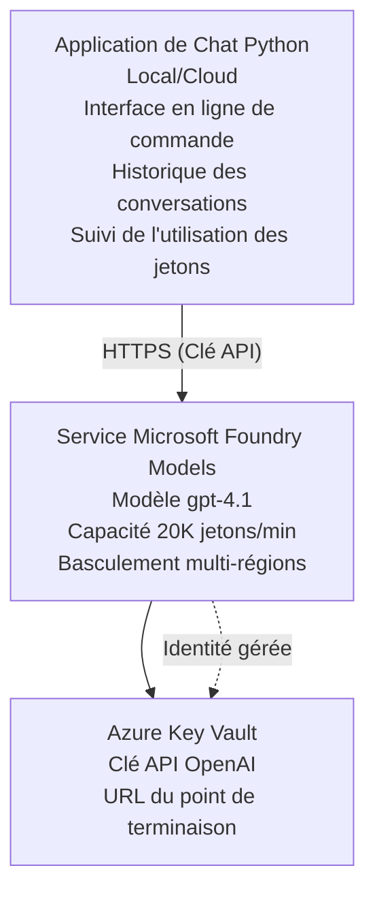

# Application de chat Microsoft Foundry Models

**Parcours d'apprentissage :** Intermédiaire ⭐⭐ | **Durée :** 35-45 minutes | **Coût :** 50-200 $/mois

Une application de chat complète Microsoft Foundry Models déployée à l'aide de Azure Developer CLI (azd). Cet exemple démontre le déploiement de gpt-4.1, un accès API sécurisé, et une interface de chat simple.

## 🎯 Ce que vous apprendrez

- Déployer le service Microsoft Foundry Models avec le modèle gpt-4.1
- Sécuriser les clés API OpenAI avec Key Vault
- Construire une interface de chat simple en Python
- Surveiller l'utilisation des jetons et les coûts
- Mettre en œuvre la limitation du débit et la gestion des erreurs

## 📦 Contenu inclus

✅ **Service Microsoft Foundry Models** - déploiement du modèle gpt-4.1  
✅ **Application de chat Python** - interface de chat simple en ligne de commande  
✅ **Intégration Key Vault** - stockage sécurisé des clés API  
✅ **Templates ARM** - infrastructure complète en tant que code  
✅ **Suivi des coûts** - suivi de l'utilisation des jetons  
✅ **Limitation du débit** - prévention de l'épuisement des quotas  

## Architecture



## Prérequis

### Obligatoires

- **Azure Developer CLI (azd)** - [Guide d'installation](https://learn.microsoft.com/azure/developer/azure-developer-cli/install-azd)
- **Abonnement Azure** avec accès OpenAI - [Demander l'accès](https://aka.ms/oai/access)
- **Python 3.9+** - [Installer Python](https://www.python.org/downloads/)

### Vérification des prérequis

```bash
# Vérifier la version d'azd (besoin de 1.5.0 ou supérieure)
azd version

# Vérifier la connexion Azure
azd auth login

# Vérifier la version de Python
python --version  # ou python3 --version

# Vérifier l'accès OpenAI (vérifier dans le portail Azure)
az cognitiveservices account list-skus \
  --kind OpenAI \
  --location eastus
```

> **⚠️ Important :** Microsoft Foundry Models nécessite une approbation d'application. Si vous n'avez pas encore postulé, rendez-vous sur [aka.ms/oai/access](https://aka.ms/oai/access). L'approbation prend généralement 1-2 jours ouvrables.

## ⏱️ Chronologie du déploiement

| Phase | Durée | Ce qui se passe |
|-------|-------|-----------------|
| Vérification des prérequis | 2-3 minutes | Vérification de la disponibilité du quota OpenAI |
| Déploiement de l'infrastructure | 8-12 minutes | Création d'OpenAI, Key Vault, déploiement du modèle |
| Configuration de l'application | 2-3 minutes | Configuration de l'environnement et des dépendances |
| **Total** | **12-18 minutes** | Prêt à discuter avec gpt-4.1 |

**Note :** Le premier déploiement OpenAI peut prendre plus de temps en raison de la mise à disposition du modèle.

## Démarrage rapide

```bash
# Naviguez vers l'exemple
cd examples/azure-openai-chat

# Initialiser l'environnement
azd env new myopenai

# Déployer tout (infrastructure + configuration)
azd up
# Vous serez invité à :
# 1. Sélectionner l'abonnement Azure
# 2. Choisir un emplacement avec disponibilité OpenAI (ex. : eastus, eastus2, westus)
# 3. Attendre 12-18 minutes pour le déploiement

# Installer les dépendances Python
pip install -r requirements.txt

# Commencez à discuter !
python chat.py
```

**Sortie attendue :**
```
🤖 Microsoft Foundry Models Chat Application
Connected to: gpt-4.1 (eastus)
Type your message (or 'quit' to exit)

You: Hello! Tell me about Microsoft Foundry Models.
Assistant: Microsoft Foundry Models Service provides REST API access to OpenAI's powerful language models including gpt-4.1, GPT-3.5-Turbo, and Embeddings...

[Tokens used: 145 | Estimated cost: $0.0044]
```

## ✅ Vérifier le déploiement

### Étape 1 : Vérifier les ressources Azure

```bash
# Voir les ressources déployées
azd show

# La sortie attendue montre :
# - Service OpenAI : (nom de la ressource)
# - Key Vault : (nom de la ressource)
# - Déploiement : gpt-4.1
# - Emplacement : eastus (ou votre région sélectionnée)
```

### Étape 2 : Tester l'API OpenAI

```bash
# Obtenir le point de terminaison et la clé OpenAI
OPENAI_ENDPOINT=$(azd env get-value AZURE_OPENAI_ENDPOINT)
OPENAI_KEY=$(azd env get-value AZURE_OPENAI_API_KEY)

# Tester l'appel API
curl "$OPENAI_ENDPOINT/openai/deployments/gpt-4.1/chat/completions?api-version=2024-08-01-preview" \
  -H "Content-Type: application/json" \
  -H "api-key: $OPENAI_KEY" \
  -d '{
    "messages": [{"role": "user", "content": "Say hello!"}],
    "max_tokens": 50
  }'
```

**Réponse attendue :**
```json
{
  "choices": [
    {
      "message": {
        "role": "assistant",
        "content": "Hello! How can I assist you today?"
      }
    }
  ],
  "usage": {
    "prompt_tokens": 8,
    "completion_tokens": 9,
    "total_tokens": 17
  }
}
```

### Étape 3 : Vérifier l'accès à Key Vault

```bash
# Lister les secrets dans Key Vault
KV_NAME=$(azd env get-value AZURE_KEY_VAULT_NAME)

az keyvault secret list \
  --vault-name $KV_NAME \
  --query "[].name" \
  --output table
```

**Secrets attendus :**
- `openai-api-key`
- `openai-endpoint`

**Critères de réussite :**
- ✅ Service OpenAI déployé avec gpt-4.1
- ✅ L'appel API retourne une complétion valide
- ✅ Secrets stockés dans Key Vault
- ✅ Le suivi de l'utilisation des jetons fonctionne

## Structure du projet

```
azure-openai-chat/
├── README.md                   ✅ This guide
├── azure.yaml                  ✅ AZD configuration
├── infra/                      ✅ Infrastructure as Code
│   ├── main.bicep             ✅ Main Bicep template
│   ├── main.parameters.json   ✅ Parameters
│   └── openai.bicep           ✅ OpenAI resource definition
├── src/                        ✅ Application code
│   ├── chat.py                ✅ Chat interface
│   ├── config.py              ✅ Configuration loader
│   └── requirements.txt       ✅ Python dependencies
└── .gitignore                  ✅ Git ignore rules
```

## Fonctionnalités de l'application

### Interface de chat (`chat.py`)

L'application de chat inclut :

- **Historique de conversation** - Maintient le contexte entre les messages
- **Comptage des jetons** - Suit l'utilisation et estime les coûts
- **Gestion des erreurs** - Gestion élégante des limitations de débit et des erreurs API
- **Estimation des coûts** - Calcul en temps réel du coût par message
- **Support du streaming** - Réponses en streaming optionnelles

### Commandes

En discutant, vous pouvez utiliser :
- `quit` ou `exit` - Terminer la session
- `clear` - Effacer l'historique de la conversation
- `tokens` - Afficher le total des jetons utilisés
- `cost` - Afficher le coût total estimé

### Configuration (`config.py`)

Charge la configuration depuis les variables d'environnement :
```python
AZURE_OPENAI_ENDPOINT  # Depuis le coffre de clés
AZURE_OPENAI_API_KEY   # Depuis le coffre de clés
AZURE_OPENAI_MODEL     # Par défaut : gpt-4.1
AZURE_OPENAI_MAX_TOKENS # Par défaut : 800
```

## Exemples d'utilisation

### Chat basique

```bash
python chat.py
```

### Chat avec un modèle personnalisé

```bash
export AZURE_OPENAI_MODEL=gpt-35-turbo
python chat.py
```

### Chat avec streaming

```bash
python chat.py --stream
```

### Conversation exemple

```
You: Explain Microsoft Foundry Models Service in 3 sentences.
Assistant: Microsoft Foundry Models Service is Microsoft Azure's cloud platform offering 
that provides access to OpenAI's powerful language models. It enables developers 
to integrate capabilities like gpt-4.1 into their applications with enterprise-grade 
security and compliance. The service includes features for content filtering, 
abuse monitoring, and responsible AI practices.

[Tokens used: 89 | Estimated cost: $0.0027]

You: What models are available?
Assistant: Microsoft Foundry Models Service offers several model families including gpt-4.1 
(most capable), GPT-3.5-Turbo (faster and cost-effective), and Embeddings models 
for vector search. Each model has different capabilities, pricing, and token limits.

[Tokens used: 67 | Estimated cost: $0.0020]

Total session: 156 tokens | $0.0047
```

## Gestion des coûts

### Tarification des jetons (gpt-4.1)

| Modèle | Entrée (par 1K jetons) | Sortie (par 1K jetons) |
|--------|------------------------|------------------------|
| gpt-4.1 | 0,03 $ | 0,06 $ |
| GPT-3.5-Turbo | 0,0015 $ | 0,002 $ |

### Coûts mensuels estimés

Selon les habitudes d'utilisation :

| Niveau d'utilisation | Messages/jour | Jetons/jour | Coût mensuel |
|----------------------|---------------|-------------|--------------|
| **Léger** | 20 messages | 3 000 jetons | 3-5 $ |
| **Modéré** | 100 messages | 15 000 jetons | 15-25 $ |
| **Intense** | 500 messages | 75 000 jetons | 75-125 $ |

**Coût d'infrastructure de base :** 1-2 $/mois (Key Vault + calcul minimal)

### Conseils pour optimiser les coûts

```bash
# 1. Utilisez GPT-3.5-Turbo pour les tâches plus simples (20 fois moins cher)
export AZURE_OPENAI_MODEL=gpt-35-turbo

# 2. Réduisez le nombre maximal de tokens pour des réponses plus courtes
export AZURE_OPENAI_MAX_TOKENS=400

# 3. Surveillez l'utilisation des tokens
python chat.py --show-tokens

# 4. Configurez des alertes de budget
az consumption budget create \
  --budget-name "openai-budget" \
  --amount 50 \
  --time-grain Monthly
```

## Surveillance

### Voir l'utilisation des jetons

```bash
# Dans le portail Azure :
# Ressource OpenAI → Métriques → Sélectionnez "Transaction de jetons"

# Ou via Azure CLI :
az monitor metrics list \
  --resource $(azd env get-value AZURE_OPENAI_RESOURCE_ID) \
  --metric "TokenTransaction" \
  --start-time $(date -u -d '1 hour ago' '+%Y-%m-%dT%H:%M:%S') \
  --interval PT1M
```

### Voir les journaux API

```bash
# Flux des journaux de diagnostic
az monitor diagnostic-settings create \
  --resource $(azd env get-value AZURE_OPENAI_RESOURCE_ID) \
  --name openai-logs \
  --logs '[{"category": "Audit", "enabled": true}]' \
  --workspace $(azd env get-value LOG_ANALYTICS_WORKSPACE_ID)

# Journal des requêtes
az monitor log-analytics query \
  --workspace $(azd env get-value LOG_ANALYTICS_WORKSPACE_ID) \
  --analytics-query "AzureDiagnostics | where Category == 'Audit' | top 10 by TimeGenerated"
```

## Dépannage

### Problème : Erreur "Accès refusé"

**Symptômes :** 403 Forbidden lors de l'appel API

**Solutions :**
```bash
# 1. Vérifiez que l'accès à OpenAI est approuvé
az cognitiveservices account show \
  --name $(azd env get-value AZURE_OPENAI_NAME) \
  --resource-group $(azd env get-value AZURE_RESOURCE_GROUP)

# 2. Vérifiez que la clé API est correcte
azd env get-value AZURE_OPENAI_API_KEY

# 3. Vérifiez le format de l'URL du point de terminaison
azd env get-value AZURE_OPENAI_ENDPOINT
# Doit être : https://[name].openai.azure.com/
```

### Problème : "Limite de débit dépassée"

**Symptômes :** 429 Trop de requêtes

**Solutions :**
```bash
# 1. Vérifier le quota actuel
az cognitiveservices account deployment show \
  --name $(azd env get-value AZURE_OPENAI_NAME) \
  --resource-group $(azd env get-value AZURE_RESOURCE_GROUP) \
  --deployment-name gpt-4.1

# 2. Demander une augmentation de quota (si nécessaire)
# Aller au portail Azure → Ressource OpenAI → Quotas → Demander une augmentation

# 3. Implémenter la logique de nouvelle tentative (déjà dans chat.py)
# L'application réessaie automatiquement avec un backoff exponentiel
```

### Problème : "Modèle non trouvé"

**Symptômes :** Erreur 404 pour le déploiement

**Solutions :**
```bash
# 1. Lister les déploiements disponibles
az cognitiveservices account deployment list \
  --name $(azd env get-value AZURE_OPENAI_NAME) \
  --resource-group $(azd env get-value AZURE_RESOURCE_GROUP)

# 2. Vérifier le nom du modèle dans l'environnement
echo $AZURE_OPENAI_MODEL

# 3. Mettre à jour avec le nom de déploiement correct
export AZURE_OPENAI_MODEL=gpt-4.1  # ou gpt-35-turbo
```

### Problème : Latence élevée

**Symptômes :** Temps de réponse lent (>5 secondes)

**Solutions :**
```bash
# 1. Vérifier la latence régionale
# Déployer dans la région la plus proche des utilisateurs

# 2. Réduire max_tokens pour des réponses plus rapides
export AZURE_OPENAI_MAX_TOKENS=400

# 3. Utiliser le streaming pour une meilleure expérience utilisateur
python chat.py --stream
```

## Bonnes pratiques de sécurité

### 1. Protéger les clés API

```bash
# Ne jamais commettre les clés dans le contrôle de version
# Utilisez Key Vault (déjà configuré)

# Faites tourner les clés régulièrement
az cognitiveservices account keys regenerate \
  --name $(azd env get-value AZURE_OPENAI_NAME) \
  --resource-group $(azd env get-value AZURE_RESOURCE_GROUP) \
  --key-name key1
```

### 2. Mettre en œuvre un filtrage de contenu

```python
# Microsoft Foundry Models inclut un filtrage de contenu intégré
# Configurer dans le portail Azure :
# Ressource OpenAI → Filtres de contenu → Créer un filtre personnalisé

# Catégories : Haine, Sexuel, Violence, Automutilation
# Niveaux : filtrage Faible, Moyen, Élevé
```

### 3. Utiliser l'identité gérée (production)

```bash
# Pour les déploiements en production, utilisez une identité gérée
# au lieu des clés API (nécessite l'hébergement de l'application sur Azure)

# Mettez à jour infra/openai.bicep pour inclure :
# identity: { type: 'SystemAssigned' }
```

## Développement

### Exécuter localement

```bash
# Installer les dépendances
pip install -r src/requirements.txt

# Définir les variables d'environnement
export AZURE_OPENAI_ENDPOINT="https://[name].openai.azure.com/"
export AZURE_OPENAI_API_KEY="your-api-key"
export AZURE_OPENAI_MODEL="gpt-4.1"

# Exécuter l'application
python src/chat.py
```

### Exécuter les tests

```bash
# Installer les dépendances de test
pip install pytest pytest-cov

# Exécuter les tests
pytest tests/ -v

# Avec couverture
pytest tests/ --cov=src --cov-report=html
```

### Mettre à jour le déploiement du modèle

```bash
# Déployer différentes versions du modèle
az cognitiveservices account deployment create \
  --name $(azd env get-value AZURE_OPENAI_NAME) \
  --resource-group $(azd env get-value AZURE_RESOURCE_GROUP) \
  --deployment-name gpt-35-turbo \
  --model-name gpt-35-turbo \
  --model-version "0613" \
  --model-format OpenAI \
  --sku-capacity 20 \
  --sku-name "Standard"
```

## Nettoyage

```bash
# Supprimer toutes les ressources Azure
azd down --force --purge

# Cela supprime :
# - Service OpenAI
# - Key Vault (avec suppression douce de 90 jours)
# - Groupe de ressources
# - Tous les déploiements et configurations
```

## Étapes suivantes

### Développer cet exemple

1. **Ajouter une interface web** - Construire un frontend React/Vue  
   ```bash
   # Ajouter le service frontend dans azure.yaml
   # Déployer sur Azure Static Web Apps
   ```

2. **Implémenter RAG** - Ajouter la recherche documentaire avec Azure AI Search  
   ```python
   # Intégrer Azure AI Search
   # Télécharger des documents et créer un index vectoriel
   ```

3. **Ajouter l'appel de fonctions** - Permettre l'utilisation d'outils  
   ```python
   # Définir des fonctions dans chat.py
   # Permettre à gpt-4.1 d'appeler des API externes
   ```

4. **Support multi-modèles** - Déployer plusieurs modèles  
   ```bash
   # Ajouter gpt-35-turbo, modèles d'incorporation
   # Implémenter la logique de routage du modèle
   ```

### Exemples connexes

- **[Multi-agent Retail](../retail-scenario.md)** - Architecture multi-agent avancée
- **[Application base de données](../../../../examples/database-app)** - Ajouter un stockage persistant
- **[Container Apps](../../../../examples/container-app)** - Déployer en service conteneurisé

### Ressources d'apprentissage

- 📚 [Cours AZD pour débutants](../../README.md) - Page d'accueil du cours principal
- 📚 [Documentation Microsoft Foundry Models](https://learn.microsoft.com/azure/ai-services/openai/) - Documentation officielle
- 📚 [Référence API OpenAI](https://platform.openai.com/docs/api-reference) - Détails API
- 📚 [IA Responsable](https://www.microsoft.com/ai/responsible-ai) - Meilleures pratiques

## Ressources supplémentaires

### Documentation
- **[Service Microsoft Foundry Models](https://learn.microsoft.com/azure/ai-services/openai/)** - Guide complet
- **[Modèles gpt-4.1](https://learn.microsoft.com/azure/ai-services/openai/concepts/models)** - Capacités des modèles
- **[Filtrage de contenu](https://learn.microsoft.com/azure/ai-services/openai/concepts/content-filter)** - Fonctionnalités de sécurité
- **[Azure Developer CLI](https://learn.microsoft.com/azure/developer/azure-developer-cli/)** - Référence azd

### Tutoriels
- **[Démarrage rapide OpenAI](https://learn.microsoft.com/azure/ai-services/openai/quickstart)** - Premier déploiement
- **[Chat completions](https://learn.microsoft.com/azure/ai-services/openai/how-to/chatgpt)** - Construction d'applications de chat
- **[Appel de fonctions](https://learn.microsoft.com/azure/ai-services/openai/how-to/function-calling)** - Fonctions avancées

### Outils
- **[Microsoft Foundry Models Studio](https://oai.azure.com/)** - Bac à sable web
- **[Guide d'ingénierie de prompt](https://platform.openai.com/docs/guides/prompt-engineering)** - Rédiger de meilleurs prompts
- **[Calculateur de jetons](https://platform.openai.com/tokenizer)** - Estimer l'utilisation des jetons

### Communauté
- **[Azure AI Discord](https://discord.gg/azure)** - Obtenez de l'aide de la communauté
- **[Discussions GitHub](https://github.com/Azure-Samples/openai/discussions)** - Forum questions/réponses
- **[Blog Azure](https://azure.microsoft.com/blog/tag/azure-openai-service/)** - Dernières mises à jour

---

**🎉 Succès !** Vous avez déployé Microsoft Foundry Models et construit une application de chat fonctionnelle. Commencez à explorer les capacités de gpt-4.1 et expérimentez avec différents prompts et cas d'usage.

**Des questions ?** [Ouvrez un ticket](https://github.com/microsoft/AZD-for-beginners/issues) ou consultez la [FAQ](../../resources/faq.md)

**Alerte coût :** Pensez à exécuter `azd down` une fois vos tests terminés pour éviter des frais continus (~50-100 $/mois pour une utilisation active).

---

<!-- CO-OP TRANSLATOR DISCLAIMER START -->
**Avertissement** :
Ce document a été traduit à l'aide du service de traduction automatique [Co-op Translator](https://github.com/Azure/co-op-translator). Bien que nous nous efforçions d'assurer l'exactitude, veuillez noter que les traductions automatisées peuvent contenir des erreurs ou des inexactitudes. Le document original dans sa langue native doit être considéré comme la source faisant autorité. Pour les informations critiques, il est recommandé de recourir à une traduction professionnelle réalisée par un humain. Nous ne saurions être tenus responsables des malentendus ou erreurs d'interprétation découlant de l'utilisation de cette traduction.
<!-- CO-OP TRANSLATOR DISCLAIMER END -->