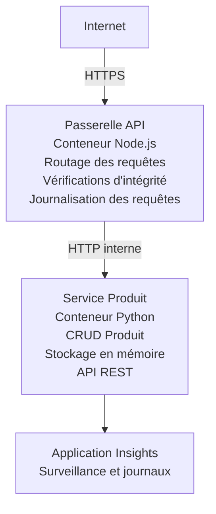

# Microservices Architecture - Container App Example

⏱️ **Temps estimé** : 25-35 minutes | 💰 **Coût estimé** : ~50-100 $/mois | ⭐ **Complexité** : Avancé

Une architecture de microservices **simplifiée mais fonctionnelle** déployée sur Azure Container Apps en utilisant AZD CLI. Cet exemple illustre la communication service-à-service, l'orchestration de conteneurs et la surveillance avec une configuration pratique de 2 services.

> **📚 Approche d'apprentissage** : Cet exemple commence par une architecture minimale à 2 services (Passerelle API + Service Produit) que vous pouvez réellement déployer et étudier. Après avoir maîtrisé cette base, nous fournissons des conseils pour étendre vers un écosystème microservices complet.

## Ce que vous apprendrez

En complétant cet exemple, vous allez :
- Déployer plusieurs conteneurs sur Azure Container Apps
- Implémenter la communication service-à-service avec un réseau interne
- Configurer la mise à l'échelle basée sur l'environnement et les vérifications de santé
- Surveiller des applications distribuées avec Application Insights
- Comprendre les patterns de déploiement des microservices et les meilleures pratiques
- Apprendre à étendre progressivement d'architectures simples à complexes

## Architecture

### Phase 1 : Ce que nous construisons (inclus dans cet exemple)


**Pourquoi commencer simple ?**
- ✅ Déployer et comprendre rapidement (25-35 minutes)
- ✅ Apprendre les patterns de base des microservices sans complexité
- ✅ Code fonctionnel que vous pouvez modifier et expérimenter
- ✅ Coût plus faible pour l'apprentissage (~50-100 $/mois contre 300-1400 $/mois)
- ✅ Prendre confiance avant d'ajouter des bases de données et des files de messages

**Analogie** : Pensez à cela comme apprendre à conduire. Vous commencez sur un parking vide (2 services), maîtrisez les bases, puis progressez vers la circulation en ville (5+ services avec bases de données).

### Phase 2 : Expansion future (architecture de référence)

Une fois que vous maîtrisez l'architecture à 2 services, vous pouvez étendre vers :

```
Full Architecture (Not Included - For Reference)
├── API Gateway (✅ Included)
├── Product Service (✅ Included)
├── Order Service (🔜 Add next)
├── User Service (🔜 Add next)
├── Notification Service (🔜 Add last)
├── Azure Service Bus (🔜 For async communication)
├── Cosmos DB (🔜 For product persistence)
├── Azure SQL (🔜 For order management)
└── Azure Storage (🔜 For file storage)
```

Voir la section « Guide d'expansion » à la fin pour des instructions étape par étape.

## Fonctionnalités incluses

✅ **Découverte de services** : Découverte automatique basée sur DNS entre conteneurs  
✅ **Répartition de charge** : Répartition de charge intégrée entre les réplicas  
✅ **Mise à l'échelle automatique** : Mise à l'échelle indépendante par service basée sur les requêtes HTTP  
✅ **Surveillance de la santé** : Probes de liveness et readiness pour les deux services  
✅ **Journalisation distribuée** : Journalisation centralisée avec Application Insights  
✅ **Réseau interne** : Communication sécurisée service-à-service  
✅ **Orchestration de conteneurs** : Déploiement et mise à l'échelle automatiques  
✅ **Mises à jour sans interruption** : Mises à jour progressives avec gestion des révisions  

## Prérequis

### Outils requis

Avant de commencer, vérifiez que vous avez ces outils installés :

1. **[Azure Developer CLI (azd)](https://learn.microsoft.com/azure/developer/azure-developer-cli/install-azd)** (version 1.0.0 ou supérieure)
   ```bash
   azd version
   # Résultat attendu : azd version 1.0.0 ou supérieure
   ```

2. **[Azure CLI](https://learn.microsoft.com/cli/azure/install-azure-cli)** (version 2.50.0 ou supérieure)
   ```bash
   az --version
   # Sortie attendue : azure-cli 2.50.0 ou supérieur
   ```

3. **[Docker](https://www.docker.com/get-started)** (pour le développement/local - optionnel)
   ```bash
   docker --version
   # Sortie attendue : Docker version 20.10 ou supérieure
   ```

### Exigences Azure

- Un **abonnement Azure** actif ([créez un compte gratuit](https://azure.microsoft.com/free/))
- Autorisations pour créer des ressources dans votre abonnement
- Rôle **Contributor** sur l'abonnement ou le groupe de ressources

### Connaissances préalables

Ceci est un exemple de niveau **avancé**. Vous devriez avoir :
- Complété l'[Exemple Simple Flask API](../../../../../examples/container-app/simple-flask-api) 
- Compréhension de base de l'architecture microservices
- Familiarité avec les API REST et HTTP
- Compréhension des concepts de conteneurs

**Nouveau sur Container Apps ?** Commencez d'abord par l'[Exemple Simple Flask API](../../../../../examples/container-app/simple-flask-api) pour apprendre les bases.

## Démarrage rapide (étape par étape)

### Étape 1 : Cloner et naviguer

```bash
git clone https://github.com/microsoft/AZD-for-beginners.git
cd AZD-for-beginners/examples/container-app/microservices
```

**✓ Vérification de réussite** : Vérifiez que vous voyez `azure.yaml` :
```bash
ls
# Attendu : README.md, azure.yaml, infra/, src/
```

### Étape 2 : Authentification auprès d'Azure

```bash
azd auth login
```

Cela ouvre votre navigateur pour l'authentification Azure. Connectez-vous avec vos identifiants Azure.

**✓ Vérification de réussite** : Vous devriez voir :
```
Logged in to Azure.
```

### Étape 3 : Initialiser l'environnement

```bash
azd init
```

**Invites que vous verrez** :
- **Nom de l'environnement** : Entrez un nom court (par ex., `microservices-dev`)
- **Abonnement Azure** : Sélectionnez votre abonnement
- **Région Azure** : Choisissez une région (par ex., `eastus`, `westeurope`)

**✓ Vérification de réussite** : Vous devriez voir :
```
SUCCESS: New project initialized!
```

### Étape 4 : Déployer l'infrastructure et les services

```bash
azd up
```

**Ce qui se passe** (prend 8-12 minutes) :
1. Crée l'environnement Container Apps
2. Crée Application Insights pour la surveillance
3. Construit le conteneur de la passerelle API (Node.js)
4. Construit le conteneur du service produit (Python)
5. Déploie les deux conteneurs sur Azure
6. Configure le réseau et les vérifications de santé
7. Met en place la surveillance et la journalisation

**✓ Vérification de réussite** : Vous devriez voir :
```
SUCCESS: Your application was deployed to Azure in X minutes Y seconds.
Endpoint: https://api-gateway-<unique-id>.azurecontainerapps.io
```

**⏱️ Temps** : 8-12 minutes

### Étape 5 : Tester le déploiement

```bash
# Obtenir le point de terminaison de la passerelle
GATEWAY_URL=$(azd env get-values | grep API_GATEWAY_URL | cut -d '=' -f2 | tr -d '"')

# Tester la santé de l'API Gateway
curl $GATEWAY_URL/health

# Sortie attendue:
# {"statut":"fonctionnel","service":"api-gateway","horodatage":"2025-11-19T10:30:00Z"}
```

**Tester le service produit via la passerelle** :
```bash
# Lister les produits
curl $GATEWAY_URL/api/products

# Sortie attendue:
# [
#   {"id":1,"name":"Ordinateur portable","price":999.99,"stock":50},
#   {"id":2,"name":"Souris","price":29.99,"stock":200},
#   {"id":3,"name":"Clavier","price":79.99,"stock":150}
# ]
```

**✓ Vérification de réussite** : Les deux endpoints retournent des données JSON sans erreurs.

---

**🎉 Félicitations !** Vous avez déployé une architecture de microservices sur Azure !

## Structure du projet

Tous les fichiers d'implémentation sont inclus — il s'agit d'un exemple complet et fonctionnel :

```
microservices/
│
├── README.md                         # This file
├── azure.yaml                        # AZD configuration
├── .gitignore                        # Git ignore patterns
│
├── infra/                           # Infrastructure as Code (Bicep)
│   ├── main.bicep                   # Main orchestration
│   ├── abbreviations.json           # Naming conventions
│   ├── core/                        # Shared infrastructure
│   │   ├── container-apps-environment.bicep  # Container environment + registry
│   │   └── monitor.bicep            # Application Insights + Log Analytics
│   └── app/                         # Service definitions
│       ├── api-gateway.bicep        # API Gateway container app
│       └── product-service.bicep    # Product Service container app
│
└── src/                             # Application source code
    ├── api-gateway/                 # Node.js API Gateway
    │   ├── app.js                   # Express server with routing
    │   ├── package.json             # Node dependencies
    │   └── Dockerfile               # Container definition
    └── product-service/             # Python Product Service
        ├── main.py                  # Flask API with product data
        ├── requirements.txt         # Python dependencies
        └── Dockerfile               # Container definition
```

**Ce que fait chaque composant :**

**Infrastructure (infra/)** :
- `main.bicep` : Orchestre toutes les ressources Azure et leurs dépendances
- `core/container-apps-environment.bicep` : Crée l'environnement Container Apps et Azure Container Registry
- `core/monitor.bicep` : Met en place Application Insights pour la journalisation distribuée
- `app/*.bicep` : Définitions individuelles des container apps avec la mise à l'échelle et les vérifications de santé

**Passerelle API (src/api-gateway/)** :
- Service exposé au public qui redirige les requêtes vers les services backend
- Implémente la journalisation, la gestion des erreurs et le transfert de requêtes
- Démontre la communication HTTP service-à-service

**Service Produit (src/product-service/)** :
- Service interne avec catalogue de produits (en mémoire pour simplicité)
- API REST avec vérifications de santé
- Exemple de pattern de microservice backend

## Aperçu des services

### Passerelle API (Node.js/Express)

**Port** : 8080  
**Accès** : Public (ingress externe)  
**Objectif** : Rediriger les requêtes entrantes vers les services backend  

**Endpoints** :
- `GET /` - Informations sur le service
- `GET /health` - Endpoint de vérification de santé
- `GET /api/products` - Transfère vers le service produit (liste complète)
- `GET /api/products/:id` - Transfère vers le service produit (récupérer par ID)

**Principales fonctionnalités** :
- Routage des requêtes avec axios
- Journalisation centralisée
- Gestion des erreurs et des timeouts
- Découverte de services via variables d'environnement
- Intégration Application Insights

**Extrait de code** (`src/api-gateway/app.js`) :
```javascript
// Communication interne entre services
app.get('/api/products', async (req, res) => {
  const response = await axios.get(`${PRODUCT_SERVICE_URL}/products`);
  res.json(response.data);
});
```

### Service Produit (Python/Flask)

**Port** : 8000  
**Accès** : Interne uniquement (pas d'ingress externe)  
**Objectif** : Gérer le catalogue produit avec des données en mémoire  

**Endpoints** :
- `GET /` - Informations sur le service
- `GET /health` - Endpoint de vérification de santé
- `GET /products` - Lister tous les produits
- `GET /products/<id>` - Obtenir un produit par ID

**Principales fonctionnalités** :
- API RESTful avec Flask
- Stockage de produits en mémoire (simple, pas de base de données nécessaire)
- Surveillance de la santé avec probes
- Journalisation structurée
- Intégration Application Insights

**Modèle de données** :
```python
{
  "id": 1,
  "name": "Laptop",
  "description": "High-performance laptop",
  "price": 999.99,
  "stock": 50
}
```

**Pourquoi interne uniquement ?**
Le service produit n'est pas exposé publiquement. Toutes les requêtes doivent passer par la passerelle API, qui offre :
- Sécurité : Point d'accès contrôlé
- Flexibilité : Permet de modifier le backend sans impacter les clients
- Surveillance : Journalisation centralisée des requêtes

## Comprendre la communication entre services

### Comment les services communiquent entre eux

Dans cet exemple, la passerelle API communique avec le service produit en utilisant des **appels HTTP internes** :

```javascript
// Passerelle API (src/api-gateway/app.js)
const PRODUCT_SERVICE_URL = process.env.PRODUCT_SERVICE_URL;

// Effectuer une requête HTTP interne
const response = await axios.get(`${PRODUCT_SERVICE_URL}/products`);
```

**Points clés** :

1. **Découverte basée sur DNS** : Container Apps fournit automatiquement un DNS pour les services internes
   - Product Service FQDN : `product-service.internal.<environment>.azurecontainerapps.io`
   - Simplifié en : `http://product-service` (Container Apps résout cela)

2. **Pas d'exposition publique** : Le service produit a `external: false` dans Bicep
   - Accessible uniquement au sein de l'environnement Container Apps
   - Injoignable depuis Internet

3. **Variables d'environnement** : Les URLs des services sont injectées au moment du déploiement
   - Bicep transmet le FQDN interne à la passerelle
   - Pas d'URLs codées en dur dans le code applicatif

**Analogie** : Imaginez cela comme des bureaux. La passerelle API est l'accueil (exposé au public), et le service produit est un bureau (interne uniquement). Les visiteurs doivent passer par l'accueil pour atteindre un bureau.

## Options de déploiement

### Déploiement complet (recommandé)

```bash
# Déployer l'infrastructure et les deux services
azd up
```

Cela déploie :
1. L'environnement Container Apps
2. Application Insights
3. Le Container Registry
4. Le conteneur de la passerelle API
5. Le conteneur du service produit

**Temps** : 8-12 minutes

### Déployer un service individuel

```bash
# Déployer un seul service (après l'exécution initiale de 'azd up')
azd deploy api-gateway

# Ou déployer le service produit
azd deploy product-service
```

**Cas d'utilisation** : Lorsque vous avez mis à jour le code d'un service et que vous ne souhaitez redéployer que ce service.

### Mettre à jour la configuration

```bash
# Modifier les paramètres de mise à l'échelle
azd env set GATEWAY_MAX_REPLICAS 30

# Redéployer avec la nouvelle configuration
azd up
```

## Configuration

### Configuration de la mise à l'échelle

Les deux services sont configurés avec une mise à l'échelle automatique basée sur HTTP dans leurs fichiers Bicep :

**Passerelle API** :
- Réplicas min : 2 (au moins 2 pour la disponibilité)
- Réplicas max : 20
- Déclencheur de mise à l'échelle : 50 requêtes concurrentes par réplica

**Service Produit** :
- Réplicas min : 1 (peut monter à zéro si nécessaire)
- Réplicas max : 10
- Déclencheur de mise à l'échelle : 100 requêtes concurrentes par réplica

**Personnaliser la mise à l'échelle** (dans `infra/app/*.bicep`) :
```bicep
scale: {
  minReplicas: 1
  maxReplicas: 10
  rules: [
    {
      name: 'http-scale-rule'
      http: {
        metadata: {
          concurrentRequests: '100'  // Adjust this
        }
      }
    }
  ]
}
```

### Allocation des ressources

**Passerelle API** :
- CPU : 1.0 vCPU
- Mémoire : 2 GiB
- Raison : Gère tout le trafic externe

**Service Produit** :
- CPU : 0.5 vCPU
- Mémoire : 1 GiB
- Raison : Opérations légères en mémoire

### Vérifications de santé

Les deux services incluent des probes de liveness et readiness :

```bicep
probes: [
  {
    type: 'Liveness'
    httpGet: {
      path: '/health'
      port: 8080
    }
    initialDelaySeconds: 10
    periodSeconds: 30
  }
  {
    type: 'Readiness'
    httpGet: {
      path: '/health'
      port: 8080
    }
    initialDelaySeconds: 5
    periodSeconds: 10
  }
]
```

**Que cela signifie** :
- **Liveness** : Si la vérification échoue, Container Apps redémarre le conteneur
- **Readiness** : Si non prêt, Container Apps cesse d'envoyer du trafic à ce réplica


## Surveillance et observabilité

### Voir les logs des services

```bash
# Afficher les journaux avec azd monitor
azd monitor --logs

# Ou utilisez l'Azure CLI pour des Container Apps spécifiques :
# Afficher en continu les journaux de l'API Gateway
az containerapp logs show --name api-gateway --resource-group $RG_NAME --follow

# Afficher les journaux récents du service produit
az containerapp logs show --name product-service --resource-group $RG_NAME --tail 100
```

**Sortie attendue** :
```
[api-gateway] API Gateway listening on port 8080
[api-gateway] Product Service URL: http://product-service
[api-gateway] GET /api/products 200 - 45ms
[product-service] Retrieved 5 products
```

### Requêtes Application Insights

Accédez à Application Insights dans le portail Azure, puis exécutez ces requêtes :

**Trouver les requêtes lentes** :
```kusto
requests
| where timestamp > ago(1h)
| where duration > 1000  // Requests taking >1 second
| summarize count() by name, cloud_RoleName
| order by count_ desc
```

**Suivre les appels service-à-service** :
```kusto
dependencies
| where timestamp > ago(1h)
| where type == "Http"
| project timestamp, name, target, duration, success
| order by timestamp desc
```

**Taux d'erreur par service** :
```kusto
exceptions
| where timestamp > ago(24h)
| summarize errorCount = count() by cloud_RoleName, type
| order by errorCount desc
```

**Volume de requêtes dans le temps** :
```kusto
requests
| where timestamp > ago(1h)
| summarize requestCount = count() by bin(timestamp, 5m), cloud_RoleName
| render timechart
```

### Accéder au tableau de bord de surveillance

```bash
# Obtenir les détails d'Application Insights
azd env get-values | grep APPLICATIONINSIGHTS

# Ouvrir la surveillance du portail Azure
az monitor app-insights component show \
  --app $(azd env get-values | grep APPLICATIONINSIGHTS_CONNECTION_STRING | cut -d '=' -f2) \
  --resource-group $(azd env get-values | grep AZURE_RESOURCE_GROUP | cut -d '=' -f2) \
  --query "appId" -o tsv
```

### Métriques en direct

1. Naviguez vers Application Insights dans le portail Azure
2. Cliquez sur "Live Metrics"
3. Voyez les requêtes, échecs et performances en temps réel
4. Testez en exécutant : `curl $(azd env get-values | grep API_GATEWAY_URL | cut -d '=' -f2 | tr -d '"')/api/products`

## Exercices pratiques

[Note : Voir les exercices complets ci-dessus dans la section "Exercices pratiques" pour des exercices détaillés étape par étape incluant la vérification du déploiement, la modification des données, les tests d'autoscaling, la gestion des erreurs et l'ajout d'un troisième service.]

## Analyse des coûts

### Coûts mensuels estimés (pour cet exemple à 2 services)

| Resource | Configuration | Estimated Cost |
|----------|--------------|----------------|
| Passerelle API | 2-20 replicas, 1 vCPU, 2GB RAM | $30-150 |
| Service Produit | 1-10 replicas, 0.5 vCPU, 1GB RAM | $15-75 |
| Container Registry | Basic tier | $5 |
| Application Insights | 1-2 GB/month | $5-10 |
| Log Analytics | 1 GB/month | $3 |
| **Total** | | **$58-243/month** |

**Répartition des coûts selon l'utilisation** :
- **Trafic léger** (tests/apprentissage) : ~60 $/mois
- **Trafic modéré** (petite production) : ~120 $/mois
- **Trafic élevé** (périodes chargées) : ~240 $/mois

### Conseils d'optimisation des coûts

1. **Mettre à l'échelle à zéro pour le développement** :
   ```bicep
   scale: {
     minReplicas: 0  // Save $30-40/month when not in use
     maxReplicas: 10
   }
   ```

2. **Utiliser le plan Consumption pour Cosmos DB** (lorsque vous l'ajoutez) :
   - Payez seulement pour ce que vous utilisez
   - Pas de charge minimale

3. **Configurer le sampling dans Application Insights** :
   ```javascript
   appInsights.defaultClient.config.samplingPercentage = 50; // Échantillonner 50 % des requêtes
   ```

4. **Nettoyer lorsque ce n'est pas nécessaire** :
   ```bash
   azd down
   ```

### Options de niveau gratuit

Pour l'apprentissage / les tests, envisagez :
- Utilisez les crédits gratuits Azure (30 premiers jours)
- Limitez le nombre de réplicas au minimum
- Supprimez après les tests (pas de frais continus)

---

## Nettoyage

Pour éviter des frais continus, supprimez toutes les ressources :

```bash
azd down --force --purge
```

**Invite de confirmation**:
```
? Total resources to delete: 6, are you sure you want to continue? (y/N)
```

Tapez `y` pour confirmer.

**Ce qui sera supprimé**:
- Environnement Container Apps
- Les deux Container Apps (passerelle & service produit)
- Registre de conteneurs
- Application Insights
- Espace de travail Log Analytics
- Groupe de ressources

**✓ Vérifier le nettoyage**:
```bash
az group list --query "[?starts_with(name,'rg-microservices')]" --output table
```

Devrait être vide.

---

## Guide d'extension : de 2 à 5+ services

Une fois que vous avez maîtrisé cette architecture à 2 services, voici comment l'étendre :

### Phase 1 : Ajouter une persistance de base de données (Étape suivante)

**Ajouter Cosmos DB pour le service produit**:

1. Créez `infra/core/cosmos.bicep`:
   ```bicep
   resource cosmosAccount 'Microsoft.DocumentDB/databaseAccounts@2023-04-15' = {
     name: name
     location: location
     kind: 'GlobalDocumentDB'
     properties: {
       databaseAccountOfferType: 'Standard'
       locations: [{ locationName: location, failoverPriority: 0 }]
     }
   }
   ```

2. Mettez à jour le service produit pour utiliser Cosmos DB au lieu de données en mémoire

3. Coût additionnel estimé : ~25 $/mois (serverless)

### Phase 2 : Ajouter un troisième service (gestion des commandes)

**Créer le service de commandes**:

1. Nouveau dossier : `src/order-service/` (Python/Node.js/C#)
2. Nouveau Bicep : `infra/app/order-service.bicep`
3. Mettez à jour la passerelle API pour acheminer `/api/orders`
4. Ajoutez une base de données Azure SQL pour la persistance des commandes

**L'architecture devient**:
```
API Gateway → Product Service (Cosmos DB)
           → Order Service (Azure SQL)
```

### Phase 3 : Ajouter une communication asynchrone (Service Bus)

**Mettre en œuvre une architecture orientée événements**:

1. Ajoutez Azure Service Bus : `infra/core/servicebus.bicep`
2. Le service produit publie des événements "ProductCreated"
3. Le service de commandes s'abonne aux événements produits
4. Ajoutez un service de notification pour traiter les événements

**Modèle** : Requête/Réponse (HTTP) + Orienté événements (Service Bus)

### Phase 4 : Ajouter l'authentification utilisateur

**Implémenter le service utilisateur**:

1. Créez `src/user-service/` (Go/Node.js)
2. Ajoutez Azure AD B2C ou une authentification JWT personnalisée
3. La passerelle API valide les jetons
4. Les services vérifient les autorisations des utilisateurs

### Phase 5 : Préparation à la production

**Ajouter ces composants**:
- Azure Front Door (équilibrage de charge global)
- Azure Key Vault (gestion des secrets)
- Azure Monitor Workbooks (tableaux de bord personnalisés)
- Pipeline CI/CD (GitHub Actions)
- Déploiements Blue-Green
- Identité gérée pour tous les services

**Coût d'une architecture de production complète** : ~300-1 400 $/mois

---

## En savoir plus

### Documentation connexe
- [Documentation Azure Container Apps](https://learn.microsoft.com/azure/container-apps/)
- [Guide d'architecture des microservices](https://learn.microsoft.com/azure/architecture/guide/architecture-styles/microservices)
- [Application Insights pour le traçage distribué](https://learn.microsoft.com/azure/azure-monitor/app/distributed-tracing)
- [Documentation Azure Developer CLI](https://learn.microsoft.com/azure/developer/azure-developer-cli/)

### Prochaines étapes de ce cours
- ← Précédent : [Simple Flask API](../../../../../examples/container-app/simple-flask-api) - Exemple débutant à conteneur unique
- → Suivant : [Guide d'intégration IA](../../../../../examples/docs/ai-foundry) - Ajouter des capacités IA
- 🏠 [Accueil du cours](../../README.md)

### Comparaison : quand utiliser quoi

**Application conteneur unique** (exemple Simple Flask API) :
- ✅ Applications simples
- ✅ Architecture monolithique
- ✅ Déploiement rapide
- ❌ Scalabilité limitée
- **Coût** : ~15-50 $/mois

**Microservices** (cet exemple) :
- ✅ Applications complexes
- ✅ Mise à l'échelle indépendante par service
- ✅ Autonomie des équipes (services différents, équipes différentes)
- ❌ Plus complexe à gérer
- **Coût** : ~60-250 $/mois

**Kubernetes (AKS)**:
- ✅ Contrôle et flexibilité maximaux
- ✅ Portabilité multi-cloud
- ✅ Mise en réseau avancée
- ❌ Nécessite une expertise Kubernetes
- **Coût** : ~150-500 $/mois minimum

**Recommandation** : Commencez par Container Apps (cet exemple), passez à AKS uniquement si vous avez besoin de fonctionnalités spécifiques à Kubernetes.

---

## Questions fréquemment posées

**Q : Pourquoi seulement 2 services au lieu de 5+ ?**  
A : Progression pédagogique. Maîtrisez les fondamentaux (communication entre services, supervision, mise à l'échelle) avec un exemple simple avant d'ajouter de la complexité. Les modèles appris ici s'appliquent aux architectures à 100 services.

**Q : Puis-je ajouter plus de services moi-même ?**  
A : Absolument ! Suivez le guide d'extension ci‑dessus. Chaque nouveau service suit le même modèle : créer le dossier src, créer le fichier Bicep, mettre à jour azure.yaml, déployer.

**Q : Est-ce prêt pour la production ?**  
A : C'est une base solide. Pour la production, ajoutez : identité gérée, Key Vault, bases de données persistantes, pipeline CI/CD, alertes de supervision et stratégie de sauvegarde.

**Q : Pourquoi ne pas utiliser Dapr ou un autre maillage de services ?**  
A : Restez simple pour l'apprentissage. Une fois que vous avez compris la mise en réseau native de Container Apps, vous pouvez ajouter Dapr pour des scénarios avancés.

**Q : Comment déboguer localement ?**  
A : Exécutez les services localement avec Docker :
```bash
cd src/api-gateway
docker build -t local-gateway .
docker run -p 8080:8080 -e PRODUCT_SERVICE_URL=http://localhost:8000 local-gateway
```

**Q : Puis-je utiliser différents langages de programmation ?**  
A : Oui ! Cet exemple montre Node.js (passerelle) + Python (service produit). Vous pouvez mélanger n'importe quels langages exécutables dans des conteneurs.

**Q : Et si je n'ai pas de crédits Azure ?**  
A : Utilisez le niveau gratuit Azure (30 premiers jours pour les nouveaux comptes) ou déployez pour de courtes périodes de test et supprimez immédiatement.

---

> **🎓 Résumé du parcours d'apprentissage** : Vous avez appris à déployer une architecture multi-service avec mise à l'échelle automatique, mise en réseau interne, supervision centralisée et modèles prêts pour la production. Cette base vous prépare à des systèmes distribués complexes et à des architectures microservices d'entreprise.

**📚 Navigation du cours :**
- ← Précédent : [Simple Flask API](../../../../../examples/container-app/simple-flask-api)
- → Suivant : [Exemple d'intégration de base de données](../../../../../examples/database-app)
- 🏠 [Accueil du cours](../../../README.md)
- 📖 [Bonnes pratiques Container Apps](../../../docs/chapter-04-infrastructure/deployment-guide.md)

---

<!-- CO-OP TRANSLATOR DISCLAIMER START -->
Avis de non-responsabilité :
Ce document a été traduit à l'aide du service de traduction automatique Co-op Translator (https://github.com/Azure/co-op-translator). Bien que nous fassions tout notre possible pour garantir l'exactitude, veuillez noter que les traductions automatisées peuvent contenir des erreurs ou des inexactitudes. Le document original dans sa langue d'origine doit être considéré comme la source faisant foi. Pour les informations critiques, il est recommandé de recourir à une traduction professionnelle réalisée par un traducteur humain. Nous déclinons toute responsabilité en cas de malentendus ou d'interprétations erronées résultant de l'utilisation de cette traduction.
<!-- CO-OP TRANSLATOR DISCLAIMER END -->