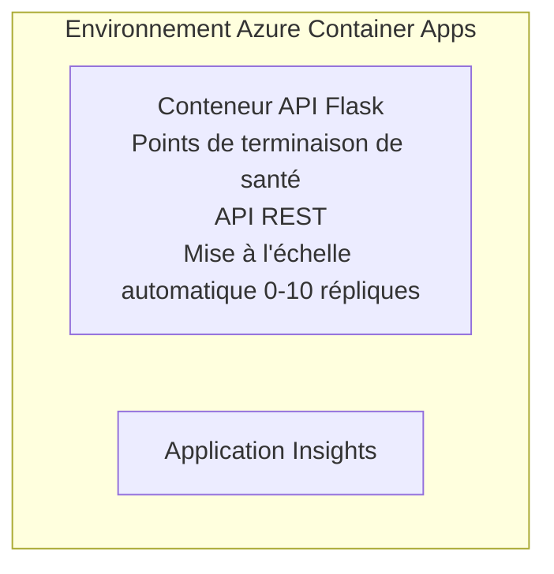

# Simple Flask API - Exemple d'Application Conteneurisée

**Parcours d'apprentissage :** Débutant ⭐ | **Durée :** 25-35 minutes | **Coût :** 0-15 $/mois

Une API REST Python Flask complète et fonctionnelle déployée sur Azure Container Apps à l'aide d'Azure Developer CLI (azd). Cet exemple illustre les bases du déploiement conteneurisé, de l'auto-scalabilité et de la surveillance.

## 🎯 Ce que vous apprendrez

- Déployer une application Python conteneurisée sur Azure
- Configurer l'auto-scalabilité avec scale-to-zero
- Implémenter des probes de santé et des contrôles de readiness
- Surveiller les logs et les métriques de l'application
- Utiliser Azure Developer CLI pour un déploiement rapide

## 📦 Ce qui est inclus

✅ **Application Flask** - API REST complète avec opérations CRUD (`src/app.py`)  
✅ **Dockerfile** - Configuration du conteneur prête pour la production  
✅ **Infrastructure Bicep** - Environnement Container Apps et déploiement API  
✅ **Configuration AZD** - Déploiement en une commande  
✅ **Probes de santé** - Contrôles de vivacité et de readiness configurés  
✅ **Auto-scalabilité** - 0 à 10 réplicas selon la charge HTTP  

## Architecture



## Prérequis

### Nécessaires
- **Azure Developer CLI (azd)** - [Guide d'installation](https://learn.microsoft.com/azure/developer/azure-developer-cli/install-azd)
- **Abonnement Azure** - [Compte gratuit](https://azure.microsoft.com/free/)
- **Docker Desktop** - [Installer Docker](https://www.docker.com/products/docker-desktop/) (pour tests locaux)

### Vérifier les prérequis

```bash
# Vérifiez la version d'azd (nécessite la 1.5.0 ou plus)
azd version

# Vérifiez la connexion Azure
azd auth login

# Vérifiez Docker (optionnel, pour les tests locaux)
docker --version
```

## ⏱️ Chronologie du déploiement

| Phase | Durée | Ce qui se passe |
|-------|-------|-----------------||
| Configuration de l'environnement | 30 secondes | Création de l'environnement azd |
| Construction du conteneur | 2-3 minutes | Docker build de l'application Flask |
| Provisionnement de l'infrastructure | 3-5 minutes | Création des Container Apps, registre, surveillance |
| Déploiement de l'application | 2-3 minutes | Push de l'image et déploiement sur Container Apps |
| **Total** | **8-12 minutes** | Déploiement complet prêt |

## Démarrage rapide

```bash
# Naviguez vers l'exemple
cd examples/container-app/simple-flask-api

# Initialisez l'environnement (choisissez un nom unique)
azd env new myflaskapi

# Déployez tout (infrastructure + application)
azd up
# Vous serez invité à :
# 1. Sélectionner l'abonnement Azure
# 2. Choisir la localisation (ex., eastus2)
# 3. Attendre 8-12 minutes pour le déploiement

# Obtenez votre point de terminaison API
azd env get-values

# Testez l'API
curl $(azd env get-value API_ENDPOINT)/health
```

**Sortie attendue :**
```json
{
  "status": "healthy",
  "timestamp": "2025-11-19T10:30:00Z",
  "service": "simple-flask-api",
  "version": "1.0.0"
}
```

## ✅ Vérifier le déploiement

### Étape 1 : Vérifier le statut du déploiement

```bash
# Voir les services déployés
azd show

# La sortie attendue montre :
# - Service : api
# - Point de terminaison : https://ca-api-[env].xxx.azurecontainerapps.io
# - Statut : En cours d'exécution
```

### Étape 2 : Tester les points de terminaison API

```bash
# Obtenir le point de terminaison de l'API
API_URL=$(azd env get-value API_ENDPOINT)

# Tester la santé
curl $API_URL/health

# Tester le point de terminaison racine
curl $API_URL/

# Créer un élément
curl -X POST $API_URL/api/items \
  -H "Content-Type: application/json" \
  -d '{"name": "Test Item", "description": "My first item"}'

# Obtenir tous les éléments
curl $API_URL/api/items
```

**Critères de succès :**
- ✅ Le point de terminaison health renvoie HTTP 200
- ✅ Le point de terminaison racine affiche les informations de l'API
- ✅ POST crée un élément et renvoie HTTP 201
- ✅ GET retourne les éléments créés

### Étape 3 : Consulter les logs

```bash
# Diffuser les journaux en direct avec azd monitor
azd monitor --logs

# Ou utiliser Azure CLI :
az containerapp logs show --name api --resource-group $RG_NAME --follow

# Vous devriez voir :
# - Messages de démarrage de Gunicorn
# - Journaux des requêtes HTTP
# - Journaux d'informations de l'application
```

## Structure du projet

```
simple-flask-api/
├── azure.yaml              # AZD configuration
├── infra/
│   ├── main.bicep         # Main infrastructure
│   ├── main.parameters.json
│   └── app/
│       ├── container-env.bicep
│       └── api.bicep
└── src/
    ├── app.py             # Flask application
    ├── requirements.txt
    └── Dockerfile
```

## Points de terminaison API

| Endpoint | Méthode | Description |
|----------|---------|-------------|
| `/health` | GET | Vérification de l'état de santé |
| `/api/items` | GET | Liste tous les éléments |
| `/api/items` | POST | Crée un nouvel élément |
| `/api/items/{id}` | GET | Récupère un élément spécifique |
| `/api/items/{id}` | PUT | Met à jour un élément |
| `/api/items/{id}` | DELETE | Supprime un élément |

## Configuration

### Variables d'environnement

```bash
# Définir la configuration personnalisée
azd env set PORT 8000
azd env set LOG_LEVEL info
azd env set MAX_REPLICAS 20
```

### Configuration de la scalabilité

L'API s'adapte automatiquement en fonction du trafic HTTP :
- **Réplicas min** : 0 (scaling à zéro en cas d'inactivité)
- **Réplicas max** : 10
- **Requêtes simultanées par réplique** : 50

## Développement

### Exécuter localement

```bash
# Installer les dépendances
cd src
pip install -r requirements.txt

# Lancer l'application
python app.py

# Tester localement
curl http://localhost:8000/health
```

### Construire et tester le conteneur

```bash
# Construire l'image Docker
docker build -t flask-api:local ./src

# Exécuter le conteneur localement
docker run -p 8000:8000 flask-api:local

# Tester le conteneur
curl http://localhost:8000/health
```

## Déploiement

### Déploiement complet

```bash
# Déployer l'infrastructure et l'application
azd up
```

### Déploiement uniquement du code

```bash
# Déployer uniquement le code de l'application (infrastructure inchangée)
azd deploy api
```

### Mise à jour de la configuration

```bash
# Mettre à jour les variables d'environnement
azd env set API_KEY "new-api-key"

# Redéployer avec la nouvelle configuration
azd deploy api
```

## Surveillance

### Consulter les logs

```bash
# Diffuser les journaux en direct en utilisant azd monitor
azd monitor --logs

# Ou utiliser Azure CLI pour les applications conteneurisées :
az containerapp logs show --name api --resource-group $RG_NAME --follow

# Voir les 100 dernières lignes
az containerapp logs show --name api --resource-group $RG_NAME --tail 100
```

### Surveiller les métriques

```bash
# Ouvrir le tableau de bord Azure Monitor
azd monitor --overview

# Afficher des métriques spécifiques
az monitor metrics list \
  --resource $(azd show --output json | jq -r '.services.api.resourceId') \
  --metric "Requests,ResponseTime"
```

## Tests

### Vérification de l'état de santé

```bash
curl $(azd show --output json | jq -r '.services.api.endpoint')/health
```

Réponse attendue :
```json
{
  "status": "healthy",
  "timestamp": "2025-11-19T10:30:00Z"
}
```

### Création d'un élément

```bash
curl -X POST $(azd show --output json | jq -r '.services.api.endpoint')/api/items \
  -H "Content-Type: application/json" \
  -d '{"name": "Test Item", "description": "A test item"}'
```

### Récupérer tous les éléments

```bash
curl $(azd show --output json | jq -r '.services.api.endpoint')/api/items
```

## Optimisation des coûts

Ce déploiement utilise le scale-to-zero, vous ne payez que lorsque l'API traite des requêtes :

- **Coût en veille** : ~0 $/mois (scalé à zéro)
- **Coût actif** : ~0,000024 $/seconde par réplique
- **Coût mensuel attendu** (usage léger) : 5-15 $

### Réduire davantage les coûts

```bash
# Réduire le nombre maximal de réplicas pour dev
azd env set MAX_REPLICAS 3

# Utiliser un délai d’inactivité plus court
azd env set SCALE_TO_ZERO_TIMEOUT 300  # 5 minutes
```

## Dépannage

### Le conteneur ne démarre pas

```bash
# Vérifiez les journaux du conteneur en utilisant Azure CLI
az containerapp logs show --name api --resource-group $RG_NAME --tail 100

# Vérifiez les constructions d’images Docker localement
docker build -t test ./src
```

### API inaccessible

```bash
# Vérifier que l'entrée est externe
az containerapp show --name api --resource-group rg-simple-flask-api \
  --query properties.configuration.ingress.external
```

### Temps de réponse élevés

```bash
# Vérifiez l'utilisation du CPU/Mémoire
az monitor metrics list \
  --resource $(azd show --output json | jq -r '.services.api.resourceId') \
  --metric "CPUPercentage,MemoryPercentage"

# Augmentez les ressources si nécessaire
az containerapp update --name api --resource-group rg-simple-flask-api \
  --cpu 1.0 --memory 2Gi
```

## Nettoyage

```bash
# Supprimer toutes les ressources
azd down --force --purge
```

## Étapes suivantes

### Étendre cet exemple

1. **Ajouter une base de données** - Intégrer Azure Cosmos DB ou SQL Database  
   ```bash
   # Ajouter le module Cosmos DB au fichier infra/main.bicep
   # Mettre à jour app.py avec la connexion à la base de données
   ```

2. **Ajouter l'authentification** - Implémenter Microsoft Entra ID ou clés API  
   ```python
   # Ajouter le middleware d'authentification à app.py
   from functools import wraps
   ```

3. **Mettre en place CI/CD** - Workflow GitHub Actions  
   ```yaml
   # Create .github/workflows/deploy.yml
   name: Deploy to Azure
   on: [push]
   ```

4. **Ajouter une identité gérée** - Sécuriser l'accès aux services Azure  
   ```bicep
   # Update infra/app/api.bicep
   identity: { type: 'SystemAssigned' }
   ```

### Exemples connexes

- **[Application Base de données](../../../../../examples/database-app)** - Exemple complet avec SQL Database
- **[Microservices](../../../../../examples/container-app/microservices)** - Architecture multi-service
- **[Guide maître Container Apps](../README.md)** - Tous les modèles conteneurisés

### Ressources d'apprentissage

- 📚 [Cours AZD pour débutants](../../../README.md) - Page principale du cours
- 📚 [Modèles Container Apps](../README.md) - Plus de patterns de déploiement
- 📚 [Galerie de templates AZD](https://azure.github.io/awesome-azd/) - Templates communautaires

## Ressources supplémentaires

### Documentation
- **[Documentation Flask](https://flask.palletsprojects.com/)** - Guide du framework Flask
- **[Azure Container Apps](https://learn.microsoft.com/azure/container-apps/)** - Documentation officielle Azure
- **[Azure Developer CLI](https://learn.microsoft.com/azure/developer/azure-developer-cli/)** - Référence des commandes azd

### Tutoriels
- **[Container Apps Quickstart](https://learn.microsoft.com/azure/container-apps/quickstart-portal)** - Déployez votre première application
- **[Python sur Azure](https://learn.microsoft.com/azure/developer/python/)** - Guide de développement Python
- **[Langage Bicep](https://learn.microsoft.com/azure/azure-resource-manager/bicep/)** - Infrastructure as code

### Outils
- **[Portail Azure](https://portal.azure.com)** - Gestion visuelle des ressources
- **[Extension VS Code Azure](https://marketplace.visualstudio.com/items?itemName=ms-azuretools.vscode-azurecontainerapps)** - Intégration IDE

---

**🎉 Félicitations !** Vous avez déployé une API Flask prête pour la production sur Azure Container Apps avec auto-scalabilité et surveillance.

**Des questions ?** [Ouvrez un ticket](https://github.com/microsoft/AZD-for-beginners/issues) ou consultez la [FAQ](../../../resources/faq.md)

---

<!-- CO-OP TRANSLATOR DISCLAIMER START -->
**Avertissement** :
Ce document a été traduit à l'aide du service de traduction automatique [Co-op Translator](https://github.com/Azure/co-op-translator). Bien que nous nous efforçions d'assurer l'exactitude, veuillez noter que les traductions automatisées peuvent contenir des erreurs ou des inexactitudes. Le document original dans sa langue native doit être considéré comme la source faisant autorité. Pour les informations critiques, il est recommandé de recourir à une traduction professionnelle réalisée par un humain. Nous ne saurions être tenus responsables des malentendus ou erreurs d'interprétation découlant de l'utilisation de cette traduction.
<!-- CO-OP TRANSLATOR DISCLAIMER END -->