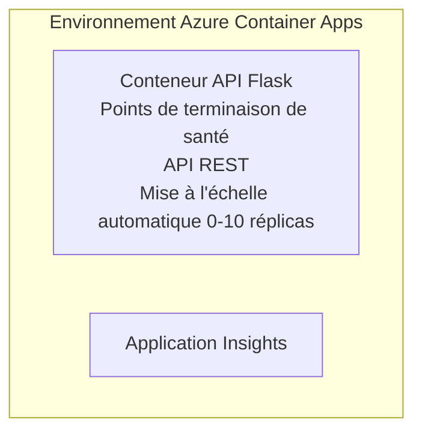

# Simple Flask API - Container App Example

**Learning Path:** Beginner ⭐ | **Time:** 25-35 minutes | **Cost:** $0-15/month

Une API REST Python Flask complète et fonctionnelle déployée sur Azure Container Apps en utilisant Azure Developer CLI (azd). Cet exemple illustre le déploiement de conteneurs, la mise à l'échelle automatique et les bases de la surveillance.

## 🎯 What You'll Learn

- Déployer une application Python conteneurisée sur Azure
- Configurer la mise à l'échelle automatique avec mise à l'échelle à zéro
- Implémenter des probes de santé et des vérifications de readiness
- Surveiller les journaux et les métriques de l'application
- Utiliser Azure Developer CLI pour un déploiement rapide

## 📦 What's Included

✅ **Flask Application** - API REST complète avec opérations CRUD (`src/app.py`)  
✅ **Dockerfile** - Configuration du conteneur prête pour la production  
✅ **Bicep Infrastructure** - Environnement Container Apps et déploiement de l'API  
✅ **AZD Configuration** - Configuration de déploiement en une commande  
✅ **Health Probes** - Vérifications de liveness et readiness configurées  
✅ **Auto-scaling** - 0-10 réplicas basés sur la charge HTTP  

## Architecture


## Prerequisites

### Required
- **Azure Developer CLI (azd)** - [Install guide](https://learn.microsoft.com/azure/developer/azure-developer-cli/install-azd)
- **Azure subscription** - [Free account](https://azure.microsoft.com/free/)
- **Docker Desktop** - [Install Docker](https://www.docker.com/products/docker-desktop/) (pour les tests locaux)

### Verify Prerequisites

```bash
# Vérifier la version d'azd (nécessite 1.5.0 ou supérieure)
azd version

# Vérifier la connexion à Azure
azd auth login

# Vérifier Docker (optionnel, pour les tests locaux)
docker --version
```

## ⏱️ Deployment Timeline

| Phase | Duration | What Happens |
|-------|----------|--------------||
| Environment setup | 30 seconds | Create azd environment |
| Build container | 2-3 minutes | Docker build Flask app |
| Provision infrastructure | 3-5 minutes | Create Container Apps, registry, monitoring |
| Deploy application | 2-3 minutes | Push image and deploy to Container Apps |
| **Total** | **8-12 minutes** | Complete deployment ready |

## Quick Start

```bash
# Accédez à l'exemple
cd examples/container-app/simple-flask-api

# Initialisez l'environnement (choisissez un nom unique)
azd env new myflaskapi

# Déployez tout (infrastructure + application)
azd up
# Vous serez invité à :
# 1. Sélectionnez l'abonnement Azure
# 2. Choisissez l'emplacement (p. ex., eastus2)
# Attendez 8 à 12 minutes pour le déploiement

# Obtenez le point de terminaison de votre API
azd env get-values

# Testez l'API
curl $(azd env get-value API_ENDPOINT)/health
```

**Expected Output:**
```json
{
  "status": "healthy",
  "timestamp": "2025-11-19T10:30:00Z",
  "service": "simple-flask-api",
  "version": "1.0.0"
}
```

## ✅ Verify Deployment

### Step 1: Check Deployment Status

```bash
# Afficher les services déployés
azd show

# La sortie attendue affiche :
# - Service : api
# - Point de terminaison : https://ca-api-[env].xxx.azurecontainerapps.io
# - État : En cours d'exécution
```

### Step 2: Test API Endpoints

```bash
# Récupérer le point de terminaison de l'API
API_URL=$(azd env get-value API_ENDPOINT)

# Vérifier l'état de santé
curl $API_URL/health

# Tester le point de terminaison racine
curl $API_URL/

# Créer un élément
curl -X POST $API_URL/api/items \
  -H "Content-Type: application/json" \
  -d '{"name": "Test Item", "description": "My first item"}'

# Récupérer tous les éléments
curl $API_URL/api/items
```

**Success Criteria:**
- ✅ Health endpoint returns HTTP 200
- ✅ Root endpoint shows API information
- ✅ POST creates item and returns HTTP 201
- ✅ GET returns created items

### Step 3: View Logs

```bash
# Diffusez les journaux en temps réel avec azd monitor
azd monitor --logs

# Ou utilisez Azure CLI:
az containerapp logs show --name api --resource-group $RG_NAME --follow

# Vous devriez voir:
# - Messages de démarrage de Gunicorn
# - Journaux des requêtes HTTP
# - Journaux d'informations de l'application
```

## Project Structure

```
simple-flask-api/
├── azure.yaml              # AZD configuration
├── infra/
│   ├── main.bicep         # Main infrastructure
│   ├── main.parameters.json
│   └── app/
│       ├── container-env.bicep
│       └── api.bicep
└── src/
    ├── app.py             # Flask application
    ├── requirements.txt
    └── Dockerfile
```

## API Endpoints

| Endpoint | Method | Description |
|----------|--------|-------------|
| `/health` | GET | Vérification d'intégrité |
| `/api/items` | GET | Lister tous les éléments |
| `/api/items` | POST | Créer un nouvel élément |
| `/api/items/{id}` | GET | Récupérer un élément spécifique |
| `/api/items/{id}` | PUT | Mettre à jour l'élément |
| `/api/items/{id}` | DELETE | Supprimer l'élément |

## Configuration

### Environment Variables

```bash
# Définir une configuration personnalisée
azd env set PORT 8000
azd env set LOG_LEVEL info
azd env set MAX_REPLICAS 20
```

### Scaling Configuration

The API automatically scales based on HTTP traffic:
- **Min Replicas**: 0 (scales to zero when idle)
- **Max Replicas**: 10
- **Concurrent Requests per Replica**: 50

## Development

### Run Locally

```bash
# Installer les dépendances
cd src
pip install -r requirements.txt

# Lancer l'application
python app.py

# Tester localement
curl http://localhost:8000/health
```

### Build and Test Container

```bash
# Construire l'image Docker
docker build -t flask-api:local ./src

# Exécuter le conteneur localement
docker run -p 8000:8000 flask-api:local

# Tester le conteneur
curl http://localhost:8000/health
```

## Deployment

### Full Deployment

```bash
# Déployer l'infrastructure et l'application
azd up
```

### Code-Only Deployment

```bash
# Déployer uniquement le code de l'application (infrastructure inchangée)
azd deploy api
```

### Update Configuration

```bash
# Mettre à jour les variables d'environnement
azd env set API_KEY "new-api-key"

# Redéployer avec la nouvelle configuration
azd deploy api
```

## Monitoring

### View Logs

```bash
# Diffuser les journaux en direct avec azd monitor
azd monitor --logs

# Ou utilisez Azure CLI pour Container Apps:
az containerapp logs show --name api --resource-group $RG_NAME --follow

# Afficher les 100 dernières lignes
az containerapp logs show --name api --resource-group $RG_NAME --tail 100
```

### Monitor Metrics

```bash
# Ouvrir le tableau de bord Azure Monitor
azd monitor --overview

# Afficher des métriques spécifiques
az monitor metrics list \
  --resource $(azd show --output json | jq -r '.services.api.resourceId') \
  --metric "Requests,ResponseTime"
```

## Testing

### Health Check

```bash
curl $(azd show --output json | jq -r '.services.api.endpoint')/health
```

Expected response:
```json
{
  "status": "healthy",
  "timestamp": "2025-11-19T10:30:00Z"
}
```

### Create Item

```bash
curl -X POST $(azd show --output json | jq -r '.services.api.endpoint')/api/items \
  -H "Content-Type: application/json" \
  -d '{"name": "Test Item", "description": "A test item"}'
```

### Get All Items

```bash
curl $(azd show --output json | jq -r '.services.api.endpoint')/api/items
```

## Cost Optimization

This deployment uses scale-to-zero, so you only pay when the API is processing requests:

- **Idle cost**: ~$0/month (scaled to zero)
- **Active cost**: ~$0.000024/second per replica
- **Expected monthly cost** (light usage): $5-15

### Reduce Costs Further

```bash
# Réduire le nombre maximal de réplicas pour le développement
azd env set MAX_REPLICAS 3

# Utiliser un délai d'inactivité plus court
azd env set SCALE_TO_ZERO_TIMEOUT 300  # 5 minutes
```

## Troubleshooting

### Container Won't Start

```bash
# Consulter les journaux du conteneur avec Azure CLI
az containerapp logs show --name api --resource-group $RG_NAME --tail 100

# Vérifier la construction de l'image Docker localement
docker build -t test ./src
```

### API Not Accessible

```bash
# Vérifier que l'ingress est externe
az containerapp show --name api --resource-group rg-simple-flask-api \
  --query properties.configuration.ingress.external
```

### High Response Times

```bash
# Vérifier l'utilisation du processeur et de la mémoire
az monitor metrics list \
  --resource $(azd show --output json | jq -r '.services.api.resourceId') \
  --metric "CPUPercentage,MemoryPercentage"

# Augmenter les ressources si nécessaire
az containerapp update --name api --resource-group rg-simple-flask-api \
  --cpu 1.0 --memory 2Gi
```

## Clean Up

```bash
# Supprimer toutes les ressources
azd down --force --purge
```

## Next Steps

### Expand This Example

1. **Add Database** - Integrate Azure Cosmos DB or SQL Database
   ```bash
   # Ajouter le module Cosmos DB à infra/main.bicep
   # Mettre à jour app.py avec la connexion à la base de données
   ```

2. **Add Authentication** - Implement Azure AD or API keys
   ```python
   # Ajouter le middleware d'authentification à app.py
   from functools import wraps
   ```

3. **Set Up CI/CD** - GitHub Actions workflow
   ```yaml
   # Create .github/workflows/deploy.yml
   name: Deploy to Azure
   on: [push]
   ```

4. **Add Managed Identity** - Secure access to Azure services
   ```bicep
   # Update infra/app/api.bicep
   identity: { type: 'SystemAssigned' }
   ```

### Related Examples

- **[Database App](../../../../../examples/database-app)** - Exemple complet avec SQL Database
- **[Microservices](../../../../../examples/container-app/microservices)** - Architecture multi-service
- **[Container Apps Master Guide](../README.md)** - Tous les modèles de conteneurs

### Learning Resources

- 📚 [AZD For Beginners Course](../../../README.md) - Page principale du cours
- 📚 [Container Apps Patterns](../README.md) - Plus de modèles de déploiement
- 📚 [AZD Templates Gallery](https://azure.github.io/awesome-azd/) - Modèles communautaires

## Additional Resources

### Documentation
- **[Flask Documentation](https://flask.palletsprojects.com/)** - Guide du framework Flask
- **[Azure Container Apps](https://learn.microsoft.com/azure/container-apps/)** - Documentation officielle Azure
- **[Azure Developer CLI](https://learn.microsoft.com/azure/developer/azure-developer-cli/)** - Référence des commandes azd

### Tutorials
- **[Container Apps Quickstart](https://learn.microsoft.com/azure/container-apps/quickstart-portal)** - Déployez votre première application
- **[Python on Azure](https://learn.microsoft.com/azure/developer/python/)** - Guide de développement Python
- **[Bicep Language](https://learn.microsoft.com/azure/azure-resource-manager/bicep/)** - Infrastructure as code

### Tools
- **[Azure Portal](https://portal.azure.com)** - Gérer les ressources visuellement
- **[VS Code Azure Extension](https://marketplace.visualstudio.com/items?itemName=ms-azuretools.vscode-azurecontainerapps)** - Intégration IDE

---

**🎉 Congratulations!** You've deployed a production-ready Flask API to Azure Container Apps with auto-scaling and monitoring.

**Questions?** [Open an issue](https://github.com/microsoft/AZD-for-beginners/issues) or check the [FAQ](../../../resources/faq.md)

---

<!-- CO-OP TRANSLATOR DISCLAIMER START -->
Avertissement :
Ce document a été traduit à l'aide du service de traduction par IA [Co-op Translator](https://github.com/Azure/co-op-translator). Bien que nous nous efforcions d'assurer l'exactitude, veuillez noter que les traductions automatisées peuvent contenir des erreurs ou des inexactitudes. Le document original dans sa langue d'origine doit être considéré comme la source faisant foi. Pour les informations critiques, il est recommandé de recourir à une traduction humaine professionnelle. Nous déclinons toute responsabilité pour tout malentendu ou mauvaise interprétation résultant de l'utilisation de cette traduction.
<!-- CO-OP TRANSLATOR DISCLAIMER END -->