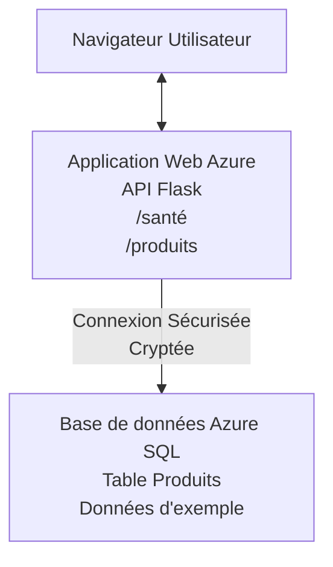

# Déploiement d'une base de données Microsoft SQL et d'une application Web avec AZD

⏱️ **Temps estimé** : 20-30 minutes | 💰 **Coût estimé** : ~15-25 $/mois | ⭐ **Complexité** : Intermédiaire

Cet **exemple complet et fonctionnel** montre comment utiliser la [Azure Developer CLI (azd)](https://learn.microsoft.com/azure/developer/azure-developer-cli/) pour déployer une application web Python Flask avec une base de données Microsoft SQL sur Azure. Tout le code est inclus et testé—aucune dépendance externe requise.

## Ce que vous apprendrez

En réalisant cet exemple, vous allez :
- Déployer une application multi-niveaux (application web + base de données) via l'infrastructure en tant que code
- Configurer des connexions sécurisées à la base de données sans coder en dur les secrets
- Surveiller la santé de l'application avec Application Insights
- Gérer efficacement les ressources Azure avec la CLI AZD
- Suivre les meilleures pratiques Azure pour la sécurité, l'optimisation des coûts et l'observabilité

## Présentation du scénario
- **Application Web** : API REST Python Flask avec connectivité à la base de données
- **Base de données** : Azure SQL Database avec données d’exemple
- **Infrastructure** : Provisionnée via Bicep (modèles modulaires et réutilisables)
- **Déploiement** : Entièrement automatisé avec les commandes `azd`
- **Surveillance** : Application Insights pour les journaux et la télémétrie

## Prérequis

### Outils requis

Avant de commencer, vérifiez que vous avez ces outils installés :

1. **[Azure CLI](https://learn.microsoft.com/cli/azure/install-azure-cli)** (version 2.50.0 ou supérieure)
   ```sh
   az --version
   # Sortie attendue : azure-cli 2.50.0 ou supérieur
   ```

2. **[Azure Developer CLI (azd)](https://learn.microsoft.com/azure/developer/azure-developer-cli/install-azd)** (version 1.0.0 ou supérieure)
   ```sh
   azd version
   # Sortie attendue : version azd 1.0.0 ou supérieure
   ```

3. **[Python 3.8+](https://www.python.org/downloads/)** (pour le développement local)
   ```sh
   python --version
   # Résultat attendu : Python 3.8 ou supérieur
   ```

4. **[Docker](https://www.docker.com/get-started)** (optionnel, pour le développement local en conteneur)
   ```sh
   docker --version
   # Résultat attendu : version Docker 20.10 ou supérieure
   ```

### Exigences Azure

- Un **abonnement Azure** actif ([créer un compte gratuit](https://azure.microsoft.com/free/))
- Les permissions pour créer des ressources dans votre abonnement
- Rôle **Propriétaire** ou **Contributeur** sur l'abonnement ou le groupe de ressources

### Connaissances préalables

Ceci est un exemple de niveau **intermédiaire**. Vous devriez connaître :
- Les opérations de base en ligne de commande
- Les concepts fondamentaux du cloud (ressources, groupes de ressources)
- Une compréhension basique des applications web et des bases de données

**Nouveau sur AZD ?** Commencez par le [guide de démarrage](../../docs/chapter-01-foundation/azd-basics.md).

## Architecture

Cet exemple déploie une architecture en deux niveaux avec une application web et une base de données SQL :



**Déploiement des ressources :**
- **Groupe de ressources** : Conteneur pour toutes les ressources
- **Plan App Service** : Hébergement Linux (niveau B1 pour l'efficacité des coûts)
- **Application Web** : runtime Python 3.11 avec application Flask
- **Serveur SQL** : serveur de base de données managé avec TLS 1.2 minimum
- **Base de données SQL** : niveau Basic (2 Go, adapté au développement/tests)
- **Application Insights** : surveillance et journalisation
- **Espace de travail Log Analytics** : stockage centralisé des journaux

**Analogie** : Imaginez un restaurant (application web) avec un congélateur (base de données). Les clients commandent depuis le menu (endpoints API) et la cuisine (app Flask) récupère les ingrédients (données) dans le congélateur. Le gérant du restaurant (Application Insights) suit tout ce qui se passe.

## Structure des dossiers

Tous les fichiers sont inclus dans cet exemple—aucune dépendance externe requise :

```
examples/database-app/
│
├── README.md                    # This file
├── azure.yaml                   # AZD configuration file
├── .env.sample                  # Sample environment variables
├── .gitignore                   # Git ignore patterns
│
├── infra/                       # Infrastructure as Code (Bicep)
│   ├── main.bicep              # Main orchestration template
│   ├── abbreviations.json      # Azure naming conventions
│   └── resources/              # Modular resource templates
│       ├── sql-server.bicep    # SQL Server configuration
│       ├── sql-database.bicep  # Database configuration
│       ├── app-service-plan.bicep  # Hosting plan
│       ├── app-insights.bicep  # Monitoring setup
│       └── web-app.bicep       # Web application
│
└── src/
    └── web/                    # Application source code
        ├── app.py              # Flask REST API
        ├── requirements.txt    # Python dependencies
        └── Dockerfile          # Container definition
```

**Fonction de chaque fichier :**
- **azure.yaml** : indique à AZD quoi déployer et où
- **infra/main.bicep** : orchestre toutes les ressources Azure
- **infra/resources/*.bicep** : définitions individuelles des ressources (modulaires pour réutilisation)
- **src/web/app.py** : application Flask avec logique base de données
- **requirements.txt** : dépendances Python
- **Dockerfile** : instructions de containerisation pour le déploiement

## Démarrage rapide (pas à pas)

### Étape 1 : Cloner et naviguer

```sh
git clone https://github.com/microsoft/AZD-for-beginners.git
cd AZD-for-beginners/examples/database-app
```

**✓ Vérification de succès** : Vérifiez que vous voyez `azure.yaml` et le dossier `infra/` :
```sh
ls
# Attendu : README.md, azure.yaml, infra/, src/
```

### Étape 2 : Authentification avec Azure

```sh
azd auth login
```

Cela ouvre votre navigateur pour l’authentification Azure. Connectez-vous avec vos identifiants Azure.

**✓ Vérification de succès** : Vous devriez voir :
```
Logged in to Azure.
```

### Étape 3 : Initialiser l’environnement

```sh
azd init
```

**Ce qui se passe** : AZD crée une configuration locale pour votre déploiement.

**Prompts affichés** :
- **Nom de l’environnement** : Entrez un nom court (ex. `dev`, `monapp`)
- **Abonnement Azure** : Choisissez votre abonnement dans la liste
- **Région Azure** : Choisissez une région (ex. `eastus`, `westeurope`)

**✓ Vérification de succès** : Vous devriez voir :
```
SUCCESS: New project initialized!
```

### Étape 4 : Provisionner les ressources Azure

```sh
azd provision
```

**Ce qui se passe** : AZD déploie toute l’infrastructure (prend 5-8 minutes) :
1. Création du groupe de ressources
2. Création du serveur SQL et de la base de données
3. Création du plan App Service
4. Création de l’application web
5. Création d’Application Insights
6. Configuration du réseau et de la sécurité

**Vous serez invité à fournir** :
- **Nom d’administrateur SQL** : Entrez un nom d’utilisateur (ex. `sqladmin`)
- **Mot de passe administrateur SQL** : Entrez un mot de passe fort (conservez-le !)

**✓ Vérification de succès** : Vous devriez voir :
```
SUCCESS: Your application was provisioned in Azure in X minutes Y seconds.
You can view the resources created under the resource group rg-<env-name> in Azure Portal:
https://portal.azure.com/#@/resource/subscriptions/.../resourceGroups/rg-<env-name>
```

**⏱️ Durée** : 5-8 minutes

### Étape 5 : Déployer l’application

```sh
azd deploy
```

**Ce qui se passe** : AZD construit et déploie votre application Flask :
1. Emballage de l’application Python
2. Construction du conteneur Docker
3. Publication sur Azure Web App
4. Initialisation de la base de données avec des données d’exemple
5. Démarrage de l’application

**✓ Vérification de succès** : Vous devriez voir :
```
SUCCESS: Your application was deployed to Azure in X minutes Y seconds.
You can view the resources created under the resource group rg-<env-name> in Azure Portal:
https://portal.azure.com/#@/resource/subscriptions/.../resourceGroups/rg-<env-name>
```

**⏱️ Durée** : 3-5 minutes

### Étape 6 : Naviguer dans l’application

```sh
azd browse
```

Cela ouvre votre application web déployée dans le navigateur à l’adresse `https://app-<unique-id>.azurewebsites.net`

**✓ Vérification de succès** : Vous devriez voir une sortie JSON :
```json
{
  "message": "Welcome to the Database App API",
  "endpoints": {
    "/": "This help message",
    "/health": "Health check endpoint",
    "/products": "List all products",
    "/products/<id>": "Get product by ID"
  }
}
```

### Étape 7 : Tester les endpoints API

**Vérification de la santé** (vérifie la connexion à la base de données) :
```sh
curl https://app-<your-id>.azurewebsites.net/health
```

**Réponse attendue** :
```json
{
  "status": "healthy",
  "database": "connected"
}
```

**Liste des produits** (données d’exemple) :
```sh
curl https://app-<your-id>.azurewebsites.net/products
```

**Réponse attendue** :
```json
[
  {
    "id": 1,
    "name": "Laptop",
    "description": "High-performance laptop",
    "price": 1299.99,
    "created_at": "2025-11-19T10:30:00"
  },
  ...
]
```

**Obtenir un produit unique** :
```sh
curl https://app-<your-id>.azurewebsites.net/products/1
```

**✓ Vérification de succès** : Tous les endpoints retournent des données JSON sans erreurs.

---

**🎉 Félicitations !** Vous avez déployé avec succès une application web avec une base de données sur Azure en utilisant AZD.

## Analyse approfondie de la configuration

### Variables d’environnement

Les secrets sont gérés en toute sécurité via la configuration Azure App Service—**jamais codés en dur dans le code source**.

**Configuré automatiquement par AZD** :
- `SQL_CONNECTION_STRING` : chaîne de connexion à la base de données avec identifiants chiffrés
- `APPLICATIONINSIGHTS_CONNECTION_STRING` : point de télémétrie pour la surveillance
- `SCM_DO_BUILD_DURING_DEPLOYMENT` : active l'installation automatique des dépendances

**Où les secrets sont stockés** :
1. Lors du `azd provision`, vous fournissez les identifiants SQL via des invites sécurisées
2. AZD les enregistre dans votre fichier local `.azure/<nom-env>/.env` (ignoré par git)
3. AZD les injecte dans la configuration Azure App Service (chiffré au repos)
4. L’application les lit via `os.getenv()` à l’exécution

### Développement local

Pour tester localement, créez un fichier `.env` à partir de l’exemple :

```sh
cp .env.sample .env
# Modifiez .env avec la connexion à votre base de données locale
```

**Flux de travail pour le développement local** :
```sh
# Installer les dépendances
cd src/web
pip install -r requirements.txt

# Définir les variables d'environnement
export SQL_CONNECTION_STRING="your-local-connection-string"

# Exécuter l'application
python app.py
```

**Test local** :
```sh
curl http://localhost:8000/health
# Attendu : {"statut": "sain", "base de données": "connectée"}
```

### Infrastructure en tant que code

Toutes les ressources Azure sont définies dans des modèles **Bicep** (`infra/`):

- **Conception modulaire** : chaque type de ressource a son propre fichier pour réutilisabilité
- **Paramétrable** : personnalisez SKU, régions, conventions de nommage
- **Meilleures pratiques** : suit les standards Azure et les paramètres de sécurité par défaut
- **Versionné** : les modifications d’infrastructure sont suivies dans Git

**Exemple de personnalisation** :
Pour changer le niveau de la base de données, modifiez `infra/resources/sql-database.bicep` :
```bicep
sku: {
  name: 'Standard'  // Changed from 'Basic'
  tier: 'Standard'
  capacity: 10
}
```

## Meilleures pratiques de sécurité

Cet exemple suit les meilleures pratiques de sécurité Azure :

### 1. **Pas de secrets dans le code source**
- ✅ Identifiants stockés dans la configuration Azure App Service (chiffrée)
- ✅ Fichiers `.env` exclus de Git via `.gitignore`
- ✅ Secrets transmis via des paramètres sécurisés lors du provisionnement

### 2. **Connexions chiffrées**
- ✅ TLS 1.2 minimum pour le serveur SQL
- ✅ HTTPS uniquement pour l’Application Web
- ✅ Connexions base de données via canaux chiffrés

### 3. **Sécurité réseau**
- ✅ Pare-feu SQL configuré pour autoriser uniquement les services Azure
- ✅ Accès réseau public restreint (peut être renforcé via des endpoints privés)
- ✅ FTPS désactivé sur l’Application Web

### 4. **Authentification & Autorisation**
- ⚠️ **Actuel** : authentification SQL classique (nom d’utilisateur/mot de passe)
- ✅ **Recommandation production** : utiliser une identité managée Azure pour une authentification sans mot de passe

**Pour passer à l’identité managée** (en production) :
1. Activer l’identité managée sur l’App Web
2. Accorder les permissions SQL à cette identité
3. Mettre à jour la chaîne de connexion pour utiliser l’identité managée
4. Retirer l’authentification basée sur mot de passe

### 5. **Audit & conformité**
- ✅ Application Insights journalise toutes les requêtes et erreurs
- ✅ Audit de la base de données SQL activé (peut être configuré pour conformité)
- ✅ Toutes les ressources sont taguées pour la gouvernance

**Checklist de sécurité avant la production** :
- [ ] Activer Azure Defender pour SQL
- [ ] Configurer les endpoints privés pour la base de données SQL
- [ ] Activer un Web Application Firewall (WAF)
- [ ] Implémenter Azure Key Vault pour la rotation des secrets
- [ ] Configurer l’authentification Microsoft Entra ID
- [ ] Activer la journalisation diagnostique pour toutes les ressources

## Optimisation des coûts

**Coûts mensuels estimés** (à novembre 2025) :

| Ressource | SKU/Niveau | Coût estimé |
|----------|------------|-------------|
| Plan App Service | B1 (Basic) | ~13 $/mois |
| Base de données SQL | Basic (2 Go) | ~5 $/mois |
| Application Insights | Paiement à l’usage | ~2 $/mois (trafic faible) |
| **Total** |  | **~20 $/mois** |

**💡 Astuces pour économiser** :

1. **Utiliser le niveau gratuit pour apprendre** :
   - App Service : niveau F1 (gratuit, heures limitées)
   - Base de données SQL : Azure SQL Database sans serveur (serverless)
   - Application Insights : 5 Go/mois ingestion gratuite

2. **Arrêter les ressources quand inutilisées** :
   ```sh
   # Arrêter l'application web (la base de données continue de facturer)
   az webapp stop --name <app-name> --resource-group <rg-name>
   
   # Redémarrer lorsque nécessaire
   az webapp start --name <app-name> --resource-group <rg-name>
   ```

3. **Tout supprimer après les tests** :
   ```sh
   azd down
   ```
   Cela supprime TOUTES les ressources et arrête les coûts.

4. **SKU pour développement vs production** :
   - **Développement** : niveau Basic (utilisé dans cet exemple)
   - **Production** : niveau Standard/Premium avec redondance

**Suivi des coûts** :
- Consultez les coûts dans [Gestion des coûts Azure](https://portal.azure.com/#view/Microsoft_Azure_CostManagement)
- Configurez des alertes budgétaires pour éviter les surprises
- Tagguez toutes les ressources avec `azd-env-name` pour le suivi

**Alternative niveau gratuit** :
Pour apprendre, vous pouvez modifier `infra/resources/app-service-plan.bicep` :
```bicep
sku: {
  name: 'F1'  // Free tier
  tier: 'Free'
}
```
**Note** : Le niveau gratuit a des limites (60 min/jour CPU, pas toujours actif).

## Surveillance & Observabilité

### Intégration Application Insights

Cet exemple inclut **Application Insights** pour une surveillance complète :

**Ce qui est surveillé** :
- ✅ Requêtes HTTP (latence, codes d’état, endpoints)
- ✅ Erreurs et exceptions applicatives
- ✅ Journalisation personnalisée depuis Flask
- ✅ Santé de la connexion à la base de données
- ✅ Indicateurs de performance (CPU, mémoire)

**Accéder à Application Insights** :
1. Ouvrez le [portail Azure](https://portal.azure.com)
2. Naviguez vers votre groupe de ressources (`rg-<nom-env>`)
3. Cliquez sur la ressource Application Insights (`appi-<unique-id>`)

**Requêtes utiles** (Application Insights → Journaux) :

**Afficher toutes les requêtes** :
```kusto
requests
| where timestamp > ago(1h)
| order by timestamp desc
| project timestamp, name, url, resultCode, duration
```

**Trouver les erreurs** :
```kusto
exceptions
| where timestamp > ago(24h)
| order by timestamp desc
| project timestamp, type, outerMessage, operation_Name
```

**Vérifier l’endpoint santé** :
```kusto
requests
| where name contains "health"
| summarize count() by resultCode, bin(timestamp, 1h)
```

### Audit de la base de données SQL

**L’audit SQL est activé** pour suivre :
- Les accès à la base de données
- Les tentatives de connexion échouées
- Les modifications du schéma
- Les accès aux données (pour conformité)

**Accéder aux journaux d’audit** :
1. Portail Azure → Base de données SQL → Audit
2. Consultez les journaux dans Log Analytics

### Surveillance en temps réel

**Afficher les métriques en direct** :
1. Application Insights → Live Metrics
2. Voir en temps réel les requêtes, échecs et performances

**Configurer des alertes** :
Créez des alertes pour événements critiques :
- Erreurs HTTP 500 > 5 en 5 minutes
- Échecs de connexion base de données
- Temps de réponse élevés (>2 secondes)

**Exemple de création d’alerte** :
```sh
az monitor metrics alert create \
  --name "High-Response-Time" \
  --resource-group <rg-name> \
  --scopes <app-insights-resource-id> \
  --condition "avg requests/duration > 2000" \
  --description "Alert when response time exceeds 2 seconds"
```

## Dépannage
### Problèmes Courants et Solutions

#### 1. `azd provision` échoue avec "Location not available"

**Symptôme** :  
```
Error: The subscription is not registered for the resource type 'components' in the location 'centralus'.
```
  
**Solution** :  
Choisissez une autre région Azure ou enregistrez le fournisseur de ressources :  
```sh
az provider register --namespace Microsoft.Insights
```
  
#### 2. Échec de la connexion SQL lors du déploiement

**Symptôme** :  
```
pyodbc.OperationalError: ('08001', '[08001] [Microsoft][ODBC Driver 18 for SQL Server]TCP Provider...')
```
  
**Solution** :  
- Vérifiez que le pare-feu du serveur SQL autorise les services Azure (configuré automatiquement)  
- Vérifiez que le mot de passe admin SQL a été saisi correctement lors de `azd provision`  
- Assurez-vous que le serveur SQL est complètement provisionné (cela peut prendre 2-3 minutes)  

**Vérifier la connexion** :  
```sh
# Depuis le portail Azure, allez dans Base de données SQL → Éditeur de requête
# Essayez de vous connecter avec vos identifiants
```
  
#### 3. L’application Web affiche "Application Error"

**Symptôme** :  
Le navigateur affiche une page d’erreur générique.

**Solution** :  
Consultez les journaux de l’application :  
```sh
# Voir les journaux récents
az webapp log tail --name <app-name> --resource-group <rg-name>
```
  
**Causes courantes** :  
- Variables d’environnement manquantes (vérifiez App Service → Configuration)  
- Échec de l’installation des paquets Python (vérifiez les journaux de déploiement)  
- Erreur d’initialisation de la base de données (vérifiez la connectivité SQL)  

#### 4. `azd deploy` échoue avec "Build Error"

**Symptôme** :  
```
Error: Failed to build project
```
  
**Solution** :  
- Assurez-vous que `requirements.txt` ne contient pas d’erreurs de syntaxe  
- Vérifiez que Python 3.11 est spécifié dans `infra/resources/web-app.bicep`  
- Vérifiez que le Dockerfile a une image de base correcte  

**Déboguer localement** :  
```sh
cd src/web
docker build -t test-app .
docker run -p 8000:8000 test-app
```
  
#### 5. "Unauthorized" lors de l’exécution des commandes AZD

**Symptôme** :  
```
ERROR: (Unauthorized) The client '<id>' with object id '<id>' does not have authorization
```
  
**Solution** :  
Ré-authentifiez-vous avec Azure :  
```sh
# Requis pour les workflows AZD
azd auth login

# Optionnel si vous utilisez également les commandes Azure CLI directement
az login
```
  
Vérifiez que vous disposez des autorisations correctes (rôle Contributeur) sur l’abonnement.

#### 6. Coûts élevés de la base de données

**Symptôme** :  
Facture Azure inattendue.

**Solution** :  
- Vérifiez si vous avez oublié de lancer `azd down` après les tests  
- Vérifiez que la base de données SQL utilise le niveau Basic (pas Premium)  
- Consultez les coûts dans Azure Cost Management  
- Configurez des alertes de coûts  

### Obtenir de l’aide

**Voir toutes les variables d’environnement AZD** :  
```sh
azd env get-values
```
  
**Vérifier l’état du déploiement** :  
```sh
az webapp show --name <app-name> --resource-group <rg-name> --query state
```
  
**Accéder aux journaux de l’application** :  
```sh
az webapp log download --name <app-name> --resource-group <rg-name> --log-file app-logs.zip
```
  
**Besoin de plus d’aide ?**  
- [Guide de dépannage AZD](../../docs/chapter-07-troubleshooting/common-issues.md)  
- [Dépannage Azure App Service](https://learn.microsoft.com/azure/app-service/troubleshoot-diagnostic-logs)  
- [Dépannage Azure SQL](https://learn.microsoft.com/azure/azure-sql/database/troubleshoot-common-errors-issues)  

## Exercices Pratiques

### Exercice 1 : Vérifier votre déploiement (Débutant)

**Objectif** : Confirmer que toutes les ressources sont déployées et que l’application fonctionne.

**Étapes** :  
1. Listez toutes les ressources dans votre groupe de ressources :  
   ```sh
   az resource list --resource-group rg-<env-name> --output table
   ```
  
**Attendu** : 6-7 ressources (Web App, SQL Server, Base de données SQL, Plan App Service, Application Insights, Log Analytics)

2. Testez tous les points de terminaison API :  
   ```sh
   curl https://app-<your-id>.azurewebsites.net/
   curl https://app-<your-id>.azurewebsites.net/health
   curl https://app-<your-id>.azurewebsites.net/products
   curl https://app-<your-id>.azurewebsites.net/products/1
   ```
  
**Attendu** : Tous renvoient un JSON valide sans erreurs

3. Vérifiez Application Insights :  
   - Accédez à Application Insights dans le portail Azure  
   - Allez à "Live Metrics"  
   - Actualisez votre navigateur sur l’application Web  
   **Attendu** : Voir les requêtes apparaître en temps réel

**Critère de réussite** : Toutes les 6-7 ressources existent, tous les points de terminaison renvoient des données, Live Metrics montre l’activité.

---

### Exercice 2 : Ajouter un nouveau point d’API (Intermédiaire)

**Objectif** : Étendre l’application Flask avec un nouveau point d’API.

**Code de départ** : Points d’API actuels dans `src/web/app.py`

**Étapes** :  
1. Modifiez `src/web/app.py` et ajoutez un nouveau point d’API après la fonction `get_product()` :  
   ```python
   @app.route('/products/search/<keyword>')
   def search_products(keyword):
       """Search products by name or description."""
       try:
           conn = get_db_connection()
           cursor = conn.cursor()
           cursor.execute(
               "SELECT id, name, description, price, created_at FROM products WHERE name LIKE ? OR description LIKE ?",
               (f'%{keyword}%', f'%{keyword}%')
           )
           
           products = []
           for row in cursor.fetchall():
               products.append({
                   'id': row[0],
                   'name': row[1],
                   'description': row[2],
                   'price': float(row[3]) if row[3] else None,
                   'created_at': row[4].isoformat() if row[4] else None
               })
           
           cursor.close()
           conn.close()
           
           logger.info(f"Search for '{keyword}' returned {len(products)} results")
           return jsonify(products), 200
           
       except Exception as e:
           logger.error(f"Error searching products: {str(e)}")
           return jsonify({'error': str(e)}), 500
   ```
  
2. Déployez l’application mise à jour :  
   ```sh
   azd deploy
   ```
  
3. Testez le nouveau point d’API :  
   ```sh
   curl https://app-<your-id>.azurewebsites.net/products/search/laptop
   ```
  
**Attendu** : Renvoie les produits correspondant à "laptop"

**Critère de réussite** : Le nouveau point d’API fonctionne, renvoie des résultats filtrés, apparaît dans les journaux Application Insights.

---

### Exercice 3 : Ajouter la surveillance et les alertes (Avancé)

**Objectif** : Mettre en place une surveillance proactive avec alertes.

**Étapes** :  
1. Créez une alerte pour les erreurs HTTP 500 :  
   ```sh
   # Obtenir l'ID de la ressource Application Insights
   AI_ID=$(az monitor app-insights component show \
     --app appi-<your-id> \
     --resource-group rg-<env-name> \
     --query id -o tsv)
   
   # Créer une alerte
   az monitor metrics alert create \
     --name "High-Error-Rate" \
     --resource-group rg-<env-name> \
     --scopes $AI_ID \
     --condition "count requests/failed > 5" \
     --window-size 5m \
     --evaluation-frequency 1m \
     --description "Alert when >5 failed requests in 5 minutes"
   ```
  
2. Déclenchez l’alerte en provoquant des erreurs :  
   ```sh
   # Demander un produit inexistant
   for i in {1..10}; do curl https://app-<your-id>.azurewebsites.net/products/999; done
   ```
  
3. Vérifiez si l’alerte s’est déclenchée :  
   - Portail Azure → Alertes → Règles d’alerte  
   - Consultez votre e-mail (si configuré)

**Critère de réussite** : La règle d’alerte est créée, se déclenche sur les erreurs, les notifications sont reçues.

---

### Exercice 4 : Changements de schéma de base de données (Avancé)

**Objectif** : Ajouter une nouvelle table et modifier l’application pour l’utiliser.

**Étapes** :  
1. Connectez-vous à la base de données SQL via l’éditeur de requête du portail Azure

2. Créez une nouvelle table `categories` :  
   ```sql
   CREATE TABLE categories (
       id INT PRIMARY KEY IDENTITY(1,1),
       name NVARCHAR(50) NOT NULL,
       description NVARCHAR(200)
   );
   
   INSERT INTO categories (name, description) VALUES
   ('Electronics', 'Electronic devices and accessories'),
   ('Office Supplies', 'Office equipment and supplies');
   
   -- Add category to products table
   ALTER TABLE products ADD category_id INT;
   UPDATE products SET category_id = 1; -- Set all to Electronics
   ```
  
3. Mettez à jour `src/web/app.py` pour inclure les informations de catégorie dans les réponses

4. Déployez et testez

**Critère de réussite** : La nouvelle table existe, les produits affichent l’information de catégorie, l’application fonctionne toujours.

---

### Exercice 5 : Implémenter la mise en cache (Expert)

**Objectif** : Ajouter Azure Redis Cache pour améliorer les performances.

**Étapes** :  
1. Ajoutez Redis Cache à `infra/main.bicep`  
2. Mettez à jour `src/web/app.py` pour mettre en cache les requêtes produits  
3. Mesurez l’amélioration des performances avec Application Insights  
4. Comparez les temps de réponse avant et après la mise en cache

**Critère de réussite** : Redis est déployé, la mise en cache fonctionne, les temps de réponse s’améliorent de plus de 50 %.

**Conseil** : Commencez par la [documentation Azure Cache for Redis](https://learn.microsoft.com/azure/azure-cache-for-redis/).

---

## Nettoyage

Pour éviter des frais récurrents, supprimez toutes les ressources lorsque vous avez terminé :

```sh
azd down
```
  
**Invite de confirmation** :  
```
? Total resources to delete: 7, are you sure you want to continue? (y/N)
```
  
Tapez `y` pour confirmer.

**✓ Vérification de réussite** :  
- Toutes les ressources sont supprimées du portail Azure  
- Aucun frais récurrent  
- Le dossier local `.azure/<env-name>` peut être supprimé

**Alternative** (garder l’infrastructure, supprimer les données) :  
```sh
# Supprimer uniquement le groupe de ressources (conserver la configuration AZD)
az group delete --name rg-<env-name> --yes
```
  
## En savoir plus

### Documentation associée  
- [Documentation Azure Developer CLI](https://learn.microsoft.com/azure/developer/azure-developer-cli/)  
- [Documentation Azure SQL Database](https://learn.microsoft.com/azure/azure-sql/database/)  
- [Documentation Azure App Service](https://learn.microsoft.com/azure/app-service/)  
- [Documentation Application Insights](https://learn.microsoft.com/azure/azure-monitor/app/app-insights-overview)  
- [Référence langage Bicep](https://learn.microsoft.com/azure/azure-resource-manager/bicep/)  

### Prochaines étapes dans ce cours  
- **[Exemple Container Apps](../../../../examples/container-app)** : Déployer des microservices avec Azure Container Apps  
- **[Guide d’intégration IA](../../../../docs/ai-foundry)** : Ajouter des capacités d’IA à votre application  
- **[Bonnes pratiques de déploiement](../../docs/chapter-04-infrastructure/deployment-guide.md)** : Modèles de déploiement en production  

### Sujets avancés  
- **Identité managée** : Supprimez les mots de passe et utilisez l’authentification Microsoft Entra ID  
- **Points de terminaison privés** : Sécurisez les connexions base de données dans un réseau virtuel  
- **Intégration CI/CD** : Automatisez les déploiements avec GitHub Actions ou Azure DevOps  
- **Multi-environnements** : Configurez des environnements dev, staging et production  
- **Migrations de base de données** : Utilisez Alembic ou Entity Framework pour la version du schéma  

### Comparaison avec d’autres approches

**AZD vs. Templates ARM** :  
- ✅ AZD : Abstraction de haut niveau, commandes simples  
- ⚠️ ARM : Plus verbeux, contrôle granulaire  

**AZD vs. Terraform** :  
- ✅ AZD : Azure natif, intégré aux services Azure  
- ⚠️ Terraform : Support multi-cloud, écosystème plus large  

**AZD vs. Portail Azure** :  
- ✅ AZD : Répétable, versionné, automatisable  
- ⚠️ Portail : Clics manuels, difficile à reproduire  

**Pensez à AZD comme** : Docker Compose pour Azure — configuration simplifiée pour des déploiements complexes.

---

## Questions Fréquemment Posées

**Q : Puis-je utiliser un autre langage de programmation ?**  
R : Oui ! Remplacez `src/web/` par Node.js, C#, Go, ou tout autre langage. Mettez à jour `azure.yaml` et Bicep en conséquence.

**Q : Comment ajouter plusieurs bases de données ?**  
R : Ajoutez un autre module SQL Database dans `infra/main.bicep` ou utilisez PostgreSQL/MySQL des services Azure Database.

**Q : Puis-je utiliser ceci en production ?**  
R : C’est un point de départ. Pour la production, ajoutez : identité managée, points de terminaison privés, redondance, stratégie de sauvegarde, WAF, et surveillance améliorée.

**Q : Et si je veux utiliser des conteneurs au lieu du déploiement de code ?**  
R : Consultez l’[Exemple Container Apps](../../../../examples/container-app) qui utilise des conteneurs Docker partout.

**Q : Comment me connecter à la base de données depuis ma machine locale ?**  
R : Ajoutez votre IP au pare-feu du serveur SQL :  
```sh
az sql server firewall-rule create \
  --resource-group rg-<env-name> \
  --server sql-<unique-id> \
  --name AllowMyIP \
  --start-ip-address <your-ip> \
  --end-ip-address <your-ip>
```
  
**Q : Puis-je utiliser une base de données existante au lieu d’en créer une nouvelle ?**  
R : Oui, modifiez `infra/main.bicep` pour référencer un serveur SQL existant et mettez à jour les paramètres de chaîne de connexion.

---

> **Note :** Cet exemple illustre les bonnes pratiques pour déployer une application web avec une base de données en utilisant AZD. Il inclut un code fonctionnel, une documentation complète, et des exercices pratiques pour renforcer l’apprentissage. Pour les déploiements en production, examinez les exigences de sécurité, montée en charge, conformité, et coûts spécifiques à votre organisation.

**📚 Navigation dans le cours :**  
- ← Précédent : [Exemple Container Apps](../../../../examples/container-app)  
- → Suivant : [Guide d’intégration IA](../../../../docs/ai-foundry)  
- 🏠 [Accueil du cours](../../README.md)

---

<!-- CO-OP TRANSLATOR DISCLAIMER START -->
**Avertissement** :
Ce document a été traduit à l'aide du service de traduction automatique [Co-op Translator](https://github.com/Azure/co-op-translator). Bien que nous nous efforçions d'assurer l'exactitude, veuillez noter que les traductions automatisées peuvent contenir des erreurs ou des inexactitudes. Le document original dans sa langue native doit être considéré comme la source faisant autorité. Pour les informations critiques, il est recommandé de recourir à une traduction professionnelle réalisée par un humain. Nous ne saurions être tenus responsables des malentendus ou erreurs d'interprétation découlant de l'utilisation de cette traduction.
<!-- CO-OP TRANSLATOR DISCLAIMER END -->