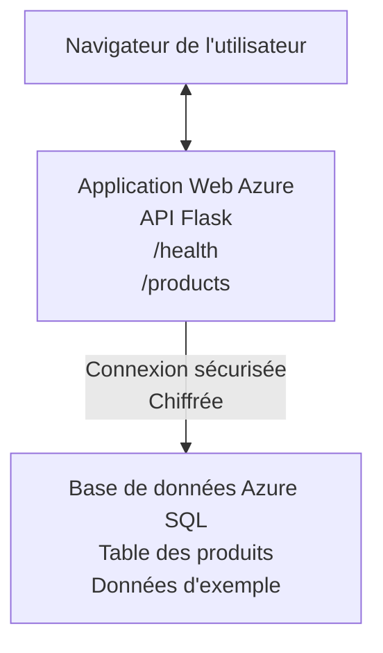

# Deploying a Microsoft SQL Database and Web App with AZD

⏱️ **Estimated Time**: 20-30 minutes | 💰 **Estimated Cost**: ~$15-25/month | ⭐ **Complexity**: Intermediate

This **complete, working example** demonstrates how to use the [Azure Developer CLI (azd)](https://learn.microsoft.com/azure/developer/azure-developer-cli/) to deploy a Python Flask web application with a Microsoft SQL Database to Azure. All code is included and tested—no external dependencies required.

## What You'll Learn

By completing this example, you will:
- Deploy a multi-tier application (web app + database) using infrastructure-as-code
- Configure secure database connections without hardcoding secrets
- Monitor application health with Application Insights
- Manage Azure resources efficiently with AZD CLI
- Follow Azure best practices for security, cost optimization, and observability

## Scenario Overview
- **Web App**: Python Flask REST API with database connectivity
- **Database**: Azure SQL Database with sample data
- **Infrastructure**: Provisioned using Bicep (modular, reusable templates)
- **Deployment**: Fully automated with `azd` commands
- **Monitoring**: Application Insights for logs and telemetry

## Prerequisites

### Required Tools

Before starting, verify you have these tools installed:

1. **[Azure CLI](https://learn.microsoft.com/cli/azure/install-azure-cli)** (version 2.50.0 or higher)
   ```sh
   az --version
   # Sortie attendue : azure-cli 2.50.0 ou supérieur
   ```

2. **[Azure Developer CLI (azd)](https://learn.microsoft.com/azure/developer/azure-developer-cli/install-azd)** (version 1.0.0 or higher)
   ```sh
   azd version
   # Sortie attendue : azd version 1.0.0 ou supérieure
   ```

3. **[Python 3.8+](https://www.python.org/downloads/)** (for local development)
   ```sh
   python --version
   # Sortie attendue : Python 3.8 ou supérieur
   ```

4. **[Docker](https://www.docker.com/get-started)** (optional, for local containerized development)
   ```sh
   docker --version
   # Sortie attendue : Docker version 20.10 ou supérieure
   ```

### Azure Requirements

- An active **Azure subscription** ([create a free account](https://azure.microsoft.com/free/))
- Permissions to create resources in your subscription
- **Owner** or **Contributor** role on the subscription or resource group

### Knowledge Prerequisites

This is an **intermediate-level** example. You should be familiar with:
- Basic command-line operations
- Fundamental cloud concepts (resources, resource groups)
- Basic understanding of web applications and databases

**New to AZD?** Start with the [Getting Started guide](../../docs/chapter-01-foundation/azd-basics.md) first.

## Architecture

This example deploys a two-tier architecture with a web application and SQL database:


**Resource Deployment:**
- **Resource Group**: Container for all resources
- **App Service Plan**: Linux-based hosting (B1 tier for cost efficiency)
- **Web App**: Python 3.11 runtime with Flask application
- **SQL Server**: Managed database server with TLS 1.2 minimum
- **SQL Database**: Basic tier (2GB, suitable for development/testing)
- **Application Insights**: Monitoring and logging
- **Log Analytics Workspace**: Centralized log storage

**Analogy**: Think of this like a restaurant (web app) with a walk-in freezer (database). Customers order from the menu (API endpoints), and the kitchen (Flask app) retrieves ingredients (data) from the freezer. The restaurant manager (Application Insights) tracks everything that happens.

## Folder Structure

All files are included in this example—no external dependencies required:

```
examples/database-app/
│
├── README.md                    # This file
├── azure.yaml                   # AZD configuration file
├── .env.sample                  # Sample environment variables
├── .gitignore                   # Git ignore patterns
│
├── infra/                       # Infrastructure as Code (Bicep)
│   ├── main.bicep              # Main orchestration template
│   ├── abbreviations.json      # Azure naming conventions
│   └── resources/              # Modular resource templates
│       ├── sql-server.bicep    # SQL Server configuration
│       ├── sql-database.bicep  # Database configuration
│       ├── app-service-plan.bicep  # Hosting plan
│       ├── app-insights.bicep  # Monitoring setup
│       └── web-app.bicep       # Web application
│
└── src/
    └── web/                    # Application source code
        ├── app.py              # Flask REST API
        ├── requirements.txt    # Python dependencies
        └── Dockerfile          # Container definition
```

**What Each File Does:**
- **azure.yaml**: Tells AZD what to deploy and where
- **infra/main.bicep**: Orchestrates all Azure resources
- **infra/resources/*.bicep**: Individual resource definitions (modular for reuse)
- **src/web/app.py**: Flask application with database logic
- **requirements.txt**: Python package dependencies
- **Dockerfile**: Containerization instructions for deployment

## Quickstart (Step-by-Step)

### Step 1: Clone and Navigate

```sh
git clone https://github.com/microsoft/AZD-for-beginners.git
cd AZD-for-beginners/examples/database-app
```

**✓ Success Check**: Verify you see `azure.yaml` and `infra/` folder:
```sh
ls
# Attendu : README.md, azure.yaml, infra/, src/
```

### Step 2: Authenticate with Azure

```sh
azd auth login
```

This opens your browser for Azure authentication. Sign in with your Azure credentials.

**✓ Success Check**: You should see:
```
Logged in to Azure.
```

### Step 3: Initialize the Environment

```sh
azd init
```

**What happens**: AZD creates a local configuration for your deployment.

**Prompts you'll see**:
- **Environment name**: Enter a short name (e.g., `dev`, `myapp`)
- **Azure subscription**: Select your subscription from the list
- **Azure location**: Choose a region (e.g., `eastus`, `westeurope`)

**✓ Success Check**: You should see:
```
SUCCESS: New project initialized!
```

### Step 4: Provision Azure Resources

```sh
azd provision
```

**What happens**: AZD deploys all infrastructure (takes 5-8 minutes):
1. Creates resource group
2. Creates SQL Server and Database
3. Creates App Service Plan
4. Creates Web App
5. Creates Application Insights
6. Configures networking and security

**You'll be prompted for**:
- **SQL admin username**: Enter a username (e.g., `sqladmin`)
- **SQL admin password**: Enter a strong password (save this!)

**✓ Success Check**: You should see:
```
SUCCESS: Your application was provisioned in Azure in X minutes Y seconds.
You can view the resources created under the resource group rg-<env-name> in Azure Portal:
https://portal.azure.com/#@/resource/subscriptions/.../resourceGroups/rg-<env-name>
```

**⏱️ Time**: 5-8 minutes

### Step 5: Deploy the Application

```sh
azd deploy
```

**What happens**: AZD builds and deploys your Flask application:
1. Packages the Python application
2. Builds the Docker container
3. Pushes to Azure Web App
4. Initializes the database with sample data
5. Starts the application

**✓ Success Check**: You should see:
```
SUCCESS: Your application was deployed to Azure in X minutes Y seconds.
You can view the resources created under the resource group rg-<env-name> in Azure Portal:
https://portal.azure.com/#@/resource/subscriptions/.../resourceGroups/rg-<env-name>
```

**⏱️ Time**: 3-5 minutes

### Step 6: Browse the Application

```sh
azd browse
```

This opens your deployed web app in the browser at `https://app-<unique-id>.azurewebsites.net`

**✓ Success Check**: You should see JSON output:
```json
{
  "message": "Welcome to the Database App API",
  "endpoints": {
    "/": "This help message",
    "/health": "Health check endpoint",
    "/products": "List all products",
    "/products/<id>": "Get product by ID"
  }
}
```

### Step 7: Test the API Endpoints

**Health Check** (verify database connection):
```sh
curl https://app-<your-id>.azurewebsites.net/health
```

**Expected Response**:
```json
{
  "status": "healthy",
  "database": "connected"
}
```

**List Products** (sample data):
```sh
curl https://app-<your-id>.azurewebsites.net/products
```

**Expected Response**:
```json
[
  {
    "id": 1,
    "name": "Laptop",
    "description": "High-performance laptop",
    "price": 1299.99,
    "created_at": "2025-11-19T10:30:00"
  },
  ...
]
```

**Get Single Product**:
```sh
curl https://app-<your-id>.azurewebsites.net/products/1
```

**✓ Success Check**: All endpoints return JSON data without errors.

---

**🎉 Congratulations!** You've successfully deployed a web application with a database to Azure using AZD.

## Configuration Deep-Dive

### Environment Variables

Secrets are managed securely via Azure App Service configuration—**never hardcoded in source code**.

**Configured Automatically by AZD**:
- `SQL_CONNECTION_STRING`: Database connection with encrypted credentials
- `APPLICATIONINSIGHTS_CONNECTION_STRING`: Monitoring telemetry endpoint
- `SCM_DO_BUILD_DURING_DEPLOYMENT`: Enables automatic dependency installation

**Where Secrets Are Stored**:
1. During `azd provision`, you provide SQL credentials via secure prompts
2. AZD stores these in your local `.azure/<env-name>/.env` file (git-ignored)
3. AZD injects them into Azure App Service configuration (encrypted at rest)
4. Application reads them via `os.getenv()` at runtime

### Local Development

For local testing, create a `.env` file from the sample:

```sh
cp .env.sample .env
# Modifiez le fichier .env pour y indiquer la connexion à votre base de données locale
```

**Local Development Workflow**:
```sh
# Installer les dépendances
cd src/web
pip install -r requirements.txt

# Définir les variables d'environnement
export SQL_CONNECTION_STRING="your-local-connection-string"

# Exécuter l'application
python app.py
```

**Test locally**:
```sh
curl http://localhost:8000/health
# Attendu : {"status": "healthy", "database": "connected"}
```

### Infrastructure as Code

All Azure resources are defined in **Bicep templates** (`infra/` folder):

- **Modular Design**: Each resource type has its own file for reusability
- **Parameterized**: Customize SKUs, regions, naming conventions
- **Best Practices**: Follows Azure naming standards and security defaults
- **Version Controlled**: Infrastructure changes are tracked in Git

**Customization Example**:
To change the database tier, edit `infra/resources/sql-database.bicep`:
```bicep
sku: {
  name: 'Standard'  // Changed from 'Basic'
  tier: 'Standard'
  capacity: 10
}
```

## Security Best Practices

This example follows Azure security best practices:

### 1. **No Secrets in Source Code**
- ✅ Credentials stored in Azure App Service configuration (encrypted)
- ✅ `.env` files excluded from Git via `.gitignore`
- ✅ Secrets passed via secure parameters during provisioning

### 2. **Encrypted Connections**
- ✅ TLS 1.2 minimum for SQL Server
- ✅ HTTPS-only enforced for Web App
- ✅ Database connections use encrypted channels

### 3. **Network Security**
- ✅ SQL Server firewall configured to allow Azure services only
- ✅ Public network access restricted (can be further locked down with Private Endpoints)
- ✅ FTPS disabled on Web App

### 4. **Authentication & Authorization**
- ⚠️ **Current**: SQL authentication (username/password)
- ✅ **Production Recommendation**: Use Azure Managed Identity for passwordless authentication

**To Upgrade to Managed Identity** (for production):
1. Enable managed identity on Web App
2. Grant identity SQL permissions
3. Update connection string to use managed identity
4. Remove password-based authentication

### 5. **Auditing & Compliance**
- ✅ Application Insights logs all requests and errors
- ✅ SQL Database auditing enabled (can be configured for compliance)
- ✅ All resources tagged for governance

**Security Checklist Before Production**:
- [ ] Enable Azure Defender for SQL
- [ ] Configure Private Endpoints for SQL Database
- [ ] Enable Web Application Firewall (WAF)
- [ ] Implement Azure Key Vault for secret rotation
- [ ] Configure Azure AD authentication
- [ ] Enable diagnostic logging for all resources

## Cost Optimization

**Estimated Monthly Costs** (as of November 2025):

| Resource | SKU/Tier | Estimated Cost |
|----------|----------|----------------|
| App Service Plan | B1 (Basic) | ~$13/month |
| SQL Database | Basic (2GB) | ~$5/month |
| Application Insights | Pay-as-you-go | ~$2/month (low traffic) |
| **Total** | | **~$20/month** |

**💡 Cost-Saving Tips**:

1. **Use Free Tier for Learning**:
   - App Service: F1 tier (free, limited hours)
   - SQL Database: Use Azure SQL Database serverless
   - Application Insights: 5GB/month free ingestion

2. **Stop Resources When Not in Use**:
   ```sh
   # Arrêter l'application web (la base de données continue d'entraîner des frais)
   az webapp stop --name <app-name> --resource-group <rg-name>
   
   # Redémarrer lorsque nécessaire
   az webapp start --name <app-name> --resource-group <rg-name>
   ```

3. **Delete Everything After Testing**:
   ```sh
   azd down
   ```
   This removes ALL resources and stops charges.

4. **Development vs. Production SKUs**:
   - **Development**: Basic tier (used in this example)
   - **Production**: Standard/Premium tier with redundancy

**Cost Monitoring**:
- View costs in [Azure Cost Management](https://portal.azure.com/#view/Microsoft_Azure_CostManagement)
- Set up cost alerts to avoid surprises
- Tag all resources with `azd-env-name` for tracking

**Free Tier Alternative**:
For learning purposes, you can modify `infra/resources/app-service-plan.bicep`:
```bicep
sku: {
  name: 'F1'  // Free tier
  tier: 'Free'
}
```
**Note** : Free tier has limitations (60 min/day CPU, no always-on).

## Monitoring & Observability

### Application Insights Integration

This example includes **Application Insights** for comprehensive monitoring:

**What's Monitored**:
- ✅ HTTP requests (latency, status codes, endpoints)
- ✅ Application errors and exceptions
- ✅ Custom logging from Flask app
- ✅ Database connection health
- ✅ Performance metrics (CPU, memory)

**Access Application Insights**:
1. Open [Azure Portal](https://portal.azure.com)
2. Navigate to your resource group (`rg-<env-name>`)
3. Click on Application Insights resource (`appi-<unique-id>`)

**Useful Queries** (Application Insights → Logs):

**View All Requests**:
```kusto
requests
| where timestamp > ago(1h)
| order by timestamp desc
| project timestamp, name, url, resultCode, duration
```

**Find Errors**:
```kusto
exceptions
| where timestamp > ago(24h)
| order by timestamp desc
| project timestamp, type, outerMessage, operation_Name
```

**Check Health Endpoint**:
```kusto
requests
| where name contains "health"
| summarize count() by resultCode, bin(timestamp, 1h)
```

### SQL Database Auditing

**SQL Database auditing is enabled** to track:
- Database access patterns
- Failed login attempts
- Schema changes
- Data access (for compliance)

**Access Audit Logs**:
1. Azure Portal → SQL Database → Auditing
2. View logs in Log Analytics workspace

### Real-Time Monitoring

**View Live Metrics**:
1. Application Insights → Live Metrics
2. See requests, failures, and performance in real-time

**Set Up Alerts**:
Create alerts for critical events:
- HTTP 500 errors > 5 in 5 minutes
- Database connection failures
- High response times (>2 seconds)

**Example Alert Creation**:
```sh
az monitor metrics alert create \
  --name "High-Response-Time" \
  --resource-group <rg-name> \
  --scopes <app-insights-resource-id> \
  --condition "avg requests/duration > 2000" \
  --description "Alert when response time exceeds 2 seconds"
```

## Troubleshooting
### Problèmes courants et solutions

#### 1. `azd provision` échoue avec « Location not available »

**Symptôme**:
```
Error: The subscription is not registered for the resource type 'components' in the location 'centralus'.
```

**Solution**:
Choisissez une région Azure différente ou enregistrez le fournisseur de ressources :
```sh
az provider register --namespace Microsoft.Insights
```

#### 2. La connexion SQL échoue pendant le déploiement

**Symptôme**:
```
pyodbc.OperationalError: ('08001', '[08001] [Microsoft][ODBC Driver 18 for SQL Server]TCP Provider...')
```

**Solution**:
- Vérifiez que le pare-feu du serveur SQL autorise les services Azure (configuré automatiquement)
- Vérifiez que le mot de passe administrateur SQL a été saisi correctement lors de `azd provision`
- Assurez-vous que le serveur SQL est entièrement provisionné (peut prendre 2 à 3 minutes)

**Vérifier la connexion**:
```sh
# Depuis le portail Azure, allez dans Base de données SQL → Éditeur de requêtes
# Essayez de vous connecter avec vos identifiants
```

#### 3. L'application Web affiche « Application Error »

**Symptôme**:
Le navigateur affiche une page d'erreur générique.

**Solution**:
Vérifiez les journaux de l'application :
```sh
# Afficher les journaux récents
az webapp log tail --name <app-name> --resource-group <rg-name>
```

**Causes courantes**:
- Variables d'environnement manquantes (vérifiez App Service → Configuration)
- Échec de l'installation des paquets Python (vérifiez les journaux de déploiement)
- Erreur d'initialisation de la base de données (vérifiez la connectivité SQL)

#### 4. `azd deploy` échoue avec « Build Error »

**Symptôme**:
```
Error: Failed to build project
```

**Solution**:
- Assurez-vous que `requirements.txt` ne contient pas d'erreurs de syntaxe
- Vérifiez que Python 3.11 est spécifié dans `infra/resources/web-app.bicep`
- Vérifiez que le Dockerfile utilise la bonne image de base

**Debug localement**:
```sh
cd src/web
docker build -t test-app .
docker run -p 8000:8000 test-app
```

#### 5. « Unauthorized » lors de l'exécution des commandes AZD

**Symptôme**:
```
ERROR: (Unauthorized) The client '<id>' with object id '<id>' does not have authorization
```

**Solution**:
Ré-authentifiez-vous auprès d'Azure :
```sh
azd auth login
az login
```

Vérifiez que vous avez les autorisations appropriées (rôle Contributeur) sur l'abonnement.

#### 6. Coûts élevés de la base de données

**Symptôme**:
Facture Azure inattendue.

**Solution**:
- Vérifiez si vous avez oublié d'exécuter `azd down` après les tests
- Vérifiez que la base de données SQL utilise le niveau Basic (et non Premium)
- Consultez les coûts dans Azure Cost Management
- Configurez des alertes de coût

### Obtenir de l'aide

**Afficher toutes les variables d'environnement AZD**:
```sh
azd env get-values
```

**Vérifier l'état du déploiement**:
```sh
az webapp show --name <app-name> --resource-group <rg-name> --query state
```

**Accéder aux journaux de l'application**:
```sh
az webapp log download --name <app-name> --resource-group <rg-name> --log-file app-logs.zip
```

**Besoin de plus d'aide ?**
- [Guide de dépannage AZD](../../docs/chapter-07-troubleshooting/common-issues.md)
- [Dépannage d'Azure App Service](https://learn.microsoft.com/azure/app-service/troubleshoot-diagnostic-logs)
- [Dépannage Azure SQL](https://learn.microsoft.com/azure/azure-sql/database/troubleshoot-common-errors-issues)

## Exercices pratiques

### Exercice 1 : Vérifier votre déploiement (Débutant)

**Objectif** : Confirmer que toutes les ressources sont déployées et que l'application fonctionne.

**Étapes**:
1. Énumérez toutes les ressources de votre groupe de ressources :
   ```sh
   az resource list --resource-group rg-<env-name> --output table
   ```
   **Attendu**: 6-7 ressources (Web App, SQL Server, SQL Database, App Service Plan, Application Insights, Log Analytics)

2. Testez tous les endpoints API :
   ```sh
   curl https://app-<your-id>.azurewebsites.net/
   curl https://app-<your-id>.azurewebsites.net/health
   curl https://app-<your-id>.azurewebsites.net/products
   curl https://app-<your-id>.azurewebsites.net/products/1
   ```
   **Attendu**: Tous renvoient un JSON valide sans erreurs

3. Vérifiez Application Insights :
   - Accédez à Application Insights dans le portail Azure
   - Allez à « Live Metrics »
   - Actualisez votre navigateur sur l'application web
   **Attendu**: Voir les requêtes apparaître en temps réel

**Critères de réussite**: Toutes les 6–7 ressources existent, tous les endpoints renvoient des données, Live Metrics affiche de l'activité.

---

### Exercice 2 : Ajouter un nouvel endpoint d'API (Intermédiaire)

**Objectif** : Étendre l'application Flask avec un nouvel endpoint.

**Code de départ**: Endpoints actuels dans `src/web/app.py`

**Étapes**:
1. Modifiez `src/web/app.py` et ajoutez un nouvel endpoint après la fonction `get_product()` :
   ```python
   @app.route('/products/search/<keyword>')
   def search_products(keyword):
       """Search products by name or description."""
       try:
           conn = get_db_connection()
           cursor = conn.cursor()
           cursor.execute(
               "SELECT id, name, description, price, created_at FROM products WHERE name LIKE ? OR description LIKE ?",
               (f'%{keyword}%', f'%{keyword}%')
           )
           
           products = []
           for row in cursor.fetchall():
               products.append({
                   'id': row[0],
                   'name': row[1],
                   'description': row[2],
                   'price': float(row[3]) if row[3] else None,
                   'created_at': row[4].isoformat() if row[4] else None
               })
           
           cursor.close()
           conn.close()
           
           logger.info(f"Search for '{keyword}' returned {len(products)} results")
           return jsonify(products), 200
           
       except Exception as e:
           logger.error(f"Error searching products: {str(e)}")
           return jsonify({'error': str(e)}), 500
   ```

2. Déployez l'application mise à jour :
   ```sh
   azd deploy
   ```

3. Testez le nouvel endpoint :
   ```sh
   curl https://app-<your-id>.azurewebsites.net/products/search/laptop
   ```
   **Attendu**: Retourne des produits correspondant à « laptop »

**Critères de réussite**: Le nouvel endpoint fonctionne, renvoie des résultats filtrés, apparaît dans les journaux d'Application Insights.

---

### Exercice 3 : Ajouter de la surveillance et des alertes (Avancé)

**Objectif** : Mettre en place une surveillance proactive avec alertes.

**Étapes**:
1. Créez une alerte pour les erreurs HTTP 500 :
   ```sh
   # Obtenir l'ID de ressource d'Application Insights
   AI_ID=$(az monitor app-insights component show \
     --app appi-<your-id> \
     --resource-group rg-<env-name> \
     --query id -o tsv)
   
   # Créer une alerte
   az monitor metrics alert create \
     --name "High-Error-Rate" \
     --resource-group rg-<env-name> \
     --scopes $AI_ID \
     --condition "count requests/failed > 5" \
     --window-size 5m \
     --evaluation-frequency 1m \
     --description "Alert when >5 failed requests in 5 minutes"
   ```

2. Déclenchez l'alerte en provoquant des erreurs :
   ```sh
   # Demander un produit inexistant
   for i in {1..10}; do curl https://app-<your-id>.azurewebsites.net/products/999; done
   ```

3. Vérifiez si l'alerte s'est déclenchée :
   - Azure Portal → Alerts → Alert Rules
   - Vérifiez votre e-mail (si configuré)

**Critères de réussite**: La règle d'alerte est créée, se déclenche en cas d'erreurs, des notifications sont reçues.

---

### Exercice 4 : Modifications du schéma de base de données (Avancé)

**Objectif** : Ajouter une nouvelle table et modifier l'application pour l'utiliser.

**Étapes**:
1. Connectez-vous à la base de données SQL via le Query Editor du portail Azure

2. Créez une nouvelle table `categories` :
   ```sql
   CREATE TABLE categories (
       id INT PRIMARY KEY IDENTITY(1,1),
       name NVARCHAR(50) NOT NULL,
       description NVARCHAR(200)
   );
   
   INSERT INTO categories (name, description) VALUES
   ('Electronics', 'Electronic devices and accessories'),
   ('Office Supplies', 'Office equipment and supplies');
   
   -- Add category to products table
   ALTER TABLE products ADD category_id INT;
   UPDATE products SET category_id = 1; -- Set all to Electronics
   ```

3. Mettez à jour `src/web/app.py` pour inclure les informations de catégorie dans les réponses

4. Déployez et testez

**Critères de réussite**: La nouvelle table existe, les produits affichent les informations de catégorie, l'application fonctionne toujours.

---

### Exercice 5 : Implémenter la mise en cache (Expert)

**Objectif** : Ajouter Azure Redis Cache pour améliorer les performances.

**Étapes**:
1. Ajoutez Redis Cache à `infra/main.bicep`
2. Mettez à jour `src/web/app.py` pour mettre en cache les requêtes de produits
3. Mesurez l'amélioration des performances avec Application Insights
4. Comparez les temps de réponse avant/après la mise en cache

**Critères de réussite**: Redis est déployé, la mise en cache fonctionne, les temps de réponse s'améliorent de plus de 50 %.

**Astuce**: Commencez par la [documentation Azure Cache for Redis](https://learn.microsoft.com/azure/azure-cache-for-redis/).

---

## Nettoyage

Pour éviter des frais continus, supprimez toutes les ressources une fois terminé :

```sh
azd down
```

**Invite de confirmation**:
```
? Total resources to delete: 7, are you sure you want to continue? (y/N)
```

Tapez `y` pour confirmer.

**✓ Vérification de réussite**: 
- Toutes les ressources sont supprimées du portail Azure
- Aucun frais en cours
- Le dossier local `.azure/<env-name>` peut être supprimé

**Alternative** (conserver l'infrastructure, supprimer les données):
```sh
# Supprimer uniquement le groupe de ressources (conserver la configuration AZD)
az group delete --name rg-<env-name> --yes
```
## En savoir plus

### Documentation associée
- [Documentation Azure Developer CLI](https://learn.microsoft.com/azure/developer/azure-developer-cli/)
- [Documentation Azure SQL Database](https://learn.microsoft.com/azure/azure-sql/database/)
- [Documentation Azure App Service](https://learn.microsoft.com/azure/app-service/)
- [Documentation Application Insights](https://learn.microsoft.com/azure/azure-monitor/app/app-insights-overview)
- [Référence du langage Bicep](https://learn.microsoft.com/azure/azure-resource-manager/bicep/)

### Prochaines étapes dans ce cours
- **[Exemple Container Apps](../../../../examples/container-app)** : Déployer des microservices avec Azure Container Apps
- **[Guide d'intégration IA](../../../../docs/ai-foundry)** : Ajouter des fonctionnalités d'IA à votre application
- **[Bonnes pratiques de déploiement](../../docs/chapter-04-infrastructure/deployment-guide.md)** : Modèles de déploiement pour la production

### Sujets avancés
- **Identité gérée (Managed Identity)** : Supprimez les mots de passe et utilisez l'authentification Azure AD
- **Endpoints privés** : Sécurisez les connexions à la base de données au sein d'un réseau virtuel
- **Intégration CI/CD** : Automatisez les déploiements avec GitHub Actions ou Azure DevOps
- **Multi-environnements** : Configurez des environnements dev, staging et production
- **Migrations de base de données** : Utilisez Alembic ou Entity Framework pour la gestion des versions du schéma

### Comparaison avec d'autres approches

**AZD vs. ARM Templates**:
- ✅ AZD : Abstraction de haut niveau, commandes plus simples
- ⚠️ ARM : Plus verbeux, contrôle granulaire

**AZD vs. Terraform**:
- ✅ AZD : Natif Azure, intégré aux services Azure
- ⚠️ Terraform : Support multi-cloud, écosystème plus vaste

**AZD vs. Azure Portal**:
- ✅ AZD : Répétable, versionné, automatisable
- ⚠️ Portail : Clics manuels, difficile à reproduire

**Considérez AZD comme** : Docker Compose pour Azure — configuration simplifiée pour des déploiements complexes.

---

## Questions fréquentes

**Q : Puis-je utiliser un autre langage de programmation ?**  
R : Oui ! Remplacez `src/web/` par Node.js, C#, Go ou tout autre langage. Mettez à jour `azure.yaml` et Bicep en conséquence.

**Q : Comment ajouter d'autres bases de données ?**  
R : Ajoutez un autre module SQL Database dans `infra/main.bicep` ou utilisez PostgreSQL/MySQL via les services de base de données Azure.

**Q : Puis-je utiliser ceci en production ?**  
R : C'est un point de départ. Pour la production, ajoutez : identité gérée, endpoints privés, redondance, stratégie de sauvegarde, WAF et surveillance renforcée.

**Q : Et si je veux utiliser des conteneurs plutôt que le déploiement de code ?**  
R : Consultez l'[Exemple Container Apps](../../../../examples/container-app) qui utilise des conteneurs Docker partout.

**Q : Comment me connecter à la base de données depuis ma machine locale ?**  
R : Ajoutez votre IP au pare-feu du serveur SQL :
```sh
az sql server firewall-rule create \
  --resource-group rg-<env-name> \
  --server sql-<unique-id> \
  --name AllowMyIP \
  --start-ip-address <your-ip> \
  --end-ip-address <your-ip>
```

**Q : Puis-je utiliser une base de données existante au lieu d'en créer une nouvelle ?**  
R : Oui, modifiez `infra/main.bicep` pour référencer un SQL Server existant et mettez à jour les paramètres de la chaîne de connexion.

---

> **Remarque :** Cet exemple démontre les bonnes pratiques pour déployer une application web avec une base de données en utilisant AZD. Il inclut du code fonctionnel, une documentation complète et des exercices pratiques pour renforcer l'apprentissage. Pour les déploiements en production, examinez la sécurité, la mise à l'échelle, la conformité et les exigences de coûts propres à votre organisation.

**📚 Navigation du cours :**
- ← Précédent : [Exemple Container Apps](../../../../examples/container-app)
- → Suivant : [Guide d'intégration IA](../../../../docs/ai-foundry)
- 🏠 [Accueil du cours](../../README.md)

---

<!-- CO-OP TRANSLATOR DISCLAIMER START -->
**Clause de non-responsabilité** :
Ce document a été traduit à l'aide du service de traduction automatique [Co-op Translator](https://github.com/Azure/co-op-translator). Bien que nous nous efforcions d'être précis, veuillez noter que les traductions automatisées peuvent contenir des erreurs ou des inexactitudes. Le document original, dans sa langue d'origine, doit être considéré comme la source faisant foi. Pour les informations critiques, une traduction humaine professionnelle est recommandée. Nous ne sommes pas responsables des malentendus ou des interprétations erronées découlant de l'utilisation de cette traduction.
<!-- CO-OP TRANSLATOR DISCLAIMER END -->