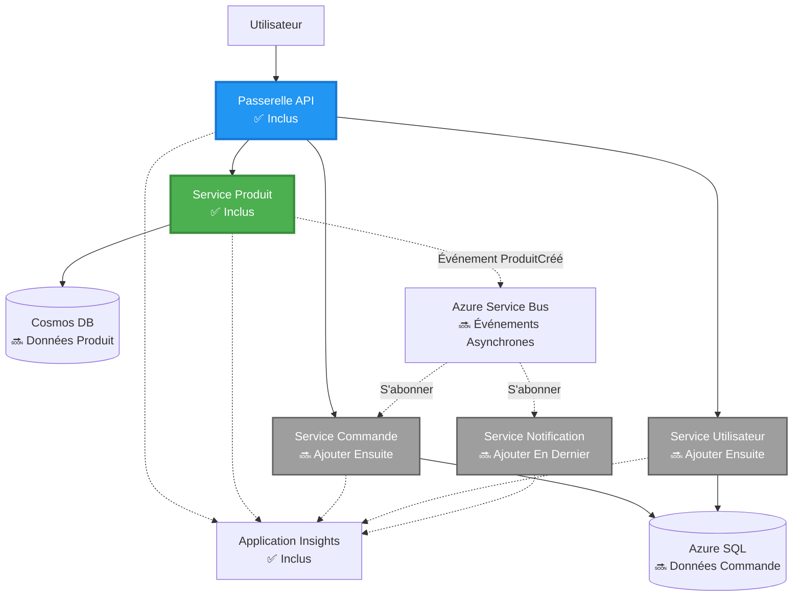
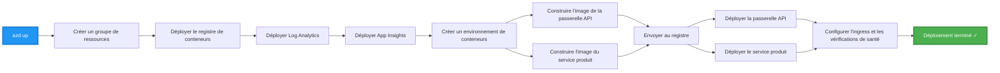
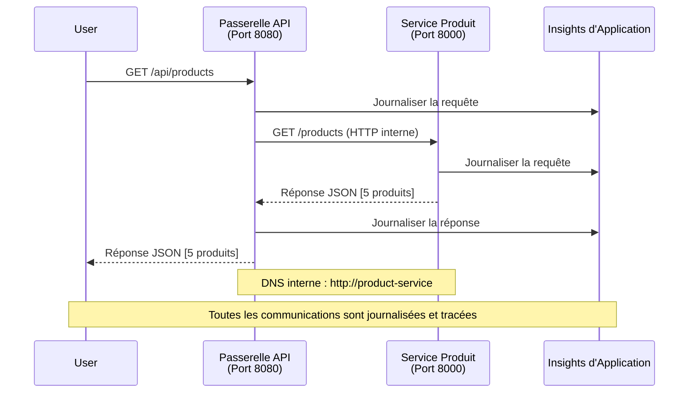

<!--
CO_OP_TRANSLATOR_METADATA:
{
  "original_hash": "eb3a4803a1e80a7f2e64f6bf63738c0f",
  "translation_date": "2025-11-19T16:26:41+00:00",
  "source_file": "examples/microservices/README.md",
  "language_code": "fr"
}
-->
# Architecture des Microservices - Exemple d'Application Conteneurisée

⏱️ **Temps estimé** : 25-35 minutes | 💰 **Coût estimé** : ~50-100 $/mois | ⭐ **Complexité** : Avancée

**📚 Parcours d'apprentissage :**
- ← Précédent : [API Flask Simple](../../../../examples/container-app/simple-flask-api) - Bases d'un conteneur unique
- 🎯 **Vous êtes ici** : Architecture des Microservices (fondation à 2 services)
- → Suivant : [Intégration de l'IA](../../../../docs/ai-foundry) - Ajoutez de l'intelligence à vos services
- 🏠 [Accueil du cours](../../README.md)

---

Une **architecture de microservices simplifiée mais fonctionnelle** déployée sur Azure Container Apps à l'aide de l'outil AZD CLI. Cet exemple illustre la communication entre services, l'orchestration des conteneurs et la surveillance avec une configuration pratique à 2 services.

> **📚 Approche pédagogique** : Cet exemple commence par une architecture minimale à 2 services (API Gateway + Service Backend) que vous pouvez réellement déployer et apprendre. Une fois cette base maîtrisée, nous fournissons des conseils pour évoluer vers un écosystème complet de microservices.

## Ce que vous apprendrez

En complétant cet exemple, vous allez :
- Déployer plusieurs conteneurs sur Azure Container Apps
- Mettre en œuvre la communication entre services avec un réseau interne
- Configurer une mise à l'échelle basée sur l'environnement et des vérifications de santé
- Surveiller des applications distribuées avec Application Insights
- Comprendre les modèles de déploiement des microservices et les meilleures pratiques
- Apprendre à évoluer progressivement d'architectures simples à complexes

## Architecture

### Phase 1 : Ce que nous construisons (inclus dans cet exemple)


**Détails des composants :**

| Composant | Objectif | Accès | Ressources |
|-----------|----------|-------|------------|
| **API Gateway** | Redirige les requêtes externes vers les services backend | Public (HTTPS) | 1 vCPU, 2GB RAM, 2-20 réplicas |
| **Service Produit** | Gère le catalogue de produits avec des données en mémoire | Interne uniquement | 0.5 vCPU, 1GB RAM, 1-10 réplicas |
| **Application Insights** | Journalisation centralisée et traçage distribué | Portail Azure | 1-2 GB/mois d'ingestion de données |

**Pourquoi commencer simplement ?**
- ✅ Déployez et comprenez rapidement (25-35 minutes)
- ✅ Apprenez les modèles de base des microservices sans complexité
- ✅ Code fonctionnel que vous pouvez modifier et expérimenter
- ✅ Coût réduit pour l'apprentissage (~50-100 $/mois contre 300-1400 $/mois)
- ✅ Gagnez en confiance avant d'ajouter des bases de données et des files de messages

**Analogie** : Pensez à cela comme apprendre à conduire. Vous commencez dans un parking vide (2 services), maîtrisez les bases, puis progressez vers la circulation en ville (5+ services avec bases de données).

### Phase 2 : Expansion future (architecture de référence)

Une fois que vous maîtrisez l'architecture à 2 services, vous pouvez évoluer vers :


Consultez la section "Guide d'expansion" à la fin pour des instructions étape par étape.

## Fonctionnalités incluses

✅ **Découverte de services** : Découverte automatique basée sur DNS entre conteneurs  
✅ **Équilibrage de charge** : Équilibrage de charge intégré entre réplicas  
✅ **Mise à l'échelle automatique** : Mise à l'échelle indépendante par service basée sur les requêtes HTTP  
✅ **Surveillance de la santé** : Probes de vivacité et de disponibilité pour les deux services  
✅ **Journalisation distribuée** : Journalisation centralisée avec Application Insights  
✅ **Réseau interne** : Communication sécurisée entre services  
✅ **Orchestration des conteneurs** : Déploiement et mise à l'échelle automatiques  
✅ **Mises à jour sans interruption** : Mises à jour progressives avec gestion des révisions  

## Prérequis

### Outils requis

Avant de commencer, vérifiez que vous avez ces outils installés :

1. **[Azure Developer CLI (azd)](https://learn.microsoft.com/azure/developer/azure-developer-cli/install-azd)** (version 1.0.0 ou supérieure)  
   ```bash
   azd version
   # Résultat attendu : version azd 1.0.0 ou supérieure
   ```

2. **[Azure CLI](https://learn.microsoft.com/cli/azure/install-azure-cli)** (version 2.50.0 ou supérieure)  
   ```bash
   az --version
   # Résultat attendu : azure-cli 2.50.0 ou supérieur
   ```

3. **[Docker](https://www.docker.com/get-started)** (pour le développement/test local - optionnel)  
   ```bash
   docker --version
   # Résultat attendu : version Docker 20.10 ou supérieure
   ```

### Vérifiez votre configuration

Exécutez ces commandes pour confirmer que vous êtes prêt :

```bash
# Vérifiez Azure Developer CLI
azd version
# ✅ Attendu : version azd 1.0.0 ou supérieure

# Vérifiez Azure CLI
az --version
# ✅ Attendu : azure-cli 2.50.0 ou supérieure

# Vérifiez Docker (optionnel)
docker --version
# ✅ Attendu : version Docker 20.10 ou supérieure
```

**Critères de réussite** : Toutes les commandes renvoient des numéros de version correspondant ou supérieurs aux minimums requis.

### Exigences Azure

- Un **abonnement Azure actif** ([créez un compte gratuit](https://azure.microsoft.com/free/))
- Permissions pour créer des ressources dans votre abonnement
- Rôle **Contributeur** sur l'abonnement ou le groupe de ressources

### Prérequis en connaissances

Ceci est un exemple de **niveau avancé**. Vous devriez avoir :
- Complété l'exemple [API Flask Simple](../../../../examples/container-app/simple-flask-api) 
- Une compréhension de base de l'architecture des microservices
- Une familiarité avec les API REST et HTTP
- Une compréhension des concepts de conteneurs

**Nouveau sur Container Apps ?** Commencez par l'exemple [API Flask Simple](../../../../examples/container-app/simple-flask-api) pour apprendre les bases.

## Démarrage rapide (étape par étape)

### Étape 1 : Cloner et naviguer

```bash
git clone https://github.com/microsoft/AZD-for-beginners.git
cd AZD-for-beginners/examples/microservices
```

**✓ Vérification de réussite** : Vérifiez que vous voyez `azure.yaml` :
```bash
ls
# Attendu : README.md, azure.yaml, infra/, src/
```

### Étape 2 : Authentifiez-vous avec Azure

```bash
azd auth login
```

Cela ouvre votre navigateur pour l'authentification Azure. Connectez-vous avec vos identifiants Azure.

**✓ Vérification de réussite** : Vous devriez voir :
```
Logged in to Azure.
```

### Étape 3 : Initialisez l'environnement

```bash
azd init
```

**Invites que vous verrez** :
- **Nom de l'environnement** : Entrez un nom court (par ex. `microservices-dev`)
- **Abonnement Azure** : Sélectionnez votre abonnement
- **Emplacement Azure** : Choisissez une région (par ex. `eastus`, `westeurope`)

**✓ Vérification de réussite** : Vous devriez voir :
```
SUCCESS: New project initialized!
```

### Étape 4 : Déployez l'infrastructure et les services

```bash
azd up
```

**Ce qui se passe** (prend 8-12 minutes) :


**✓ Vérification de réussite** : Vous devriez voir :
```
SUCCESS: Your application was deployed to Azure in X minutes Y seconds.
Endpoint: https://api-gateway-<unique-id>.azurecontainerapps.io
```

**⏱️ Temps** : 8-12 minutes

### Étape 5 : Testez le déploiement

```bash
# Obtenir le point de terminaison de la passerelle
GATEWAY_URL=$(azd env get-values | grep API_GATEWAY_URL | cut -d '=' -f2 | tr -d '"')

# Tester la santé de l'API Gateway
curl $GATEWAY_URL/health
```

**✅ Résultat attendu :**
```json
{
  "status": "healthy",
  "service": "api-gateway",
  "timestamp": "2025-11-19T10:30:00Z"
}
```

**Testez le service produit via la passerelle** :
```bash
# Lister les produits
curl $GATEWAY_URL/api/products
```

**✅ Résultat attendu :**
```json
[
  {"id":1,"name":"Laptop","price":999.99,"stock":50},
  {"id":2,"name":"Mouse","price":29.99,"stock":200},
  {"id":3,"name":"Keyboard","price":79.99,"stock":150}
]
```

**✓ Vérification de réussite** : Les deux points de terminaison renvoient des données JSON sans erreurs.

---

**🎉 Félicitations !** Vous avez déployé une architecture de microservices sur Azure !

## Structure du projet

Tous les fichiers d'implémentation sont inclus—c'est un exemple complet et fonctionnel :

```
microservices/
│
├── README.md                         # This file
├── azure.yaml                        # AZD configuration
├── .gitignore                        # Git ignore patterns
│
├── infra/                           # Infrastructure as Code (Bicep)
│   ├── main.bicep                   # Main orchestration
│   ├── abbreviations.json           # Naming conventions
│   ├── core/                        # Shared infrastructure
│   │   ├── container-apps-environment.bicep  # Container environment + registry
│   │   └── monitor.bicep            # Application Insights + Log Analytics
│   └── app/                         # Service definitions
│       ├── api-gateway.bicep        # API Gateway container app
│       └── product-service.bicep    # Product Service container app
│
└── src/                             # Application source code
    ├── api-gateway/                 # Node.js API Gateway
    │   ├── app.js                   # Express server with routing
    │   ├── package.json             # Node dependencies
    │   └── Dockerfile               # Container definition
    └── product-service/             # Python Product Service
        ├── main.py                  # Flask API with product data
        ├── requirements.txt         # Python dependencies
        └── Dockerfile               # Container definition
```

**Ce que fait chaque composant :**

**Infrastructure (infra/)** :
- `main.bicep` : Orchestration de toutes les ressources Azure et leurs dépendances
- `core/container-apps-environment.bicep` : Crée l'environnement Container Apps et Azure Container Registry
- `core/monitor.bicep` : Configure Application Insights pour la journalisation distribuée
- `app/*.bicep` : Définitions individuelles des applications conteneurisées avec mise à l'échelle et vérifications de santé

**API Gateway (src/api-gateway/)** :
- Service public qui redirige les requêtes vers les services backend
- Implémente la journalisation, la gestion des erreurs et le transfert des requêtes
- Illustre la communication HTTP entre services

**Service Produit (src/product-service/)** :
- Service interne avec un catalogue de produits (en mémoire pour simplifier)
- API REST avec vérifications de santé
- Exemple de modèle de microservice backend

## Aperçu des services

### API Gateway (Node.js/Express)

**Port** : 8080  
**Accès** : Public (ingress externe)  
**Objectif** : Redirige les requêtes entrantes vers les services backend  

**Points de terminaison** :
- `GET /` - Informations sur le service
- `GET /health` - Point de terminaison de vérification de santé
- `GET /api/products` - Transfert vers le service produit (liste complète)
- `GET /api/products/:id` - Transfert vers le service produit (par ID)

**Caractéristiques principales** :
- Routage des requêtes avec axios
- Journalisation centralisée
- Gestion des erreurs et des délais d'attente
- Découverte de services via des variables d'environnement
- Intégration avec Application Insights

**Extrait de code** (`src/api-gateway/app.js`) :
```javascript
// Communication interne entre services
app.get('/api/products', async (req, res) => {
  const response = await axios.get(`${PRODUCT_SERVICE_URL}/products`, {
    timeout: 5000
  });
  res.json(response.data);
});
```

### Service Produit (Python/Flask)

**Port** : 8000  
**Accès** : Interne uniquement (pas d'ingress externe)  
**Objectif** : Gère le catalogue de produits avec des données en mémoire  

**Points de terminaison** :
- `GET /` - Informations sur le service
- `GET /health` - Point de terminaison de vérification de santé
- `GET /products` - Liste tous les produits
- `GET /products/<id>` - Obtenir un produit par ID

**Caractéristiques principales** :
- API RESTful avec Flask
- Stockage de produits en mémoire (simple, pas de base de données nécessaire)
- Surveillance de la santé avec probes
- Journalisation structurée
- Intégration avec Application Insights

**Modèle de données** :
```python
{
  "id": 1,
  "name": "Laptop",
  "description": "High-performance laptop",
  "price": 999.99,
  "stock": 50
}
```

**Pourquoi interne uniquement ?**
Le service produit n'est pas exposé publiquement. Toutes les requêtes doivent passer par l'API Gateway, qui offre :
- Sécurité : Point d'accès contrôlé
- Flexibilité : Possibilité de modifier le backend sans impacter les clients
- Surveillance : Journalisation centralisée des requêtes

## Comprendre la communication entre services

### Comment les services communiquent entre eux


Dans cet exemple, l'API Gateway communique avec le Service Produit via des **appels HTTP internes** :

```javascript
// Passerelle API (src/api-gateway/app.js)
const PRODUCT_SERVICE_URL = process.env.PRODUCT_SERVICE_URL;

// Faire une requête HTTP interne
const response = await axios.get(`${PRODUCT_SERVICE_URL}/products`);
```

**Points clés** :

1. **Découverte basée sur DNS** : Container Apps fournit automatiquement un DNS pour les services internes
   - FQDN du Service Produit : `product-service.internal.<environment>.azurecontainerapps.io`
   - Simplifié en : `http://product-service` (résolu par Container Apps)

2. **Pas d'exposition publique** : Le Service Produit a `external: false` dans Bicep
   - Accessible uniquement dans l'environnement Container Apps
   - Impossible à atteindre depuis Internet

3. **Variables d'environnement** : Les URL des services sont injectées au moment du déploiement
   - Bicep transmet le FQDN interne à la passerelle
   - Pas d'URL codées en dur dans le code de l'application

**Analogie** : Pensez à cela comme des bureaux. L'API Gateway est la réception (publique), et le Service Produit est un bureau (interne uniquement). Les visiteurs doivent passer par la réception pour accéder à un bureau.

## Options de déploiement

### Déploiement complet (recommandé)

```bash
# Déployer l'infrastructure et les deux services
azd up
```

Cela déploie :
1. Environnement Container Apps
2. Application Insights
3. Container Registry
4. Conteneur API Gateway
5. Conteneur Service Produit

**Temps** : 8-12 minutes

### Déployer un service individuel

```bash
# Déployez uniquement un service (après le premier azd up)
azd deploy api-gateway

# Ou déployez le service produit
azd deploy product-service
```

**Cas d'utilisation** : Lorsque vous avez mis à jour le code d'un service et souhaitez redéployer uniquement ce service.

### Mettre à jour la configuration

```bash
# Modifier les paramètres de mise à l'échelle
azd env set GATEWAY_MAX_REPLICAS 30

# Redéployer avec la nouvelle configuration
azd up
```

## Configuration

### Configuration de la mise à l'échelle

Les deux services sont configurés avec une mise à l'échelle automatique basée sur HTTP dans leurs fichiers Bicep :

**API Gateway** :
- Réplicas minimum : 2 (toujours au moins 2 pour la disponibilité)
- Réplicas maximum : 20
- Déclencheur de mise à l'échelle : 50 requêtes simultanées par réplique

**Service Produit** :
- Réplicas minimum : 1 (peut descendre à zéro si nécessaire)
- Réplicas maximum : 10
- Déclencheur de mise à l'échelle : 100 requêtes simultanées par réplique

**Personnaliser la mise à l'échelle** (dans `infra/app/*.bicep`) :
```bicep
scale: {
  minReplicas: 1
  maxReplicas: 10
  rules: [
    {
      name: 'http-scale-rule'
      http: {
        metadata: {
          concurrentRequests: '100'  // Adjust this
        }
      }
    }
  ]
}
```

### Allocation des ressources

**API Gateway** :
- CPU : 1.0 vCPU
- Mémoire : 2 GiB
- Raison : Gère tout le trafic externe

**Service Produit** :
- CPU : 0.5 vCPU
- Mémoire : 1 GiB
- Raison : Opérations légères en mémoire

### Vérifications de santé

Les deux services incluent des probes de vivacité et de disponibilité :

```bicep
probes: [
  {
    type: 'Liveness'
    httpGet: {
      path: '/health'
      port: 8080
    }
    initialDelaySeconds: 10
    periodSeconds: 30
  }
  {
    type: 'Readiness'
    httpGet: {
      path: '/health'
      port: 8080
    }
    initialDelaySeconds: 5
    periodSeconds: 10
  }
]
```

**Ce que cela signifie** :
- **Vivacité** : Si la vérification de santé échoue, Container Apps redémarre le conteneur
- **Disponibilité** : Si non prêt, Container Apps arrête de router le trafic vers cette réplique

## Surveillance et observabilité

### Voir les journaux des services

```bash
# Diffuser les journaux depuis API Gateway
azd logs api-gateway --follow

# Voir les journaux récents du service produit
azd logs product-service --tail 100

# Voir tous les journaux des deux services
azd logs --follow
```

**Résultat attendu** :
```
[api-gateway] API Gateway listening on port 8080
[api-gateway] Product Service URL: http://product-service
[api-gateway] GET /api/products 200 - 45ms
[product-service] Retrieved 5 products
```

### Requêtes Application Insights

Accédez à Application Insights dans le Portail Azure, puis exécutez ces requêtes :

**Trouver les requêtes lentes** :
```kusto
requests
| where timestamp > ago(1h)
| where duration > 1000  // Requests taking >1 second
| summarize count() by name, cloud_RoleName
| order by count_ desc
```

**Suivre les appels entre services** :
```kusto
dependencies
| where timestamp > ago(1h)
| where type == "Http"
| project timestamp, name, target, duration, success
| order by timestamp desc
```

**Taux d'erreur par service** :
```kusto
exceptions
| where timestamp > ago(24h)
| summarize errorCount = count() by cloud_RoleName, type
| order by errorCount desc
```

**Volume des requêtes dans le temps** :
```kusto
requests
| where timestamp > ago(1h)
| summarize requestCount = count() by bin(timestamp, 5m), cloud_RoleName
| render timechart
```

### Accéder au tableau de bord de surveillance

```bash
# Obtenir les détails d'Application Insights
azd env get-values | grep APPLICATIONINSIGHTS

# Ouvrir la surveillance du portail Azure
az monitor app-insights component show \
  --app $(azd env get-values | grep APPLICATIONINSIGHTS_CONNECTION_STRING | cut -d '=' -f2) \
  --resource-group $(azd env get-values | grep AZURE_RESOURCE_GROUP | cut -d '=' -f2) \
  --query "appId" -o tsv
```

### Métriques en direct

1. Accédez à Application Insights dans le Portail Azure
2. Cliquez sur "Métriques en direct"
3. Voyez les requêtes, échecs et performances en temps réel
4. Testez en exécutant : `curl $(azd env get-values | grep API_GATEWAY_URL | cut -d '=' -f2 | tr -d '"')/api/products`

## Exercices pratiques

### Exercice 1 : Ajouter un nouvel endpoint produit ⭐ (Facile)

**Objectif** : Ajouter un endpoint POST pour créer de nouveaux produits

**Point de départ** : `src/product-service/main.py`

**Étapes** :

1. Ajoutez cet endpoint après la fonction `get_product` dans `main.py` :

```python
@app.route('/products', methods=['POST'])
def create_product():
    """Create a new product"""
    data = request.get_json()
    
    # Valider les champs requis
    if not data or 'name' not in data or 'price' not in data:
        return jsonify({'error': 'Missing required fields: name, price'}), 400
    
    new_id = max(p['id'] for p in products) + 1
    new_product = {
        'id': new_id,
        'name': data['name'],
        'description': data.get('description', ''),
        'price': float(data['price']),
        'stock': int(data.get('stock', 0))
    }
    products.append(new_product)
    logger.info(f"Created product {new_id}")
    return jsonify(new_product), 201
```

2. Ajoutez la route POST à l'API Gateway (`src/api-gateway/app.js`) :

```javascript
// Ajoutez ceci après la route GET /api/products
app.post('/api/products', async (req, res) => {
  try {
    console.log(`Forwarding POST request to ${PRODUCT_SERVICE_URL}/products`);
    const response = await axios.post(`${PRODUCT_SERVICE_URL}/products`, req.body, {
      timeout: 5000
    });
    res.status(201).json(response.data);
  } catch (error) {
    console.error('Error calling product service:', error.message);
    res.status(503).json({
      error: 'Product service unavailable',
      message: error.message
    });
  }
});
```

3. Redéployez les deux services :

```bash
azd deploy product-service
azd deploy api-gateway
```

4. Testez le nouveau point de terminaison :

```bash
GATEWAY_URL=$(azd env get-values | grep API_GATEWAY_URL | cut -d '=' -f2 | tr -d '"')

# Créer un nouveau produit
curl -X POST $GATEWAY_URL/api/products \
  -H "Content-Type: application/json" \
  -d '{"name":"USB Cable","price":9.99,"stock":500}'
```

**✅ Résultat attendu :**
```json
{"id":6,"name":"USB Cable","description":"","price":9.99,"stock":500}
```

5. Vérifiez qu'il apparaît dans la liste :

```bash
curl $GATEWAY_URL/api/products
# Devrait maintenant afficher 6 produits, y compris le nouveau câble USB
```

**Critères de réussite** :
- ✅ La requête POST retourne un HTTP 201
- ✅ Le nouveau produit apparaît dans la liste GET /api/products
- ✅ Le produit possède un ID incrémenté automatiquement

**Temps** : 10-15 minutes

---

### Exercice 2 : Modifier les règles d'autoscaling ⭐⭐ (Moyen)

**Objectif** : Configurer le service produit pour qu'il s'adapte plus rapidement à la charge

**Point de départ** : `infra/app/product-service.bicep`

**Étapes** :

1. Ouvrez `infra/app/product-service.bicep` et trouvez le bloc `scale` (vers la ligne 95)

2. Modifiez de :
```bicep
scale: {
  minReplicas: 1
  maxReplicas: 10
  rules: [
    {
      name: 'http-scale-rule'
      http: {
        metadata: {
          concurrentRequests: '100'  // OLD
        }
      }
    }
  ]
}
```

À :
```bicep
scale: {
  minReplicas: 2  // Always have 2 running
  maxReplicas: 20  // Allow more scaling
  rules: [
    {
      name: 'http-scale-rule'
      http: {
        metadata: {
          concurrentRequests: '20'  // Scale at lower threshold
        }
      }
    }
  ]
}
```

3. Redéployez l'infrastructure :

```bash
azd up
```

4. Vérifiez la nouvelle configuration de scaling :

```bash
az containerapp show \
  --name $(azd env get-values | grep PRODUCT_SERVICE | head -1 | cut -d '/' -f5) \
  --resource-group $(azd env get-values | grep AZURE_RESOURCE_GROUP | cut -d '=' -f2 | tr -d '"') \
  --query "properties.template.scale" -o json
```

**✅ Résultat attendu :**
```json
{
  "minReplicas": 2,
  "maxReplicas": 20,
  "rules": [...]
}
```

5. Testez l'autoscaling sous charge :

```bash
# Générer des requêtes simultanées
for i in {1..500}; do curl $GATEWAY_URL/api/products & done

# Observer le redimensionnement en cours
azd logs product-service --follow
# Rechercher : Événements de redimensionnement des applications de conteneurs
```

**Critères de réussite** :
- ✅ Le service produit fonctionne toujours avec au moins 2 réplicas
- ✅ Sous charge, il passe à plus de 2 réplicas
- ✅ Le portail Azure affiche les nouvelles règles de scaling

**Temps** : 15-20 minutes

---

### Exercice 3 : Ajouter une requête de monitoring personnalisée ⭐⭐ (Moyen)

**Objectif** : Créer une requête personnalisée dans Application Insights pour suivre les performances de l'API produit

**Étapes** :

1. Accédez à Application Insights dans le portail Azure :
   - Allez sur le portail Azure
   - Trouvez votre groupe de ressources (rg-microservices-*)
   - Cliquez sur la ressource Application Insights

2. Cliquez sur "Logs" dans le menu de gauche

3. Créez cette requête :

```kusto
requests
| where timestamp > ago(1h)
| where name contains "products"
| summarize 
    RequestCount = count(),
    AvgDuration = avg(duration),
    P95Duration = percentile(duration, 95),
    SuccessRate = 100.0 * countif(success == true) / count()
  by bin(timestamp, 5m)
| render timechart
```

4. Cliquez sur "Exécuter" pour lancer la requête

5. Enregistrez la requête :
   - Cliquez sur "Enregistrer"
   - Nom : "Performances API Produit"
   - Catégorie : "Performance"

6. Générez du trafic de test :

```bash
for i in {1..100}; do curl $GATEWAY_URL/api/products; sleep 1; done
```

7. Actualisez la requête pour voir les données

**✅ Résultat attendu :**
- Un graphique montrant le nombre de requêtes au fil du temps
- Durée moyenne < 500ms
- Taux de réussite = 100%
- Intervalles de temps de 5 minutes

**Critères de réussite** :
- ✅ La requête montre 100+ requêtes
- ✅ Taux de réussite de 100%
- ✅ Durée moyenne < 500ms
- ✅ Le graphique affiche des intervalles de 5 minutes

**Résultat d'apprentissage** : Comprendre comment surveiller les performances des services avec des requêtes personnalisées

**Temps** : 10-15 minutes

---

### Exercice 4 : Implémenter une logique de retry ⭐⭐⭐ (Avancé)

**Objectif** : Ajouter une logique de retry à l'API Gateway lorsque le service produit est temporairement indisponible

**Point de départ** : `src/api-gateway/app.js`

**Étapes** :

1. Installez une bibliothèque de retry :

```bash
cd src/api-gateway
npm install axios-retry --save
cd ../..
```

2. Mettez à jour `src/api-gateway/app.js` (ajoutez après l'importation d'axios) :

```javascript
const axiosRetry = require('axios-retry');

// Configurer la logique de nouvelle tentative
axiosRetry(axios, {
  retries: 3,
  retryDelay: (retryCount) => {
    return retryCount * 1000; // 1s, 2s, 3s
  },
  retryCondition: (error) => {
    // Réessayer en cas d'erreurs réseau ou de réponses 5xx
    return axiosRetry.isNetworkOrIdempotentRequestError(error) ||
           (error.response && error.response.status >= 500);
  }
});

console.log('Retry logic configured: 3 retries with exponential backoff');
```

3. Redéployez l'API Gateway :

```bash
azd deploy api-gateway
```

4. Testez le comportement de retry en simulant une panne du service :

```bash
# Mettre le service de produits à l'échelle 0 (simuler une panne)
az containerapp update \
  --name $(azd env get-values | grep PRODUCT_SERVICE | head -1 | cut -d '/' -f5) \
  --resource-group $(azd env get-values | grep AZURE_RESOURCE_GROUP | cut -d '=' -f2 | tr -d '"') \
  --min-replicas 0 \
  --max-replicas 0

# Essayer d'accéder aux produits (va réessayer 3 fois)
time curl -v $GATEWAY_URL/api/products
# Observer : La réponse prend ~6 secondes (1s + 2s + 3s de tentatives)

# Restaurer le service de produits
az containerapp update \
  --name $(azd env get-values | grep PRODUCT_SERVICE | head -1 | cut -d '/' -f5) \
  --resource-group $(azd env get-values | grep AZURE_RESOURCE_GROUP | cut -d '=' -f2 | tr -d '"') \
  --min-replicas 1 \
  --max-replicas 10
```

5. Consultez les logs de retry :

```bash
azd logs api-gateway --tail 50
# Rechercher : Messages de tentative de réessai
```

**✅ Comportement attendu :**
- Les requêtes sont réessayées 3 fois avant d'échouer
- Chaque retry attend plus longtemps (1s, 2s, 3s)
- Les requêtes réussissent après le redémarrage du service
- Les logs montrent les tentatives de retry

**Critères de réussite** :
- ✅ Les requêtes sont réessayées 3 fois avant d'échouer
- ✅ Chaque retry attend plus longtemps (backoff exponentiel)
- ✅ Les requêtes réussissent après le redémarrage du service
- ✅ Les logs montrent les tentatives de retry

**Résultat d'apprentissage** : Comprendre les modèles de résilience dans les microservices (circuit breakers, retries, timeouts)

**Temps** : 20-25 minutes

---

## Point de contrôle des connaissances

Après avoir terminé cet exemple, vérifiez votre compréhension :

### 1. Communication entre services ✓

Testez vos connaissances :
- [ ] Pouvez-vous expliquer comment l'API Gateway découvre le service produit ? (Découverte de service basée sur DNS)
- [ ] Que se passe-t-il si le service produit est hors ligne ? (Le Gateway retourne une erreur 503)
- [ ] Comment ajouteriez-vous un troisième service ? (Créer un nouveau fichier Bicep, l'ajouter à main.bicep, créer un dossier src)

**Vérification pratique :**
```bash
# Simuler une panne de service
az containerapp update --name <product-service-name> --min-replicas 0 --max-replicas 0
curl $GATEWAY_URL/api/products
# ✅ Attendu : 503 Service Indisponible

# Restaurer le service
az containerapp update --name <product-service-name> --min-replicas 1 --max-replicas 10
```

### 2. Monitoring et observabilité ✓

Testez vos connaissances :
- [ ] Où voyez-vous les logs distribués ? (Application Insights dans le portail Azure)
- [ ] Comment suivre les requêtes lentes ? (Requête Kusto : `requests | where duration > 1000`)
- [ ] Pouvez-vous identifier quel service a causé une erreur ? (Vérifiez le champ `cloud_RoleName` dans les logs)

**Vérification pratique :**
```bash
# Générer une simulation de requête lente
curl "$GATEWAY_URL/api/products?delay=2000"

# Interroger Application Insights pour les requêtes lentes
# Accéder au portail Azure → Application Insights → Journaux
# Exécuter : requests | where duration > 1000 | project timestamp, name, duration, cloud_RoleName
```

### 3. Scaling et performance ✓

Testez vos connaissances :
- [ ] Qu'est-ce qui déclenche l'autoscaling ? (Règles de requêtes HTTP concurrentes : 50 pour le Gateway, 100 pour le produit)
- [ ] Combien de réplicas fonctionnent actuellement ? (Vérifiez avec `az containerapp revision list`)
- [ ] Comment scaler le service produit à 5 réplicas ? (Mettez à jour minReplicas dans Bicep)

**Vérification pratique :**
```bash
# Générer une charge pour tester l'autoscaling
for i in {1..1000}; do curl $GATEWAY_URL/api/products & done

# Observer l'augmentation des réplicas
azd logs api-gateway --follow
# ✅ Attendu : Voir des événements de mise à l'échelle dans les journaux
```

**Critères de réussite** : Vous pouvez répondre à toutes les questions et vérifier avec des commandes pratiques.

---

## Analyse des coûts

### Coûts mensuels estimés (pour cet exemple à 2 services)

| Ressource | Configuration | Coût estimé |
|-----------|---------------|-------------|
| API Gateway | 2-20 réplicas, 1 vCPU, 2GB RAM | $30-150 |
| Service produit | 1-10 réplicas, 0.5 vCPU, 1GB RAM | $15-75 |
| Registre de conteneurs | Niveau basique | $5 |
| Application Insights | 1-2 GB/mois | $5-10 |
| Log Analytics | 1 GB/mois | $3 |
| **Total** | | **$58-243/mois** |

### Répartition des coûts par utilisation

**Trafic léger** (tests/apprentissage) : ~60$/mois
- API Gateway : 2 réplicas × 24/7 = $30
- Service produit : 1 réplique × 24/7 = $15
- Monitoring + registre = $13

**Trafic modéré** (petite production) : ~120$/mois
- API Gateway : 5 réplicas en moyenne = $75
- Service produit : 3 réplicas en moyenne = $45
- Monitoring + registre = $13

**Trafic élevé** (périodes chargées) : ~240$/mois
- API Gateway : 15 réplicas en moyenne = $225
- Service produit : 8 réplicas en moyenne = $120
- Monitoring + registre = $13

### Conseils pour optimiser les coûts

1. **Scalez à zéro pour le développement** :
   ```bicep
   scale: {
     minReplicas: 0  // Save $30-40/month when not in use
     maxReplicas: 10
   }
   ```

2. **Utilisez le plan de consommation pour Cosmos DB** (lorsque vous l'ajoutez) :
   - Payez uniquement ce que vous utilisez
   - Pas de frais minimum

3. **Configurez l'échantillonnage dans Application Insights** :
   ```javascript
   appInsights.defaultClient.config.samplingPercentage = 50; // Échantillonner 50% des requêtes
   ```

4. **Nettoyez les ressources inutiles** :
   ```bash
   azd down --force --purge
   ```

### Options de niveau gratuit

Pour apprendre/tester, envisagez :
- ✅ Utilisez les crédits gratuits Azure (200$ pour les 30 premiers jours avec un nouveau compte)
- ✅ Maintenez les réplicas au minimum (économise ~50% des coûts)
- ✅ Supprimez après les tests (pas de frais récurrents)
- ✅ Scalez à zéro entre les sessions d'apprentissage

**Exemple** : Exécuter cet exemple pendant 2 heures/jour × 30 jours = ~5$/mois au lieu de 60$/mois

---

## Référence rapide pour le dépannage

### Problème : `azd up` échoue avec "Abonnement introuvable"

**Solution** :
```bash
# Connectez-vous à nouveau avec un abonnement explicite
az account set --subscription <your-subscription-id>
azd env set AZURE_SUBSCRIPTION_ID <your-subscription-id>
azd up
```

### Problème : L'API Gateway retourne une erreur 503 "Service produit indisponible"

**Diagnostic** :
```bash
# Vérifiez les journaux du service produit
azd logs product-service --tail 50

# Vérifiez l'état de santé du service produit
az containerapp show \
  --name $(azd env get-values | grep PRODUCT_SERVICE | head -1 | cut -d '/' -f5) \
  --resource-group $(azd env get-values | grep AZURE_RESOURCE_GROUP | cut -d '=' -f2 | tr -d '"') \
  --query "properties.runningStatus"
```

**Causes fréquentes** :
1. Le service produit ne s'est pas lancé (vérifiez les logs pour des erreurs Python)
2. La vérification de santé échoue (vérifiez que le point de terminaison `/health` fonctionne)
3. La construction de l'image du conteneur a échoué (vérifiez le registre pour l'image)

### Problème : L'autoscaling ne fonctionne pas

**Diagnostic** :
```bash
# Vérifier le nombre actuel de réplicas
az containerapp revision list \
  --name $(azd env get-values | grep API_GATEWAY | head -1 | cut -d '/' -f5) \
  --resource-group $(azd env get-values | grep AZURE_RESOURCE_GROUP | cut -d '=' -f2 | tr -d '"') \
  --query "[].properties.replicas"

# Générer une charge pour tester
for i in {1..1000}; do curl $GATEWAY_URL/api/products & done

# Observer les événements de mise à l'échelle
azd logs api-gateway --follow | grep -i scale
```

**Causes fréquentes** :
1. La charge n'est pas assez élevée pour déclencher la règle de scaling (besoin de >50 requêtes concurrentes)
2. Le nombre maximum de réplicas est déjà atteint (vérifiez la configuration Bicep)
3. La règle de scaling est mal configurée dans Bicep (vérifiez la valeur concurrentRequests)

### Problème : Application Insights n'affiche pas les logs

**Diagnostic** :
```bash
# Vérifiez que la chaîne de connexion est définie
azd env get-values | grep APPLICATIONINSIGHTS

# Vérifiez si les services envoient de la télémétrie
az monitor app-insights component show \
  --app $(azd env get-values | grep APPLICATIONINSIGHTS_NAME | cut -d '=' -f2 | tr -d '"') \
  --resource-group $(azd env get-values | grep AZURE_RESOURCE_GROUP | cut -d '=' -f2 | tr -d '"') \
  --query "properties.InstrumentationKey"
```

**Causes fréquentes** :
1. La chaîne de connexion n'est pas passée au conteneur (vérifiez les variables d'environnement)
2. Le SDK Application Insights n'est pas configuré (vérifiez les imports dans le code)
3. Le pare-feu bloque la télémétrie (rare, vérifiez les règles réseau)

### Problème : La construction Docker échoue localement

**Diagnostic** :
```bash
# Tester la construction de la passerelle API
cd src/api-gateway
docker build -t test-gateway .

# Tester la construction du service produit
cd ../product-service
docker build -t test-product .
```

**Causes fréquentes** :
1. Dépendances manquantes dans package.json/requirements.txt
2. Erreurs de syntaxe dans Dockerfile
3. Problèmes réseau lors du téléchargement des dépendances

**Toujours bloqué ?** Consultez [Guide des problèmes courants](../../docs/troubleshooting/common-issues.md) ou [Dépannage Azure Container Apps](https://learn.microsoft.com/azure/container-apps/troubleshooting)

---

## Nettoyage

Pour éviter des frais récurrents, supprimez toutes les ressources :

```bash
azd down --force --purge
```

**Invite de confirmation** :
```
? Total resources to delete: 6, are you sure you want to continue? (y/N)
```

Tapez `y` pour confirmer.

**Ce qui est supprimé** :
- Environnement des applications conteneurisées
- Les deux applications conteneurisées (Gateway & service produit)
- Registre de conteneurs
- Application Insights
- Workspace Log Analytics
- Groupe de ressources

**✓ Vérifiez le nettoyage** :
```bash
az group list --query "[?starts_with(name,'rg-microservices')]" --output table
```

Devrait retourner vide.

---

## Guide d'expansion : De 2 à 5+ services

Une fois que vous maîtrisez cette architecture à 2 services, voici comment l'étendre :

### Phase 1 : Ajouter une base de données persistante (Prochaine étape)

**Ajoutez Cosmos DB pour le service produit** :

1. Créez `infra/core/cosmos.bicep` :
   ```bicep
   resource cosmosAccount 'Microsoft.DocumentDB/databaseAccounts@2023-04-15' = {
     name: name
     location: location
     kind: 'GlobalDocumentDB'
     properties: {
       databaseAccountOfferType: 'Standard'
       consistencyPolicy: { defaultConsistencyLevel: 'Session' }
       locations: [{ locationName: location, failoverPriority: 0 }]
     }
   }
   ```

2. Mettez à jour le service produit pour utiliser le SDK Python Azure Cosmos DB au lieu des données en mémoire

3. Coût supplémentaire estimé : ~25$/mois (serverless)

### Phase 2 : Ajouter un troisième service (Gestion des commandes)

**Créez le service de commande** :

1. Nouveau dossier : `src/order-service/` (Python/Node.js/C#)
2. Nouveau fichier Bicep : `infra/app/order-service.bicep`
3. Mettez à jour l'API Gateway pour router `/api/orders`
4. Ajoutez une base de données Azure SQL pour la persistance des commandes

**L'architecture devient** :
```
API Gateway → Product Service (Cosmos DB)
           → Order Service (Azure SQL)
```

### Phase 3 : Ajouter une communication asynchrone (Service Bus)

**Implémentez une architecture événementielle** :

1. Ajoutez Azure Service Bus : `infra/core/servicebus.bicep`
2. Le service produit publie des événements "ProductCreated"
3. Le service de commande s'abonne aux événements produits
4. Ajoutez un service de notification pour traiter les événements

**Modèle** : Requête/Réponse (HTTP) + Événementiel (Service Bus)

### Phase 4 : Ajouter une authentification utilisateur

**Implémentez un service utilisateur** :

1. Créez `src/user-service/` (Go/Node.js)
2. Ajoutez Azure AD B2C ou une authentification JWT personnalisée
3. L'API Gateway valide les tokens avant de router
4. Les services vérifient les permissions des utilisateurs

### Phase 5 : Préparation à la production

**Ajoutez ces composants** :
- ✅ Azure Front Door (équilibrage de charge global)
- ✅ Azure Key Vault (gestion des secrets)
- ✅ Azure Monitor Workbooks (tableaux de bord personnalisés)
- ✅ Pipeline CI/CD (GitHub Actions)
- ✅ Déploiements Blue-Green
- ✅ Identité managée pour tous les services

**Coût total de l'architecture en production** : ~300-1,400$/mois

---

## En savoir plus

### Documentation associée
- [Documentation Azure Container Apps](https://learn.microsoft.com/azure/container-apps/)
- [Guide d'architecture microservices](https://learn.microsoft.com/azure/architecture/guide/architecture-styles/microservices)
- [Application Insights pour le traçage distribué](https://learn.microsoft.com/azure/azure-monitor/app/distributed-tracing)
- [Documentation Azure Developer CLI](https://learn.microsoft.com/azure/developer/azure-developer-cli/)

### Prochaines étapes dans ce cours
- ← Précédent : [API Flask simple](../../../../examples/container-app/simple-flask-api) - Exemple débutant avec un conteneur unique
- → Suivant : [Guide d'intégration AI](../../../../docs/ai-foundry) - Ajouter des capacités AI
- 🏠 [Accueil du cours](../../README.md)

### Comparaison : Quand utiliser quoi

| Fonctionnalité | Conteneur unique | Microservices (Ce cours) | Kubernetes (AKS) |
|----------------|------------------|--------------------------|------------------|
| **Cas d'utilisation** | Applications simples | Applications complexes | Applications d'entreprise |
| **Scalabilité** | Service unique | Scalabilité par service | Flexibilité maximale |
| **Complexité** | Faible | Moyenne | Élevée |
| **Taille de l'équipe** | 1-3 développeurs | 3-10 développeurs | 10+ développeurs |
| **Coût** | ~15-50$/mois | ~60-250$/mois | ~150-500$/mois |
| **Temps de déploiement** | 5-10 minutes | 8-12 minutes | 15-30 minutes |
| **Idéal pour** | MVPs, prototypes | Applications en production | Multi-cloud, réseau avancé |

**Recommandation** : Commencez avec Container Apps (cet exemple), passez à AKS uniquement si vous avez besoin de fonctionnalités spécifiques à Kubernetes.

---

## Questions Fréquemment Posées

**Q : Pourquoi seulement 2 services au lieu de 5+ ?**  
R : Progression éducative. Maîtrisez les bases (communication entre services, surveillance, mise à l'échelle) avec un exemple simple avant d'ajouter de la complexité. Les modèles que vous apprenez ici s'appliquent aux architectures à 100 services.

**Q : Puis-je ajouter plus de services moi-même ?**  
R : Absolument ! Suivez le guide d'expansion ci-dessus. Chaque nouveau service suit le même modèle : créer un dossier src, créer un fichier Bicep, mettre à jour azure.yaml, déployer.

**Q : Est-ce prêt pour la production ?**  
R : C'est une base solide. Pour la production, ajoutez : identité gérée, Key Vault, bases de données persistantes, pipeline CI/CD, alertes de surveillance et stratégie de sauvegarde.

**Q : Pourquoi ne pas utiliser Dapr ou un autre service mesh ?**  
R : Gardez-le simple pour l'apprentissage. Une fois que vous comprenez le réseau natif des Container Apps, vous pouvez ajouter Dapr pour des scénarios avancés (gestion d'état, pub/sub, bindings).

**Q : Comment déboguer localement ?**  
R : Exécutez les services localement avec Docker :  
```bash
cd src/api-gateway
docker build -t local-gateway .
docker run -p 8080:8080 -e PRODUCT_SERVICE_URL=http://localhost:8000 local-gateway
```


**Q : Puis-je utiliser différents langages de programmation ?**  
R : Oui ! Cet exemple montre Node.js (gateway) + Python (service produit). Vous pouvez mélanger n'importe quels langages qui fonctionnent dans des conteneurs : C#, Go, Java, Ruby, PHP, etc.

**Q : Et si je n'ai pas de crédits Azure ?**  
R : Utilisez le niveau gratuit d'Azure (les 30 premiers jours avec de nouveaux comptes offrent 200 $ de crédits) ou déployez pour des périodes de test courtes et supprimez immédiatement. Cet exemple coûte environ 2 $/jour.

**Q : En quoi est-ce différent d'Azure Kubernetes Service (AKS) ?**  
R : Container Apps est plus simple (pas besoin de connaissances sur Kubernetes) mais moins flexible. AKS vous donne un contrôle complet sur Kubernetes mais nécessite plus d'expertise. Commencez avec Container Apps, passez à AKS si nécessaire.

**Q : Puis-je utiliser cela avec des services Azure existants ?**  
R : Oui ! Vous pouvez vous connecter à des bases de données existantes, des comptes de stockage, Service Bus, etc. Mettez à jour les fichiers Bicep pour référencer des ressources existantes au lieu d'en créer de nouvelles.

---

> **🎓 Résumé du parcours d'apprentissage** : Vous avez appris à déployer une architecture multi-services avec mise à l'échelle automatique, réseau interne, surveillance centralisée et modèles prêts pour la production. Cette base vous prépare à des systèmes distribués complexes et des architectures de microservices d'entreprise.

**📚 Navigation du cours :**
- ← Précédent : [API Flask simple](../../../../examples/container-app/simple-flask-api)
- → Suivant : [Exemple d'intégration de base de données](../../../../database-app)
- 🏠 [Accueil du cours](../../README.md)
- 📖 [Meilleures pratiques pour Container Apps](../../docs/deployment/deployment-guide.md)

---

**✨ Félicitations !** Vous avez terminé l'exemple de microservices. Vous comprenez maintenant comment construire, déployer et surveiller des applications distribuées sur Azure Container Apps. Prêt à ajouter des capacités d'IA ? Consultez le [Guide d'intégration de l'IA](../../../../docs/ai-foundry) !

---

<!-- CO-OP TRANSLATOR DISCLAIMER START -->
**Avertissement** :  
Ce document a été traduit à l'aide du service de traduction automatique [Co-op Translator](https://github.com/Azure/co-op-translator). Bien que nous nous efforcions d'assurer l'exactitude, veuillez noter que les traductions automatisées peuvent contenir des erreurs ou des inexactitudes. Le document original dans sa langue d'origine doit être considéré comme la source faisant autorité. Pour des informations critiques, il est recommandé de recourir à une traduction humaine professionnelle. Nous ne sommes pas responsables des malentendus ou des interprétations erronées résultant de l'utilisation de cette traduction.
<!-- CO-OP TRANSLATOR DISCLAIMER END -->