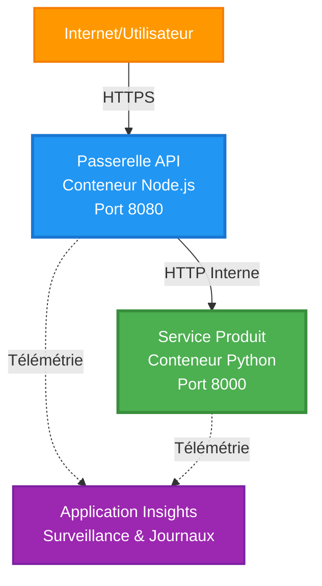
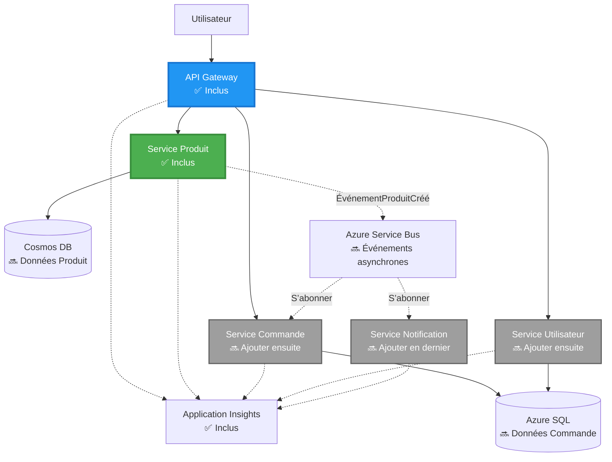
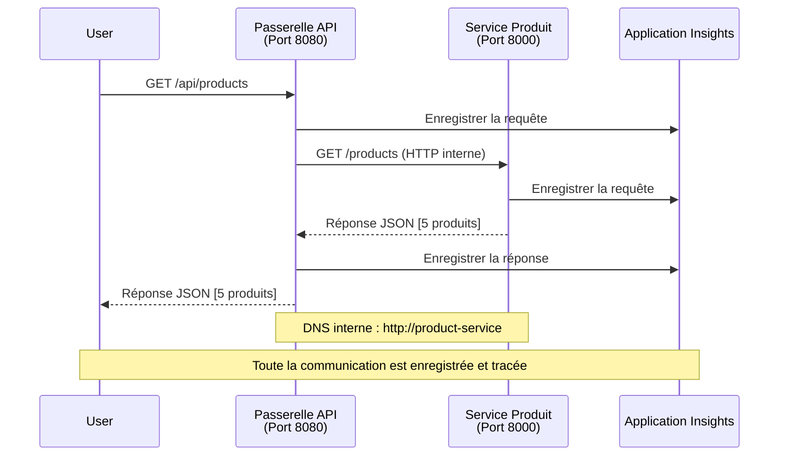

# Architecture de Microservices - Exemple d'App Container

⏱️ **Temps Estimé** : 25-35 minutes | 💰 **Coût Estimé** : ~50-100 $/mois | ⭐ **Complexité** : Avancé

**📚 Parcours d'Apprentissage :**
- ← Précédent : [Simple Flask API](../../../../examples/container-app/simple-flask-api) - Bases du conteneur unique
- 🎯 **Vous êtes ici** : Architecture Microservices (fondation à 2 services)
- → Suivant : [Intégration IA](../../../../docs/ai-foundry) - Ajouter de l'intelligence à vos services
- 🏠 [Accueil du cours](../../README.md)

---

Une architecture de microservices **simplifiée mais fonctionnelle** déployée sur Azure Container Apps via l'AZD CLI. Cet exemple démontre la communication de service à service, l'orchestration de conteneurs, et la surveillance avec une configuration pratique à 2 services.

> **📚 Approche d'Apprentissage** : Cet exemple commence avec une architecture minimale à 2 services (API Gateway + Service Backend) que vous pouvez réellement déployer et étudier. Après avoir maîtrisé cette fondation, nous fournissons des conseils pour étendre vers un écosystème complet de microservices.

## Ce que Vous Apprendrez

En réalisant cet exemple, vous allez :
- Déployer plusieurs conteneurs sur Azure Container Apps
- Mettre en œuvre la communication de service à service avec un réseau interne
- Configurer la mise à l'échelle basée sur l'environnement et les contrôles de santé
- Surveiller les applications distribuées avec Application Insights
- Comprendre les patterns et bonnes pratiques de déploiement microservices
- Apprendre l'expansion progressive d'architectures simples vers complexes

## Architecture

### Phase 1 : Ce que Nous Construisons (Inclus dans cet Exemple)


**Détails des Composants :**

| Composant | But | Accès | Ressources |
|-----------|-----|--------|------------|
| **API Gateway** | Route les requêtes externes vers les services backend | Public (HTTPS) | 1 vCPU, 2GB RAM, 2-20 réplicas |
| **Service Produit** | Gère le catalogue produit avec données en mémoire | Interne uniquement | 0.5 vCPU, 1GB RAM, 1-10 réplicas |
| **Application Insights** | Journaux centralisés et traçage distribué | Portail Azure | 1-2 Go/mois ingestion de données |

**Pourquoi Commencer Simple ?**
- ✅ Déployer et comprendre rapidement (25-35 minutes)
- ✅ Apprendre les patterns de base des microservices sans complexité
- ✅ Code fonctionnel que vous pouvez modifier et expérimenter
- ✅ Coût plus faible pour l'apprentissage (~50-100 $/mois vs 300-1400 $/mois)
- ✅ Construire la confiance avant d'ajouter bases de données et files de message

**Analogie** : C'est comme apprendre à conduire. Vous commencez par un parking vide (2 services), maîtrisez les bases, puis progressez vers la circulation en ville (5+ services avec bases de données).

### Phase 2 : Extension Future (Architecture de Référence)

Une fois que vous maîtrisez l'architecture à 2 services, vous pouvez étendre vers :


Voir la section "Guide d'Extension" à la fin pour les instructions étape par étape.

## Fonctionnalités Incluses

✅ **Découverte de Services** : Découverte DNS automatique entre conteneurs  
✅ **Répartition de Charge** : Répartition intégrée entre réplicas  
✅ **Mise à l'Échelle Automatique** : Échelle indépendante par service basée sur les requêtes HTTP  
✅ **Surveillance de Santé** : Probes de vivacité et de disponibilité pour les deux services  
✅ **Journaux Distribués** : Journaux centralisés avec Application Insights  
✅ **Réseau Interne** : Communication sécurisée de service à service  
✅ **Orchestration de Conteneurs** : Déploiement et mise à l'échelle automatiques  
✅ **Mises à Jour Sans Interruption** : Mises à jour progressives avec gestion des révisions  

## Prérequis

### Outils Requis

Avant de commencer, vérifiez que ces outils sont installés :

1. **[Azure Developer CLI (azd)](https://learn.microsoft.com/azure/developer/azure-developer-cli/install-azd)** (version 1.0.0 ou supérieure)
   ```bash
   azd version
   # Sortie attendue : version azd 1.0.0 ou supérieure
   ```

2. **[Azure CLI](https://learn.microsoft.com/cli/azure/install-azure-cli)** (version 2.50.0 ou supérieure)
   ```bash
   az --version
   # Résultat attendu : azure-cli 2.50.0 ou supérieur
   ```

3. **[Docker](https://www.docker.com/get-started)** (pour développement/local - optionnel)
   ```bash
   docker --version
   # Résultat attendu : version Docker 20.10 ou supérieure
   ```

### Vérifiez Votre Configuration

Exécutez ces commandes pour confirmer la préparation :

```bash
# Vérifier Azure Developer CLI
azd version
# ✅ Attendu : azd version 1.0.0 ou supérieure

# Vérifier Azure CLI
az --version
# ✅ Attendu : azure-cli 2.50.0 ou supérieure

# Vérifier Docker (optionnel)
docker --version
# ✅ Attendu : version Docker 20.10 ou supérieure
```

**Critère de Succès** : Toutes les commandes retournent des versions égales ou supérieures aux minimums.

### Exigences Azure

- Un **abonnement Azure actif** ([création de compte gratuite](https://azure.microsoft.com/free/))
- Permissions pour créer des ressources dans votre abonnement
- Rôle **Collaborateur** sur l'abonnement ou le groupe de ressources

### Connaissances Prérequises

C’est un exemple de **niveau avancé**. Vous devez avoir :
- Terminé l'[exemple Simple Flask API](../../../../examples/container-app/simple-flask-api)
- Compréhension basique de l'architecture microservices
- Familiarité avec les API REST et HTTP
- Connaissance des concepts de conteneurs

**Nouveau sur Container Apps ?** Commencez d'abord par l'[exemple Simple Flask API](../../../../examples/container-app/simple-flask-api) pour apprendre les bases.

## Démarrage Rapide (Étape par Étape)

### Étape 1 : Cloner et Naviguer

```bash
git clone https://github.com/microsoft/AZD-for-beginners.git
cd AZD-for-beginners/examples/microservices
```

**✓ Vérification du Succès** : Vérifiez que vous voyez `azure.yaml` :
```bash
ls
# Attendu : README.md, azure.yaml, infra/, src/
```

### Étape 2 : Authentification avec Azure

```bash
azd auth login
```

Cela ouvre votre navigateur pour l'authentification Azure. Connectez-vous avec vos identifiants Azure.

**✓ Vérification du Succès** : Vous devriez voir :
```
Logged in to Azure.
```

### Étape 3 : Initialiser l'Environnement

```bash
azd init
```

**Invites que vous verrez** :
- **Nom de l'environnement** : Entrez un nom court (ex. `microservices-dev`)
- **Abonnement Azure** : Sélectionnez votre abonnement
- **Région Azure** : Choisissez une région (ex. `eastus`, `westeurope`)

**✓ Vérification du Succès** : Vous devriez voir :
```
SUCCESS: New project initialized!
```

### Étape 4 : Déployer Infrastructure et Services

```bash
azd up
```

**Ce qui se passe** (prend 8-12 minutes) :

```mermaid
graph LR
    A[azd up] --> B[Créer un groupe de ressources]
    B --> C[Déployer le registre de conteneurs]
    C --> D[Déployer Log Analytics]
    D --> E[Déployer App Insights]
    E --> F[Créer un environnement de conteneurs]
    F --> G[Construire l'image de la passerelle API]
    F --> H[Construire l'image du service produit]
    G --> I[Pousser vers le registre]
    H --> I
    I --> J[Déployer la passerelle API]
    I --> K[Déployer le service produit]
    J --> L[Configurer l'entrée et les vérifications de santé]
    K --> L
    L --> M[Déploiement terminé ✓]
    
    style A fill:#2196F3,stroke:#1976D2,stroke-width:3px,color:#fff
    style M fill:#4CAF50,stroke:#388E3C,stroke-width:3px,color:#fff
```


**✓ Vérification du Succès** : Vous devriez voir :
```
SUCCESS: Your application was deployed to Azure in X minutes Y seconds.
Endpoint: https://api-gateway-<unique-id>.azurecontainerapps.io
```

**⏱️ Durée** : 8-12 minutes

### Étape 5 : Tester le Déploiement

```bash
# Obtenir le point de terminaison de la passerelle
GATEWAY_URL=$(azd env get-values | grep API_GATEWAY_URL | cut -d '=' -f2 | tr -d '"')

# Tester la santé de l'API Gateway
curl $GATEWAY_URL/health
```

**✅ Résultat attendu :**
```json
{
  "status": "healthy",
  "service": "api-gateway",
  "timestamp": "2025-11-19T10:30:00Z"
}
```

**Tester le service produit via la passerelle** :
```bash
# Lister les produits
curl $GATEWAY_URL/api/products
```

**✅ Résultat attendu :**
```json
[
  {"id":1,"name":"Laptop","price":999.99,"stock":50},
  {"id":2,"name":"Mouse","price":29.99,"stock":200},
  {"id":3,"name":"Keyboard","price":79.99,"stock":150}
]
```

**✓ Vérification du Succès** : Les deux points de terminaison retournent des données JSON sans erreur.

---

**🎉 Félicitations !** Vous avez déployé une architecture microservices sur Azure !

## Structure du Projet

Tous les fichiers d'implémentation sont inclus—c’est un exemple complet et fonctionnel :

```
microservices/
│
├── README.md                         # This file
├── azure.yaml                        # AZD configuration
├── .gitignore                        # Git ignore patterns
│
├── infra/                           # Infrastructure as Code (Bicep)
│   ├── main.bicep                   # Main orchestration
│   ├── abbreviations.json           # Naming conventions
│   ├── core/                        # Shared infrastructure
│   │   ├── container-apps-environment.bicep  # Container environment + registry
│   │   └── monitor.bicep            # Application Insights + Log Analytics
│   └── app/                         # Service definitions
│       ├── api-gateway.bicep        # API Gateway container app
│       └── product-service.bicep    # Product Service container app
│
└── src/                             # Application source code
    ├── api-gateway/                 # Node.js API Gateway
    │   ├── app.js                   # Express server with routing
    │   ├── package.json             # Node dependencies
    │   └── Dockerfile               # Container definition
    └── product-service/             # Python Product Service
        ├── main.py                  # Flask API with product data
        ├── requirements.txt         # Python dependencies
        └── Dockerfile               # Container definition
```

**Fonction de chaque composant :**

**Infrastructure (infra/)** :
- `main.bicep` : Orchestration de toutes les ressources Azure et leurs dépendances
- `core/container-apps-environment.bicep` : Crée l’environnement Container Apps et le Registre Azure Container
- `core/monitor.bicep` : Configure Application Insights pour le journal distribué
- `app/*.bicep` : Définitions individuelles d’Apps Containers avec mise à l’échelle et probes de santé

**API Gateway (src/api-gateway/)** :
- Service public qui route les requêtes vers les services backend
- Implémente journaux, gestion d’erreurs et transfert des requêtes
- Démontre communication HTTP de service à service

**Service Produit (src/product-service/)** :
- Service interne avec catalogue produit (en mémoire pour simplicité)
- API REST avec probes de santé
- Exemple de pattern microservice backend

## Vue d’Ensemble des Services

### API Gateway (Node.js/Express)

**Port** : 8080  
**Accès** : Public (ingress externe)  
**But** : Route les requêtes entrantes vers les services backend appropriés  

**Endpoints** :
- `GET /` - Informations sur le service
- `GET /health` - Endpoint de contrôle de santé
- `GET /api/products` - Transmet vers le service produit (liste complète)
- `GET /api/products/:id` - Transmet vers le service produit (récupère par ID)

**Fonctionnalités clés** :
- Routage des requêtes avec axios
- Journalisation centralisée
- Gestion des erreurs et délais d’attente
- Découverte de service via variables d’environnement
- Intégration Application Insights

**Extrait de code** (`src/api-gateway/app.js`) :
```javascript
// Communication de service interne
app.get('/api/products', async (req, res) => {
  const response = await axios.get(`${PRODUCT_SERVICE_URL}/products`, {
    timeout: 5000
  });
  res.json(response.data);
});
```

### Service Produit (Python/Flask)

**Port** : 8000  
**Accès** : Interne uniquement (pas d’ingress externe)  
**But** : Gère le catalogue produit avec données en mémoire  

**Endpoints** :
- `GET /` - Infos service
- `GET /health` - Endpoint contrôle santé
- `GET /products` - Liste tous les produits
- `GET /products/<id>` - Récupère produit par ID

**Fonctionnalités clés** :
- API RESTful avec Flask
- Stockage produit en mémoire (simple, pas de base nécessaire)
- Surveillance de santé avec probes
- Journalisation structurée
- Intégration Application Insights

**Modèle de données** :
```python
{
  "id": 1,
  "name": "Laptop",
  "description": "High-performance laptop",
  "price": 999.99,
  "stock": 50
}
```

**Pourquoi Interne Seulement ?**
Le service produit n’est pas exposé publiquement. Toutes les requêtes passent par l’API Gateway, qui fournit :
- Sécurité : Point d’accès contrôlé
- Flexibilité : Possibilité de modifier le back sans impacter les clients
- Surveillance : Journalisation centralisée des requêtes

## Comprendre la Communication entre Services

### Comment les Services Communiquent


Dans cet exemple, l'API Gateway communique avec le Service Produit via des **appels HTTP internes** :

```javascript
// Passerelle API (src/api-gateway/app.js)
const PRODUCT_SERVICE_URL = process.env.PRODUCT_SERVICE_URL;

// Faire une requête HTTP interne
const response = await axios.get(`${PRODUCT_SERVICE_URL}/products`);
```

**Points clés** :

1. **Découverte DNS** : Container Apps fournit automatiquement un DNS pour les services internes
   - FQDN Service Produit : `product-service.internal.<environment>.azurecontainerapps.io`
   - Simplifié en : `http://product-service` (résolution Container Apps)

2. **Pas d’Exposition Publique** : Service Produit a `external: false` dans Bicep
   - Accessible uniquement depuis l’environnement Container Apps
   - Inaccessible depuis Internet

3. **Variables d’Environnement** : URLs des services injectées au déploiement
   - Bicep transmet le FQDN interne à la passerelle
   - Pas d’URLs codées en dur dans le code

**Analogie** : C’est comme dans un bureau. L’API Gateway est l’accueil (public), et le Service Produit une salle de bureau (interne). Les visiteurs doivent passer par l’accueil pour accéder à un bureau.

## Options de Déploiement

### Déploiement Complet (Recommandé)

```bash
# Déployer l'infrastructure et les deux services
azd up
```

Cela déploie :
1. Environnement Container Apps
2. Application Insights
3. Registre Container
4. Conteneur API Gateway
5. Conteneur Service Produit

**Durée** : 8-12 minutes

### Déployer un Service Individuel

```bash
# Déployer un seul service (après le lancement initial azd up)
azd deploy api-gateway

# Ou déployer le service produit
azd deploy product-service
```

**Cas d'usage** : Quand vous avez mis à jour un service et voulez redéployer uniquement ce service.

### Mettre à Jour la Configuration

```bash
# Modifier les paramètres de mise à l'échelle
azd env set GATEWAY_MAX_REPLICAS 30

# Redéployer avec la nouvelle configuration
azd up
```

## Configuration

### Configuration de la Mise à l'Échelle

Les deux services sont configurés avec autoscaling HTTP dans leurs fichiers Bicep :

**API Gateway** :
- Réplicas min : 2 (au moins 2 pour la disponibilité)
- Réplicas max : 20
- Déclencheur : 50 requêtes concurrentes par réplica

**Service Produit** :
- Réplicas min : 1 (peut descendre à zéro si besoin)
- Réplicas max : 10
- Déclencheur : 100 requêtes concurrentes par réplica

**Personnaliser la Mise à l'Échelle** (dans `infra/app/*.bicep`) :
```bicep
scale: {
  minReplicas: 1
  maxReplicas: 10
  rules: [
    {
      name: 'http-scale-rule'
      http: {
        metadata: {
          concurrentRequests: '100'  // Adjust this
        }
      }
    }
  ]
}
```

### Allocation des Ressources

**API Gateway** :
- CPU : 1.0 vCPU
- Mémoire : 2 GiB
- Raison : Gère tout le trafic externe

**Service Produit** :
- CPU : 0.5 vCPU
- Mémoire : 1 GiB
- Raison : Opérations légères en mémoire

### Contrôles de Santé

Les deux services incluent des probes de vivacité et disponibilité :

```bicep
probes: [
  {
    type: 'Liveness'
    httpGet: {
      path: '/health'
      port: 8080
    }
    initialDelaySeconds: 10
    periodSeconds: 30
  }
  {
    type: 'Readiness'
    httpGet: {
      path: '/health'
      port: 8080
    }
    initialDelaySeconds: 5
    periodSeconds: 10
  }
]
```

**Ce que Cela Signifie** :
- **Vivacité** : Si le contrôle échoue, Container Apps redémarre le conteneur
- **Disponibilité** : Si non prêt, Container Apps cesse d’envoyer le trafic à ce réplica

## Surveillance & Observabilité

### Voir les Journaux des Services

```bash
# Voir les journaux avec azd monitor
azd monitor --logs

# Ou utiliser Azure CLI pour des Applications Conteneurs spécifiques :
# Diffuser les journaux de la passerelle API
az containerapp logs show --name api-gateway --resource-group $RG_NAME --follow

# Voir les journaux récents du service produit
az containerapp logs show --name product-service --resource-group $RG_NAME --tail 100
```

**Sortie attendue** :
```
[api-gateway] API Gateway listening on port 8080
[api-gateway] Product Service URL: http://product-service
[api-gateway] GET /api/products 200 - 45ms
[product-service] Retrieved 5 products
```

### Requêtes Application Insights

Accédez à Application Insights dans le Portail Azure, puis exécutez ces requêtes :

**Trouver les requêtes lentes** :
```kusto
requests
| where timestamp > ago(1h)
| where duration > 1000  // Requests taking >1 second
| summarize count() by name, cloud_RoleName
| order by count_ desc
```

**Suivre les appels service à service** :
```kusto
dependencies
| where timestamp > ago(1h)
| where type == "Http"
| project timestamp, name, target, duration, success
| order by timestamp desc
```

**Taux d’erreur par service** :
```kusto
exceptions
| where timestamp > ago(24h)
| summarize errorCount = count() by cloud_RoleName, type
| order by errorCount desc
```

**Volume de requêtes dans le temps** :
```kusto
requests
| where timestamp > ago(1h)
| summarize requestCount = count() by bin(timestamp, 5m), cloud_RoleName
| render timechart
```

### Accéder au Tableau de Bord de Surveillance

```bash
# Obtenir les détails d'Application Insights
azd env get-values | grep APPLICATIONINSIGHTS

# Ouvrir la surveillance du portail Azure
az monitor app-insights component show \
  --app $(azd env get-values | grep APPLICATIONINSIGHTS_CONNECTION_STRING | cut -d '=' -f2) \
  --resource-group $(azd env get-values | grep AZURE_RESOURCE_GROUP | cut -d '=' -f2) \
  --query "appId" -o tsv
```

### Métriques en Temps Réel

1. Rendez-vous sur Application Insights dans le Portail Azure  
2. Cliquez sur "Live Metrics"  
3. Visualisez les requêtes, erreurs et performances en temps réel  
4. Testez avec : `curl $(azd env get-values | grep API_GATEWAY_URL | cut -d '=' -f2 | tr -d '"')/api/products`

## Exercices Pratiques

### Exercice 1 : Ajouter un Nouvel Endpoint Produit ⭐ (Facile)

**Objectif** : Ajouter un endpoint POST pour créer de nouveaux produits

**Point de départ** : `src/product-service/main.py`

**Étapes** :

1. Ajoutez cet endpoint après la fonction `get_product` dans `main.py` :

```python
@app.route('/products', methods=['POST'])
def create_product():
    """Create a new product"""
    data = request.get_json()
    
    # Valider les champs obligatoires
    if not data or 'name' not in data or 'price' not in data:
        return jsonify({'error': 'Missing required fields: name, price'}), 400
    
    new_id = max(p['id'] for p in products) + 1
    new_product = {
        'id': new_id,
        'name': data['name'],
        'description': data.get('description', ''),
        'price': float(data['price']),
        'stock': int(data.get('stock', 0))
    }
    products.append(new_product)
    logger.info(f"Created product {new_id}")
    return jsonify(new_product), 201
```

2. Ajoutez une route POST à l’API Gateway (`src/api-gateway/app.js`) :

```javascript
// Ajoutez ceci après la route GET /api/products
app.post('/api/products', async (req, res) => {
  try {
    console.log(`Forwarding POST request to ${PRODUCT_SERVICE_URL}/products`);
    const response = await axios.post(`${PRODUCT_SERVICE_URL}/products`, req.body, {
      timeout: 5000
    });
    res.status(201).json(response.data);
  } catch (error) {
    console.error('Error calling product service:', error.message);
    res.status(503).json({
      error: 'Product service unavailable',
      message: error.message
    });
  }
});
```

3. Redéployer les deux services :

```bash
azd deploy product-service
azd deploy api-gateway
```

4. Tester le nouveau point de terminaison :

```bash
GATEWAY_URL=$(azd env get-values | grep API_GATEWAY_URL | cut -d '=' -f2 | tr -d '"')

# Créer un nouveau produit
curl -X POST $GATEWAY_URL/api/products \
  -H "Content-Type: application/json" \
  -d '{"name":"USB Cable","price":9.99,"stock":500}'
```

**✅ Résultat attendu :**
```json
{"id":6,"name":"USB Cable","description":"","price":9.99,"stock":500}
```

5. Vérifier qu'il apparaît dans la liste :

```bash
curl $GATEWAY_URL/api/products
# Devrait maintenant afficher 6 produits, y compris le nouveau câble USB
```

**Critères de réussite** :
- ✅ La requête POST retourne HTTP 201
- ✅ Nouveau produit apparaît dans la liste GET /api/products
- ✅ Le produit a un ID auto-incrémenté

**Durée** : 10-15 minutes

---

### Exercice 2 : Modifier les règles d'autoscaling ⭐⭐ (Moyen)

**Objectif** : Modifier le service Produit pour un scaling plus agressif

**Point de départ** : `infra/app/product-service.bicep`

**Étapes** :

1. Ouvrir `infra/app/product-service.bicep` et trouver le bloc `scale` (vers la ligne 95)

2. Modifier de :
```bicep
scale: {
  minReplicas: 1
  maxReplicas: 10
  rules: [
    {
      name: 'http-scale-rule'
      http: {
        metadata: {
          concurrentRequests: '100'  // OLD
        }
      }
    }
  ]
}
```

En :
```bicep
scale: {
  minReplicas: 2  // Always have 2 running
  maxReplicas: 20  // Allow more scaling
  rules: [
    {
      name: 'http-scale-rule'
      http: {
        metadata: {
          concurrentRequests: '20'  // Scale at lower threshold
        }
      }
    }
  ]
}
```

3. Redéployer l'infrastructure :

```bash
azd up
```

4. Vérifier la nouvelle configuration de scaling :

```bash
az containerapp show \
  --name $(azd env get-values | grep PRODUCT_SERVICE | head -1 | cut -d '/' -f5) \
  --resource-group $(azd env get-values | grep AZURE_RESOURCE_GROUP | cut -d '=' -f2 | tr -d '"') \
  --query "properties.template.scale" -o json
```

**✅ Résultat attendu :**
```json
{
  "minReplicas": 2,
  "maxReplicas": 20,
  "rules": [...]
}
```

5. Tester l'autoscaling sous charge :

```bash
# Générer des requêtes concurrentes
for i in {1..500}; do curl $GATEWAY_URL/api/products & done

# Observer la mise à l'échelle avec Azure CLI
az containerapp logs show --name product-service --resource-group $RG_NAME --follow
# Rechercher : événements de mise à l'échelle des applications conteneurisées
```

**Critères de réussite** :
- ✅ Le service Produit tourne toujours avec au moins 2 réplicas
- ✅ Sous charge, il scale à plus de 2 réplicas
- ✅ Le portail Azure affiche les nouvelles règles de scaling

**Durée** : 15-20 minutes

---

### Exercice 3 : Ajouter une requête de monitoring personnalisée ⭐⭐ (Moyen)

**Objectif** : Créer une requête personnalisée Application Insights pour suivre la performance de l'API produit

**Étapes** :

1. Aller dans Application Insights dans le portail Azure :
   - Accéder au portail Azure
   - Trouver votre groupe de ressources (rg-microservices-*)
   - Cliquer sur la ressource Application Insights

2. Cliquer sur "Logs" dans le menu de gauche

3. Créer cette requête :

```kusto
requests
| where timestamp > ago(1h)
| where name contains "products"
| summarize 
    RequestCount = count(),
    AvgDuration = avg(duration),
    P95Duration = percentile(duration, 95),
    SuccessRate = 100.0 * countif(success == true) / count()
  by bin(timestamp, 5m)
| render timechart
```

4. Cliquer sur "Exécuter" pour lancer la requête

5. Sauvegarder la requête :
   - Cliquer sur "Enregistrer"
   - Nom : "Performance API Produit"
   - Catégorie : "Performance"

6. Générer du trafic de test :

```bash
for i in {1..100}; do curl $GATEWAY_URL/api/products; sleep 1; done
```

7. Actualiser la requête pour voir les données

**✅ Résultat attendu :**
- Graphique montrant le nombre de requêtes au fil du temps
- Durée moyenne < 500ms
- Taux de succès = 100%
- Intervalles de temps de 5 minutes

**Critères de réussite** :
- ✅ La requête montre plus de 100 requêtes
- ✅ Le taux de succès est à 100%
- ✅ La durée moyenne est inférieure à 500ms
- ✅ Le graphique affiche des intervalles de 5 minutes

**Compétence acquise** : Comprendre comment surveiller la performance d'un service avec des requêtes personnalisées

**Durée** : 10-15 minutes

---

### Exercice 4 : Implémenter une logique de retry ⭐⭐⭐ (Avancé)

**Objectif** : Ajouter une logique de retry à l'API Gateway lorsque le service Produit est temporairement indisponible

**Point de départ** : `src/api-gateway/app.js`

**Étapes** :

1. Installer la bibliothèque de retry :

```bash
cd src/api-gateway
npm install axios-retry --save
cd ../..
```

2. Mettre à jour `src/api-gateway/app.js` (ajouter après l'import axios) :

```javascript
const axiosRetry = require('axios-retry');

// Configurer la logique de nouvelle tentative
axiosRetry(axios, {
  retries: 3,
  retryDelay: (retryCount) => {
    return retryCount * 1000; // 1s, 2s, 3s
  },
  retryCondition: (error) => {
    // Réessayer en cas d'erreurs réseau ou de réponses 5xx
    return axiosRetry.isNetworkOrIdempotentRequestError(error) ||
           (error.response && error.response.status >= 500);
  }
});

console.log('Retry logic configured: 3 retries with exponential backoff');
```

3. Redéployer l'API Gateway :

```bash
azd deploy api-gateway
```

4. Tester le comportement de retry en simulant une panne du service :

```bash
# Mettre le service produit à 0 (simuler une panne)
az containerapp update \
  --name $(azd env get-values | grep PRODUCT_SERVICE | head -1 | cut -d '/' -f5) \
  --resource-group $(azd env get-values | grep AZURE_RESOURCE_GROUP | cut -d '=' -f2 | tr -d '"') \
  --min-replicas 0 \
  --max-replicas 0

# Essayer d'accéder aux produits (réessaiera 3 fois)
time curl -v $GATEWAY_URL/api/products
# Observer : La réponse prend environ 6 secondes (1s + 2s + 3s de tentatives)

# Restaurer le service produit
az containerapp update \
  --name $(azd env get-values | grep PRODUCT_SERVICE | head -1 | cut -d '/' -f5) \
  --resource-group $(azd env get-values | grep AZURE_RESOURCE_GROUP | cut -d '=' -f2 | tr -d '"') \
  --min-replicas 1 \
  --max-replicas 10
```

5. Consulter les logs de retry :

```bash
az containerapp logs show --name api-gateway --resource-group $RG_NAME --tail 50
# Rechercher : messages de tentative de nouvelle fois
```

**✅ Comportement attendu :**
- Les requêtes sont retentées 3 fois avant d'échouer
- Chaque retry attend plus longtemps (1s, 2s, 3s)
- Les requêtes réussissent après le redémarrage du service
- Les logs montrent les tentatives de retry

**Critères de réussite** :
- ✅ Les requêtes sont retentées 3 fois avant échec
- ✅ Chaque retry attend plus longtemps (backoff exponentiel)
- ✅ Requêtes réussies après redémarrage du service
- ✅ Les logs montrent les tentatives de retry

**Compétence acquise** : Comprendre les patterns de résilience dans les microservices (circuit breakers, retries, timeouts)

**Durée** : 20-25 minutes

---

## Point de vérification des connaissances

Après avoir complété cet exemple, vérifiez votre compréhension :

### 1. Communication entre services ✓

Testez vos connaissances :
- [ ] Pouvez-vous expliquer comment l’API Gateway découvre le service Produit ? (découverte de service basée sur DNS)
- [ ] Que se passe-t-il si le service Produit est indisponible ? (la Gateway retourne une erreur 503)
- [ ] Comment ajouteriez-vous un troisième service ? (créer un nouveau fichier Bicep, l’ajouter à main.bicep, créer un dossier src)

**Vérification pratique :**
```bash
# Simuler une défaillance de service
az containerapp update --name <product-service-name> --min-replicas 0 --max-replicas 0
curl $GATEWAY_URL/api/products
# ✅ Attendu : 503 Service Indisponible

# Restaurer le service
az containerapp update --name <product-service-name> --min-replicas 1 --max-replicas 10
```

### 2. Monitoring & Observabilité ✓

Testez vos connaissances :
- [ ] Où voyez-vous les logs distribués ? (Application Insights dans le portail Azure)
- [ ] Comment traquez-vous les requêtes lentes ? (requête Kusto : `requests | where duration > 1000`)
- [ ] Pouvez-vous identifier quel service a causé une erreur ? (vérifier le champ `cloud_RoleName` dans les logs)

**Vérification pratique :**
```bash
# Générer une simulation de requête lente
curl "$GATEWAY_URL/api/products?delay=2000"

# Interroger Application Insights pour les requêtes lentes
# Accéder à Azure Portal → Application Insights → Logs
# Exécuter : requests | where duration > 1000 | project timestamp, name, duration, cloud_RoleName
```

### 3. Scaling & Performance ✓

Testez vos connaissances :
- [ ] Qu’est-ce qui déclenche l’autoscaling ? (règles sur les requêtes HTTP simultanées : 50 pour gateway, 100 pour produit)
- [ ] Combien de réplicas tournent actuellement ? (vérifier avec `az containerapp revision list`)
- [ ] Comment scaler le service Produit à 5 réplicas ? (mettre à jour minReplicas dans Bicep)

**Vérification pratique :**
```bash
# Générer une charge pour tester l'autoscaling
for i in {1..1000}; do curl $GATEWAY_URL/api/products & done

# Surveiller l'augmentation des réplicas avec Azure CLI
az containerapp logs show --name api-gateway --resource-group $RG_NAME --follow
# ✅ Attendu : Voir les événements de mise à l'échelle dans les journaux
```

**Critères de réussite** : Vous pouvez répondre à toutes les questions et vérifier avec les commandes pratiques.

---

## Analyse des coûts

### Coûts mensuels estimés (pour cet exemple à 2 services)

| Ressource | Configuration | Coût estimé |
|----------|--------------|--------------|
| API Gateway | 2-20 réplicas, 1 vCPU, 2GB RAM | 30-150 $ |
| Service Produit | 1-10 réplicas, 0.5 vCPU, 1GB RAM | 15-75 $ |
| Registre de conteneurs | Niveau de base | 5 $ |
| Application Insights | 1-2 Go/mois | 5-10 $ |
| Log Analytics | 1 Go/mois | 3 $ |
| **Total** | | **58-243 $/mois** |

### Répartition des coûts selon l'utilisation

**Trafic léger** (test/apprentissage) : ~60 $/mois
- API Gateway : 2 réplicas × 24/7 = 30 $
- Service Produit : 1 réplica × 24/7 = 15 $
- Monitoring + registre = 13 $

**Trafic modéré** (petite production) : ~120 $/mois
- API Gateway : 5 réplicas moyens = 75 $
- Service Produit : 3 réplicas moyens = 45 $
- Monitoring + registre = 13 $

**Trafic élevé** (pics) : ~240 $/mois
- API Gateway : 15 réplicas moyens = 225 $
- Service Produit : 8 réplicas moyens = 120 $
- Monitoring + registre = 13 $

### Conseils pour optimiser les coûts

1. **Scaler à zéro en développement** :
   ```bicep
   scale: {
     minReplicas: 0  // Save $30-40/month when not in use
     maxReplicas: 10
   }
   ```

2. **Utiliser le plan à la consommation pour Cosmos DB** (lorsque vous l’ajoutez) :
   - Payer uniquement ce que vous consommez
   - Pas de coût minimum

3. **Configurer le sampling Application Insights** :
   ```javascript
   appInsights.defaultClient.config.samplingPercentage = 50; // Échantillonner 50 % des requêtes
   ```

4. **Nettoyer quand ce n’est pas nécessaire** :
   ```bash
   azd down --force --purge
   ```

### Options de niveau gratuit

Pour l’apprentissage ou les tests, considérer :
- ✅ Utiliser les crédits gratuits Azure ($200 pour les 30 premiers jours sur les nouveaux comptes)
- ✅ Limiter le nombre de réplicas (économise ~50 %)
- ✅ Supprimer après les tests (pas de coûts permanents)
- ✅ Scaler à zéro entre les sessions de formation

**Exemple** : Faire tourner cet exemple 2h/jour × 30 jours = ~5 $/mois au lieu de 60 $/mois

---

## Référence rapide de dépannage

### Problème : `azd up` échoue avec "Abonnement introuvable"

**Solution** :
```bash
# Connectez-vous à nouveau avec un abonnement explicite
az account set --subscription <your-subscription-id>
azd env set AZURE_SUBSCRIPTION_ID <your-subscription-id>
azd up
```

### Problème : API Gateway retourne 503 "Service produit indisponible"

**Diagnostic** :
```bash
# Vérifier les journaux du service produit en utilisant Azure CLI
az containerapp logs show --name product-service --resource-group $RG_NAME --tail 50

# Vérifier la santé du service produit
az containerapp show \
  --name $(azd env get-values | grep PRODUCT_SERVICE | head -1 | cut -d '/' -f5) \
  --resource-group $(azd env get-values | grep AZURE_RESOURCE_GROUP | cut -d '=' -f2 | tr -d '"') \
  --query "properties.runningStatus"
```

**Causes fréquentes** :
1. Le service produit ne s’est pas lancé (vérifier les logs pour erreurs Python)
2. Échec du health check (vérifier le point de terminaison `/health`)
3. Échec de construction de l’image du conteneur (vérifier le registre d’image)

### Problème : Autoscaling ne fonctionne pas

**Diagnostic** :
```bash
# Vérifier le nombre actuel de répliques
az containerapp revision list \
  --name $(azd env get-values | grep API_GATEWAY | head -1 | cut -d '/' -f5) \
  --resource-group $(azd env get-values | grep AZURE_RESOURCE_GROUP | cut -d '=' -f2 | tr -d '"') \
  --query "[].properties.replicas"

# Générer une charge pour tester
for i in {1..1000}; do curl $GATEWAY_URL/api/products & done

# Surveiller les événements de mise à l'échelle avec Azure CLI
az containerapp logs show --name api-gateway --resource-group $RG_NAME --follow | grep -i scale
```

**Causes fréquentes** :
1. Charge trop faible pour déclencher la règle de scaling (besoin de >50 requêtes simultanées)
2. Nombre max de réplicas atteint (vérifier configuration dans Bicep)
3. Mauvaise configuration de la règle dans Bicep (vérifier la valeur de concurrentRequests)

### Problème : Application Insights ne montre pas les logs

**Diagnostic** :
```bash
# Vérifiez que la chaîne de connexion est définie
azd env get-values | grep APPLICATIONINSIGHTS

# Vérifiez si les services envoient la télémétrie
az monitor app-insights component show \
  --app $(azd env get-values | grep APPLICATIONINSIGHTS_NAME | cut -d '=' -f2 | tr -d '"') \
  --resource-group $(azd env get-values | grep AZURE_RESOURCE_GROUP | cut -d '=' -f2 | tr -d '"') \
  --query "properties.InstrumentationKey"
```

**Causes fréquentes** :
1. Chaîne de connexion non transmise au conteneur (vérifier variables d’environnement)
2. SDK Application Insights non configuré (vérifier les imports dans le code)
3. Pare-feu bloquant la télémétrie (rare, vérifier règles réseau)

### Problème : Échec de build Docker local

**Diagnostic** :
```bash
# Test de la construction d'API Gateway
cd src/api-gateway
docker build -t test-gateway .

# Test de la construction du Service Produit
cd ../product-service
docker build -t test-product .
```

**Causes fréquentes** :
1. Dépendances manquantes dans package.json/requirements.txt
2. Erreurs de syntaxe dans Dockerfile
3. Problèmes réseau pour télécharger les dépendances

**Bloqué ?** Voir [Guide des problèmes courants](../../docs/chapter-07-troubleshooting/common-issues.md) ou [Dépannage Azure Container Apps](https://learn.microsoft.com/azure/container-apps/troubleshooting)

---

## Nettoyage

Pour éviter les coûts récurrents, supprimer toutes les ressources :

```bash
azd down --force --purge
```

**Invitation à confirmer** :
```
? Total resources to delete: 6, are you sure you want to continue? (y/N)
```

Tapez `y` pour confirmer.

**Ce qui sera supprimé** :
- Environnement Container Apps
- Les deux Container Apps (gateway & service produit)
- Registre de conteneurs
- Application Insights
- Espace de travail Log Analytics
- Groupe de ressources

**✓ Vérifier le nettoyage** :
```bash
az group list --query "[?starts_with(name,'rg-microservices')]" --output table
```

Doit retourner vide.

---

## Guide d’expansion : passer de 2 à 5+ services

Une fois que vous maîtrisez cette architecture à 2 services, voici comment étendre :

### Phase 1 : Ajouter la persistance de base de données (étape suivante)

**Ajouter Cosmos DB pour le service Produit** :

1. Créer `infra/core/cosmos.bicep` :
   ```bicep
   resource cosmosAccount 'Microsoft.DocumentDB/databaseAccounts@2023-04-15' = {
     name: name
     location: location
     kind: 'GlobalDocumentDB'
     properties: {
       databaseAccountOfferType: 'Standard'
       consistencyPolicy: { defaultConsistencyLevel: 'Session' }
       locations: [{ locationName: location, failoverPriority: 0 }]
     }
   }
   ```

2. Mettre à jour le service produit pour utiliser le SDK Python Azure Cosmos DB au lieu du stockage en mémoire

3. Coût estimé supplémentaire : ~25 $/mois (serverless)

### Phase 2 : Ajouter un troisième service (gestion des commandes)

**Créer le service Commandes** :

1. Nouveau dossier : `src/order-service/` (Python/Node.js/C#)
2. Nouveau fichier Bicep : `infra/app/order-service.bicep`
3. Mettre à jour l’API Gateway pour router `/api/orders`
4. Ajouter une base de données Azure SQL pour la persistance des commandes

**L’architecture devient** :
```
API Gateway → Product Service (Cosmos DB)
           → Order Service (Azure SQL)
```

### Phase 3 : Ajouter communication asynchrone (Service Bus)

**Implémenter une architecture événementielle** :

1. Ajouter Azure Service Bus : `infra/core/servicebus.bicep`
2. Service Produit publie des événements "ProductCreated"
3. Service Commandes s’abonne aux événements produits
4. Ajouter un service Notifications pour traiter les événements

**Pattern** : Requête/Réponse (HTTP) + événementiel (Service Bus)

### Phase 4 : Ajouter authentification utilisateur

**Implémenter un service Utilisateur** :

1. Créer `src/user-service/` (Go/Node.js)
2. Ajouter Azure AD B2C ou authentification JWT personnalisée
3. L’API Gateway valide les tokens avant routage
4. Les services contrôlent les permissions utilisateur

### Phase 5 : Prêt pour la production

**Ajouter ces composants** :
- ✅ Azure Front Door (équilibrage global)
- ✅ Azure Key Vault (gestion des secrets)
- ✅ Azure Monitor Workbooks (tableaux de bord personnalisés)
- ✅ Pipeline CI/CD (GitHub Actions)
- ✅ Déploiements Blue-Green
- ✅ Managed Identity pour tous les services

**Coût total architecture production complète** : ~300-1 400 $/mois

---

## En savoir plus

### Documentation liée
- [Documentation Azure Container Apps](https://learn.microsoft.com/azure/container-apps/)
- [Guide architecture microservices](https://learn.microsoft.com/azure/architecture/guide/architecture-styles/microservices)
- [Application Insights pour le traçage distribué](https://learn.microsoft.com/azure/azure-monitor/app/distributed-tracing)
- [Documentation Azure Developer CLI](https://learn.microsoft.com/azure/developer/azure-developer-cli/)

### Prochaines étapes dans ce cours
- ← Précédent : [Simple Flask API](../../../../examples/container-app/simple-flask-api) - Exemple débutant un conteneur
- → Suivant : [Guide d’intégration IA](../../../../docs/ai-foundry) - Ajouter des capacités d’IA
- 🏠 [Accueil du cours](../../README.md)

### Comparaison : Quand utiliser quoi

| Fonctionnalité | Conteneur unique | Microservices (ce cours) | Kubernetes (AKS) |
|---------|-----------------|---------------------|------------------|
| **Cas d’usage** | Apps simples | Apps complexes | Apps d’entreprise |
| **Scalabilité** | Service unique | Scaling par service | Souplesse maximale |
| **Complexité** | Faible | Moyenne | Élevée |
| **Taille d’équipe** | 1-3 développeurs | 3-10 développeurs | 10+ développeurs |
| **Coût** | ~15-50 $/mois | ~60-250 $/mois | ~150-500 $/mois |
| **Temps de déploiement** | 5-10 minutes | 8-12 minutes | 15-30 minutes |
| **Idéal Pour** | MVP, prototypes | Applications en production | Multi-cloud, réseaux avancés |

**Recommandation** : Commencez par Container Apps (cet exemple), passez à AKS uniquement si vous avez besoin de fonctionnalités spécifiques à Kubernetes.

---

## Questions Fréquemment Posées

**Q : Pourquoi seulement 2 services au lieu de 5+ ?**  
R : Progression pédagogique. Maîtrisez les fondamentaux (communication entre services, surveillance, mise à l’échelle) avec un exemple simple avant d’ajouter de la complexité. Les modèles appris ici s’appliquent aux architectures à 100 services.

**Q : Puis-je ajouter plus de services moi-même ?**  
R : Absolument ! Suivez le guide d’extension ci-dessus. Chaque nouveau service suit le même modèle : créer un dossier src, créer un fichier Bicep, mettre à jour azure.yaml, déployer.

**Q : Est-ce prêt pour la production ?**  
R : C’est une base solide. Pour la production, ajoutez : identité gérée, Key Vault, bases de données persistantes, pipeline CI/CD, alertes de surveillance, et stratégie de sauvegarde.

**Q : Pourquoi ne pas utiliser Dapr ou un autre service mesh ?**  
R : Gardez-le simple pour apprendre. Une fois que vous comprenez le réseau natif de Container Apps, vous pouvez ajouter Dapr pour des scénarios avancés (gestion d’état, pub/sub, bindings).

**Q : Comment déboguer localement ?**  
R : Exécutez les services localement avec Docker :  
```bash
cd src/api-gateway
docker build -t local-gateway .
docker run -p 8080:8080 -e PRODUCT_SERVICE_URL=http://localhost:8000 local-gateway
```
  
**Q : Puis-je utiliser différents langages de programmation ?**  
R : Oui ! Cet exemple montre Node.js (gateway) + Python (service produit). Vous pouvez mixer tous les langages s’exécutant en conteneurs : C#, Go, Java, Ruby, PHP, etc.

**Q : Que faire si je n’ai pas de crédits Azure ?**  
R : Utilisez la couche gratuite Azure (les 30 premiers jours avec un nouveau compte offrent 200 $ de crédits) ou déployez pour de courtes sessions de test puis supprimez immédiatement. Cet exemple coûte environ 2 $/jour.

**Q : En quoi cela diffère-t-il du service Azure Kubernetes (AKS) ?**  
R : Container Apps est plus simple (pas besoin de connaissance Kubernetes) mais moins flexible. AKS vous donne un contrôle total sur Kubernetes mais nécessite plus d’expertise. Commencez par Container Apps, passez à AKS si nécessaire.

**Q : Puis-je utiliser cela avec des services Azure existants ?**  
R : Oui ! Vous pouvez connecter des bases de données existantes, comptes de stockage, Service Bus, etc. Mettez à jour les fichiers Bicep pour référencer les ressources existantes au lieu d’en créer de nouvelles.

---

> **🎓 Résumé du parcours d’apprentissage** : Vous avez appris à déployer une architecture multi-services avec mise à l’échelle automatique, réseau interne, surveillance centralisée et modèles prêts pour la production. Cette base vous prépare aux systèmes distribués complexes et aux architectures microservices en entreprise.

**📚 Navigation du cours :**  
- ← Précédent : [API Flask Simple](../../../../examples/container-app/simple-flask-api)  
- → Suivant : [Exemple d’Intégration de Base de Données](../../../../database-app)  
- 🏠 [Accueil du cours](../../README.md)  
- 📖 [Bonnes Pratiques Container Apps](../../docs/chapter-04-infrastructure/deployment-guide.md)

---

**✨ Félicitations !** Vous avez terminé l’exemple microservices. Vous comprenez maintenant comment créer, déployer et surveiller des applications distribuées sur Azure Container Apps. Prêt à ajouter des capacités IA ? Découvrez le [Guide d’Intégration IA](../../../../docs/ai-foundry) !

---

<!-- CO-OP TRANSLATOR DISCLAIMER START -->
**Avertissement** :  
Ce document a été traduit à l’aide du service de traduction automatique [Co-op Translator](https://github.com/Azure/co-op-translator). Bien que nous nous efforçons d’assurer l’exactitude, veuillez noter que les traductions automatiques peuvent contenir des erreurs ou des inexactitudes. Le document original dans sa langue d’origine doit être considéré comme la source faisant foi. Pour les informations critiques, une traduction professionnelle humaine est recommandée. Nous déclinons toute responsabilité en cas de malentendus ou d’interprétations erronées résultant de l’utilisation de cette traduction.
<!-- CO-OP TRANSLATOR DISCLAIMER END -->