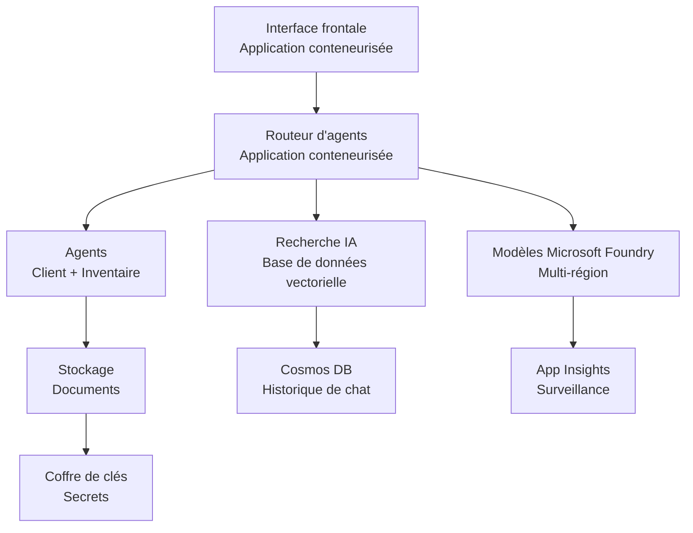

# Solution multi-agent Retail - Modèle d'infrastructure

**Chapitre 5 : Package de déploiement en production**
- **📚 Page du cours**: [AZD For Beginners](../../README.md)
- **📖 Chapitre connexe**: [Chapitre 5 : Solutions d'IA multi-agent](../../README.md#-chapter-5-multi-agent-ai-solutions-advanced)
- **📝 Guide du scénario**: [Architecture complète](../retail-scenario.md)
- **🎯 Déploiement rapide**: [Déploiement en un clic](../../../../examples/retail-multiagent-arm-template)

> **⚠️ MODÈLE D'INFRASTRUCTURE SEULEMENT**  
> Ce modèle ARM déploie des **ressources Azure** pour un système multi-agent.  
>  
> **Ce qui est déployé (15-25 minutes) :**
> - ✅ Microsoft Foundry Models (gpt-4.1, gpt-4.1-mini, embeddings across 3 regions)
> - ✅ Service Azure AI Search (vide, prêt pour la création d'index)
> - ✅ Container Apps (images de substitution, prêt pour votre code)
> - ✅ Stockage, Cosmos DB, Key Vault, Application Insights
>  
> **Ce qui N'est PAS inclus (nécessite du développement) :**
> - ❌ Code d'implémentation des agents (Customer Agent, Inventory Agent)
> - ❌ Logique de routage et endpoints API
> - ❌ Interface chat frontend
> - ❌ Schémas d'index de recherche et pipelines de données
> - ❌ **Estimation de l'effort de développement : 80-120 heures**
>  
> **Utilisez ce modèle si :**
> - ✅ Vous souhaitez provisionner l'infrastructure Azure pour un projet multi-agent
> - ✅ Vous prévoyez de développer l'implémentation des agents séparément
> - ✅ Vous avez besoin d'une base d'infrastructure prête pour la production
>  
> **N'utilisez pas si :**
> - ❌ Vous attendez une démo multi-agent fonctionnelle immédiatement
> - ❌ Vous recherchez des exemples complets de code applicatif

## Vue d'ensemble

Ce répertoire contient un modèle Azure Resource Manager (ARM) complet pour déployer la **fondation d'infrastructure** d'un système de support client multi-agent. Le modèle provisionne tous les services Azure nécessaires, correctement configurés et interconnectés, prêts pour le développement de votre application.

**Après le déploiement, vous disposerez de :** Infrastructure Azure prête pour la production  
**Pour compléter le système, vous avez besoin de :** Code des agents, UI frontend et configuration des données (voir [Guide d'architecture](../retail-scenario.md))

## 🎯 Ce qui est déployé

### Infrastructure principale (État après le déploiement)

✅ **Microsoft Foundry Models Services** (Prêt pour les appels API)
  - Région principale : déploiement gpt-4.1 (capacité 20K TPM)
  - Région secondaire : déploiement gpt-4.1-mini (capacité 10K TPM)
  - Région tertiaire : modèle d'embeddings textuels (capacité 30K TPM)
  - Région d'évaluation : modèle gradeur gpt-4.1 (capacité 15K TPM)
  - **Statut :** Entièrement fonctionnel - appels API possibles immédiatement

✅ **Azure AI Search** (Vide - prêt pour la configuration)
  - Capacités de recherche vectorielle activées
  - Niveau Standard avec 1 partition, 1 réplique
  - **Statut :** Service en cours d'exécution, mais nécessite la création d'un index
  - **Action requise :** Créez un index de recherche avec votre schéma

✅ **Compte de stockage Azure** (Vide - prêt pour les uploads)
  - Conteneurs blob : `documents`, `uploads`
  - Configuration sécurisée (HTTPS uniquement, pas d'accès public)
  - **Statut :** Prêt à recevoir des fichiers
  - **Action requise :** Téléversez vos données produits et documents

⚠️ **Environnement Container Apps** (Images de substitution déployées)
  - Application routeur d'agents (image nginx par défaut)
  - Application frontend (image nginx par défaut)
  - Autoscaling configuré (0-10 instances)
  - **Statut :** Conteneurs de remplacement en cours d'exécution
  - **Action requise :** Construisez et déployez vos applications d'agents

✅ **Azure Cosmos DB** (Vide - prêt pour les données)
  - Base de données et conteneur pré-configurés
  - Optimisé pour des opérations à faible latence
  - TTL activé pour nettoyage automatique
  - **Statut :** Prêt à stocker l'historique des conversations

✅ **Azure Key Vault** (Optionnel - prêt pour les secrets)
  - Suppression douce activée
  - RBAC configuré pour les identités gérées
  - **Statut :** Prêt à stocker les clés API et chaînes de connexion

✅ **Application Insights** (Optionnel - monitoring actif)
  - Connecté à un espace de travail Log Analytics
  - Métriques personnalisées et alertes configurées
  - **Statut :** Prêt à recevoir la télémétrie de vos applications

✅ **Document Intelligence** (Prêt pour les appels API)
  - Niveau S0 pour charges de travail en production
  - **Statut :** Prêt à traiter les documents téléversés

✅ **Bing Search API** (Prêt pour les appels API)
  - Niveau S1 pour recherches en temps réel
  - **Statut :** Prêt pour les requêtes de recherche web

### Modes de déploiement

| Mode | OpenAI Capacity | Container Instances | Search Tier | Storage Redundancy | Best For |
|------|-----------------|---------------------|-------------|-------------------|----------|
| **Minimal** | 10K-20K TPM | 0-2 replicas | Basic | LRS (Local) | Dev/test, learning, proof-of-concept |
| **Standard** | 30K-60K TPM | 2-5 replicas | Standard | ZRS (Zone) | Production, moderate traffic (<10K users) |
| **Premium** | 80K-150K TPM | 5-10 replicas, zone-redundant | Premium | GRS (Geo) | Enterprise, high traffic (>10K users), 99.99% SLA |

**Impact sur les coûts :**
- **Minimal → Standard :** ~4x augmentation des coûts ($100-370/mo → $420-1,450/mo)
- **Standard → Premium :** ~3x augmentation des coûts ($420-1,450/mo → $1,150-3,500/mo)
- **Choisir en fonction de :** Charge prévue, exigences SLA, contraintes budgétaires

**Planification de capacité :**
- **TPM (Tokens Per Minute) :** Total à travers tous les déploiements de modèles
- **Instances de conteneur :** Plage d'auto-scaling (min-max replicas)
- **Niveau de recherche :** Impacte les performances de requête et les limites de taille d'index

## 📋 Prérequis

### Outils requis
1. **Azure CLI** (version 2.50.0 ou supérieure)
   ```bash
   az --version  # Vérifier la version
   az login      # Authentifier
   ```

2. **Abonnement Azure actif** avec accès Owner ou Contributor
   ```bash
   az account show  # Vérifier l'abonnement
   ```

### Quotas Azure requis

Avant le déploiement, vérifiez que vous disposez de quotas suffisants dans vos régions cibles :

```bash
# Vérifiez la disponibilité des modèles Microsoft Foundry dans votre région
az cognitiveservices account list-skus \
  --kind OpenAI \
  --location eastus2

# Vérifiez le quota OpenAI (exemple pour gpt-4.1)
az cognitiveservices usage list \
  --location eastus2 \
  --query "[?name.value=='OpenAI.Standard.gpt-4.1']"

# Vérifiez le quota des Container Apps
az provider show \
  --namespace Microsoft.App \
  --query "resourceTypes[?resourceType=='managedEnvironments'].locations"
```

**Quotas minimaux requis :**
- **Microsoft Foundry Models :** 3-4 déploiements de modèles dans plusieurs régions
  - gpt-4.1 : 20K TPM (Tokens Per Minute)
  - gpt-4.1-mini : 10K TPM
  - text-embedding-ada-002 : 30K TPM
  - **Remarque :** gpt-4.1 peut être sur liste d'attente dans certaines régions - vérifiez la [disponibilité des modèles](https://learn.microsoft.com/azure/ai-services/openai/concepts/models)
- **Container Apps :** Environnement géré + 2-10 instances de conteneur
- **AI Search :** Niveau Standard (Basic insuffisant pour la recherche vectorielle)
- **Cosmos DB :** Throughput provisionné standard

**Si les quotas sont insuffisants :**
1. Allez dans Azure Portal → Quotas → Request increase
2. Ou utilisez Azure CLI :
   ```bash
   az support tickets create \
     --ticket-name "OpenAI-Quota-Increase" \
     --severity "minimal" \
     --description "Request quota increase for Microsoft Foundry Models gpt-4.1 in eastus2"
   ```
3. Envisagez des régions alternatives avec disponibilité

## 🚀 Déploiement rapide

### Option 1 : Utilisation d'Azure CLI

```bash
# Cloner ou télécharger les fichiers du modèle
git clone <repository-url>
cd examples/retail-multiagent-arm-template

# Rendre le script de déploiement exécutable
chmod +x deploy.sh

# Déployer avec les paramètres par défaut
./deploy.sh -g myResourceGroup

# Déployer pour la production avec des fonctionnalités premium
./deploy.sh -g myProdRG -e prod -m premium -l eastus2
```

### Option 2 : Utilisation du portail Azure

[](https://portal.azure.com/#create/Microsoft.Template/uri/https%3A%2F%2Fraw.githubusercontent.com%2Fmicrosoft%2Fazd-for-beginners%2Fmain%2Fexamples%2Fretail-multiagent-arm-template%2Fazuredeploy.json)

### Option 3 : Utiliser Azure CLI directement

```bash
# Créer un groupe de ressources
az group create --name myResourceGroup --location eastus2

# Déployer le modèle
az deployment group create \
  --resource-group myResourceGroup \
  --template-file azuredeploy.json \
  --parameters azuredeploy.parameters.json
```

## ⏱️ Chronologie de déploiement

### À quoi s'attendre

| Phase | Durée | Ce qui se passe |
|-------|----------|--------------||
| **Template Validation** | 30-60 seconds | Azure valide la syntaxe du modèle ARM et les paramètres |
| **Resource Group Setup** | 10-20 seconds | Crée le groupe de ressources (si nécessaire) |
| **OpenAI Provisioning** | 5-8 minutes | Crée 3-4 comptes OpenAI et déploie les modèles |
| **Container Apps** | 3-5 minutes | Crée l'environnement et déploie des conteneurs de substitution |
| **Search & Storage** | 2-4 minutes | Provisionne le service AI Search et les comptes de stockage |
| **Cosmos DB** | 2-3 minutes | Crée la base de données et configure les conteneurs |
| **Monitoring Setup** | 2-3 minutes | Configure Application Insights et Log Analytics |
| **RBAC Configuration** | 1-2 minutes | Configure les identités gérées et les permissions |
| **Total Deployment** | **15-25 minutes** | Complete infrastructure ready |

**Après le déploiement :**
- ✅ **Infrastructure prête :** Tous les services Azure provisionnés et en cours d'exécution
- ⏱️ **Développement applicatif :** 80-120 heures (votre responsabilité)
- ⏱️ **Configuration d'index :** 15-30 minutes (requiert votre schéma)
- ⏱️ **Téléversement des données :** Variable selon la taille du jeu de données
- ⏱️ **Tests & validation :** 2-4 heures

---

## ✅ Vérifier le succès du déploiement

### Étape 1 : Vérifier l'approvisionnement des ressources (2 minutes)

```bash
# Vérifier que toutes les ressources ont été déployées avec succès
az resource list \
  --resource-group myResourceGroup \
  --query "[?provisioningState!='Succeeded'].{Name:name, Status:provisioningState, Type:type}" \
  --output table
```

**Attendu :** Tableau vide (toutes les ressources affichent le statut "Succeeded")

### Étape 2 : Vérifier les déploiements des Microsoft Foundry Models (3 minutes)

```bash
# Lister tous les comptes OpenAI
az cognitiveservices account list \
  --resource-group myResourceGroup \
  --query "[?kind=='OpenAI'].{Name:name, Location:location, Status:properties.provisioningState}" \
  --output table

# Vérifier les déploiements de modèles pour la région principale
OPENAI_NAME=$(az cognitiveservices account list \
  --resource-group myResourceGroup \
  --query "[?kind=='OpenAI'] | [0].name" -o tsv)

az cognitiveservices account deployment list \
  --name $OPENAI_NAME \
  --resource-group myResourceGroup \
  --output table
```

**Attendu :** 
- 3-4 comptes OpenAI (régions primaire, secondaire, tertiaire, d'évaluation)
- 1-2 déploiements de modèles par compte (gpt-4.1, gpt-4.1-mini, text-embedding-ada-002)

### Étape 3 : Tester les points de terminaison de l'infrastructure (5 minutes)

```bash
# Obtenir les URL de l'application Container
az containerapp list \
  --resource-group myResourceGroup \
  --query "[].{Name:name, URL:properties.configuration.ingress.fqdn, Status:properties.runningStatus}" \
  --output table

# Tester le point de terminaison du routeur (une image de remplacement répondra)
ROUTER_URL=$(az containerapp show \
  --name retail-router \
  --resource-group myResourceGroup \
  --query "properties.configuration.ingress.fqdn" -o tsv)

echo "Testing: https://$ROUTER_URL"
curl -I https://$ROUTER_URL || echo "Container running (placeholder image - expected)"
```

**Attendu :** 
- Les Container Apps affichent le statut "Running"
- Le nginx de substitution répond avec HTTP 200 ou 404 (pas de code applicatif encore)

### Étape 4 : Vérifier l'accès API aux Microsoft Foundry Models (3 minutes)

```bash
# Obtenir le point de terminaison et la clé OpenAI
OPENAI_ENDPOINT=$(az cognitiveservices account show \
  --name $OPENAI_NAME \
  --resource-group myResourceGroup \
  --query "properties.endpoint" -o tsv)

OPENAI_KEY=$(az cognitiveservices account keys list \
  --name $OPENAI_NAME \
  --resource-group myResourceGroup \
  --query "key1" -o tsv)

# Tester le déploiement de gpt-4.1
curl "${OPENAI_ENDPOINT}openai/deployments/gpt-4.1/chat/completions?api-version=2024-08-01-preview" \
  -H "Content-Type: application/json" \
  -H "api-key: $OPENAI_KEY" \
  -d '{
    "messages": [{"role": "user", "content": "Say hello"}],
    "max_tokens": 10
  }'
```

**Attendu :** Réponse JSON avec complétion de chat (confirme que OpenAI fonctionne)

### Ce qui fonctionne vs. ce qui ne fonctionne pas

**✅ Fonctionne après le déploiement :**
- Modèles Microsoft Foundry Models déployés et acceptant les appels API
- Service AI Search en cours d'exécution (vide, pas d'index)
- Container Apps en cours d'exécution (images nginx de substitution)
- Comptes de stockage accessibles et prêts pour les uploads
- Cosmos DB prêt pour les opérations de données
- Application Insights collectant la télémétrie d'infrastructure
- Key Vault prêt pour le stockage des secrets

**❌ Pas encore fonctionnel (nécessite du développement) :**
- Endpoints des agents (aucun code applicatif déployé)
- Fonctionnalité de chat (nécessite frontend + backend)
- Requêtes de recherche (aucun index de recherche créé)
- Pipeline de traitement des documents (aucune donnée téléversée)
- Télémétrie personnalisée (nécessite instrumentation applicative)

**Étapes suivantes :** Voir [Configuration post-déploiement](../../../../examples/retail-multiagent-arm-template) pour développer et déployer votre application

---

## ⚙️ Options de configuration

### Paramètres du modèle

| Parameter | Type | Default | Description |
|-----------|------|---------|-------------|
| `projectName` | string | "retail" | Préfixe pour tous les noms de ressources |
| `location` | string | Resource group location | Région de déploiement principale |
| `secondaryLocation` | string | "westus2" | Région secondaire pour le déploiement multi-région |
| `tertiaryLocation` | string | "francecentral" | Région pour le modèle d'embeddings |
| `environmentName` | string | "dev" | Désignation de l'environnement (dev/staging/prod) |
| `deploymentMode` | string | "standard" | Configuration de déploiement (minimal/standard/premium) |
| `enableMultiRegion` | bool | true | Activer le déploiement multi-région |
| `enableMonitoring` | bool | true | Activer Application Insights et la journalisation |
| `enableSecurity` | bool | true | Activer Key Vault et la sécurité renforcée |

### Personnalisation des paramètres

Modifiez `azuredeploy.parameters.json` :

```json
{
  "$schema": "https://schema.management.azure.com/schemas/2019-04-01/deploymentParameters.json#",
  "contentVersion": "1.0.0.0",
  "parameters": {
    "projectName": {
      "value": "mycompany"
    },
    "environmentName": {
      "value": "prod"
    },
    "deploymentMode": {
      "value": "premium"
    },
    "location": {
      "value": "eastus2"
    }
  }
}
```

## 🏗️ Aperçu de l'architecture


## 📖 Utilisation du script de déploiement

Le script `deploy.sh` fournit une expérience de déploiement interactive :

```bash
# Afficher l'aide
./deploy.sh --help

# Déploiement de base
./deploy.sh -g myResourceGroup

# Déploiement avancé avec des paramètres personnalisés
./deploy.sh \
  -g myProductionRG \
  -p companyname \
  -e prod \
  -m premium \
  -l eastus2

# Déploiement de développement sans multi-région
./deploy.sh \
  -g myDevRG \
  -e dev \
  -m minimal \
  --no-multi-region \
  --no-security
```

### Fonctionnalités du script

- ✅ **Validation des prérequis** (Azure CLI, état de connexion, fichiers de modèle)
- ✅ **Gestion du groupe de ressources** (création si n'existe pas)
- ✅ **Validation du modèle** avant le déploiement
- ✅ **Suivi de la progression** avec sortie colorée
- ✅ **Affichage des sorties de déploiement**
- ✅ **Guidage post-déploiement**

## 📊 Surveillance du déploiement

### Vérifier l'état du déploiement

```bash
# Lister les déploiements
az deployment group list --resource-group myResourceGroup --output table

# Obtenir les détails du déploiement
az deployment group show \
  --resource-group myResourceGroup \
  --name retail-deployment-YYYYMMDD-HHMMSS

# Suivre l'avancement du déploiement
az deployment group create \
  --resource-group myResourceGroup \
  --template-file azuredeploy.json \
  --parameters azuredeploy.parameters.json \
  --verbose
```

### Sorties de déploiement

Après un déploiement réussi, les sorties suivantes sont disponibles :

- **Frontend URL** : Point de terminaison public pour l'interface web
- **Router URL** : Point de terminaison API pour le routeur d'agents
- **OpenAI Endpoints** : Points de terminaison des services OpenAI primaire et secondaire
- **Search Service** : Point de terminaison du service Azure AI Search
- **Storage Account** : Nom du compte de stockage pour les documents
- **Key Vault** : Nom du Key Vault (si activé)
- **Application Insights** : Nom du service de monitoring (si activé)

## 🔧 Post-déploiement : Étapes suivantes
> **📝 Important:** L'infrastructure est déployée, mais vous devez développer et déployer le code de l'application.

### Phase 1: Développer les applications d'agents (Votre responsabilité)

The ARM template creates **empty Container Apps** with placeholder nginx images. You must:

**Développement requis:**
1. **Implémentation des agents** (30-40 heures)
   - Agent de service client avec intégration gpt-4.1
   - Agent d'inventaire avec intégration gpt-4.1-mini
   - Logique de routage des agents

2. **Développement Frontend** (20-30 heures)
   - Interface de chat UI (React/Vue/Angular)
   - Fonctionnalité de téléversement de fichiers
   - Rendu et formatage des réponses

3. **Services backend** (12-16 heures)
   - Routeur FastAPI ou Express
   - Middleware d'authentification
   - Intégration de télémétrie

See: [Guide d'architecture](../retail-scenario.md) for detailed implementation patterns and code examples

### Phase 2: Configurer l'index de recherche IA (15-30 minutes)

Create a search index matching your data model:

```bash
# Obtenir les détails du service de recherche
SEARCH_NAME=$(az search service list \
  --resource-group myResourceGroup \
  --query "[0].name" -o tsv)

SEARCH_KEY=$(az search admin-key show \
  --service-name $SEARCH_NAME \
  --resource-group myResourceGroup \
  --query "primaryKey" -o tsv)

# Créer un index avec votre schéma (exemple)
curl -X POST "https://${SEARCH_NAME}.search.windows.net/indexes?api-version=2023-11-01" \
  -H "Content-Type: application/json" \
  -H "api-key: ${SEARCH_KEY}" \
  -d '{
    "name": "products",
    "fields": [
      {"name": "id", "type": "Edm.String", "key": true},
      {"name": "title", "type": "Edm.String", "searchable": true},
      {"name": "content", "type": "Edm.String", "searchable": true},
      {"name": "category", "type": "Edm.String", "filterable": true},
      {"name": "content_vector", "type": "Collection(Edm.Single)", 
       "searchable": true, "dimensions": 1536, "vectorSearchProfile": "default"}
    ],
    "vectorSearch": {
      "algorithms": [{"name": "default", "kind": "hnsw"}],
      "profiles": [{"name": "default", "algorithm": "default"}]
    }
  }'
```

**Ressources:**
- [Conception du schéma d'index de recherche IA](https://learn.microsoft.com/azure/search/search-what-is-an-index)
- [Configuration de la recherche vectorielle](https://learn.microsoft.com/azure/search/vector-search-how-to-create-index)

### Phase 3: Téléversement de vos données (Durée variable)

Once you have product data and documents:

```bash
# Obtenir les détails du compte de stockage
STORAGE_NAME=$(az storage account list \
  --resource-group myResourceGroup \
  --query "[0].name" -o tsv)

STORAGE_KEY=$(az storage account keys list \
  --account-name $STORAGE_NAME \
  --resource-group myResourceGroup \
  --query "[0].value" -o tsv)

# Téléversez vos documents
az storage blob upload-batch \
  --destination documents \
  --source /path/to/your/product/docs \
  --account-name $STORAGE_NAME \
  --account-key $STORAGE_KEY

# Exemple : Téléversement d'un seul fichier
az storage blob upload \
  --container-name documents \
  --name "product-manual.pdf" \
  --file /path/to/product-manual.pdf \
  --account-name $STORAGE_NAME \
  --account-key $STORAGE_KEY
```

### Phase 4: Construisez et déployez vos applications (8-12 heures)

Once you've developed your agent code:

```bash
# 1. Créer un registre Azure Container Registry (si nécessaire)
az acr create \
  --name myregistry \
  --resource-group myResourceGroup \
  --sku Basic

# 2. Construire et pousser l'image du routeur d'agent
docker build -t myregistry.azurecr.io/agent-router:v1 /path/to/your/router/code
az acr login --name myregistry
docker push myregistry.azurecr.io/agent-router:v1

# 3. Construire et pousser l'image du frontend
docker build -t myregistry.azurecr.io/frontend:v1 /path/to/your/frontend/code
docker push myregistry.azurecr.io/frontend:v1

# 4. Mettre à jour les Container Apps avec vos images
az containerapp update \
  --name retail-router \
  --resource-group myResourceGroup \
  --image myregistry.azurecr.io/agent-router:v1

az containerapp update \
  --name retail-frontend \
  --resource-group myResourceGroup \
  --image myregistry.azurecr.io/frontend:v1

# 5. Configurer les variables d'environnement
az containerapp update \
  --name retail-router \
  --resource-group myResourceGroup \
  --set-env-vars \
    OPENAI_ENDPOINT=secretref:openai-endpoint \
    OPENAI_KEY=secretref:openai-key \
    SEARCH_ENDPOINT=secretref:search-endpoint \
    SEARCH_KEY=secretref:search-key
```

### Phase 5: Testez votre application (2-4 heures)

```bash
# Obtenez l'URL de votre application
ROUTER_URL=$(az containerapp show \
  --name retail-router \
  --resource-group myResourceGroup \
  --query "properties.configuration.ingress.fqdn" -o tsv)

# Testez le point de terminaison de l'agent (une fois que votre code est déployé)
curl -X POST "https://${ROUTER_URL}/chat" \
  -H "Content-Type: application/json" \
  -d '{
    "message": "Hello, I need help with my order",
    "agent": "customer"
  }'

# Vérifiez les journaux de l'application
az containerapp logs show \
  --name retail-router \
  --resource-group myResourceGroup \
  --follow
```

### Implementation Resources

**Architecture et conception:**
- 📖 [Guide d'architecture complet](../retail-scenario.md) - Modèles d'implémentation détaillés
- 📖 [Modèles de conception multi-agent](https://learn.microsoft.com/azure/architecture/ai-ml/guide/multi-agent-systems)

**Exemples de code:**
- 🔗 [Microsoft Foundry Models Chat Sample](https://github.com/Azure-Samples/azure-search-openai-demo) - patron RAG
- 🔗 [Semantic Kernel](https://github.com/microsoft/semantic-kernel) - Framework d'agents (C#)
- 🔗 [LangChain Azure](https://github.com/langchain-ai/langchain) - Orchestration d'agents (Python)
- 🔗 [AutoGen](https://github.com/microsoft/autogen) - Conversations multi-agents

**Effort total estimé:**
- Déploiement de l'infrastructure: 15-25 minutes (✅ Complete)
- Développement des applications: 80-120 heures (🔨 Your work)
- Tests et optimisation: 15-25 heures (🔨 Your work)

## 🛠️ Dépannage

### Problèmes courants

#### 1. Quota Microsoft Foundry Models dépassé

```bash
# Vérifier l'utilisation actuelle du quota
az cognitiveservices usage list --location eastus2

# Demander une augmentation du quota
az support tickets create \
  --ticket-name "OpenAI-Quota-Increase" \
  --severity "minimal" \
  --description "Request quota increase for Microsoft Foundry Models in region X"
```

#### 2. Échec du déploiement des Container Apps

```bash
# Vérifier les journaux de l'application conteneurisée
az containerapp logs show \
  --name retail-router \
  --resource-group myResourceGroup \
  --follow

# Redémarrer l'application conteneurisée
az containerapp revision restart \
  --name retail-router \
  --resource-group myResourceGroup
```

#### 3. Initialisation du service de recherche

```bash
# Vérifier l'état du service de recherche
az search service show \
  --name <search-service-name> \
  --resource-group myResourceGroup

# Tester la connectivité du service de recherche
curl -X GET "https://<search-service-name>.search.windows.net/indexes?api-version=2023-11-01" \
  -H "api-key: <search-admin-key>"
```

### Validation du déploiement

```bash
# Vérifier que toutes les ressources sont créées
az resource list \
  --resource-group myResourceGroup \
  --output table

# Vérifier la santé des ressources
az resource list \
  --resource-group myResourceGroup \
  --query "[?provisioningState!='Succeeded'].{Name:name, Status:provisioningState, Type:type}" \
  --output table
```

## 🔐 Considérations de sécurité

### Gestion des clés
- Tous les secrets sont stockés dans Azure Key Vault (lorsqu'il est activé)
- Les Container Apps utilisent une identité gérée pour l'authentification
- Les comptes de stockage ont des paramètres par défaut sécurisés (HTTPS uniquement, aucun accès public aux blobs)

### Sécurité réseau
- Les Container Apps utilisent un réseau interne lorsque possible
- Le service de recherche est configuré avec l'option de points de terminaison privés
- Cosmos DB est configuré avec les permissions minimales nécessaires

### Configuration RBAC
```bash
# Attribuer les rôles nécessaires à l'identité gérée
az role assignment create \
  --assignee <container-app-managed-identity> \
  --role "Cognitive Services OpenAI User" \
  --scope <openai-resource-id>
```

## 💰 Optimisation des coûts

### Estimations des coûts (mensuels, USD)

| Mode | OpenAI | Container Apps | Recherche | Stockage | Total estimé |
|------|--------|----------------|--------|---------|------------|
| Minimal | $50-200 | $20-50 | $25-100 | $5-20 | $100-370 |
| Standard | $200-800 | $100-300 | $100-300 | $20-50 | $420-1450 |
| Premium | $500-2000 | $300-800 | $300-600 | $50-100 | $1150-3500 |

### Surveillance des coûts

```bash
# Configurer des alertes budgétaires
az consumption budget create \
  --account-name <subscription-id> \
  --budget-name "retail-budget" \
  --amount 500 \
  --time-grain Monthly \
  --start-date 2024-01-01 \
  --end-date 2024-12-31
```

## 🔄 Mises à jour et maintenance

### Mises à jour du modèle
- Placez les fichiers du modèle ARM sous contrôle de version
- Testez les modifications d'abord dans l'environnement de développement
- Utilisez le mode de déploiement incrémental pour les mises à jour

### Mises à jour des ressources
```bash
# Mettre à jour avec de nouveaux paramètres
az deployment group create \
  --resource-group myResourceGroup \
  --template-file azuredeploy.json \
  --parameters azuredeploy.parameters.json \
  --mode Incremental
```

### Sauvegarde et récupération
- Sauvegarde automatique de Cosmos DB activée
- Soft delete de Key Vault activé
- Les révisions des Container Apps sont conservées pour le rollback

## 📞 Support

- **Problèmes de template**: [GitHub Issues](https://github.com/microsoft/azd-for-beginners/issues)
- **Support Azure**: [Azure Support Portal](https://portal.azure.com/#blade/Microsoft_Azure_Support/HelpAndSupportBlade)
- **Communauté**: [Azure AI Discord](https://discord.gg/microsoft-azure)

---

**⚡ Prêt à déployer votre solution multi-agent?**

Start with: `./deploy.sh -g myResourceGroup`

---

<!-- CO-OP TRANSLATOR DISCLAIMER START -->
Clause de non-responsabilité :
Ce document a été traduit à l'aide du service de traduction par IA Co-op Translator (https://github.com/Azure/co-op-translator). Bien que nous fassions tout notre possible pour garantir l'exactitude, veuillez noter que les traductions automatiques peuvent comporter des erreurs ou des inexactitudes. Le document original dans sa langue d'origine doit être considéré comme la source faisant foi. Pour les informations critiques, une traduction professionnelle humaine est recommandée. Nous déclinons toute responsabilité en cas de malentendus ou de mauvaises interprétations résultant de l'utilisation de cette traduction.
<!-- CO-OP TRANSLATOR DISCLAIMER END -->