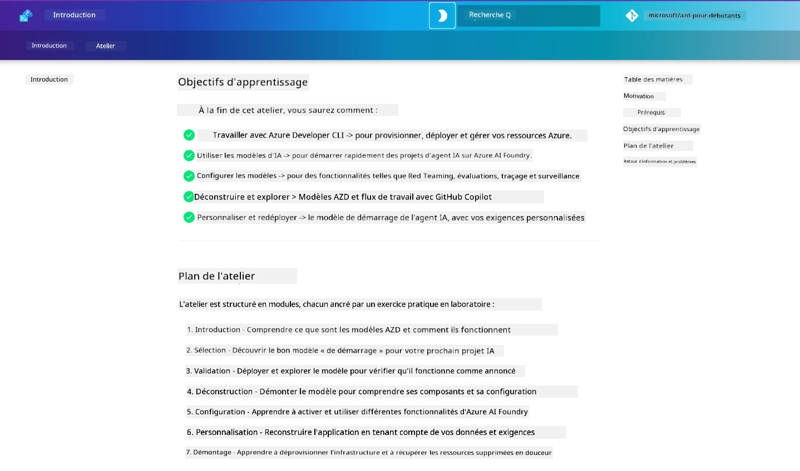

<div align="center">
  <div style="background: linear-gradient(135deg, #0078d4, #106ebe); border-radius: 10px; padding: 20px; margin: 20px 0; box-shadow: 0 4px 15px rgba(0, 120, 212, 0.3); border: 2px solid #005a9e;">
    <h2 style="color: white; margin: 0; font-size: 24px; text-shadow: 1px 1px 2px rgba(0,0,0,0.3);">
      🎯 Atelier AZD pour les développeurs IA
    </h2>
    <p style="color: white; margin: 10px 0 0 0; font-size: 16px; text-shadow: 1px 1px 2px rgba(0,0,0,0.3);">
      <strong>Un atelier pratique pour créer des applications IA avec Azure Developer CLI.</strong><br>
      Complétez 7 modules pour maîtriser les templates AZD et les workflows de déploiement IA.
    </p>
    <div style="margin-top: 15px;">
      <span style="background: rgba(255,255,255,0.2); padding: 5px 10px; border-radius: 15px; color: white; font-size: 14px;">
        📅 Dernière mise à jour : février 2026
      </span>
    </div>
  </div>
</div>

# Atelier AZD pour les développeurs IA

Bienvenue dans cet atelier pratique pour apprendre Azure Developer CLI (AZD) avec un focus sur le déploiement d’applications IA. Cet atelier vous aide à acquérir une compréhension appliquée des templates AZD en 3 étapes :

1. **Découverte** – trouvez le template qui vous convient.
1. **Déploiement** – déployez et validez que cela fonctionne.
1. **Personnalisation** – modifiez et itérez pour en faire le vôtre !

Au cours de cet atelier, vous serez aussi initié aux outils et workflows fondamentaux pour développeurs, afin de vous aider à rationaliser votre parcours de développement de bout en bout.

<br/>

## Guide basé sur le navigateur

Les leçons de l’atelier sont en Markdown. Vous pouvez les parcourir directement sur GitHub — ou lancer un aperçu basé sur le navigateur comme montré dans la capture d’écran ci-dessous.



Pour utiliser cette option, forkez le dépôt sur votre profil, puis lancez GitHub Codespaces. Une fois le terminal VS Code actif, tapez cette commande :

```bash title="" linenums="0"
mkdocs serve > /dev/null 2>&1 &
```

En quelques secondes, une boîte de dialogue apparaîtra. Sélectionnez l’option `Open in browser`. Le guide web s’ouvrira alors dans un nouvel onglet du navigateur. Quelques avantages de cet aperçu :

1. **Recherche intégrée** – trouvez rapidement des mots-clés ou des leçons.
1. **Icône copier** – survolez les blocs de code pour voir cette option
1. **Changement de thème** – basculez entre thèmes clair et sombre
1. **Obtenir de l’aide** – cliquez sur l’icône Discord dans le pied de page pour nous rejoindre !

<br/>

## Aperçu de l’atelier

**Durée :** 3-4 heures  
**Niveau :** Débutant à intermédiaire  
**Prérequis :** Connaissances de base sur Azure, concepts IA, VS Code et outils en ligne de commande.

C’est un atelier pratique où vous apprenez en faisant. Une fois les exercices terminés, nous recommandons de consulter le programme AZD Pour Débutants pour poursuivre votre apprentissage sur les bonnes pratiques de Sécurité et Productivité.

| Temps| Module  | Objectif |
|:---|:---|:---|
| 15 min | [Introduction](docs/instructions/0-Introduction.md) | Poser le cadre, comprendre les objectifs |
| 30 min | [Sélectionner un template IA](docs/instructions/1-Select-AI-Template.md) | Explorer les options et choisir un point de départ | 
| 30 min | [Valider le template IA](docs/instructions/2-Validate-AI-Template.md) | Déployer la solution par défaut sur Azure |
| 30 min | [Déconstruire le template IA](docs/instructions/3-Deconstruct-AI-Template.md) | Explorer la structure et la configuration |
| 30 min | [Configurer le template IA](docs/instructions/4-Configure-AI-Template.md) | Activer et tester les fonctionnalités disponibles |
| 30 min | [Personnaliser le template IA](docs/instructions/5-Customize-AI-Template.md) | Adapter le template à vos besoins |
| 30 min | [Démanteler l'infrastructure](docs/instructions/6-Teardown-Infrastructure.md) | Nettoyer et libérer les ressources |
| 15 min | [Bilan & Étapes suivantes](docs/instructions/7-Wrap-up.md) | Ressources d’apprentissage, défi de l’atelier |

<br/>

## Ce que vous apprendrez

Considérez le template AZD comme un bac à sable d’apprentissage pour explorer diverses capacités et outils pour un développement complet sur Microsoft Foundry. À la fin de cet atelier, vous devriez avoir une compréhension intuitive des différents outils et concepts dans ce contexte.

| Concept  | Objectif |
|:---|:---|
| **Azure Developer CLI** | Comprendre les commandes et workflows de l’outil |
| **Templates AZD**| Comprendre la structure et la configuration du projet |
| **Azure AI Agent**| Provisionner et déployer un projet Microsoft Foundry  |
| **Azure AI Search**| Permettre l’ingénierie du contexte avec les agents |
| **Observabilité**| Explorer le traçage, la surveillance et les évaluations |
| **Red Teaming**| Explorer les tests adverses et les contremesures |

<br/>

## Structure de l’atelier

L’atelier est structuré pour vous emmener d’une découverte du template, au déploiement, à la déconstruction et à la personnalisation — utilisant le template officiel [Getting Started with AI Agents](https://github.com/Azure-Samples/get-started-with-ai-agents) comme base.

### [Module 1 : Sélectionner un template IA](docs/instructions/1-Select-AI-Template.md) (30 min)

- Qu’est-ce qu’un template IA ?
- Où trouver des templates IA ?
- Comment commencer à créer des agents IA ?
- **Exercice** : Démarrage rapide avec GitHub Codespaces

### [Module 2 : Valider le template IA](docs/instructions/2-Validate-AI-Template.md) (30 min)

- Quelle est l’architecture du template IA ?
- Quel est le workflow de développement AZD ?
- Comment obtenir de l’aide pour le développement AZD ?
- **Exercice** : Déployer et valider le template agents IA

### [Module 3 : Déconstruire le template IA](docs/instructions/3-Deconstruct-AI-Template.md) (30 min)

- Explorez votre environnement dans `.azure/`  
- Explorez votre configuration de ressources dans `infra/`  
- Explorez votre configuration AZD dans `azure.yaml`s
- **Exercice** : Modifier les variables d’environnement et redéployer

### [Module 4 : Configurer le template IA](docs/instructions/4-Configure-AI-Template.md) (30 min)
- Explorez : Récupération augmentée par génération
- Explorez : Évaluation des agents & Red Teaming
- Explorez : Traçage & Surveillance
- **Exercice** : Explorer Agent IA + Observabilité

### [Module 5 : Personnaliser le template IA](docs/instructions/5-Customize-AI-Template.md) (30 min)
- Définir : Cahier des charges (PRD) avec exigences de scénario
- Configurer : Variables d'environnement pour AZD
- Implémenter : Hooks de cycle de vie pour tâches additionnelles
- **Exercice** : Personnaliser le template pour mon scénario

### [Module 6 : Démanteler l’infrastructure](docs/instructions/6-Teardown-Infrastructure.md) (30 min)
- Récapitulatif : Qu’est-ce qu’un template AZD ?
- Récapitulatif : Pourquoi utiliser Azure Developer CLI ?
- Étapes suivantes : Essayez un autre template !
- **Exercice** : Déprovisionner l’infrastructure et nettoyez

<br/>

## Défi de l’atelier

Vous voulez vous dépasser et faire plus ? Voici quelques suggestions de projets – ou partagez vos idées avec nous !

| Projet | Description |
|:---|:---|
|1. **Déconstruire un template IA complexe** | Utilisez les workflows et outils décrits et voyez si vous pouvez déployer, valider, et personnaliser un template IA différent. _Qu’avez-vous appris ?_|
|2. **Personnaliser selon votre scénario**  | Essayez de rédiger un PRD (Document d’exigences produit) pour un scénario différent. Puis utilisez GitHub Copilot dans votre dépôt template dans Agent Model - et demandez-lui de générer un workflow de personnalisation. _Qu’avez-vous appris ? Comment pourriez-vous améliorer ces suggestions ?_|
| | |

## Vous avez des retours ?

1. Ouvrez un issue sur ce dépôt – taggez-le `Workshop` pour plus de visibilité.
1. Rejoignez le Discord Microsoft Foundry – connectez-vous avec vos pairs !

| | | 
|:---|:---|
| **📚 Accueil du cours**| [AZD Pour Débutants](../README.md)|
| **📖 Documentation** | [Commencer avec les templates IA](https://learn.microsoft.com/en-us/azure/ai-foundry/how-to/develop/ai-template-get-started)|
| **🛠️ Templates IA** | [Templates Microsoft Foundry](https://ai.azure.com/templates) |
|**🚀 Étapes suivantes** | [Commencer l’Atelier](../../../workshop) |
| | |

<br/>

---

**Navigation :** [Cours principal](../README.md) | [Introduction](docs/instructions/0-Introduction.md) | [Module 1 : Sélectionner un template](docs/instructions/1-Select-AI-Template.md)

**Prêt à commencer à créer des applications IA avec AZD ?**

[Commencer l’atelier : Introduction →](docs/instructions/0-Introduction.md)

---

<!-- CO-OP TRANSLATOR DISCLAIMER START -->
**Avertissement** :  
Ce document a été traduit à l’aide du service de traduction IA [Co-op Translator](https://github.com/Azure/co-op-translator). Bien que nous nous efforcions d’assurer l’exactitude, veuillez noter que les traductions automatisées peuvent contenir des erreurs ou des inexactitudes. Le document original dans sa langue d’origine doit être considéré comme la source faisant foi. Pour les informations critiques, il est recommandé de recourir à une traduction professionnelle réalisée par un humain. Nous déclinons toute responsabilité en cas de malentendus ou de mauvaises interprétations résultant de l’utilisation de cette traduction.
<!-- CO-OP TRANSLATOR DISCLAIMER END -->