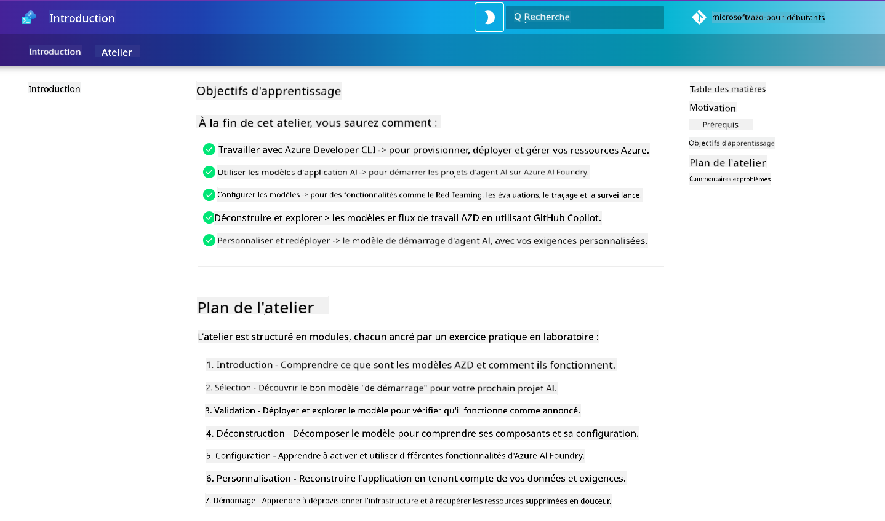

<!--
CO_OP_TRANSLATOR_METADATA:
{
  "original_hash": "9cc966416ab431c38b2ab863884b196c",
  "translation_date": "2025-09-24T09:05:50+00:00",
  "source_file": "workshop/README.md",
  "language_code": "fr"
}
-->
# Atelier AZD pour les Développeurs IA

Bienvenue dans cet atelier pratique pour apprendre à utiliser Azure Developer CLI (AZD) avec un focus sur le déploiement d'applications d'IA. Cet atelier vous permettra de comprendre concrètement les modèles AZD en 3 étapes :

1. **Découverte** - trouver le modèle qui vous convient.
1. **Déploiement** - déployer et valider son fonctionnement.
1. **Personnalisation** - modifier et itérer pour l'adapter à vos besoins !

Au cours de cet atelier, vous serez également introduit aux outils et flux de travail essentiels pour les développeurs, afin de simplifier votre parcours de développement de bout en bout.

<br/>

## Guide Basé sur le Navigateur

Les leçons de l'atelier sont en Markdown. Vous pouvez les consulter directement sur GitHub - ou lancer un aperçu dans le navigateur comme illustré dans la capture d'écran ci-dessous.



Pour utiliser cette option - créez un fork du dépôt dans votre profil, puis lancez GitHub Codespaces. Une fois le terminal VS Code actif, tapez cette commande :

```bash title="" linenums="0"
mkdocs serve > /dev/null 2>&1 &
```

En quelques secondes, une boîte de dialogue apparaîtra. Sélectionnez l'option `Open in browser`. Le guide web s'ouvrira alors dans un nouvel onglet du navigateur. Quelques avantages de cet aperçu :

1. **Recherche intégrée** - trouvez rapidement des mots-clés ou des leçons.
1. **Icône de copie** - survolez les blocs de code pour voir cette option.
1. **Changement de thème** - basculez entre les thèmes sombre et clair.
1. **Obtenez de l'aide** - cliquez sur l'icône Discord dans le pied de page pour rejoindre !

<br/>

## Aperçu de l'Atelier

**Durée :** 3-4 heures  
**Niveau :** Débutant à Intermédiaire  
**Prérequis :** Connaissance d'Azure, des concepts d'IA, de VS Code et des outils en ligne de commande.

Cet atelier est pratique et vous apprendrez en réalisant les exercices. Une fois les exercices terminés, nous vous recommandons de consulter le programme "AZD pour Débutants" pour approfondir vos connaissances sur les meilleures pratiques en matière de sécurité et de productivité.

| Temps | Module  | Objectif |
|:---|:---|:---|
| 15 min | [Introduction](docs/instructions/0-Introduction.md) | Poser le cadre, comprendre les objectifs |
| 30 min | [Choisir un Modèle IA](docs/instructions/1-Select-AI-Template.md) | Explorer les options et choisir un modèle de départ | 
| 30 min | [Valider le Modèle IA](docs/instructions/2-Validate-AI-Template.md) | Déployer la solution par défaut sur Azure |
| 30 min | [Déconstruire le Modèle IA](docs/instructions/3-Deconstruct-AI-Template.md) | Explorer la structure et la configuration |
| 30 min | [Configurer le Modèle IA](docs/instructions/4-Configure-AI-Template.md) | Activer et tester les fonctionnalités disponibles |
| 30 min | [Personnaliser le Modèle IA](docs/instructions/5-Customize-AI-Template.md) | Adapter le modèle à vos besoins |
| 30 min | [Démanteler l'Infrastructure](docs/instructions/6-Teardown-Infrastructure.md) | Nettoyer et libérer les ressources |
| 15 min | [Conclusion et Étapes Suivantes](docs/instructions/7-Wrap-up.md) | Ressources d'apprentissage, défi de l'atelier |

<br/>

## Ce que Vous Apprendrez

Considérez le modèle AZD comme un bac à sable pour explorer diverses capacités et outils pour le développement de bout en bout sur Azure AI Foundry. À la fin de cet atelier, vous devriez avoir une compréhension intuitive des différents outils et concepts dans ce contexte.

| Concept  | Objectif |
|:---|:---|
| **Azure Developer CLI** | Comprendre les commandes et flux de travail de l'outil |
| **Modèles AZD** | Comprendre la structure et la configuration des projets |
| **Agent Azure AI** | Provisionner et déployer un projet Azure AI Foundry |
| **Recherche Azure AI** | Activer l'ingénierie contextuelle avec des agents |
| **Observabilité** | Explorer le traçage, la surveillance et les évaluations |
| **Red Teaming** | Explorer les tests adverses et les mesures d'atténuation |

<br/>

## Structure de l'Atelier

L'atelier est structuré pour vous emmener dans un parcours allant de la découverte du modèle, au déploiement, à la déconstruction et à la personnalisation - en utilisant le modèle de démarrage officiel [Getting Started with AI Agents](https://github.com/Azure-Samples/get-started-with-ai-agents) comme base.

### [Module 1 : Choisir un Modèle IA](docs/instructions/1-Select-AI-Template.md) (30 min)

- Qu'est-ce qu'un modèle IA ?
- Où puis-je trouver des modèles IA ?
- Comment puis-je commencer à construire des agents IA ?
- **Lab** : Démarrage rapide avec GitHub Codespaces

### [Module 2 : Valider le Modèle IA](docs/instructions/2-Validate-AI-Template.md) (30 min)

- Quelle est l'architecture du modèle IA ?
- Quel est le flux de développement AZD ?
- Comment obtenir de l'aide pour le développement AZD ?
- **Lab** : Déployer et valider le modèle d'agents IA

### [Module 3 : Déconstruire le Modèle IA](docs/instructions/3-Deconstruct-AI-Template.md) (30 min)

- Explorer votre environnement dans `.azure/` 
- Explorer la configuration des ressources dans `infra/` 
- Explorer votre configuration AZD dans `azure.yaml`
- **Lab** : Modifier les variables d'environnement et redéployer

### [Module 4 : Configurer le Modèle IA](docs/instructions/4-Configure-AI-Template.md) (30 min)
- Explorer : Génération Augmentée par Récupération
- Explorer : Évaluation des agents et Red Teaming
- Explorer : Traçage et Surveillance
- **Lab** : Explorer l'agent IA + Observabilité 

### [Module 5 : Personnaliser le Modèle IA](docs/instructions/5-Customize-AI-Template.md) (30 min)
- Définir : PRD avec exigences scénaristiques
- Configurer : Variables d'environnement pour AZD
- Implémenter : Hooks de cycle de vie pour tâches supplémentaires
- **Lab** : Personnaliser le modèle pour mon scénario

### [Module 6 : Démanteler l'Infrastructure](docs/instructions/6-Teardown-Infrastructure.md) (30 min)
- Récapitulatif : Qu'est-ce qu'un modèle AZD ?
- Récapitulatif : Pourquoi utiliser Azure Developer CLI ?
- Étapes suivantes : Essayer un autre modèle !
- **Lab** : Déprovisionner l'infrastructure et nettoyer

<br/>

## Défi de l'Atelier

Envie de vous challenger davantage ? Voici quelques suggestions de projets - ou partagez vos idées avec nous !!

| Projet | Description |
|:---|:---|
|1. **Déconstruire un Modèle IA Complexe** | Utilisez le flux de travail et les outils décrits pour voir si vous pouvez déployer, valider et personnaliser un autre modèle de solution IA. _Qu'avez-vous appris ?_|
|2. **Personnaliser avec Votre Scénario**  | Essayez de rédiger un PRD (Document de Spécifications Produit) pour un autre scénario. Ensuite, utilisez GitHub Copilot dans votre dépôt de modèle en mode Agent et demandez-lui de générer un flux de personnalisation pour vous. _Qu'avez-vous appris ? Comment pourriez-vous améliorer ces suggestions ?_|
| | |

## Vous avez des retours ?

1. Postez une issue sur ce dépôt - taguez-la `Workshop` pour plus de clarté.
1. Rejoignez le Discord Azure AI Foundry - connectez-vous avec vos pairs !

| | | 
|:---|:---|
| **📚 Accueil du Cours**| [AZD pour Débutants](../README.md)|
| **📖 Documentation** | [Commencer avec les modèles IA](https://learn.microsoft.com/en-us/azure/ai-foundry/how-to/develop/ai-template-get-started)|
| **🛠️ Modèles IA** | [Modèles Azure AI Foundry](https://ai.azure.com/templates) |
|**🚀 Étapes Suivantes** | [Relevez le Défi](../../../workshop) |
| | |

<br/>

---

**Précédent :** [Guide de Dépannage IA](../docs/troubleshooting/ai-troubleshooting.md) | **Suivant :** Commencez avec [Lab 1 : Bases AZD](../../../workshop/lab-1-azd-basics)

**Prêt à commencer à construire des applications IA avec AZD ?**

[Commencez le Lab 1 : Fondations AZD →](./lab-1-azd-basics/README.md)

---

