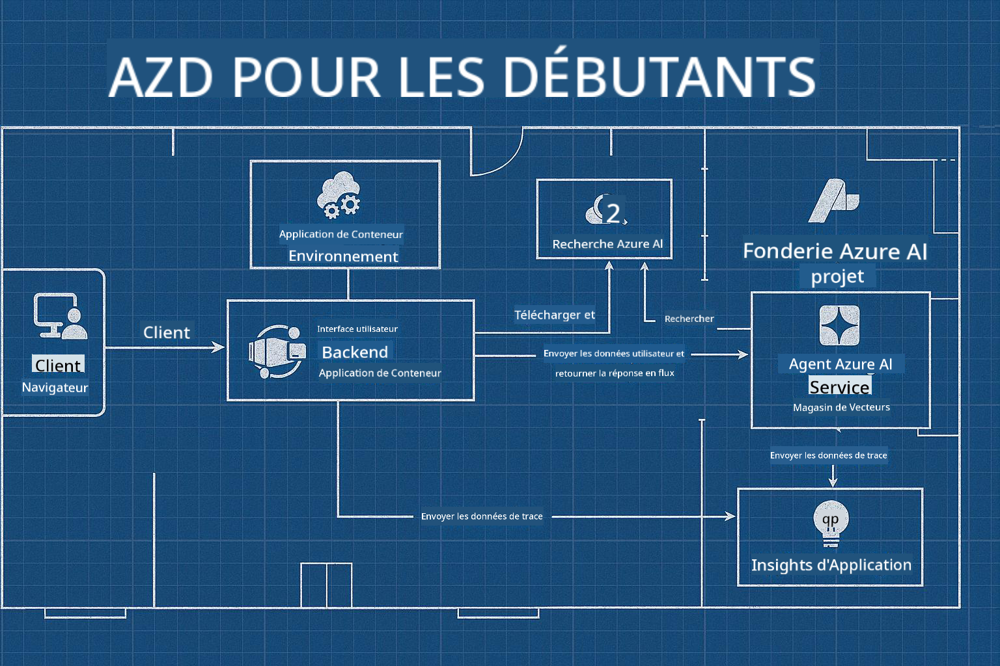

<!--
CO_OP_TRANSLATOR_METADATA:
{
  "original_hash": "245d24997bbcf2bae93bb2a503845d37",
  "translation_date": "2025-09-23T11:39:49+00:00",
  "source_file": "workshop/README.md",
  "language_code": "fr"
}
-->
# Atelier AZD pour les développeurs IA

## Modèles AZD

Construire une solution d'application IA de niveau entreprise adaptée à votre scénario spécifique est un peu comme construire votre propre maison. Vous pouvez la concevoir vous-même, la construire brique par brique, et assumer la responsabilité de garantir qu'elle respecte toutes les directives de gouvernance et de développement.

**OU ....**

Vous pouvez travailler avec un architecte qui vous fournira un _plan_ pour une maison de départ, puis collaborer avec vous pour la _personnaliser_ selon vos besoins. Cela vous permet de vous concentrer sur ce qui rend **votre maison** spéciale, tandis que le câblage, la plomberie et les autres dépendances sont pris en charge par des experts.

**C'est l'approche derrière [AI App Templates](https://ai.azure.com/templates)** - une série de plans pour construire différents types de "maisons" d'applications IA en fonction de vos besoins et dépendances principaux.

## Personnalisation des modèles

Les modèles sont conçus pour fonctionner avec [Azure AI Foundry](https://ai.azure.com). Pensez à cette plateforme comme votre "entrepreneur en construction" avec accès à toutes les ressources, outils et expertises nécessaires pour mener à bien le projet !

Tout ce que vous avez à faire est de choisir [vos modèles de départ](https://learn.microsoft.com/en-us/azure/ai-foundry/how-to/develop/ai-template-get-started). Par exemple, nous nous concentrerons sur le modèle _Get Started with AI Agents_ pour construire une "maison IA agentique" équipée de fonctionnalités comme la recherche IA, le Red Teaming, les évaluations, le traçage, la surveillance et bien plus encore !



Il vous suffit de réserver du temps avec l'architecte pour vous guider dans le processus de personnalisation. [GitHub Copilot for Azure](https://learn.microsoft.com/en-us/azure/developer/github-copilot-azure/get-started) peut être ce guide. Il suffit de "discuter avec lui" pour :

- Découvrir les fonctionnalités Azure dans votre modèle
- Déployer des ressources Azure
- Obtenir des informations sur votre déploiement
- Diagnostiquer et résoudre les problèmes !

Dans cet atelier, nous apprendrons à _déconstruire_ le modèle existant (pour comprendre ce qu'il offre), puis à le _personnaliser_ (pour répondre à nos besoins) - étape par étape.

Les modèles IA **font fonctionner les choses** - en complétant l'atelier, vous apprendrez à **les adapter à vos besoins**.

----

**Navigation dans l'atelier**
- **📚 Accueil du cours** : [AZD pour débutants](../README.md)
- **📖 Chapitres associés** : Couvre [Chapitre 1](../README.md#-chapter-1-foundation--quick-start), [Chapitre 2](../README.md#-chapter-2-ai-first-development-recommended-for-ai-developers), et [Chapitre 5](../README.md#-chapter-5-multi-agent-ai-solutions-advanced)
- **🛠️ Atelier pratique** : [Atelier IA](../docs/ai-foundry/ai-workshop-lab.md)
- **🚀 Prochaines étapes** : [Modules de l'atelier](../../../workshop)

Bienvenue dans l'atelier pratique pour apprendre Azure Developer CLI (AZD) avec un focus sur le déploiement d'applications IA. Cet atelier est conçu pour vous emmener des bases d'AZD au déploiement de solutions IA prêtes pour la production.

## Aperçu de l'atelier

**Durée :** 2-3 heures  
**Niveau :** Débutant à intermédiaire  
**Prérequis :** Connaissances de base sur Azure, les outils en ligne de commande et les concepts IA

### Ce que vous apprendrez

- **Fondamentaux AZD** : Comprendre l'infrastructure en tant que code avec AZD
- 🤖 **Intégration des services IA** : Déployer Azure OpenAI, AI Search et d'autres services IA
- **Déploiement de conteneurs** : Utiliser Azure Container Apps pour les applications IA
- **Meilleures pratiques de sécurité** : Implémenter Managed Identity et des configurations sécurisées
- **Surveillance et observabilité** : Configurer Application Insights pour les charges de travail IA
- **Modèles de production** : Stratégies de déploiement prêtes pour l'entreprise

## Structure de l'atelier

### Module 1 : Fondations AZD (30 minutes)
- Installer et configurer AZD
- Comprendre la structure des projets AZD
- Votre premier déploiement AZD
- **Lab** : Déployer une application web simple

### Module 2 : Intégration Azure OpenAI (45 minutes)
- Configurer les ressources Azure OpenAI
- Stratégies de déploiement de modèles
- Configurer l'accès API et l'authentification
- **Lab** : Déployer une application de chat avec GPT-4

### Module 3 : Applications RAG (45 minutes)
- Intégration de la recherche IA Azure
- Traitement de documents avec Azure Document Intelligence
- Embeddings vectoriels et recherche sémantique
- **Lab** : Construire un système de questions-réponses sur documents

### Module 4 : Déploiement en production (30 minutes)
- Configuration des applications conteneurs
- Optimisation des performances et mise à l'échelle
- Surveillance et journalisation
- **Lab** : Déployer en production avec observabilité

### Module 5 : Modèles avancés (15 minutes)
- Déploiements multi-environnements
- Intégration CI/CD
- Stratégies d'optimisation des coûts
- **Conclusion** : Liste de vérification pour la préparation à la production

## Prérequis

### Outils requis

Veuillez installer ces outils avant l'atelier :

```bash
# Azure Developer CLI
curl -fsSL https://aka.ms/install-azd.sh | bash

# Azure CLI
curl -sL https://aka.ms/InstallAzureCLIDeb | sudo bash

# Git
sudo apt-get install git

# Docker
curl -fsSL https://get.docker.com -o get-docker.sh
sudo sh get-docker.sh

# Python 3.10+
sudo apt-get install python3.10 python3.10-venv python3-pip
```

### Configuration du compte Azure

1. **Abonnement Azure** : [Inscrivez-vous gratuitement](https://azure.microsoft.com/free/)
2. **Accès Azure OpenAI** : [Demandez l'accès](https://aka.ms/oai/access)
3. **Permissions requises** :
   - Rôle de contributeur sur l'abonnement ou le groupe de ressources
   - Administrateur d'accès utilisateur (pour les affectations RBAC)

### Vérifiez les prérequis

Exécutez ce script pour vérifier votre configuration :

```bash
#!/bin/bash
echo "Verifying workshop prerequisites..."

# Check AZD installation
if command -v azd &> /dev/null; then
    echo "✅ Azure Developer CLI: $(azd --version)"
else
    echo "❌ Azure Developer CLI not found"
fi

# Check Azure CLI
if command -v az &> /dev/null; then
    echo "✅ Azure CLI: $(az --version | head -n1)"
else
    echo "❌ Azure CLI not found"
fi

# Check Docker
if command -v docker &> /dev/null; then
    echo "✅ Docker: $(docker --version)"
else
    echo "❌ Docker not found"
fi

# Check Python
if command -v python3 &> /dev/null; then
    echo "✅ Python: $(python3 --version)"
else
    echo "❌ Python 3 not found"
fi

# Check Azure login
if az account show &> /dev/null; then
    echo "✅ Azure: Logged in as $(az account show --query user.name -o tsv)"
else
    echo "❌ Azure: Not logged in (run 'az login')"
fi

echo "Setup verification complete!"
```

## Matériel de l'atelier

### Exercices pratiques

Chaque module inclut des laboratoires pratiques avec du code de départ et des instructions étape par étape :

- **[lab-1-azd-basics/](../../../workshop/lab-1-azd-basics)** - Votre premier déploiement AZD
- **[lab-2-openai-chat/](../../../workshop/lab-2-openai-chat)** - Application de chat avec Azure OpenAI
- **[lab-3-rag-search/](../../../workshop/lab-3-rag-search)** - Application RAG avec recherche IA
- **[lab-4-production/](../../../workshop/lab-4-production)** - Modèles de déploiement en production
- **[lab-5-advanced/](../../../workshop/lab-5-advanced)** - Scénarios de déploiement avancés

### Matériel de référence

- **[Guide d'intégration AI Foundry](../docs/ai-foundry/azure-ai-foundry-integration.md)** - Modèles d'intégration complets
- **[Guide de déploiement de modèles IA](../docs/ai-foundry/ai-model-deployment.md)** - Meilleures pratiques de déploiement de modèles
- **[Pratiques IA en production](../docs/ai-foundry/production-ai-practices.md)** - Modèles de déploiement pour entreprises
- **[Guide de dépannage IA](../docs/troubleshooting/ai-troubleshooting.md)** - Problèmes courants et solutions

### Modèles d'exemple

Modèles de démarrage rapide pour scénarios IA courants :

```
workshop/templates/
├── minimal-chat/          # Basic OpenAI chat app
├── rag-application/       # RAG with AI Search
├── multi-model/          # Multiple AI services
└── production-ready/     # Enterprise template
```

## Démarrage

### Option 1 : GitHub Codespaces (Recommandé)

La manière la plus rapide de commencer l'atelier :

[](https://github.com/codespaces/new?hide_repo_select=true&ref=main&repo=YOUR_REPO_ID)

### Option 2 : Développement local

1. **Clonez le dépôt de l'atelier :**
```bash
git clone https://github.com/YOUR_ORG/AZD-for-beginners.git
cd AZD-for-beginners/workshop
```

2. **Connectez-vous à Azure :**
```bash
az login
azd auth login
```

3. **Commencez avec le Lab 1 :**
```bash
cd lab-1-azd-basics
cat README.md  # Follow the instructions
```

### Option 3 : Atelier dirigé par un instructeur

Si vous participez à une session dirigée par un instructeur :

- 🎥 **Enregistrement de l'atelier** : [Disponible à la demande](https://aka.ms/azd-ai-workshop)
- 💬 **Communauté Discord** : [Rejoignez pour un support en direct](https://aka.ms/foundry/discord)
- **Feedback sur l'atelier** : [Partagez votre expérience](https://aka.ms/azd-workshop-feedback)

## Chronologie de l'atelier

### Apprentissage autonome (3 heures)

```
⏰ 00:00 - 00:30  Module 1: AZD Foundations
⏰ 00:30 - 01:15  Module 2: Azure OpenAI Integration
⏰ 01:15 - 02:00  Module 3: RAG Applications
⏰ 02:00 - 02:30  Module 4: Production Deployment
⏰ 02:30 - 02:45  Module 5: Advanced Patterns
⏰ 02:45 - 03:00  Q&A and Next Steps
```

### Session dirigée par un instructeur (2,5 heures)

```
⏰ 00:00 - 00:15  Welcome & Prerequisites Check
⏰ 00:15 - 00:40  Module 1: Live Demo + Lab
⏰ 00:40 - 01:20  Module 2: OpenAI Integration
⏰ 01:20 - 01:30  Break
⏰ 01:30 - 02:10  Module 3: RAG Applications
⏰ 02:10 - 02:30  Module 4: Production Patterns
⏰ 02:30 - 02:45  Module 5: Advanced Topics
⏰ 02:45 - 03:00  Q&A and Resources
```

## Critères de réussite

À la fin de cet atelier, vous serez capable de :

✅ **Déployer des applications IA** en utilisant des modèles AZD  
✅ **Configurer Azure OpenAI** avec une sécurité appropriée  
✅ **Construire des applications RAG** avec l'intégration de la recherche IA Azure  
✅ **Implémenter des modèles de production** pour les charges de travail IA d'entreprise  
✅ **Surveiller et résoudre les problèmes** des déploiements d'applications IA  
✅ **Appliquer des stratégies d'optimisation des coûts** pour les charges de travail IA  

## Communauté et support

### Pendant l'atelier

- 🙋 **Questions** : Utilisez le chat de l'atelier ou levez la main
- 🐛 **Problèmes** : Consultez le [guide de dépannage](../docs/troubleshooting/ai-troubleshooting.md)
- **Conseils** : Partagez vos découvertes avec les autres participants

### Après l'atelier

- 💬 **Discord** : [Communauté Azure AI Foundry](https://aka.ms/foundry/discord)
- **GitHub Issues** : [Signalez les problèmes de modèles](https://github.com/YOUR_ORG/AZD-for-beginners/issues)
- 📧 **Feedback** : [Formulaire d'évaluation de l'atelier](https://aka.ms/azd-workshop-feedback)

## Prochaines étapes

### Continuer à apprendre

1. **Scénarios avancés** : Explorez [les déploiements multi-régions](../docs/ai-foundry/production-ai-practices.md#multi-region-deployment)
2. **Intégration CI/CD** : Configurez [les workflows GitHub Actions](../docs/deployment/github-actions.md)
3. **Modèles personnalisés** : Créez vos propres [modèles AZD](../docs/getting-started/custom-templates.md)

### Appliquer dans vos projets

1. **Évaluation** : Utilisez notre [liste de vérification de préparation](./production-readiness-checklist.md)
2. **Modèles** : Commencez avec nos [modèles spécifiques à l'IA](../../../workshop/templates)
3. **Support** : Rejoignez le [Discord Azure AI Foundry](https://aka.ms/foundry/discord)

### Partagez votre succès

- ⭐ **Ajoutez une étoile au dépôt** si cet atelier vous a aidé
- 🐦 **Partagez sur les réseaux sociaux** avec #AzureDeveloperCLI #AzureAI
- 📝 **Écrivez un article de blog** sur votre parcours de déploiement IA

---

## Feedback sur l'atelier

Votre feedback nous aide à améliorer l'expérience de l'atelier :

| Aspect | Note (1-5) | Commentaires |
|--------|------------|-------------|
| Qualité du contenu | ⭐⭐⭐⭐⭐ | |
| Laboratoires pratiques | ⭐⭐⭐⭐⭐ | |
| Documentation | ⭐⭐⭐⭐⭐ | |
| Niveau de difficulté | ⭐⭐⭐⭐⭐ | |
| Expérience globale | ⭐⭐⭐⭐⭐ | |

**Soumettre un feedback** : [Formulaire d'évaluation de l'atelier](https://aka.ms/azd-workshop-feedback)

---

**Précédent :** [Guide de dépannage IA](../docs/troubleshooting/ai-troubleshooting.md) | **Suivant :** Commencez avec [Lab 1 : Fondations AZD](../../../workshop/lab-1-azd-basics)

**Prêt à commencer à construire des applications IA avec AZD ?**

[Commencez le Lab 1 : Fondations AZD →](./lab-1-azd-basics/README.md)

---

