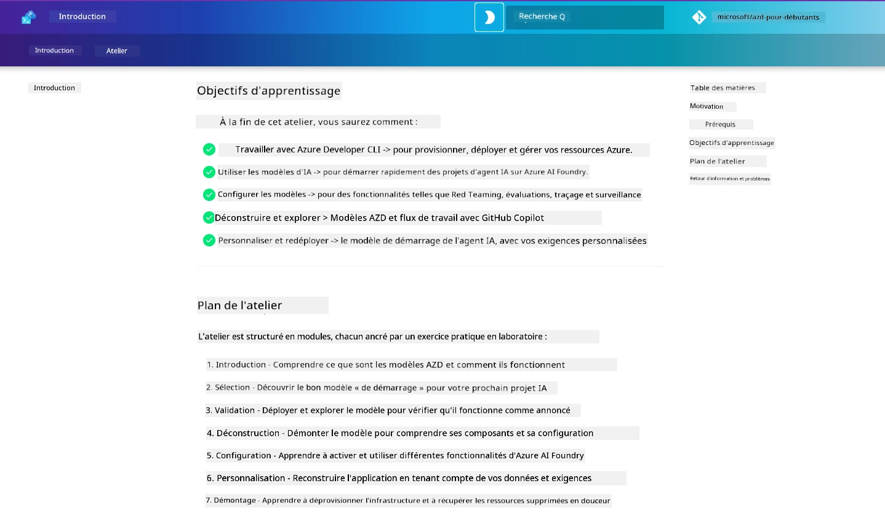

<div align="center">
  <div style="background: linear-gradient(135deg, #0078d4, #106ebe); border-radius: 10px; padding: 20px; margin: 20px 0; box-shadow: 0 4px 15px rgba(0, 120, 212, 0.3); border: 2px solid #005a9e;">
    <h2 style="color: white; margin: 0; font-size: 24px; text-shadow: 1px 1px 2px rgba(0,0,0,0.3);">
      🎯 Atelier AZD pour développeurs IA
    </h2>
    <p style="color: white; margin: 10px 0 0 0; font-size: 16px; text-shadow: 1px 1px 2px rgba(0,0,0,0.3);">
      <strong>Un atelier pratique pour créer des applications IA avec Azure Developer CLI.</strong><br>
      Complétez 7 modules pour maîtriser les modèles AZD et les workflows de déploiement IA.
    </p>
    <div style="margin-top: 15px;">
      <span style="background: rgba(255,255,255,0.2); padding: 5px 10px; border-radius: 15px; color: white; font-size: 14px;">
        📅 Dernière mise à jour : mars 2026
      </span>
    </div>
  </div>
</div>

# Atelier AZD pour développeurs IA

Bienvenue à l'atelier pratique pour apprendre Azure Developer CLI (AZD) avec un focus sur le déploiement d'applications IA. Cet atelier vous aide à acquérir une compréhension appliquée des modèles AZD en 3 étapes :

1. **Découverte** - trouvez le modèle qui vous convient.
1. **Déploiement** - déployez et validez que ça fonctionne.
1. **Personnalisation** - modifiez et itérez pour le faire vôtre !

Au cours de cet atelier, vous serez également présenté aux outils et workflows essentiels pour développeurs, afin de vous aider à optimiser votre parcours de développement complet.

<br/>

## Guide basé sur le navigateur

Les leçons de l'atelier sont en Markdown. Vous pouvez les naviguer directement sur GitHub - ou lancer un aperçu dans le navigateur comme montré dans la capture d'écran ci-dessous.



Pour utiliser cette option, forkez le dépôt dans votre profil, puis lancez GitHub Codespaces. Une fois le terminal VS Code activé, tapez cette commande :

Cet aperçu dans le navigateur fonctionne dans GitHub Codespaces, les conteneurs de développement, ou un clone local avec Python et MkDocs installés.

```bash title="" linenums="0"
mkdocs serve > /dev/null 2>&1 &
```

En quelques secondes, vous verrez une boîte de dialogue contextuelle. Sélectionnez l'option `Ouvrir dans le navigateur`. Le guide web s'ouvrira alors dans un nouvel onglet du navigateur. Voici quelques avantages de cet aperçu :

1. **Recherche intégrée** - trouvez rapidement mots-clés ou leçons.
1. **Icône de copie** - survolez les blocs de code pour voir cette option
1. **Changement de thème** - basculez entre thèmes clair et sombre
1. **Obtenir de l'aide** - cliquez sur l'icône Discord en bas de page pour rejoindre !

<br/>

## Aperçu de l'atelier

**Durée :** 3-4 heures  
**Niveau :** Débutant à intermédiaire  
**Prérequis :** Connaissance d’Azure, concepts IA, VS Code & outils en ligne de commande.

C’est un atelier pratique où vous apprenez en faisant. Une fois les exercices terminés, nous recommandons de revoir le programme AZD Pour Débutants pour poursuivre votre apprentissage des bonnes pratiques en Sécurité et Productivité.

| Temps | Module  | Objectif |
|:---|:---|:---|
| 15 min | [Introduction](docs/instructions/0-Introduction.md) | Poser le cadre, comprendre les objectifs |
| 30 min | [Sélectionner un modèle IA](docs/instructions/1-Select-AI-Template.md) | Explorer les options et choisir un modèle de départ | 
| 30 min | [Valider le modèle IA](docs/instructions/2-Validate-AI-Template.md) | Déployer la solution par défaut sur Azure |
| 30 min | [Déconstruire le modèle IA](docs/instructions/3-Deconstruct-AI-Template.md) | Explorer la structure et la configuration |
| 30 min | [Configurer le modèle IA](docs/instructions/4-Configure-AI-Template.md) | Activer et tester les fonctionnalités disponibles |
| 30 min | [Personnaliser le modèle IA](docs/instructions/5-Customize-AI-Template.md) | Adapter le modèle à vos besoins |
| 30 min | [Démanteler l’infrastructure](docs/instructions/6-Teardown-Infrastructure.md) | Nettoyer et libérer les ressources |
| 15 min | [Conclusion & prochaines étapes](docs/instructions/7-Wrap-up.md) | Ressources d’apprentissage, défi de l’atelier |

<br/>

## Ce que vous apprendrez

Considérez le modèle AZD comme un bac à sable d’apprentissage pour explorer diverses capacités et outils pour le développement complet sur Microsoft Foundry. À la fin de cet atelier, vous devriez avoir une intuition des différents outils et concepts dans ce contexte.

| Concept  | Objectif |
|:---|:---|
| **Azure Developer CLI** | Comprendre les commandes et workflows de l’outil |
| **Modèles AZD**| Comprendre la structure de projet et la configuration |
| **Agent IA Azure**| Provisionner et déployer un projet Microsoft Foundry |
| **Recherche IA Azure**| Activer l’ingénierie contextuelle avec des agents |
| **Observabilité**| Explorer le traçage, la surveillance et les évaluations |
| **Red Teaming**| Explorer les tests adverses et les mitigations |

<br/>

## Structure de l’atelier

L’atelier est structuré pour vous faire passer de la découverte du modèle, au déploiement, à la déconstruction puis à la personnalisation - en utilisant le modèle officiel de démarrage [Getting Started with AI Agents](https://github.com/Azure-Samples/get-started-with-ai-agents) comme base.

### [Module 1 : Sélectionner un modèle IA](docs/instructions/1-Select-AI-Template.md) (30 min)

- Que sont les modèles IA ?
- Où puis-je trouver des modèles IA ?
- Comment commencer à créer des agents IA ?
- **Lab** : Démarrage rapide dans Codespaces ou un conteneur de développement

### [Module 2 : Valider le modèle IA](docs/instructions/2-Validate-AI-Template.md) (30 min)

- Quelle est l’architecture du modèle IA ?
- Quel est le workflow de développement AZD ?
- Comment obtenir de l’aide pour le développement AZD ?
- **Lab** : Déployer & valider le modèle Agents IA

### [Module 3 : Déconstruire le modèle IA](docs/instructions/3-Deconstruct-AI-Template.md) (30 min)

- Explorer votre environnement dans `.azure/`  
- Explorer votre configuration des ressources dans `infra/`  
- Explorer votre configuration AZD dans les `azure.yaml`  
- **Lab** : Modifier les variables d’environnement & redéployez

### [Module 4 : Configurer le modèle IA](docs/instructions/4-Configure-AI-Template.md) (30 min)
- Explorer : Génération augmentée par récupération
- Explorer : Évaluation des agents & red teaming
- Explorer : Traçage & surveillance
- **Lab** : Explorer l’agent IA + observabilité 

### [Module 5 : Personnaliser le modèle IA](docs/instructions/5-Customize-AI-Template.md) (30 min)
- Définir : PRD avec exigences du scénario
- Configurer : Variables d’environnement pour AZD
- Implémenter : Hooks de cycle de vie pour tâches additionnelles
- **Lab** : Personnaliser le modèle pour mon scénario

### [Module 6 : Démanteler l’infrastructure](docs/instructions/6-Teardown-Infrastructure.md) (30 min)
- Récapitulatif : Que sont les modèles AZD ?
- Récapitulatif : Pourquoi utiliser Azure Developer CLI ?
- Prochaines étapes : Essayez un modèle différent !
- **Lab** : Déprovisionner l’infrastructure & nettoyer

<br/>

## Défi de l’atelier

Vous souhaitez vous challenger davantage ? Voici quelques suggestions de projet — ou partagez vos idées avec nous !!

| Projet | Description |
|:---|:---|
|1. **Déconstruire un modèle IA complexe** | Utilisez le workflow et les outils présentés pour déployer, valider et personnaliser un autre modèle de solution IA. _Qu’avez-vous appris ?_|
|2. **Personnaliser avec votre scénario**  | Essayez de rédiger un PRD (Document de Spécifications Produit) pour un scénario différent. Puis utilisez GitHub Copilot dans votre repo de modèle en mode Agent — et demandez-lui de générer un workflow de personnalisation pour vous. _Qu’avez-vous appris ? Comment pourriez-vous améliorer ces suggestions ?_|
| | |

## Des retours ?

1. Ouvrez une issue sur ce dépôt – taguez-la `Workshop` pour faciliter le suivi.
1. Rejoignez le Discord Microsoft Foundry – connectez-vous avec vos pairs !

| | | 
|:---|:---|
| **📚 Accueil du cours**| [AZD Pour Débutants](../README.md)|
| **📖 Documentation** | [Commencer avec les modèles IA](https://learn.microsoft.com/en-us/azure/ai-foundry/how-to/develop/ai-template-get-started)|
| **🛠️ Modèles IA** | [Modèles Microsoft Foundry](https://ai.azure.com/templates) |
|**🚀 Prochaines étapes** | [Débuter l’atelier](#aperçu-de-latelier) |
| | |

<br/>

---

**Navigation :** [Cours principal](../README.md) | [Introduction](docs/instructions/0-Introduction.md) | [Module 1 : Sélectionner un modèle](docs/instructions/1-Select-AI-Template.md)

**Prêt à commencer à créer des applications IA avec AZD ?**

[Commencer l’atelier : Introduction →](docs/instructions/0-Introduction.md)

---

<!-- CO-OP TRANSLATOR DISCLAIMER START -->
**Clause de non-responsabilité** :  
Ce document a été traduit à l’aide du service de traduction IA [Co-op Translator](https://github.com/Azure/co-op-translator). Bien que nous nous efforçons d’assurer l’exactitude, veuillez noter que les traductions automatiques peuvent contenir des erreurs ou des imprécisions. Le document original dans sa langue d’origine doit être considéré comme la source faisant foi. Pour les informations critiques, il est recommandé de recourir à une traduction humaine professionnelle. Nous ne sommes pas responsables des malentendus ou mauvaises interprétations résultant de l’utilisation de cette traduction.
<!-- CO-OP TRANSLATOR DISCLAIMER END -->