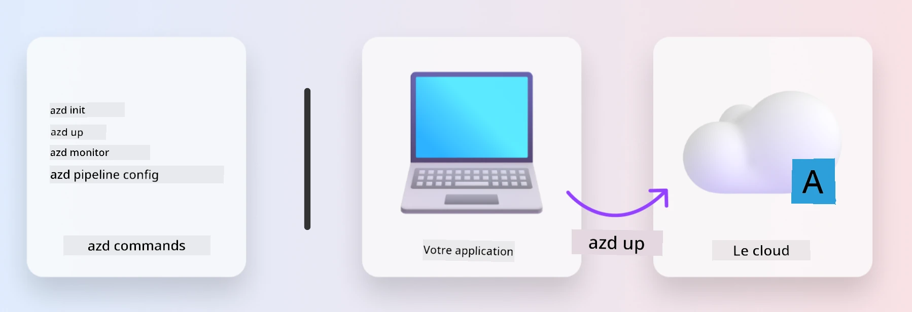
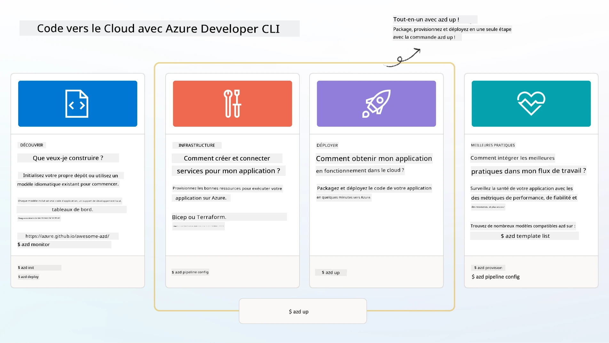

# 1. Choisir un modèle

!!! tip "À LA FIN DE CE MODULE, VOUS SEREZ EN MESURE DE"

    - [ ] Décrire ce que sont les modèles AZD
    - [ ] Découvrir et utiliser les modèles AZD pour l'IA
    - [ ] Commencer avec le modèle AI Agents
    - [ ] **Lab 1 :** Démarrage rapide avec AZD et GitHub Codespaces

---

## 1. Une analogie avec la construction

Créer une application d'IA moderne et prête pour l'entreprise _à partir de zéro_ peut sembler intimidant. C'est un peu comme construire votre nouvelle maison tout seul, brique par brique. Oui, c'est possible ! Mais ce n'est pas la manière la plus efficace d'obtenir le résultat souhaité !

À la place, on commence souvent avec un _plan architectural existant_, et on travaille avec un architecte pour le personnaliser selon nos besoins spécifiques. C'est exactement cette approche qu'il faut adopter pour développer des applications intelligentes. D'abord, trouvez une bonne architecture qui correspond à votre problématique. Ensuite, collaborez avec un architecte de solutions pour personnaliser et développer la solution selon votre scénario spécifique.

Mais où trouver ces plans architecturaux ? Et comment trouver un architecte prêt à nous apprendre à personnaliser et déployer ces plans par nous-mêmes ? Dans cet atelier, nous répondons à ces questions en vous présentant trois technologies :

1. [Azure Developer CLI](https://aka.ms/azd) - un outil open-source qui accélère le cheminement des développeurs, de la phase de développement local (construction) à la phase de déploiement dans le cloud (livraison).
1. [Azure AI Foundry Templates](https://ai.azure.com/templates) - des dépôts open-source standardisés contenant du code exemple, des fichiers d'infrastructure et de configuration pour déployer une architecture de solution IA.
1. [GitHub Copilot Agent Mode](https://code.visualstudio.com/docs/copilot/chat/chat-agent-mode) - un agent de codage basé sur les connaissances Azure, qui peut nous guider dans la navigation du code et les modifications - en utilisant le langage naturel.

Avec ces outils, nous pouvons maintenant _découvrir_ le bon modèle, _le déployer_ pour valider son fonctionnement, et _le personnaliser_ pour répondre à nos scénarios spécifiques. Plongeons dans le sujet et apprenons comment tout cela fonctionne.

---

## 2. Azure Developer CLI

Le [Azure Developer CLI](https://learn.microsoft.com/en-us/azure/developer/azure-developer-cli/) (ou `azd`) est un outil en ligne de commande open-source qui peut accélérer votre parcours du code au cloud grâce à une série de commandes conviviales pour les développeurs, fonctionnant de manière cohérente dans votre IDE (développement) et vos environnements CI/CD (devops).

Avec `azd`, votre parcours de déploiement peut être aussi simple que :

- `azd init` - Initialise un nouveau projet IA à partir d'un modèle AZD existant.
- `azd up` - Provisionne l'infrastructure et déploie votre application en une seule étape.
- `azd monitor` - Obtenez une surveillance en temps réel et des diagnostics pour votre application déployée.
- `azd pipeline config` - Configurez des pipelines CI/CD pour automatiser le déploiement sur Azure.

**🎯 | EXERCICE** : <br/> Explorez l'outil en ligne de commande `azd` dans votre environnement GitHub Codespaces dès maintenant. Commencez par taper cette commande pour voir ce que l'outil peut faire :

```bash title="" linenums="0"
azd help
```



---

## 3. Le modèle AZD

Pour que `azd` fonctionne, il doit connaître l'infrastructure à provisionner, les paramètres de configuration à appliquer et l'application à déployer. C'est là que les [modèles AZD](https://learn.microsoft.com/en-us/azure/developer/azure-developer-cli/azd-templates?tabs=csharp) entrent en jeu.

Les modèles AZD sont des dépôts open-source qui combinent du code exemple avec des fichiers d'infrastructure et de configuration nécessaires pour déployer l'architecture de solution.
En adoptant une approche _Infrastructure-as-Code_ (IaC), ils permettent de versionner les définitions des ressources et les paramètres de configuration du modèle (tout comme le code source de l'application) - créant ainsi des workflows réutilisables et cohérents pour les utilisateurs de ce projet.

Lorsque vous créez ou réutilisez un modèle AZD pour _votre_ scénario, posez-vous ces questions :

1. Que construisez-vous ? → Existe-t-il un modèle avec du code de démarrage pour ce scénario ?
1. Comment votre solution est-elle architecturée ? → Existe-t-il un modèle avec les ressources nécessaires ?
1. Comment votre solution est-elle déployée ? → Pensez à `azd deploy` avec des hooks de pré/post-traitement !
1. Comment pouvez-vous l'optimiser davantage ? → Pensez à la surveillance intégrée et aux pipelines d'automatisation !

**🎯 | EXERCICE** : <br/> 
Visitez la galerie [Awesome AZD](https://azure.github.io/awesome-azd/) et utilisez les filtres pour explorer les 250+ modèles actuellement disponibles. Voyez si vous pouvez en trouver un qui correspond à vos besoins spécifiques.



---

## 4. Modèles d'applications IA

---

