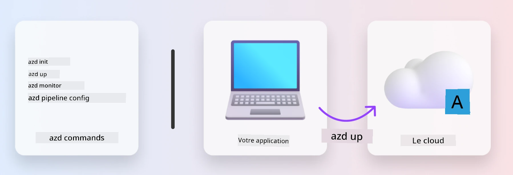
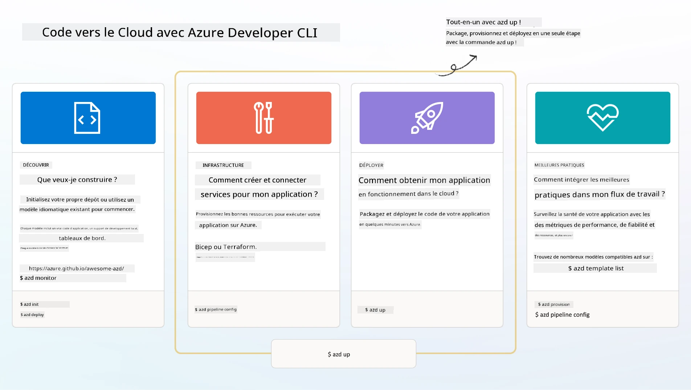

# 1. Sélectionnez un modèle

!!! tip "À LA FIN DE CE MODULE, VOUS SAUREZ"

    - [ ] Décrire ce que sont les modèles AZD
    - [ ] Découvrir et utiliser les modèles AZD pour l'IA
    - [ ] Commencer avec le modèle AI Agents
    - [ ] **Laboratoire 1 :** Démarrage rapide AZD dans Codespaces ou un conteneur de développement

---

## 1. Une analogie avec un constructeur

Construire une application IA moderne prête pour l'entreprise _à partir de zéro_ peut être intimidant. C'est un peu comme construire votre nouvelle maison vous-même, brique par brique. Oui, c'est faisable ! Mais ce n'est pas la manière la plus efficace d'obtenir le résultat souhaité !

À la place, nous commençons souvent avec un _plan de conception_ existant, et travaillons avec un architecte pour le personnaliser selon nos besoins personnels. Et c'est exactement l'approche à adopter pour construire des applications intelligentes. D'abord, trouvez une bonne architecture de conception adaptée à votre domaine de problème. Ensuite, collaborez avec un architecte de solution pour personnaliser et développer la solution pour votre scénario spécifique.

Mais où trouver ces plans de conception ? Et comment trouver un architecte prêt à nous apprendre comment personnaliser et déployer ces plans par nous-mêmes ? Dans cet atelier, nous répondons à ces questions en vous présentant trois technologies :

1. [Azure Developer CLI](https://aka.ms/azd) - un outil open source qui accélère le parcours du développeur depuis le développement local (build) jusqu’au déploiement cloud (livraison).
1. [Microsoft Foundry Templates](https://ai.azure.com/templates) - des dépôts open source standardisés contenant du code d'exemple, des fichiers d'infrastructure et de configuration pour le déploiement d’une architecture de solution IA.
1. [GitHub Copilot Agent Mode](https://code.visualstudio.com/docs/copilot/chat/chat-agent-mode) - un agent de codage basé sur les connaissances Azure, qui peut nous guider pour naviguer dans la base de code et effectuer des modifications - en utilisant le langage naturel.

Avec ces outils en main, nous pouvons désormais _découvrir_ le bon modèle, le _déployer_ pour valider qu’il fonctionne, et le _personnaliser_ pour l'adapter à nos scénarios spécifiques. Plongeons et découvrons comment ils fonctionnent.


---

## 2. Azure Developer CLI

Le [Azure Developer CLI](https://learn.microsoft.com/en-us/azure/developer/azure-developer-cli/) (ou `azd`) est un outil en ligne de commande open source qui peut accélérer votre parcours du code au cloud grâce à une série de commandes conviviales pour développeurs fonctionnant de manière cohérente à la fois dans votre IDE (développement) et dans vos environnements CI/CD (devops).

Avec `azd`, votre parcours de déploiement peut être aussi simple que :

- `azd init` - Initialise un nouveau projet IA à partir d’un modèle AZD existant.
- `azd up` - Provisionne l'infrastructure et déploie votre application en une seule étape.
- `azd monitor` - Obtenez une surveillance en temps réel et un diagnostic de votre application déployée.
- `azd pipeline config` - Configurez des pipelines CI/CD pour automatiser le déploiement sur Azure.

**🎯 | EXERCICE** : <br/> Explorez l’outil en ligne de commande `azd` dans votre environnement d’atelier actuel. Cela peut être GitHub Codespaces, un conteneur de développement, ou un clone local avec les prérequis installés. Commencez par taper cette commande pour voir ce que l’outil peut faire :

```bash title="" linenums="0"
azd help
```



---

## 3. Le modèle AZD

Pour que `azd` puisse faire cela, il doit connaître l'infrastructure à provisionner, les paramètres de configuration à appliquer, et l'application à déployer. C’est là que les [modèles AZD](https://learn.microsoft.com/en-us/azure/developer/azure-developer-cli/azd-templates?tabs=csharp) entrent en jeu.

Les modèles AZD sont des dépôts open source qui combinent du code d’exemple avec les fichiers d’infrastructure et de configuration nécessaires pour déployer l’architecture de la solution.  
En utilisant une approche _Infrastructure-as-Code_ (IaC), ils permettent que les définitions des ressources et les paramètres de configuration des modèles soient sous contrôle de version (tout comme le code source de l’application) — créant ainsi des workflows réutilisables et cohérents pour les utilisateurs de ce projet.

Lors de la création ou de la réutilisation d’un modèle AZD pour _votre_ scénario, considérez ces questions :

1. Qu’êtes-vous en train de construire ? → Y a-t-il un modèle qui contient le code de démarrage pour ce scénario ?
1. Comment votre solution est-elle architecturée ? → Y a-t-il un modèle qui a les ressources nécessaires ?
1. Comment votre solution est-elle déployée ? → Pensez à `azd deploy` avec des hooks de pré/post-traitement !
1. Comment pouvez-vous encore l’optimiser ? → Pensez à la surveillance intégrée et aux pipelines d'automatisation !

**🎯 | EXERCICE** : <br/> 
Visitez la galerie [Awesome AZD](https://azure.github.io/awesome-azd/) et utilisez les filtres pour explorer les plus de 250 modèles actuellement disponibles. Voyez si vous pouvez en trouver un qui correspond aux exigences _de votre_ scénario.



---

## 4. Modèles d’applications IA

Pour les applications propulsées par l’IA, Microsoft fournit des modèles spécialisés intégrant **Microsoft Foundry** et **Foundry Agents**. Ces modèles accélèrent votre parcours pour construire des applications intelligentes et prêtes pour la production.

### Modèles Microsoft Foundry & Foundry Agents

Sélectionnez un modèle ci-dessous pour le déployer. Chaque modèle est disponible sur [Awesome AZD](https://azure.github.io/awesome-azd/) et peut être initialisé avec une seule commande.

| Modèle | Description | Commande de déploiement |
|----------|-------------|------------------------|
| **[AI Chat with RAG](https://azure.github.io/awesome-azd/?tags=ai&tags=rag)** | Application de chat avec génération augmentée par récupération en utilisant Microsoft Foundry | `azd init -t azure-samples/azure-search-openai-demo` |
| **[Foundry Agent Service Starter](https://azure.github.io/awesome-azd/?tags=ai&tags=agents)** | Construisez des agents IA avec Foundry Agents pour l'exécution autonome de tâches | `azd init -t azure-samples/foundry-agent-service-starter` |
| **[Multi-Agent Orchestration](https://azure.github.io/awesome-azd/?tags=ai&tags=agents)** | Coordonnez plusieurs Foundry Agents pour des flux de travail complexes | `azd init -t azure-samples/multi-agent-orchestration` |
| **[AI Document Intelligence](https://azure.github.io/awesome-azd/?tags=ai&tags=document)** | Extraire et analyser des documents avec les modèles Microsoft Foundry | `azd init -t azure-samples/ai-document-processing` |
| **[Conversational AI Bot](https://azure.github.io/awesome-azd/?tags=ai&tags=bot)** | Construisez des chatbots intelligents avec intégration Microsoft Foundry | `azd init -t azure-samples/ai-chat-protocol` |
| **[AI Image Generation](https://azure.github.io/awesome-azd/?tags=ai&tags=dalle)** | Générer des images avec DALL-E via Microsoft Foundry | `azd init -t azure-samples/ai-image-generation` |
| **[Semantic Kernel Agent](https://azure.github.io/awesome-azd/?tags=ai&tags=semantic-kernel)** | Agents IA utilisant Semantic Kernel avec Foundry Agents | `azd init -t azure-samples/semantic-kernel-agent` |
| **[AutoGen Multi-Agent](https://azure.github.io/awesome-azd/?tags=ai&tags=autogen)** | Systèmes multi-agents utilisant le framework AutoGen | `azd init -t azure-samples/autogen-multi-agent` |

### Démarrage rapide

1. **Parcourez les modèles** : Visitez [https://azure.github.io/awesome-azd/](https://azure.github.io/awesome-azd/) et filtrez par `AI`, `Agents` ou `Microsoft Foundry`
2. **Sélectionnez votre modèle** : Choisissez celui qui correspond à votre cas d’utilisation
3. **Initialisez** : Exécutez la commande `azd init` pour le modèle choisi
4. **Déployez** : Exécutez `azd up` pour provisionner et déployer

**🎯 | EXERCICE** : <br/>
Sélectionnez un des modèles ci-dessus en fonction de votre scénario :

- **Construire un chatbot ?** → Commencez avec **AI Chat with RAG** ou **Conversational AI Bot**
- **Besoin d'agents autonomes ?** → Essayez **Foundry Agent Service Starter** ou **Multi-Agent Orchestration**
- **Traitement de documents ?** → Utilisez **AI Document Intelligence**
- **Vous voulez de l'assistance au codage IA ?** → Explorez **Semantic Kernel Agent** ou **AutoGen Multi-Agent**

```bash title="Example: Deploy the AI Chat with RAG template" linenums="0"
azd init -t azure-samples/azure-search-openai-demo
azd up
```

!!! info "Explorez plus de modèles"
    La galerie [Awesome AZD](https://azure.github.io/awesome-azd/) contient plus de 250 modèles. Utilisez les filtres pour trouver des modèles correspondant à vos besoins spécifiques en langage, framework et services Azure.

---

<!-- CO-OP TRANSLATOR DISCLAIMER START -->
**Avertissement** :
Ce document a été traduit à l'aide du service de traduction automatique [Co-op Translator](https://github.com/Azure/co-op-translator). Bien que nous nous efforçons d'assurer l'exactitude, veuillez noter que les traductions automatisées peuvent contenir des erreurs ou des inexactitudes. Le document original dans sa langue d'origine doit être considéré comme la source autoritaire. Pour les informations critiques, une traduction professionnelle humaine est recommandée. Nous ne sommes pas responsables des malentendus ou des interprétations erronées résultant de l'utilisation de cette traduction.
<!-- CO-OP TRANSLATOR DISCLAIMER END -->