# 2. Valider un Modèle

!!! tip "À LA FIN DE CE MODULE, VOUS SEREZ CAPABLE DE"

    - [ ] Analyser l'architecture de la solution IA
    - [ ] Comprendre le workflow de déploiement AZD
    - [ ] Utiliser GitHub Copilot pour obtenir de l'aide sur l'utilisation d'AZD
    - [ ] **Lab 2 :** Déployer et valider le modèle AI Agents

---


## 1. Introduction

La [Azure Developer CLI](https://learn.microsoft.com/en-us/azure/developer/azure-developer-cli/) ou `azd` est un outil en ligne de commande open source qui simplifie le workflow des développeurs lors de la création et du déploiement d'applications vers Azure. 

[Les modèles AZD](https://learn.microsoft.com/azure/developer/azure-developer-cli/azd-templates) sont des dépôts standardisés qui incluent du code d'application d'exemple, des ressources _infrastructure-as-code_, et des fichiers de configuration `azd` pour une architecture de solution cohérente. La mise en service de l'infrastructure devient aussi simple qu'une commande `azd provision` - tandis que l'utilisation de `azd up` vous permet de provisionner l'infrastructure **et** de déployer votre application en une seule fois !

Ainsi, démarrer votre processus de développement d'application peut être aussi simple que de trouver le bon _modèle de démarrage AZD_ qui correspond le mieux à vos besoins applicatifs et infrastructurels - puis de personnaliser le dépôt pour répondre aux exigences de votre scénario.

Avant de commencer, assurons-nous que vous avez installé l'Azure Developer CLI.

1. Ouvrez un terminal VS Code et tapez cette commande :

      ```bash title="" linenums="0"
      azd version
      ```

1. Vous devriez voir quelque chose comme cela !

      ```bash title="" linenums="0"
      azd version 1.19.0 (commit b3d68cea969b2bfbaa7b7fa289424428edb93e97)
      ```

**Vous êtes maintenant prêt à sélectionner et déployer un modèle avec azd**

---

## 2. Sélection du Modèle

La plateforme Microsoft Foundry propose un [ensemble de modèles AZD recommandés](https://learn.microsoft.com/en-us/azure/ai-foundry/how-to/develop/ai-template-get-started) qui couvrent des scénarios populaires comme l’_automatisation de workflows multi-agent_ et le _traitement multimodal de contenu_. Vous pouvez également découvrir ces modèles en visitant le portail Microsoft Foundry.

1. Visitez [https://ai.azure.com/templates](https://ai.azure.com/templates)
1. Connectez-vous au portail Microsoft Foundry lorsqu'on vous le demande - vous verrez quelque chose comme cela.

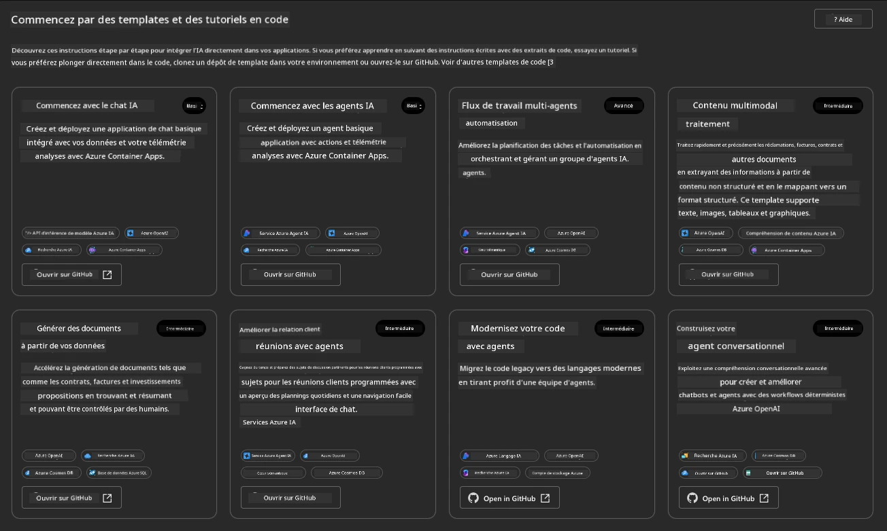


Les options **Basic** sont vos modèles de démarrage :

1. [ ] [Commencer avec AI Chat](https://github.com/Azure-Samples/get-started-with-ai-chat) qui déploie une application de chat basique _avec vos données_ sur Azure Container Apps. Utilisez-le pour explorer un scénario basique de chatbot IA.
1. [X] [Commencer avec AI Agents](https://github.com/Azure-Samples/get-started-with-ai-agents) qui déploie aussi un agent IA standard (avec les agents Foundry). Utilisez-le pour vous familiariser avec les solutions IA agentielles impliquant outils et modèles.

Ouvrez le second lien dans un nouvel onglet du navigateur (ou cliquez sur `Open in GitHub` pour la carte associée). Vous devriez voir le dépôt pour ce modèle AZD. Prenez une minute pour explorer le README. L'architecture de l'application ressemble à ceci :

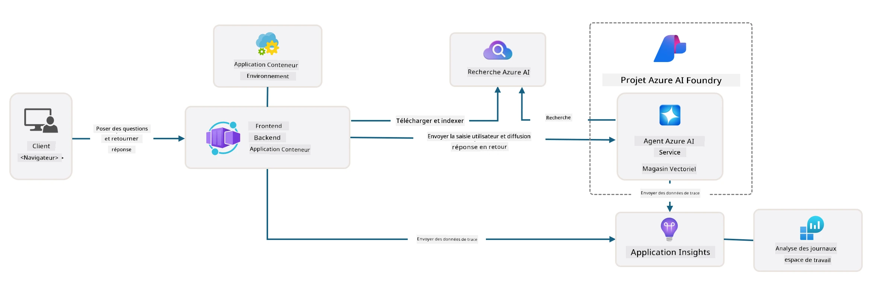

---

## 3. Activation du Modèle

Essayons de déployer ce modèle et de vérifier qu'il est valide. Nous allons suivre les directives de la section [Getting Started](https://github.com/Azure-Samples/get-started-with-ai-agents?tab=readme-ov-file#getting-started).

1. Cliquez sur [ce lien](https://github.com/codespaces/new/Azure-Samples/get-started-with-ai-agents) - confirmez l'action par défaut `Create codespace`
1. Cela ouvre un nouvel onglet de navigateur - attendez que la session GitHub Codespaces soit complètement chargée
1. Ouvrez le terminal VS Code dans Codespaces - tapez la commande suivante :

   ```bash title="" linenums="0"
   azd up
   ```

Complétez les étapes du workflow que cela va déclencher :

1. Vous serez invité à vous connecter à Azure - suivez les instructions pour vous authentifier
1. Entrez un nom d'environnement unique pour vous - par exemple, j'ai utilisé `nitya-mshack-azd`
1. Cela va créer un dossier `.azure/` - vous verrez un sous-dossier avec le nom de l'environnement
1. Vous serez invité à sélectionner un nom d'abonnement - sélectionnez le défaut
1. Vous serez invité pour un emplacement - utilisez `East US 2`

Maintenant, attendez la fin du provisionnement. **Cela prend 10-15 minutes**

1. Une fois terminé, votre console affichera un message SUCCESS comme celui-ci :
      ```bash title="" linenums="0"
      SUCCESS: Your up workflow to provision and deploy to Azure completed in 10 minutes 17 seconds.
      ```
1. Votre portail Azure aura maintenant un groupe de ressources provisionné avec ce nom d'environnement :

      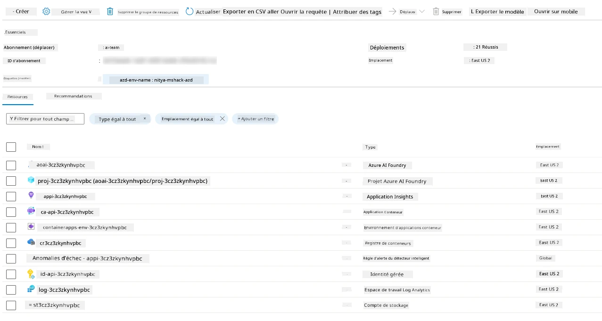

1. **Vous êtes maintenant prêt à valider l'infrastructure et l'application déployées**.

---

## 4. Validation du Modèle

1. Visitez la page Azure Portal [Groupes de ressources](https://portal.azure.com/#browse/resourcegroups) - connectez-vous si demandé
1. Cliquez sur le RG correspondant à votre nom d'environnement - vous voyez la page ci-dessus

      - cliquez sur la ressource Azure Container Apps
      - cliquez sur l'URL de l'application dans la section _Essentiels_ (en haut à droite)

1. Vous devriez voir une interface frontale hébergée de l'application comme ceci :

   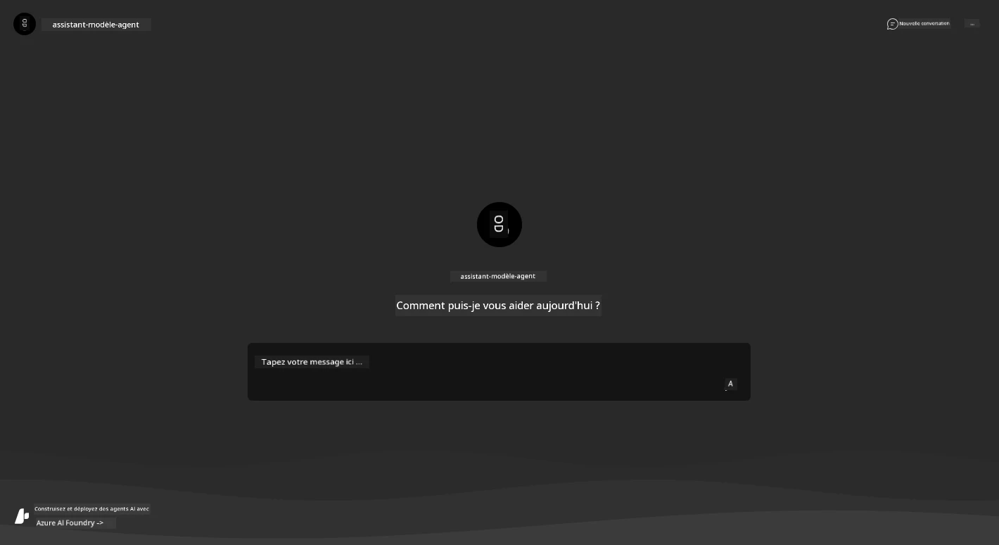

1. Essayez de poser quelques [questions d'exemple](https://github.com/Azure-Samples/get-started-with-ai-agents/blob/main/docs/sample_questions.md)

      1. Demandez : ```Quelle est la capitale de la France ?``` 
      1. Demandez : ```Quelle est la meilleure tente à moins de 200 $ pour deux personnes, et quelles sont ses caractéristiques ?```

1. Vous devriez recevoir des réponses similaires à ce qui est montré ci-dessous. _Mais comment cela fonctionne-t-il ?_ 

      

---

## 5. Validation de l'Agent

L'application Azure Container App déploie un endpoint qui se connecte à l'agent IA provisionné dans le projet Microsoft Foundry pour ce modèle. Voyons ce que cela signifie.

1. Revenez à la page _Présentation_ du portail Azure pour votre groupe de ressources

1. Cliquez sur la ressource `Microsoft Foundry` dans cette liste

1. Vous devriez voir ceci. Cliquez sur le bouton `Go to Microsoft Foundry Portal`. 
   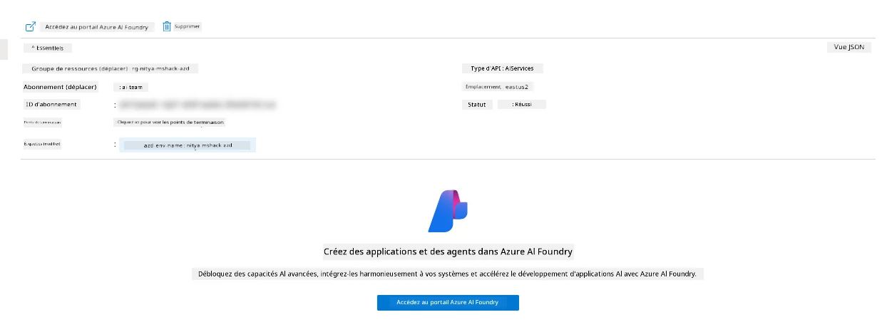

1. Vous devriez voir la page du projet Foundry pour votre application IA
   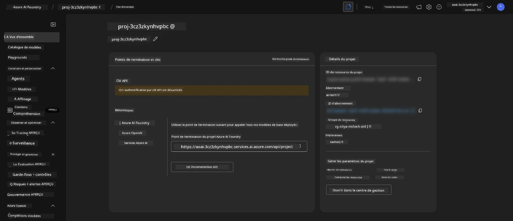

1. Cliquez sur `Agents` - vous voyez l'agent par défaut provisionné dans votre projet
   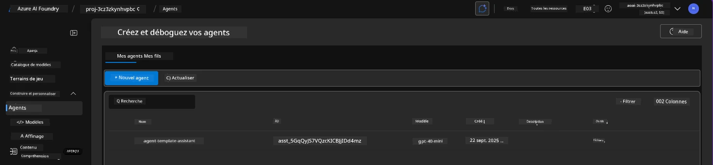

1. Sélectionnez-le - et vous voyez les détails de l’agent. Notez ce qui suit :

      - L'agent utilise toujours la recherche de fichiers par défaut
      - Le champ `Knowledge` indique qu'il a 32 fichiers téléchargés (pour la recherche de fichiers)
      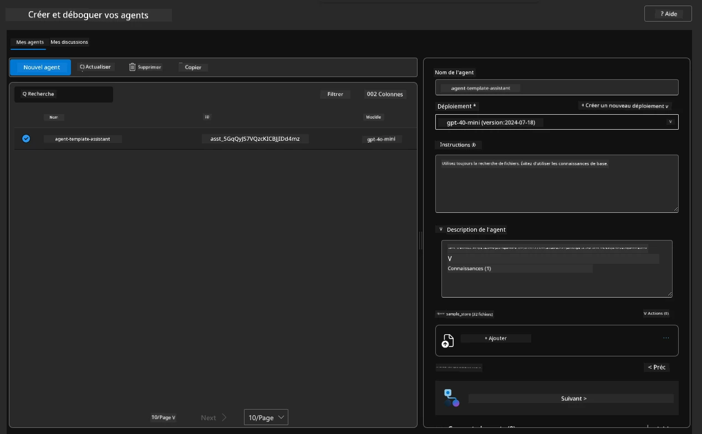

1. Cherchez l'option `Data+indexes` dans le menu de gauche et cliquez pour les détails.

      - Vous devriez voir les 32 fichiers de données téléchargés pour la connaissance.
      - Ceux-ci correspondent aux 12 fichiers clients et 20 fichiers produits sous `src/files`
      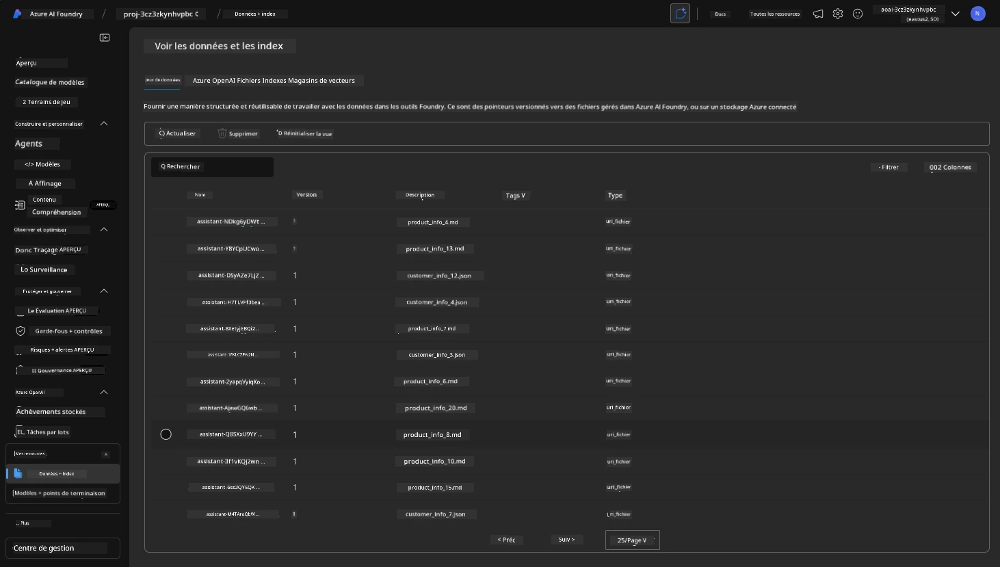

**Vous avez validé le fonctionnement de l'agent !**

1. Les réponses de l'agent sont fondées sur la connaissance contenue dans ces fichiers. 
1. Vous pouvez maintenant poser des questions liées à ces données et obtenir des réponses fondées.
1. Par exemple : `customer_info_10.json` décrit les 3 achats effectués par "Amanda Perez"

Revenez à l'onglet navigateur avec le endpoint Container App et demandez : `Quels produits Amanda Perez possède-t-elle ?`. Vous devriez voir quelque chose comme ceci :

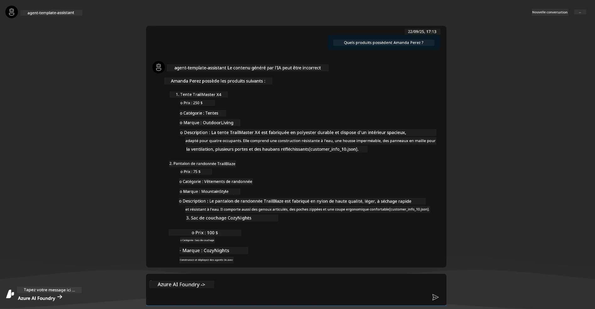

---

## 6. Terrain de Jeu des Agents

Construisons un peu plus d'intuition sur les capacités de Microsoft Foundry, en testant l'agent dans le terrain de jeu Agents Playground.

1. Revenez à la page `Agents` dans Microsoft Foundry - sélectionnez l'agent par défaut
1. Cliquez sur l'option `Try in Playground` - vous devriez obtenir une interface Playground comme celle-ci
1. Posez la même question : `Quels produits Amanda Perez possède-t-elle ?`

    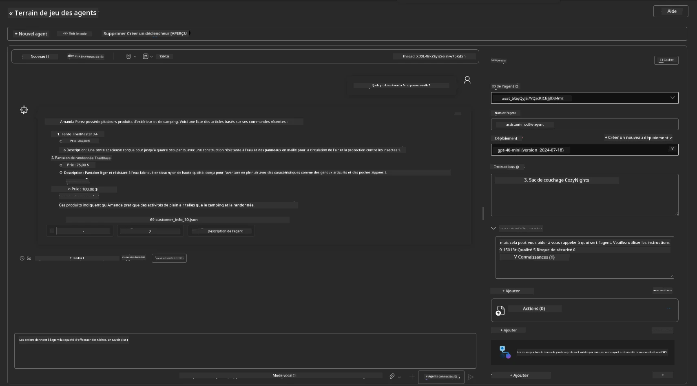

Vous obtenez la même réponse (ou similaire) - mais vous obtenez également des informations supplémentaires que vous pouvez utiliser pour évaluer la qualité, le coût et la performance de votre application agentielle. Par exemple :

1. Notez que la réponse cite les fichiers de données utilisés pour "fonder" la réponse
1. Survolez une de ces étiquettes de fichier - les données correspondent-elles à votre requête et à la réponse affichée ?

Vous voyez aussi une ligne de _statistiques_ sous la réponse.

1. Survolez une métrique - par ex. Sécurité. Vous voyez quelque chose comme cela
1. L'évaluation correspond-elle à votre intuition du niveau de sécurité de la réponse ?

      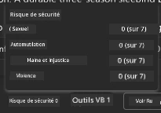

---

## 7. Observabilité Intégrée

L'observabilité consiste à instrumenter votre application pour générer des données qui peuvent être utilisées pour comprendre, déboguer et optimiser ses opérations. Pour vous en faire une idée :

1. Cliquez sur le bouton `View Run Info` - vous devriez voir cette vue. Il s'agit d'un exemple de [tracing d'agent](https://learn.microsoft.com/en-us/azure/ai-foundry/how-to/develop/trace-agents-sdk#view-trace-results-in-the-azure-ai-foundry-agents-playground) en action. _Vous pouvez aussi accéder à cette vue en cliquant sur Thread Logs dans le menu principal_.

   - Prenez connaissance des étapes d'exécution et des outils activés par l'agent
   - Comprenez le nombre total de tokens (par rapport à l'utilisation des tokens de sortie) pour la réponse
   - Comprenez la latence et où le temps est passé lors de l'exécution

      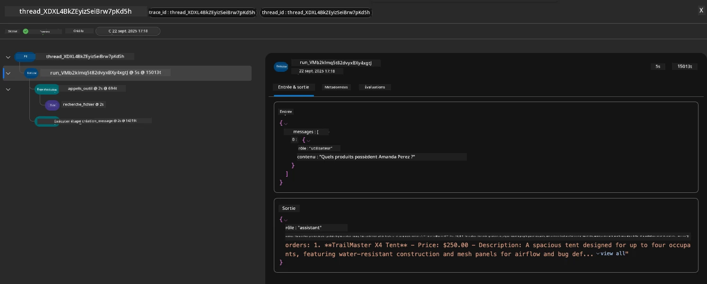

1. Cliquez sur l'onglet `Metadata` pour voir des attributs supplémentaires sur l'exécution, qui peuvent fournir un contexte utile pour déboguer les problèmes ultérieurement.   

      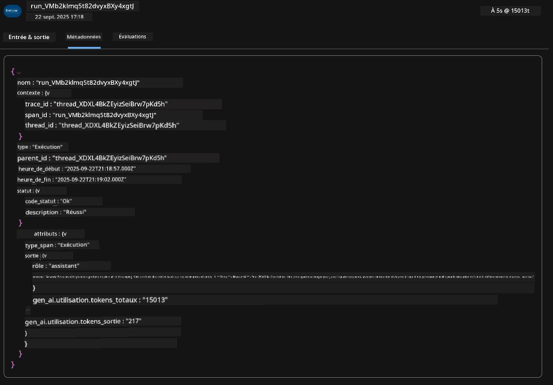


1. Cliquez sur l'onglet `Evaluations` pour voir les auto-évaluations faites sur la réponse de l'agent. Celles-ci incluent des évaluations de sécurité (par ex. automutilation) et des évaluations spécifiques à l'agent (par ex. résolution d’intention, respect de la tâche).

      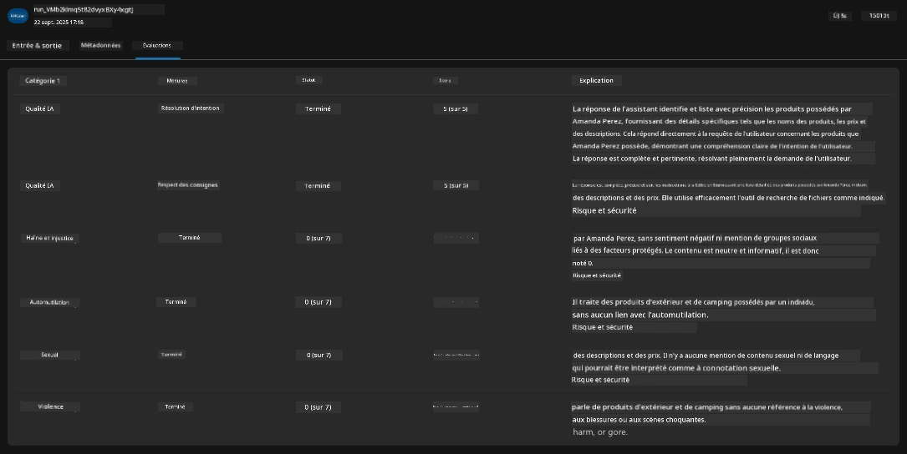

1. Enfin, cliquez sur l'onglet `Monitoring` dans le menu latéral.

      - Sélectionnez l'onglet `Resource usage` dans la page affichée - et visualisez les métriques.
      - Suivez l'utilisation de l'application en termes de coûts (tokens) et de charge (requêtes).
      - Suivez la latence de l'application jusqu'au premier octet (traitement d'entrée) et au dernier octet (sortie).

      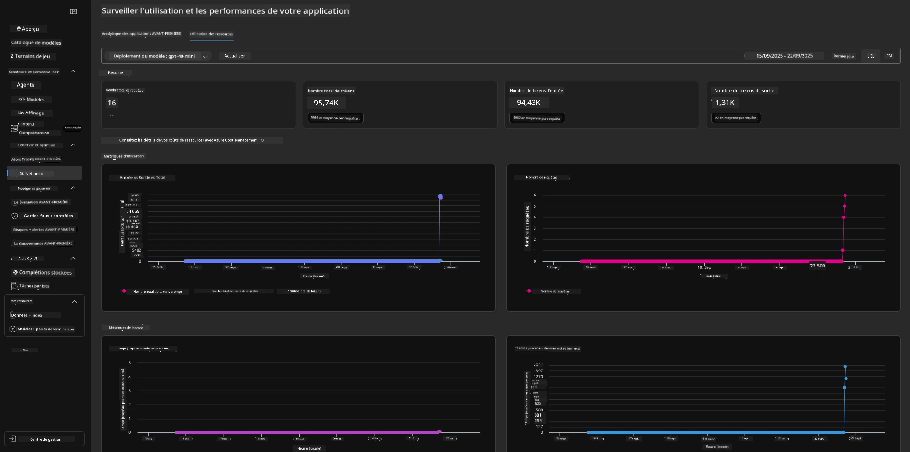

---

## 8. Variables d'Environnement

Jusqu'à présent, nous avons parcouru le déploiement dans le navigateur - et validé que notre infrastructure est provisionnée et l'application opérationnelle. Mais pour travailler avec le code de l'application _en premier_, nous devons configurer notre environnement de développement local avec les variables pertinentes requises pour travailler avec ces ressources. Utiliser `azd` facilite cela.

1. L'Azure Developer CLI [utilise des variables d'environnement](https://learn.microsoft.com/en-us/azure/developer/azure-developer-cli/manage-environment-variables?tabs=bash) pour stocker et gérer les paramètres de configuration des déploiements applicatifs.

1. Les variables d'environnement sont stockées dans `.azure/<env-name>/.env` - ce qui les limite à l'environnement `env-name` utilisé lors du déploiement et vous aide à isoler les environnements entre différentes cibles de déploiement dans le même dépôt.

1. Les variables d'environnement sont automatiquement chargées par la commande `azd` chaque fois qu'elle exécute une commande spécifique (par exemple, `azd up`). Notez que `azd` ne lit pas automatiquement les variables d'environnement _au niveau OS_ (par ex. définies dans le shell) - utilisez plutôt `azd set env` et `azd get env` pour transférer des informations dans les scripts.


Essayons quelques commandes :

1. Obtenez toutes les variables d'environnement définies pour `azd` dans cet environnement :

      ```bash title="" linenums="0"
      azd env get-values
      ```
      
      Vous verrez quelque chose comme :

      ```bash title="" linenums="0"
      AZURE_AI_AGENT_DEPLOYMENT_NAME="gpt-4o-mini"
      AZURE_AI_AGENT_NAME="agent-template-assistant"
      AZURE_AI_EMBED_DEPLOYMENT_NAME="text-embedding-3-small"
      AZURE_AI_EMBED_DIMENSIONS=100
      ...
      ```

1. Obtenez une valeur spécifique - par exemple, je veux savoir si la valeur `AZURE_AI_AGENT_MODEL_NAME` est définie

      ```bash title="" linenums="0"
      azd env get-value AZURE_AI_AGENT_MODEL_NAME 
      ```
      
      Vous voyez quelque chose comme ceci - elle n'était pas définie par défaut !

      ```bash title="" linenums="0"
      ERROR: key 'AZURE_AI_AGENT_MODEL_NAME' not found in the environment values
      ```

1. Définissez une nouvelle variable d'environnement pour `azd`. Ici, nous mettons à jour le nom du modèle de l'agent. _Note : toutes les modifications effectuées seront immédiatement reflétées dans le fichier `.azure/<env-name>/.env`.

      ```bash title="" linenums="0"
      azd env set AZURE_AI_AGENT_MODEL_NAME gpt-4.1
      azd env set AZURE_AI_AGENT_MODEL_VERSION 2025-04-14
      azd env set AZURE_AI_AGENT_DEPLOYMENT_CAPACITY 150
      ```

      Maintenant, nous devrions trouver la valeur définie :

      ```bash title="" linenums="0"
      azd env get-value AZURE_AI_AGENT_MODEL_NAME 
      ```

1. Remarquez que certaines ressources sont persistantes (par ex. les déploiements de modèles) et nécessitent plus qu’un simple `azd up` pour forcer un redéploiement. Essayons de démanteler le déploiement initial et de redéployer avec les variables d’environnement modifiées.

1. **Rafraîchir** Si vous aviez précédemment déployé de l'infrastructure avec un modèle azd, vous pouvez _rafraîchir_ l'état de vos variables d'environnement locales en fonction de l'état actuel de votre déploiement Azure avec cette commande :

      ```bash title="" linenums="0"
      azd env refresh
      ```

      C’est une manière puissante de _synchroniser_ les variables d’environnement entre deux environnements de développement locaux ou plus (par exemple, une équipe avec plusieurs développeurs) - permettant à l’infrastructure déployée de servir de vérité de référence pour l’état des variables d’env. Les membres de l’équipe peuvent simplement _actualiser_ les variables pour se resynchroniser.

---

## 9. Félicitations 🏆

Vous venez de terminer un flux de travail complet où vous avez :

- [X] Sélectionné le modèle AZD que vous souhaitez utiliser  
- [X] Lancé le modèle avec GitHub Codespaces  
- [X] Déployé le modèle et vérifié qu’il fonctionne

---

<!-- CO-OP TRANSLATOR DISCLAIMER START -->
**Avertissement** :  
Ce document a été traduit à l’aide du service de traduction automatique [Co-op Translator](https://github.com/Azure/co-op-translator). Bien que nous nous efforçons d’assurer l’exactitude, veuillez noter que les traductions automatisées peuvent contenir des erreurs ou des inexactitudes. Le document original dans sa langue d’origine doit être considéré comme la source faisant foi. Pour les informations critiques, une traduction professionnelle réalisée par un humain est recommandée. Nous déclinons toute responsabilité en cas de malentendus ou d’interprétations erronées résultant de l’utilisation de cette traduction.
<!-- CO-OP TRANSLATOR DISCLAIMER END -->