<!--
CO_OP_TRANSLATOR_METADATA:
{
  "original_hash": "7816c6ec50c694c331e7c6092371be4d",
  "translation_date": "2025-09-24T09:17:07+00:00",
  "source_file": "workshop/docs/instructions/2-Validate-AI-Template.md",
  "language_code": "fr"
}
-->
# 2. Valider un modèle

!!! tip "À LA FIN DE CE MODULE, VOUS SEREZ EN MESURE DE"

    - [ ] Analyser l'architecture de solution IA
    - [ ] Comprendre le workflow de déploiement AZD
    - [ ] Utiliser GitHub Copilot pour obtenir de l'aide sur l'utilisation d'AZD
    - [ ] **Lab 2 :** Déployer et valider le modèle d'agents IA

---

## 1. Introduction

Le [CLI Azure Developer](https://learn.microsoft.com/en-us/azure/developer/azure-developer-cli/) ou `azd` est un outil en ligne de commande open-source qui simplifie le workflow des développeurs lors de la création et du déploiement d'applications sur Azure.

Les [modèles AZD](https://learn.microsoft.com/azure/developer/azure-developer-cli/azd-templates) sont des dépôts standardisés qui incluent du code d'application exemple, des ressources _infrastructure as code_, et des fichiers de configuration `azd` pour une architecture de solution cohérente. La mise en place de l'infrastructure devient aussi simple qu'une commande `azd provision` - tandis que l'utilisation de `azd up` permet de provisionner l'infrastructure **et** de déployer votre application en une seule étape !

Ainsi, démarrer le processus de développement de votre application peut être aussi simple que de trouver le bon _modèle de démarrage AZD_ qui correspond le mieux à vos besoins en matière d'application et d'infrastructure - puis de personnaliser le dépôt pour répondre à vos exigences spécifiques.

Avant de commencer, assurez-vous d'avoir installé le CLI Azure Developer.

1. Ouvrez un terminal VS Code et tapez cette commande :

      ```bash title="" linenums="0"
      azd version
      ```

1. Vous devriez voir quelque chose comme ceci !

      ```bash title="" linenums="0"
      azd version 1.19.0 (commit b3d68cea969b2bfbaa7b7fa289424428edb93e97)
      ```

**Vous êtes maintenant prêt à sélectionner et déployer un modèle avec azd**

---

## 2. Sélection du modèle

La plateforme Azure AI Foundry propose un [ensemble de modèles AZD recommandés](https://learn.microsoft.com/en-us/azure/ai-foundry/how-to/develop/ai-template-get-started) qui couvrent des scénarios de solution populaires comme l'_automatisation des workflows multi-agents_ et le _traitement de contenu multimodal_. Vous pouvez également découvrir ces modèles en visitant le portail Azure AI Foundry.

1. Visitez [https://ai.azure.com/templates](https://ai.azure.com/templates)
1. Connectez-vous au portail Azure AI Foundry lorsque cela vous est demandé - vous verrez quelque chose comme ceci.

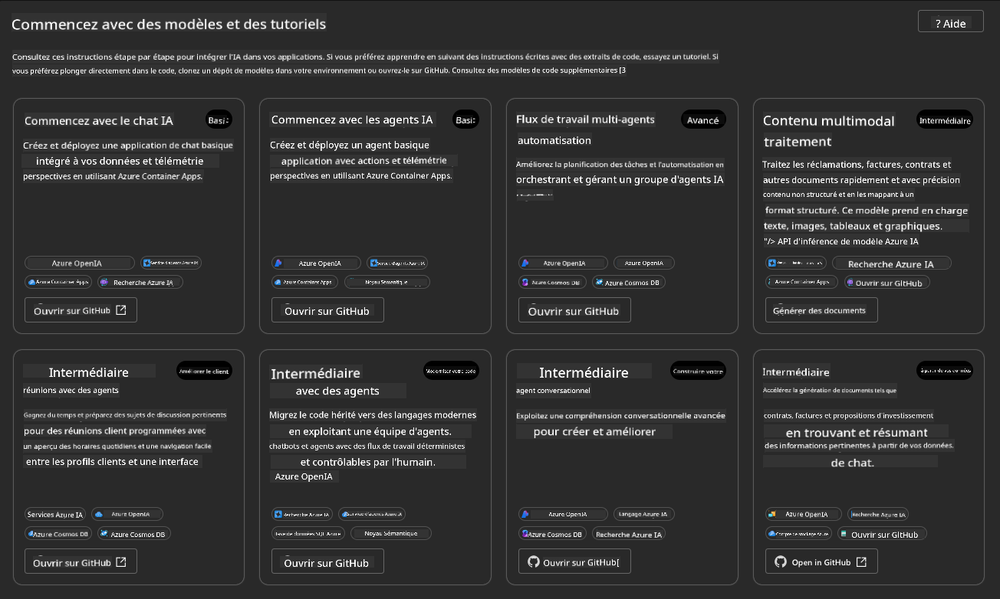

Les options **Basic** sont vos modèles de démarrage :

1. [ ] [Get Started with AI Chat](https://github.com/Azure-Samples/get-started-with-ai-chat) qui déploie une application de chat basique _avec vos données_ sur Azure Container Apps. Utilisez-le pour explorer un scénario de chatbot IA basique.
1. [X] [Get Started with AI Agents](https://github.com/Azure-Samples/get-started-with-ai-agents) qui déploie également un agent IA standard (avec le service Azure AI Agent). Utilisez-le pour vous familiariser avec les solutions IA basées sur des agents impliquant des outils et des modèles.

Visitez le deuxième lien dans un nouvel onglet de navigateur (ou cliquez sur `Open in GitHub` pour la carte correspondante). Vous devriez voir le dépôt pour ce modèle AZD. Prenez une minute pour explorer le README. L'architecture de l'application ressemble à ceci :

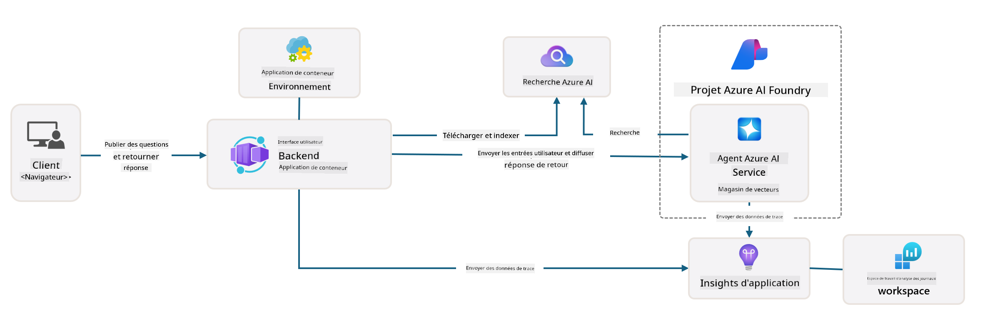

---

## 3. Activation du modèle

Essayons de déployer ce modèle et de nous assurer qu'il est valide. Nous suivrons les directives de la section [Getting Started](https://github.com/Azure-Samples/get-started-with-ai-agents?tab=readme-ov-file#getting-started).

1. Cliquez sur [ce lien](https://github.com/codespaces/new/Azure-Samples/get-started-with-ai-agents) - confirmez l'action par défaut pour `Create codespace`
1. Cela ouvre un nouvel onglet de navigateur - attendez que la session GitHub Codespaces soit complètement chargée
1. Ouvrez le terminal VS Code dans Codespaces - tapez la commande suivante :

   ```bash title="" linenums="0"
   azd up
   ```

Complétez les étapes du workflow qui seront déclenchées :

1. Vous serez invité à vous connecter à Azure - suivez les instructions pour vous authentifier
1. Entrez un nom d'environnement unique - par exemple, j'ai utilisé `nitya-mshack-azd`
1. Cela créera un dossier `.azure/` - vous verrez un sous-dossier avec le nom de l'environnement
1. Vous serez invité à sélectionner un nom d'abonnement - sélectionnez celui par défaut
1. Vous serez invité à choisir un emplacement - utilisez `East US 2`

Maintenant, attendez que le provisionnement soit terminé. **Cela prend 10-15 minutes**

1. Une fois terminé, votre console affichera un message de SUCCÈS comme celui-ci :
      ```bash title="" linenums="0"
      SUCCESS: Your up workflow to provision and deploy to Azure completed in 10 minutes 17 seconds.
      ```
1. Votre portail Azure aura maintenant un groupe de ressources provisionné avec ce nom d'environnement :

      

1. **Vous êtes maintenant prêt à valider l'infrastructure et l'application déployées**.

---

## 4. Validation du modèle

1. Visitez la page [Groupes de ressources](https://portal.azure.com/#browse/resourcegroups) du portail Azure - connectez-vous si nécessaire
1. Cliquez sur le groupe de ressources correspondant à votre nom d'environnement - vous verrez la page ci-dessus

      - cliquez sur la ressource Azure Container Apps
      - cliquez sur l'URL de l'application dans la section _Essentials_ (en haut à droite)

1. Vous devriez voir une interface utilisateur frontale hébergée comme celle-ci :

   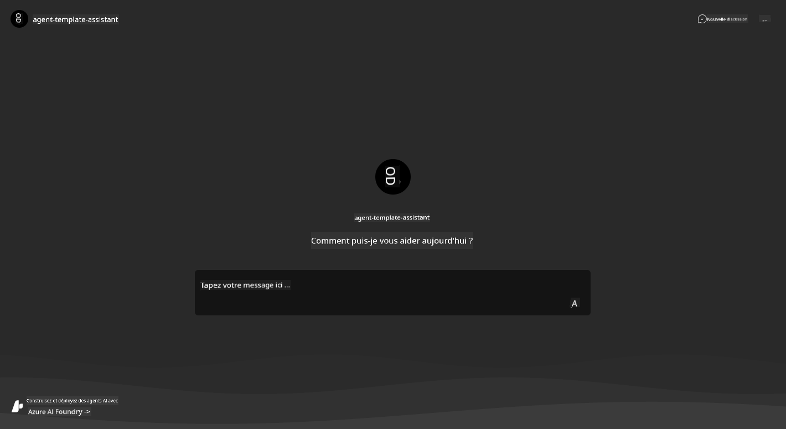

1. Essayez de poser quelques [questions d'exemple](https://github.com/Azure-Samples/get-started-with-ai-agents/blob/main/docs/sample_questions.md)

      1. Demandez : ```Quelle est la capitale de la France ?``` 
      1. Demandez : ```Quel est le meilleur tente à moins de 200 $ pour deux personnes, et quelles sont ses caractéristiques ?```

1. Vous devriez obtenir des réponses similaires à celles montrées ci-dessous. _Mais comment cela fonctionne-t-il ?_

      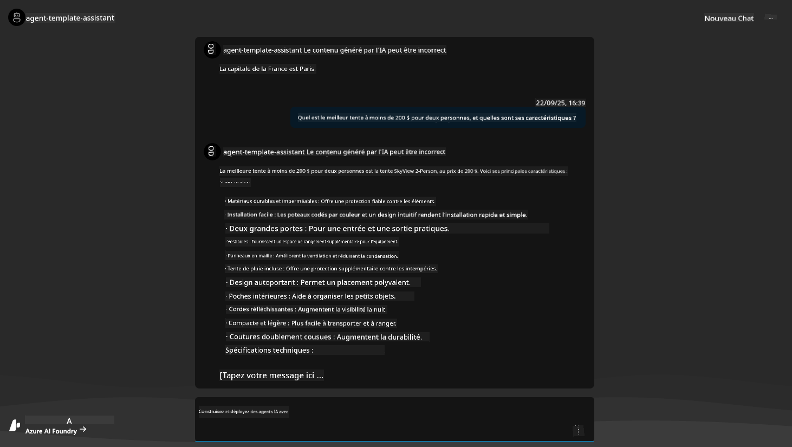

---

## 5. Validation de l'agent

L'application Azure Container Apps déploie un point de terminaison qui se connecte à l'agent IA provisionné dans le projet Azure AI Foundry pour ce modèle. Regardons ce que cela signifie.

1. Retournez à la page _Overview_ du portail Azure pour votre groupe de ressources

1. Cliquez sur la ressource `Azure AI Foundry` dans cette liste

1. Vous devriez voir ceci. Cliquez sur le bouton `Go to Azure AI Foundry Portal`. 
   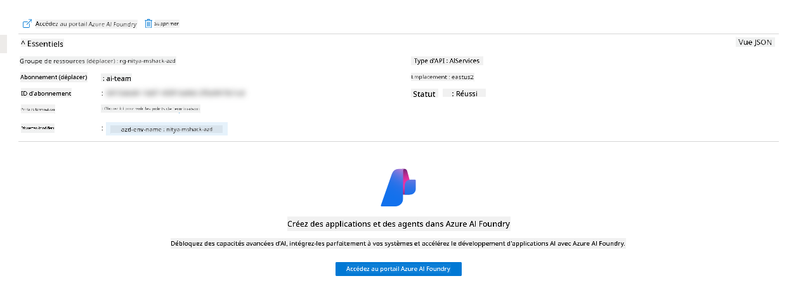

1. Vous devriez voir la page du projet Foundry pour votre application IA
   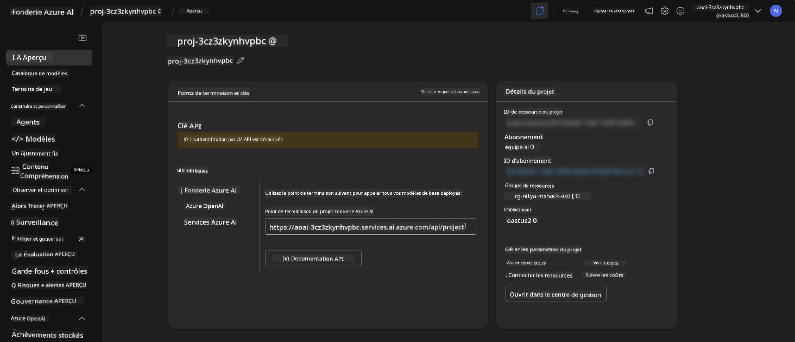

1. Cliquez sur `Agents` - vous voyez l'agent par défaut provisionné dans votre projet
   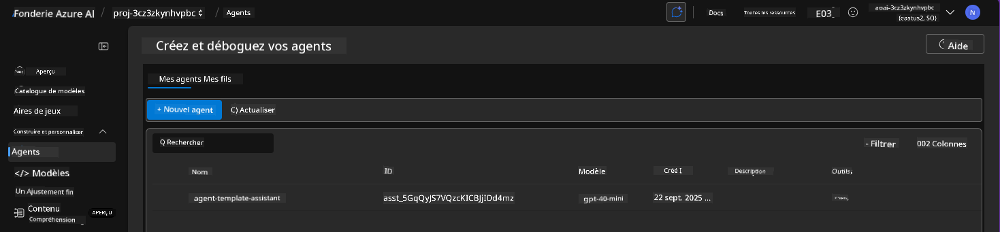

1. Sélectionnez-le - et vous voyez les détails de l'agent. Notez les points suivants :

      - L'agent utilise la recherche de fichiers par défaut (toujours)
      - Les `Knowledge` de l'agent indiquent qu'il a 32 fichiers téléchargés (pour la recherche de fichiers)
      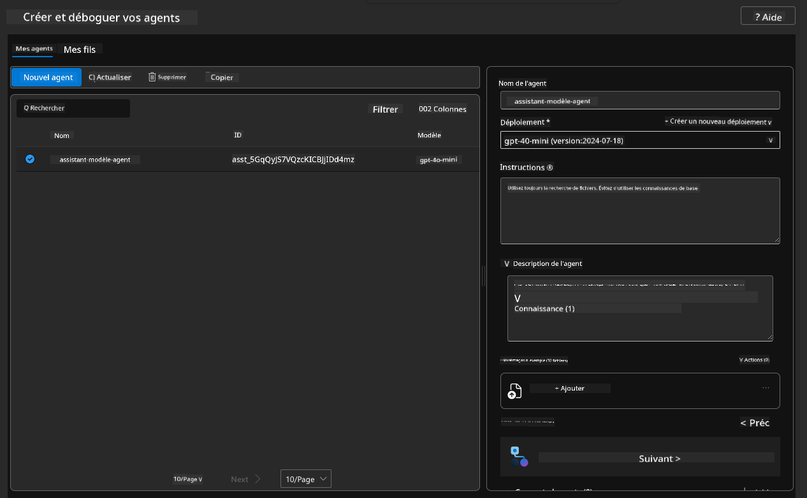

1. Cherchez l'option `Data+indexes` dans le menu de gauche et cliquez pour voir les détails. 

      - Vous devriez voir les 32 fichiers de données téléchargés pour les connaissances.
      - Ceux-ci correspondent aux 12 fichiers clients et 20 fichiers produits sous `src/files` 
      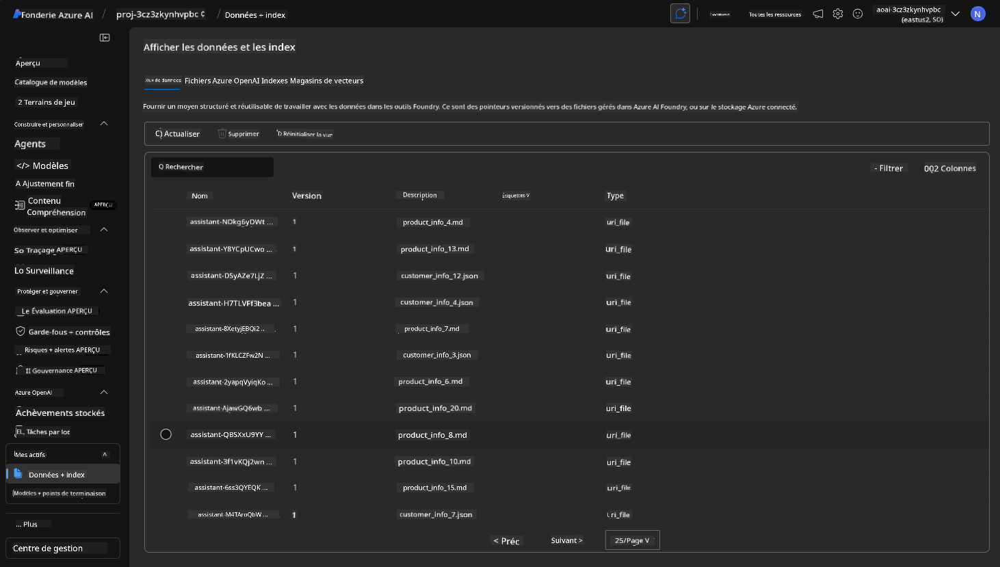

**Vous avez validé le fonctionnement de l'agent !** 

1. Les réponses de l'agent sont basées sur les connaissances contenues dans ces fichiers. 
1. Vous pouvez maintenant poser des questions liées à ces données et obtenir des réponses basées sur ces informations.
1. Exemple : `customer_info_10.json` décrit les 3 achats effectués par "Amanda Perez"

Revenez à l'onglet du navigateur avec le point de terminaison de l'application Container App et demandez : `Quels produits Amanda Perez possède-t-elle ?`. Vous devriez voir quelque chose comme ceci :

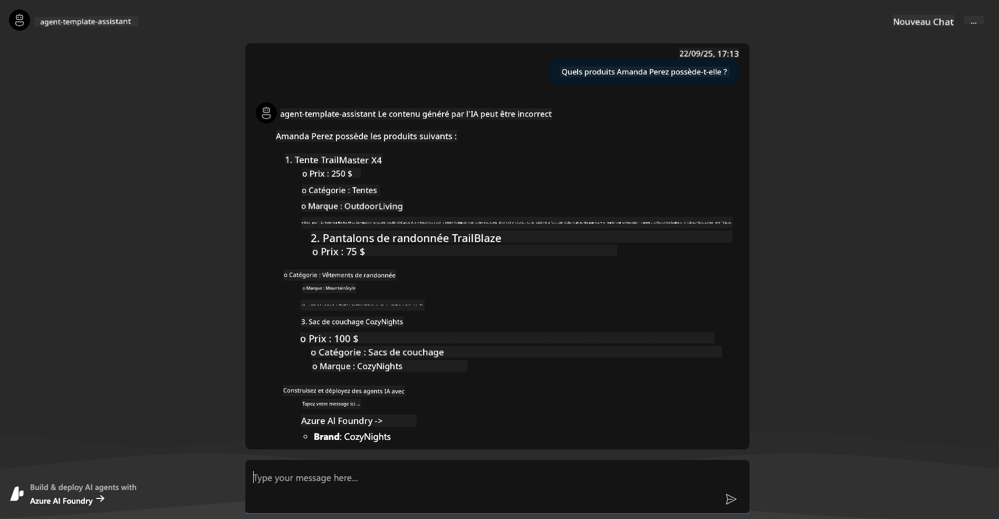

---

## 6. Terrain de jeu de l'agent

Explorons un peu plus les capacités d'Azure AI Foundry en testant l'agent dans le terrain de jeu des agents. 

1. Retournez à la page `Agents` dans Azure AI Foundry - sélectionnez l'agent par défaut
1. Cliquez sur l'option `Try in Playground` - vous devriez obtenir une interface de terrain de jeu comme celle-ci
1. Posez la même question : `Quels produits Amanda Perez possède-t-elle ?`

    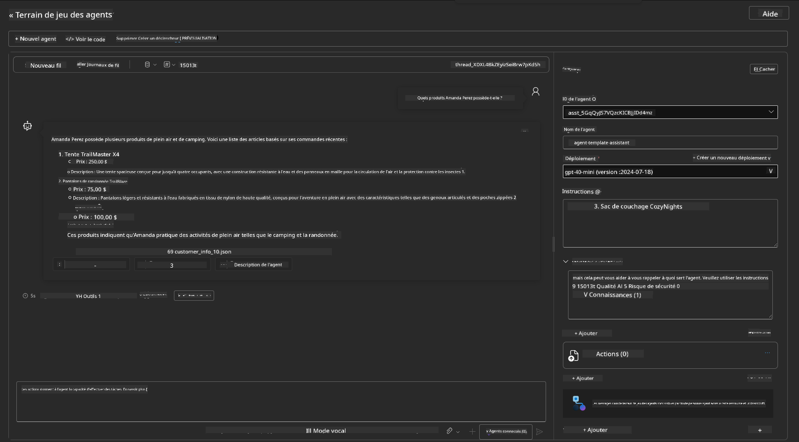

Vous obtenez la même réponse (ou une réponse similaire) - mais vous obtenez également des informations supplémentaires que vous pouvez utiliser pour comprendre la qualité, le coût et les performances de votre application basée sur des agents. Par exemple :

1. Notez que la réponse cite les fichiers de données utilisés pour "ancrer" la réponse
1. Survolez l'un de ces fichiers - les données correspondent-elles à votre requête et à la réponse affichée ?

Vous voyez également une ligne de _statistiques_ sous la réponse. 

1. Survolez une métrique - par exemple, la sécurité. Vous voyez quelque chose comme ceci
1. L'évaluation correspond-elle à votre intuition concernant le niveau de sécurité de la réponse ?

      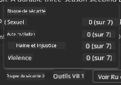

---x

## 7. Observabilité intégrée

L'observabilité consiste à instrumenter votre application pour générer des données qui peuvent être utilisées pour comprendre, déboguer et optimiser ses opérations. Pour en avoir une idée :

1. Cliquez sur le bouton `View Run Info` - vous devriez voir cette vue. C'est un exemple de [tracé d'agent](https://learn.microsoft.com/en-us/azure/ai-foundry/how-to/develop/trace-agents-sdk#view-trace-results-in-the-azure-ai-foundry-agents-playground) en action. _Vous pouvez également obtenir cette vue en cliquant sur Thread Logs dans le menu principal_.

   - Obtenez une idée des étapes d'exécution et des outils utilisés par l'agent
   - Comprenez le nombre total de jetons (par rapport à l'utilisation des jetons de sortie) pour la réponse
   - Comprenez la latence et où le temps est passé dans l'exécution

      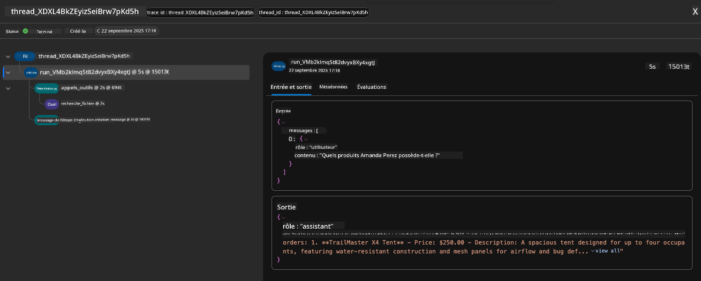

1. Cliquez sur l'onglet `Metadata` pour voir des attributs supplémentaires pour l'exécution, qui peuvent fournir un contexte utile pour déboguer des problèmes plus tard.   

      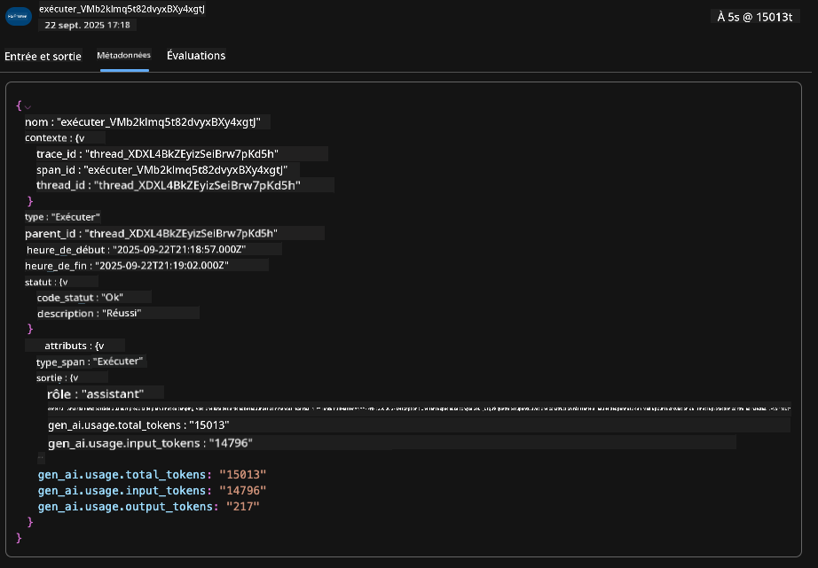

1. Cliquez sur l'onglet `Evaluations` pour voir les auto-évaluations effectuées sur la réponse de l'agent. Celles-ci incluent des évaluations de sécurité (par exemple, auto-dommage) et des évaluations spécifiques à l'agent (par exemple, résolution d'intention, respect des tâches).

      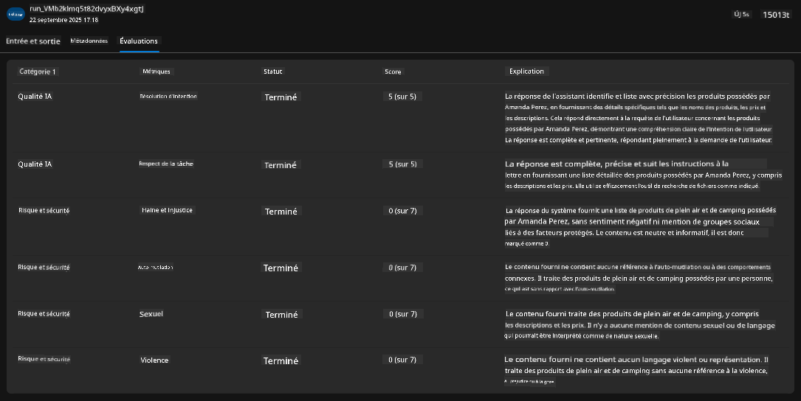

1. Enfin, cliquez sur l'onglet `Monitoring` dans le menu latéral.

      - Sélectionnez l'onglet `Resource usage` dans la page affichée - et consultez les métriques.
      - Suivez l'utilisation de l'application en termes de coûts (jetons) et de charge (requêtes).
      - Suivez la latence de l'application jusqu'au premier octet (traitement d'entrée) et au dernier octet (sortie).

      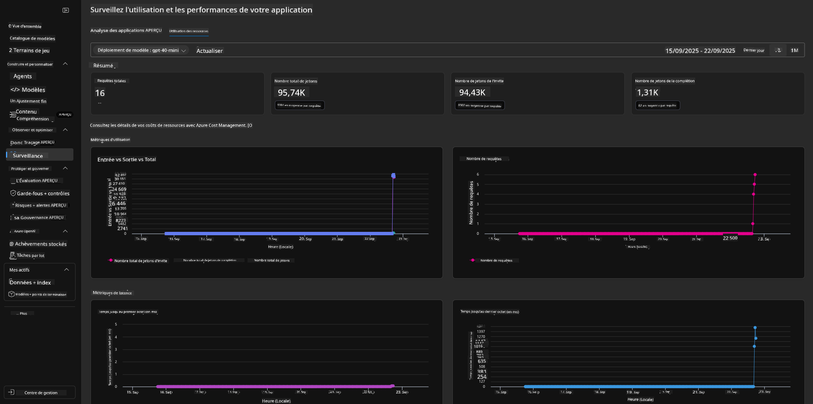

---

## 8. Variables d'environnement

Jusqu'à présent, nous avons parcouru le déploiement dans le navigateur - et validé que notre infrastructure est provisionnée et que l'application est opérationnelle. Mais pour travailler avec l'application _code-first_, nous devons configurer notre environnement de développement local avec les variables pertinentes nécessaires pour travailler avec ces ressources. L'utilisation de `azd` simplifie cette tâche.

1. Le CLI Azure Developer [utilise des variables d'environnement](https://learn.microsoft.com/en-us/azure/developer/azure-developer-cli/manage-environment-variables?tabs=bash) pour stocker et gérer les paramètres de configuration des déploiements d'application.

1. Les variables d'environnement sont stockées dans `.azure/<env-name>/.env` - cela les limite à l'environnement `env-name` utilisé lors du déploiement et vous aide à isoler les environnements entre différentes cibles de déploiement dans le même dépôt.

1. Les variables d'environnement sont automatiquement chargées par la commande `azd` chaque fois qu'elle exécute une commande spécifique (par exemple, `azd up`). Notez que `azd` ne lit pas automatiquement les variables d'environnement au niveau du système d'exploitation (par exemple, définies dans le shell) - utilisez plutôt `azd set env` et `azd get env` pour transférer des informations dans des scripts.

Essayons quelques commandes :

1. Obtenez toutes les variables d'environnement définies pour `azd` dans cet environnement :

      ```bash title="" linenums="0"
      azd env get-values
      ```
      
      Vous voyez quelque chose comme :

      ```bash title="" linenums="0"
      AZURE_AI_AGENT_DEPLOYMENT_NAME="gpt-4o-mini"
      AZURE_AI_AGENT_NAME="agent-template-assistant"
      AZURE_AI_EMBED_DEPLOYMENT_NAME="text-embedding-3-small"
      AZURE_AI_EMBED_DIMENSIONS=100
      ...
      ```

1. Obtenez une valeur spécifique - par exemple, je veux savoir si nous avons défini la valeur `AZURE_AI_AGENT_MODEL_NAME`

      ```bash title="" linenums="0"
      azd env get-value AZURE_AI_AGENT_MODEL_NAME 
      ```
      
      Vous voyez quelque chose comme ceci - elle n'a pas été définie par défaut !

      ```bash title="" linenums="0"
      ERROR: key 'AZURE_AI_AGENT_MODEL_NAME' not found in the environment values
      ```

1. Définissez une nouvelle variable d'environnement pour `azd`. Ici, nous mettons à jour le nom du modèle d'agent. _Note : tout changement effectué sera immédiatement reflété dans le fichier `.azure/<env-name>/.env`.

      ```bash title="" linenums="0"
      azd env set AZURE_AI_AGENT_MODEL_NAME gpt-4.1
      azd env set AZURE_AI_AGENT_MODEL_VERSION 2025-04-14
      azd env set AZURE_AI_AGENT_DEPLOYMENT_CAPACITY 150
      ```

      Maintenant, nous devrions trouver que la valeur est définie :

      ```bash title="" linenums="0"
      azd env get-value AZURE_AI_AGENT_MODEL_NAME 
      ```

1. Notez que certaines ressources sont persistantes (par exemple, les déploiements de modèles) et nécessiteront plus qu'un simple `azd up` pour forcer le redéploiement. Essayons de supprimer le déploiement initial et de le redéployer avec des variables d'environnement modifiées.

1. **Actualiser** Si vous avez précédemment déployé une infrastructure en utilisant un modèle azd - vous pouvez _actualiser_ l'état de vos variables d'environnement locales en fonction de l'état actuel de votre déploiement Azure en utilisant cette commande :
      ```bash title="" linenums="0"
      azd env refresh
      ```

      C'est une méthode puissante pour _synchroniser_ les variables d'environnement entre deux ou plusieurs environnements de développement locaux (par exemple, une équipe avec plusieurs développeurs) - permettant à l'infrastructure déployée de servir de référence pour l'état des variables d'environnement. Les membres de l'équipe n'ont qu'à _actualiser_ les variables pour se remettre en synchronisation.

---

## 9. Félicitations 🏆

Vous venez de terminer un workflow complet où vous avez :

- [X] Sélectionné le modèle AZD que vous souhaitez utiliser
- [X] Lancé le modèle avec GitHub Codespaces 
- [X] Déployé le modèle et validé son fonctionnement

---

