# 2. Valider un modèle

> Validé avec `azd 1.23.12` en mars 2026.

!!! tip "À LA FIN DE CE MODULE, VOUS SEREZ CAPABLE DE"

    - [ ] Analyser l'architecture de la solution IA
    - [ ] Comprendre le flux de déploiement AZD
    - [ ] Utiliser GitHub Copilot pour obtenir de l'aide sur l'utilisation d'AZD
    - [ ] **Lab 2 :** Déployer et valider le modèle AI Agents

---

## 1. Introduction

Le [Azure Developer CLI](https://learn.microsoft.com/en-us/azure/developer/azure-developer-cli/) ou `azd` est un outil en ligne de commande open source qui simplifie le flux de travail des développeurs lors de la création et du déploiement d'applications sur Azure.

Les [modèles AZD](https://learn.microsoft.com/azure/developer/azure-developer-cli/azd-templates) sont des dépôts standardisés incluant du code d'application d'exemple, des ressources d'_infrastructure en tant que code_, ainsi que des fichiers de configuration `azd` pour une architecture de solution cohérente. La mise en place de l'infrastructure devient aussi simple qu'une commande `azd provision` — tandis que l'utilisation de `azd up` vous permet de provisionner l'infrastructure **et** de déployer votre application en une seule fois !

En conséquence, démarrer votre processus de développement d'application peut être aussi simple que de trouver le bon _modèle de démarrage AZD_ qui correspond le mieux à vos besoins applicatifs et infrastructurels — puis de personnaliser le dépôt pour répondre aux exigences de votre scénario.

Avant de commencer, assurons-nous que vous avez installé Azure Developer CLI.

1. Ouvrez un terminal VS Code et tapez cette commande :

      ```bash title="" linenums="0"
      azd version
      ```

1. Vous devriez voir quelque chose comme ceci !

      ```bash title="" linenums="0"
      azd version 1.23.12 (commit <current-build>)
      ```

**Vous êtes maintenant prêt à sélectionner et déployer un modèle avec azd**

---

## 2. Sélection du modèle

La plateforme Microsoft Foundry propose un [ensemble de modèles AZD recommandés](https://learn.microsoft.com/en-us/azure/ai-foundry/how-to/develop/ai-template-get-started) qui couvrent des scénarios courants comme l'_automatisation de flux de travail multi-agents_ et le _traitement multimodal de contenu_. Vous pouvez aussi découvrir ces modèles en visitant le portail Microsoft Foundry.

1. Visitez [https://ai.azure.com/templates](https://ai.azure.com/templates)
1. Connectez-vous au portail Microsoft Foundry lorsque vous y êtes invité — vous verrez quelque chose comme ceci.

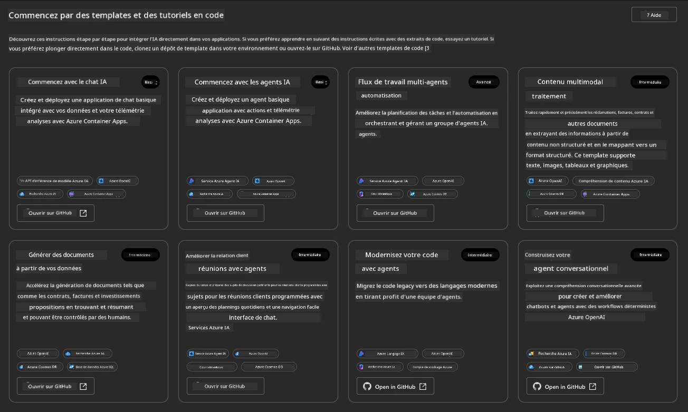

Les options **Basic** sont vos modèles de démarrage :

1. [ ] [Commencer avec AI Chat](https://github.com/Azure-Samples/get-started-with-ai-chat) qui déploie une application de chat basique _avec vos données_ sur Azure Container Apps. Utilisez-le pour explorer un scénario de chatbot IA de base.
1. [X] [Commencer avec AI Agents](https://github.com/Azure-Samples/get-started-with-ai-agents) qui déploie également un agent IA standard (avec les agents Foundry). Utilisez-le pour vous familiariser avec les solutions IA agentiques impliquant outils et modèles.

Visitez le second lien dans un nouvel onglet de navigateur (ou cliquez sur `Open in GitHub` pour la carte correspondante). Vous devriez voir le dépôt pour ce modèle AZD. Prenez une minute pour explorer le README. L'architecture de l'application ressemble à ceci :

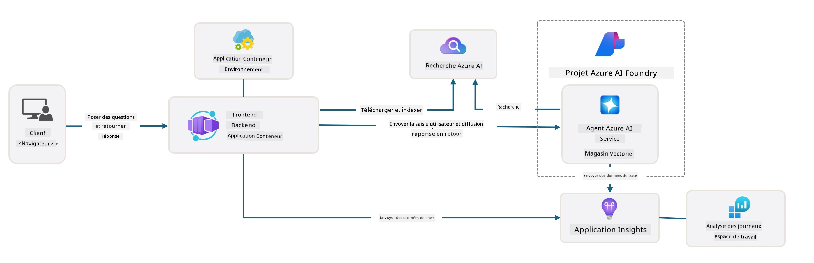

---

## 3. Activation du modèle

Essayons de déployer ce modèle et assurons-nous qu'il est valide. Nous allons suivre les consignes dans la section [Getting Started](https://github.com/Azure-Samples/get-started-with-ai-agents?tab=readme-ov-file#getting-started).

1. Choisissez un environnement de travail pour le dépôt du modèle :

      - **GitHub Codespaces** : Cliquez sur [ce lien](https://github.com/codespaces/new/Azure-Samples/get-started-with-ai-agents) et confirmez `Create codespace`
      - **Clone local ou conteneur de développement** : Clonez `Azure-Samples/get-started-with-ai-agents` et ouvrez-le dans VS Code

1. Attendez que le terminal VS Code soit prêt, puis tapez la commande suivante :

   ```bash title="" linenums="0"
   azd up
   ```

Complétez les étapes du flux de travail que cela déclenchera :

1. Vous serez invité à vous connecter à Azure - suivez les instructions pour vous authentifier
1. Saisissez un nom d'environnement unique pour vous - par exemple, j'ai utilisé `nitya-mshack-azd`
1. Cela créera un dossier `.azure/` — vous verrez un sous-dossier avec le nom de l’environnement
1. Vous serez invité à sélectionner un nom d'abonnement — sélectionnez la valeur par défaut
1. Vous serez invité à choisir une région — utilisez `East US 2`

Maintenant, attendez la fin du provisioning. **Cela prend 10-15 minutes**

1. Une fois terminé, votre console affichera un message de SUCCÈS comme ceci :
      ```bash title="" linenums="0"
      SUCCESS: Your up workflow to provision and deploy to Azure completed in 10 minutes 17 seconds.
      ```
1. Votre portail Azure aura maintenant un groupe de ressources provisionné avec ce nom d’environnement :

      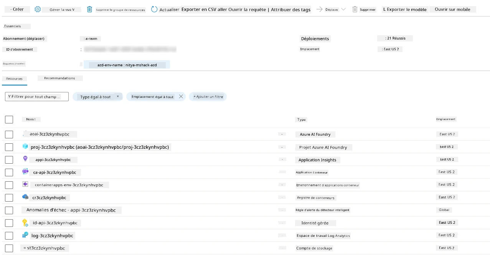

1. **Vous êtes maintenant prêt à valider l'infrastructure et l'application déployées**.

---

## 4. Validation du modèle

1. Visitez la page Azure Portal [Groupes de ressources](https://portal.azure.com/#browse/resourcegroups) — connectez-vous si nécessaire
1. Cliquez sur le groupe de ressources pour votre nom d’environnement — vous verrez la page ci-dessus

      - cliquez sur la ressource Azure Container Apps
      - cliquez sur l'URL de l'application dans la section _Essentiels_ (en haut à droite)

1. Vous devriez voir une interface frontale de l’application hébergée comme ceci :

   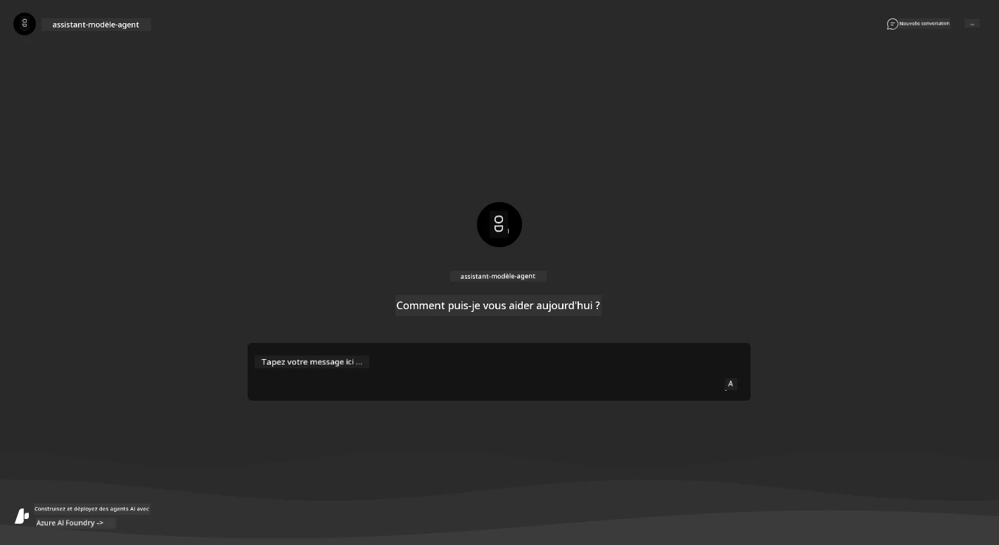

1. Essayez de poser quelques [questions d’exemple](https://github.com/Azure-Samples/get-started-with-ai-agents/blob/main/docs/sample_questions.md)

      1. Demandez : ```Quelle est la capitale de la France ?``` 
      1. Demandez : ```Quelle est la meilleure tente à moins de 200 $ pour deux personnes, et quelles caractéristiques propose-t-elle ?```

1. Vous devriez obtenir des réponses similaires à celles montrées ci-dessous. _Mais comment cela fonctionne-t-il ?_

      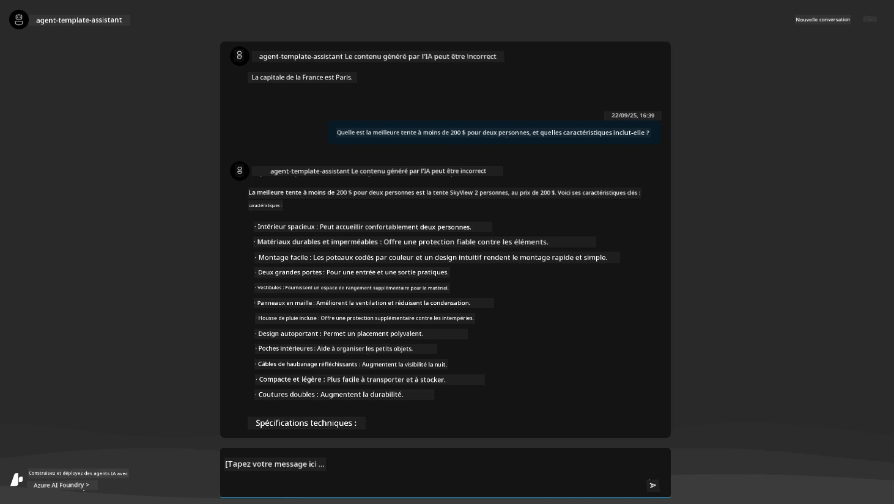

---

## 5. Validation de l’agent

L’application Azure Container App déploie un endpoint qui se connecte à l’agent IA provisionné dans le projet Microsoft Foundry pour ce modèle. Voyons ce que cela signifie.

1. Retournez à la page d’_aperçu_ du groupe de ressources dans Azure Portal

1. Cliquez sur la ressource `Microsoft Foundry` dans cette liste

1. Vous devriez voir ceci. Cliquez sur le bouton `Go to Microsoft Foundry Portal`. 
   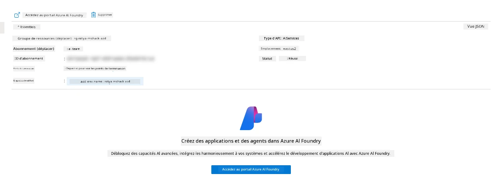

1. Vous verrez la page du projet Foundry pour votre application IA
   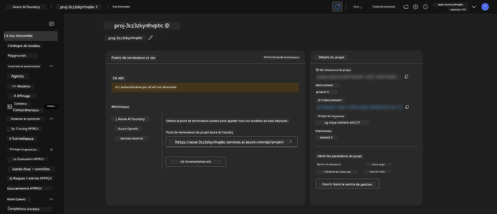

1. Cliquez sur `Agents` - vous verrez l’agent par défaut provisionné dans votre projet
   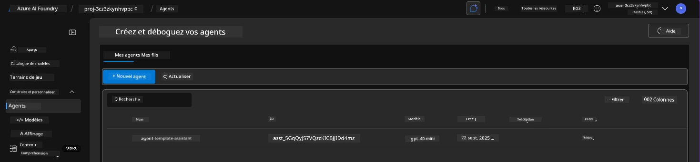

1. Sélectionnez-le — vous verrez les détails de l’agent. Notez ce qui suit :

      - L’agent utilise la recherche de fichiers par défaut (tout le temps)
      - La section `Knowledge` de l’agent indique qu’il y a 32 fichiers téléchargés (pour la recherche dans les fichiers)
      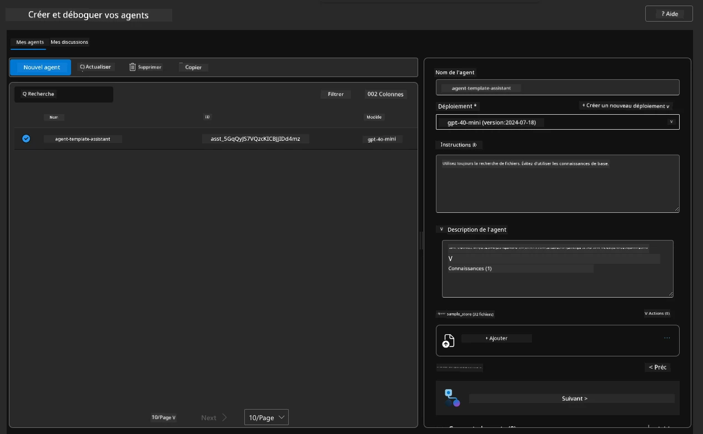

1. Cherchez l’option `Data+indexes` dans le menu gauche et cliquez pour voir les détails.

      - Vous devriez voir les 32 fichiers de données téléchargés pour la connaissance.
      - Cela correspond aux 12 fichiers clients et 20 fichiers produits dans `src/files`
      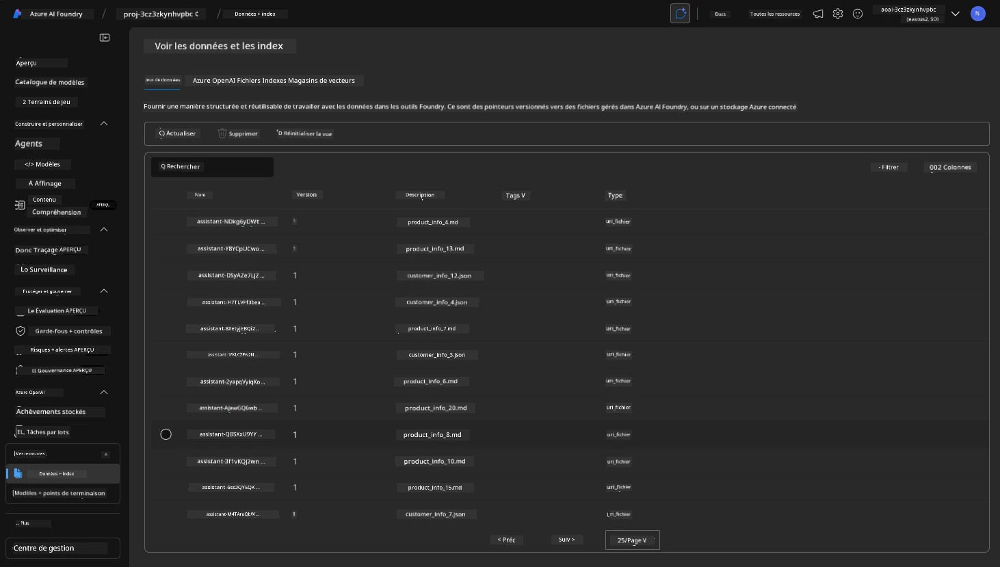

**Vous avez validé le fonctionnement de l’agent !**

1. Les réponses de l’agent sont basées sur la connaissance contenue dans ces fichiers.
1. Vous pouvez maintenant poser des questions relatives à ces données et obtenir des réponses fondées.
1. Exemple : `customer_info_10.json` décrit les 3 achats faits par "Amanda Perez"

Retournez à l’onglet du navigateur avec le point de terminaison Container App et demandez : `Quels produits possède Amanda Perez ?`. Vous devriez voir quelque chose comme ceci :

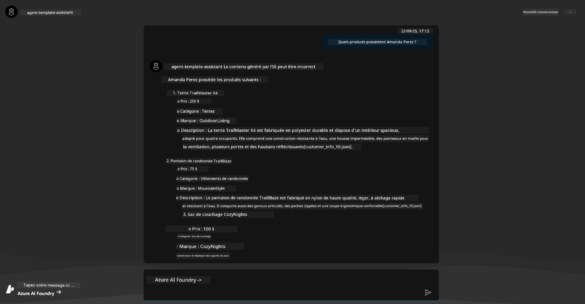

---

## 6. Espace de test Agent

Obtenons un peu plus d’intuition sur les capacités de Microsoft Foundry, en testant l’agent dans le Agents Playground.

1. Revenez à la page `Agents` dans Microsoft Foundry - sélectionnez l’agent par défaut
1. Cliquez sur l’option `Try in Playground` — vous devriez obtenir une interface Playground comme celle-ci
1. Posez la même question : `Quels produits possède Amanda Perez ?`

    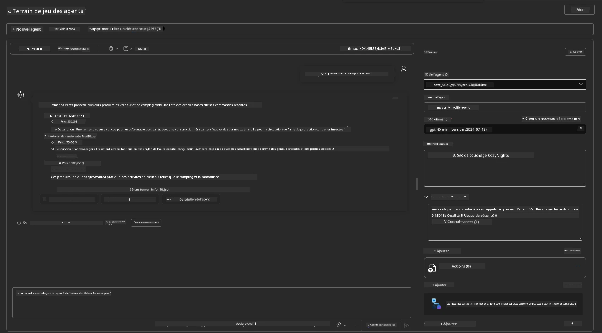

Vous obtenez la même réponse (ou une similaire) — mais vous avez aussi des informations supplémentaires que vous pouvez utiliser pour comprendre la qualité, le coût et la performance de votre application agentique. Par exemple :

1. Notez que la réponse cite les fichiers de données utilisés pour "étayer" la réponse
1. Survolez une étiquette de fichier quelconque — les données correspondent-elles à votre requête et à la réponse affichée ?

Vous voyez aussi une ligne de _statistiques_ sous la réponse.

1. Survolez une métrique — par exemple, la sécurité. Vous voyez quelque chose comme ceci
1. La note évaluée correspond-elle à votre intuition sur le niveau de sécurité de la réponse ?

      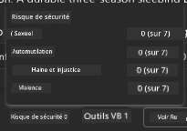

---

## 7. Observabilité intégrée

L’observabilité consiste à instrumenter votre application pour générer des données qui peuvent être utilisées pour comprendre, déboguer et optimiser ses opérations. Pour en avoir une idée :

1. Cliquez sur le bouton `View Run Info` — vous devriez voir cette vue. Il s'agit d'un exemple de [tracé d’agent](https://learn.microsoft.com/en-us/azure/ai-foundry/how-to/develop/trace-agents-sdk#view-trace-results-in-the-azure-ai-foundry-agents-playground) en action. _Vous pouvez aussi obtenir cette vue en cliquant sur Thread Logs dans le menu supérieur_.

   - Prenez connaissance des étapes d’exécution et des outils mobilisés par l’agent
   - Comprenez le nombre total de tokens (par rapport à l’usage des tokens en sortie) pour la réponse
   - Comprenez la latence et où le temps est passé dans l’exécution

      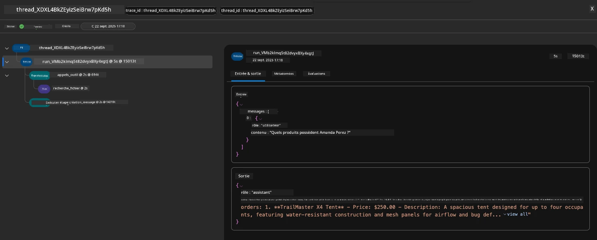

1. Cliquez sur l’onglet `Metadata` pour voir les attributs supplémentaires de l’exécution, qui peuvent fournir un contexte utile pour déboguer plus tard.

      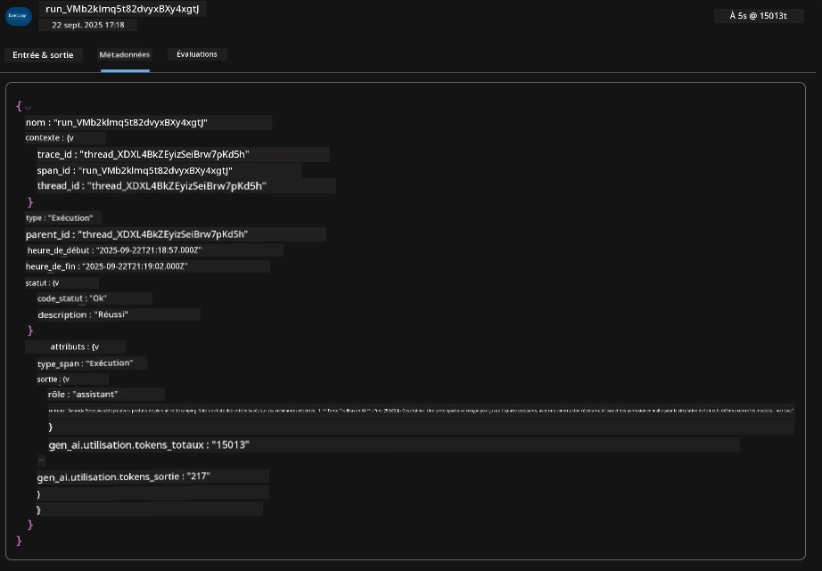

1. Cliquez sur l’onglet `Evaluations` pour voir les auto-évaluations faites sur la réponse de l’agent. Celles-ci incluent des évaluations de sécurité (ex. auto-mutilation) et des évaluations spécifiques à l’agent (ex. résolution d’intention, respect de la tâche).

      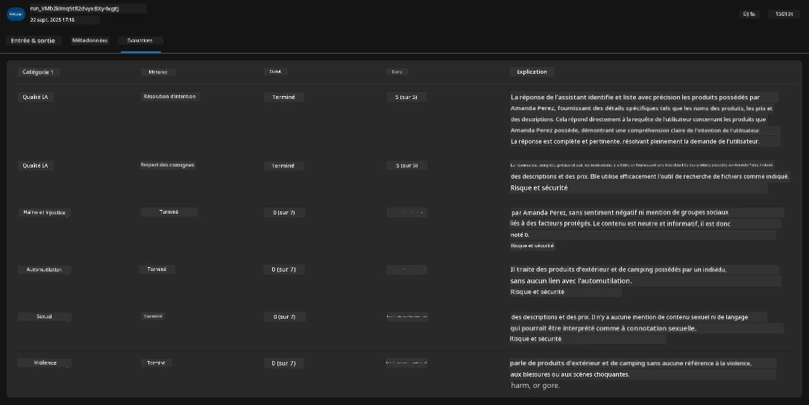

1. Enfin, cliquez sur l’onglet `Monitoring` dans le menu latéral.

      - Sélectionnez l’onglet `Resource usage` dans la page affichée – et consultez les métriques.
      - Suivez l’usage de l’application en termes de coûts (tokens) et de charge (requêtes).
      - Suivez la latence de l’application jusqu’au premier octet (traitement de l’entrée) et au dernier octet (sortie).

      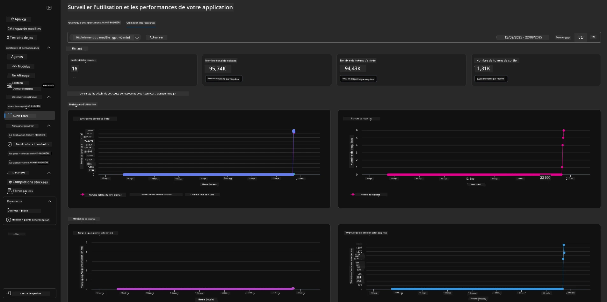

---

## 8. Variables d’environnement

Jusqu’à présent, nous avons suivi le déploiement dans le navigateur — et validé que notre infrastructure est provisionnée et que l’application fonctionne. Mais pour travailler avec le code de l’application _en premier lieu_, nous devons configurer notre environnement de développement local avec les variables pertinentes nécessaires pour travailler avec ces ressources. L’utilisation de `azd` facilite cela.

1. L’interface Azure Developer CLI [utilise des variables d’environnement](https://learn.microsoft.com/en-us/azure/developer/azure-developer-cli/manage-environment-variables?tabs=bash) pour stocker et gérer les paramètres de configuration des déploiements applicatifs.

1. Les variables d’environnement sont stockées dans `.azure/<env-name>/.env` — cela les limite à l’environnement `env-name` utilisé pendant le déploiement et vous permet d’isoler les environnements entre différentes cibles de déploiement dans le même dépôt.

1. Les variables d’environnement sont automatiquement chargées par la commande `azd` chaque fois qu’elle exécute une commande spécifique (ex. `azd up`). Notez que `azd` ne lit pas automatiquement les variables d’environnement _au niveau du système d’exploitation_ (ex. définies dans le shell) — utilisez plutôt `azd set env` et `azd get env` pour transférer les informations dans des scripts.

Essayons quelques commandes :

1. Obtenez toutes les variables d’environnement définies pour `azd` dans cet environnement :

      ```bash title="" linenums="0"
      azd env get-values
      ```
      
      Vous voyez quelque chose comme :

      ```bash title="" linenums="0"
      AZURE_AI_AGENT_DEPLOYMENT_NAME="gpt-4.1-mini"
      AZURE_AI_AGENT_NAME="agent-template-assistant"
      AZURE_AI_EMBED_DEPLOYMENT_NAME="text-embedding-3-small"
      AZURE_AI_EMBED_DIMENSIONS=100
      ...
      ```

1. Obtenez une valeur spécifique — par exemple, je veux savoir si la variable `AZURE_AI_AGENT_MODEL_NAME` est définie

      ```bash title="" linenums="0"
      azd env get-value AZURE_AI_AGENT_MODEL_NAME 
      ```
      
      Vous voyez quelque chose comme ceci — elle n’était pas définie par défaut !

      ```bash title="" linenums="0"
      ERROR: key 'AZURE_AI_AGENT_MODEL_NAME' not found in the environment values
      ```

1. Définissez une nouvelle variable d’environnement pour `azd`. Ici, nous mettons à jour le nom du modèle de l’agent. _Note : toute modification effectuée sera immédiatement reflétée dans le fichier `.azure/<env-name>/.env`._

      ```bash title="" linenums="0"
      azd env set AZURE_AI_AGENT_MODEL_NAME gpt-4.1
      azd env set AZURE_AI_AGENT_MODEL_VERSION 2025-04-14
      azd env set AZURE_AI_AGENT_DEPLOYMENT_CAPACITY 150
      ```

      Maintenant, nous devrions constater que la valeur est définie :

      ```bash title="" linenums="0"
      azd env get-value AZURE_AI_AGENT_MODEL_NAME 
      ```

1. Notez que certaines ressources sont persistantes (ex. déploiements de modèles) et exigeront plus qu’un simple `azd up` pour forcer leur redéploiement. Essayons de supprimer le déploiement initial et de redéployer avec des variables d’environnement modifiées.

1. **Rafraîchir** Si vous avez déployé précédemment une infrastructure avec un modèle azd — vous pouvez _rafraîchir_ l’état de vos variables d’environnement locales en fonction de l’état actuel de votre déploiement Azure avec cette commande :

      ```bash title="" linenums="0"
      azd env refresh
      ```

      C’est une méthode puissante pour _synchroniser_ les variables d’environnement entre deux environnements de développement locaux ou plus (par exemple, une équipe avec plusieurs développeurs) - permettant à l’infrastructure déployée de servir de référence pour l’état des variables d’environnement. Les membres de l’équipe n’ont qu’à _rafraîchir_ les variables pour se remettre en phase.

---

## 9. Félicitations 🏆

Vous venez de compléter un flux de travail complet dans lequel vous avez :

- [X] Sélectionné le modèle AZD que vous souhaitez utiliser
- [X] Ouvert le modèle dans un environnement de développement supporté
- [X] Déployé le modèle et validé son fonctionnement

---

<!-- CO-OP TRANSLATOR DISCLAIMER START -->
**Avis de non-responsabilité** :  
Ce document a été traduit à l’aide du service de traduction automatique [Co-op Translator](https://github.com/Azure/co-op-translator). Bien que nous nous efforcions d’assurer l’exactitude, veuillez noter que les traductions automatiques peuvent contenir des erreurs ou des inexactitudes. Le document original dans sa langue d’origine doit être considéré comme la source faisant autorité. Pour toute information critique, une traduction professionnelle humaine est recommandée. Nous ne sommes pas responsables des malentendus ou des mauvaises interprétations résultant de l’utilisation de cette traduction.
<!-- CO-OP TRANSLATOR DISCLAIMER END -->