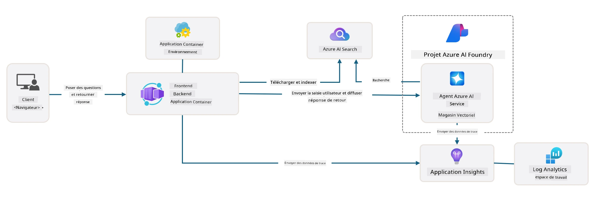

<!--
CO_OP_TRANSLATOR_METADATA:
{
  "original_hash": "4e403f041411361140d6beb88ab2a181",
  "translation_date": "2025-09-24T09:13:10+00:00",
  "source_file": "workshop/docs/instructions/3-Deconstruct-AI-Template.md",
  "language_code": "fr"
}
-->
# 3. Déconstruire un modèle

!!! tip "À LA FIN DE CE MODULE, VOUS SEREZ EN MESURE DE"

    - [ ] Élément
    - [ ] Élément
    - [ ] Élément
    - [ ] **Lab 3 :**

---

Avec les modèles AZD et l'Azure Developer CLI (`azd`), nous pouvons rapidement démarrer notre parcours de développement IA avec des dépôts standardisés qui fournissent du code d'exemple, des fichiers d'infrastructure et de configuration - sous la forme d'un projet _starter_ prêt à être déployé.

**Mais maintenant, nous devons comprendre la structure du projet et le code source - et être capables de personnaliser le modèle AZD - sans aucune expérience ou connaissance préalable d'AZD !**

---

## 1. Activer GitHub Copilot

### 1.1 Installer GitHub Copilot Chat

Il est temps d'explorer [GitHub Copilot avec le mode Agent](https://code.visualstudio.com/docs/copilot/chat/chat-agent-mode). Nous pouvons maintenant utiliser un langage naturel pour décrire notre tâche de manière générale et obtenir de l'aide pour l'exécuter. Pour ce lab, nous utiliserons le [plan gratuit Copilot](https://github.com/github-copilot/signup) qui a une limite mensuelle pour les complétions et les interactions de chat.

L'extension peut être installée depuis le marketplace, mais elle devrait déjà être disponible dans votre environnement Codespaces. _Cliquez sur `Open Chat` dans le menu déroulant de l'icône Copilot - et tapez une invite comme `What can you do?`_ - vous pourriez être invité à vous connecter. **GitHub Copilot Chat est prêt**.

### 1.2 Installer les serveurs MCP

Pour que le mode Agent soit efficace, il doit avoir accès aux bons outils pour l'aider à récupérer des connaissances ou à effectuer des actions. C'est là que les serveurs MCP peuvent être utiles. Nous allons configurer les serveurs suivants :

1. [Azure MCP Server](../../../../../workshop/docs/instructions)
1. [Microsoft Docs MCP Server](../../../../../workshop/docs/instructions)

Pour les activer :

1. Créez un fichier appelé `.vscode/mcp.json` s'il n'existe pas
1. Copiez le contenu suivant dans ce fichier - et démarrez les serveurs !
   ```json title=".vscode/mcp.json"
   {
      "servers": {
         "Azure MCP Server": {
            "command": "npx",
            "args": [
            "-y",
            "@azure/mcp@latest",
            "server",
            "start"
            ]
         },
         "microsoft.docs.mcp": {
            "type": "http",
            "url": "https://learn.microsoft.com/api/mcp"
         }
      }
   }
   ```

??? warning "Vous pourriez recevoir une erreur indiquant que `npx` n'est pas installé (cliquez pour voir la solution)"

      Pour résoudre cela, ouvrez le fichier `.devcontainer/devcontainer.json` et ajoutez cette ligne à la section des fonctionnalités. Ensuite, reconstruisez le conteneur. Vous devriez maintenant avoir `npx` installé.

      ```title="" linenums="0"
         "features": {
            "ghcr.io/devcontainers/features/node:1": {},
            ...
         },
      ```

---

### 1.3 Tester GitHub Copilot Chat

**Commencez par utiliser `az login` pour vous authentifier avec Azure depuis la ligne de commande de VS Code.**

Vous devriez maintenant pouvoir interroger l'état de votre abonnement Azure et poser des questions sur les ressources déployées ou la configuration. Essayez ces invites :

1. `List my Azure resource groups`
1. `#foundry list my current deployments`

Vous pouvez également poser des questions sur la documentation Azure et obtenir des réponses basées sur le serveur Microsoft Docs MCP. Essayez ces invites :

1. `#microsoft_docs_search What is Azure Developer CLI?`
1. `#microsoft_docs_search Show me a Python tutorial to chat with deployed model`

Ou vous pouvez demander des extraits de code pour accomplir une tâche. Essayez cette invite :

1. `Give me a Python code example that uses AAD for an interactive chat client`

En mode `Ask`, cela fournira du code que vous pouvez copier-coller et essayer. En mode `Agent`, cela pourrait aller plus loin et créer les ressources pertinentes pour vous - y compris les scripts de configuration et la documentation - pour vous aider à exécuter cette tâche.

**Vous êtes maintenant prêt à commencer à explorer le dépôt de modèles**

---

## 2. Déconstruire l'architecture

??? prompt "ASK : Expliquez l'architecture de l'application dans docs/images/architecture.png en 1 paragraphe"

      Cette application est une application de chat alimentée par l'IA, construite sur Azure, qui illustre une architecture moderne basée sur des agents. La solution repose sur une Azure Container App qui héberge le code principal de l'application, lequel traite les entrées utilisateur et génère des réponses intelligentes via un agent IA.

      L'architecture s'appuie sur le projet Azure AI Foundry comme base pour les capacités IA, en se connectant aux services Azure AI qui fournissent les modèles linguistiques sous-jacents (comme GPT-4o-mini) et les fonctionnalités d'agent. Les interactions utilisateur passent par un frontend basé sur React vers un backend FastAPI qui communique avec le service d'agent IA pour générer des réponses contextuelles.

      Le système intègre des capacités de récupération de connaissances via la recherche de fichiers ou le service Azure AI Search, permettant à l'agent d'accéder à des informations et de les citer à partir de documents téléchargés. Pour l'excellence opérationnelle, l'architecture inclut une surveillance complète via Application Insights et Log Analytics Workspace pour le traçage, la journalisation et l'optimisation des performances.

      Azure Storage fournit un stockage blob pour les données de l'application et les fichiers téléchargés, tandis que Managed Identity garantit un accès sécurisé entre les ressources Azure sans stocker de credentials. L'ensemble de la solution est conçu pour être évolutif et facile à maintenir, avec l'application conteneurisée qui s'adapte automatiquement à la demande tout en offrant une sécurité, une surveillance et des capacités CI/CD intégrées via l'écosystème de services gérés d'Azure.



---

## 3. Structure du dépôt

!!! prompt "ASK : Expliquez la structure des dossiers du modèle. Commencez par un diagramme hiérarchique visuel."

??? info "RÉPONSE : Diagramme hiérarchique visuel"

      ```bash title="" 
      get-started-with-ai-agents/
      ├── 📋 Configuration & Setup
      │   ├── azure.yaml                    # Configuration Azure Developer CLI
      │   ├── docker-compose.yaml           # Conteneurs de développement local
      │   ├── pyproject.toml                # Configuration du projet Python
      │   ├── requirements-dev.txt          # Dépendances de développement
      │   └── .devcontainer/                # Configuration du conteneur dev VS Code
      │
      ├── 🏗️ Infrastructure (infra/)
      │   ├── main.bicep                    # Modèle d'infrastructure principal
      │   ├── api.bicep                     # Ressources spécifiques à l'API
      │   ├── main.parameters.json          # Paramètres d'infrastructure
      │   └── core/                         # Composants d'infrastructure modulaires
      │       ├── ai/                       # Configurations des services IA
      │       ├── host/                     # Infrastructure d'hébergement
      │       ├── monitor/                  # Surveillance et journalisation
      │       ├── search/                   # Configuration Azure AI Search
      │       ├── security/                 # Sécurité et identité
      │       └── storage/                  # Configurations du compte de stockage
      │
      ├── 💻 Application Source (src/)
      │   ├── api/                          # API backend
      │   │   ├── main.py                   # Point d'entrée de l'application FastAPI
      │   │   ├── routes.py                 # Définitions des routes API
      │   │   ├── search_index_manager.py   # Fonctionnalité de recherche
      │   │   ├── data/                     # Gestion des données API
      │   │   ├── static/                   # Ressources web statiques
      │   │   └── templates/                # Modèles HTML
      │   ├── frontend/                     # Frontend React/TypeScript
      │   │   ├── package.json              # Dépendances Node.js
      │   │   ├── vite.config.ts            # Configuration de build Vite
      │   │   └── src/                      # Code source du frontend
      │   ├── data/                         # Fichiers de données d'exemple
      │   │   └── embeddings.csv            # Embeddings pré-calculés
      │   ├── files/                        # Fichiers de base de connaissances
      │   │   ├── customer_info_*.json      # Échantillons de données client
      │   │   └── product_info_*.md         # Documentation produit
      │   ├── Dockerfile                    # Configuration du conteneur
      │   └── requirements.txt              # Dépendances Python
      │
      ├── 🔧 Automation & Scripts (scripts/)
      │   ├── postdeploy.sh/.ps1           # Configuration post-déploiement
      │   ├── setup_credential.sh/.ps1     # Configuration des credentials
      │   ├── validate_env_vars.sh/.ps1    # Validation de l'environnement
      │   └── resolve_model_quota.sh/.ps1  # Gestion des quotas de modèles
      │
      ├── 🧪 Testing & Evaluation
      │   ├── tests/                        # Tests unitaires et d'intégration
      │   │   └── test_search_index_manager.py
      │   ├── evals/                        # Cadre d'évaluation des agents
      │   │   ├── evaluate.py               # Exécuteur d'évaluation
      │   │   ├── eval-queries.json         # Requêtes de test
      │   │   └── eval-action-data-path.json
      │   ├── sandbox/                      # Bac à sable de développement
      │   │   ├── 1-quickstart.py           # Exemples de démarrage rapide
      │   │   └── aad-interactive-chat.py   # Exemples d'authentification
      │   └── airedteaming/                 # Évaluation de la sécurité IA
      │       └── ai_redteaming.py          # Tests de red team
      │
      ├── 📚 Documentation (docs/)
      │   ├── deployment.md                 # Guide de déploiement
      │   ├── local_development.md          # Instructions de configuration locale
      │   ├── troubleshooting.md            # Problèmes courants et solutions
      │   ├── azure_account_setup.md        # Prérequis Azure
      │   └── images/                       # Ressources de documentation
      │
      └── 📄 Project Metadata
         ├── README.md                     # Vue d'ensemble du projet
         ├── CODE_OF_CONDUCT.md           # Règles de la communauté
         ├── CONTRIBUTING.md              # Guide de contribution
         ├── LICENSE                      # Conditions de licence
         └── next-steps.md                # Guide post-déploiement
      ```

### 3.1. Architecture principale de l'application

Ce modèle suit un modèle **d'application web full-stack** avec :

- **Backend** : FastAPI en Python avec intégration Azure AI
- **Frontend** : TypeScript/React avec système de build Vite
- **Infrastructure** : Modèles Azure Bicep pour les ressources cloud
- **Containerisation** : Docker pour un déploiement cohérent

### 3.2 Infrastructure en tant que code (bicep)

La couche d'infrastructure utilise des modèles **Azure Bicep** organisés de manière modulaire :

   - **`main.bicep`** : Orchestre toutes les ressources Azure
   - **Modules `core/`** : Composants réutilisables pour différents services
      - Services IA (Azure OpenAI, AI Search)
      - Hébergement de conteneurs (Azure Container Apps)
      - Surveillance (Application Insights, Log Analytics)
      - Sécurité (Key Vault, Managed Identity)

### 3.3 Source de l'application (`src/`)

**API Backend (`src/api/`)** :

- API REST basée sur FastAPI
- Intégration avec le service d'agent Azure AI
- Gestion des index de recherche pour la récupération de connaissances
- Capacités de téléchargement et de traitement de fichiers

**Frontend (`src/frontend/`)** :

- SPA moderne en React/TypeScript
- Vite pour un développement rapide et des builds optimisés
- Interface de chat pour les interactions avec l'agent

**Base de connaissances (`src/files/`)** :

- Échantillons de données client et produit
- Démonstration de la récupération de connaissances basée sur des fichiers
- Exemples au format JSON et Markdown

### 3.4 DevOps & Automatisation

**Scripts (`scripts/`)** :

- Scripts PowerShell et Bash multiplateformes
- Validation et configuration de l'environnement
- Configuration post-déploiement
- Gestion des quotas de modèles

**Intégration Azure Developer CLI** :

- Configuration `azure.yaml` pour les workflows `azd`
- Provisionnement et déploiement automatisés
- Gestion des variables d'environnement

### 3.5 Tests & Assurance qualité

**Cadre d'évaluation (`evals/`)** :

- Évaluation des performances des agents
- Tests de qualité des requêtes-réponses
- Pipeline d'évaluation automatisé

**Sécurité IA (`airedteaming/`)** :

- Tests de red team pour la sécurité IA
- Analyse des vulnérabilités de sécurité
- Pratiques responsables en IA

---

## 4. Félicitations 🏆

Vous avez utilisé avec succès GitHub Copilot Chat avec les serveurs MCP pour explorer le dépôt.

- [X] Activation de GitHub Copilot pour Azure
- [X] Compréhension de l'architecture de l'application
- [X] Exploration de la structure du modèle AZD

Cela vous donne une idée des actifs _infrastructure en tant que code_ pour ce modèle. Ensuite, nous examinerons le fichier de configuration pour AZD.

---

