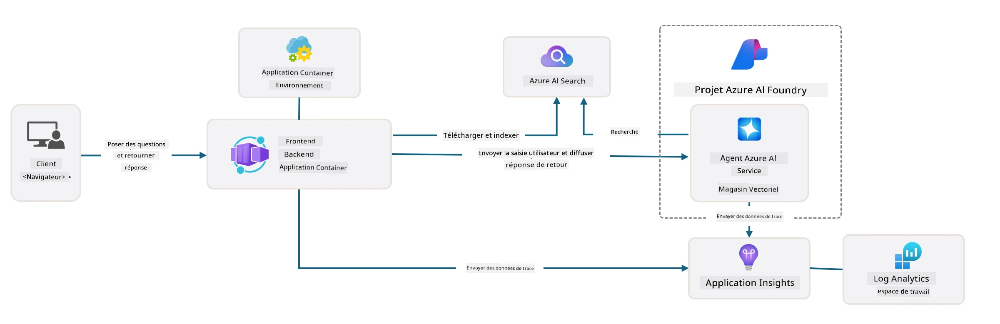

# 3. Déconstruire un Modèle

!!! tip "À LA FIN DE CE MODULE, VOUS SAUREZ"

    - [ ] Activer GitHub Copilot avec les serveurs MCP pour l’assistance Azure
    - [ ] Comprendre la structure du dossier du modèle AZD et ses composants
    - [ ] Explorer les modèles d’organisation de l’infrastructure en tant que code (Bicep)
    - [ ] **Lab 3 :** Utiliser GitHub Copilot pour explorer et comprendre l’architecture du dépôt

---

Avec les modèles AZD et l’interface en ligne de commande Azure Developer CLI (`azd`), nous pouvons rapidement démarrer notre parcours de développement IA avec des dépôts standardisés fournissant du code d’exemple, des fichiers d'infrastructure et de configuration — sous la forme d’un projet _starter_ prêt à déployer.

**Mais maintenant, nous devons comprendre la structure du projet et la base de code — et être capables de personnaliser le modèle AZD — sans aucune expérience ou compréhension préalable d’AZD !**

---

## 1. Activer GitHub Copilot

### 1.1 Installer GitHub Copilot Chat

Il est temps d’explorer [GitHub Copilot avec le mode Agent](https://code.visualstudio.com/docs/copilot/chat/chat-agent-mode). Désormais, nous pouvons utiliser le langage naturel pour décrire notre tâche à un haut niveau et recevoir de l’aide à l’exécution. Pour ce laboratoire, nous utiliserons le [plan gratuit de Copilot](https://github.com/github-copilot/signup) qui limite mensuellement les complétions et interactions de chat.

L’extension peut être installée depuis le marketplace, et elle est souvent déjà disponible dans Codespaces ou environnements conteneur de développement. _Cliquez sur `Open Chat` dans le menu déroulant de l’icône Copilot — et tapez une invite comme `What can you do?`_ — il se peut qu’une connexion soit requise. **GitHub Copilot Chat est prêt**.

### 1.2. Installer les serveurs MCP

Pour que le mode Agent soit efficace, il a besoin d’accéder aux bons outils pour l’aider à récupérer des connaissances ou accomplir des actions. C’est là que les serveurs MCP peuvent aider. Nous allons configurer les serveurs suivants :

1. [Serveur Azure MCP](../../../../../workshop/docs/instructions)
1. [Serveur Microsoft Docs MCP](../../../../../workshop/docs/instructions)

Pour les activer :

1. Créez un fichier `.vscode/mcp.json` s’il n’existe pas
1. Copiez-y ce qui suit — et démarrez les serveurs !
   ```json title=".vscode/mcp.json"
   {
      "servers": {
         "Azure MCP Server": {
            "command": "npx",
            "args": [
            "-y",
            "@azure/mcp@latest",
            "server",
            "start"
            ]
         },
         "microsoft.docs.mcp": {
            "type": "http",
            "url": "https://learn.microsoft.com/api/mcp"
         }
      }
   }
   ```

??? warning "Vous pouvez obtenir une erreur indiquant que `npx` n’est pas installé (cliquez pour voir la correction)"

      Pour corriger, ouvrez le fichier `.devcontainer/devcontainer.json` et ajoutez cette ligne dans la section features. Puis reconstruisez le conteneur. Vous devriez désormais avoir `npx` installé.

      ```title="" linenums="0"
         "features": {
            "ghcr.io/devcontainers/features/node:1": {},
            ...
         },
      ```

---

### 1.3. Tester GitHub Copilot Chat

**Utilisez d’abord `azd auth login` pour vous authentifier avec Azure depuis la ligne de commande de VS Code. Utilisez également `az login` uniquement si vous envisagez d’exécuter directement des commandes Azure CLI.**

Vous devriez maintenant pouvoir interroger l’état de votre abonnement Azure et poser des questions sur les ressources ou configurations déployées. Essayez ces invites :

1. `List my Azure resource groups`
1. `#foundry list my current deployments`

Vous pouvez aussi poser des questions sur la documentation Azure et obtenir des réponses basées sur le serveur MCP Microsoft Docs. Essayez ces invites :

1. `#microsoft_docs_search What is Azure Developer CLI?`
1. `#microsoft_docs_search Show me a Python tutorial to chat with deployed model`

Ou demandez des extraits de code pour accomplir une tâche. Essayez cette invite :

1. `Give me a Python code example that uses AAD for an interactive chat client`

En mode `Ask`, cela fournit du code à copier-coller et à tester. En mode `Agent`, cela peut aller plus loin en créant les ressources pertinentes pour vous — incluant scripts d’installation et documentation — pour vous aider à exécuter cette tâche.

**Vous êtes désormais prêt à commencer l’exploration du dépôt modèle**

---

## 2. Déconstruire l’Architecture

??? prompt "QUESTION : Expliquez l’architecture de l’application dans docs/images/architecture.png en 1 paragraphe"

      Cette application est un chatbot alimenté par IA construit sur Azure qui illustre une architecture moderne basée sur des agents. La solution s’articule autour d’une Azure Container App hébergeant le code principal de l’application, qui traite les entrées utilisateur et génère des réponses intelligentes via un agent IA. 
      
      L’architecture utilise Microsoft Foundry Project comme base des capacités IA, connectée aux services Azure AI fournissant les modèles de langage sous-jacents (tels que gpt-4.1-mini) et les fonctionnalités d’agent. Les interactions utilisateur transitent par un frontend React vers un backend FastAPI qui communique avec le service d’agent IA pour générer des réponses contextuelles. 
      
      Le système intègre la récupération des connaissances via la recherche dans les fichiers ou le service Azure AI Search, permettant à l’agent d’accéder et citer des informations issues des documents téléchargés. Pour l’excellence opérationnelle, l’architecture comprend une supervision complète via Application Insights et Log Analytics Workspace pour le traçage, la journalisation et l’optimisation des performances. 
      
      Azure Storage fournit un stockage blob pour les données applicatives et les fichiers chargés, tandis que Managed Identity assure un accès sécurisé entre les ressources Azure sans stocker les identifiants. L’ensemble de la solution est conçue pour la scalabilité et la maintenabilité, avec l’application conteneurisée évoluant automatiquement selon la demande tout en fournissant sécurité intégrée, supervision et capacités CI/CD via l’écosystème de services managés Azure.



---

## 3. Structure du Dépôt

!!! prompt "QUESTION : Expliquez la structure des dossiers du modèle. Commencez par un diagramme hiérarchique visuel."

??? info "RÉPONSE : Diagramme hiérarchique visuel"

      ```bash title="" 
      get-started-with-ai-agents/
      ├── 📋 Configuration & Setup
      │   ├── azure.yaml                    # Configuration Azure Developer CLI
      │   ├── docker-compose.yaml           # Conteneurs de développement local
      │   ├── pyproject.toml                # Configuration du projet Python
      │   ├── requirements-dev.txt          # Dépendances pour le développement
      │   └── .devcontainer/                # Configuration du conteneur de dev VS Code
      │
      ├── 🏗️ Infrastructure (infra/)
      │   ├── main.bicep                    # Modèle principal d’infrastructure
      │   ├── api.bicep                     # Ressources spécifiques à l’API
      │   ├── main.parameters.json          # Paramètres d’infrastructure
      │   └── core/                         # Composants modulaires d’infrastructure
      │       ├── ai/                       # Configurations des services IA
      │       ├── host/                     # Infrastructure d’hébergement
      │       ├── monitor/                  # Supervision et journalisation
      │       ├── search/                   # Configuration Azure AI Search
      │       ├── security/                 # Sécurité et identité
      │       └── storage/                  # Configurations des comptes de stockage
      │
      ├── 💻 Source de l’Application (src/)
      │   ├── api/                          # API backend
      │   │   ├── main.py                   # Entrée de l’application FastAPI
      │   │   ├── routes.py                 # Définitions des routes API
      │   │   ├── search_index_manager.py   # Fonctionnalité de recherche
      │   │   ├── data/                     # Gestion des données API
      │   │   ├── static/                   # Ressources web statiques
      │   │   └── templates/                # Templates HTML
      │   ├── frontend/                     # Frontend React/TypeScript
      │   │   ├── package.json              # Dépendances Node.js
      │   │   ├── vite.config.ts            # Configuration du build Vite
      │   │   └── src/                      # Code source frontend
      │   ├── data/                         # Fichiers de données d’exemple
      │   │   └── embeddings.csv            # Embeddings pré-calculées
      │   ├── files/                        # Fichiers de la base de connaissances
      │   │   ├── customer_info_*.json      # Exemples de données clients
      │   │   └── product_info_*.md         # Documentation produit
      │   ├── Dockerfile                    # Configuration du conteneur
      │   └── requirements.txt              # Dépendances Python
      │
      ├── 🔧 Automatisation & Scripts (scripts/)
      │   ├── postdeploy.sh/.ps1           # Configuration post-déploiement
      │   ├── setup_credential.sh/.ps1     # Configuration des identifiants
      │   ├── validate_env_vars.sh/.ps1    # Validation des variables d’environnement
      │   └── resolve_model_quota.sh/.ps1  # Gestion des quotas de modèle
      │
      ├── 🧪 Tests & Évaluation
      │   ├── tests/                        # Tests unitaires et d’intégration
      │   │   └── test_search_index_manager.py
      │   ├── evals/                        # Framework d’évaluation des agents
      │   │   ├── evaluate.py               # Exécuteur d’évaluation
      │   │   ├── eval-queries.json         # Requêtes de test
      │   │   └── eval-action-data-path.json
      │   ├── sandbox/                      # Terrain de jeu de développement
      │   │   ├── 1-quickstart.py           # Exemples pour débuter
      │   │   └── aad-interactive-chat.py   # Exemples d’authentification
      │   └── airedteaming/                 # Évaluation de sécurité IA
      │       └── ai_redteaming.py          # Tests de red team
      │
      ├── 📚 Documentation (docs/)
      │   ├── deployment.md                 # Guide de déploiement
      │   ├── local_development.md          # Instructions d’installation locale
      │   ├── troubleshooting.md            # Problèmes courants & corrections
      │   ├── azure_account_setup.md        # Pré-requis Azure
      │   └── images/                       # Assets de documentation
      │
      └── 📄 Métadonnées du Projet
         ├── README.md                     # Vue d’ensemble du projet
         ├── CODE_OF_CONDUCT.md           # Règles de la communauté
         ├── CONTRIBUTING.md              # Guide de contribution
         ├── LICENSE                      # Conditions de licence
         └── next-steps.md                # Conseils post-déploiement
      ```

### 3.1. Architecture principale de l’application

Ce modèle suit un schéma d’**application web full-stack** avec :

- **Backend** : FastAPI Python avec intégration Azure AI
- **Frontend** : TypeScript/React avec système de build Vite
- **Infrastructure** : Templates Azure Bicep pour les ressources cloud
- **Conteneurisation** : Docker pour un déploiement homogène

### 3.2 Infrastructure As Code (Bicep)

La couche infrastructure utilise des templates **Azure Bicep** organisés de manière modulaire :

   - **`main.bicep`** : Orchestration de toutes les ressources Azure
   - **Modules `core/`** : Composants réutilisables pour différents services
      - Services IA (Microsoft Foundry Models, AI Search)
      - Hébergement de conteneurs (Azure Container Apps)
      - Supervision (Application Insights, Log Analytics)
      - Sécurité (Key Vault, Managed Identity)

### 3.3 Source de l’application (`src/`)

**API backend (`src/api/`)** :

- API REST basée sur FastAPI
- Intégration des agents Foundry
- Gestion de l’index de recherche pour la récupération de connaissances
- Fonctionnalités de chargement et traitement de fichiers

**Frontend (`src/frontend/`)** :

- SPA moderne en React/TypeScript
- Vite pour un développement rapide et des builds optimisés
- Interface de chat pour interactions avec l’agent

**Base de connaissances (`src/files/`)** :

- Données clients et produits exemples
- Montre la récupération de connaissances basée sur des fichiers
- Exemples au format JSON et Markdown

### 3.4 DevOps & Automatisation

**Scripts (`scripts/`)** :

- Scripts multiplateformes PowerShell et Bash
- Validation et mise en place de l’environnement
- Configuration post-déploiement
- Gestion des quotas des modèles

**Intégration Azure Developer CLI** :

- Configuration `azure.yaml` pour les workflows `azd`
- Provisionnement et déploiement automatisés
- Gestion des variables d’environnement

### 3.5 Tests & Assurance Qualité

**Framework d’évaluation (`evals/`)** :

- Évaluation de la performance des agents
- Tests qualité requête-réponse
- Pipeline d’évaluation automatisée

**Sécurité IA (`airedteaming/`)** :

- Tests de red team pour la sécurité IA
- Analyse des vulnérabilités de sécurité
- Pratiques responsables d’IA

---

## 4. Félicitations 🏆

Vous avez utilisé avec succès GitHub Copilot Chat avec les serveurs MCP pour explorer le dépôt.

- [X] GitHub Copilot activé pour Azure
- [X] Compréhension de l’architecture de l’application
- [X] Exploration de la structure du modèle AZD

Cela vous donne une idée des actifs _infrastructure as code_ pour ce modèle. Ensuite, nous étudierons le fichier de configuration pour AZD.

---

<!-- CO-OP TRANSLATOR DISCLAIMER START -->
**Avertissement** :  
Ce document a été traduit à l’aide du service de traduction automatique [Co-op Translator](https://github.com/Azure/co-op-translator). Bien que nous nous efforcions d’assurer l’exactitude, veuillez noter que les traductions automatisées peuvent contenir des erreurs ou des inexactitudes. Le document original dans sa langue d’origine doit être considéré comme la source faisant foi. Pour les informations critiques, une traduction professionnelle réalisée par un humain est recommandée. Nous ne pouvons être tenus responsables des malentendus ou des mauvaises interprétations résultant de l’utilisation de cette traduction.
<!-- CO-OP TRANSLATOR DISCLAIMER END -->