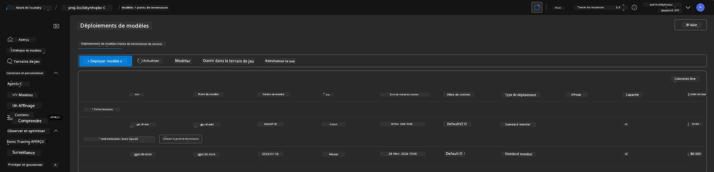
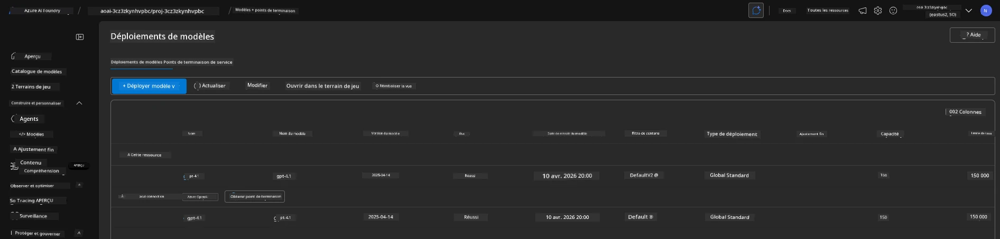

# 6. Démantèlement de l’Infrastructure

!!! tip "À LA FIN DE CE MODULE, VOUS SAUREZ"

    - [ ] Comprendre l'importance du nettoyage des ressources et de la gestion des coûts
    - [ ] Utiliser `azd down` pour déprovisionner l’infrastructure en toute sécurité
    - [ ] Récupérer les services cognitifs supprimés "soft" si nécessaire
    - [ ] **Lab 6 :** Nettoyer les ressources Azure et vérifier leur suppression

---

## Exercices bonus

Avant de démanteler le projet, prenez quelques minutes pour faire une exploration libre.

!!! info "Essayez Ces Suggestions d’Exploration"

    **Expérimentez avec GitHub Copilot :**
    
    1. Demandez : `Quels autres modèles AZD pourrais-je essayer pour des scénarios multi-agents ?`
    2. Demandez : `Comment personnaliser les instructions de l’agent pour un cas d’usage en santé ?`
    3. Demandez : `Quelles variables d’environnement contrôlent l’optimisation des coûts ?`
    
    **Explorez le portail Azure :**
    
    1. Examinez les métriques Application Insights de votre déploiement
    2. Vérifiez l’analyse des coûts pour les ressources provisionnées
    3. Explorez une nouvelle fois le terrain de jeu des agents du portail Microsoft Foundry

---

## Déprovisionner l’infra

1. Démanteler l’infrastructure est aussi simple que :

      ```bash title="" linenums="0"
      azd down --purge
      ```
1. Le drapeau `--purge` garantit également la purge des services cognitifs supprimés "soft", libérant ainsi les quotas détenus par ces ressources. Une fois terminé, vous verrez quelque chose comme ceci :

      ```bash title="" linenums="0"
      ? Total resources to delete: 11, are you sure you want to continue? Yes
      Deleting your resources can take some time.
      (✓) Done: Deleted resource group rg-nitya-mshack-azd
      (✓) Done: Purging Cognitive Account: aoai-3cz3zkynhvpbc

      SUCCESS: Your application was removed from Azure in 11 minutes 4 seconds.
      ```

1. (Optionnel) Si vous lancez maintenant `azd up` à nouveau, vous remarquerez que le modèle gpt-4.1 est déployé car la variable d’environnement a été modifiée (et sauvegardée) dans le dossier local `.azure`.

      Voici les déploiements de modèles **avant** :

      

      Et les voici **après** :
      

---

<!-- CO-OP TRANSLATOR DISCLAIMER START -->
**Avertissement** :  
Ce document a été traduit à l'aide du service de traduction automatique [Co-op Translator](https://github.com/Azure/co-op-translator). Bien que nous nous efforcions d'assurer l'exactitude, veuillez noter que les traductions automatiques peuvent contenir des erreurs ou des inexactitudes. Le document original dans sa langue d'origine doit être considéré comme la source faisant autorité. Pour les informations critiques, une traduction professionnelle réalisée par un humain est recommandée. Nous déclinons toute responsabilité en cas de malentendus ou de mauvaises interprétations résultant de l'utilisation de cette traduction.
<!-- CO-OP TRANSLATOR DISCLAIMER END -->