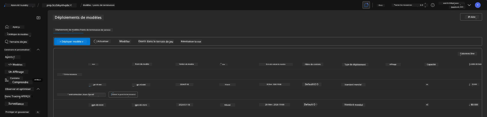
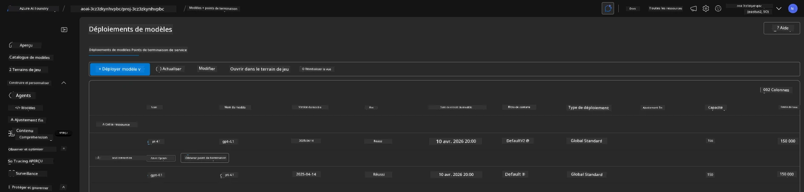

# 6. Démantèlement de l'infrastructure

!!! tip "À LA FIN DE CE MODULE, VOUS SAUREZ"

    - [ ] Comprendre l'importance du nettoyage des ressources et de la gestion des coûts
    - [ ] Utiliser `azd down` pour déprovisionner l'infrastructure en toute sécurité
    - [ ] Récupérer les services Azure AI supprimés en douce si nécessaire
    - [ ] **Lab 6 :** Nettoyer les ressources Azure et vérifier leur suppression

---

## Exercices Bonus

Avant de démanteler le projet, prenez quelques minutes pour une exploration libre.

!!! info "Essayez ces suggestions d'exploration"

    **Expérimentez avec GitHub Copilot :**
    
    1. Demandez : `Quels autres modèles AZD pourrais-je essayer pour des scénarios multi-agents ?`
    2. Demandez : `Comment puis-je personnaliser les instructions des agents pour un cas d'utilisation en santé ?`
    3. Demandez : `Quelles variables d'environnement contrôlent l'optimisation des coûts ?`
    
    **Explorez le portail Azure :**
    
    1. Examinez les métriques Application Insights pour votre déploiement
    2. Vérifiez l'analyse des coûts pour les ressources provisionnées
    3. Explorez encore une fois le terrain de jeu des agents du portail Microsoft Foundry

---

## Déprovisionnement de l'infrastructure

1. Démanteler l'infrastructure est aussi simple que :
      
      ```bash title="" linenums="0"
      azd down --purge
      ```
1. L’option `--purge` garantit également la suppression définitive des ressources Cognitive Service supprimées en douce, ce qui libère les quotas détenus par ces ressources. Une fois terminé, vous verrez quelque chose comme ceci :
      
      ```bash title="" linenums="0"
      ? Total resources to delete: 11, are you sure you want to continue? Yes
      Deleting your resources can take some time.
      (✓) Done: Deleted resource group rg-nitya-mshack-azd
      (✓) Done: Purging Cognitive Account: aoai-3cz3zkynhvpbc

      SUCCESS: Your application was removed from Azure in 11 minutes 4 seconds.
      ```

1. (Optionnel) Si vous lancez à nouveau `azd up`, vous remarquerez que le modèle gpt-4.1 est déployé puisque la variable d’environnement a été modifiée (et enregistrée) dans le dossier local `.azure`. 

      Voici les déploiements de modèle **avant** :

      

      Et voici **après** :
      

---

<!-- CO-OP TRANSLATOR DISCLAIMER START -->
**Avertissement** :
Ce document a été traduit à l'aide du service de traduction automatique [Co-op Translator](https://github.com/Azure/co-op-translator). Bien que nous nous efforçions d'assurer l'exactitude, veuillez noter que les traductions automatisées peuvent contenir des erreurs ou des inexactitudes. Le document original dans sa langue native doit être considéré comme la source faisant autorité. Pour les informations critiques, il est recommandé de recourir à une traduction professionnelle réalisée par un humain. Nous ne saurions être tenus responsables des malentendus ou erreurs d'interprétation découlant de l'utilisation de cette traduction.
<!-- CO-OP TRANSLATOR DISCLAIMER END -->