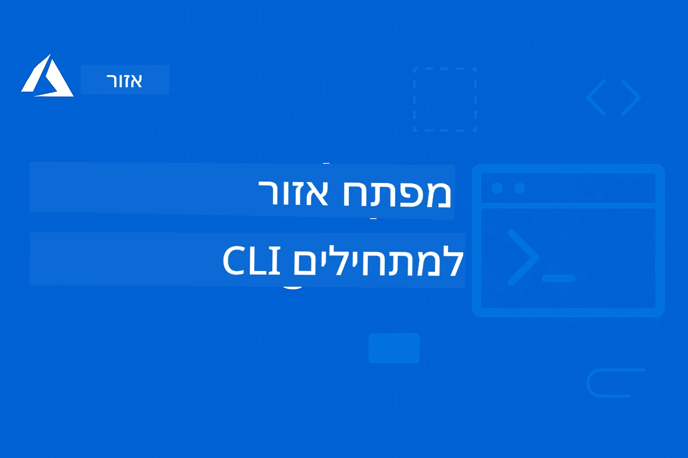

# AZD למתחילים: מסע למידה מובנה

 

[](https://GitHub.com/microsoft/azd-for-beginners/watchers/)
[](https://GitHub.com/microsoft/azd-for-beginners/network/)
[](https://GitHub.com/microsoft/azd-for-beginners/stargazers/)

[](https://discord.gg/microsoft-azure)
[](https://discord.gg/nTYy5BXMWG)

## התחלת העבודה עם קורס זה

עקוב אחרי השלבים האלו כדי להתחיל את מסע הלמידה שלך ב-AZD:

1. **צור Fork של המאגר**: לחץ על [](https://GitHub.com/microsoft/azd-for-beginners/fork)
2. **שכפל את המאגר**: `git clone https://github.com/microsoft/azd-for-beginners.git`
3. **הצטרף לקהילה**: [קהילות Azure Discord](https://discord.com/invite/ByRwuEEgH4) לתמיכה מקצועית
4. **בחר את מסלול הלמידה שלך**: בחר פרק למטה המתאים לרמת הניסיון שלך

### תמיכה בריבוי שפות

#### תרגומים אוטומטיים (תמיד מעודכנים)

<!-- CO-OP TRANSLATOR LANGUAGES TABLE START -->
[ערבית](../ar/README.md) | [בנגלית](../bn/README.md) | [בולגרית](../bg/README.md) | [בורמזית (מיאנמר)](../my/README.md) | [סינית (מפושטת)](../zh-CN/README.md) | [סינית (מסורתית, הונג קונג)](../zh-HK/README.md) | [סינית (מסורתית, מקאו)](../zh-MO/README.md) | [סינית (מסורתית, טאיוואן)](../zh-TW/README.md) | [קרואטית](../hr/README.md) | [צ'כית](../cs/README.md) | [דנית](../da/README.md) | [הולנדית](../nl/README.md) | [אסטונית](../et/README.md) | [פינית](../fi/README.md) | [צרפתית](../fr/README.md) | [גרמנית](../de/README.md) | [יוונית](../el/README.md) | [עברית](./README.md) | [הודית](../hi/README.md) | [הונגרית](../hu/README.md) | [אינדונזית](../id/README.md) | [איטלקית](../it/README.md) | [יפנית](../ja/README.md) | [קנדה](../kn/README.md) | [קוריאנית](../ko/README.md) | [ליטאית](../lt/README.md) | [מלאית](../ms/README.md) | [מלאלאיים](../ml/README.md) | [מרטהי](../mr/README.md) | [נפאלית](../ne/README.md) | [פידג'ין ניגרי](../pcm/README.md) | [נורבגית](../no/README.md) | [פרסית (פרסי)](../fa/README.md) | [פולנית](../pl/README.md) | [פורטוגזית (ברזיל)](../pt-BR/README.md) | [פורטוגזית (פורטוגל)](../pt-PT/README.md) | [פנג'בי (גורמוכי)](../pa/README.md) | [רומנית](../ro/README.md) | [רוסית](../ru/README.md) | [סרבית (קירילי)](../sr/README.md) | [סלובקית](../sk/README.md) | [סלובנית](../sl/README.md) | [ספרדית](../es/README.md) | [סוואהילי](../sw/README.md) | [שוודית](../sv/README.md) | [טגלוג (פיליפינית)](../tl/README.md) | [טמילית](../ta/README.md) | [טלוגו](../te/README.md) | [תאית](../th/README.md) | [טורקית](../tr/README.md) | [אוקראינית](../uk/README.md) | [אורדו](../ur/README.md) | [ויטנאמית](../vi/README.md)

> **מעדיפים לשכפל מקומית?**

> מאגר זה כולל 50+ תרגומים בשפות שונות, מה שמגדיל משמעותית את נפח ההורדה. לשכפול ללא תרגומים, השתמש ב-sparse checkout:
> ```bash
> git clone --filter=blob:none --sparse https://github.com/microsoft/AZD-for-beginners.git
> cd AZD-for-beginners
> git sparse-checkout set --no-cone '/*' '!translations' '!translated_images'
> ```
> זה נותן לך הכל כדי להשלים את הקורס במהירות הורדה גבוהה יותר.
<!-- CO-OP TRANSLATOR LANGUAGES TABLE END -->

## סקירת קורס

שלוט ב-CLI של Azure Developer (azd) דרך פרקים מובנים המיועדים ללמידה מתקדמת. **דגש מיוחד על פריסת אפליקציות בינה מלאכותית עם אינטגרציה ל-Microsoft Foundry.**

### מדוע קורס זה חיוני למפתחים מודרניים

בהסתמך על תובנות מקהילת Microsoft Foundry ב-Discord, **45% מהמפתחים רוצים להשתמש ב-AZD לעומסי עבודה של בינה מלאכותית** אך נתקלים באתגרים ב:
- ארכיטקטורות AI מורכבות עם שירותים מרובים
- שיטות עבודה מומלצות לפריסה בייצור של AI  
- אינטגרציה והגדרת שירותי Azure AI
- אופטימיזציה של עלויות לעומסי עבודה של AI
- פתרון תקלות ייחודיות לפריסת AI

### מטרות למידה

בסיום הקורס המבנה, תלמד:
- **שליטה ביסודות AZD**: מושגי יסוד, התקנה והגדרה
- **פריסת אפליקציות AI**: שימוש ב-AZD עם שירותי Microsoft Foundry
- **יישום Infrastructure as Code**: ניהול משאבי Azure עם תבניות Bicep
- **פתרון תקלות בפריסות**: פתרון בעיות ודיקוג
- **אופטימיזציה לייצור**: אבטחה, סקיילינג, ניטור וניהול עלויות
- **בניית פתרונות Multi-Agent**: פריסת ארכיטקטורות AI מורכבות

## 📚 פרקי הלימוד

*בחר את מסלול הלמידה שלך בהתאם לרמת הניסיון והמטרות*

### 🚀 פרק 1: יסודות והתחלה מהירה
**דרישות מוקדמות**: מנוי Azure, ידע בסיסי בשורת הפקודה  
**משך זמן**: 30-45 דקות  
**מורכבות**: ⭐

#### מה תלמד
- הבנת יסודות Azure Developer CLI
- התקנת AZD על הפלטפורמה שלך
- הפריסה הראשונית שלך בהצלחה

#### משאבי למידה
- **🎯 התחלה כאן**: [מה זה Azure Developer CLI?](../..)
- **📖 תיאוריה**: [יסודות AZD](docs/getting-started/azd-basics.md) - מושגים וטרמינולוגיה עיקריים
- **⚙️ הגדרה**: [התקנה והגדרה](docs/getting-started/installation.md) - מדריכים מותאמים לפלטפורמה
- **🛠️ תרגול מעשי**: [הפרויקט הראשון שלך](docs/getting-started/first-project.md) - מדריך שלב-אחר-שלב
- **📋 עזר מהיר**: [גיליון פקודות](resources/cheat-sheet.md)

#### תרגילים מעשיים
```bash
# בדיקת התקנה מהירה
azd version

# פרוס את היישום הראשון שלך
azd init --template todo-nodejs-mongo
azd up
```

**💡 תוצאת הפרק**: פריסה מוצלחת של אפליקציית ווב פשוטה ב-Azure באמצעות AZD

**✅ אימות הצלחה:**
```bash
# לאחר סיום פרק 1, אתה אמור להיות מסוגל ל:
azd version              # מציג את הגרסה המותקנת
azd init --template todo-nodejs-mongo  # מאתחל את הפרויקט
azd up                  # מפרסם ל-Azure
azd show                # מציג את כתובת האתר של האפליקציה הרצה
# האפליקציה נפתחת בדפדפן ועובדת
azd down --force --purge  # מנקה משאבים
```

**📊 זמן השקעה:** 30-45 דקות  
**📈 רמת מיומנות לאחר:** יכולת לפרוס אפליקציות בסיסיות באופן עצמאי

**✅ אימות הצלחה:**
```bash
# לאחר השלמת פרק 1, עליך להיות מסוגל:
azd version              # מציג את הגרסה המותקנת
azd init --template todo-nodejs-mongo  # מאתחל את הפרויקט
azd up                  # מפרסם ל-Azure
azd show                # מציג את כתובת ה-URL של האפליקציה הפועלת
# האפליקציה נפתחת בדפדפן ופועלת
azd down --force --purge  # מנקה משאבים
```

**📊 זמן השקעה:** 30-45 דקות  
**📈 רמת מיומנות לאחר:** יכול לפרוס אפליקציות בסיסיות באופן עצמאי

---

### 🤖 פרק 2: פיתוח ממוקד AI (מומלץ למפתחי AI)
**דרישות מוקדמות**: סיום פרק 1  
**משך זמן**: שעתיים-שעה  
**מורכבות**: ⭐⭐

#### מה תלמד
- אינטגרציה של Microsoft Foundry עם AZD
- פריסת אפליקציות מונעות בינה מלאכותית
- הבנה של הגדרות שירותי AI

#### משאבי למידה
- **🎯 התחלה כאן**: [אינטגרציה עם Microsoft Foundry](docs/microsoft-foundry/microsoft-foundry-integration.md)
- **📖 דפוסים**: [פריסת מודלים של AI](docs/microsoft-foundry/ai-model-deployment.md) - פריסה וניהול מודלי AI
- **🛠️ סדנה**: [מעבדת סדנת AI](docs/microsoft-foundry/ai-workshop-lab.md) - הפוך את פתרונות ה-AI שלך ל-AZD-מוכנים
- **🎥 מדריך אינטראקטיבי**: [חומרי סדנה](workshop/README.md) - למידה בדפדפן עם MkDocs * סביבת DevContainer
- **📋 תבניות**: [תבניות Microsoft Foundry נבחרות](../..)
- **📝 דוגמאות**: [דוגמאות לפריסת AZD](examples/README.md)

#### תרגילים מעשיים
```bash
# פרוס את יישום ה-AI הראשון שלך
azd init --template azure-search-openai-demo
azd up

# נסה תבניות AI נוספות
azd init --template openai-chat-app-quickstart
azd init --template agent-openai-python-prompty
```

**💡 תוצאת הפרק**: פריסה והגדרה של אפליקציית צ'אט מונעת AI עם יכולות RAG

**✅ אימות הצלחה:**
```bash
# לאחר פרק 2, אתה אמור להיות מסוגל ל:
azd init --template azure-search-openai-demo
azd up
# לבדוק את ממשק השיחה של הבינה המלאכותית
# לשאול שאלות ולקבל תגובות מבוססות בינה מלאכותית עם מקורות
# לוודא ששילוב החיפוש עובד
azd monitor  # לבדוק ש-Application Insights מציג טלמטריה
azd down --force --purge
```

**📊 זמן השקעה:** שעתיים-שעה  
**📈 רמת מיומנות לאחר:** יכול לפרוס ולהגדיר אפליקציות AI מוכנות לייצור  
**💰 מודעות לעלויות:** הבנת עלויות פיתוח של $80-150 לחודש, ועלויות ייצור $300-3500 לחודש

#### 💰 שיקולי עלות לפריסות AI

**סביבת פיתוח (מוערך $80-150 לחודש):**
- Azure OpenAI (תשלום לפי שימוש): $0-50 לחודש (בהתאם לשימוש בטוקנים)
- AI Search (רמה בסיסית): $75 לחודש
- Container Apps (צריכה): $0-20 לחודש
- אחסון (סטנדרטי): $1-5 לחודש

**סביבת ייצור (מוערך $300-3500+/לחודש):**
- Azure OpenAI (PTU לביצועים עקביים): $3,000+/לחודש או תשלום לפי שימוש עם נפח גבוה
- AI Search (רמה סטנדרטית): $250 לחודש
- Container Apps (מוקדש): $50-100 לחודש
- Application Insights: $5-50 לחודש
- אחסון (פרימיום): $10-50 לחודש

**💡 טיפים לאופטימיזציה של עלות:**
- השתמש ב-**רמת חינם** של Azure OpenAI ללמידה (כולל 50,000 טוקנים לחודש)
- הרץ `azd down` לפינוי משאבים כשאינך מפתח פעיל
- התחל בחשבון מבוסס צריכה, שדרג ל-PTU רק עבור ייצור
- השתמש בפקודה `azd provision --preview` להערכת עלויות לפני הפריסה
- אפשר סקיילינג אוטומטי: שלם רק לפי שימוש אמיתי

**ניטור עלויות:**
```bash
# בדוק עלויות חודשיות מוערכות
azd provision --preview

# עקוב אחר עלויות בפועל בפורטל Azure
az consumption budget list --resource-group <your-rg>
```

---

### ⚙️ פרק 3: הגדרה ואימות זהות
**דרישות מוקדמות**: סיום פרק 1  
**משך זמן**: 45-60 דקות  
**מורכבות**: ⭐⭐

#### מה תלמד
- הגדרה וניהול סביבות
- אימות ואבטחה עם שיטות מומלצות
- ניהול שמות ומשאבים

#### משאבי למידה
- **📖 הגדרות**: [מדריך הגדרה](docs/getting-started/configuration.md) - הגדרת סביבה
- **🔐 אבטחה**: [תבניות אימות וזהות מנוהלת](docs/getting-started/authsecurity.md) - תבניות אימות
- **📝 דוגמאות**: [דוגמת אפליקציית מסד נתונים](examples/database-app/README.md) - דוגמאות מסד נתונים ב-AZD

#### תרגילים מעשיים
- הגדר סביבות מרובות (פיתוח, סטייג', ייצור)
- הגדר אימות עם זהות מנוהלת
- יישם הגדרות ספציפיות לסביבות

**💡 תוצאת הפרק**: ניהול סביבות מרובות עם אימות ואבטחה נאותים

---

### 🏗️ פרק 4: תשתית כקוד ופריסה
**דרישות מוקדמות**: סיום פרקים 1-3  
**משך זמן**: שעה-שעה וחצי  
**מורכבות**: ⭐⭐⭐

#### מה תלמד
- דפוסי פריסה מתקדמים
- Infrastructure as Code עם Bicep
- אסטרטגיות פריסת משאבים

#### משאבי למידה
- **📖 פריסה**: [מדריך פריסה](docs/deployment/deployment-guide.md) - עבודה מלאה
- **🏗️ פריסה**: [ניהול משאבים](docs/deployment/provisioning.md) - ניהול משאבי Azure
- **📝 דוגמאות**: [דוגמת Container App](../../examples/container-app) - פריסות מכולות

#### תרגילים מעשיים
- צור תבניות Bicep מותאמות אישית
- פרוס אפליקציות עם שירותים מרובים
- יישם אסטרטגיות פריסה blue-green

**💡 תוצאת הפרק**: פריסת אפליקציות מרובות-שירותים מורכבות עם תבניות תשתית מותאמות אישית

---

### 🎯 פרק 5: פתרונות AI מבוססי Multi-Agent (מתקדם)
**דרישות מוקדמות**: סיום פרקים 1-2  
**משך זמן**: שעתיים-שלוש  
**מורכבות**: ⭐⭐⭐⭐
#### מה תלמדו
- תבניות ארכיטקטורת רב-סוכנים
- תזמור ותיאום סוכנים
- פריסות AI מוכנות לייצור

#### משאבי למידה
- **🤖 פרויקט מובלט**: [פתרון רב-סוכנים לקמעונאות](examples/retail-scenario.md) - מימוש שלם
- **🛠️ תבניות ARM**: [חבילת תבניות ARM](../../examples/retail-multiagent-arm-template) - פריסה בלחיצה אחת
- **📖 ארכיטקטורה**: [תבניות תיאום רב-סוכני](/docs/pre-deployment/coordination-patterns.md) - תבניות

#### תרגילים מעשיים
```bash
# פרוס את הפתרון המלא לרשתות קמעונאיות עם סוכנים מרובים
cd examples/retail-multiagent-arm-template
./deploy.sh

# חקור תצורות סוכנים
az deployment group show --resource-group <rg-name> --name <deployment-name>
```

**💡 תוצאת הפרק**: פריסה וניהול פתרון AI רב-סוכני מוכן לייצור עם סוכני לקוחות ומלאי

---

### 🔍 פרק 6: אימות ו תכנון טרום-פריסה
**דרישות מוקדמות**: פרק 4 הושלם  
**משך זמן**: שעה  
**מורכבות**: ⭐⭐

#### מה תלמדו
- תכנון יכולת ואימות משאבים
- אסטרטגיות בחירת SKU
- בדיקות טרום-פריסה ואוטומציה

#### משאבי למידה
- **📊 תכנון**: [תכנון יכולת](docs/pre-deployment/capacity-planning.md) - אימות משאבים
- **💰 בחירה**: [בחירת SKU](docs/pre-deployment/sku-selection.md) - בחירות חסכוניות
- **✅ אימות**: [בדיקות טרום-טיסה](docs/pre-deployment/preflight-checks.md) - סקריפטים אוטומטיים

#### תרגילים מעשיים
- הרצת סקריפטים לאימות יכולת
- אופטימיזציה של בחירות SKU לחיסכון
- יישום בדיקות טרום-פריסה אוטומטיות

**💡 תוצאת הפרק**: לאמת ולאופטם פריסות לפני ביצוע

---

### 🚨 פרק 7: פתרון תקלות ודיבוג
**דרישות מוקדמות**: כל פרק פריסה הושלם  
**משך זמן**: שעה עד שעתיים  
**מורכבות**: ⭐⭐

#### מה תלמדו
- גישות דיבוג שיטתיות
- בעיות נפוצות ופתרונות
- פתרון תקלות ספציפי ל-AI

#### משאבי למידה
- **🔧 בעיות נפוצות**: [בעיות נפוצות](docs/troubleshooting/common-issues.md) - שאלות ותשובות ופתרונות
- **🕵️ דיבוג**: [מדריך דיבוג](docs/troubleshooting/debugging.md) - אסטרטגיות צעד-אחר-צעד
- **🤖 בעיות AI**: [פתרון תקלות AI](docs/troubleshooting/ai-troubleshooting.md) - בעיות בשירותי AI

#### תרגילים מעשיים
- אבחון כשלים בפריסה
- פתרון בעיות אימות
- דיבוג חיבוריות לשירותי AI

**💡 תוצאת הפרק**: לאבחן ולפתור באופן עצמאי בעיות נפוצות בפריסה

---

### 🏢 פרק 8: תבניות ייצור וארגוניות
**דרישות מוקדמות**: פרקים 1-4 הושלמו  
**משך זמן**: שעתיים עד שלוש  
**מורכבות**: ⭐⭐⭐⭐

#### מה תלמדו
- אסטרטגיות פריסת ייצור
- תבניות אבטחה ארגוניות
- ניטור ואופטימיזציה של עלויות

#### משאבי למידה
- **🏭 ייצור**: [שיטות עבודה מומלצות ל-AI בייצור](docs/microsoft-foundry/production-ai-practices.md) - תבניות ארגוניות
- **📝 דוגמאות**: [דוגמת מיקרוסרוויסים](../../examples/microservices) - ארכיטקטורות מורכבות
- **📊 ניטור**: [אינטגרציה עם Application Insights](docs/pre-deployment/application-insights.md) - ניטור

#### תרגילים מעשיים
- יישום תבניות אבטחה ארגוניות
- הקמת ניטור מקיף
- פריסה לייצור עם ממשל תקין

**💡 תוצאת הפרק**: לפרוס יישומים מוכנים לארגון עם יכולות ייצור מלאות

---

## 🎓 סקירת סדנה: חווית למידה מעשית

> **⚠️ מצב הסדנה: בפיתוח פעיל**  
> חומרים לסדנה בפיתוח ושדרוג מתמיד. מודולים מרכזיים זמינים, אך חלק מהחלקים המתקדמים אינם שלמים. אנו פועלים להשלמת כל התוכן. [עקבו אחרי ההתקדמות →](workshop/README.md)

### חומרים אינטראקטיביים לסדנה
**למידה מעשית מקיפה עם כלים בדפדפן ותרגילים בהנחייה**

חומרי הסדנה מספקים חווית למידה אינטראקטיבית ומובנית המשלימה את תוכנית הפרקים שלמעלה. הסדנה מיועדת ללמידה עצמאית או בהנחיה.

#### 🛠️ מאפייני הסדנה
- **ממשק מבוסס דפדפן**: סדנה מלאה מופעלת על MkDocs, עם חיפוש, העתקה ותמיכה בנושאים
- **אינטגרציה עם GitHub Codespaces**: התקנת סביבת פיתוח בלחיצה אחת
- **נתיב למידה מובנה**: 7 תרגילים בהנחיה (סה"כ 3.5 שעות)
- **גילוי → פריסה → התאמה**: מתודולוגיה מתקדמת
- **סביבת DevContainer אינטראקטיבית**: כלים ותלויות מוגדרים מראש

#### 📚 מבנה הסדנה
הסדנה עוקבת אחר מתודולוגיית **גילוי → פריסה → התאמה**:

1. **שלב גילוי** (45 דקות)
   - חקירת תבניות ושירותי Microsoft Foundry
   - הבנת תבניות ארכיטקטורת רב-סוכנים
   - סקירת דרישות ו תנאים מוקדמים לפריסה

2. **שלב פריסה** (שעתיים)
   - פריסה מעשית של יישומי AI עם AZD
   - הקמת שירותי Azure AI ונקודות קצה
   - הטמעת תבניות אבטחה ואימות

3. **שלב התאמה** (45 דקות)
   - שינוי יישומים למקרי שימוש ספציפיים
   - אופטימיזציה לפריסת ייצור
   - הטמעת ניטור וניהול עלויות

#### 🚀 התחלה עם הסדנה
```bash
# אפשרות 1: GitHub Codespaces (מומלץ)
# לחץ על "Code" → "Create codespace on main" במאגר

# אפשרות 2: פיתוח מקומי
git clone https://github.com/microsoft/azd-for-beginners.git
cd azd-for-beginners/workshop
# עקוב אחר הוראות ההתקנה ב-workshop/README.md
```

#### 🎯 תוצאות למידה בסדנה
בשליחת הסדנה, המשתתפים יוכלו:
- **לפרוס יישומי AI לייצור**: שימוש ב-AZD עם שירותי Microsoft Foundry
- **להתמחות בארכיטקטורת רב-סוכנים**: יישום פתרונות סוכנים מתואמים
- **ליישם שיטות אבטחה מיטביות**: קונפיגורציה של אימות ושליטה בגישה
- **לאופטם לפי קנה מידה**: עיצוב פריסות חסכוניות וביצועים גבוהים
- **לפענח תקלות בפריסה**: פתרון בעיות נפוצות באופן עצמאי

#### 📖 משאבי הסדנה
- **🎥 מדריך אינטראקטיבי**: [חומרי הסדנה](workshop/README.md) - סביבת למידה בדפדפן
- **📋 הוראות צעד-אחר-צעד**: [תרגילים בהנחיה](../../workshop/docs/instructions) - הסברים מפורטים
- **🛠️ מעבדת סדנת AI**: [מעבדה לסדנת AI](docs/microsoft-foundry/ai-workshop-lab.md) - תרגילים ממוקדי AI
- **💡 התחלה מהירה**: [מדריך הגדרת הסדנה](workshop/README.md#quick-start) - קונפיגורציית סביבה

**מתאים ל**: הדרכות ארגוניות, קורסי אוניברסיטה, למידה עצמית ומחנות קוד למפתחים.

---

## 📖 מהו Azure Developer CLI?

Azure Developer CLI (azd) הוא ממשק שורת פקודה ממוקד מפתחים שמאיץ את תהליך בניית ופריסת יישומים ל-Azure. הוא מספק:

- **פריסות מבוססות תבניות** - שימוש בתבניות מוכנות לתבניות יישומים נפוצות
- **תשתית כקוד** - ניהול משאבי Azure באמצעות Bicep או Terraform  
- **זרימות עבודה משולבות** - פריסה, ניטור, ופרוביזיה חלקה של יישומים
- **מותאם למפתח** - אופטימיזציה לפורקטיביות ולחוויית המפתח

### **AZD + Microsoft Foundry: מושלם לפריסות AI**

**מדוע AZD לפתרונות AI?** AZD מתמודד עם האתגרים המובילים של מפתחי AI:

- **תבניות מוכנות ל-AI** - תבניות מקונפגות מראש ל-Azure OpenAI, Cognitive Services, ועומסי עבודה ML
- **פריסות AI מאובטחות** - תבניות אבטחה מובנות לשירותי AI, מפתחות API ונקודות קצה למודלים  
- **תבניות AI לייצור** - שיטות עבודה מומלצות לפריסות אפליקציות AI מדרגיות וחסכוניות
- **זרימות עבודה מקצה לקצה ל-AI** - מפיתוח מודלים לפריסה בייצור עם ניטור תקין
- **אופטימיזציה של עלויות** - תכנון חכם של הקצאת משאבים וסקיילינג לעומסי AI
- **אינטגרציה עם Microsoft Foundry** - חיבור חלק לקטלוג מודלים ונקודות קצה של Microsoft Foundry

---

## 🎯 ספריית תבניות ודוגמאות

### מובלט: תבניות Microsoft Foundry
**מתחילים כאן אם אתם מפרסים יישומי AI!**

> **הערה:** תבניות אלו מדגימות תבניות AI שונות. חלקן דוגמאות Azure חיצוניות, וכולן מימושים מקומיים.

| תבנית | פרק | מורכבות | שירותים | סוג |
|----------|---------|------------|----------|------|
| [**Get started with AI chat**](https://github.com/Azure-Samples/get-started-with-ai-chat) | פרק 2 | ⭐⭐ | AzureOpenAI + Azure AI Model Inference API + Azure AI Search + Azure Container Apps + Application Insights | חיצוני |
| [**Get started with AI agents**](https://github.com/Azure-Samples/get-started-with-ai-agents) | פרק 2 | ⭐⭐ | Azure AI Agent Service + AzureOpenAI + Azure AI Search + Azure Container Apps + Application Insights| חיצוני |
| [**Azure Search + OpenAI Demo**](https://github.com/Azure-Samples/azure-search-openai-demo) | פרק 2 | ⭐⭐ | AzureOpenAI + Azure AI Search + App Service + Storage | חיצוני |
| [**OpenAI Chat App Quickstart**](https://github.com/Azure-Samples/openai-chat-app-quickstart) | פרק 2 | ⭐ | AzureOpenAI + Container Apps + Application Insights | חיצוני |
| [**Agent OpenAI Python Prompty**](https://github.com/Azure-Samples/agent-openai-python-prompty) | פרק 5 | ⭐⭐⭐ | AzureOpenAI + Azure Functions + Prompty | חיצוני |
| [**Contoso Chat RAG**](https://github.com/Azure-Samples/contoso-chat) | פרק 8 | ⭐⭐⭐⭐ | AzureOpenAI + AI Search + Cosmos DB + Container Apps | חיצוני |
| [**Retail Multi-Agent Solution**](examples/retail-scenario.md) | פרק 5 | ⭐⭐⭐⭐ | AzureOpenAI + AI Search + Storage + Container Apps + Cosmos DB | **מקומי** |

### מובלט: תרחישי למידה מלאים
**תבניות יישום מוכנות לייצור המותאמות לפרקי למידה**

| תבנית | פרק למידה | מורכבות | מפתח למידה |
|----------|------------------|------------|--------------|
| [**openai-chat-app-quickstart**](https://github.com/Azure-Samples/openai-chat-app-quickstart) | פרק 2 | ⭐ | דפוסי פריסת AI בסיסיים |
| [**azure-search-openai-demo**](https://github.com/Azure-Samples/azure-search-openai-demo) | פרק 2 | ⭐⭐ | מימוש RAG עם Azure AI Search |
| [**ai-document-processing**](https://github.com/Azure-Samples/ai-document-processing) | פרק 4 | ⭐⭐ | אינטגרציית ניתוח מסמכים |
| [**agent-openai-python-prompty**](https://github.com/Azure-Samples/agent-openai-python-prompty) | פרק 5 | ⭐⭐⭐ | מסגרת סוכן וקול לפונקציות |
| [**contoso-chat**](https://github.com/Azure-Samples/contoso-chat) | פרק 8 | ⭐⭐⭐ | תזמור AI ארגוני |
| [**retail-multi-agent-solution**](examples/retail-scenario.md) | פרק 5 | ⭐⭐⭐⭐ | ארכיטקטורת רב-סוכנים עם סוכני לקוחות ומלאי |

### למידה לפי סוג דוגמה

> **📌 דוגמאות מקומיות מול חיצוניות:**  
> **דוגמאות מקומיות** (בהרפוזיטורי זה) = מוכנות לשימוש מיידי  
> **דוגמאות חיצוניות** (דוגמאות Azure) = שכפול מהרפוזיטוריות המקושרות

#### דוגמאות מקומיות (מוכנות לשימוש)
- [**Retail Multi-Agent Solution**](examples/retail-scenario.md) - מימוש שלם מוכן לייצור עם תבניות ARM
  - ארכיטקטורת רב-סוכנים (לקוחות + מלאי)
  - ניטור והערכה מקיפה
  - פריסה בלחיצה אחת באמצעות תבנית ARM

#### דוגמאות מקומיות - אפליקציות מכולות (פרקים 2-5)
**דוגמאות פריסה מקיפות במכולות ברפוזיטורי זה:**
- [**דוגמאות אפליקציית מכולות**](examples/container-app/README.md) - מדריך מלא לפריסות עם מכולות
  - [API Flask פשוט](../../examples/container-app/simple-flask-api) - REST API בסיסי עם סקלינג לאפס
  - [ארכיטקטורת מיקרוסרוויסים](../../examples/container-app/microservices) - פריסת ריבוי שירותים מוכנה לייצור
  - דפוסי פריסה התחלה מהירה, ייצור ומתקדמים
  - הנחיות ניטור, אבטחה ואופטימיזציה של עלויות

#### דוגמאות חיצוניות - אפליקציות פשוטות (פרקים 1-2)
**שכפלו את רפוזיטוריות דוגמאות Azure אלה להתחלה:**
- [אפליקציית אינטרנט פשוטה - Node.js + MongoDB](https://github.com/Azure-Samples/todo-nodejs-mongo) - דפוסי פריסה בסיסיים
- [אתר סטטי - React SPA](https://github.com/Azure-Samples/todo-csharp-sql-swa-func) - פריסת תוכן סטטי
- [אפליקציית מכולות - Python Flask](https://github.com/Azure-Samples/container-apps-store-api-microservice) - פריסת REST API

#### דוגמאות חיצוניות - אינטגרציית מסדי נתונים (פרקים 3-4)  
- [אפליקציית מסד נתונים - C# + SQL](https://github.com/Azure-Samples/todo-csharp-sql) - דפוסי חיבור למסד נתונים
- [Functions + Cosmos DB](https://github.com/Azure-Samples/todo-python-mongo-swa-func) - זרימת עבודה ללא שרת

#### דוגמאות חיצוניות - תבניות מתקדמות (פרקים 4-8)
- [מיקרוסרוויסים ב-Java](https://github.com/Azure-Samples/java-microservices-aca-lab) - ארכיטקטורות ריבוי שירותים
- [עבודות Container Apps](https://github.com/Azure-Samples/container-apps-jobs) - עיבוד רקע  
- [פייפליין ML ארגוני](https://github.com/Azure-Samples/mlops-v2) - תבניות ML מוכנות לייצור

### אוספי תבניות חיצוניים
- [**גלריית התבניות הרשמית של AZD**](https://azure.github.io/awesome-azd/) - אוסף מסונן של תבניות רשמיות וקהילתיות
- [**תבניות Azure Developer CLI**](https://learn.microsoft.com/en-us/azure/developer/azure-developer-cli/azd-templates) - תיעוד תבניות Microsoft Learn
- [**תיקיית דוגמאות**](examples/README.md) - דוגמאות למידה מקומיות עם הסברים מפורטים

---

## 📚 משאבי למידה והפניות

### הפניות מהירות
- [**גליון פקודות עזר**](resources/cheat-sheet.md) - פקודות azd חיוניות מסודרות לפי פרק
- [**מילון מונחים**](resources/glossary.md) - מונחים של Azure ו-azd  
- [**שאלות נפוצות**](resources/faq.md) - שאלות נפוצות מסודרות לפי פרק למידה
- [**מדריך לימוד**](resources/study-guide.md) - תרגילים מקיפים לתרגול

### סדנאות מעשיות
- [**מעבדת סדנת AI**](docs/microsoft-foundry/ai-workshop-lab.md) - הפוך את פתרונות ה-AI שלך לפרוסי AZD (2-3 שעות)
- [**מדריך סדנה אינטראקטיבי**](workshop/README.md) - סדנה בדפדפן עם MkDocs וסביבת DevContainer
- [**מסלול למידה מובנה**](../../workshop/docs/instructions) - 7 תרגילים מודרכים (גילוי → פריסה → התאמה אישית)
- [**סדנת AZD למתחילים**](workshop/README.md) - חומרי סדנא מעשיים מלאים עם אינטגרציה ל-GitHub Codespaces

### משאבי למידה חיצוניים
- [תיעוד Azure Developer CLI](https://learn.microsoft.com/en-us/azure/developer/azure-developer-cli/)
- [מרכז הארכיטקטורה של Azure](https://learn.microsoft.com/en-us/azure/architecture/)
- [מחשבון התמחור של Azure](https://azure.microsoft.com/pricing/calculator/)
- [סטטוס Azure](https://status.azure.com/)

---

## 🔧 מדריך פתרון תקלות מהיר

**בעיות נפוצות שמתחילים נתקלים בהם ופתרונות מיידיים:**

### ❌ "azd: פקודה לא נמצאה"

```bash
# התקן את AZD תחילה
# ווינדוס (PowerShell):
winget install microsoft.azd

# מק:
brew tap azure/azd && brew install azd

# לינוקס:
curl -fsSL https://aka.ms/install-azd.sh | bash

# אמת את ההתקנה
azd version
```

### ❌ "לא נמצאה מנוי" או "המנוי לא מוגדר"

```bash
# רשום את המנויים הזמינים
az account list --output table

# הגדר מנוי ברירת מחדל
az account set --subscription "<subscription-id-or-name>"

# הגדר לסביבת AZD
azd env set AZURE_SUBSCRIPTION_ID "<subscription-id>"

# אמת
az account show
```

### ❌ "חוסר בקצבה" או "הקצבה חרגה"

```bash
# נסה אזור אחר ב-Azure
azd env set AZURE_LOCATION "westus2"
azd up

# או השתמש ב-SKU קטנים יותר בפיתוח
# ערוך את infra/main.parameters.json:
{
  "sku": "B1"  // Instead of "P1V2"
}
```

### ❌ "azd up" נכשל באמצע התהליך

```bash
# אפשרות 1: נקה ונסה שוב
azd down --force --purge
azd up

# אפשרות 2: תקן רק את התשתית
azd provision

# אפשרות 3: בדוק יומנים מפורטים
azd show
azd logs
```

### ❌ "אימות נכשל" או "הטוקן פג תוקף"

```bash
# לאמת מחדש
az logout
az login

azd auth logout
azd auth login

# לאשר אימות
az account show
```

### ❌ "המשאב כבר קיים" או קונפליקטים בשמות

```bash
# AZD מייצר שמות ייחודיים, אך אם יש התנגשויות:
azd down --force --purge

# ואז לנסות שוב עם סביבה חדשה
azd env new dev-v2
azd up
```

### ❌ פרויקט התבנית לוקח יותר מדי זמן

**זמני המתנה רגילים:**
- אפליקציית ווב פשוטה: 5-10 דקות
- אפליקציה עם מסד נתונים: 10-15 דקות
- יישומי AI: 15-25 דקות (הרשאות OpenAI איטיות)

```bash
# בדוק התקדמות
azd show

# אם תקוע >30 דקות, בדוק את פורטל Azure:
azd monitor
# חפש פריסות שנכשלו
```

### ❌ "הרשאה נדחתה" או "אסור"

```bash
# בדוק את התפקיד שלך ב-Azure
az role assignment list --assignee $(az account show --query user.name -o tsv)

# עליך להיות לפחות בתפקיד "Contributor"
# בקש ממנהל ה-Azure שלך להעניק:
# - Contributor (בשביל משאבים)
# - User Access Administrator (בשביל הקצאת תפקידים)
```

### ❌ לא ניתן למצוא את כתובת האפליקציה שהופצה

```bash
# הצג את כל נקודות הקצה של השירות
azd show

# או פתח את פורטל Azure
azd monitor

# בדוק שירות ספציפי
azd env get-values
# חפש משתני *_URL
```

### 📚 משאבי פתרון תקלות מלאים

- **מדריך בעיות נפוצות:** [פתרונות מפורטים](docs/troubleshooting/common-issues.md)
- **בעיות ספציפיות ל-AI:** [פתרון תקלות AI](docs/troubleshooting/ai-troubleshooting.md)
- **מדריך דיבוג:** [דיבוג שלב-אחר-שלב](docs/troubleshooting/debugging.md)
- **קבל עזרה:** [Azure Discord](https://discord.gg/microsoft-azure) #azure-developer-cli

---

## 🔧 מדריך פתרון תקלות מהיר

**בעיות נפוצות שמתחילים נתקלים בהם ופתרונות מיידיים:**

<details>
<summary><strong>❌ "azd: פקודה לא נמצאה"</strong></summary>

```bash
# התקן קודם את AZD
# Windows (PowerShell):
winget install microsoft.azd

# macOS:
brew tap azure/azd && brew install azd

# Linux:
curl -fsSL https://aka.ms/install-azd.sh | bash

# אמת את ההתקנה
azd version
```
</details>

<details>
<summary><strong>❌ "לא נמצאה מנוי" או "המנוי לא מוגדר"</strong></summary>

```bash
# רשום מנויים זמינים
az account list --output table

# הגדר מנוי ברירת מחדל
az account set --subscription "<subscription-id-or-name>"

# הגדר עבור סביבת AZD
azd env set AZURE_SUBSCRIPTION_ID "<subscription-id>"

# אמת
az account show
```
</details>

<details>
<summary><strong>❌ "חוסר בקצבה" או "הקצבה חרגה"</strong></summary>

```bash
# נסה אזור אחר ב-Azure
azd env set AZURE_LOCATION "westus2"
azd up

# או השתמש ב-SKUs קטנים יותר בפיתוח
# ערוך את infra/main.parameters.json:
{
  "sku": "B1"  // Instead of "P1V2"
}
```
</details>

<details>
<summary><strong>❌ "azd up" נכשל באמצע התהליך</strong></summary>

```bash
# אפשרות 1: לנקות ולנסות שוב
azd down --force --purge
azd up

# אפשרות 2: לתקן רק את התשתית
azd provision

# אפשרות 3: לבדוק יומנים מפורטים
azd show
azd logs
```
</details>

<details>
<summary><strong>❌ "אימות נכשל" או "הטוקן פג תוקף"</strong></summary>

```bash
# אמת מחדש
az logout
az login

azd auth logout
azd auth login

# אמת הרשאה
az account show
```
</details>

<details>
<summary><strong>❌ "המשאב כבר קיים" או קונפליקטים בשמות</strong></summary>

```bash
# AZD מייצר שמות ייחודיים, אבל אם יש התנגשות:
azd down --force --purge

# אז לנסות שוב עם סביבה חדשה
azd env new dev-v2
azd up
```
</details>

<details>
<summary><strong>❌ פרויקט התבנית לוקח יותר מדי זמן</strong></summary>

**זמני המתנה רגילים:**
- אפליקציית ווב פשוטה: 5-10 דקות
- אפליקציה עם מסד נתונים: 10-15 דקות
- יישומי AI: 15-25 דקות (הרשאות OpenAI איטיות)

```bash
# בדוק התקדמות
azd show

# אם תקוע >30 דקות, בדוק את פורטל Azure:
azd monitor
# חפש פריסות שנכשלו
```
</details>

<details>
<summary><strong>❌ "הרשאה נדחתה" או "אסור"</strong></summary>

```bash
# בדוק את התפקיד שלך ב-Azure
az role assignment list --assignee $(az account show --query user.name -o tsv)

# אתה צריך לפחות תפקיד "Contributor"
# בקש ממנהל ה-Azure שלך להעניק:
# - Contributor (למשאבים)
# - User Access Administrator (להקצאות תפקיד)
```
</details>

<details>
<summary><strong>❌ לא ניתן למצוא את כתובת האפליקציה שהופצה</strong></summary>

```bash
# הצג את כל נקודות הקצה של השירות
azd show

# או פתח את פורטל Azure
azd monitor

# בדוק שירות ספציפי
azd env get-values
# חפש משתני *_URL
```
</details>

### 📚 משאבי פתרון תקלות מלאים

- **מדריך בעיות נפוצות:** [פתרונות מפורטים](docs/troubleshooting/common-issues.md)
- **בעיות ספציפיות ל-AI:** [פתרון תקלות AI](docs/troubleshooting/ai-troubleshooting.md)
- **מדריך דיבוג:** [דיבוג שלב-אחר-שלב](docs/troubleshooting/debugging.md)
- **קבל עזרה:** [Azure Discord](https://discord.gg/microsoft-azure) #azure-developer-cli

---

## 🎓 סיום קורס ותעודה

### מעקב התקדמות
עקוב אחרי התקדמות הלמידה שלך בכל פרק:

- [ ] **פרק 1**: יסודות והתחלה מהירה ✅
- [ ] **פרק 2**: פיתוח ממוקד AI ✅  
- [ ] **פרק 3**: קונפיגורציה ואימות ✅
- [ ] **פרק 4**: תשתית כקוד ופריסה ✅
- [ ] **פרק 5**: פתרונות AI מרובי-סוכנים ✅
- [ ] **פרק 6**: אימות ותכנון לפני פריסה ✅
- [ ] **פרק 7**: פתרון תקלות ודיבוג ✅
- [ ] **פרק 8**: תבניות יצור וארגון ✅

### אימות למידה
לאחר סיום כל פרק, אמת את הידע שלך על ידי:
1. **תרגיל מעשי**: השלמת פריסת הידיים על הפרק
2. **בדיקת ידע**: סקור את סעיף השאלות הנפוצות לפרק שלך
3. **דיון בקהילה**: שתף את נסיונך בדיון ב-Azure Discord
4. **פרק הבא**: עבור לפרק ברמת קושי הבאה

### יתרונות סיום הקורס
עם השלמת כל הפרקים, תקבל:
- **ניסיון ייצור**: פריסת יישומי AI אמיתיים ב-Azure
- **כישורים מקצועיים**: יכולות פריסה מוכנות לארגון  
- **הכרה קהילתית**: חבר פעיל בקהילת מפתחי Azure
- **קידום מקצועי**: מומחיות מבוקשת ב-AZD ופריסות AI

---

## 🤝 קהילה ותמיכה

### קבל עזרה ותמיכה
- **בעיות טכניות**: [דווח על באגים ובקש תכונות](https://github.com/microsoft/azd-for-beginners/issues)
- **שאלות למידה**: [קהילת Microsoft Azure Discord](https://discord.gg/microsoft-azure) ו-[](https://discord.gg/nTYy5BXMWG)
- **עזרה ספציפית ל-AI**: הצטרף ל-[](https://discord.gg/nTYy5BXMWG)
- **תיעוד**: [תיעוד רשמי של Azure Developer CLI](https://learn.microsoft.com/en-us/azure/developer/azure-developer-cli/)

### תובנות מהקהילה ב-Microsoft Foundry Discord

**תוצאות סקר אחרונות בערוץ #Azure:**
- **45%** מהמפתחים רוצים להשתמש ב-AZD לעומסי עבודה של AI
- **האתגרים המובילים**: פריסות רב-שירותיות, ניהול קרדנציאלים, מוכנות לייצור  
- **הכי מבוקש**: תבניות ספציפיות ל-AI, מדריכי פתרון תקלות, שיטות עבודה מומלצות

**הצטרף לקהילה שלנו כדי:**
- לשתף נסיון ב-AZD + AI ולקבל עזרה
- לקבל גישת מוקדמת לתבניות AI חדשות
- לתרום לשיטות מיטביות לפריסות AI
- להשפיע על הפיתוח העתידי של תכונות AI + AZD

### תרומה לקורס
נשמח לתרומות! אנא קרא את [מדריך התרומה שלנו](CONTRIBUTING.md) לפרטים על:
- **שיפור תוכן**: שיפור פרקים ודוגמאות קיימות
- **דוגמאות חדשות**: הוספת תרחישים ותבניות אמיתיות  
- **תרגום**: סיוע בשמירה על תמיכה רב-לשונית
- **דיווח באגים**: שיפור דיוק ובהירות
- **תקני קהילה**: שמירת כללי קהילה מכילה

---

## 📄 מידע על הקורס

### רישיון
הפרויקט מורשה תחת רישיון MIT - ראה את קובץ [LICENSE](../../LICENSE) לפרטים.

### משאבי למידה קשורים של Microsoft

הצוות שלנו מייצר קורסים מקיפים נוספים:

<!-- CO-OP TRANSLATOR OTHER COURSES START -->
### LangChain
[](https://aka.ms/langchain4j-for-beginners)
[](https://aka.ms/langchainjs-for-beginners?WT.mc_id=m365-94501-dwahlin)
[](https://github.com/microsoft/langchain-for-beginners?WT.mc_id=m365-94501-dwahlin)
---

### Azure / Edge / MCP / סוכנים
[](https://github.com/microsoft/AZD-for-beginners?WT.mc_id=academic-105485-koreyst)
[](https://github.com/microsoft/edgeai-for-beginners?WT.mc_id=academic-105485-koreyst)
[](https://github.com/microsoft/mcp-for-beginners?WT.mc_id=academic-105485-koreyst)
[](https://github.com/microsoft/ai-agents-for-beginners?WT.mc_id=academic-105485-koreyst)

---
 
### סדרת AI יצירתית
[](https://github.com/microsoft/generative-ai-for-beginners?WT.mc_id=academic-105485-koreyst)
[-9333EA?style=for-the-badge&labelColor=E5E7EB&color=9333EA)](https://github.com/microsoft/Generative-AI-for-beginners-dotnet?WT.mc_id=academic-105485-koreyst)
[-C084FC?style=for-the-badge&labelColor=E5E7EB&color=C084FC)](https://github.com/microsoft/generative-ai-for-beginners-java?WT.mc_id=academic-105485-koreyst)
[-E879F9?style=for-the-badge&labelColor=E5E7EB&color=E879F9)](https://github.com/microsoft/generative-ai-with-javascript?WT.mc_id=academic-105485-koreyst)

---
 
### למידה בסיסית
[](https://aka.ms/ml-beginners?WT.mc_id=academic-105485-koreyst)
[](https://aka.ms/datascience-beginners?WT.mc_id=academic-105485-koreyst)
[](https://aka.ms/ai-beginners?WT.mc_id=academic-105485-koreyst)
[](https://github.com/microsoft/Security-101?WT.mc_id=academic-96948-sayoung)
[](https://aka.ms/webdev-beginners?WT.mc_id=academic-105485-koreyst)
[](https://aka.ms/iot-beginners?WT.mc_id=academic-105485-koreyst)
[](https://github.com/microsoft/xr-development-for-beginners?WT.mc_id=academic-105485-koreyst)

---
 
### סדרת קופיילוט
[](https://aka.ms/GitHubCopilotAI?WT.mc_id=academic-105485-koreyst)
[](https://github.com/microsoft/mastering-github-copilot-for-dotnet-csharp-developers?WT.mc_id=academic-105485-koreyst)
[](https://github.com/microsoft/CopilotAdventures?WT.mc_id=academic-105485-koreyst)
<!-- CO-OP TRANSLATOR OTHER COURSES END -->

---

## 🗺️ ניווט בקורס

**🚀 מוכן להתחיל ללמוד?**

**מתחילים**: התחל עם [פרק 1: יסודות והתחלה מהירה](../..)  
**מפתחי AI**: קפוץ ל-[פרק 2: פיתוח עם AI תחילה](../..)  
**מפתחים מנוסים**: התחל עם [פרק 3: קונפיגורציה ואימות](../..)

**שלבים הבאים**: [התחל פרק 1 - יסודות AZD](docs/getting-started/azd-basics.md) →

---

<!-- CO-OP TRANSLATOR DISCLAIMER START -->
**כתב אחריות**:  
מסמך זה תורגם באמצעות שירות תרגום מבוסס בינה מלאכותית [Co-op Translator](https://github.com/Azure/co-op-translator). למרות שאנו שואפים לדייק, יש לשים לב כי תרגומים אוטומטיים עלולים להכיל שגיאות או אי דיוקים. יש להסתמך על המסמך המקורי בשפתו המקורית כמקור הסמכותי. למידע קריטי מומלץ להשתמש בתרגום מקצועי על ידי אדם. איננו אחראים לכל אי הבנה או פרשנות שגויה שנובעת משימוש בתרגום זה.
<!-- CO-OP TRANSLATOR DISCLAIMER END -->