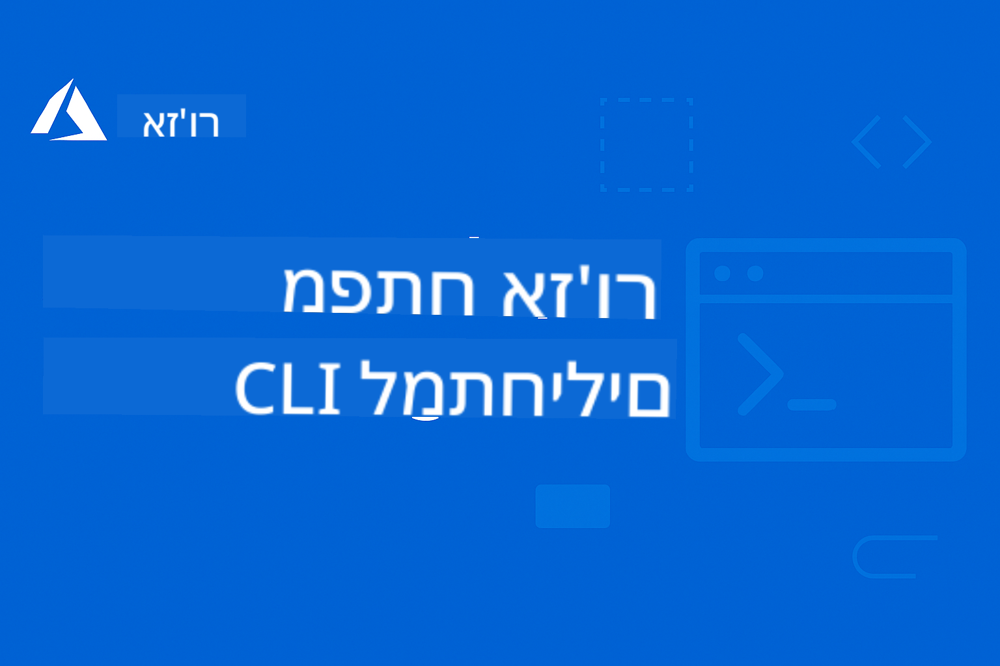

<!--
CO_OP_TRANSLATOR_METADATA:
{
  "original_hash": "7c5d2bb409800e22e74f34ee0ed12bed",
  "translation_date": "2025-12-17T14:41:40+00:00",
  "source_file": "README.md",
  "language_code": "he"
}
-->
# AZD למתחילים: מסע למידה מובנה

 

[](https://GitHub.com/microsoft/azd-for-beginners/watchers/)
[](https://GitHub.com/microsoft/azd-for-beginners/network/)
[](https://GitHub.com/microsoft/azd-for-beginners/stargazers/)

[](https://discord.gg/microsoft-azure)
[](https://discord.gg/nTYy5BXMWG)

## התחלה עם הקורס הזה

עקבו אחר השלבים הבאים כדי להתחיל את מסע הלמידה שלכם ב-AZD:

1. **פיצול המאגר**: לחצו [](https://GitHub.com/microsoft/azd-for-beginners/fork)
2. **שכפול המאגר**: `git clone https://github.com/microsoft/azd-for-beginners.git`
3. **הצטרפות לקהילה**: [קהילות Azure Discord](https://discord.com/invite/ByRwuEEgH4) לתמיכה מקצועית
4. **בחרו את מסלול הלמידה שלכם**: בחרו פרק למטה שמתאים לרמת הניסיון שלכם

### תמיכה בריבוי שפות

#### תרגומים אוטומטיים (תמיד מעודכנים)

<!-- CO-OP TRANSLATOR LANGUAGES TABLE START -->
[ערבית](../ar/README.md) | [בנגלית](../bn/README.md) | [בולגרית](../bg/README.md) | [בורמזית (מיאנמר)](../my/README.md) | [סינית (מפושטת)](../zh/README.md) | [סינית (מסורתית, הונג קונג)](../hk/README.md) | [סינית (מסורתית, מקאו)](../mo/README.md) | [סינית (מסורתית, טייוואן)](../tw/README.md) | [קרואטית](../hr/README.md) | [צ'כית](../cs/README.md) | [דנית](../da/README.md) | [הולנדית](../nl/README.md) | [אסטונית](../et/README.md) | [פינית](../fi/README.md) | [צרפתית](../fr/README.md) | [גרמנית](../de/README.md) | [יוונית](../el/README.md) | [עברית](./README.md) | [הינדי](../hi/README.md) | [הונגרית](../hu/README.md) | [אינדונזית](../id/README.md) | [איטלקית](../it/README.md) | [יפנית](../ja/README.md) | [קנדה](../kn/README.md) | [קוריאנית](../ko/README.md) | [ליטאית](../lt/README.md) | [מלאית](../ms/README.md) | [מלאיאלאם](../ml/README.md) | [מרטהי](../mr/README.md) | [נפאלית](../ne/README.md) | [פידג'ין ניגרי](../pcm/README.md) | [נורווגית](../no/README.md) | [פרסית (פרסי)](../fa/README.md) | [פולנית](../pl/README.md) | [פורטוגזית (ברזיל)](../br/README.md) | [פורטוגזית (פורטוגל)](../pt/README.md) | [פונג'אבי (גורמוכי)](../pa/README.md) | [רומנית](../ro/README.md) | [רוסית](../ru/README.md) | [סרבית (קירילית)](../sr/README.md) | [סלובקית](../sk/README.md) | [סלובנית](../sl/README.md) | [ספרדית](../es/README.md) | [סווהילית](../sw/README.md) | [שוודית](../sv/README.md) | [טגלוג (פיליפינית)](../tl/README.md) | [טמילית](../ta/README.md) | [טלוגו](../te/README.md) | [תאית](../th/README.md) | [טורקית](../tr/README.md) | [אוקראינית](../uk/README.md) | [אורדו](../ur/README.md) | [וייטנאמית](../vi/README.md)
<!-- CO-OP TRANSLATOR LANGUAGES TABLE END -->

## סקירת הקורס

שלוט ב-Azure Developer CLI (azd) דרך פרקים מובנים שנועדו ללמידה הדרגתית. **מיקוד מיוחד בפריסת יישומי AI עם אינטגרציה של Microsoft Foundry.**

### מדוע הקורס הזה חיוני למפתחים מודרניים

בהתבסס על תובנות מקהילת Microsoft Foundry ב-Discord, **45% מהמפתחים רוצים להשתמש ב-AZD לעומסי עבודה של AI** אך נתקלים באתגרים כמו:
- ארכיטקטורות AI מורכבות עם שירותים מרובים
- שיטות עבודה מומלצות לפריסת AI בסביבת ייצור  
- אינטגרציה והגדרת שירותי Azure AI
- אופטימיזציה של עלויות לעומסי עבודה של AI
- פתרון בעיות ספציפיות לפריסת AI

### מטרות הלמידה

בסיום הקורס המובנה הזה, תוכלו:
- **לשלוט ביסודות AZD**: מושגים מרכזיים, התקנה והגדרה
- **לפרוס יישומי AI**: שימוש ב-AZD עם שירותי Microsoft Foundry
- **ליישם תשתית כקוד**: ניהול משאבי Azure עם תבניות Bicep
- **לטפל בבעיות פריסה**: פתרון תקלות ו-debugging
- **לאופטם לייצור**: אבטחה, סקיילינג, ניטור וניהול עלויות
- **לבנות פתרונות מרובי סוכנים**: פריסת ארכיטקטורות AI מורכבות

## 📚 פרקי למידה

*בחרו את מסלול הלמידה שלכם בהתאם לרמת הניסיון והמטרות*

### 🚀 פרק 1: יסודות והתחלה מהירה
**דרישות מוקדמות**: מנוי Azure, ידע בסיסי בשורת הפקודה  
**משך זמן**: 30-45 דקות  
**מורכבות**: ⭐

#### מה תלמדו
- הבנת יסודות Azure Developer CLI
- התקנת AZD על הפלטפורמה שלכם
- הפריסה הראשונה המוצלחת שלכם

#### משאבי למידה
- **🎯 התחילו כאן**: [מהו Azure Developer CLI?](../..)
- **📖 תיאוריה**: [יסודות AZD](docs/getting-started/azd-basics.md) - מושגים מרכזיים וטרמינולוגיה
- **⚙️ התקנה**: [התקנה והגדרה](docs/getting-started/installation.md) - מדריכים לפי פלטפורמה
- **🛠️ תרגול מעשי**: [הפרויקט הראשון שלך](docs/getting-started/first-project.md) - מדריך שלב-אחר-שלב
- **📋 הפניה מהירה**: [גליון פקודות](resources/cheat-sheet.md)

#### תרגילים מעשיים
```bash
# בדיקת התקנה מהירה
azd version

# פרוס את היישום הראשון שלך
azd init --template todo-nodejs-mongo
azd up
```

**💡 תוצאת הפרק**: פריסת יישום ווב פשוט ל-Azure באמצעות AZD בהצלחה

**✅ אימות הצלחה:**
```bash
# לאחר סיום פרק 1, עליך להיות מסוגל:
azd version              # מציג את הגרסה המותקנת
azd init --template todo-nodejs-mongo  # מאתחל את הפרויקט
azd up                  # מפרסם ל-Azure
azd show                # מציג את כתובת ה-URL של האפליקציה הפועלת
# האפליקציה נפתחת בדפדפן ופועלת
azd down --force --purge  # מנקה משאבים
```

**📊 זמן השקעה:** 30-45 דקות  
**📈 רמת מיומנות לאחר:** יכול לפרוס יישומים בסיסיים באופן עצמאי

**✅ אימות הצלחה:**
```bash
# לאחר סיום פרק 1, עליך להיות מסוגל:
azd version              # מציג את הגרסה המותקנת
azd init --template todo-nodejs-mongo  # מאתחל את הפרויקט
azd up                  # מפרסם ל-Azure
azd show                # מציג את כתובת ה-URL של האפליקציה הפועלת
# האפליקציה נפתחת בדפדפן ופועלת
azd down --force --purge  # מנקה משאבים
```

**📊 זמן השקעה:** 30-45 דקות  
**📈 רמת מיומנות לאחר:** יכול לפרוס יישומים בסיסיים באופן עצמאי

---

### 🤖 פרק 2: פיתוח מונחה AI (מומלץ למפתחי AI)
**דרישות מוקדמות**: פרק 1 הושלם  
**משך זמן**: 1-2 שעות  
**מורכבות**: ⭐⭐

#### מה תלמדו
- אינטגרציה של Microsoft Foundry עם AZD
- פריסת יישומים מונעי AI
- הבנת הגדרות שירותי AI

#### משאבי למידה
- **🎯 התחילו כאן**: [אינטגרציה עם Microsoft Foundry](docs/microsoft-foundry/microsoft-foundry-integration.md)
- **📖 דפוסים**: [פריסת מודל AI](docs/microsoft-foundry/ai-model-deployment.md) - פריסה וניהול מודלים של AI
- **🛠️ סדנה**: [מעבדת סדנת AI](docs/microsoft-foundry/ai-workshop-lab.md) - הפכו את פתרונות ה-AI שלכם למוכנים ל-AZD
- **🎥 מדריך אינטראקטיבי**: [חומרי הסדנה](workshop/README.md) - למידה בדפדפן עם MkDocs * סביבה DevContainer
- **📋 תבניות**: [תבניות Microsoft Foundry](../..)
- **📝 דוגמאות**: [דוגמאות לפריסת AZD](examples/README.md)

#### תרגילים מעשיים
```bash
# פרוס את יישום ה-AI הראשון שלך
azd init --template azure-search-openai-demo
azd up

# נסה תבניות AI נוספות
azd init --template openai-chat-app-quickstart
azd init --template agent-openai-python-prompty
```

**💡 תוצאת הפרק**: פריסה והגדרה של יישום צ'אט מונע AI עם יכולות RAG

**✅ אימות הצלחה:**
```bash
# לאחר פרק 2, תוכל ל:
azd init --template azure-search-openai-demo
azd up
# לבדוק את ממשק הצ'אט של ה-AI
# לשאול שאלות ולקבל תגובות מונעות בינה מלאכותית עם מקורות
# לאמת שהאינטגרציה עם החיפוש פועלת
azd monitor  # לבדוק ש-Application Insights מציג טלמטריה
azd down --force --purge
```

**📊 זמן השקעה:** 1-2 שעות  
**📈 רמת מיומנות לאחר:** יכול לפרוס ולהגדיר יישומי AI מוכנים לייצור  
**💰 מודעות לעלות:** הבנת עלויות פיתוח של $80-150 לחודש, ועלויות ייצור של $300-3500 לחודש

#### 💰 שיקולי עלות לפריסות AI

**סביבת פיתוח (הערכה $80-150 לחודש):**
- Azure OpenAI (תשלום לפי שימוש): $0-50 לחודש (בהתאם לשימוש בטוקנים)
- AI Search (רמה בסיסית): $75 לחודש
- Container Apps (צריכה): $0-20 לחודש
- אחסון (סטנדרטי): $1-5 לחודש

**סביבת ייצור (הערכה $300-3,500+/חודש):**
- Azure OpenAI (PTU לביצועים עקביים): $3,000+/חודש או תשלום לפי שימוש עם נפח גבוה
- AI Search (רמה סטנדרטית): $250 לחודש
- Container Apps (ייעודי): $50-100 לחודש
- Application Insights: $5-50 לחודש
- אחסון (פרימיום): $10-50 לחודש

**💡 טיפים לאופטימיזציה של עלויות:**
- השתמשו ב-**רמת חינם** של Azure OpenAI ללמידה (כולל 50,000 טוקנים לחודש)
- הריצו `azd down` כדי לשחרר משאבים כשאינכם מפתחים פעיל
- התחילו בחיוב מבוסס צריכה, שדרגו ל-PTU רק לייצור
- השתמשו ב-`azd provision --preview` להערכת עלויות לפני פריסה
- אפשרו סקיילינג אוטומטי: שלמו רק על השימוש בפועל

**ניטור עלויות:**
```bash
# בדוק עלויות חודשיות מוערכות
azd provision --preview

# עקוב אחר עלויות בפועל בפורטל Azure
az consumption budget list --resource-group <your-rg>
```

---

### ⚙️ פרק 3: הגדרה ואימות זהות
**דרישות מוקדמות**: פרק 1 הושלם  
**משך זמן**: 45-60 דקות  
**מורכבות**: ⭐⭐

#### מה תלמדו
- הגדרה וניהול סביבות
- אימות זהות ושיטות אבטחה מומלצות
- שמות וארגון משאבים

#### משאבי למידה
- **📖 הגדרה**: [מדריך הגדרה](docs/getting-started/configuration.md) - הגדרת סביבה
- **🔐 אבטחה**: [דפוסי אימות וזהות מנוהלת](docs/getting-started/authsecurity.md) - דפוסי אימות
- **📝 דוגמאות**: [דוגמת אפליקציית מסד נתונים](examples/database-app/README.md) - דוגמאות מסד נתונים ב-AZD

#### תרגילים מעשיים
- הגדרת סביבות מרובות (פיתוח, בדיקה, ייצור)
- הקמת אימות זהות מנוהלת
- יישום הגדרות ייחודיות לסביבה

**💡 תוצאת הפרק**: ניהול סביבות מרובות עם אימות ואבטחה נכונים

---

### 🏗️ פרק 4: תשתית כקוד ופריסה
**דרישות מוקדמות**: פרקים 1-3 הושלמו  
**משך זמן**: 1-1.5 שעות  
**מורכבות**: ⭐⭐⭐

#### מה תלמדו
- דפוסי פריסה מתקדמים
- תשתית כקוד עם Bicep
- אסטרטגיות פריסת משאבים

#### משאבי למידה
- **📖 פריסה**: [מדריך פריסה](docs/deployment/deployment-guide.md) - זרימות עבודה מלאות
- **🏗️ פרוביז'ן**: [ניהול משאבי Azure](docs/deployment/provisioning.md) - ניהול משאבים
- **📝 דוגמאות**: [דוגמת Container App](../../examples/container-app) - פריסות מכולות

#### תרגילים מעשיים
- יצירת תבניות Bicep מותאמות אישית
- פריסת יישומים עם שירותים מרובים
- יישום אסטרטגיות פריסה כחולה-ירוקה

**💡 תוצאת הפרק**: פריסת יישומים מורכבים עם שירותים מרובים באמצעות תבניות תשתית מותאמות

---

### 🎯 פרק 5: פתרונות AI מרובי סוכנים (מתקדם)
**דרישות מוקדמות**: פרקים 1-2 הושלמו  
**משך זמן**: 2-3 שעות  
**מורכבות**: ⭐⭐⭐⭐

#### מה תלמדו
- דפוסי ארכיטקטורת מרובי סוכנים
- תיאום ואורקסטרציה של סוכנים
- פריסות AI מוכנות לייצור

#### משאבי למידה
- **🤖 פרויקט מובלט**: [פתרון AI מרובי סוכנים בקמעונאות](examples/retail-scenario.md) - יישום מלא
- **🛠️ תבניות ARM**: [ARM Template Package](../../examples/retail-multiagent-arm-template) - פריסה בלחיצה אחת  
- **📖 ארכיטקטורה**: [תבניות תיאום רב-סוכנים](/docs/pre-deployment/coordination-patterns.md) - תבניות

#### תרגילים מעשיים  
```bash
# פרוס את הפתרון המלא של סוכני קמעונאות מרובים
cd examples/retail-multiagent-arm-template
./deploy.sh

# חקור תצורות סוכן
az deployment group show --resource-group <rg-name> --name <deployment-name>
```
  
**💡 תוצאת הפרק**: פריסה וניהול של פתרון AI רב-סוכנים מוכן לייצור עם סוכני לקוחות ומלאי

---

### 🔍 פרק 6: אימות ותכנון לפני פריסה  
**דרישות מוקדמות**: פרק 4 הושלם  
**משך**: שעה  
**מורכבות**: ⭐⭐

#### מה תלמדו  
- תכנון קיבולת ואימות משאבים  
- אסטרטגיות בחירת SKU  
- בדיקות טרום-טיסה ואוטומציה

#### משאבי למידה  
- **📊 תכנון**: [תכנון קיבולת](docs/pre-deployment/capacity-planning.md) - אימות משאבים  
- **💰 בחירה**: [בחירת SKU](docs/pre-deployment/sku-selection.md) - בחירות חסכוניות  
- **✅ אימות**: [בדיקות טרום-טיסה](docs/pre-deployment/preflight-checks.md) - סקריפטים אוטומטיים

#### תרגילים מעשיים  
- הרצת סקריפטים לאימות קיבולת  
- אופטימיזציה של בחירות SKU לחיסכון בעלויות  
- יישום בדיקות טרום-פריסה אוטומטיות

**💡 תוצאת הפרק**: לאמת ולאופטם פריסות לפני ביצוע

---

### 🚨 פרק 7: פתרון תקלות ודיבוג  
**דרישות מוקדמות**: כל פרק פריסה שהושלם  
**משך**: 1-1.5 שעות  
**מורכבות**: ⭐⭐

#### מה תלמדו  
- גישות שיטתיות לדיבוג  
- בעיות נפוצות ופתרונות  
- פתרון תקלות ספציפי ל-AI

#### משאבי למידה  
- **🔧 בעיות נפוצות**: [בעיות נפוצות](docs/troubleshooting/common-issues.md) - שאלות נפוצות ופתרונות  
- **🕵️ דיבוג**: [מדריך דיבוג](docs/troubleshooting/debugging.md) - אסטרטגיות שלב-אחר-שלב  
- **🤖 בעיות AI**: [פתרון תקלות AI](docs/troubleshooting/ai-troubleshooting.md) - בעיות שירותי AI

#### תרגילים מעשיים  
- אבחון כשלי פריסה  
- פתרון בעיות אימות  
- דיבוג חיבור לשירותי AI

**💡 תוצאת הפרק**: לאבחן ולפתור באופן עצמאי בעיות פריסה נפוצות

---

### 🏢 פרק 8: תבניות ייצור וארגוניות  
**דרישות מוקדמות**: פרקים 1-4 הושלמו  
**משך**: 2-3 שעות  
**מורכבות**: ⭐⭐⭐⭐

#### מה תלמדו  
- אסטרטגיות פריסת ייצור  
- תבניות אבטחה ארגוניות  
- ניטור ואופטימיזציה של עלויות

#### משאבי למידה  
- **🏭 ייצור**: [שיטות עבודה מומלצות ל-AI בייצור](docs/microsoft-foundry/production-ai-practices.md) - תבניות ארגוניות  
- **📝 דוגמאות**: [דוגמת מיקרו-שירותים](../../examples/microservices) - ארכיטקטורות מורכבות  
- **📊 ניטור**: [אינטגרציית Application Insights](docs/pre-deployment/application-insights.md) - ניטור

#### תרגילים מעשיים  
- יישום תבניות אבטחה ארגוניות  
- הקמת ניטור מקיף  
- פריסה לייצור עם ממשל תקין

**💡 תוצאת הפרק**: לפרוס יישומים מוכנים לארגון עם יכולות ייצור מלאות

---

## 🎓 סקירת סדנה: חווית למידה מעשית

> **⚠️ מצב הסדנה: בפיתוח פעיל**  
> חומרי הסדנה נמצאים בפיתוח ושיפור מתמיד. מודולים מרכזיים פעילים, אך חלק מהחלקים המתקדמים אינם שלמים. אנו עובדים במרץ להשלים את כל התוכן. [עקבו אחרי ההתקדמות →](workshop/README.md)

### חומרי סדנה אינטראקטיביים  
**למידה מעשית מקיפה עם כלים בדפדפן ותרגילים מודרכים**

חומרי הסדנה שלנו מספקים חווית למידה אינטראקטיבית ומובנית המשלים את תוכנית הלימודים מבוססת הפרקים לעיל. הסדנה מיועדת ללמידה בקצב עצמי ולמפגשים בהנחיית מדריך.

#### 🛠️ תכונות הסדנה  
- **ממשק מבוסס דפדפן**: סדנת MkDocs מלאה עם חיפוש, העתקה ותכונות נושא  
- **אינטגרציית GitHub Codespaces**: הקמת סביבת פיתוח בלחיצה אחת  
- **מסלול למידה מובנה**: 7 תרגילים מודרכים (סה"כ 3.5 שעות)  
- **גילוי → פריסה → התאמה אישית**: מתודולוגיה מתקדמת  
- **סביבת DevContainer אינטראקטיבית**: כלים ותלויות מוגדרים מראש

#### 📚 מבנה הסדנה  
הסדנה פועלת לפי מתודולוגיית **גילוי → פריסה → התאמה אישית**:

1. **שלב הגילוי** (45 דקות)  
   - חקר תבניות ושירותי Microsoft Foundry  
   - הבנת תבניות ארכיטקטורה רב-סוכנית  
   - סקירת דרישות ודרישות מוקדמות לפריסה

2. **שלב הפריסה** (שעתיים)  
   - פריסה מעשית של יישומי AI עם AZD  
   - קונפיגורציית שירותי Azure AI ונקודות קצה  
   - יישום תבניות אבטחה ואימות

3. **שלב ההתאמה האישית** (45 דקות)  
   - שינוי יישומים למקרי שימוש ספציפיים  
   - אופטימיזציה לפריסת ייצור  
   - יישום ניטור וניהול עלויות

#### 🚀 התחלה עם הסדנה  
```bash
# אפשרות 1: GitHub Codespaces (מומלץ)
# לחץ על "Code" → "Create codespace on main" במאגר

# אפשרות 2: פיתוח מקומי
git clone https://github.com/microsoft/azd-for-beginners.git
cd azd-for-beginners/workshop
# עקוב אחר הוראות ההתקנה ב-workshop/README.md
```
  
#### 🎯 תוצאות למידה בסדנה  
עם השלמת הסדנה, המשתתפים יוכלו:  
- **לפרוס יישומי AI לייצור**: שימוש ב-AZD עם שירותי Microsoft Foundry  
- **להתמחות בארכיטקטורות רב-סוכנים**: יישום פתרונות סוכני AI מתואמים  
- **ליישם שיטות אבטחה מיטביות**: קונפיגורציית אימות ושליטה בגישה  
- **לאופטם להיקף**: תכנון פריסות חסכוניות וביצועיות  
- **לפתור תקלות בפריסות**: פתרון בעיות נפוצות באופן עצמאי

#### 📖 משאבי הסדנה  
- **🎥 מדריך אינטראקטיבי**: [חומרי הסדנה](workshop/README.md) - סביבת למידה בדפדפן  
- **📋 הוראות שלב-אחר-שלב**: [תרגילים מודרכים](../../workshop/docs/instructions) - הסברים מפורטים  
- **🛠️ מעבדת סדנת AI**: [מעבדת סדנת AI](docs/microsoft-foundry/ai-workshop-lab.md) - תרגילים ממוקדי AI  
- **💡 התחלה מהירה**: [מדריך הגדרת סדנה](workshop/README.md#quick-start) - קונפיגורציית סביבה

**מתאים ל**: הכשרות ארגוניות, קורסים אקדמיים, למידה עצמאית ובוטקאמפים למפתחים.

---

## 📖 מהו Azure Developer CLI?

Azure Developer CLI (azd) הוא ממשק שורת פקודה ממוקד מפתח שמאיץ את תהליך בניית ופריסת יישומים ל-Azure. הוא מספק:

- **פריסות מבוססות תבניות** - שימוש בתבניות מוכנות לתבניות יישום נפוצות  
- **תשתית כקוד** - ניהול משאבי Azure באמצעות Bicep או Terraform  
- **זרימות עבודה משולבות** - פריסה, ניהול וניטור חלקים של יישומים  
- **ידידותי למפתח** - מותאם לפרודוקטיביות וחוויית מפתח

### **AZD + Microsoft Foundry: מושלם לפריסות AI**

**למה AZD לפתרונות AI?** AZD מתמודד עם האתגרים המרכזיים של מפתחי AI:

- **תבניות מוכנות ל-AI** - תבניות מוגדרות מראש ל-Azure OpenAI, Cognitive Services ועומסי עבודה של ML  
- **פריסות AI מאובטחות** - תבניות אבטחה מובנות לשירותי AI, מפתחות API ונקודות קצה של מודלים  
- **תבניות AI לייצור** - שיטות עבודה מומלצות לפריסות AI חסכוניות וסקלאביליות  
- **זרימות עבודה מקצה לקצה ל-AI** - מפיתוח מודל ועד פריסה עם ניטור תקין  
- **אופטימיזציה של עלויות** - הקצאת משאבים חכמה ואסטרטגיות סקיילינג לעומסי AI  
- **אינטגרציה עם Microsoft Foundry** - חיבור חלק לקטלוג מודלים ונקודות קצה של Microsoft Foundry

---

## 🎯 ספריית תבניות ודוגמאות

### מובלט: תבניות Microsoft Foundry  
**התחילו כאן אם אתם מפרסים יישומי AI!**

> **הערה:** תבניות אלו מדגימות תבניות AI שונות. חלקן דוגמאות חיצוניות של Azure, אחרות יישומים מקומיים.

| תבנית | פרק | מורכבות | שירותים | סוג |
|----------|---------|------------|----------|------|
| [**התחילו עם צ'אט AI**](https://github.com/Azure-Samples/get-started-with-ai-chat) | פרק 2 | ⭐⭐ | AzureOpenAI + Azure AI Model Inference API + Azure AI Search + Azure Container Apps + Application Insights | חיצוני |
| [**התחילו עם סוכני AI**](https://github.com/Azure-Samples/get-started-with-ai-agents) | פרק 2 | ⭐⭐ | Azure AI Agent Service + AzureOpenAI + Azure AI Search + Azure Container Apps + Application Insights| חיצוני |
| [**דמו Azure Search + OpenAI**](https://github.com/Azure-Samples/azure-search-openai-demo) | פרק 2 | ⭐⭐ | AzureOpenAI + Azure AI Search + App Service + Storage | חיצוני |
| [**התחלת מהירה לאפליקציית צ'אט OpenAI**](https://github.com/Azure-Samples/openai-chat-app-quickstart) | פרק 2 | ⭐ | AzureOpenAI + Container Apps + Application Insights | חיצוני |
| [**Agent OpenAI Python Prompty**](https://github.com/Azure-Samples/agent-openai-python-prompty) | פרק 5 | ⭐⭐⭐ | AzureOpenAI + Azure Functions + Prompty | חיצוני |
| [**Contoso Chat RAG**](https://github.com/Azure-Samples/contoso-chat) | פרק 8 | ⭐⭐⭐⭐ | AzureOpenAI + AI Search + Cosmos DB + Container Apps | חיצוני |
| [**פתרון רב-סוכנים קמעונאי**](examples/retail-scenario.md) | פרק 5 | ⭐⭐⭐⭐ | AzureOpenAI + AI Search + Storage + Container Apps + Cosmos DB | **מקומי** |

### מובלט: תרחישי למידה שלמים  
**תבניות יישום מוכנות לייצור הממופות לפרקי למידה**

| תבנית | פרק למידה | מורכבות | מפתח למידה |
|----------|------------------|------------|--------------|
| [**openai-chat-app-quickstart**](https://github.com/Azure-Samples/openai-chat-app-quickstart) | פרק 2 | ⭐ | תבניות פריסת AI בסיסיות |
| [**azure-search-openai-demo**](https://github.com/Azure-Samples/azure-search-openai-demo) | פרק 2 | ⭐⭐ | יישום RAG עם Azure AI Search |
| [**ai-document-processing**](https://github.com/Azure-Samples/ai-document-processing) | פרק 4 | ⭐⭐ | אינטגרציית בינה תיעודית |
| [**agent-openai-python-prompty**](https://github.com/Azure-Samples/agent-openai-python-prompty) | פרק 5 | ⭐⭐⭐ | מסגרת סוכנים וקריאות פונקציות |
| [**contoso-chat**](https://github.com/Azure-Samples/contoso-chat) | פרק 8 | ⭐⭐⭐ | תזמור AI ארגוני |
| [**retail-multi-agent-solution**](examples/retail-scenario.md) | פרק 5 | ⭐⭐⭐⭐ | ארכיטקטורת רב-סוכנים עם סוכני לקוחות ומלאי |

### למידה לפי סוג דוגמה

> **📌 דוגמאות מקומיות לעומת חיצוניות:**  
> **דוגמאות מקומיות** (בריפו זה) = מוכנות לשימוש מיידי  
> **דוגמאות חיצוניות** (דוגמאות Azure) = לשכפל מהריפוזיטוריות המקושרות

#### דוגמאות מקומיות (מוכנות לשימוש)  
- [**פתרון רב-סוכנים קמעונאי**](examples/retail-scenario.md) - יישום מלא מוכן לייצור עם תבניות ARM  
  - ארכיטקטורת רב-סוכנים (לקוח + מלאי)  
  - ניטור והערכה מקיפים  
  - פריסה בלחיצה אחת דרך תבנית ARM

#### דוגמאות מקומיות - אפליקציות מכולות (פרקים 2-5)  
**דוגמאות פריסה מקיפות של מכולות בריפו זה:**  
- [**דוגמאות אפליקציות מכולות**](examples/container-app/README.md) - מדריך מלא לפריסות מכולות  
  - [API Flask פשוט](../../examples/container-app/simple-flask-api) - REST API בסיסי עם סקייל לאפס  
  - [ארכיטקטורת מיקרו-שירותים](../../examples/container-app/microservices) - פריסת רב-שירותים מוכנה לייצור  
  - תבניות התחלה מהירה, ייצור ומתקדמות  
  - הנחיות לניטור, אבטחה ואופטימיזציה של עלויות

#### דוגמאות חיצוניות - אפליקציות פשוטות (פרקים 1-2)  
**שכפלו את ריפוזיטוריות דוגמאות Azure הבאות כדי להתחיל:**  
- [אפליקציית ווב פשוטה - Node.js + MongoDB](https://github.com/Azure-Samples/todo-nodejs-mongo) - תבניות פריסה בסיסיות  
- [אתר סטטי - React SPA](https://github.com/Azure-Samples/todo-csharp-sql-swa-func) - פריסת תוכן סטטי  
- [אפליקציית מכולות - Python Flask](https://github.com/Azure-Samples/container-apps-store-api-microservice) - פריסת REST API

#### דוגמאות חיצוניות - אינטגרציית מסד נתונים (פרקים 3-4)  
- [אפליקציית מסד נתונים - C# + SQL](https://github.com/Azure-Samples/todo-csharp-sql) - תבניות חיבור למסד נתונים  
- [פונקציות + Cosmos DB](https://github.com/Azure-Samples/todo-python-mongo-swa-func) - זרימת עבודה ללא שרת

#### דוגמאות חיצוניות - תבניות מתקדמות (פרקים 4-8)  
- [מיקרו-שירותים ב-Java](https://github.com/Azure-Samples/java-microservices-aca-lab) - ארכיטקטורות רב-שירותיות  
- [עבודות Container Apps](https://github.com/Azure-Samples/container-apps-jobs) - עיבוד ברקע  
- [צינור ML ארגוני](https://github.com/Azure-Samples/mlops-v2) - תבניות ML מוכנות לייצור

### אוספי תבניות חיצוניים  
- [**גלריית תבניות רשמית של AZD**](https://azure.github.io/awesome-azd/) - אוסף מתומצת של תבניות רשמיות וקהילתיות  
- [**תבניות Azure Developer CLI**](https://learn.microsoft.com/en-us/azure/developer/azure-developer-cli/azd-templates) - תיעוד תבניות Microsoft Learn  
- [**ספריית דוגמאות**](examples/README.md) - דוגמאות למידה מקומיות עם הסברים מפורטים

---

## 📚 משאבי למידה והפניות

### הפניות מהירות
- [**גליון פקודות**](resources/cheat-sheet.md) - פקודות azd חיוניות מאורגנות לפי פרק  
- [**מילון מונחים**](resources/glossary.md) - מונחים של Azure ו-azd  
- [**שאלות נפוצות**](resources/faq.md) - שאלות נפוצות מאורגנות לפי פרק לימוד  
- [**מדריך לימוד**](resources/study-guide.md) - תרגולים מעשיים מקיפים  

### סדנאות מעשיות  
- [**מעבדת סדנת AI**](docs/microsoft-foundry/ai-workshop-lab.md) - הפוך את פתרונות ה-AI שלך לניתנים לפריסה עם AZD (שעתיים-שלוש)  
- [**מדריך סדנה אינטראקטיבי**](workshop/README.md) - סדנה מבוססת דפדפן עם MkDocs וסביבת DevContainer  
- [**מסלול לימוד מובנה**](../../workshop/docs/instructions) - תרגולים מודרכים ב-7 שלבים (גילוי → פריסה → התאמה אישית)  
- [**סדנת AZD למתחילים**](workshop/README.md) - חומרי סדנה מעשית מלאים עם אינטגרציה ל-GitHub Codespaces  

### משאבי לימוד חיצוניים  
- [תיעוד Azure Developer CLI](https://learn.microsoft.com/en-us/azure/developer/azure-developer-cli/)  
- [מרכז הארכיטקטורה של Azure](https://learn.microsoft.com/en-us/azure/architecture/)  
- [מחשבון תמחור Azure](https://azure.microsoft.com/pricing/calculator/)  
- [סטטוס Azure](https://status.azure.com/)  

---

## 🔧 מדריך פתרון בעיות מהיר

**בעיות נפוצות שמתחילים נתקלים בהן ופתרונות מיידיים:**  

### ❌ "azd: פקודה לא נמצאה"

```bash
# התקן את AZD תחילה
# Windows (PowerShell):
winget install microsoft.azd

# macOS:
brew tap azure/azd && brew install azd

# Linux:
curl -fsSL https://aka.ms/install-azd.sh | bash

# אמת את ההתקנה
azd version
```
  
### ❌ "לא נמצאה מנוי" או "המנוי לא הוגדר"

```bash
# רשום מנויים זמינים
az account list --output table

# הגדר מנוי ברירת מחדל
az account set --subscription "<subscription-id-or-name>"

# הגדר לסביבת AZD
azd env set AZURE_SUBSCRIPTION_ID "<subscription-id>"

# אמת
az account show
```
  
### ❌ "InsufficientQuota" או "חריגה מהמכסה"

```bash
# נסה אזור Azure שונה
azd env set AZURE_LOCATION "westus2"
azd up

# או השתמש ב-SKU קטנים יותר בפיתוח
# ערוך את infra/main.parameters.json:
{
  "sku": "B1"  // Instead of "P1V2"
}
```
  
### ❌ "azd up" נכשל באמצע התהליך

```bash
# אפשרות 1: לנקות ולנסות שוב
azd down --force --purge
azd up

# אפשרות 2: לתקן רק את התשתית
azd provision

# אפשרות 3: לבדוק יומנים מפורטים
azd show
azd logs
```
  
### ❌ "אימות נכשל" או "הטוקן פג תוקף"

```bash
# לאמת מחדש
az logout
az login

azd auth logout
azd auth login

# לאמת את האימות
az account show
```
  
### ❌ "המשאב כבר קיים" או קונפליקטים בשמות

```bash
# AZD מייצר שמות ייחודיים, אבל אם יש התנגשות:
azd down --force --purge

# אז נסה שוב עם סביבה חדשה
azd env new dev-v2
azd up
```
  
### ❌ פריסת תבנית לוקחת יותר מדי זמן

**זמני המתנה רגילים:**  
- אפליקציית ווב פשוטה: 5-10 דקות  
- אפליקציה עם בסיס נתונים: 10-15 דקות  
- יישומי AI: 15-25 דקות (הקצאת OpenAI איטית)  

```bash
# בדוק התקדמות
azd show

# אם תקוע יותר מ-30 דקות, בדוק את פורטל Azure:
azd monitor
# חפש פריסות שנכשלו
```
  
### ❌ "הרשאה נדחתה" או "אסור"

```bash
# בדוק את התפקיד שלך ב-Azure
az role assignment list --assignee $(az account show --query user.name -o tsv)

# אתה צריך לפחות את התפקיד "תורם"
# בקש ממנהל ה-Azure שלך להעניק:
# - תורם (למשאבים)
# - מנהל גישת משתמשים (להקצאות תפקידים)
```
  
### ❌ לא מצליחים למצוא את כתובת ה-URL של האפליקציה שפורסה

```bash
# הצג את כל נקודות הקצה של השירות
azd show

# או פתח את פורטל Azure
azd monitor

# בדוק שירות ספציפי
azd env get-values
# חפש משתני *_URL
```
  
### 📚 משאבים מלאים לפתרון בעיות  

- **מדריך בעיות נפוצות:** [פתרונות מפורטים](docs/troubleshooting/common-issues.md)  
- **בעיות ספציפיות ל-AI:** [פתרון בעיות AI](docs/troubleshooting/ai-troubleshooting.md)  
- **מדריך דיבוג:** [דיבוג שלב אחר שלב](docs/troubleshooting/debugging.md)  
- **קבל עזרה:** [Azure Discord](https://discord.gg/microsoft-azure) #azure-developer-cli  

---

## 🔧 מדריך פתרון בעיות מהיר

**בעיות נפוצות שמתחילים נתקלים בהן ופתרונות מיידיים:**  

<details>  
<summary><strong>❌ "azd: פקודה לא נמצאה"</strong></summary>  

```bash
# התקן את AZD תחילה
# Windows (PowerShell):
winget install microsoft.azd

# macOS:
brew tap azure/azd && brew install azd

# Linux:
curl -fsSL https://aka.ms/install-azd.sh | bash

# אמת את ההתקנה
azd version
```
</details>  

<details>  
<summary><strong>❌ "לא נמצאה מנוי" או "המנוי לא הוגדר"</strong></summary>  

```bash
# רשום מנויים זמינים
az account list --output table

# הגדר מנוי ברירת מחדל
az account set --subscription "<subscription-id-or-name>"

# הגדר לסביבת AZD
azd env set AZURE_SUBSCRIPTION_ID "<subscription-id>"

# אמת
az account show
```
</details>  

<details>  
<summary><strong>❌ "InsufficientQuota" או "חריגה מהמכסה"</strong></summary>  

```bash
# נסה אזור Azure שונה
azd env set AZURE_LOCATION "westus2"
azd up

# או השתמש ב-SKU קטנים יותר בפיתוח
# ערוך את infra/main.parameters.json:
{
  "sku": "B1"  // Instead of "P1V2"
}
```
</details>  

<details>  
<summary><strong>❌ "azd up" נכשל באמצע התהליך</strong></summary>  

```bash
# אפשרות 1: לנקות ולנסות שוב
azd down --force --purge
azd up

# אפשרות 2: לתקן רק את התשתית
azd provision

# אפשרות 3: לבדוק יומנים מפורטים
azd show
azd logs
```
</details>  

<details>  
<summary><strong>❌ "אימות נכשל" או "הטוקן פג תוקף"</strong></summary>  

```bash
# לאמת מחדש
az logout
az login

azd auth logout
azd auth login

# לאמת את האימות
az account show
```
</details>  

<details>  
<summary><strong>❌ "המשאב כבר קיים" או קונפליקטים בשמות</strong></summary>  

```bash
# AZD מייצר שמות ייחודיים, אבל אם יש התנגשות:
azd down --force --purge

# אז נסה שוב עם סביבה חדשה
azd env new dev-v2
azd up
```
</details>  

<details>  
<summary><strong>❌ פריסת תבנית לוקחת יותר מדי זמן</strong></summary>  

**זמני המתנה רגילים:**  
- אפליקציית ווב פשוטה: 5-10 דקות  
- אפליקציה עם בסיס נתונים: 10-15 דקות  
- יישומי AI: 15-25 דקות (הקצאת OpenAI איטית)  

```bash
# בדוק התקדמות
azd show

# אם תקוע יותר מ-30 דקות, בדוק את פורטל Azure:
azd monitor
# חפש פריסות שנכשלו
```
</details>  

<details>  
<summary><strong>❌ "הרשאה נדחתה" או "אסור"</strong></summary>  

```bash
# בדוק את התפקיד שלך ב-Azure
az role assignment list --assignee $(az account show --query user.name -o tsv)

# אתה צריך לפחות את התפקיד "תורם"
# בקש ממנהל ה-Azure שלך להעניק:
# - תורם (למשאבים)
# - מנהל גישת משתמשים (להקצאות תפקידים)
```
</details>  

<details>  
<summary><strong>❌ לא מצליחים למצוא את כתובת ה-URL של האפליקציה שפורסה</strong></summary>  

```bash
# הצג את כל נקודות הקצה של השירות
azd show

# או פתח את פורטל Azure
azd monitor

# בדוק שירות ספציפי
azd env get-values
# חפש משתני *_URL
```
</details>  

### 📚 משאבים מלאים לפתרון בעיות  

- **מדריך בעיות נפוצות:** [פתרונות מפורטים](docs/troubleshooting/common-issues.md)  
- **בעיות ספציפיות ל-AI:** [פתרון בעיות AI](docs/troubleshooting/ai-troubleshooting.md)  
- **מדריך דיבוג:** [דיבוג שלב אחר שלב](docs/troubleshooting/debugging.md)  
- **קבל עזרה:** [Azure Discord](https://discord.gg/microsoft-azure) #azure-developer-cli  

---

## 🎓 סיום קורס והסמכה

### מעקב התקדמות  
עקוב אחרי התקדמות הלמידה שלך בכל פרק:  

- [ ] **פרק 1**: יסודות והתחלה מהירה ✅  
- [ ] **פרק 2**: פיתוח AI-ראשון ✅  
- [ ] **פרק 3**: קונפיגורציה ואימות ✅  
- [ ] **פרק 4**: תשתית כקוד ופריסה ✅  
- [ ] **פרק 5**: פתרונות AI מרובי סוכנים ✅  
- [ ] **פרק 6**: אימות ותכנון לפני פריסה ✅  
- [ ] **פרק 7**: פתרון בעיות ודיבוג ✅  
- [ ] **פרק 8**: דפוסי ייצור וארגוניים ✅  

### אימות למידה  
לאחר סיום כל פרק, אמת את הידע שלך על ידי:  
1. **תרגול מעשי**: סיים את הפריסה המעשית של הפרק  
2. **בדיקת ידע**: עיין בסעיף השאלות הנפוצות של הפרק  
3. **דיון בקהילה**: שתף את הניסיון שלך ב-Azure Discord  
4. **פרק הבא**: עבור לרמת המורכבות הבאה  

### יתרונות סיום הקורס  
בסיום כל הפרקים, תהיה לך:  
- **ניסיון ייצור**: פרסת יישומי AI אמיתיים ב-Azure  
- **כישורים מקצועיים**: יכולות פריסה מוכנות לארגון  
- **הכרה קהילתית**: חבר פעיל בקהילת מפתחי Azure  
- **קידום קריירה**: מומחיות מבוקשת בפריסת AZD ו-AI  

---

## 🤝 קהילה ותמיכה

### קבל עזרה ותמיכה  
- **בעיות טכניות**: [דווח על באגים ובקש תכונות](https://github.com/microsoft/azd-for-beginners/issues)  
- **שאלות לימוד**: [קהילת Microsoft Azure Discord](https://discord.gg/microsoft-azure) ו-[](https://discord.gg/nTYy5BXMWG)  
- **עזרה ספציפית ל-AI**: הצטרף ל-[](https://discord.gg/nTYy5BXMWG)  
- **תיעוד**: [תיעוד רשמי של Azure Developer CLI](https://learn.microsoft.com/en-us/azure/developer/azure-developer-cli/)  

### תובנות קהילתיות מ-Microsoft Foundry Discord  

**תוצאות סקר אחרון בערוץ #Azure:**  
- **45%** מהמפתחים רוצים להשתמש ב-AZD לעומסי עבודה של AI  
- **האתגרים המובילים**: פריסות מרובות שירותים, ניהול אישורים, מוכנות לייצור  
- **הבקשות הנפוצות ביותר**: תבניות ספציפיות ל-AI, מדריכי פתרון בעיות, שיטות עבודה מומלצות  

**הצטרף לקהילה שלנו כדי:**  
- לשתף את חוויות ה-AZD + AI שלך ולקבל עזרה  
- לקבל גישה מוקדמת לתבניות AI חדשות  
- לתרום לשיטות עבודה מומלצות לפריסת AI  
- להשפיע על פיתוח תכונות עתידיות של AI + AZD  

### תרומה לקורס  
אנו מקבלים בברכה תרומות! אנא קרא את [מדריך התרומה](CONTRIBUTING.md) לפרטים על:  
- **שיפורי תוכן**: שפר פרקים ודוגמאות קיימות  
- **דוגמאות חדשות**: הוסף תרחישים ותבניות מהעולם האמיתי  
- **תרגום**: עזור לתמוך בריבוי שפות  
- **דיווח על באגים**: שפר דיוק ובהירות  
- **סטנדרטים קהילתיים**: פעל לפי קווי ההנחיה הקהילתיים שלנו  

---

## 📄 מידע על הקורס

### רישיון  
פרויקט זה מורשה תחת רישיון MIT - ראה את קובץ [LICENSE](../../LICENSE) לפרטים.  

### משאבי לימוד קשורים של Microsoft  

הצוות שלנו מייצר קורסי לימוד מקיפים נוספים:  

<!-- CO-OP TRANSLATOR OTHER COURSES START -->  
### LangChain  
[](https://aka.ms/langchain4j-for-beginners)  
[](https://aka.ms/langchainjs-for-beginners?WT.mc_id=m365-94501-dwahlin)  

---  

### Azure / Edge / MCP / סוכנים  
[](https://github.com/microsoft/AZD-for-beginners?WT.mc_id=academic-105485-koreyst)  
[](https://github.com/microsoft/edgeai-for-beginners?WT.mc_id=academic-105485-koreyst)  
[](https://github.com/microsoft/mcp-for-beginners?WT.mc_id=academic-105485-koreyst)  
[](https://github.com/microsoft/ai-agents-for-beginners?WT.mc_id=academic-105485-koreyst)  

---  
 
### סדרת AI גנרטיבי  
[](https://github.com/microsoft/generative-ai-for-beginners?WT.mc_id=academic-105485-koreyst)  
[-9333EA?style=for-the-badge&labelColor=E5E7EB&color=9333EA)](https://github.com/microsoft/Generative-AI-for-beginners-dotnet?WT.mc_id=academic-105485-koreyst)  
[-C084FC?style=for-the-badge&labelColor=E5E7EB&color=C084FC)](https://github.com/microsoft/generative-ai-for-beginners-java?WT.mc_id=academic-105485-koreyst)  
[-E879F9?style=for-the-badge&labelColor=E5E7EB&color=E879F9)](https://github.com/microsoft/generative-ai-with-javascript?WT.mc_id=academic-105485-koreyst)  

---  
 
### לימוד בסיסי  
[](https://aka.ms/ml-beginners?WT.mc_id=academic-105485-koreyst)  
[](https://aka.ms/datascience-beginners?WT.mc_id=academic-105485-koreyst)
[](https://aka.ms/ai-beginners?WT.mc_id=academic-105485-koreyst)
[](https://github.com/microsoft/Security-101?WT.mc_id=academic-96948-sayoung)
[](https://aka.ms/webdev-beginners?WT.mc_id=academic-105485-koreyst)
[](https://aka.ms/iot-beginners?WT.mc_id=academic-105485-koreyst)
[](https://github.com/microsoft/xr-development-for-beginners?WT.mc_id=academic-105485-koreyst)

---
 
### סדרת קופיילוט
[](https://aka.ms/GitHubCopilotAI?WT.mc_id=academic-105485-koreyst)
[](https://github.com/microsoft/mastering-github-copilot-for-dotnet-csharp-developers?WT.mc_id=academic-105485-koreyst)
[](https://github.com/microsoft/CopilotAdventures?WT.mc_id=academic-105485-koreyst)
<!-- CO-OP TRANSLATOR OTHER COURSES END -->

---

## 🗺️ ניווט בקורס

**🚀 מוכנים להתחיל ללמוד?**

**מתחילים**: התחילו עם [פרק 1: יסודות והתחלה מהירה](../..)  
**מפתחים בינה מלאכותית**: קפצו ל-[פרק 2: פיתוח מונחה בינה מלאכותית](../..)  
**מפתחים מנוסים**: התחילו עם [פרק 3: תצורה ואימות](../..)

**השלבים הבאים**: [התחילו בפרק 1 - יסודות AZD](docs/getting-started/azd-basics.md) →

---

<!-- CO-OP TRANSLATOR DISCLAIMER START -->
**כתב ויתור**:  
מסמך זה תורגם באמצעות שירות תרגום מבוסס בינה מלאכותית [Co-op Translator](https://github.com/Azure/co-op-translator). למרות שאנו שואפים לדיוק, יש לקחת בחשבון כי תרגומים אוטומטיים עלולים להכיל שגיאות או אי-דיוקים. המסמך המקורי בשפת המקור שלו הוא המקור הסמכותי. למידע קריטי מומלץ להשתמש בתרגום מקצועי על ידי אדם. אנו לא נושאים באחריות לכל אי-הבנה או פרשנות שגויה הנובעת משימוש בתרגום זה.
<!-- CO-OP TRANSLATOR DISCLAIMER END -->