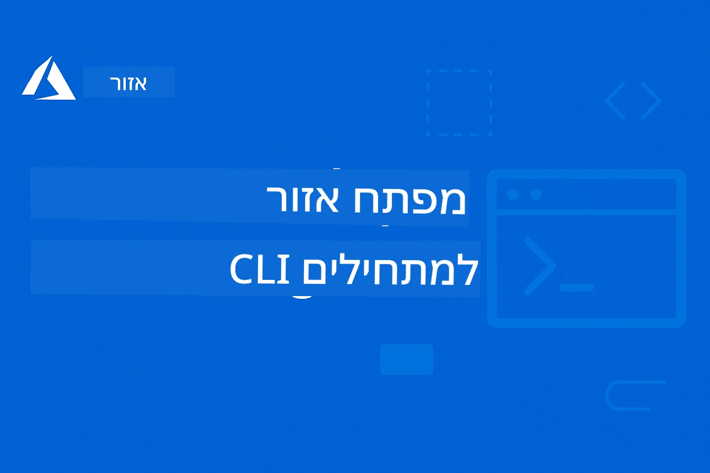

# AZD למתחילים: מסע למידה מובנה

 

[](https://GitHub.com/microsoft/azd-for-beginners/watchers/)
[](https://GitHub.com/microsoft/azd-for-beginners/network/)
[](https://GitHub.com/microsoft/azd-for-beginners/stargazers/)

[](https://discord.gg/microsoft-azure)
[](https://discord.gg/nTYy5BXMWG)

---

### תרגומים אוטומטיים (מעודכנים תמיד)

<!-- CO-OP TRANSLATOR LANGUAGES TABLE START -->
[ערבית](../ar/README.md) | [בנגלית](../bn/README.md) | [בולגרית](../bg/README.md) | [בורמזית (מיאנמר)](../my/README.md) | [סינית (מפושטת)](../zh-CN/README.md) | [סינית (מסורתית, הונג קונג)](../zh-HK/README.md) | [סינית (מסורתית, מקאו)](../zh-MO/README.md) | [סינית (מסורתית, טאיוואן)](../zh-TW/README.md) | [קרואטית](../hr/README.md) | [צ’כית](../cs/README.md) | [דנית](../da/README.md) | [הולנדית](../nl/README.md) | [אסטונית](../et/README.md) | [פינית](../fi/README.md) | [צרפתית](../fr/README.md) | [גרמנית](../de/README.md) | [יוונית](../el/README.md) | [עברית](./README.md) | [הינדי](../hi/README.md) | [הונגרית](../hu/README.md) | [אינדונזית](../id/README.md) | [איטלקית](../it/README.md) | [יפנית](../ja/README.md) | [קנדה](../kn/README.md) | [קוריאנית](../ko/README.md) | [ליטאית](../lt/README.md) | [מלאית](../ms/README.md) | [מלאיאלם](../ml/README.md) | [מרטהי](../mr/README.md) | [נפאלית](../ne/README.md) | [פידג’ין ניגרי](../pcm/README.md) | [נורווגית](../no/README.md) | [פרסית (פרסי)](../fa/README.md) | [פולנית](../pl/README.md) | [פורטוגזית (ברזיל)](../pt-BR/README.md) | [פורטוגזית (פורטוגל)](../pt-PT/README.md) | [פנג’אבי (גורמוכי)](../pa/README.md) | [רומנית](../ro/README.md) | [רוסית](../ru/README.md) | [סרבית (קירילית)](../sr/README.md) | [סלובקית](../sk/README.md) | [סלובנית](../sl/README.md) | [ספרדית](../es/README.md) | [סוואהילי](../sw/README.md) | [שבדית](../sv/README.md) | [טגלוג (פיליפינית)](../tl/README.md) | [טמילית](../ta/README.md) | [טלוגו](../te/README.md) | [תאית](../th/README.md) | [טורקית](../tr/README.md) | [אוקראינית](../uk/README.md) | [אורדו](../ur/README.md) | [וייטנאמית](../vi/README.md)

> **מעדיפים לשכפל מקומית?**

> מאגר זה כולל מעל 50 תרגומים אשר מעלים משמעותית את גודל ההורדה. כדי לשכפל ללא התרגומים, השתמש ב-sparse checkout:
> ```bash
> git clone --filter=blob:none --sparse https://github.com/microsoft/AZD-for-beginners.git
> cd AZD-for-beginners
> git sparse-checkout set --no-cone '/*' '!translations' '!translated_images'
> ```
> זה נותן לך את כל מה שצריך כדי להשלים את הקורס במהירות הורדה גדולה יותר.
<!-- CO-OP TRANSLATOR LANGUAGES TABLE END -->

## 🚀 מה זה Azure Developer CLI (azd)?

**Azure Developer CLI (azd)** הוא כלי שורת פקודה נוח למפתחים שמקל על פריסת יישומים ב-Azure. במקום ליצור ולחבר עשרות משאבי Azure ידנית, אפשר לפרוס אפליקציות שלמות עם פקודה אחת.

### הקסם של `azd up`

```bash
# הפקודה היחידה הזו עושה הכל:
# ✅ יוצר את כל המשאבים של Azure
# ✅ מגדיר את הרשת והאבטחה
# ✅ בונה את קוד היישום שלך
# ✅ מפריס ל-Azure
# ✅ מספק לך כתובת URL עובדת
azd up
```

**וזהו!** אין צורך להקליד בפורטל Azure, אין צורך ללמוד תבניות ARM מורכבות מראש, אין צורך בהגדרות ידניות - רק אפליקציות עובדות על Azure.

---

## ❓ Azure Developer CLI מול Azure CLI: מה ההבדל?

זו השאלה הנפוצה ביותר בקרב מתחילים. הנה התשובה הפשוטה:

| תכונה | **Azure CLI (`az`)** | **Azure Developer CLI (`azd`)** |
|---------|---------------------|--------------------------------|
| **מטרה** | ניהול משאבי Azure בודדים | פריסת אפליקציות שלמות |
| **גישת עבודה** | ממוקד תשתיות | ממוקד אפליקציות |
| **דוגמה** | `az webapp create --name myapp...` | `azd up` |
| **עקומת למידה** | צריך לדעת שירותי Azure | רק צריך לדעת את האפליקציה שלך |
| **מתאים ל** | DevOps, תשתיות | מפתחים, אב-טיפוס |

### האנלוגיה הפשוטה

- **Azure CLI** הוא כמו שיש לך את כל הכלים לבניית בית - פטישים, מסורים, מסמרים. אפשר לבנות הכל, אבל צריך לדעת לבנות.
- **Azure Developer CLI** הוא כמו לשכור קבלן - אתה מתאר מה אתה רוצה, והוא מטפל בבנייה.

### מתי להשתמש בכל אחד

| תרחיש | השתמש ב- |
|----------|----------|
| "אני רוצה לפרוס במהירות את אפליקציית האינטרנט שלי" | `azd up` |
| "אני צריך רק ליצור חשבון אחסון" | `az storage account create` |
| "אני בונה אפליקציית AI מלאה" | `azd init --template azure-search-openai-demo` |
| "אני צריך לנפות שגיאות במשאב Azure ספציפי" | `az resource show` |
| "אני רוצה פריסה מוכנה לסביבת ייצור בדקות" | `azd up --environment production` |

### הם עובדים ביחד!

AZD משתמש ב-Azure CLI מתחת לפני השטח. אפשר להשתמש בשניהם:
```bash
# פרוס את האפליקציה שלך באמצעות AZD
azd up

# ואז כוונן משאבים ספציפיים באמצעות Azure CLI
az webapp config set --name myapp --always-on true
```

---

## 🌟 מצא תבניות ב-Awesome AZD

אל תתחיל מאפס! **Awesome AZD** היא אוסף קהילתי של תבניות מוכנות לפריסה:

| משאב | תיאור |
|----------|-------------|
| 🔗 [**גלריית Awesome AZD**](https://azure.github.io/awesome-azd/) | עיין ב-200+ תבניות עם פריסה בלחיצה אחת |
| 🔗 [**שלח תבנית**](https://github.com/Azure/awesome-azd/issues) | תרום תבנית משמך לקהילה |
| 🔗 [**מאגר GitHub**](https://github.com/Azure/awesome-azd) | סמן בכוכב וחקור את המקור |

### תבניות AI פופולריות מ-Awesome AZD

```bash
# צ'אט RAG עם Azure OpenAI + חיפוש בינה מלאכותית
azd init --template azure-search-openai-demo

# יישום צ'אט בינה מלאכותית מהיר
azd init --template openai-chat-app-quickstart

# סוכני בינה מלאכותית עם סוכני Foundry
azd init --template get-started-with-ai-agents
```

---

## 🎯 התחל לעבוד ב-3 צעדים

### שלב 1: התקן את AZD (2 דקות)

**Windows:**
```powershell
winget install microsoft.azd
```

**macOS:**
```bash
brew tap azure/azd && brew install azd
```

**Linux:**
```bash
curl -fsSL https://aka.ms/install-azd.sh | bash
```

### שלב 2: התחבר ל-Azure

```bash
azd auth login
```

### שלב 3: פרוס את האפליקציה הראשונה שלך

```bash
# אתחול מתוך תבנית
azd init --template todo-nodejs-mongo

# פריסה ל-Azure (יוצר הכל!)
azd up
```

**🎉 זהו זה!** האפליקציה שלך במצב מקוון ב-Azure.

### ניקוי (אל תשכח!)

```bash
# Remove all resources when done experimenting
azd down --force --purge
```

---

## 📚 איך להשתמש בקורס הזה

הקורס בנוי ללמידה **מתקדמת** - התחל מהמקום שבו אתה מרגיש נוח ובנה את דרכך:

| הניסיון שלך | התחל כאן |
|-----------------|------------|
| **חדש לגמרי ב-Azure** | [פרק 1: יסודות](../..) |
| **יודע Azure, חדש ל-AZD** | [פרק 1: יסודות](../..) |
| **רוצה לפרוס אפליקציות AI** | [פרק 2: פיתוח AI-ראשון](../..) |
| **רוצה תרגול מעשי** | [🎓 סדנה אינטראקטיבית](workshop/README.md) - מעבדה מודרכת 3-4 שעות |
| **צריך דפוסי ייצור** | [פרק 8: ייצור וארגוני](../..) |

### התקנה מהירה

1. **צרוב את המאגר הזה**: [](https://GitHub.com/microsoft/azd-for-beginners/fork)
2. **שכפל אותו**: `git clone https://github.com/YOUR-USERNAME/azd-for-beginners.git`
3. **קבל עזרה**: [קהילת Azure Discord](https://discord.com/invite/ByRwuEEgH4)

> **מעדיפים לשכפל מקומית?**

> מאגר זה כולל מעל 50 תרגומים אשר מעלים משמעותית את גודל ההורדה. כדי לשכפל ללא התרגומים, השתמש ב-sparse checkout:
> ```bash
> git clone --filter=blob:none --sparse https://github.com/microsoft/AZD-for-beginners.git
> cd AZD-for-beginners
> git sparse-checkout set --no-cone '/*' '!translations' '!translated_images'
> ```
> זה נותן לך את כל מה שצריך כדי להשלים את הקורס במהירות הורדה גדולה יותר.


## מבט כללי על הקורס

למד את Azure Developer CLI (azd) דרך פרקים מובנים שפותחו ללמידה מתקדמת. **מיקוד מיוחד לפריסת אפליקציות AI עם שילוב Microsoft Foundry.**

### למה הקורס הזה חשוב למפתחים מודרניים

בהתבסס על תובנות מקהילת Microsoft Foundry Discord, **45% מהמפתחים מעוניינים להשתמש ב-AZD לעבודה עם AI** אך נתקלים באתגרים כמו:
- אדריכלות AI מרובת שירותים מורכבת
- שיטות פריסה מיטביות עבור AI בייצור  
- אינטגרציה והגדרת שירותי Azure AI
- אופטימיזציה של עלויות משימות AI
- פתרון בעיות ייחודיות לפריסת AI

### מטרות הלמידה

בסיום הקורס המבנה, תוכל:
- **לשלוט ביסודות AZD**: מושגים עיקריים, התקנה והגדרה
- **לפרוס אפליקציות AI**: שימוש ב-AZD עם שירותי Microsoft Foundry
- **ליישם Infrastructure as Code**: ניהול משאבי Azure עם תבניות Bicep
- **לפתור בעיות פריסה**: ניפוי שגיאות ופתרון תקלות נפוצות
- **לאופטם לייצור**: אבטחה, סקיילינג, ניטור וניהול עלויות
- **לבנות פתרונות מרובי סוכנים**: פריסת אדריכלות AI מורכבת

## 🗺️ מפת הקורס: ניווט מהיר לפי פרק

לכל פרק יש README ייעודי עם מטרות למידה, התחלה מהירה ותרגילים:

| פרק | נושא | שיעורים | משך | מורכבות |
|---------|-------|---------|----------|------------|
| **[פרק 1: יסודות](docs/chapter-01-foundation/README.md)** | התחלה | [יסודות AZD](docs/chapter-01-foundation/azd-basics.md) &#124; [התקנה](docs/chapter-01-foundation/installation.md) &#124; [פרויקט ראשון](docs/chapter-01-foundation/first-project.md) | 30-45 דקות | ⭐ |
| **[פרק 2: פיתוח AI](docs/chapter-02-ai-development/README.md)** | אפליקציות AI-ראשונות | [שילוב Foundry](docs/chapter-02-ai-development/microsoft-foundry-integration.md) &#124; [סוכני AI](docs/chapter-02-ai-development/agents.md) &#124; [פריסת מודלים](docs/chapter-02-ai-development/ai-model-deployment.md) &#124; [סדנא](docs/chapter-02-ai-development/ai-workshop-lab.md) | שעה-שעתיים | ⭐⭐ |
| **[פרק 3: הגדרות](docs/chapter-03-configuration/README.md)** | אימות ואבטחה | [הגדרות](docs/chapter-03-configuration/configuration.md) &#124; [אימות ואבטחה](docs/chapter-03-configuration/authsecurity.md) | 45-60 דקות | ⭐⭐ |
| **[פרק 4: תשתית](docs/chapter-04-infrastructure/README.md)** | Infrastructure as Code ופריסה | [מדריך פריסה](docs/chapter-04-infrastructure/deployment-guide.md) &#124; [הקצאה](docs/chapter-04-infrastructure/provisioning.md) | שעה-שעה וחצי | ⭐⭐⭐ |
| **[פרק 5: סוכנים מרובים](docs/chapter-05-multi-agent/README.md)** | פתרונות סוכני AI | [תסריט קמעונאות](examples/retail-scenario.md) &#124; [תבניות תיאום](docs/chapter-06-pre-deployment/coordination-patterns.md) | 2-3 שעות | ⭐⭐⭐⭐ |
| **[פרק 6: טרום פריסה](docs/chapter-06-pre-deployment/README.md)** | תיכנון ואימות | [בדיקות טרום טיסה](docs/chapter-06-pre-deployment/preflight-checks.md) &#124; [תכנון קיבולת](docs/chapter-06-pre-deployment/capacity-planning.md) &#124; [בחירת SKU](docs/chapter-06-pre-deployment/sku-selection.md) &#124; [תובנות אפליקציה](docs/chapter-06-pre-deployment/application-insights.md) | שעה | ⭐⭐ |
| **[פרק 7: פתרון תקלות](docs/chapter-07-troubleshooting/README.md)** | איתור ותיקון | [בעיות נפוצות](docs/chapter-07-troubleshooting/common-issues.md) &#124; [איתור תקלות](docs/chapter-07-troubleshooting/debugging.md) &#124; [בעיות AI](docs/chapter-07-troubleshooting/ai-troubleshooting.md) | 1-1.5 שעות | ⭐⭐ |
| **[פרק 8: פרודקשן](docs/chapter-08-production/README.md)** | תבניות ארגוניות | [פרקטיקות פרודקשן](docs/chapter-08-production/production-ai-practices.md) | 2-3 שעות | ⭐⭐⭐⭐ |
| **[🎓 סדנה](workshop/README.md)** | מעבדה מעשית | [הקדמה](workshop/docs/instructions/0-Introduction.md) &#124; [בחירה](workshop/docs/instructions/1-Select-AI-Template.md) &#124; [אימות](workshop/docs/instructions/2-Validate-AI-Template.md) &#124; [פירוק](workshop/docs/instructions/3-Deconstruct-AI-Template.md) &#124; [הגדרה](workshop/docs/instructions/4-Configure-AI-Template.md) &#124; [התאמה אישית](workshop/docs/instructions/5-Customize-AI-Template.md) &#124; [הריסה](workshop/docs/instructions/6-Teardown-Infrastructure.md) &#124; [סיכום](workshop/docs/instructions/7-Wrap-up.md) | 3-4 שעות | ⭐⭐ |

**משך כולל של הקורס:** ~10-14 שעות | **התקדמות מיומנות:** מתחיל → מוכן לפרודקשן

---

## 📚 פרקי למידה

*בחר את מסלול הלמידה שלך בהתבסס על רמת הניסיון והמטרות*

### 🚀 פרק 1: יסודות והתחלה מהירה  
**דרישות מוקדמות**: מנוי Azure, ידע בסיסי בפסקל שורת הפקודה  
**משך**: 30-45 דקות  
**מורכבות**: ⭐

#### מה תלמד  
- הבנת יסודות Azure Developer CLI  
- התקנת AZD על הפלטפורמה שלך  
- הפריסה הראשונה המוצלחת שלך  

#### משאבי למידה  
- **🎯 התחלה כאן**: [מהו Azure Developer CLI?](../..)  
- **📖 תיאוריה**: [יסודות AZD](docs/chapter-01-foundation/azd-basics.md) - מושגים ומונחים מרכזיים  
- **⚙️ התקנה**: [התקנה והגדרה](docs/chapter-01-foundation/installation.md) - מדריכים לפלטפורמות ספציפיות  
- **🛠️ מעשי**: [הפרויקט הראשון שלך](docs/chapter-01-foundation/first-project.md) - הדרכה שלב-אחר-שלב  
- **📋 הפניה מהירה**: [גליון צ'יט פקודות](resources/cheat-sheet.md)

#### תרגילים מעשיים  
```bash
# בדיקת התקנה מהירה
azd version

# פרוס את היישום הראשון שלך
azd init --template todo-nodejs-mongo
azd up
```
  
**💡 תוצאת פרק**: לפרוס בהצלחה אפליקציית ווב פשוטה ל-Azure באמצעות AZD  

**✅ אימות הצלחה:**  
```bash
# לאחר השלמת פרק 1, יהיה עליך להיות מסוגל:
azd version              # מציג את הגרסה המותקנת
azd init --template todo-nodejs-mongo  # מאתחל את הפרויקט
azd up                  # מפרסם ל-Azure
azd show                # מציג את כתובת האתר של האפליקציה שרצה
# האפליקציה נפתחת בדפדפן ועובדת
azd down --force --purge  # מנקה משאבים
```
  
**📊 השקעת זמן:** 30-45 דקות  
**📈 רמת מיומנות לאחר מכן:** יכול לפרוס אפליקציות בסיסיות באופן עצמאי  

**✅ אימות הצלחה:**  
```bash
# לאחר סיום פרק 1, אתה אמור להיות מסוגל ל:
azd version              # מציג את הגרסה המותקנת
azd init --template todo-nodejs-mongo  # מאתחל פרויקט
azd up                  # מפעיל לפריסה ב-Azure
azd show                # מציג את כתובת האתר של האפליקציה הפועלת
# האפליקציה נפתחת בדפדפן ופועלת
azd down --force --purge  # מנקה משאבים
```
  
**📊 השקעת זמן:** 30-45 דקות  
**📈 רמת מיומנות לאחר מכן:** יכול לפרוס אפליקציות בסיסיות באופן עצמאי  

---

### 🤖 פרק 2: פיתוח AI ראשון (מומלץ למפתחי AI)  
**דרישות מוקדמות**: פרק 1 הושלם  
**משך**: 1-2 שעות  
**מורכבות**: ⭐⭐

#### מה תלמד  
- אינטגרציה של Microsoft Foundry עם AZD  
- פריסת אפליקציות מונעות AI  
- הבנת תצורות שירותי AI  

#### משאבי למידה  
- **🎯 התחלה כאן**: [אינטגרציית Microsoft Foundry](docs/chapter-02-ai-development/microsoft-foundry-integration.md)  
- **🤖 סוכני AI**: [מדריך סוכנים](docs/chapter-02-ai-development/agents.md) - פריסת סוכנים אינטליגנטיים עם AZD  
- **📖 תבניות**: [פריסת מודלי AI](docs/chapter-02-ai-development/ai-model-deployment.md) - פריסה וניהול דגמי AI  
- **🛠️ סדנה**: [מעבדת סדנת AI](docs/chapter-02-ai-development/ai-workshop-lab.md) - הפוך את פתרונות ה-AI שלך למוכנים ל-AZD  
- **🎥 מדריך אינטראקטיבי**: [חומרי סדנה](workshop/README.md) - למידה בדפדפן בסביבת MkDocs * DevContainer  
- **📋 תבניות**: [תבניות Microsoft Foundry](../..)  
- **📝 דוגמאות**: [דוגמאות פריסת AZD](examples/README.md)  

#### תרגילים מעשיים  
```bash
# פרוס את אפליקציית ה-AI הראשונה שלך
azd init --template azure-search-openai-demo
azd up

# נסה תבניות AI נוספות
azd init --template openai-chat-app-quickstart
azd init --template agent-openai-python-prompty
```
  
**💡 תוצאת פרק**: לפרוס ולהגדיר אפליקציית צ'אט מונעת AI עם יכולות RAG  

**✅ אימות הצלחה:**  
```bash
# לאחר פרק 2, תוכל ל:
azd init --template azure-search-openai-demo
azd up
# לבדוק את ממשק הצ'אט של ה-AI
# לשאול שאלות ולקבל תגובות מופעלות על ידי AI עם מקורות
# לאמת שהאינטגרציה עם החיפוש פועלת
azd monitor  # לבדוק ש-Application Insights מציג טלמטריה
azd down --force --purge
```
  
**📊 השקעת זמן:** 1-2 שעות  
**📈 רמת מיומנות לאחר מכן:** יכול לפרוס ולהגדיר אפליקציות AI מוכנות לפרודקשן  
**💰 מודעות לעלות:** הבנת עלויות פיתוח של $80-150 לחודש, ועלויות פרודקשן של $300-3500 לחודש  

#### 💰 שיקולי עלות לפריסות AI  

**סביבת פיתוח (הערכה של $80-150 לחודש):**  
- Azure OpenAI (תשלום לפי שימוש): $0-50 לחודש (מבוסס על שימוש בטוקנים)  
- AI Search (רמת בסיס): $75 לחודש  
- Container Apps (צריכה): $0-20 לחודש  
- אחסון (סטנדרטי): $1-5 לחודש  

**סביבת ייצור (הערכה של $300-3,500+/חודש):**  
- Azure OpenAI (PTU לביצועים עקביים): $3,000+/חודש או תשלום לפי שימוש בנפח גבוה  
- AI Search (רמת סטנדרט): $250 לחודש  
- Container Apps (ייעודי): $50-100 לחודש  
- Application Insights: $5-50 לחודש  
- אחסון (פרימיום): $10-50 לחודש  

**💡 טיפים לאופטימיזציה של עלויות:**  
- השתמש ב-**שכבת Free Tier** של Azure OpenAI ללמידה (כולל 50,000 טוקנים בחודש)  
- הרץ `azd down` לשחרור משאבים כשאינה בשימוש פעיל בפיתוח  
- התחל בחיוב מבוסס צריכה, שדרג ל-PTU רק לפרודקשן  
- השתמש ב-`azd provision --preview` להערכת עלויות לפני הפריסה  
- אפשר סקיילינג אוטומטי: שלם רק על שימוש בפועל  

**מעקב עלויות:**  
```bash
# בדוק עלויות חודשיות מוערכות
azd provision --preview

# עקוב אחר עלויות בפועל בפורטל Azure
az consumption budget list --resource-group <your-rg>
```
  
---

### ⚙️ פרק 3: קונפיגורציה ואימות  
**דרישות מוקדמות**: פרק 1 הושלם  
**משך**: 45-60 דקות  
**מורכבות**: ⭐⭐

#### מה תלמד  
- קונפיגורציה וניהול סביבות  
- אימות ואבטחה מיטבית  
- שמות ארגוניות וניהול משאבים  

#### משאבי למידה  
- **📖 קונפיגורציה**: [מדריך קונפיגורציה](docs/chapter-03-configuration/configuration.md) - הגדרת סביבה  
- **🔐 אבטחה**: [דפוסי אימות וזהות מנוהלת](docs/chapter-03-configuration/authsecurity.md) - דפוסי אימות  
- **📝 דוגמאות**: [דוגמת אפליקציית מסד נתונים](examples/database-app/README.md) - דוגמאות למסדי נתונים ב-AZD  

#### תרגילים מעשיים  
- הגדרת סביבות מרובות (פיתוח, הבאה לפרודקשן, ייצור)  
- הקמה של אימות באמצעות זהות מנוהלת  
- יישום קונפיגורציות ייחודיות לכל סביבה  

**💡 תוצאת פרק**: ניהול סביבות מרובות עם אימות ואבטחה נכונים  

---

### 🏗️ פרק 4: תשתית כקוד ופריסה  
**דרישות מוקדמות**: פרקים 1-3 הושלמו  
**משך**: 1-1.5 שעות  
**מורכבות**: ⭐⭐⭐

#### מה תלמד  
- תבניות פריסה מתקדמות  
- תשתית כקוד עם Bicep  
- אסטרטגיות פריסת משאבים  

#### משאבי למידה  
- **📖 פריסה**: [מדריך פריסה](docs/chapter-04-infrastructure/deployment-guide.md) - זרימות עבודה שלמות  
- **🏗️ הקצה משאבים**: [ניהול משאבים](docs/chapter-04-infrastructure/provisioning.md) - ניהול משאבים ב-Azure  
- **📝 דוגמאות**: [דוגמת Container App](../../examples/container-app) - פריסות מכולות  

#### תרגילים מעשיים  
- יצירת תבניות Bicep מותאמות  
- פריסת אפליקציות עם שירותים מרובים  
- יישום אסטרטגיות פריסה blue-green  

**💡 תוצאת פרק**: לפרוס אפליקציות מורכבות עם שירותים מרובים באמצעות תבניות תשתית מותאמות  

---

### 🎯 פרק 5: פתרונות AI מרובי סוכנים (מתקדם)  
**דרישות מוקדמות**: פרקים 1-2 הושלמו  
**משך**: 2-3 שעות  
**מורכבות**: ⭐⭐⭐⭐

#### מה תלמד  
- דפוסי ארכיטקטורת סוכנים מרובים  
- תיאום ואורקסטרציה של סוכנים  
- פריסות AI מוכנות לפרודקשן  

#### משאבי למידה  
- **🤖 פרויקט מובלט**: [פתרון סוכנים מרובי קמעונאות](examples/retail-scenario.md) - יישום מלא  
- **🛠️ תבניות ARM**: [חבילת תבניות ARM לסוכנים מרובים](../../examples/retail-multiagent-arm-template) - פריסה בלחיצה אחת  
- **📖 ארכיטקטורה**: [דפוסי תיאום סוכנים מרובים](docs/chapter-06-pre-deployment/coordination-patterns.md) - דפוסים  

#### תרגילים מעשיים  
```bash
# פרוס את הפתרון המלא לסוכנים מרובי קמעונאות
cd examples/retail-multiagent-arm-template
./deploy.sh

# חקור תצורות סוכנים
az deployment group show --resource-group <rg-name> --name <deployment-name>
```
  
**💡 תוצאת פרק**: לפרוס ולנהל פתרון AI מרובי סוכנים מוכן לפרודקשן עם סוכני לקוח ומלאי  

---

### 🔍 פרק 6: אימות תיכנון טרום פריסה  
**דרישות מוקדמות**: פרק 4 הושלם  
**משך**: שעה  
**מורכבות**: ⭐⭐

#### מה תלמד  
- תכנון קיבולת ואימות משאבים  
- אסטרטגיות בחירת SKU  
- בדיקות טרום טיסה ואוטומציה  

#### משאבי למידה  
- **📊 תכנון**: [תכנון קיבולת](docs/chapter-06-pre-deployment/capacity-planning.md) - אימות משאבים  
- **💰 בחירה**: [בחירת SKU](docs/chapter-06-pre-deployment/sku-selection.md) - בחירות חסכוניות  
- **✅ אימות**: [בדיקות טרום טיסה](docs/chapter-06-pre-deployment/preflight-checks.md) - סקריפטים אוטומטיים  

#### תרגילים מעשיים  
- הרץ סקריפטים לאימות קיבולת  
- אופטימיזציית בחירות SKU לחיסכון בעלויות  
- יישום בדיקות אוטומטיות לפני הפריסה  

**💡 תוצאת פרק**: לאמת ולאופטימיזציה של פריסות לפני ביצוע  

---

### 🚨 פרק 7: פתרון תקלות ואיתור באגים  
**דרישות מוקדמות**: כל פרק פריסה שהושלם  
**משך**: 1-1.5 שעות  
**מורכבות**: ⭐⭐

#### מה תלמד  
- שיטות איתור תקלות סיסטמטיות  
- בעיות ושיטות פתרון נפוצות  
- פתרון תקלות ייחודי ל-AI  

#### משאבי למידה  
- **🔧 בעיות נפוצות**: [בעיות נפוצות](docs/chapter-07-troubleshooting/common-issues.md) - שאלות נפוצות ופתרונות  
- **🕵️ איתור תקלות**: [מדריך איתור תקלות](docs/chapter-07-troubleshooting/debugging.md) - אסטרטגיות שלב אחרי שלב  
- **🤖 בעיות AI**: [פתרון תקלות AI](docs/chapter-07-troubleshooting/ai-troubleshooting.md) - בעיות בשירות AI  

#### תרגילים מעשיים  
- אבחן כשלי פריסה  
- פתר בעיות אימות  
- איתור תקלות בחיבור לשירות AI  

**💡 תוצאת פרק**: לאבחן ולפתור בעיות פריסה נפוצות באופן עצמאי  

---

### 🏢 פרק 8: פרודקשן ותבניות ארגוניות  
**דרישות מוקדמות**: פרקים 1-4 הושלמו  
**משך**: 2-3 שעות  
**מורכבות**: ⭐⭐⭐⭐

#### מה תלמד  
- אסטרטגיות פריסה לפרודקשן  
- דפוסי אבטחה ארגוניים  
- ניטור ואופטימיזציה של עלויות  

#### משאבי למידה  
- **🏭 פרודקשן**: [הטבות AI בפרודקשן](docs/chapter-08-production/production-ai-practices.md) - תבניות ארגוניות  
- **📝 דוגמאות**: [דוגמת מיקרו-שירותים](../../examples/microservices) - ארכיטקטורות מורכבות  
- **📊 ניטור**: [אינטגרציית Application Insights](docs/chapter-06-pre-deployment/application-insights.md) - ניטור  

#### תרגילים מעשיים  
- יישום דפוסי אבטחה ארגוניים  
- הגדרת ניטור מקיף  
- פריסה לפרודקשן עם ממשל תקין  

**💡 תוצאת פרק**: לפרוס אפליקציות מוכנות לארגון עם כל יכולות הפרודקשן  

---

## 🎓 סקירת סדנה: חווית למידה מעשית  

> **⚠️ מצב הסדנה: בפיתוח פעיל**  
> חומרי הסדנה נמצאים בפיתוח ושיפור מתמיד. מודולים מרכזיים פעילים, אך חלק מחלקים מתקדמים עדיין לא הושלמו. אנו פועלים להשלים את כל התוכן. [עקוב אחרי ההתקדמות →](workshop/README.md)

### חומרי סדנה אינטראקטיביים  
**למידה מעשית מקיפה עם כלים בדפדפן ותרגילים מודרכים**
החומרים של הסדנה שלנו מספקים חווית למידה מבנית, אינטראקטיבית המשcompliments את תכנית הלימודים מבוססת הפרקים למעלה. הסדנה מיועדת ללמידה בקצב עצמי ולמפגשי הדרכה בהנחיית מדריך.

#### 🛠️ תכונות הסדנה
- **ממשק מבוסס דפדפן**: סדנת MkDocs מלאה עם אפשרויות חיפוש, העתקה ותמה
- **אינטגרציה עם GitHub Codespaces**: הקמת סביבת פיתוח בלחיצה אחת
- **מסלול למידה מובנה**: תרגילים מונחים ב-8 מודולים (סה"כ 3-4 שעות)
- **מתודולוגיה הדרגתית**: מבוא → בחירה → אימות → פירוק → קונפיגורציה → התאמה אישית → פירוק → סיכום
- **סביבת DevContainer אינטראקטיבית**: כלים ותלויות שהוגדרו מראש

#### 📚 מבנה מודולי הסדנה
הסדנה פועלת לפי **מתודולוגיה הדרגתית ב-8 מודולים** שמובילה אותך מגילוי ועד לשליטה בפריסה:

| מודול | נושא | מה תעשה | משך זמן |
|--------|-------|----------------|----------|
| **0. מבוא** | סקירת הסדנה | הבנת יעדי הלמידה, דרישות מקדימות, ומבנה הסדנה | 15 דק' |
| **1. בחירה** | גילוי תבניות | בחינת תבניות AZD ובחירה בתבנית AI המתאימה לתרחיש שלך | 20 דק' |
| **2. אימות** | פריסה ואימות | פריסת התבנית עם `azd up` ואימות שהתשתית פועלת | 30 דק' |
| **3. פירוק** | הבנת מבנה | שימוש ב-GitHub Copilot לחקר ארכיטקטורת התבנית, קבצי Bicep וארגון קוד | 30 דק' |
| **4. קונפיגורציה** | חקירה מעמיקה של azure.yaml | שליטה בקונפיגורציית `azure.yaml`, hooks למחזור חייה, ומשתני סביבה | 30 דק' |
| **5. התאמה אישית** | הפוך את זה לשייך לך | הפעלת חיפוש AI, מעקב, הערכה, והתאמה לתרחיש שלך | 45 דק' |
| **6. פירוק סביבה** | ניקוי | פרט בהסרת משאבים עם `azd down --purge` | 15 דק' |
| **7. סיכום** | צעדים הבאים | סקירת הישגים, מושגי מפתח, והמשך מסע הלמידה שלך | 15 דק' |

**מהלך הסדנה:**
```
Introduction → Selection → Validation → Deconstruction → Configuration → Customization → Teardown → Wrap-up
     ↓            ↓           ↓              ↓               ↓              ↓            ↓           ↓
  Overview    Find the     Deploy &      Explore        Master         Customize     Clean up    Review &
             right        verify        code &        azure.yaml      for your      resources   next steps
             template                   structure                     scenario
```

#### 🚀 התחלה עם הסדנה
```bash
# אפשרות 1: GitHub Codespaces (מומלץ)
# לחץ על "Code" → "Create codespace on main" במאגר

# אפשרות 2: פיתוח מקומי
git clone https://github.com/microsoft/azd-for-beginners.git
cd azd-for-beginners/workshop
# עקוב אחרי הוראות ההתקנה בקובץ workshop/README.md
```

#### 🎯 תוצאות הלמידה מהסדנה
בסיום הסדנה המשתתפים יוכלו:
- **לפרוס אפליקציות AI לפרודקשן**: שימוש ב-AZD עם שירותי Microsoft Foundry
- **לשלוט בארכיטקטורות מרובות סוכנים**: יישום פתרונות סוכני AI מתואמים  
- **להטמיע שיטות אבטחה מיטביות**: קונפיגורציית אימות ושליטה בגישה
- **לאופטם לפריסה בקנה מידה**: תכנון פריסות חסכוניות ויעילות
- **לתקן בעיות בפריסות**: זיהוי ופתרון בעיות נפוצות בכוחות עצמם

#### 📖 משאבי הסדנה
- **🎥 מדריך אינטראקטיבי**: [חומרי הסדנה](workshop/README.md) - סביבת למידה מבוססת דפדפן
- **📋 הוראות מודול אחר מודול**:
  - [0. מבוא](workshop/docs/instructions/0-Introduction.md) - סקירת הסדנה ויעדים
  - [1. בחירה](workshop/docs/instructions/1-Select-AI-Template.md) - מצא ובחר תבניות AI
  - [2. אימות](workshop/docs/instructions/2-Validate-AI-Template.md) - פריסה ואימות תבניות
  - [3. פירוק](workshop/docs/instructions/3-Deconstruct-AI-Template.md) - חקור ארכיטקטורת התבנית
  - [4. קונפיגורציה](workshop/docs/instructions/4-Configure-AI-Template.md) - שלוט ב-azure.yaml
  - [5. התאמה אישית](workshop/docs/instructions/5-Customize-AI-Template.md) - התאם לתרחיש שלך
  - [6. ניקוי](workshop/docs/instructions/6-Teardown-Infrastructure.md) - נקי משאבים
  - [7. סיכום](workshop/docs/instructions/7-Wrap-up.md) - סקירה וצעדים הבאים
- **🛠️ מעבדת סדנת AI**: [מעבדת הסדנה AI](docs/chapter-02-ai-development/ai-workshop-lab.md) - תרגילי AI ממוקדים
- **💡 התחלה מהירה**: [מדריך הגדרת הסדנה](workshop/README.md#quick-start) - הגדרת הסביבה

**מתאים ל**: הדרכות ארגוניות, קורסים אקדמיים, למידה עצמאית ומחנות קיץ למפתחים.

---

## 📖 התעמקות: יכולות AZD

מעבר ליסודות, AZD מספקת תכונות עוצמתיות לפריסות פרודקשן:

- **פריסות מבוססות תבניות** - שימוש בתבניות מובנות לדפוסי אפליקציה נפוצים
- **תשתית כקוד** - ניהול משאבי Azure באמצעות Bicep או Terraform  
- **זרימות עבודה משולבות** - פריסה, ניטור, וניהול חלק של אפליקציות
- **נוח למפתחים** - מותאם לייצוריות ונוחות למפתח

### **AZD + Microsoft Foundry: אידיאלי לפריסות AI**

**למה AZD לפתרונות AI?** AZD מתמודד עם האתגרים המרכזיים של מפתחות AI:

- **תבניות מוכנות ל-AI** - תבניות מוגדרות מראש ל-Azure OpenAI, Cognitive Services ועומסי עבודה ML
- **פריסות AI מאובטחות** - תבניות בטיחות מובנות לשירותי AI, מפתחות API, ונקודות קצה למודלים  
- **דפוסי AI לפרודקשן** - שיטות עבודה מומלצות לפריסות AI חסכוניות וקצביות
- **זרימות עבודה AI מקצה לקצה** - מפיתוח מודל ועד פריסה עם ניטור מתאים
- **אופטימיזציית עלויות** - הקצאת משאבים חכמה ואסטרטגיות סקיילינג לעומסי עבודה AI
- **אינטגרציה עם Microsoft Foundry** - חיבור חלק למאגרי דגמים ונקודות קצה של Foundry

---

## 🎯 ספריית תבניות ודוגמאות

### מודגש: תבניות Microsoft Foundry
**התחל כאן אם אתה מפרס AI!**

> **הערה:** תבניות אלה מדגימות דפוסי AI שונים. חלקן דוגמאות חיצוניות מ-Azure Samples, אחרות יישומים מקומיים.

| תבנית | פרק | רמת קושי | שירותים | סוג |
|----------|---------|------------|----------|------|
| [**התחלת שיחת AI**](https://github.com/Azure-Samples/get-started-with-ai-chat) | פרק 2 | ⭐⭐ | AzureOpenAI + Azure AI Model Inference API + Azure AI Search + Azure Container Apps + Application Insights | חיצוני |
| [**התחלת סוכני AI**](https://github.com/Azure-Samples/get-started-with-ai-agents) | פרק 2 | ⭐⭐ | Foundry Agents + AzureOpenAI + Azure AI Search + Azure Container Apps + Application Insights | חיצוני |
| [**הדגמת Azure Search + OpenAI**](https://github.com/Azure-Samples/azure-search-openai-demo) | פרק 2 | ⭐⭐ | AzureOpenAI + Azure AI Search + App Service + Storage | חיצוני |
| [**התחלת OpenAI Chat App**](https://github.com/Azure-Samples/openai-chat-app-quickstart) | פרק 2 | ⭐ | AzureOpenAI + Container Apps + Application Insights | חיצוני |
| [**Agent OpenAI Python Prompty**](https://github.com/Azure-Samples/agent-openai-python-prompty) | פרק 5 | ⭐⭐⭐ | AzureOpenAI + Azure Functions + Prompty | חיצוני |
| [**Contoso Chat RAG**](https://github.com/Azure-Samples/contoso-chat) | פרק 8 | ⭐⭐⭐⭐ | AzureOpenAI + AI Search + Cosmos DB + Container Apps | חיצוני |
| [**פתרון רב-סוכני קמעונאות**](examples/retail-scenario.md) | פרק 5 | ⭐⭐⭐⭐ | AzureOpenAI + AI Search + Storage + Container Apps + Cosmos DB | **מקומי** |

### מודגש: תרחישי למידה מלאים
**תבניות אפליקציה מוכנות לפרודקשן המותאמות לפרקי הלמידה**

| תבנית | פרק למידה | רמת קושי | למידה עיקרית |
|----------|------------------|------------|--------------|
| [**openai-chat-app-quickstart**](https://github.com/Azure-Samples/openai-chat-app-quickstart) | פרק 2 | ⭐ | דפוסי פריסת AI בסיסיים |
| [**azure-search-openai-demo**](https://github.com/Azure-Samples/azure-search-openai-demo) | פרק 2 | ⭐⭐ | יישום RAG עם Azure AI Search |
| [**ai-document-processing**](https://github.com/Azure-Samples/ai-document-processing) | פרק 4 | ⭐⭐ | אינטגרציית אינטליגנציה למסמכים |
| [**agent-openai-python-prompty**](https://github.com/Azure-Samples/agent-openai-python-prompty) | פרק 5 | ⭐⭐⭐ | מסגרת סוכנים וקריאה לפונקציות |
| [**contoso-chat**](https://github.com/Azure-Samples/contoso-chat) | פרק 8 | ⭐⭐⭐ | אורקסטרציה ארגונית ל-AI |
| [**retail-multi-agent-solution**](examples/retail-scenario.md) | פרק 5 | ⭐⭐⭐⭐ | ארכיטקטורת רב-סוכנים עם סוכן לקוח ומלאי |

### למידה לפי סוג דוגמה

> **📌 דוגמאות מקומיות מול חיצוניות:**  
> **דוגמאות מקומיות** (ברפוזיטורי זה) = מוכנות לשימוש מיידי  
> **דוגמאות חיצוניות** (Azure Samples) = שיכפול מרפוזיטוריות מקושרות

#### דוגמאות מקומיות (מוכנות לשימוש)
- [**פתרון רב-סוכני קמעונאות**](examples/retail-scenario.md) - מימוש מלא מוכן לפרודקשן עם תבניות ARM
  - ארכיטקטורת רב-סוכנים (לקוח + מלאי)
  - ניטור והערכה מקיפה
  - פריסה בלחיצה אחת דרך תבנית ARM

#### דוגמאות מקומיות - אפליקציות מכולה (פרקים 2-5)
**דוגמאות פריסה מקיפות במכולות בריפוזיטורי זה:**
- [**דוגמאות אפליקציות מכולה**](examples/container-app/README.md) - מדריך מלא לפריסות מכולות
  - [API Flask פשוט](../../examples/container-app/simple-flask-api) - API REST בסיסי עם סקייל לאפס
  - [ארכיטקטורת מיקרו-שירותים](../../examples/container-app/microservices) - פריסה מרובת שירותים מוכנה לפרודקשן
  - דפוסי פריסה התחלה מהירה, פרודקשן ומתקדמים  
  - הדרכה בניטור, אבטחה ואופטימיזציה של עלויות

#### דוגמאות חיצוניות - אפליקציות פשוטות (פרקים 1-2)
**שכפל את רפוזיטוריות Azure Samples הבאות כדי להתחיל:**
- [אפליקציית ווב פשוטה - Node.js + MongoDB](https://github.com/Azure-Samples/todo-nodejs-mongo) - דפוסי פריסה בסיסיים
- [אתר סטטי - React SPA](https://github.com/Azure-Samples/todo-csharp-sql-swa-func) - פריסת תוכן סטטי
- [אפליקציית מכולה - Python Flask](https://github.com/Azure-Samples/container-apps-store-api-microservice) - פריסת REST API

#### דוגמאות חיצוניות - אינטגרציית מסדי נתונים (פרקים 3-4)  
- [אפליקציית מסד נתונים - C# + SQL](https://github.com/Azure-Samples/todo-csharp-sql) - דפוסי חיבור למסד נתונים
- [פונקציות + Cosmos DB](https://github.com/Azure-Samples/todo-python-mongo-swa-func) - זרימת עבודה חסרת שרת

#### דוגמאות חיצוניות - דפוסים מתקדמים (פרקים 4-8)
- [מיקרו-שירותים בג'אווה](https://github.com/Azure-Samples/java-microservices-aca-lab) - ארכיטקטורות מרובות שירותים
- [משרות באפליקציות מכולה](https://github.com/Azure-Samples/container-apps-jobs) - עיבוד ברקע  
- [צנרת ML ארגונית](https://github.com/Azure-Samples/mlops-v2) - דפוסי ML מוכנים לפרודקשן

### אוספי תבניות חיצוניים
- [**גלריית תבניות רשמית של AZD**](https://azure.github.io/awesome-azd/) - אוסף מתורגם של תבניות רשמיות וקהילתיות
- [**תבניות Azure Developer CLI**](https://learn.microsoft.com/en-us/azure/developer/azure-developer-cli/azd-templates) - תיעוד תבניות Microsoft Learn
- [**ספריית דוגמאות**](examples/README.md) - דוגמאות למידה מקומיות עם הסברים מפורטים

---

## 📚 משאבי למידה והתייחסויות

### הפניות מהירות
- [**גליון תקציר פקודות**](resources/cheat-sheet.md) - פקודות azd חיוניות מאורגנות לפי פרק
- [**מילון מונחים**](resources/glossary.md) - מונחי Azure ו-azd  
- [**שאלות נפוצות**](resources/faq.md) - שאלות נפוצות ממוסגרות לפי פרקי למידה
- [**מדריך לימודי**](resources/study-guide.md) - תרגולי הכנה מקיפים

### סדנאות מעשיות
- [**מעבדת סדנת AI**](docs/chapter-02-ai-development/ai-workshop-lab.md) - הפוך את פתרונות AI לפריסות AZD (שעתיים-שלוש)
- [**סדנה אינטראקטיבית**](workshop/README.md) - תרגילים מונחים ב-8 מודולים עם MkDocs ו-GitHub Codespaces
  - מסלול: מבוא → בחירה → אימות → פירוק → קונפיגורציה → התאמה אישית → ניקוי → סיכום

### משאבי למידה חיצוניים
- [תיעוד Azure Developer CLI](https://learn.microsoft.com/en-us/azure/developer/azure-developer-cli/)
- [מרכז הארכיטקטורה של Azure](https://learn.microsoft.com/en-us/azure/architecture/)
- [מחשבון תמחור Azure](https://azure.microsoft.com/pricing/calculator/)
- [סטטוס Azure](https://status.azure.com/)

---

## 🔧 מדריך פתרון בעיות מהיר

**בעיות נפוצות שמתחילים נתקלים בהן ופתרונות מיידיים:**

<details>
<summary><strong>❌ "azd: command not found"</strong></summary>

```bash
# התקן קודם את AZD
# Windows (PowerShell):
winget install microsoft.azd

# macOS:
brew tap azure/azd && brew install azd

# Linux:
curl -fsSL https://aka.ms/install-azd.sh | bash

# אמת את ההתקנה
azd version
```
</details>

<details>
<summary><strong>❌ "No subscription found" or "Subscription not set"</strong></summary>

```bash
# רשום מנויים זמינים
az account list --output table

# הגדר מנוי ברירת מחדל
az account set --subscription "<subscription-id-or-name>"

# הגדר עבור סביבה AZD
azd env set AZURE_SUBSCRIPTION_ID "<subscription-id>"

# אמת
az account show
```
</details>

<details>
<summary><strong>❌ "InsufficientQuota" or "Quota exceeded"</strong></summary>

```bash
# נסה אזור אזור אחר ב-Azure
azd env set AZURE_LOCATION "westus2"
azd up

# או השתמש ב-SKU קטנים יותר בפיתוח
# ערוך את infra/main.parameters.json:
{
  "sku": "B1"  // Instead of "P1V2"
}
```
</details>

<details>
<summary><strong>❌ "azd up" fails halfway through</strong></summary>
```bash
# אפשרות 1: נקו ונסו שוב
azd down --force --purge
azd up

# אפשרות 2: לתקן רק את תשתית
azd provision

# אפשרות 3: לבדוק סטטוס מפורט
azd show

# אפשרות 4: לבדוק יומנים ב-Azure Monitor
azd monitor --logs
```
</details>

<details>
<summary><strong>❌ "אימות נכשל" או "אסימון פג תוקף"</strong></summary>

```bash
# אשר מחדש
az logout
az login

azd auth logout
azd auth login

# אמת אימות
az account show
```
</details>

<details>
<summary><strong>❌ "המשאב כבר קיים" או קונפליקטים בשמות</strong></summary>

```bash
# AZD מייצר שמות ייחודיים, אבל אם יש התנגשות:
azd down --force --purge

# ואז לנסות שוב עם סביבה חדשה
azd env new dev-v2
azd up
```
</details>

<details>
<summary><strong>❌ פריסת תבנית לוקחת יותר מדי זמן</strong></summary>

**זמני המתנה רגילים:**
- אפליקציית רשת פשוטה: 5-10 דקות
- אפליקציה עם מסד נתונים: 10-15 דקות
- אפליקציות AI: 15-25 דקות (הקצאת OpenAI איטית)

```bash
# בדוק התקדמות
azd show

# אם תקוע יותר מ-30 דקות, בדוק את פורטל Azure:
azd monitor
# חפש פריסות שנכשלו
```
</details>

<details>
<summary><strong>❌ "הרשאה נדחתה" או "אסור"</strong></summary>

```bash
# בדוק את התפקיד שלך ב-Azure
az role assignment list --assignee $(az account show --query user.name -o tsv)

# אתה צריך לפחות את התפקיד "משתף פעולה"
# בקש ממנהל ה-Azure שלך להעניק:
# - משתף פעולה (עבור משאבים)
# - מנהל גישה למשתמש (עבור הקצאות תפקידים)
```
</details>

<details>
<summary><strong>❌ לא ניתן למצוא את כתובת URL של האפליקציה שפורסמה</strong></summary>

```bash
# הצג את כל נקודות הקצה של השירות
azd show

# או פתח את פורטל Azure
azd monitor

# בדוק שירות ספציפי
azd env get-values
# חפש משתני *_URL
```
</details>

### 📚 משאבי פתרון בעיות מלאים

- **מדריך בעיות נפוצות:** [פתרונות מפורטים](docs/chapter-07-troubleshooting/common-issues.md)
- **בעיות ספציפיות ל-AI:** [פתרון בעיות AI](docs/chapter-07-troubleshooting/ai-troubleshooting.md)
- **מדריך איתור שגיאות:** [איתור שגיאות שלב-אחר-שלב](docs/chapter-07-troubleshooting/debugging.md)
- **קבל עזרה:** [Azure Discord](https://discord.gg/microsoft-azure) #azure-developer-cli

---

## 🎓 השלמת הקורס והסמכה

### מעקב התקדמות
עקוב אחר התקדמות הלמידה שלך בכל פרק:

- [ ] **פרק 1**: יסודות והתחלה מהירה ✅
- [ ] **פרק 2**: פיתוח ממוקד AI ✅  
- [ ] **פרק 3**: הגדרות ואימות ✅
- [ ] **פרק 4**: תשתית כקוד ופריסה ✅
- [ ] **פרק 5**: פתרונות AI רב-סוכניים ✅
- [ ] **פרק 6**: אימות ותכנון לפני פריסה ✅
- [ ] **פרק 7**: פתרון בעיות ואיתור שגיאות ✅
- [ ] **פרק 8**: דפוסים לייצור וארגוניים ✅

### אימות למידה
לאחר השלמת כל פרק, אמת את הידע שלך על ידי:
1. **תרגול מעשי**: השלם את הפריסה המעשית של הפרק
2. **בדיקת ידע**: סקור את קטע השאלות הנפוצות עבור הפרק שלך
3. **דיון בקהילה**: שתף את ניסיונך ב-Azure Discord
4. **המשך לפרק הבא**: העבר לרמת המורכבות הבאה

### היתרונות בסיום הקורס
עם השלמת כל הפרקים, תהיה לך:
- **ניסיון בייצור**: פרסת אפליקציות AI אמיתיות ב-Azure
- **מיומנויות מקצועיות**: יכולות פריסה מוכנות ארגונית  
- **הכרה קהילתית**: חבר פעיל בקהילת מפתחי Azure
- **קידום קריירה**: מומחיות מבוקשת ב-AZD ופריסת AI

---

## 🤝 קהילה ותמיכה

### קבלת עזרה ותמיכה
- **בעיות טכניות**: [דווח על שגיאות ובקש תכונות](https://github.com/microsoft/azd-for-beginners/issues)
- **שאלות למידה**: [קהילת Discord של Microsoft Azure](https://discord.gg/microsoft-azure) ו-[](https://discord.gg/nTYy5BXMWG)
- **עזרה ספציפית ל-AI**: הצטרף אל [](https://discord.gg/nTYy5BXMWG)
- **תיעוד**: [תיעוד רשמי של Azure Developer CLI](https://learn.microsoft.com/en-us/azure/developer/azure-developer-cli/)

### תובנות קהילתיות מ-Microsoft Foundry Discord

**תוצאות סקר אחרונות מתחום #Azure:**
- **45%** מהמתכנתים רוצים להשתמש ב-AZD לעומסי עבודה AI
- **אתגרים מובילים**: פריסות מרובת שירותים, ניהול הרשאות, מוכנות לייצור  
- **הכי מבוקש**: תבניות ספציפיות ל-AI, מדריכי פתרון בעיות, שיטות עבודה מומלצות

**הצטרף לקהילה שלנו כדי:**
- לשתף את ניסיון ה-AZD + AI שלך ולקבל עזרה
- לקבל גישת תצוגות מוקדמות של תבניות AI חדשות
- לתרום לשיטות עבודה מומלצות לפריסת AI
- להשפיע על פיתוח עתידי של תכונות AI + AZD

### תרומה לקורס
אנו מזמינים לתרומות! אנא קרא את [מדריך התרומה](CONTRIBUTING.md) לפרטים על:
- **שיפורי תוכן**: שפר פרקים ודוגמאות קיימות
- **דוגמאות חדשות**: הוסף תרחישים ותבניות מהעולם האמיתי  
- **תרגומים**: סייע בתחזוקת תמיכה ברב-שפות
- **דיווחי שגיאות**: שפר דיוק ובהירות
- **סטנדרטים קהילתיים**: פעל בהתאם לקווי ההנחיה שלנו לקהילה משתלבת

---

## 📄 מידע על הקורס

### רישיון
פרויקט זה מורשה תחת רישיון MIT - עיין בקובץ [LICENSE](../../LICENSE) לפרטים.

### משאבי למידה קשורים של Microsoft

הצוות שלנו מייצר קורסי למידה מקיפים נוספים:

<!-- CO-OP TRANSLATOR OTHER COURSES START -->
### LangChain
[](https://aka.ms/langchain4j-for-beginners)
[](https://aka.ms/langchainjs-for-beginners?WT.mc_id=m365-94501-dwahlin)
[](https://github.com/microsoft/langchain-for-beginners?WT.mc_id=m365-94501-dwahlin)
---

### Azure / Edge / MCP / סוכנים
[](https://github.com/microsoft/AZD-for-beginners?WT.mc_id=academic-105485-koreyst)
[](https://github.com/microsoft/edgeai-for-beginners?WT.mc_id=academic-105485-koreyst)
[](https://github.com/microsoft/mcp-for-beginners?WT.mc_id=academic-105485-koreyst)
[](https://github.com/microsoft/ai-agents-for-beginners?WT.mc_id=academic-105485-koreyst)

---
 
### סדרת AI גנרטיבי
[](https://github.com/microsoft/generative-ai-for-beginners?WT.mc_id=academic-105485-koreyst)
[-9333EA?style=for-the-badge&labelColor=E5E7EB&color=9333EA)](https://github.com/microsoft/Generative-AI-for-beginners-dotnet?WT.mc_id=academic-105485-koreyst)
[-C084FC?style=for-the-badge&labelColor=E5E7EB&color=C084FC)](https://github.com/microsoft/generative-ai-for-beginners-java?WT.mc_id=academic-105485-koreyst)
[-E879F9?style=for-the-badge&labelColor=E5E7EB&color=E879F9)](https://github.com/microsoft/generative-ai-with-javascript?WT.mc_id=academic-105485-koreyst)

---
 
### למידה בסיסית
[](https://aka.ms/ml-beginners?WT.mc_id=academic-105485-koreyst)
[](https://aka.ms/datascience-beginners?WT.mc_id=academic-105485-koreyst)
[](https://aka.ms/ai-beginners?WT.mc_id=academic-105485-koreyst)
[](https://github.com/microsoft/Security-101?WT.mc_id=academic-96948-sayoung)
[](https://aka.ms/webdev-beginners?WT.mc_id=academic-105485-koreyst)
[](https://aka.ms/iot-beginners?WT.mc_id=academic-105485-koreyst)
[](https://github.com/microsoft/xr-development-for-beginners?WT.mc_id=academic-105485-koreyst)

---
 
### סדרת Copilot
[](https://aka.ms/GitHubCopilotAI?WT.mc_id=academic-105485-koreyst)
[](https://github.com/microsoft/mastering-github-copilot-for-dotnet-csharp-developers?WT.mc_id=academic-105485-koreyst)
[](https://github.com/microsoft/CopilotAdventures?WT.mc_id=academic-105485-koreyst)
<!-- CO-OP TRANSLATOR OTHER COURSES END -->

---

## 🗺️ ניווט בקורס

**🚀 מוכנים להתחיל ללמוד?**

**מתחילים**: התחילו עם [פרק 1: יסודות והתחלה מהירה](../..)  

**מפתחים בתחום ה-AI**: דלגו ל-[פרק 2: פיתוח בראשונה ל-AI](../..)  
**מפתחים מנוסים**: התחילו עם [פרק 3: קונפיגורציה ואימות](../..)

**השלבים הבאים**: [התחילו בפרק 1 - יסודות AZD](docs/chapter-01-foundation/azd-basics.md) →

---

<!-- CO-OP TRANSLATOR DISCLAIMER START -->
**כתב ויתור**:  
מסמך זה תורגם באמצעות שירות תרגום בינה מלאכותית [Co-op Translator](https://github.com/Azure/co-op-translator). למרות שאנו שואפים לדיוק, נא להיות מודעים לכך שתירגומים אוטומטיים עלולים להכיל טעויות או אי־דיוקים. המסמך המקורי בשפה המקורית שלו צריך להיחשב למקור הסמכותי. עבור מידע קריטי, מומלץ להיעזר בתרגום מקצועי אנושי. איננו נושאים באחריות לכל אי הבנה או פרשנות שגויה הנובעת מהשימוש בתרגום זה.
<!-- CO-OP TRANSLATOR DISCLAIMER END -->