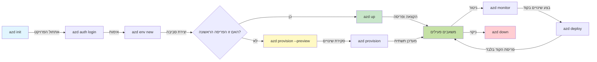
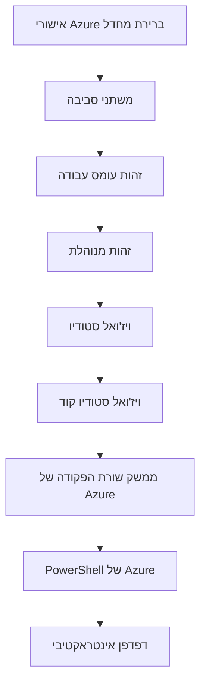

# יסודות AZD - הבנת Azure Developer CLI

# יסודות AZD - עקרונות ויסודות מרכזיים

**ניווט בפרק:**
- **📚 דף הקורס**: [AZD למתחילים](../../README.md)
- **📖 הפרק הנוכחי**: פרק 1 - יסודות והתחלה מהירה
- **⬅️ הקודם**: [סקירת הקורס](../../README.md#-chapter-1-foundation--quick-start)
- **➡️ הבא**: [התקנה והגדרה](installation.md)
- **🚀 הפרק הבא**: [פרק 2: פיתוח מונחה-בינה מלאכותית](../chapter-02-ai-development/microsoft-foundry-integration.md)

## מבוא

שיעור זה מציג לך את Azure Developer CLI (azd), כלי ממשק שורת פקודה עוצמתי שמאיץ את המסע שלך מפיתוח מקומי לפריסת Azure. תלמד את המושגים היסודיים, התכונות המרכזיות, ותבין כיצד azd מפשט את פריסת היישומים המותאמים לענן.

## מטרות הלמידה

בסוף שיעור זה תדע:
- להבין מהו Azure Developer CLI (azd) ומה מטרתו העיקרית
- ללמוד את המושגים המרכזיים: תבניות, סביבות ושירותים
- לחקור תכונות מרכזיות כולל פיתוח מבוסס-תבניות ותשתית כקוד
- להבין את מבנה הפרויקט של azd ואת זרימת העבודה
- להיות מוכן להתקין ולהגדיר את azd לסביבת הפיתוח שלך

## תוצאות הלמידה

לאחר השלמת שיעור זה תוכל:
- להסביר את תפקיד azd בזרימות עבודה מודרניות לפיתוח בענן
- לזהות את מרכיבי מבנה הפרויקט של azd
- לתאר כיצד תבניות, סביבות ושירותים פועלים יחד
- להבין את היתרונות של תשתית כקוד עם azd
- לזהות פקודות שונות של azd ואת מטרותיהן

## מהו Azure Developer CLI (azd)?

Azure Developer CLI (azd) הוא כלי שורת פקודה שנועד להאיץ את המסע שלך מפיתוח מקומי לפריסת Azure. הוא מפשט את תהליך הבניה, הפריסה והניהול של יישומים מותאמי-ענן ב-Azure.

### 🎯 למה להשתמש ב-AZD? השוואה מהעולם האמיתי

בואו נשווה פריסה של אפליקציית ווב פשוטה עם מסד נתונים:

#### ❌ ללא AZD: פריסה ידנית ב-Azure (30+ דקות)

```bash
# שלב 1: צור קבוצת משאבים
az group create --name myapp-rg --location eastus

# שלב 2: צור תוכנית שירות היישומים
az appservice plan create --name myapp-plan \
  --resource-group myapp-rg \
  --sku B1 --is-linux

# שלב 3: צור אפליקציית אינטרנט
az webapp create --name myapp-web-unique123 \
  --resource-group myapp-rg \
  --plan myapp-plan \
  --runtime "NODE:18-lts"

# שלב 4: צור חשבון Cosmos DB (10–15 דקות)
az cosmosdb create --name myapp-cosmos-unique123 \
  --resource-group myapp-rg \
  --kind MongoDB

# שלב 5: צור מסד נתונים
az cosmosdb mongodb database create \
  --account-name myapp-cosmos-unique123 \
  --resource-group myapp-rg \
  --name tododb

# שלב 6: צור אוסף
az cosmosdb mongodb collection create \
  --account-name myapp-cosmos-unique123 \
  --resource-group myapp-rg \
  --database-name tododb \
  --name todos

# שלב 7: קבל מחרוזת חיבור
CONN_STR=$(az cosmosdb keys list \
  --name myapp-cosmos-unique123 \
  --resource-group myapp-rg \
  --type connection-strings \
  --query "connectionStrings[0].connectionString" -o tsv)

# שלב 8: הגדר הגדרות היישום
az webapp config appsettings set \
  --name myapp-web-unique123 \
  --resource-group myapp-rg \
  --settings MONGODB_URI="$CONN_STR"

# שלב 9: הפעל רישום
az webapp log config --name myapp-web-unique123 \
  --resource-group myapp-rg \
  --application-logging filesystem \
  --detailed-error-messages true

# שלב 10: הגדר את Application Insights
az monitor app-insights component create \
  --app myapp-insights \
  --location eastus \
  --resource-group myapp-rg

# שלב 11: קשר את Application Insights לאפליקציית האינטרנט
INSTRUMENTATION_KEY=$(az monitor app-insights component show \
  --app myapp-insights \
  --resource-group myapp-rg \
  --query "instrumentationKey" -o tsv)

az webapp config appsettings set \
  --name myapp-web-unique123 \
  --resource-group myapp-rg \
  --settings APPINSIGHTS_INSTRUMENTATIONKEY="$INSTRUMENTATION_KEY"

# שלב 12: בנה את היישום באופן מקומי
npm install
npm run build

# שלב 13: צור חבילת פריסה
zip -r app.zip . -x "*.git*" "node_modules/*"

# שלב 14: פרוס את היישום
az webapp deployment source config-zip \
  --resource-group myapp-rg \
  --name myapp-web-unique123 \
  --src app.zip

# שלב 15: המתינו והתפללו שזה יעבוד 🙏
# (אין אימות אוטומטי, נדרשת בדיקה ידנית)
```

**בעיות:**
- ❌ יותר מ-15 פקודות לזכור ולהריץ לפי סדר
- ❌ 30–45 דקות של עבודה ידנית
- ❌ קל לעשות שגיאות (טעויות הקלדה, פרמטרים שגויים)
- ❌ מחרוזות חיבור נחשפות בהיסטוריית הטרמינל
- ❌ אין חזרה אוטומטית במקרה של כישלון
- ❌ קשה לשכפל עבור חברי צוות
- ❌ שונה בכל פעם (לא ניתן לשחזור)

#### ✅ עם AZD: פריסה אוטומטית (5 פקודות, 10-15 דקות)

```bash
# שלב 1: אתחול מתבנית
azd init --template todo-nodejs-mongo

# שלב 2: אימות
azd auth login

# שלב 3: יצירת סביבה
azd env new dev

# שלב 4: תצוגה מקדימה של השינויים (אופציונלי אך מומלץ)
azd provision --preview

# שלב 5: פריסת הכל
azd up

# ✨ הושלם! כל הרכיבים פרוסים, מוגדרים ומנוטרים
```

**היתרונות:**
- ✅ **5 פקודות** לעומת יותר מ-15 שלבים ידניים
- ✅ **10–15 דקות** זמן כולל (בעיקר המתנה ל-Azure)
- ✅ **אפס שגיאות** - אוטומטי ונבדק
- ✅ **סודות מנוהלים בצורה מאובטחת** באמצעות Key Vault
- ✅ **חזרה אוטומטית** במקרה של תקלות
- ✅ **ניתן לשחזור במלואו** - אותה תוצאה בכל פעם
- ✅ **מוכן לצוות** - כל אחד יכול לפרוס עם אותן פקודות
- ✅ **תשתית כקוד** - תבניות Bicep בגירסאות
- ✅ **ניטור מובנה** - Application Insights מוגדר אוטומטית

### 📊 חיסכון בזמן ובהפחתת שגיאות

| מדד | פריסה ידנית | פריסת AZD | שיפור |
|:-------|:------------------|:---------------|:------------|
| **פקודות** | 15+ | 5 | 67% פחות |
| **זמן** | 30–45 דק' | 10–15 דק' | 60% מהיר יותר |
| **שיעור שגיאות** | ~40% | <5% | ירידה של 88% |
| **עקביות** | נמוכה (ידנית) | 100% (אוטומטית) | מושלם |
| **קליטת צוות** | 2–4 שעות | 30 דקות | 75% מהיר יותר |
| **זמן חזרה** | 30+ דק' (ידני) | 2 דק' (אוטומטי) | 93% מהיר יותר |

## מושגי ליבה

### תבניות
התבניות הן הבסיס של azd. הן מכילות:
- **קוד יישום** - קוד המקור והתלויות שלך
- **הגדרות תשתית** - משאבי Azure המוגדרים ב-Bicep או Terraform
- **קבצי תצורה** - הגדרות ומשתני סביבה
- **תסריטי פריסה** - זרימות עבודה לפריסה אוטומטית

### סביבות
סביבות מייצגות יעדי פריסה שונים:
- **פיתוח (Development)** - לבדיקות ופיתוח
- **הטמעה (Staging)** - סביבה לפני ייצור
- **ייצור (Production)** - סביבת הייצור החיה

כל סביבה שומרת על:
- קבוצת משאבים של Azure
- הגדרות תצורה
- מצב פריסה

### שירותים
שירותים הם אבני הבניין של האפליקציה שלך:
- **Frontend** - אפליקציות ווב, SPAs
- **Backend** - APIs, מיקרו-שירותים
- **Database** - פתרונות אחסון נתונים
- **Storage** - אחסון קבצים ו-blob

## תכונות עיקריות

### 1. פיתוח מונחה-תבניות
```bash
# עיין בתבניות הזמינות
azd template list

# אתחל מתוך תבנית
azd init --template <template-name>
```

### 2. תשתית כקוד
- **Bicep** - שפת תחום ספציפית של Azure
- **Terraform** - כלי תשתית רב-ענני
- **תבניות ARM** - תבניות Azure Resource Manager

### 3. זרימות עבודה משולבות
```bash
# תהליך פריסה מלא
azd up            # הקמה + פריסה — תהליך אוטומטי להגדרה ראשונית

# 🧪 חדש: תצוגה מקדימה של שינויים בתשתית לפני הפריסה (בטוח)
azd provision --preview    # הדמיית פריסת תשתית ללא ביצוע שינויים

azd provision     # צור משאבי Azure — אם עדכנת את התשתית השתמש בזה
azd deploy        # פריסת קוד היישום או פריסה מחדש לאחר עדכון
azd down          # ניקוי משאבים
```

#### 🛡️ תכנון תשתית בטוח עם תצוגה מקדימה
הפקודה `azd provision --preview` משדרגת את הבטיחות בפריסות:
- **ניתוח הרצה יבשה (Dry-run)** - מציג מה ייווצר, ישונה או יימחק
- **ללא סיכון** - לא מתבצעים שינויים ממשיים בסביבת Azure
- **שיתוף פעולה צוותי** - שתף תוצאות תצוגה מקדימה לפני הפריסה
- **הערכת עלויות** - הבן את עלויות המשאבים לפני ההתחייבות

```bash
# דוגמת תצוגה מקדימה של זרימת עבודה
azd provision --preview           # ראו מה ישתנה
# סקורו את הפלט, דונו עם הצוות
azd provision                     # החילו את השינויים בביטחון
```

### 📊 ויזואליזציה: זרימת העבודה של פיתוח ב-AZD


**הסבר זרימת העבודה:**
1. **Init** - התחל עם תבנית או פרויקט חדש
2. **Auth** - התחבר ל-Azure
3. **Environment** - צור סביבה מבודדת לפריסה
4. **Preview** - 🆕 תמיד הצג תצוגה מקדימה של שינויים בתשתית קודם (נוהג בטוח)
5. **Provision** - צור/עדכן משאבי Azure
6. **Deploy** - דחוף את קוד היישום שלך
7. **Monitor** - צפה בביצועי היישום
8. **Iterate** - בצע שינויים ופרוס מחדש את הקוד
9. **Cleanup** - הסר משאבים כשהעבודה מסתיימת

### 4. ניהול סביבות
```bash
# צור ונהל סביבות
azd env new <environment-name>
azd env select <environment-name>
azd env list
```

## 📁 מבנה הפרויקט

מבנה פרויקט טיפוסי של azd:
```
my-app/
├── .azd/                    # azd configuration
│   └── config.json
├── .azure/                  # Azure deployment artifacts
├── .devcontainer/          # Development container config
├── .github/workflows/      # GitHub Actions
├── .vscode/               # VS Code settings
├── infra/                 # Infrastructure code
│   ├── main.bicep        # Main infrastructure template
│   ├── main.parameters.json
│   └── modules/          # Reusable modules
├── src/                  # Application source code
│   ├── api/             # Backend services
│   └── web/             # Frontend application
├── azure.yaml           # azd project configuration
└── README.md
```

## 🔧 קבצי תצורה

### azure.yaml
קובץ התצורה הראשי של הפרויקט:
```yaml
name: my-awesome-app
metadata:
  template: my-template@1.0.0

services:
  web:
    project: ./src/web
    language: js
    host: appservice
  api:
    project: ./src/api
    language: js
    host: appservice

hooks:
  preprovision:
    shell: pwsh
    run: echo "Preparing to provision..."
```

### .azure/config.json
תצורה ספציפית לסביבה:
```json
{
  "version": 1,
  "defaultEnvironment": "dev",
  "environments": {
    "dev": {
      "subscriptionId": "your-subscription-id",
      "location": "eastus"
    }
  }
}
```

## 🎪 זרימות עבודה נפוצות עם תרגילים מעשיים

> **💡 טיפ למידה:** בצע/י את התרגילים בסדר כדי לבנות את כישורי AZD בהדרגה.

### 🎯 תרגיל 1: אתחל את הפרויקט הראשון שלך

**מטרה:** צור פרויקט AZD וחקור את המבנה שלו

**שלבים:**
```bash
# השתמש בתבנית מוכחת
azd init --template todo-nodejs-mongo

# חקור את הקבצים שנוצרו
ls -la  # הצג את כל הקבצים כולל קבצים מוסתרים

# קבצים מרכזיים שנוצרו:
# - azure.yaml (תצורה ראשית)
# - infra/ (קוד תשתיות)
# - src/ (קוד היישום)
```

**✅ הצלחה:** יש לך את התיקיות azure.yaml, infra/, ו-src/

---

### 🎯 תרגיל 2: פרוס ל-Azure

**מטרה:** השלם פריסה מקצה לקצה

**שלבים:**
```bash
# 1. אמת את זהותך
az login && azd auth login

# 2. צור סביבה
azd env new dev
azd env set AZURE_LOCATION eastus

# 3. תצוגה מקדימה של השינויים (מומלץ)
azd provision --preview

# 4. פרוס הכל
azd up

# 5. אמת את הפריסה
azd show    # צפה בכתובת ה-URL של האפליקציה שלך
```

**זמן משוער:** 10-15 דקות  
**✅ הצלחה:** כתובת ה-URL של היישום נפתחת בדפדפן

---

### 🎯 תרגיל 3: סביבות מרובות

**מטרה:** פרוס ל-dev ול-staging

**שלבים:**
```bash
# כבר יש dev, צור staging
azd env new staging
azd env set AZURE_LOCATION westus2
azd up

# החלף ביניהם
azd env list
azd env select dev
```

**✅ הצלחה:** שתי קבוצות משאבים נפרדות ב-Azure Portal

---

### 🛡️ התחלה נקייה: `azd down --force --purge`

כאשר אתה צריך לאפס לחלוטין:

```bash
azd down --force --purge
```

**מה זה עושה:**
- `--force`: אין בקשות לאישור
- `--purge`: מוחק את כל המצב המקומי ומשאבי Azure

**להשתמש כאשר:**
- הפריסה נכשלה באמצע
- מעבר בין פרויקטים
- צורך בתחילת נקי

---

## 🎪 הפניה לזרימת עבודה מקורית

### התחלת פרויקט חדש
```bash
# שיטה 1: השתמש בתבנית קיימת
azd init --template todo-nodejs-mongo

# שיטה 2: התחל מאפס
azd init

# שיטה 3: השתמש בתיקייה הנוכחית
azd init .
```

### מחזור פיתוח
```bash
# הגדר סביבת פיתוח
azd auth login
azd env new dev
azd env select dev

# פרוס הכל
azd up

# בצע שינויים ופרוס מחדש
azd deploy

# נקה בסיום
azd down --force --purge # הפקודה ב-Azure Developer CLI היא **איפוס מוחלט** עבור הסביבה שלך—שימושית במיוחד כשאתה מאבחן פריסות שנכשלו, מנקה משאבים יתומים או מתכונן לפריסה מחדש נקייה.
```

## הבנת `azd down --force --purge`
הפקודה `azd down --force --purge` היא דרך עוצמתית לפרק לחלוטין את סביבת azd שלך ואת כל המשאבים המשויכים. הנה פירוט של מה שכל דגל עושה:
```
--force
```
- מדלג על בקשות לאישור.
- שימושי לאוטומציה או להפעלה דרך סקריפטים כאשר קלט ידני אינו אפשרי.
- מבטיח שההשמדה תתבצע ללא הפרעות, גם אם ה-CLI מזהה חוסר התאמות.

```
--purge
```
מוחק **את כל המטא-נתונים הקשורים**, כולל:
מצב הסביבה
התיקיה המקומית `.azure`
מידע מטמון של הפריסה
מונע מ-azd "להזכיר" פריסות קודמות, מה שיכול לגרום לבעיות כמו קבוצות משאבים לא תואמות או הפניות רישום מיושנות.


### למה להשתמש בשניהם?
כאשר נתקעת עם `azd up` עקב מצב שאריות או פריסות חלקיות, שילוב זה מבטיח התחלה נקייה.

זה מועיל במיוחד לאחר מחיקות משאבים ידניות בפורטל Azure או בעת החלפת תבניות, סביבות, או קונבנציות שמות של קבוצות משאבים.


### ניהול סביבות מרובות
```bash
# צור סביבת בדיקה
azd env new staging
azd env select staging
azd up

# חזור לסביבת הפיתוח
azd env select dev

# השווה בין הסביבות
azd env list
```

## 🔐 אימות ואישורים

הבנה של אימות היא קריטית לפריסות azd מוצלחות. Azure משתמשת בשיטות אימות מרובות, ו-azd מנצל את שרשרת האסמכתאות אותה משתמשים כלים אחרים של Azure.

### אימות Azure CLI (`az login`)

לפני שימוש ב-azd, עליך להתחבר ל-Azure. השיטה השכיחה ביותר היא באמצעות Azure CLI:

```bash
# התחברות אינטראקטיבית (פותח דפדפן)
az login

# התחברות עם טננט ספציפי
az login --tenant <tenant-id>

# התחברות עם יישות שירות
az login --service-principal -u <app-id> -p <password> --tenant <tenant-id>

# בדוק את מצב ההתחברות הנוכחי
az account show

# הצג את המנויים הזמינים
az account list --output table

# הגדר מנוי ברירת מחדל
az account set --subscription <subscription-id>
```

### זרימת אימות
1. **כניסה אינטראקטיבית (Interactive Login)**: פותחת את הדפדפן המוגדר כברירת מחדל לצורך אימות
2. **Device Code Flow**: עבור סביבות ללא גישה לדפדפן
3. **Service Principal**: עבור אוטומציה ותרחישי CI/CD
4. **Managed Identity**: עבור יישומים המתארחים ב-Azure

### שרשרת DefaultAzureCredential

`DefaultAzureCredential` הוא סוג אסמכתא שמספק חווית אימות מפושטת על ידי ניסיון אוטומטי של מקורות אסמכתאות מרובים בסדר מסוים:

#### סדר שרשרת האסמכתאות

#### 1. משתני סביבה
```bash
# הגדר משתני סביבה עבור יישות השירות
export AZURE_CLIENT_ID="<app-id>"
export AZURE_CLIENT_SECRET="<password>"
export AZURE_TENANT_ID="<tenant-id>"
```

#### 2. Workload Identity (Kubernetes/GitHub Actions)
נמצא בשימוש אוטומטי ב:
- Azure Kubernetes Service (AKS) עם Workload Identity
- GitHub Actions עם פדרציית OIDC
- תרחישי זהות מאוחדת אחרים

#### 3. Managed Identity
עבור משאבי Azure כגון:
- מכונות וירטואליות
- App Service
- Azure Functions
- מופעי מכולות (Container Instances)

```bash
# בדוק אם רץ על משאב של Azure עם זהות מנוהלת
az account show --query "user.type" --output tsv
# מחזיר: "servicePrincipal" אם משתמש בזהות מנוהלת
```

#### 4. אינטגרציה עם כלי מפתחים
- **Visual Studio**: משתמש אוטומטית בחשבון המחובר
- **VS Code**: משתמש באסמכתאות של תוסף Azure Account
- **Azure CLI**: משתמש באסמכתאות `az login` (השכיח ביותר לפיתוח מקומי)

### הגדרת אימות ל-AZD

```bash
# שיטה 1: השתמש ב-Azure CLI (מומלץ לפיתוח)
az login
azd auth login  # משתמש באישורי Azure CLI הקיימים

# שיטה 2: אימות ישיר באמצעות azd
azd auth login --use-device-code  # לסביבות ללא ממשק גרפי

# שיטה 3: בדוק את מצב האימות
azd auth login --check-status

# שיטה 4: התנתק והתחבר מחדש
azd auth logout
azd auth login
```

### שיטות מומלצות לאימות

#### לפיתוח מקומי
```bash
# 1. התחבר באמצעות Azure CLI
az login

# 2. וודא שהמנוי נכון
az account show
az account set --subscription "Your Subscription Name"

# 3. השתמש ב-azd עם האישורים הקיימים
azd auth login
```

#### עבור צינורות CI/CD
```yaml
# GitHub Actions example
- name: Azure Login
  uses: azure/login@v1
  with:
    creds: ${{ secrets.AZURE_CREDENTIALS }}

- name: Deploy with azd
  run: |
    azd auth login --client-id ${{ secrets.AZURE_CLIENT_ID }} \
                    --client-secret ${{ secrets.AZURE_CLIENT_SECRET }} \
                    --tenant-id ${{ secrets.AZURE_TENANT_ID }}
    azd up --no-prompt
```

#### עבור סביבות ייצור
- השתמש ב-**Managed Identity** כשהריצה על משאבי Azure
- השתמש ב-**Service Principal** לתרחישי אוטומציה
- הימנע מאחסון סיסמאות בקוד או בקבצי תצורה
- השתמש ב-**Azure Key Vault** עבור תצורה רגישת

### בעיות אימות נפוצות ופתרונות

#### בעיה: "לא נמצאה מנוי"
```bash
# פתרון: הגדר מנוי ברירת מחדל
az account list --output table
az account set --subscription "<subscription-id>"
azd env set AZURE_SUBSCRIPTION_ID "<subscription-id>"
```

#### בעיה: "הרשאות לא מספקות"
```bash
# פתרון: בדוק והקצה את התפקידים הנדרשים
az role assignment list --assignee $(az account show --query user.name --output tsv)

# תפקידים דרושים נפוצים:
# - תורם (לניהול משאבים)
# - מנהל גישת משתמשים (להקצאת תפקידים)
```

#### בעיה: "הטוקן פג תוקף"
```bash
# פתרון: התחבר מחדש
az logout
az login
azd auth logout
azd auth login
```

### אימות בתרחישים שונים

#### פיתוח מקומי
```bash
# חשבון להתפתחות אישית
az login
azd auth login
```

#### פיתוח צוותי
```bash
# השתמש בטננט ספציפי עבור הארגון
az login --tenant contoso.onmicrosoft.com
azd auth login
```

#### תרחישים מולטיטננטיים
```bash
# החלף בין שוכרים
az login --tenant tenant1.onmicrosoft.com
# פרוס לשוכר 1
azd up

az login --tenant tenant2.onmicrosoft.com  
# פרוס לשוכר 2
azd up
```

### שיקולי אבטחה

1. **אחסון אסמכתאות**: לעולם אל תאחסן אסמכתאות בקוד מקור
2. **הגבלת תחום**: השתמש בעיקרון ההרשאה המינימלית עבור Service Principals
3. **סיבוב טוקנים**: החלף סודות של Service Principals באופן קבוע
4. **מעקב ובקרה (Audit Trail)**: ניטור פעילות אימות ופריסה
5. **אבטחת רשת**: השתמש בנקודות קצה פרטיות כאשר ניתן

### פתרון בעיות אימות

```bash
# ‎איתור ותיקון בעיות אימות
azd auth login --check-status
az account show
az account get-access-token

# ‎פקודות אבחון נפוצות
whoami                          # ‎ההקשר של המשתמש הנוכחי
az ad signed-in-user show      # ‎פרטי משתמש ב-Azure AD
az group list                  # ‎בדוק גישה למשאבים
```

## הבנת `azd down --force --purge`

### גילוי
```bash
azd template list              # עיין בתבניות
azd template show <template>   # פרטי התבנית
azd init --help               # אפשרויות אתחול
```

### ניהול פרויקטים
```bash
azd show                     # סקירת הפרויקט
azd env show                 # הסביבה הנוכחית
azd config list             # הגדרות תצורה
```

### ניטור
```bash
azd monitor                  # פתח את דף הניטור בפורטל Azure
azd monitor --logs           # הצג יומני היישום
azd monitor --live           # הצג מדדים בזמן אמת
azd pipeline config          # הגדר CI/CD
```

## שיטות מומלצות

### 1. השתמש בשמות בעלי משמעות
```bash
# טוב
azd env new production-east
azd init --template web-app-secure

# הימנע
azd env new env1
azd init --template template1
```

### 2. נצל תבניות
- התחל עם תבניות קיימות
- התאם לצרכיך
- צור תבניות לשימוש חוזר לארגון שלך

### 3. בידוד סביבות
- השתמש בסביבות נפרדות ל-dev/staging/prod
- לעולם אל תפרוס ישירות לייצור מהמכונה המקומית
- השתמש בצינורות CI/CD לפריסות ייצור

### 4. ניהול תצורה
- השתמש במשתני סביבה עבור נתונים רגישים
- שמור את התצורה בשליטת גרסאות
- תעד הגדרות ספציפיות לסביבה

## התקדמות הלמידה

### מתחילים (שבוע 1-2)
1. התקן את azd והתחבר
2. פרוס תבנית פשוטה
3. הבן את מבנה הפרויקט
4. למד פקודות בסיסיות (up, down, deploy)

### ביניים (שבוע 3-4)
1. התאם תבניות
2. נהל סביבות מרובות
3. הבן קוד תשתית
4. הקם צינורות CI/CD

### מתקדם (שבוע 5+)
1. צור תבניות מותאמות
2. דפוסי תשתית מתקדמים
3. פריסות בריבוי אזורים
4. תצורות ברמת ארגון

## צעדים הבאים

**📖 המשך ללמוד את פרק 1:**
- [התקנה והגדרה](installation.md) - התקן והגדר את azd
- [הפרויקט הראשון שלך](first-project.md) - מדריך מעשי מקיף
- [מדריך תצורה](configuration.md) - אפשרויות תצורה מתקדמות

**🎯 מוכנים לפרק הבא?**
- [פרק 2: פיתוח ממוקד AI](../chapter-02-ai-development/microsoft-foundry-integration.md) - התחל לבנות יישומי AI

## משאבים נוספים

- [סקירה של Azure Developer CLI](https://learn.microsoft.com/en-us/azure/developer/azure-developer-cli/)
- [גלריית תבניות](https://azure.github.io/awesome-azd/)
- [דוגמאות מהקהילה](https://github.com/Azure-Samples)

---

## 🙋 שאלות נפוצות

### שאלות כלליות

**ש: מה ההבדל בין AZD ו-Azure CLI?**

תש: Azure CLI (`az`) מיועד לניהול משאבים בודדים ב-Azure. AZD (`azd`) מיועד לניהול יישומים שלמים:

```bash
# Azure CLI - ניהול משאבים ברמה נמוכה
az webapp create --name myapp --resource-group rg
az sql server create --name myserver --resource-group rg
# ...נדרשות עוד פקודות רבות

# AZD - ניהול ברמת היישום
azd up  # מפריס את כל היישום עם כל המשאבים
```

**חשבו על זה כך:**
- `az` = פעולה על לבני לגו בודדות
- `azd` = עבודה עם ערכות לגו שלמות

---

**ש: האם אני צריך לדעת Bicep או Terraform כדי להשתמש ב-AZD?**

תש: לא! התחל עם תבניות:
```bash
# השתמש בתבנית קיימת - אין צורך בידע ב-IaC
azd init --template todo-nodejs-mongo
azd up
```

ניתן ללמוד Bicep מאוחר יותר כדי להתאים את התשתית. התבניות מספקות דוגמאות עובדות ללמידה.

---

**ש: כמה זה עולה להריץ תבניות של AZD?**

תש: העלויות משתנות בהתאם לתבנית. רוב תבניות הפיתוח עולות $50-150/חודש:

```bash
# הצג עלויות לפני פריסה
azd provision --preview

# נקה תמיד כשלא בשימוש
azd down --force --purge  # מסיר את כל המשאבים
```

**טיפ מקצועי:** השתמש בשכבות חינמיות כאשר ישנן:
- App Service: F1 (Free) tier
- Azure OpenAI: 50,000 tokens/חודש בחינם
- Cosmos DB: 1000 RU/s free tier

---

**ש: האם ניתן להשתמש ב-AZD עם משאבים קיימים ב-Azure?**

תש: כן, אבל קל יותר להתחיל מחדש. AZD עובד טוב יותר כשהוא מנהל את מחזור החיים המלא. עבור משאבים קיימים:

```bash
# אפשרות 1: ייבא משאבים קיימים (מתקדם)
azd init
# לאחר מכן עדכן את infra/ כדי להפנות למשאבים קיימים

# אפשרות 2: התחל מחדש (מומלץ)
azd init --template matching-your-stack
azd up  # יוצר סביבה חדשה
```

---

**ש: איך אני משתף את הפרויקט שלי עם חברי צוות?**

תש: בצע commit לפרויקט AZD ל-Git (אבל לא את התיקייה .azure):

```bash
# כבר נמצא בקובץ .gitignore כברירת מחדל
.azure/        # מכיל סודות ונתוני סביבה
*.env          # משתני סביבה

# חברי הצוות אז:
git clone <your-repo>
azd auth login
azd env new <their-name>-dev
azd up
```

לכולם תשתית זהה מאותן התבניות.

---

### שאלות פתרון תקלות

**ש: "azd up" נכשלה באמצע. מה עלי לעשות?**

תש: בדוק את השגיאה, תקן אותה ואז נסה שוב:

```bash
# הצג יומנים מפורטים
azd show

# תיקונים נפוצים:

# 1. אם חרגה המכסה:
azd env set AZURE_LOCATION "westus2"  # נסו אזור אחר

# 2. אם קיים קונפליקט בשם המשאב:
azd down --force --purge  # התחל במצב נקי
azd up  # נסו שוב

# 3. אם תוקף האימות פג:
az login
azd auth login
azd up
```

**הבעיה השכיחה ביותר:** נבחר מנוי Azure שגוי
```bash
az account list --output table
az account set --subscription "<correct-subscription>"
```

---

**ש: איך לפרוס רק שינויים בקוד ללא פריסה מחדש של התשתית?**

תש: השתמש ב-`azd deploy` במקום `azd up`:

```bash
azd up          # פעם ראשונה: הקמה + פריסה (איטית)

# בצע שינויים בקוד...

azd deploy      # בפעמים הבאות: פריסה בלבד (מהירה)
```

השוואת מהירות:
- `azd up`: 10-15 דקות (מספקת את התשתית)
- `azd deploy`: 2-5 דקות (רק קוד)

---

**ש: האם אפשר להתאים את תבניות התשתית?**

תש: כן! ערוך את קבצי Bicep ב-`infra/`:

```bash
# לאחר azd init
cd infra/
code main.bicep  # ערוך ב-VS Code

# תצוגה מקדימה של השינויים
azd provision --preview

# החל את השינויים
azd provision
```

**טיפ:** תתחיל בקטן - שנה קודם את ה-SKU:
```bicep
// infra/main.bicep
sku: {
  name: 'B1'  // Change to 'P1V2' for production
}
```

---

**ש: איך מוחקים את כל מה ש-AZD יצר?**

תש: פקודה אחת מסירה את כל המשאבים:

```bash
azd down --force --purge

# זה מוחק:
# - כל משאבי Azure
# - קבוצת משאבים
# - מצב הסביבה המקומית
# - נתוני פריסה במטמון
```

**הרץ את זה תמיד כאשר:**
- סיימת לבדוק תבנית
- עוברים לפרויקט אחר
- רוצים להתחיל מחדש

**חיסכון בעלויות:** מחיקת משאבים שאינם בשימוש = $0 חיובים

---

**ש: מה אם מחקתי בטעות משאבים ב-Azure Portal?**

תש: מצב ה-AZD עלול להתנתק. השתמש בגישה של התחלה נקייה:

```bash
# 1. הסר את המצב המקומי
azd down --force --purge

# 2. התחל מחדש
azd up

# חלופה: אפשר ל-AZD לזהות ולתקן
azd provision  # ייווצרו משאבים חסרים
```

---

### שאלות מתקדמות

**ש: האם ניתן להשתמש ב-AZD בצינורות CI/CD?**

תש: כן! דוגמה ל-GitHub Actions:

```yaml
# .github/workflows/deploy.yml
name: Deploy with AZD

on:
  push:
    branches: [main]

jobs:
  deploy:
    runs-on: ubuntu-latest
    steps:
      - uses: actions/checkout@v2
      
      - name: Install azd
        run: curl -fsSL https://aka.ms/install-azd.sh | bash
      
      - name: Azure Login
        run: |
          azd auth login \
            --client-id ${{ secrets.AZURE_CLIENT_ID }} \
            --client-secret ${{ secrets.AZURE_CLIENT_SECRET }} \
            --tenant-id ${{ secrets.AZURE_TENANT_ID }}
      
      - name: Deploy
        run: azd up --no-prompt
```

---

**ש: איך מטפלים בסודות ובנתונים רגישים?**

תש: AZD משתלב עם Azure Key Vault באופן אוטומטי:

```bash
# הסודות מאוחסנים במאגר המפתחות, לא בקוד
azd env set DATABASE_PASSWORD "$(openssl rand -base64 32)"

# AZD באופן אוטומטי:
# 1. יוצר מאגר מפתחות
# 2. מאחסן סוד
# 3. מעניק לאפליקציה גישה באמצעות זהות מנוהלת
# 4. מזריק בזמן הריצה
```

**לעולם אל תבצע commit של:**
- `.azure/` folder (contains environment data)
- `.env` files (local secrets)
- Connection strings

---

**ש: האם אפשר לפרוס למספר אזורים?**

תש: כן, צור סביבת עבודה לכל אזור:

```bash
# סביבת מזרח ארה"ב
azd env new prod-eastus
azd env set AZURE_LOCATION eastus
azd up

# סביבת מערב אירופה
azd env new prod-westeurope
azd env set AZURE_LOCATION westeurope
azd up

# כל סביבה עצמאית
azd env list
```

עבור יישומים מרובי-אזורים אמיתיים, התאם את תבניות Bicep כדי לפרוס לאזורים מרובים בו-זמנית.

---

**ש: איפה אפשר לקבל עזרה אם נתקעת?**

1. **תיעוד AZD:** https://learn.microsoft.com/azure/developer/azure-developer-cli/
2. **בעיות ב-GitHub:** https://github.com/Azure/azure-dev/issues
3. **דיסקורד:** [Azure Discord](https://discord.gg/microsoft-azure) - ערוץ #azure-developer-cli
4. **Stack Overflow:** השתמשו בתגית `azure-developer-cli`
5. **הקורס הזה:** [מדריך פתרון תקלות](../chapter-07-troubleshooting/common-issues.md)

**טיפ מקצועי:** לפני שתשאל, הרץ:
```bash
azd show       # מציג את המצב הנוכחי
azd version    # מציג את הגרסה שלך
```
ציין את המידע הזה בשאלתך לקבלת עזרה מהירה יותר.

---

## 🎓 מה הלאה?

כעת אתה מבין את יסודות AZD. בחר את הנתיב שלך:

### 🎯 למתחילים:
1. **הבא:** [התקנה והגדרה](installation.md) - התקן את AZD על המכונה שלך
2. **לאחר מכן:** [הפרויקט הראשון שלך](first-project.md) - פרוס את האפליקציה הראשונה שלך
3. **התאמן:** סיים את כל 3 התרגילים בשיעור זה

### 🚀 למפתחי AI:
1. **דלג אל:** [פרק 2: פיתוח ממוקד AI](../chapter-02-ai-development/microsoft-foundry-integration.md)
2. **פרוס:** התחל עם `azd init --template get-started-with-ai-chat`
3. **למד:** בנה תוך כדי פריסה

### 🏗️ למפתחים מנוסים:
1. **סקור:** [מדריך תצורה](configuration.md) - הגדרות מתקדמות
2. **חקור:** [תשתית כקוד](../chapter-04-infrastructure/provisioning.md) - עיון מעמיק ב-Bicep
3. **בנה:** צור תבניות מותאמות לערימה שלך

---

**ניווט בין פרקים:**
- **📚 בית הקורס**: [AZD למתחילים](../../README.md)
- **📖 הפרק הנוכחי**: פרק 1 - יסודות והתחלה מהירה  
- **⬅️ הקודם**: [סקירת הקורס](../../README.md#-chapter-1-foundation--quick-start)
- **➡️ הבא**: [התקנה והגדרה](installation.md)
- **🚀 הפרק הבא**: [פרק 2: פיתוח ממוקד AI](../chapter-02-ai-development/microsoft-foundry-integration.md)

---

<!-- CO-OP TRANSLATOR DISCLAIMER START -->
הצהרת אחריות:
מסמך זה תורגם באמצעות שירות תרגום מבוסס בינה מלאכותית Co-op Translator (https://github.com/Azure/co-op-translator). למרות שאנו שואפים לדיוק, יש לשים לב כי תרגומים אוטומטיים עלולים להכיל שגיאות או אי-דיוקים. יש להחשיב את המסמך המקורי בשפתו כגרסה הסמכותית. למידע קריטי מומלץ שימוש בתרגום מקצועי על ידי מתרגם אנושי. איננו אחראים לכל אי-הבנה או פרשנות שגויה הנובעת מהשימוש בתרגום זה.
<!-- CO-OP TRANSLATOR DISCLAIMER END -->