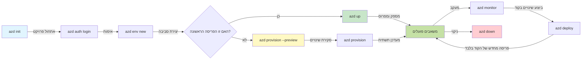
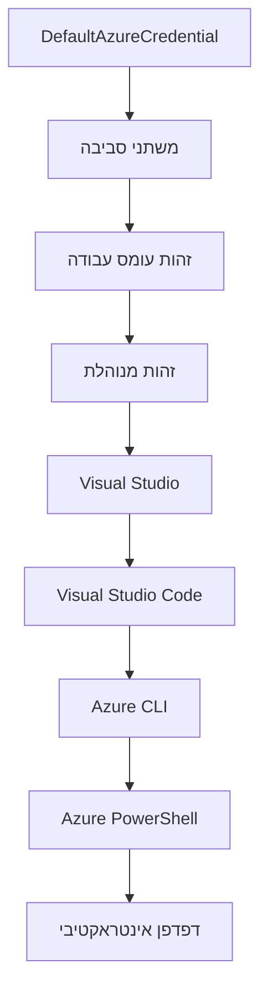

# יסודות AZD - הבנת Azure Developer CLI

# יסודות AZD - מושגים מרכזיים ויסודות

**ניווט בפרקים:**
- **📚 דף הקורס הראשי**: [AZD למתחילים](../../README.md)
- **📖 פרק נוכחי**: פרק 1 - יסודות והתחלה מהירה
- **⬅️ קודם**: [סקירת הקורס](../../README.md#-chapter-1-foundation--quick-start)
- **➡️ הבא**: [התקנה והגדרה](installation.md)
- **🚀 פרק הבא**: [פרק 2: פיתוח מבוסס AI](../chapter-02-ai-development/microsoft-foundry-integration.md)

## مقدمة

השיעור הזה מציג בפניך את Azure Developer CLI (azd), כלי שורת פקודה רב-עוצמה שמאיץ את המסע שלך מפיתוח מקומי לפריסה ב-Azure. תלמד את המושגים הבסיסיים, התכונות המרכזיות, ותבין כיצד azd מפשט את פריסת יישומים טבעיים לענן.

## יעדי הלמידה

בסיום שיעור זה תוכל:
- להבין מהו Azure Developer CLI ומה מטרתו העיקרית
- ללמוד את המושגים המרכזיים של תבניות, סביבות ושירותים
- לחקור תכונות עיקריות כולל פיתוח מונחה תבניות ותשתית כקוד
- להבין את מבנה פרויקט azd ואת זרימת העבודה שלו
- להיות מוכן להתקין ולהגדיר את azd עבור סביבת הפיתוח שלך

## תוצאות הלמידה

עם סיום השיעור תוכל:
- להסביר את תפקיד azd בזרמי העבודה של פיתוח ענן מודרניים
- לזהות את רכיבי מבנה פרויקט azd
- לתאר איך תבניות, סביבות ושירותים פועלים יחד
- להבין את היתרונות של תשתית כקוד עם azd
- לזהות פקודות azd שונות ואת מטרותיהן

## מהו Azure Developer CLI (azd)?

Azure Developer CLI (azd) הוא כלי שורת פקודה שנועד להאיץ את המסלול שלך מפיתוח מקומי לפריסה ב-Azure. הוא מפשט את תהליך הבנייה, הפריסה וניהול יישומים טבעיים-ענן ב-Azure.

### במה ניתן לפרוס עם azd?

azd תומך במגוון רחב של עומסי עבודה - וההרשימה ממשיכה לגדול. היום, תוכל להשתמש ב-azd לפרוס:

| סוג העומס | דוגמאות | אותה זרימת עבודה? |
|-----------|---------|-------------------|
| **יישומים מסורתיים** | אפליקציות ווב, REST APIs, אתרים סטטיים | ✅ `azd up` |
| **שירותים ומיקרושירותים** | Container Apps, Function Apps, Backend רב-שירותי | ✅ `azd up` |
| **יישומים מבוססי AI** | אפליקציות צ׳אט עם דגמי Microsoft Foundry, פתרונות RAG עם חיפוש AI | ✅ `azd up` |
| **סוכנים אינטיליגנטיים** | סוכנים המתארחים ב-Foundry, אוטורכזציה של סוכנים מרובי | ✅ `azd up` |

התובנה המרכזית היא ש**מחזור החיים של azd נשאר זהה ללא קשר למה שאתה מפרוס**. אתה יוזם פרויקט, מספק תשתית, מפרוס את הקוד שלך, מנטר את האפליקציה, ומנקה - בין אם מדובר באתר פשוט או סוכן AI מתוחכם.

רצף זה הוא במכוון. azd מתייחס ליכולות AI כשירות נוסף שהאפליקציה שלך יכולה להשתמש בו, לא כמשהו שונה במהותו. נקודת קצה של צ׳אט מונעת על ידי דגמי Microsoft Foundry היא, מנקודת המבט של azd, רק שירות נוסף שיש להגדיר ולפרוס.

### 🎯 למה להשתמש ב-AZD? השוואה מעשית

נעשה השוואה בין פריסת אפליקציית ווב פשוטה עם בסיס נתונים:

#### ❌ בלי AZD: פריסה ידנית (מעל 30 דקות)

```bash
# שלב 1: צור קבוצת משאבים
az group create --name myapp-rg --location eastus

# שלב 2: צור תוכנית שירות אפליקציות
az appservice plan create --name myapp-plan \
  --resource-group myapp-rg \
  --sku B1 --is-linux

# שלב 3: צור אפליקציית רשת
az webapp create --name myapp-web-unique123 \
  --resource-group myapp-rg \
  --plan myapp-plan \
  --runtime "NODE:18-lts"

# שלב 4: צור חשבון Cosmos DB (10-15 דקות)
az cosmosdb create --name myapp-cosmos-unique123 \
  --resource-group myapp-rg \
  --kind MongoDB

# שלב 5: צור מסד נתונים
az cosmosdb mongodb database create \
  --account-name myapp-cosmos-unique123 \
  --resource-group myapp-rg \
  --name tododb

# שלב 6: צור אוסף
az cosmosdb mongodb collection create \
  --account-name myapp-cosmos-unique123 \
  --resource-group myapp-rg \
  --database-name tododb \
  --name todos

# שלב 7: קבל מחרוזת חיבור
CONN_STR=$(az cosmosdb keys list \
  --name myapp-cosmos-unique123 \
  --resource-group myapp-rg \
  --type connection-strings \
  --query "connectionStrings[0].connectionString" -o tsv)

# שלב 8: קבע הגדרות אפליקציה
az webapp config appsettings set \
  --name myapp-web-unique123 \
  --resource-group myapp-rg \
  --settings MONGODB_URI="$CONN_STR"

# שלב 9: הפעל רישום יומן
az webapp log config --name myapp-web-unique123 \
  --resource-group myapp-rg \
  --application-logging filesystem \
  --detailed-error-messages true

# שלב 10: הגדר Application Insights
az monitor app-insights component create \
  --app myapp-insights \
  --location eastus \
  --resource-group myapp-rg

# שלב 11: קישור App Insights לאפליקציית רשת
INSTRUMENTATION_KEY=$(az monitor app-insights component show \
  --app myapp-insights \
  --resource-group myapp-rg \
  --query "instrumentationKey" -o tsv)

az webapp config appsettings set \
  --name myapp-web-unique123 \
  --resource-group myapp-rg \
  --settings APPINSIGHTS_INSTRUMENTATIONKEY="$INSTRUMENTATION_KEY"

# שלב 12: בנה את האפליקציה באופן מקומי
npm install
npm run build

# שלב 13: צור חבילת פריסה
zip -r app.zip . -x "*.git*" "node_modules/*"

# שלב 14: פרוס את האפליקציה
az webapp deployment source config-zip \
  --resource-group myapp-rg \
  --name myapp-web-unique123 \
  --src app.zip

# שלב 15: המתן והתפלל שזה יעבוד 🙏
# (אין אימות אוטומטי, נדרש בדיקה ידנית)
```

**בעיות:**
- ❌ מעל 15 פקודות לזכור ולהריץ לפי סדר
- ❌ עבודה ידנית של 30-45 דקות
- ❌ קל לטעות (טעויות כתיב, פרמטרים שגויים)
- ❌ מחרוזות חיבור מוגלות בהיסטוריית הטרמינל
- ❌ אין ביטול אוטומטי אם משהו נכשל
- ❌ קשה לשכפל לחברי צוות
- ❌ שונה בכל פעם (לא ניתן לשחזור)

#### ✅ עם AZD: פריסה אוטומטית (5 פקודות, 10-15 דקות)

```bash
# שלב 1: אתחל מתוך תבנית
azd init --template todo-nodejs-mongo

# שלב 2: אימות
azd auth login

# שלב 3: צור סביבה
azd env new dev

# שלב 4: תצוגה מקדימה של שינויים (אופציונלי אך מומלץ)
azd provision --preview

# שלב 5: פרוס הכל
azd up

# ✨ הושלם! הכל פרוס, מוגדר ונצפה
```

**יתרונות:**
- ✅ **5 פקודות** לעומת 15+ שלבים ידניים
- ✅ **10-15 דקות** זמן כולל (בעיקר המתנה ל-Azure)
- ✅ **פחות טעויות ידניות** - זרימת עבודה עקבית ומבוססת תבניות
- ✅ **טיפול בטוח בסודות** - תבניות רבות משתמשות באחסון סודות מנוהל על ידי Azure
- ✅ **פריסות הניתנות לחזרה** - אותה זרימת עבודה בכל פעם
- ✅ **שחזור מלא** - אותו תוצאה בכל פעם
- ✅ **מוכנות לצוות** - כל אחד יכול לפרוס עם אותן פקודות
- ✅ **תשתית כקוד** - תבניות Bicep מבוקרות בגרסאות
- ✅ **ניטור מובנה** - Application Insights מוגדר אוטומטית

### 📊 הקטנת זמן ושגיאות

| מדד | פריסה ידנית | פריסת AZD | שיפור |
|:----|:-------------|:-----------|:-------|
| **פקודות** | 15+ | 5 | 67% פחות |
| **זמן** | 30-45 דקות | 10-15 דקות | 60% מהיר יותר |
| **שיעור שגיאות** | ~40% | <5% | ירידה של 88% |
| **עקביות** | נמוכה (ידנית) | 100% (אוטומטית) | מושלם |
| **קבלת צוות** | 2-4 שעות | 30 דקות | 75% מהיר יותר |
| **זמן ביטול** | מעל 30 דקות (ידני) | 2 דקות (אוטומטי) | 93% מהיר יותר |

## מושגים מרכזיים

### תבניות
התבניות הן היסוד של azd. הן מכילות:
- **קוד אפליקציה** - קוד המקור והתלויות שלך
- **הגדרות תשתית** - משאבי Azure המוגדרים ב-Bicep או Terraform
- **קבצי תצורה** - הגדרות ומשתני סביבה
- **סקריפטים לפריסה** - זרימות עבודה של פריסה אוטומטית

### סביבות
הסביבות מייצגות יעדי פריסה שונים:
- **פיתוח** - לבדיקות ופיתוח
- **סטייג׳ינג** - סביבת טרום-ייצור
- **ייצור** - סביבת ייצור חיה

כל סביבה מחזיקה ב:
- קבוצת משאבים ב-Azure משלה
- הגדרות תצורה משלה
- מצב פריסה משלה

### שירותים
השירותים הם אבני הבניין של האפליקציה שלך:
- **חזית** - אפליקציות ווב, SPA
- **גב** - APIs, מיקרושירותים
- **מסד נתונים** - פתרונות אחסון נתונים
- **אחסון** - אחסון קבצים ובלובים

## תכונות עיקריות

### 1. פיתוח מונחה תבניות
```bash
# דפדף בתבניות הזמינות
azd template list

# אתחל מתבנית
azd init --template <template-name>
```

### 2. תשתית כקוד
- **Bicep** - שפת דומיין ספציפית של Azure
- **Terraform** - כלי תשתית רב-ענני
- **תבניות ARM** - תבניות Azure Resource Manager

### 3. זרימות עבודה משולבות
```bash
# זרימת עבודה מלאה לפריסה
azd up            # אספקה + פריסה זה ללא התערבות להתקנה ראשונית

# 🧪 חדש: תצוגה מוקדמת של שינויים בתשתית לפני פריסה (בטוח)
azd provision --preview    # לדמות פריסת תשתית ללא ביצוע שינויים

azd provision     # ליצור משאבי Azure אם מעדכנים את התשתית השתמש בזה
azd deploy        # לפרוס קוד אפליקציה או לפרוס מחדש את קוד האפליקציה לאחר עדכון
azd down          # לנקות משאבים
```

#### 🛡️ תכנון תשתית בטוח עם תצוגה מוקדמת
פקודת `azd provision --preview` משנה את כללי המשחק לפריסות בטוחות:
- **הרצת יבש** - מראה מה ייווצר, ישונה או יימחק
- **סיכון אפס** - אין שינויים ממשיים בסביבת Azure שלך
- **שיתוף בצוות** - שתף תוצאות תצוגה מוקדמת לפני הפריסה
- **הערכת עלויות** - הבן את עלות המשאבים לפני המחויבות

```bash
# דוגמת תצוגה מקדימה של זרימת עבודה
azd provision --preview           # ראה מה ישתנה
# סקור את הפלט, דון עם הצוות
azd provision                     # החל שינויים בביטחון
```

### 📊 ויזואלי: זרימת עבודה בפיתוח AZD



**הסבר זרימת עבודה:**
1. **איתחול** - התחיל עם תבנית או פרויקט חדש
2. **אימות** - התחבר אל Azure
3. **סביבה** - צור סביבת פריסה מבודדת
4. **תצוגה מוקדמת** - 🆕 תמיד תצוגה מוקדמת של שינויים בתשתית תחילה (פרקטיקה בטוחה)
5. **פרוביזיה** - צור/עדכן משאבי Azure
6. **פריסה** - דחוף את קוד האפליקציה שלך
7. **ניטור** - התבונן בביצועי האפליקציה
8. **איטרציה** - בצע שינויים ופרוס מחדש את הקוד
9. **ניקוי** - הסר משאבים כשסיימת

### 4. ניהול סביבה
```bash
# צור ונהל סביבות
azd env new <environment-name>
azd env select <environment-name>
azd env list
```

### 5. תוספים ופקודות AI

azd משתמש במערכת תוספים להוספת יכולות מעבר לליבת ה-CLI. זה שימושי במיוחד לעומסי עבודה מבוססי AI:

```bash
# רשום את ההרחבות הזמינות
azd extension list

# התקן את ההרחבה של סוכני Foundry
azd extension install azure.ai.agents

# אתחל פרויקט סוכן AI מתוך מנייו
azd ai agent init -m agent-manifest.yaml

# בדוק סוכן שהופעל (מציג השהייה וזמן לקבלת הבייט הראשון)
azd ai agent invoke

# הפעל את שרת MCP לפיתוח בעזר AI (אלפא)
azd mcp start
```

**מחזור החיים של הסוכן, מקצה לקצה.** לאחר שהתקנת `azure.ai.agents`, זרימת עבודה אחת תיקח אותך מהרעיונות לסוכן הפועל ומנוטר. אינך צריך את כולם ביום הראשון - רק דע שהם קיימים:

| שלב | פקודה | מה היא עושה |
|-------|---------|--------------|
| **הכנה** | `azd ai agent init -m <manifest>` | יוצר פרויקט סוכן מ-Manifest |
| **בדיקה** | `azd ai agent invoke` | מפעיל את הסוכן וצופה בתגובה |
| **מדידה** | `azd ai agent eval generate` | יוצר מאגר נתונים להערכת הסוכן |
| **שיפור** | `azd ai agent optimize` | מייעל הוראות סוכן מול הנתונים שלך |
| **בדיקה** | `azd ai agent endpoint show` | מציג את תצורת נקודת הקצה החיה |
| **ניקוי** | `azd ai agent delete` | מוחק סוכן מתארח וכל הגרסאות שלו |

> תוספים מפורטים בפרק [2: פיתוח מבוסס AI](../chapter-02-ai-development/agents.md) ובהפניה ל-[פקודות AZD AI CLI ותוספים](../chapter-08-production/production-ai-practices.md#azd-ai-cli-commands-and-extensions).

## 📁 מבנה הפרויקט

מבנה פרויקט azd טיפוסי:  
```
my-app/
├── .azd/                    # azd configuration
│   └── config.json
├── .azure/                  # Azure deployment artifacts
├── .devcontainer/          # Development container config
├── .github/workflows/      # GitHub Actions
├── .vscode/               # VS Code settings
├── infra/                 # Infrastructure code
│   ├── main.bicep        # Main infrastructure template
│   ├── main.parameters.json
│   └── modules/          # Reusable modules
├── src/                  # Application source code
│   ├── api/             # Backend services
│   └── web/             # Frontend application
├── azure.yaml           # azd project configuration
└── README.md
```

## 🔧 קבצי תצורה

### azure.yaml
קובץ תצורת הפרויקט הראשי:  
```yaml
name: my-awesome-app
metadata:
  template: my-template@1.0.0

services:
  web:
    project: ./src/web
    language: js
    host: appservice
  api:
    project: ./src/api
    language: js
    host: appservice

hooks:
  preprovision:
    shell: pwsh
    run: echo "Preparing to provision..."
```

### .azure/config.json
תצורה ספציפית לסביבה:  
```json
{
  "version": 1,
  "defaultEnvironment": "dev",
  "environments": {
    "dev": {
      "subscriptionId": "your-subscription-id",
      "location": "eastus"
    }
  }
}
```

## 🎪 זרימות עבודה נפוצות עם תרגילים מעשיים

> **💡 טיפ ללמידה:** עקוב אחרי התרגילים האלה בסדר כדי לבנות את מיומנויות ה-AZD שלך בהדרגה.

### 🎯 תרגיל 1: איתחול הפרויקט הראשון שלך

**מטרה:** צור פרויקט AZD וחקור את המבנה שלו

**שלבים:**  
```bash
# השתמש בתבנית מוכחת
azd init --template todo-nodejs-mongo

# חקור את הקבצים שנוצרו
ls -la  # הצג את כל הקבצים כולל מוסתרים

# קבצים מרכזיים שנוצרו:
# - azure.yaml (תצורה ראשית)
# - infra/ (קוד תשתית)
# - src/ (קוד אפליקציה)
```

**✅ הצלחה:** יש לך ספריות azure.yaml, infra/, ו-src/

---

### 🎯 תרגיל 2: פריסה ל-Azure

**מטרה:** סגור פריסה מקצה לקצה

**שלבים:**  
```bash
# 1. לאמת
az login && azd auth login

# 2. ליצור סביבה
azd env new dev
azd env set AZURE_LOCATION eastus

# 3. תצוגה מקדימה של שינויים (מומלץ)
azd provision --preview

# 4. לפרוס הכל
azd up

# 5. לאמת את הפריסה
azd show    # הצג את כתובת ה-URL של האפליקציה שלך
```

**זמן מוערך:** 10-15 דקות  
**✅ הצלחה:** כתובת ה-URL של האפליקציה נפתחת בדפדפן

---

### 🎯 תרגיל 3: סביבות מרובות

**מטרה:** פרוס לסביבות dev ו-staging

**שלבים:**  
```bash
# כבר יש לך סביבה לפיתוח, יצירת סביבה לניסויים
azd env new staging
azd env set AZURE_LOCATION westus2
azd up

# החלף ביניהן
azd env list
azd env select dev
```

**✅ הצלחה:** שתי קבוצות משאבים נפרדות ב-Azure Portal

---

### 🛡️ ניקוי כולל: `azd down --force --purge`

כאשר אתה צריך לאפס הכל לחלוטין:

```bash
azd down --force --purge
```

**מה זה עושה:**
- `--force`: ללא בקשות אישור
- `--purge`: מוחק את כל מצב מקומי ומשאבי Azure

**שימוש מתי:**
- פריסה נכשלה באמצע הדרך
- מעביר פרויקטים
- צורך בפתיחה חדשה

---

## 🎪 הפניה לזרימת עבודה מקורית

### התחלת פרויקט חדש  
```bash
# שיטה 1: השתמש בתבנית קיימת
azd init --template todo-nodejs-mongo

# שיטה 2: התחל מאפס
azd init

# שיטה 3: השתמש בספרייה הנוכחית
azd init .
```

### מחזור פיתוח  
```bash
# הגדר את סביבת הפיתוח
azd auth login
azd env new dev
azd env select dev

# פרוס את הכל
azd up

# בצע שינויים ופרוס מחדש
azd deploy

# נקה כשמסיימים
azd down --force --purge # הפקודה ב-Azure Developer CLI היא **איפוס קשה** לסביבה שלך—שימושית במיוחד כאשר אתה בודק בעיות בפריסות שנכשלו, מנקה משאבים יתומים, או מתכונן לפריסה מחדש נקייה.
```

## הבנת `azd down --force --purge`
הפקודה `azd down --force --purge` היא דרך עוצמתית לפרק לחלוטין את סביבת azd ואת כל המשאבים המקושרים. הנה פירוט של מה שכל דגל עושה:  
```
--force
```
- מדלג על בקשות אישור.  
- שימושי לאוטומציה או סקריפטים בהם אין אפשרות להזין ידנית.  
- מבטיח שההריסה תמשיך ללא הפרעה, אפילו אם ה-CLI מזהה אי-התאמות.  

```
--purge
```
מוחק **את כל המטא-נתונים הקשורים**, כולל:  
מצב סביבה  
תיקיית `.azure` מקומית  
מידע פריסה מטמון  
מונע מ-azd "לזכור" פריסות קודמות, שיכולות לגרום לבעיות כמו קבוצות משאבים לא תואמות או הפניות רישום מיושנות.  

### למה להשתמש בשניהם?  
כשנתקלת בבעיה עם `azd up` עקב מצב מתמשך או פריסות חלקיות, קומבינציה זו מבטיחה **תחיל נקי**.

זה במיוחד מועיל אחרי מחיקות משאבים ידניות בפורטל Azure או כשמתחלפים תבניות, סביבות, או שמות קבוצות משאבים.

### ניהול סביבות מרובות  
```bash
# צור סביבת סטייג'ינג
azd env new staging
azd env select staging
azd up

# חזור לפיתוח
azd env select dev

# השווה בין הסביבות
azd env list
```

## 🔐 אימות ואישורים

הבנת האימות היא קריטית לפריסות מוצלחות עם azd. Azure משתמש בשיטות אימות מרובות, ו-azd מנצל את אותה שרשרת קרדנציאלים המשמשת כלים אחרים של Azure.

### אימות ב-Azure CLI (`az login`)

לפני השימוש ב-azd, עליך להתחבר ל-Azure. השיטה הנפוצה ביותר היא שימוש ב-Azure CLI:

```bash
# התחברות אינטראקטיבית (פותח דפדפן)
az login

# התחבר עם שוכר ספציפי
az login --tenant <tenant-id>

# התחבר עם פרסונל שירות
az login --service-principal -u <app-id> -p <password> --tenant <tenant-id>

# בדוק את מצב ההתחברות הנוכחי
az account show

# רשום את המנויים הזמינים
az account list --output table

# הגדר את המנוי ברירת מחדל
az account set --subscription <subscription-id>
```

### זרימת אימות
1. **כניסה אינטראקטיבית**: פותח את הדפדפן שלך להתחברות
2. **Device Code Flow**: עבור סביבות ללא גישה לדפדפן
3. **Service Principal**: לאוטומציה וסביבות CI/CD
4. **זהות מנוהלת**: עבור אפליקציות המארחות ב-Azure

### שרשרת DefaultAzureCredential

`DefaultAzureCredential` הוא סוג קרדנציאל שמספק חווית אימות פשוטה על ידי ניסיון אוטומטי של מקורות קרדנציאל שונים לפי סדר ספציפי:

#### סדר שרשרת קרדנציאל  


#### 1. משתני סביבה  
```bash
# הגדר משתני סביבה עבור ראש שירות
export AZURE_CLIENT_ID="<app-id>"
export AZURE_CLIENT_SECRET="<password>"
export AZURE_TENANT_ID="<tenant-id>"
```

#### 2. Workload Identity (Kubernetes/GitHub Actions)  
משמש אוטומטית ב:  
- Azure Kubernetes Service (AKS) עם Workload Identity  
- GitHub Actions עם פדרציית OIDC  
- תרחישי זהות מפדרים נוספים

#### 3. זהות מנוהלת  
עבור משאבי Azure כגון:  
- מכונות וירטואליות  
- App Service  
- Azure Functions  
- Container Instances

```bash
# בדוק אם רץ על משאב Azure עם זהות מנוהלת
az account show --query "user.type" --output tsv
# מחזיר: "servicePrincipal" אם משתמשים בזהות מנוהלת
```

#### 4. אינטגרציית כלי מפתח  
- **Visual Studio**: משתמש אוטומטית בחשבון שנכנס  
- **VS Code**: משתמש בקרדנציאלים של הרחבת Azure Account  
- **Azure CLI**: משתמש בקרדנציאלים של `az login` (השכיח ביותר לפיתוח מקומי)

### הגדרת אימות ב-AZD

```bash
# שיטה 1: השתמש ב-Azure CLI (מומלץ לפיתוח)
az login
azd auth login  # משתמש באישורי Azure CLI קיימים

# שיטה 2: אימות ישיר עם azd
azd auth login --use-device-code  # לסביבות ללא ממשק משתמש

# שיטה 3: בדיקת מצב האימות
azd auth login --check-status

# שיטה 4: התנתק ואמת מחדש
azd auth logout
azd auth login
```

### שיטות עבודה מומלצות לאימות

#### לפיתוח מקומי
```bash
# 1. התחבר עם Azure CLI
az login

# 2. אמת את המנוי הנכון
az account show
az account set --subscription "Your Subscription Name"

# 3. השתמש ב-azd עם האישורים הקיימים
azd auth login
```

#### לצנרות CI/CD
```yaml
# GitHub Actions example
- name: Azure Login
  uses: azure/login@v1
  with:
    creds: ${{ secrets.AZURE_CREDENTIALS }}

- name: Deploy with azd
  run: |
    azd auth login --client-id ${{ secrets.AZURE_CLIENT_ID }} \
                    --client-secret ${{ secrets.AZURE_CLIENT_SECRET }} \
                    --tenant-id ${{ secrets.AZURE_TENANT_ID }}
    azd up --no-prompt
```

#### לסביבות ייצור
- השתמש ב**זהות מנוהלת** כאשר מריצים על משאבי Azure
- השתמש ב**Service Principal** לתרחישי אוטומציה
- הימנע מאחסון הרשאות בקוד או בקבצי תצורה
- השתמש ב**Azure Key Vault** עבור תצורה רגישה

### בעיות אימות נפוצות ופתרונות

#### בעיה: "לא נמצאה הרשמה"
```bash
# פתרון: הגדר את המנוי כברירת מחדל
az account list --output table
az account set --subscription "<subscription-id>"
azd env set AZURE_SUBSCRIPTION_ID "<subscription-id>"
```

#### בעיה: "הרשאות לא מספיקות"
```bash
# פתרון: בדוק והקצה תפקידים דרושים
az role assignment list --assignee $(az account show --query user.name --output tsv)

# תפקידים דרושים נפוצים:
# - תורם (לניהול משאבים)
# - מנהל גישת משתמשים (להקצאת תפקידים)
```

#### בעיה: "האסימון פג תוקף"
```bash
# פתרון: אימות מחדש
az logout
az login
azd auth logout
azd auth login
```

### אימות בתרחישים שונים

#### פיתוח מקומי
```bash
# חשבון לפיתוח אישי
az login
azd auth login
```

#### פיתוח צוותי
```bash
# השתמש בשוכר ספציפי לארגון
az login --tenant contoso.onmicrosoft.com
azd auth login
```

#### תרחישי רב-שוכנים
```bash
# להחליף בין שוכרים
az login --tenant tenant1.onmicrosoft.com
# לפרוס לשוכר 1
azd up

az login --tenant tenant2.onmicrosoft.com  
# לפרוס לשוכר 2
azd up
```

### שיקולי אבטחה

1. **אחסון אישורים**: לעולם אל תאחסן אישורים בקוד המקור
2. **הגבלת היקף**: השתמש בעקרון המינימום הרשאה עבור שירותי Service Principal
3. **סיבוב אסימונים**: סובב סודות Service Principal באופן קבוע
4. **רישום ביקורת**: נטר פעולות אימות ופריסה
5. **אבטחת רשת**: השתמש בנקודות קצה פרטיות ככל האפשר

### פתרון בעיות אימות

```bash
# איתור תקלות באימות
azd auth login --check-status
az account show
az account get-access-token

# פקודות אבחון נפוצות
whoami                          # הקשר המשתמש הנוכחי
az ad signed-in-user show      # פרטי משתמש של Microsoft Entra ID
az group list                  # בדוק גישה למשאב
```

## הבנת `azd down --force --purge`

### גילוי
```bash
azd template list              # דפדף בתבניות
azd template show <template>   # פרטי התבנית
azd init --help               # אפשרויות אתחול
```

### ניהול פרויקטים
```bash
azd show                     # סקירת הפרויקט
azd env list                # סביבות זמינות וברירת מחדל שנבחרה
azd config show            # הגדרות תצורה
```

### ניטור
```bash
azd monitor                  # פותח ניתוח בפורטל Azure
azd monitor --logs           # הצג יומני יישומים
azd monitor --live           # הצג מדדים בזמן אמת
azd pipeline config          # הגדר CI/CD
```

## שיטות עבודה מומלצות

### 1. השתמש בשמות משמעותיים
```bash
# טוב
azd env new production-east
azd init --template web-app-secure

# להימנע
azd env new env1
azd init --template template1
```

### 2. נצל תבניות
- התחל מתבניות קיימות
- התאם לצרכים שלך
- צור תבניות לשימוש חוזר בארגון שלך

### 3. בידוד סביבה
- השתמש בסביבות נפרדות לפיתוח/בדיקות/ייצור
- לעולם אל תפיץ ישירות לייצור מהמחשב המקומי
- השתמש בצנרת CI/CD לפריסות ייצור

### 4. ניהול תצורה
- השתמש במשתני סביבה עבור מידע רגיש
- שמור תצורה במערכת בקרת גרסאות
- תעד הגדרות מיוחדות לסביבה

## התקדמות בלמידה

### מתחילים (שבוע 1-2)
1. התקן azd ואמת
2. פרוס תבנית פשוטה
3. הבן את מבנה הפרויקט
4. למד פקודות בסיסיות (up, down, deploy)

### בינוני (שבוע 3-4)
1. התאם תבניות
2. נהל סביבות מרובות
3. הבן קוד תשתיתי
4. הקם צינורות CI/CD

### מתקדם (שבוע 5+)
1. צור תבניות מותאמות אישית
2. דפוסי תשתית מתקדמים
3. פריסות רב-אזוריות
4. תצורות בסטנדרט תאגידי

## צעדים הבאים

**📖 המשך ללמוד פרק 1:**
- [התקנה והגדרה](installation.md) - התקן והגדר את azd
- [הפרויקט הראשון שלך](first-project.md) - סיום מדריך מעשי
- [מדריך תצורה](configuration.md) - אפשרויות תצורה מתקדמות

**🎯 מוכן לפרק הבא?**
- [פרק 2: פיתוח מונחה בינה מלאכותית](../chapter-02-ai-development/microsoft-foundry-integration.md) - התחל לבנות אפליקציות AI

## משאבים נוספים

- [סקירת Azure Developer CLI](https://learn.microsoft.com/en-us/azure/developer/azure-developer-cli/)
- [גלריית תבניות](https://azure.github.io/awesome-azd/)
- [דוגמאות קהילתיות](https://github.com/Azure-Samples)

---

## 🙋 שאלות נפוצות

### שאלות כלליות

**ש: מה ההבדל בין AZD ל-Azure CLI?**

ת: Azure CLI (`az`) משמש לניהול משאבי Azure בודדים. AZD (`azd`) לניהול אפליקציות שלמות:

```bash
# ממשק שורת הפקודה של Azure - ניהול משאבים ברמת נמוכה
az webapp create --name myapp --resource-group rg
az sql server create --name myserver --resource-group rg
# ... דרושות פקודות רבות נוספות

# AZD - ניהול ברמת אפליקציה
azd up  # מפעיל את כל האפליקציה עם כל המשאבים
```

**חשוב את זה כך:**
- `az` = הפעולה על לבני לגו בודדות
- `azd` = עבודה עם סטים שלמים של לגו

---

**ש: האם עלי לדעת Bicep או Terraform כדי להשתמש ב-AZD?**

ת: לא! התחל עם תבניות:
```bash
# השתמש בתבנית קיימת - לא נדרשת ידע ב-IaC
azd init --template todo-nodejs-mongo
azd up
```

תוכל ללמוד Bicep מאוחר יותר כדי להתאים את התשתית. תבניות מספקות דוגמאות עובדות ללמידה.

---

**ש: כמה עולה להפעיל תבניות AZD?**

ת: העלויות משתנות לפי התבנית. רוב התבניות לפיתוח עולות בין 50 ל-150 דולר לחודש:

```bash
# תצוגה מקדימה של עלויות לפני הפריסה
azd provision --preview

# תמיד לנקות כאשר לא משתמשים
azd down --force --purge  # מסיר את כל המשאבים
```

**טיפ מקצועי:** השתמש בשכבות חינם כשיש:
- App Service: שכבת F1 (חינמית)
- Microsoft Foundry Models: Azure OpenAI עד 50,000 אסימונים בחודש חינם
- Cosmos DB: שכבת 1000 RU/s חינמית

---

**ש: האם могу להשתמש ב-AZD עם משאבי Azure קיימים?**

ת: כן, אבל קל יותר להתחיל מחדש. AZD מתפקד טוב ביותר כשהוא מנהל את מחזור החיים המלא. עבור משאבים קיימים:

```bash
# אפשרות 1: ייבוא משאבים קיימים (מתקדם)
azd init
# לאחר מכן שנה את infra/ כדי להתייחס למשאבים קיימים

# אפשרות 2: התחלה מחדש (מומלץ)
azd init --template matching-your-stack
azd up  # יוצר סביבה חדשה
```

---

**ש: איך לשתף את הפרויקט שלי עם חברי צוות?**

ת: בצע commit לפרויקט AZD ל-Git (אבל לא לתיקיית .azure):

```bash
# כבר כלול ב-.gitignore כברירת מחדל
.azure/        # מכיל סודות ונתוני סביבה
*.env          # משתני סביבה

# חברי הצוות אז:
git clone <your-repo>
azd auth login
azd env new <their-name>-dev
azd up
```

כולם מקבלים את אותה תשתית מהתבניות האלו.

---

### שאלות פתרון בעיות

**ש: "azd up" נכשל באמצע. מה לעשות?**

ת: בדוק את השגיאה, תקן, ונסה שוב:

```bash
# הצג יומנים מפורטים
azd show

# תיקונים נפוצים:

# 1. אם המיכסה חרגה:
azd env set AZURE_LOCATION "westus2"  # נסה אזור שונה

# 2. אם יש קונפליקט בשם משאב:
azd down --force --purge  # אפס הכל
azd up  # נסה שוב

# 3. אם האימות פג תוקף:
az login
azd auth login
azd up
```

**הבעיה הנפוצה ביותר:** נבחרה הרשמת Azure שגויה
```bash
az account list --output table
az account set --subscription "<correct-subscription>"
```

---

**ש: איך לפרוס שינויים בקוד בלבד בלי פרוס מחדש?**

ת: השתמש ב`azd deploy` במקום `azd up`:

```bash
azd up          # בפעם הראשונה: הקצאה + פריסה (איטי)

# בצע שינויים בקוד...

azd deploy      # בפעמים הבאות: פריסה בלבד (מהיר)
```

השוואת מהירות:
- `azd up`: 10-15 דקות (מסדיר תשתית)
- `azd deploy`: 2-5 דקות (רק קוד)

---

**ש: האם ניתן להתאים את תבניות התשתית?**

ת: כן! ערוך את קבצי Bicep ב`infra/`:

```bash
# אחרי azd init
cd infra/
code main.bicep  # ערוך ב-VS Code

# תצוגה מקדימה של שינויים
azd provision --preview

# החל שינויים
azd provision
```

**טיפ:** התחל בקטן - שנה SKU תחילה:
```bicep
// infra/main.bicep
sku: {
  name: 'B1'  // Change to 'P1V2' for production
}
```

---

**ש: איך למחוק את כל מה ש-AZD יצר?**

ת: פקודה אחת מסירה את כל המשאבים:

```bash
azd down --force --purge

# זה מוחק:
# - כל המשאבים של Azure
# - קבוצת המשאבים
# - מצב הסביבה המקומית
# - נתוני פריסה מטמון
```

**הרץ זאת תמיד כש:**
- סיימת לבדוק תבנית
- מעביר לפרויקט אחר
- רוצה להתחיל מחדש

**חיסכון בעלויות:** מחיקת משאבים לא בשימוש = אין חיובים

---

**ש: מה אם בטעות מחקתי משאבים בפורטל Azure?**

ת: מצב AZD עלול לא להתעדכן. גש לגישה של נקי:

```bash
# 1. הסר את המצב המקומי
azd down --force --purge

# 2. התחל מחדש
azd up

# אפשרות חלופית: תן ל-AZD לזהות ולתקן
azd provision  # ייצור משאבים חסרים
```

---

### שאלות מתקדמות

**ש: אפשר להשתמש ב-AZD בצנרות CI/CD?**

ת: כן! דוגמת GitHub Actions:

```yaml
# .github/workflows/deploy.yml
name: Deploy with AZD

on:
  push:
    branches: [main]

jobs:
  deploy:
    runs-on: ubuntu-latest
    steps:
      - uses: actions/checkout@v2
      
      - name: Install azd
        run: curl -fsSL https://aka.ms/install-azd.sh | bash
      
      - name: Azure Login
        run: |
          azd auth login \
            --client-id ${{ secrets.AZURE_CLIENT_ID }} \
            --client-secret ${{ secrets.AZURE_CLIENT_SECRET }} \
            --tenant-id ${{ secrets.AZURE_TENANT_ID }}
      
      - name: Deploy
        run: azd up --no-prompt
```

---

**ש: איך מטפלים בסודות ומידע רגיש?**

ת: AZD משתלב עם Azure Key Vault אוטומטית:

```bash
# סודות מאוחסנים ב-Key Vault, לא בקוד
azd env set DATABASE_PASSWORD "$(openssl rand -base64 32)"

# AZD אוטומטית:
# 1. יוצר Key Vault
# 2. מאחסן סוד
# 3. מעניק לאפליקציה גישה דרך זהות מנוהלת
# 4. מזריק בזמן הריצה
```

**לעולם אל תבצע commit של:**
- תיקיית `.azure/` (מכילה נתוני סביבה)
- קבצי `.env` (סודות מקומיים)
- מחרוזות חיבור

---

**ש: אפשר לפרוס למספר אזורים?**

ת: כן, צור סביבה לכל אזור:

```bash
# סביבה של מזרח ארה"ב
azd env new prod-eastus
azd env set AZURE_LOCATION eastus
azd up

# סביבה של מערב אירופה
azd env new prod-westeurope
azd env set AZURE_LOCATION westeurope
azd up

# כל סביבה עצמאית
azd env list
```

לאפליקציות רב-אזוריות אמיתיות, התאם את תבניות Bicep כדי לפרוס לכמה אזורים בו-זמנית.

---

**ש: איפה אפשר לקבל עזרה כשנתקעתי?**

1. **תיעוד AZD:** https://learn.microsoft.com/azure/developer/azure-developer-cli/
2. **GitHub Issues:** https://github.com/Azure/azure-dev/issues
3. **Discord:** [Azure Discord](https://discord.gg/microsoft-azure) - ערוץ #azure-developer-cli
4. **Stack Overflow:** תגית `azure-developer-cli`
5. **הקורס הזה:** [מדריך פתרון בעיות](../chapter-07-troubleshooting/common-issues.md)

**טיפ מקצועי:** לפני שתשאל, הרץ:
```bash
azd show       # מציג את המצב הנוכחי
azd version    # מציג את הגרסה שלך
```

כלול את המידע הזה בשאלה לקבלת עזרה מהירה יותר.

---

## 🎓 מה הלאה?

כעת אתה מבין את יסודות AZD. בחר מסלול:

### 🎯 למתחילים:
1. **הבא:** [התקנה והגדרה](installation.md) - התקן AZD במחשב
2. **אחר כך:** [הפרויקט הראשון שלך](first-project.md) - פרוס את האפליקציה הראשונה שלך
3. **תרגל:** סיים את כל 3 התרגילים בשיעור

### 🚀 למפתחי AI:
1. **דלג אל:** [פרק 2: פיתוח מונחה AI](../chapter-02-ai-development/microsoft-foundry-integration.md)
2. **פרוס:** התחל עם `azd init --template get-started-with-ai-chat`
3. **למד:** בנה תוך כדי פריסה

### 🏗️ למפתחים מנוסים:
1. **סקור:** [מדריך תצורה](configuration.md) - הגדרות מתקדמות
2. **חקור:** [תשתית כקוד](../chapter-04-infrastructure/provisioning.md) - למידת Bicep מעמיקה
3. **בנה:** צור תבניות מותאמות אישית לערימה שלך

---

**ניווט פרקים:**
- **📚 דף הבית של הקורס**: [AZD למתחילים](../../README.md)
- **📖 הפרק הנוכחי**: פרק 1 - יסודות והתחלה מהירה  
- **⬅️ הקודם**: [סקירת הקורס](../../README.md#-chapter-1-foundation--quick-start)
- **➡️ הבא**: [התקנה והגדרה](installation.md)
- **🚀 פרק הבא**: [פרק 2: פיתוח מונחה AI](../chapter-02-ai-development/microsoft-foundry-integration.md)

---

<!-- CO-OP TRANSLATOR DISCLAIMER START -->
**כתב ויתור**:
מסמך זה תורגם באמצעות שירות תרגום אוטומטי [Co-op Translator](https://github.com/Azure/co-op-translator). למרות שאנו שואפים לדיוק, יש לקחת בחשבון שתרגומים אוטומטיים עלולים להכיל שגיאות או אי-דיוקים. יש להחשיב את המסמך המקורי בשפתו הטבעית כמקור הסמכות. למידע קריטי מומלץ להשתמש בתרגום מקצועי על ידי מתרגם אדם. אנו לא אחראים לכל אי-הבנה או פירוש שגוי הנובע מהשימוש בתרגום זה.
<!-- CO-OP TRANSLATOR DISCLAIMER END -->