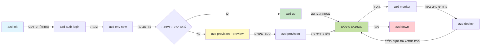
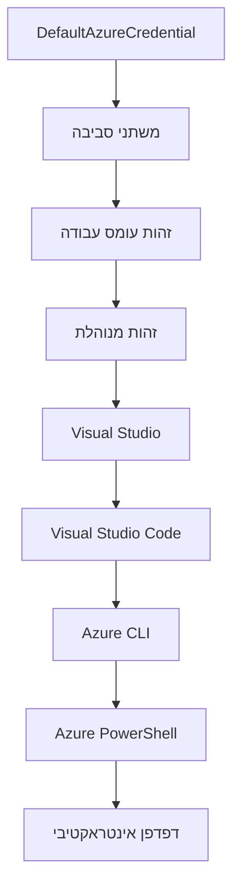

# יסודות AZD - הבנת Azure Developer CLI

# יסודות AZD - מושגים ראשיים ויסודות

**ניווט פרק:**
- **📚 עמוד הקורס**: [AZD למתחילים](../../README.md)
- **📖 פרק נוכחי**: פרק 1 - יסודות והתחלה מהירה
- **⬅️ קודם**: [סקירת הקורס](../../README.md#-chapter-1-foundation--quick-start)
- **➡️ הבא**: [התקנה והגדרה](installation.md)
- **🚀 פרק הבא**: [פרק 2: פיתוח מבוסס בינה מלאכותית](../chapter-02-ai-development/microsoft-foundry-integration.md)

## מבוא

שיעור זה מציג בפניכם את Azure Developer CLI (azd), כלי שורת פקודה עוצמתי שמזרז את המסע שלכם מהפיתוח המקומי לפריסת Azure. תלמדו את המושגים הבסיסיים, התכונות המרכזיות ותבינו כיצד azd מפשט פריסת יישומים ילידי ענן.

## יעדי הלמידה

בסוף שיעור זה תוכלו:
- להבין מהו Azure Developer CLI ומה מטרתו העיקרית
- ללמוד את המושגים המרכזיים של תבניות, סביבות ושירותים
- לחקור תכונות מרכזיות כולל פיתוח מונחה תבניות ותשתית כקוד
- להבין את מבנה הפרויקט וזרימת העבודה ב-azd
- להתכונן להתקנה והגדרה של azd לסביבת הפיתוח שלכם

## תוצאות למידה

לאחר השלמת השיעור, תוכלו:
- להסביר את תפקיד ה-azd בזרימות העבודה המודרניות של פיתוח ענן
- לזהות את רכיבי מבנה הפרויקט ב-azd
- לתאר כיצד תבניות, סביבות ושירותים עובדים יחד
- להבין את היתרונות של תשתית כקוד עם azd
- להכיר פקודות azd שונות ואת מטרותיהן

## מהו Azure Developer CLI (azd)?

Azure Developer CLI (azd) הוא כלי שורת פקודה שמטרתו לזרז את המסע שלכם מהפיתוח המקומי לפריסת Azure. הוא מפשט את תהליך הבנייה, הפריסה והניהול של יישומים ילידי ענן ב-Azure.

### מה ניתן לפרוס עם azd?

azd תומך במגוון רחב של עומסי עבודה – והרשימה רק גדלה. כיום תוכלו להשתמש ב-azd לפרוס:

| סוג עומס עבודה | דוגמאות | אותה זרימת עבודה? |
|---------------|----------|----------------|
| **יישומים מסורתיים** | יישומי ווב, REST APIs, אתרים סטטיים | ✅ `azd up` |
| **שירותים ומיקרו-שירותים** | אפליקציות מכולות, אפליקציות פונקציות, שרתים עם שירותים מרובים | ✅ `azd up` |
| **יישומי בינה מלאכותית** | אפליקציות צ׳אט עם דגמי Microsoft Foundry, פתרונות RAG עם חיפוש AI | ✅ `azd up` |
| **סוכנים אינטיליגנטיים** | סוכנים המארחים Foundry, ארגון סוכנים מרובים | ✅ `azd up` |

התובנה המרכזית היא ש**מחזור החיים של ה-azd נשאר זהה ללא קשר למה שאתם מפרסים**. אתם מאתחלים פרויקט, מספקים תשתית, מפרסים את הקוד, מנטרים את היישום ומנקים – בין אם זה אתר פשוט או סוכן AI מתוחכם.

המשכיות זו היא במתכונת מתוכננת. azd מטפל ביכולות AI כסוג נוסף של שירות שהיישום שלכם יכול להשתמש בו, לא כמשהו שונה במהותו. נקודת צ’אט שמגובה בדגמי Microsoft Foundry היא, מנקודת מבט של azd, רק שירות נוסף שיש להגדיר ולפרוס.

### 🎯 למה להשתמש ב-AZD? השוואה מעשית

בואו נשווה פריסת אפליקציית ווב פשוטה עם מסד נתונים:

#### ❌ ללא AZD: פריסת Azure ידנית (30+ דקות)

```bash
# שלב 1: יצירת קבוצת משאבים
az group create --name myapp-rg --location eastus

# שלב 2: יצירת תוכנית שירות אפליקציות
az appservice plan create --name myapp-plan \
  --resource-group myapp-rg \
  --sku B1 --is-linux

# שלב 3: יצירת אפליקציית ווב
az webapp create --name myapp-web-unique123 \
  --resource-group myapp-rg \
  --plan myapp-plan \
  --runtime "NODE:18-lts"

# שלב 4: יצירת חשבון Cosmos DB (10-15 דקות)
az cosmosdb create --name myapp-cosmos-unique123 \
  --resource-group myapp-rg \
  --kind MongoDB

# שלב 5: יצירת מסד נתונים
az cosmosdb mongodb database create \
  --account-name myapp-cosmos-unique123 \
  --resource-group myapp-rg \
  --name tododb

# שלב 6: יצירת אוסף
az cosmosdb mongodb collection create \
  --account-name myapp-cosmos-unique123 \
  --resource-group myapp-rg \
  --database-name tododb \
  --name todos

# שלב 7: קבלת מחרוזת חיבור
CONN_STR=$(az cosmosdb keys list \
  --name myapp-cosmos-unique123 \
  --resource-group myapp-rg \
  --type connection-strings \
  --query "connectionStrings[0].connectionString" -o tsv)

# שלב 8: קביעת הגדרות האפליקציה
az webapp config appsettings set \
  --name myapp-web-unique123 \
  --resource-group myapp-rg \
  --settings MONGODB_URI="$CONN_STR"

# שלב 9: הפעלת רישום
az webapp log config --name myapp-web-unique123 \
  --resource-group myapp-rg \
  --application-logging filesystem \
  --detailed-error-messages true

# שלב 10: הקמת Application Insights
az monitor app-insights component create \
  --app myapp-insights \
  --location eastus \
  --resource-group myapp-rg

# שלב 11: קישור App Insights לאפליקציית ווב
INSTRUMENTATION_KEY=$(az monitor app-insights component show \
  --app myapp-insights \
  --resource-group myapp-rg \
  --query "instrumentationKey" -o tsv)

az webapp config appsettings set \
  --name myapp-web-unique123 \
  --resource-group myapp-rg \
  --settings APPINSIGHTS_INSTRUMENTATIONKEY="$INSTRUMENTATION_KEY"

# שלב 12: בניית האפליקציה מקומית
npm install
npm run build

# שלב 13: יצירת חבילת פריסה
zip -r app.zip . -x "*.git*" "node_modules/*"

# שלב 14: פריסת האפליקציה
az webapp deployment source config-zip \
  --resource-group myapp-rg \
  --name myapp-web-unique123 \
  --src app.zip

# שלב 15: המתן ותתפלל שזה יעבוד 🙏
# (אין אימות אוטומטי, נדרש בדיקה ידנית)
```
  
**בעיות:**
- ❌ יותר מ-15 פקודות לזכור ולבצע לפי סדר
- ❌ 30-45 דקות עבודה ידנית
- ❌ קל לעשות טעויות (שגיאות הקלדה, פרמטרים שגויים)
- ❌ מחרוזות חיבור נחשפות בהיסטוריית הטרמינל
- ❌ אין גלגול אוטומטי במקרה של כישלון
- ❌ קשה לשכפל לחברי צוות
- ❌ שונה בכל פעם (לא לשחזור)

#### ✅ עם AZD: פריסה אוטומטית (5 פקודות, 10-15 דקות)

```bash
# שלב 1: אתחול מתבנית
azd init --template todo-nodejs-mongo

# שלב 2: אימות
azd auth login

# שלב 3: יצירת סביבה
azd env new dev

# שלב 4: תצוגה מקדימה של שינויים (אופציונלי אך מומלץ)
azd provision --preview

# שלב 5: פריסת הכל
azd up

# ✨ סיימנו! הכל פרוס, מוגדר ומנוטר
```
  
**יתרונות:**
- ✅ **5 פקודות** במקום מעל 15 שלבים ידניים
- ✅ **10-15 דקות** סה"כ זמן (בסך הכל ממתינים ל-Azure)
- ✅ **פחות טעויות ידניות** - זרימת עבודה עקבית ומונחת תבניות
- ✅ **טיפול מאובטח בסודות** - הרבה תבניות משתמשות באחסון סודות מנוהל של Azure
- ✅ **פריסות שניתנות לשחזור** - אותה זרימת עבודה כל פעם
- ✅ **שחזור מלא** - אותה תוצאה בכל פעם
- ✅ **מוכנות צוות** - כל אחד יכול לפרוס עם אותן פקודות
- ✅ **תשתית כקוד** - תבניות Bicep עם בקרת גרסאות
- ✅ **ניטור מובנה** - Application Insights מוגדר אוטומטית

### 📊 הפחתת זמן ושגיאות

| מדד | פריסה ידנית | פריסת AZD | שיפור |
|:-------|:------------------|:---------------|:------------|
| **פקודות** | 15+ | 5 | פחות ב-67% |
| **זמן** | 30-45 דקות | 10-15 דקות | מהיר ב-60% |
| **שיעור שגיאות** | ~40% | <5% | הפחתה ב-88% |
| **עקביות** | נמוכה (ידני) | 100% (אוטומטי) | מושלם |
| **קליטת צוות** | 2-4 שעות | 30 דקות | מהיר ב-75% |
| **זמן גלגול/החזרה** | מעל 30 דקות (ידני) | 2 דקות (אוטומטי) | מהיר ב-93% |

## מושגים מרכזיים

### תבניות
התבניות הן הבסיס של azd. הן מכילות:
- **קוד יישום** - קוד המקור והתלויות שלכם
- **הגדרות תשתית** - משאבי Azure המוגדרים ב-Bicep או Terraform
- **קבצי הגדרות** - הגדרות ומשתני סביבה
- **סקריפטים לפריסה** - זרימות עבודה לפריסה אוטומטית

### סביבות
סביבות מייצגות יעדי פריסה שונים:
- **פיתוח** - לבדיקות ופיתוח
- **הפקה מוקדמת** - סביבה לפני הפקה
- **הפקה** - סביבה חיה להפקה

כל סביבה מנהלת באופן עצמאי:
- קבוצת משאבים ב-Azure
- הגדרות תצורה
- מצב פריסה

### שירותים
השירותים הם אבני הבניין של האפליקציה שלכם:
- **חזית** - אפליקציות ווב, SPAs
- **אחור** - APIs, מיקרו-שירותים
- **מסד נתונים** - פתרונות אחסון נתונים
- **אחסון** - אחסון קבצים ובלובים

## תכונות מרכזיות

### 1. פיתוח מונחה תבניות  
```bash
# גלוש בתבניות הזמינות
azd template list

# אתחל מתבנית
azd init --template <template-name>
```
  
### 2. תשתית כקוד
- **Bicep** – שפת דומיין ספציפית של Azure  
- **Terraform** – כלי תשתית רב-ענני  
- **ARM Templates** – תבניות ממנהל המשאבים של Azure  

### 3. זרימות עבודה משולבות  
```bash
# תהליך פריסת ההתקנה המלא
azd up            # פריסה + הפעלה אוטומטית בפעם הראשונה

# 🧪 חדש: תצוגה מקדימה של שינויים בתשתית לפני פריסה (בטוח)
azd provision --preview    # הדמיית פריסת התשתית ללא ביצוע שינויים

azd provision     # יצירת משאבי Azure אם תעדכן את התשתית השתמש בזה
azd deploy        # פריסת קוד יישום או פריסה מחודשת של קוד יישום לאחר עדכון
azd down          # ניקוי המשאבים
```
  
#### 🛡️ תכנון תשתית בטוח עם תצוגה מקדימה  
הפקודה `azd provision --preview` משנה את חוקי המשחק בפריסות בטוחות:  
- **הרצה יבשה** – מראה מה ייווצר, ישונה או ימחק  
- **אפס סיכון** – אין שינויים אמיתיים בסביבת Azure שלכם  
- **שיתוף צוות** – שתפו תוצאות תצוגה לפני הפריסה  
- **הערכת עלויות** – הבינו את עלויות המשאבים לפני המחויבות  

```bash
# דוגמת תצוגה מקדימה של זרימת עבודה
azd provision --preview           # ראה מה ישתנה
# בדוק את הפלט, שוחח עם הצוות
azd provision                     # החל שינויים בביטחון
```
  
### 📊 ויזואליזציה: זרימת העבודה של פיתוח AZD  


**הסבר זרימת עבודה:**  
1. **Init** - התחילו עם תבנית או פרויקט חדש  
2. **Auth** - התחברו ל-Azure  
3. **Environment** - צרו סביבה מבודדת לפריסה  
4. **Preview** - 🆕 תמיד הציגו תצוגה מקדימה של שינויים בתשתית (פרקטיקה בטוחה)  
5. **Provision** - צרו/עודכנו משאבי Azure  
6. **Deploy** - דחפו את קוד היישום שלכם  
7. **Monitor** - עקבו אחרי ביצועי היישום  
8. **Iterate** - בצעו שינויים ופרסו קוד מחדש  
9. **Cleanup** - הסירו משאבים כשסיימתם  

### 4. ניהול סביבות  
```bash
# צור ונהל סביבות עבודה
azd env new <environment-name>
azd env select <environment-name>
azd env list
```
  
### 5. הרחבות ופקודות AI

azd משתמש במערכת הרחבות להוספת יכולות מעבר ל-CLI הבסיסי. זה שימושי במיוחד לעומסי עבודה של AI:

```bash
# רשום תוספים זמינים
azd extension list

# התקן את הרחבת הסוכנים של Foundry
azd extension install azure.ai.agents

# אתחל פרויקט סוכן בינה מלאכותית ממרשם
azd ai agent init -m agent-manifest.yaml

# הפעל את שרת MCP לפיתוח בעזרת בינה מלאכותית (אלפא)
azd mcp start
```
  
> הרחבות מכוסות בפירוט ב-[פרק 2: פיתוח מבוסס AI](../chapter-02-ai-development/agents.md) ובמדריך [AZD AI CLI Commands](../chapter-08-production/production-ai-practices.md#azd-ai-cli-commands-and-extensions).

## 📁 מבנה פרויקט

מבנה פרויקט טיפוסי ב-azd:  
```
my-app/
├── .azd/                    # azd configuration
│   └── config.json
├── .azure/                  # Azure deployment artifacts
├── .devcontainer/          # Development container config
├── .github/workflows/      # GitHub Actions
├── .vscode/               # VS Code settings
├── infra/                 # Infrastructure code
│   ├── main.bicep        # Main infrastructure template
│   ├── main.parameters.json
│   └── modules/          # Reusable modules
├── src/                  # Application source code
│   ├── api/             # Backend services
│   └── web/             # Frontend application
├── azure.yaml           # azd project configuration
└── README.md
```
  
## 🔧 קבצי הגדרה

### azure.yaml  
קובץ ההגדרה הראשי של הפרויקט:  
```yaml
name: my-awesome-app
metadata:
  template: my-template@1.0.0

services:
  web:
    project: ./src/web
    language: js
    host: appservice
  api:
    project: ./src/api
    language: js
    host: appservice

hooks:
  preprovision:
    shell: pwsh
    run: echo "Preparing to provision..."
```
  
### .azure/config.json  
הגדרות ספציפיות לסביבה:  
```json
{
  "version": 1,
  "defaultEnvironment": "dev",
  "environments": {
    "dev": {
      "subscriptionId": "your-subscription-id",
      "location": "eastus"
    }
  }
}
```
  
## 🎪 זרימות עבודה נפוצות עם תרגילים מעשיים

> **💡 טיפ למידה:** עקבו אחרי התרגילים לפי הסדר כדי לפתח את מיומנויות ה-AZD שלכם בהדרגה.

### 🎯 תרגיל 1: אתחול הפרויקט הראשון שלכם

**מטרה:** ליצור פרויקט AZD ולחקור את המבנה שלו

**שלבים:**  
```bash
# השתמש בתבנית מוכחת
azd init --template todo-nodejs-mongo

# חקור את הקבצים שנוצרו
ls -la  # הצג את כל הקבצים כולל קבצים נסתרים

# קבצים עיקריים שנוצרו:
# - azure.yaml (תצורה ראשית)
# - infra/ (קוד תשתית)
# - src/ (קוד אפליקציה)
```
  
**✅ הצלחה:** יש לכם את azure.yaml, תיקיות infra/ ו-src/  

---

### 🎯 תרגיל 2: פריסה ל-Azure

**מטרה:** להשלים פריסה מקצה לקצה

**שלבים:**  
```bash
# 1. אמת
az login && azd auth login

# 2. צור סביבה
azd env new dev
azd env set AZURE_LOCATION eastus

# 3. תצוגה מקדימה של שינויים (מומלץ)
azd provision --preview

# 4. פרסם הכל
azd up

# 5. אמת את ההפצה
azd show    # הצג את כתובת ה-URL של האפליקציה שלך
```
  
**זמן צפוי:** 10-15 דקות  
**✅ הצלחה:** כתובת ה-URL של היישום נפתחת בדפדפן  

---

### 🎯 תרגיל 3: סביבות מרובות

**מטרה:** לפרוס לסביבת dev ול-staging

**שלבים:**  
```bash
# כבר יש dev, צור staging
azd env new staging
azd env set AZURE_LOCATION westus2
azd up

# החלף ביניהם
azd env list
azd env select dev
```
  
**✅ הצלחה:** שתי קבוצות משאבים נפרדות בפורטל Azure  

---

### 🛡️ ניקוי רוחבי: `azd down --force --purge`

כשצריך איפוס טוטאלי:

```bash
azd down --force --purge
```
  
**מה הפקודה עושה:**  
- `--force`: ללא בקשות אישור  
- `--purge`: מוחקת את כל המצב המקומי ומשאבי Azure  

**משמש כאשר:**  
- הפריסה נכשלה באמצע  
- מחליפים פרויקטים  
- צריכים התחלה נקייה  

---

## 🎪 הפניה לזרימת עבודה מקורית

### תחילת פרויקט חדש  
```bash
# שיטה 1: השתמש בתבנית קיימת
azd init --template todo-nodejs-mongo

# שיטה 2: התחל מאפס
azd init

# שיטה 3: השתמש בתיקייה הנוכחית
azd init .
```
  
### מחזור פיתוח  
```bash
# הגדר את סביבת הפיתוח
azd auth login
azd env new dev
azd env select dev

# פרוס הכל
azd up

# בצע שינויים ופרוס מחדש
azd deploy

# נקה כשסיימת
azd down --force --purge # הפקודה ב-Azure Developer CLI היא **איפוס קשה** לסביבה שלך—שימושית במיוחד כשאתה מתקן פריסות שנכשלו, מנקה משאבים יתומים, או מתכונן לפריסה מחדש נקייה.
```
  
## הבנת `azd down --force --purge`

פקודת `azd down --force --purge` היא דרך עוצמתית לפרק לחלוטין את סביבת ה-azd ואת כל המשאבים הקשורים. הנה פירוט של כל דגל:  
```
--force
```
  
- מדלג על בקשות אישור.  
- שימושי לאוטומציה או סקריפטים בהם אין אפשרות להזנת ידנית.  
- מבטיח שהפריקה תתבצע ללא הפרעה, גם אם ה-CLI מזהה חוסר עקביות.  

```
--purge
```
  
מוחק **את כל המטא-דאטה הקשורה**, כולל:  
מצב סביבה  
תיקיית `.azure` מקומית  
מידע מטמון של פריסה  
מונע מ-azd "להיזכר" בפריסות קודמות, העלולות לגרום לבעיות כמו קבוצות משאבים לא תואמות או הפניות ללשכות ישנות.

### למה להשתמש בשניהם?  
כשנתקלים בבעיות עם `azd up` בגלל מצב תלוי או פריסות חלקיות, קומבינציית זו מבטיחה **ניקוי מלא**.

זה במיוחד מועיל אחרי מחיקות משאבים ידניות בפורטל Azure או כשמחליפים תבניות, סביבות או קונבנציות שמות קבוצות משאבים.

### ניהול סביבות מרובות  
```bash
# צור סביבה לניסוי
azd env new staging
azd env select staging
azd up

# חזור לפיתוח
azd env select dev

# השווה בין הסביבות
azd env list
```
  
## 🔐 אימות זהות ואישורים

הבנת האימות קריטית לפריסות azd מוצלחות. Azure משתמש בשיטות אימות רבות, ו-azd מנצל את אותו שרשרת אישורים המשמשת כלים אחרים של Azure.

### אימות Azure CLI (`az login`)

לפני השימוש ב-azd, יש צורך להיכנס ל-Azure. השיטה הנפוצה ביותר היא שימוש ב-Azure CLI:

```bash
# התחברות אינטראקטיבית (פותח דפדפן)
az login

# התחבר עם שוכר מסוים
az login --tenant <tenant-id>

# התחבר עם פרסונל שירות
az login --service-principal -u <app-id> -p <password> --tenant <tenant-id>

# בדוק את מצב ההתחברות הנוכחי
az account show

# הצג את המנויים הזמינים
az account list --output table

# הגדר מנוי ברירת מחדל
az account set --subscription <subscription-id>
```
  
### זרם האימות  
1. **התחברות אינטראקטיבית**: פותחת את הדפדפן המוגדר כברירת מחדל לצורך אימות  
2. **זרם קוד למכשיר**: עבור סביבות ללא גישה לדפדפן  
3. **Service Principal**: לאוטומציה ותסריטי CI/CD  
4. **זהות מנוהלת**: ליישומים המאפיינים Azure  

### שרשרת DefaultAzureCredential

`DefaultAzureCredential` הוא סוג של אישור שמספק חוויית אימות פשוטה באמצעות ניסיון אוטומטי של מספר מקורות אישור לפי סדר מוגדר:

#### סדר שרשרת האישור  

#### 1. משתני סביבה  
```bash
# הגדר משתני סביבה עבור החשבון של השירות
export AZURE_CLIENT_ID="<app-id>"
export AZURE_CLIENT_SECRET="<password>"
export AZURE_TENANT_ID="<tenant-id>"
```
  
#### 2. זהות עומס עבודה (Kubernetes/GitHub Actions)  
משתמש אוטומטית ב:  
- Azure Kubernetes Service (AKS) עם זהות עומס עבודה  
- GitHub Actions עם OIDC federation  
- תרחישי זהויות מאוגדות אחרים  

#### 3. זהות מנוהלת  
עבור משאבים כמו:  
- מכונות וירטואליות  
- App Service  
- Azure Functions  
- מופעי מכולות  

```bash
# בדוק אם רץ על משאב Azure עם זהות מנוהלת
az account show --query "user.type" --output tsv
# מחזיר: "servicePrincipal" אם משתמש בזהות מנוהלת
```
  
#### 4. אינטגרציה עם כלי מפתחים  
- **Visual Studio**: משתמש אוטומטית בחשבון מחובר  
- **VS Code**: משתמש באישורים מההרחבה Azure Account  
- **Azure CLI**: משתמש באישורים מ-`az login` (הנפוץ ביותר בפיתוח מקומי)  

### הגדרת אימות AZD

```bash
# שיטה 1: שימוש ב-Azure CLI (מומלץ לפיתוח)
az login
azd auth login  # משתמש בפרטי ההתחברות הקיימים של Azure CLI

# שיטה 2: אימות ישיר באמצעות azd
azd auth login --use-device-code  # לסביבות ללא ממשק משתמש

# שיטה 3: בדיקת מצב האימות
azd auth login --check-status

# שיטה 4: התנתקות ואימות מחדש
azd auth logout
azd auth login
```
  
### המלצות לאימות

#### לפיתוח מקומי  
```bash
# 1. התחבר עם Azure CLI
az login

# 2. אשר מנוי נכון
az account show
az account set --subscription "Your Subscription Name"

# 3. השתמש ב-azd עם אישורים קיימים
azd auth login
```
  
#### לצינורות CI/CD  
```yaml
# GitHub Actions example
- name: Azure Login
  uses: azure/login@v1
  with:
    creds: ${{ secrets.AZURE_CREDENTIALS }}

- name: Deploy with azd
  run: |
    azd auth login --client-id ${{ secrets.AZURE_CLIENT_ID }} \
                    --client-secret ${{ secrets.AZURE_CLIENT_SECRET }} \
                    --tenant-id ${{ secrets.AZURE_TENANT_ID }}
    azd up --no-prompt
```
  
#### לסביבות הפקה  
- השתמשו **בזהות מנוהלת** כאשר מריצים על משאבי Azure  
- השתמשו ב-**Service Principal** לתרחישי אוטומציה  
- הימנעו מאחסון אישורים בקוד או בקבצי הגדרה  
- השתמשו ב-**Azure Key Vault** להגדרות רגישות  

### בעיות נפוצות באימות ופתרונן

#### בעיה: "לא נמצאה הרשאה"  
```bash
# פתרון: הגדר מנוי ברירת מחדל
az account list --output table
az account set --subscription "<subscription-id>"
azd env set AZURE_SUBSCRIPTION_ID "<subscription-id>"
```
  
#### בעיה: "ההרשאות לא מספקות"  
```bash
# פתרון: בדוק והקצה תפקידים נדרשים
az role assignment list --assignee $(az account show --query user.name --output tsv)

# תפקידים נדרשים שכיחים:
# - משתתף (לניהול משאבים)
# - מנהל גישת משתמש (להקצאת תפקידים)
```
  
#### בעיה: "טוקן פג תוקף"  
```bash
# פתרון: אימות מחדש
az logout
az login
azd auth logout
azd auth login
```
  
### אימות בתרחישים שונים

#### פיתוח מקומי  
```bash
# חשבון פיתוח אישי
az login
azd auth login
```
  
#### פיתוח צוות  
```bash
# השתמש בשוכר ספציפי לארגון
az login --tenant contoso.onmicrosoft.com
azd auth login
```
  
#### תרחישי Multi-tenant  
```bash
# החלף בין דיירים
az login --tenant tenant1.onmicrosoft.com
# פרוס לדייר 1
azd up

az login --tenant tenant2.onmicrosoft.com  
# פרוס לדייר 2
azd up
```
  
### שיקולי אבטחה
1. **אחסון האישורים**: לעולם אל תאחסן אישורים בקוד המקור  
2. **הגבלת תחום**: השתמש בעיקרון ההרשאות המזעריות עבור שירותי פרינציפלים  
3. **סיבוב אסימונים**: סובב סודות של שירותי פרינציפלים באופן סדיר  
4. **נתיב ביקורת**: נטר פעילויות אימות ופריסת שירות  
5. **אבטחת רשת**: השתמש בנקודות קצה פרטיות כשאפשרי  

### פתרון בעיות אימות

```bash
# איתור בעיות אימות
azd auth login --check-status
az account show
az account get-access-token

# פקודות אבחון נפוצות
whoami                          # הקשר המשתמש הנוכחי
az ad signed-in-user show      # פרטי משתמש Azure AD
az group list                  # בדיקת גישה למשאב
```
  
## הבנת `azd down --force --purge`

### גילוי  
```bash
azd template list              # עיון בתבניות
azd template show <template>   # פרטי התבנית
azd init --help               # אפשרויות אתחול
```
  
### ניהול פרויקט  
```bash
azd show                     # סקירת הפרויקט
azd env list                # סביבות זמינות וברירת מחדל נבחרת
azd config show            # הגדרות תצורה
```
  
### ניטור  
```bash
azd monitor                  # פתח את ניתוח פורטל אזורה
azd monitor --logs           # הצג יומני יישומים
azd monitor --live           # הצג מדדים בזמן אמת
azd pipeline config          # הגדר CI/CD
```
  
## שיטות מומלצות

### 1. השתמש בשמות משמעותיים  
```bash
# טוב
azd env new production-east
azd init --template web-app-secure

# להימנע
azd env new env1
azd init --template template1
```
  
### 2. נצל תבניות  
- התחל מתבניות קיימות  
- התאם לצרכים שלך  
- צור תבניות לשימוש חוזר בארגון שלך  

### 3. בידוד סביבות  
- השתמש בסביבות נפרדות לפיתוח/בדיקה/ייצור  
- לעולם אל תפרוס ישירות לסביבה הייצור מהמחשב המקומי  
- השתמש בצינורות CI/CD לפריסות ייצור  

### 4. ניהול תצורה  
- השתמש במשתני סביבה לנתונים רגישים  
- שמור תצורה בבקרת גרסאות  
- תעד הגדרות ספציפיות לסביבה  

## התקדמות בלמידה

### מתחילים (שבוע 1-2)  
1. התקן azd ואמת חיבור  
2. פרוס תבנית פשוטה  
3. הבן את מבנה הפרויקט  
4. למד פקודות בסיסיות (up, down, deploy)  

### ביניים (שבוע 3-4)  
1. התאם תבניות  
2. נהל סביבות מרובות  
3. הבן קוד תשתיות  
4. הקם צינורות CI/CD  

### מתקדמים (שבוע 5+)  
1. צור תבניות מותאמות אישית  
2. דפוסי תשתיות מתקדמים  
3. פריסות מרובות אזורים  
4. תצורות ברמת ארגון  

## הצעדים הבאים

**📖 המשך למידה פרק 1:**  
- [התקנה והגדרה](installation.md) - התקן והגדר את azd  
- [הפרויקט הראשון שלך](first-project.md) - השלמת הדרכה מעשית  
- [מדריך תצורה](configuration.md) - אפשרויות תצורה מתקדמות  

**🎯 מוכן לפרק הבא?**  
- [פרק 2: פיתוח מבוסס AI](../chapter-02-ai-development/microsoft-foundry-integration.md) - התחל לבנות אפליקציות AI  

## משאבים נוספים

- [סקירת Azure Developer CLI](https://learn.microsoft.com/en-us/azure/developer/azure-developer-cli/)  
- [גלריית תבניות](https://azure.github.io/awesome-azd/)  
- [דוגמאות קהילה](https://github.com/Azure-Samples)  

---

## 🙋 שאלות נפוצות

### שאלות כלליות

**ש: מה ההבדל בין AZD ל-Azure CLI?**

ת: Azure CLI (`az`) מיועד לניהול משאבי Azure בודדים. AZD (`azd`) מיועד לניהול אפליקציות שלמות:  

```bash
# Azure CLI - ניהול משאבים ברמת נמוכה
az webapp create --name myapp --resource-group rg
az sql server create --name myserver --resource-group rg
# ...נדרשים עוד הרבה פקודות

# AZD - ניהול ברמת האפליקציה
azd up  # מפרסם את כל האפליקציה עם כל המשאבים
```
  
**חשוב כך:**  
- `az` = עבודה עם לבני לגו בודדות  
- `azd` = עבודה עם ערכות לגו שלמות  

---

**ש: האם אני צריך לדעת Bicep או Terraform כדי להשתמש ב-AZD?**

ת: לא! התחל עם תבניות:  
```bash
# השתמש בתבנית קיימת - אין צורך בידע ב-IaC
azd init --template todo-nodejs-mongo
azd up
```
  
תוכל ללמוד Bicep מאוחר יותר כדי להתאים את התשתית. התבניות מספקות דוגמאות עובדות ללמידה.  

---

**ש: כמה עולה להריץ תבניות AZD?**

ת: העלויות משתנות לפי התבנית. רוב תבניות הפיתוח עולות $50-150 לחודש:  

```bash
# תצוגה מקדימה של עלויות לפני הפריסה
azd provision --preview

# לנקות תמיד כשלא משתמשים
azd down --force --purge  # מסיר את כל המשאבים
```
  
**טיפ מקצועי:** השתמש בשכבות חינמיות כאשר זמינות:  
- App Service: שכבת F1 (חינמית)  
- דגמי Microsoft Foundry: Azure OpenAI חינם 50,000 אסימונים לחודש  
- Cosmos DB: שכבת חינמית של 1000 RU/s  

---

**ש: האם אפשר להשתמש ב-AZD עם משאבי Azure קיימים?**

ת: כן, אבל עדיף להתחיל מחדש. AZD עובד הכי טוב כשהוא מנהל את כל מחזור החיים. עבור משאבים קיימים:  

```bash
# אפשרות 1: ייבוא משאבים קיימים (מתקדם)
azd init
# לאחר מכן לשנות את /infra כדי להפנות למשאבים קיימים

# אפשרות 2: התחלה חדשה (מומלץ)
azd init --template matching-your-stack
azd up  # יוצר סביבה חדשה
```
  
---

**ש: איך אני משתף את הפרויקט עם חברי צוות?**

ת: בצע קומיט של פרויקט AZD ל-Git (אך לא את התיקייה .azure):  

```bash
# כבר נמצא ב-.gitignore כברירת מחדל
.azure/        # מכיל סודות ונתוני סביבה
*.env          # משתני סביבה

# חברי הצוות אז:
git clone <your-repo>
azd auth login
azd env new <their-name>-dev
azd up
```
  
כולם מקבלים תשתית זהה מאותו מקור תבניות.  

---

### שאלות פתרון בעיות

**ש: "azd up" נכשל באמצע. מה לעשות?**

ת: בדוק את השגיאה, תקן אותה ואז נסה שוב:  

```bash
# צפה ביומנים מפורטים
azd show

# תיקונים נפוצים:

# 1. אם הקצבה חרגה:
azd env set AZURE_LOCATION "westus2"  # נסה אזור אחר

# 2. אם יש קונפליקט בשם המשאב:
azd down --force --purge  # התחלה חדשה
azd up  # נסה שוב

# 3. אם האישור פקע:
az login
azd auth login
azd up
```
  
**בעיה נפוצה:** נבחרה מנוי Azure שגוי  
```bash
az account list --output table
az account set --subscription "<correct-subscription>"
```
  
---

**ש: איך ניתן לפרוס רק שינויים בקוד בלי לפרוס מחדש תשתית?**

ת: השתמש ב-`azd deploy` במקום `azd up`:  

```bash
azd up          # בפעם הראשונה: הקמה + פריסה (איטי)

# עשה שינויים בקוד...

azd deploy      # בפעמים העוקבות: פריסה בלבד (מהיר)
```
  
השוואת מהירות:  
- `azd up`: 10-15 דקות (מתקין תשתית)  
- `azd deploy`: 2-5 דקות (רק קוד)  

---

**ש: האם אפשר להתאים את תבניות התשתית?**

ת: כן! ערוך את קבצי Bicep בתיקיית `infra/`:  

```bash
# לאחר azd init
cd infra/
code main.bicep  # ערוך ב-VS Code

# תצוגה מקדימה של שינויים
azd provision --preview

# החל שינויים
azd provision
```
  
**טיפ:** התחל בתיקונים קטנים - שנה SKU ראשונים:  
```bicep
// infra/main.bicep
sku: {
  name: 'B1'  // Change to 'P1V2' for production
}
```
  
---

**ש: איך מוחקים את כל מה ש-AZD יצר?**

ת: פקודה אחת מסירה את כל המשאבים:  

```bash
azd down --force --purge

# זה מוחק:
# - את כל המשאבים ב-Azure
# - קבוצת המשאבים
# - מצב הסביבה המקומית
# - נתוני פריסה במטמון
```
  
**תמיד הרץ את זה כש:**  
- סיימת לבדוק תבנית  
- עובר לפרויקט אחר  
- רוצה להתחיל מחדש  

**חיסכון:** מחיקת משאבים לא בשימוש = עלות $0  

---

**ש: מה אם מחקתי בטעות משאבים בפורטל Azure?**

ת: מצב AZD עלול לא להיות מסונכרן. פתרון נקי:  

```bash
# 1. הסר מצב מקומי
azd down --force --purge

# 2. התחל מחדש
azd up

# אלטרנטיבה: אפשר ל-AZD לזהות ולתקן
azd provision  # ייצור משאבים חסרים
```
  
---

### שאלות מתקדמות

**ש: אפשר להשתמש ב-AZD בצינורות CI/CD?**

ת: כן! דוגמת GitHub Actions:  

```yaml
# .github/workflows/deploy.yml
name: Deploy with AZD

on:
  push:
    branches: [main]

jobs:
  deploy:
    runs-on: ubuntu-latest
    steps:
      - uses: actions/checkout@v2
      
      - name: Install azd
        run: curl -fsSL https://aka.ms/install-azd.sh | bash
      
      - name: Azure Login
        run: |
          azd auth login \
            --client-id ${{ secrets.AZURE_CLIENT_ID }} \
            --client-secret ${{ secrets.AZURE_CLIENT_SECRET }} \
            --tenant-id ${{ secrets.AZURE_TENANT_ID }}
      
      - name: Deploy
        run: azd up --no-prompt
```
  
---

**ש: איך מטפלים בסודות ונתונים רגישים?**

ת: AZD משתלב אוטומטית עם Azure Key Vault:  

```bash
# הסודות נשמרים ב-Key Vault, לא בקוד
azd env set DATABASE_PASSWORD "$(openssl rand -base64 32)"

# AZD עושה זאת אוטומטית:
# 1. יוצר Key Vault
# 2. שומר סוד
# 3. מעניק לאפליקציה גישה דרך Managed Identity
# 4. מזריק בזמן הריצה
```
  
**לעולם אל תתחייב:**  
- תיקיית `.azure/` (שומרת נתוני סביבה)  
- קבצי `.env` (סודות מקומיים)  
- מחרוזות חיבור  

---

**ש: האם אפשר לפרוס בכמה אזורים בו זמנית?**

ת: כן, צור סביבה נפרדת לכל אזור:  

```bash
# סביבה מזרח ארה"ב
azd env new prod-eastus
azd env set AZURE_LOCATION eastus
azd up

# סביבה מערב אירופה
azd env new prod-westeurope
azd env set AZURE_LOCATION westeurope
azd up

# כל סביבה היא עצמאית
azd env list
```
  
לפריסות אמיתיות מרובות אזורים, התאם את תבניות Bicep לפריסה בו-זמנית לאזורים שונים.  

---

**ש: איפה אפשר לקבל עזרה אם נתקעתי?**

1. **תיעוד AZD:** https://learn.microsoft.com/azure/developer/azure-developer-cli/  
2. **בעיות GitHub:** https://github.com/Azure/azure-dev/issues  
3. **Discord:** [Azure Discord](https://discord.gg/microsoft-azure) - ערוץ #azure-developer-cli  
4. **Stack Overflow:** תייג `azure-developer-cli`  
5. **הקורס הזה:** [מדריך פתרון בעיות](../chapter-07-troubleshooting/common-issues.md)  

**טיפ מקצועי:** לפני שאתה שואל, הרץ:  
```bash
azd show       # מציג את המצב הנוכחי
azd version    # מציג את הגירסה שלך
```
  
כלול מידע זה בשאלה לקבלת עזרה מהירה יותר.  

---

## 🎓 מה הלאה?

עכשיו אתה מבין את היסודות של AZD. בחר את הדרך שלך:  

### 🎯 למתחילים:  
1. **הבא:** [התקנה והגדרה](installation.md) - התקן AZD במחשב שלך  
2. **אחר כך:** [הפרויקט הראשון שלך](first-project.md) - פרוס את האפליקציה הראשונה שלך  
3. **תרגל:** סיים את כל 3 התרגילים בלקח זה  

### 🚀 למפתחי AI:  
1. **דלג ל:** [פרק 2: פיתוח מבוסס AI](../chapter-02-ai-development/microsoft-foundry-integration.md)  
2. **פרוס:** התחל עם `azd init --template get-started-with-ai-chat`  
3. **למד:** בנה תוך כדי פריסה  

### 🏗️ למפתחים מנוסים:  
1. **סקור:** [מדריך תצורה](configuration.md) - הגדרות מתקדמות  
2. **חקור:** [תשתיות כקוד](../chapter-04-infrastructure/provisioning.md) - למידה מעמיקה של Bicep  
3. **בנה:** צור תבניות מותאמות אישית לסטאק שלך  

---

**ניווט פרקים:**  
- **📚 דף הבית של הקורס**: [AZD למתחילים](../../README.md)  
- **📖 הפרק הנוכחי**: פרק 1 - יסודות והתחלה מהירה  
- **⬅️ הקודם**: [סקירת הקורס](../../README.md#-chapter-1-foundation--quick-start)  
- **➡️ הבא**: [התקנה והגדרה](installation.md)  
- **🚀 הפרק הבא**: [פרק 2: פיתוח מבוסס AI](../chapter-02-ai-development/microsoft-foundry-integration.md)

---

<!-- CO-OP TRANSLATOR DISCLAIMER START -->
**כתב ויתור**:  
מסמך זה תורגם באמצעות שירות תרגום ממוחשב [Co-op Translator](https://github.com/Azure/co-op-translator). בעוד שאנו שואפים לדיוק, יש להביא בחשבון שתרגומים אוטומטיים עלולים להכיל שגיאות או אי-דיוקים. המסמך המקורי בשפה המקורית שלו צריך להיחשב כמקור הסמכותי. למידע קריטי מומלץ להשתמש בתרגום מקצועי שבוצע על ידי אדם. איננו אחראים לכל הבנה או פירוש שגוי הנובעים משימוש בתרגום זה.
<!-- CO-OP TRANSLATOR DISCLAIMER END -->