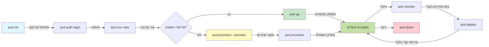
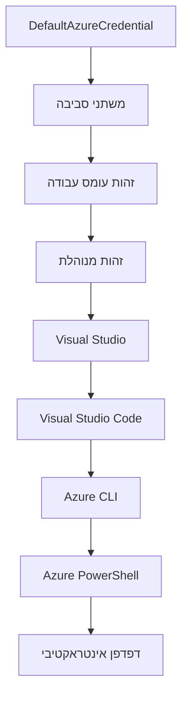

# יסודות AZD - הבנה של Azure Developer CLI

# יסודות AZD - מושגים ועקרונות מרכזיים

**ניווט בפרק:**
- **📚 עמוד הבית של הקורס**: [AZD למתחילים](../../README.md)
- **📖 הפרק הנוכחי**: פרק 1 - יסודות והתחלה מהירה
- **⬅️ הקודם**: [סקירת הקורס](../../README.md#-chapter-1-foundation--quick-start)
- **➡️ הבא**: [התקנה והגדרה](installation.md)
- **🚀 פרק הבא**: [פרק 2: פיתוח מבוסס AI](../chapter-02-ai-development/microsoft-foundry-integration.md)

## מבוא

לקח זה מציג בפניך את Azure Developer CLI (azd), כלי שורת הפקודה העוצמתי שמאיץ את המסע שלך מפיתוח מקומי לפריסה ב-Azure. תלמד את המושגים הבסיסיים, התכונות המרכזיות, ותבין כיצד azd מפשט את פריסת היישומים הנבנים לענן.

## יעדי למידה

בסיום לקח זה, תוכל:
- להבין מהו Azure Developer CLI ומה המטרה העיקרית שלו
- ללמוד את מושגי היסוד של תבניות, סביבות ושירותים
- לחקור תכונות מרכזיות כולל פיתוח מבוסס תבניות ותשתית כקוד
- להבין את מבנה הפרויקט וזרימת העבודה של azd
- להיות מוכן להתקין ולתצור את azd לסביבת הפיתוח שלך

## תוצאות למידה

לאחר השלמת לקח זה, תוכל:
- להסביר את תפקיד azd בזרימות עבודה מודרניות של פיתוח ענן
- לזהות את רכיבי מבנה הפרויקט של azd
- לתאר כיצד תבניות, סביבות ושירותים עובדים יחד
- להבין את היתרונות של תשתית כקוד עם azd
- לזהות פקודות azd שונות ואת מטרותיהן

## מה זה Azure Developer CLI (azd)?

Azure Developer CLI (azd) הוא כלי שורת פקודה שנועד להאיץ את המסע שלך מפיתוח מקומי לפריסה ב-Azure. הוא מפשט את תהליך הבנייה, הפריסה והניהול של יישומים נייטיב לענן על פלטפורמת Azure.

### מה ניתן לפרוס עם azd?

azd תומך במגוון רחב של עומסי עבודה – והרשימה ממשיכה לגדול. כיום, תוכל להשתמש ב-azd לפרוס:

| סוג עומס עבודה | דוגמאות | אותה זרימת עבודה? |
|---------------|----------|------------------|
| **יישומים מסורתיים** | אפליקציות ווב, REST APIs, אתרים סטטיים | ✅ `azd up` |
| **שירותים ומיקרו-שירותים** | אפליקציות מכולות, אפליקציות פונקציות, backend מרובה שירותים | ✅ `azd up` |
| **יישומים מבוססי AI** | אפליקציות צ'אט עם דגמי Microsoft Foundry, פתרונות RAG עם AI Search | ✅ `azd up` |
| **סוכנים אינטליגנטיים** | סוכנים אירוח Foundry, תזמור של סוכנים מרובים | ✅ `azd up` |

התובנה המרכזית היא ש**מחזור החיים של azd נשאר זהה ללא קשר למה שאתה מפרוס**. אתה מאתחל פרויקט, מספק תשתית, מפרוס את הקוד, עוקב אחר האפליקציה ומנקה – בין אם מדובר באתר פשוט או סוכן AI מורכב.

ההמשכיות הזו היא בתכנון. azd מתייחס ליכולות AI כסוג נוסף של שירות שהאפליקציה שלך יכולה להשתמש בו, לא כמשהו שונה באופן מהותי. נקודת קצה לצ'אט הנתמכת על ידי דגמי Microsoft Foundry היא, מבחינת azd, רק שירות נוסף שיש להגדיר ולפרוס.

### 🎯 למה להשתמש ב-AZD? השוואה אמיתית

בוא נשווה בין פריסת אפליקציית ווב פשוטה עם בסיס נתונים:

#### ❌ ללא AZD: פריסת Azure ידנית (יותר מ-30 דקות)

```bash
# שלב 1: צור קבוצת משאבים
az group create --name myapp-rg --location eastus

# שלב 2: צור תוכנית שירות אפליקציה
az appservice plan create --name myapp-plan \
  --resource-group myapp-rg \
  --sku B1 --is-linux

# שלב 3: צור אפליקציית רשת
az webapp create --name myapp-web-unique123 \
  --resource-group myapp-rg \
  --plan myapp-plan \
  --runtime "NODE:18-lts"

# שלב 4: צור חשבון Cosmos DB (10-15 דקות)
az cosmosdb create --name myapp-cosmos-unique123 \
  --resource-group myapp-rg \
  --kind MongoDB

# שלב 5: צור מסד נתונים
az cosmosdb mongodb database create \
  --account-name myapp-cosmos-unique123 \
  --resource-group myapp-rg \
  --name tododb

# שלב 6: צור אוסף
az cosmosdb mongodb collection create \
  --account-name myapp-cosmos-unique123 \
  --resource-group myapp-rg \
  --database-name tododb \
  --name todos

# שלב 7: קבל מחרוזת חיבור
CONN_STR=$(az cosmosdb keys list \
  --name myapp-cosmos-unique123 \
  --resource-group myapp-rg \
  --type connection-strings \
  --query "connectionStrings[0].connectionString" -o tsv)

# שלב 8: הגדר הגדרות אפליקציה
az webapp config appsettings set \
  --name myapp-web-unique123 \
  --resource-group myapp-rg \
  --settings MONGODB_URI="$CONN_STR"

# שלב 9: אפשר רישום
az webapp log config --name myapp-web-unique123 \
  --resource-group myapp-rg \
  --application-logging filesystem \
  --detailed-error-messages true

# שלב 10: הגדר Application Insights
az monitor app-insights component create \
  --app myapp-insights \
  --location eastus \
  --resource-group myapp-rg

# שלב 11: קישור Application Insights לאפליקציית רשת
INSTRUMENTATION_KEY=$(az monitor app-insights component show \
  --app myapp-insights \
  --resource-group myapp-rg \
  --query "instrumentationKey" -o tsv)

az webapp config appsettings set \
  --name myapp-web-unique123 \
  --resource-group myapp-rg \
  --settings APPINSIGHTS_INSTRUMENTATIONKEY="$INSTRUMENTATION_KEY"

# שלב 12: בניית האפליקציה באופן מקומי
npm install
npm run build

# שלב 13: צור חבילת פריסה
zip -r app.zip . -x "*.git*" "node_modules/*"

# שלב 14: פרוס את האפליקציה
az webapp deployment source config-zip \
  --resource-group myapp-rg \
  --name myapp-web-unique123 \
  --src app.zip

# שלב 15: המתן ותגיד שזה יעבוד 🙏
# (אין אימות אוטומטי, נדרש בדיקה ידנית)
```

**בעיות:**
- ❌ מעל 15 פקודות לזכור ולהריץ בסדר
- ❌ 30-45 דקות עבודה ידנית
- ❌ קל לטעות (שגיאות הקלדה, פרמטרים שגויים)
- ❌ מחרוזות קישור מוצגות בהיסטוריית הטרמינל
- ❌ אין גלגול אוטומטי במקרה של כישלון
- ❌ קשה לשכפל עבור חברי צוות
- ❌ כל פעם שונה (לא ניתן לשחזור)

#### ✅ עם AZD: פריסה אוטומטית (5 פקודות, 10-15 דקות)

```bash
# שלב 1: אתחול מתבנית
azd init --template todo-nodejs-mongo

# שלב 2: אימות
azd auth login

# שלב 3: יצירת סביבה
azd env new dev

# שלב 4: תצוגה מקדימה של שינויים (אופציונלי אך מומלץ)
azd provision --preview

# שלב 5: פרוס הכל
azd up

# ✨ סיום! הכל פרוס, מוגדר ומנוטר
```

**יתרונות:**
- ✅ **5 פקודות** לעומת מעל 15 שלבים ידניים
- ✅ **10-15 דקות** זמן סה"כ (רוב הזמן בהמתנה ל-Azure)
- ✅ **אפס שגיאות** – אוטומטי ונבדק
- ✅ **ניהול סודות מאובטח** דרך Key Vault
- ✅ **גלגול אוטומטי** במקרה של כישלונות
- ✅ **ניתן לשחזור מלא** – אותה תוצאה בכל פעם
- ✅ **מוכן לעבודה צוותית** – כל אחד יכול לפרוס עם אותן פקודות
- ✅ **תשתית כקוד** – תבניות Bicep מבוקרות בגרסאות
- ✅ **ניטור מובנה** – Application Insights מוגדר אוטומטית

### 📊 הפחתת זמן ושגיאות

| מדד | פריסה ידנית | פריסת AZD | שיפור |
|:----|:------------|:-----------|:-------|
| **פקודות** | מעל 15 | 5 | 67% פחות |
| **זמן** | 30-45 דקות | 10-15 דקות | מהיר ב-60% |
| **שיעור שגיאות** | כ-40% | פחות מ-5% | הפחתה של 88% |
| **עקביות** | נמוכה (ידנית) | 100% (אוטומטי) | מושלם |
| **הכנסת צוות** | 2-4 שעות | 30 דקות | מהיר ב-75% |
| **זמן גלגול** | מעל 30 דקות (ידני) | 2 דקות (אוטומטי) | מהיר ב-93% |

## מושגים מרכזיים

### תבניות
תבניות הן הבסיס ל-azd. הן מכילות:
- **קוד אפליקציה** – קוד המקור ותלויות שלך
- **הגדרות תשתית** – משאבים ב-Azure המוגדרים ב-Bicep או Terraform
- **קבצי תצורה** – הגדרות ומשתני סביבה
- **סקריפטים לפריסה** – זרימות עבודה לפריסה אוטומטית

### סביבות
סביבות מייצגות מטרות פריסה שונות:
- **פיתוח** – לבדיקה ופיתוח
- **ביניים** – סביבה לפני ייצור
- **ייצור** – סביבה חיה ומייצרת

כל סביבה שומרת על:
- קבוצת משאבים ב-Azure ייחודית
- הגדרות תצורה
- מצב פריסה

### שירותים
שירותים הם אבני הבניין של האפליקציה שלך:
- **חזית** – אפליקציות ווב, SPA
- **גב** – APIs, מיקרו-שירותים
- **בסיס נתונים** – פתרונות אחסון נתונים
- **אחסון** – אחסון קבצים ובלובים

## תכונות מרכזיות

### 1. פיתוח מבוסס תבניות
```bash
# דפדף בתבניות זמינות
azd template list

# אתחל מתבנית
azd init --template <template-name>
```

### 2. תשתית כקוד
- **Bicep** – שפת דומיין ספציפית ל-Azure
- **Terraform** – כלי תשתית רב-ענני
- **תבניות ARM** – תבניות של Azure Resource Manager

### 3. זרימות עבודה משולבות
```bash
# זרימת עבודה מלאה לפריסה
azd up            # הקצה + פרוס, זה אוטומטי בהגדרה ראשונית

# 🧪 חדש: תצוגת שינויים בתשתית לפני הפריסה (בטוח)
azd provision --preview    # הדמה של פריסת התשתית ללא ביצוע שינויים

azd provision     # צור משאבי Azure אם אתה מעדכן את התשתית השתמש בזה
azd deploy        # פרוס קוד אפליקציה או פרוס אותו מחדש לאחר עדכון
azd down          # ניקוי משאבים
```

#### 🛡️ תכנון תשתית בטוח עם תצוגה מוקדמת
פקודת `azd provision --preview` משנה את כללי המשחק לפריסות בטוחות:
- **הרצה יבשה** – מציגה מה ייווצר, ישונה או ימחק
- **אפס סיכון** – לא מתבצעות שינויים בפועל בסביבת Azure שלך
- **שיתוף פעולה בצוות** – שתף תוצאות תצוגה מוקדמת לפני פריסה
- **הערכת עלויות** – מבין את עלויות המשאבים לפני התחייבות

```bash
# תהליך תצוגה מקדימה לדוגמה
azd provision --preview           # ראה מה ישתנה
# סקור את הפלט, דון עם הצוות
azd provision                     # החל שינויים בביטחון
```

### 📊 חזותי: זרימת עבודה של פיתוח ב-AZD


**הסבר על זרימת העבודה:**
1. **Init** – התחל מתבנית או פרויקט חדש
2. **Auth** – התחבר ל-Azure
3. **Environment** – צור סביבת פריסה מבודדת
4. **Preview** – 🆕 תמיד הצג תצוגה מוקדמת של שינויים בתשתית (פרקטיקה בטוחה)
5. **Provision** – צור/עדכן משאבי Azure
6. **Deploy** – דחוף את קוד האפליקציה שלך
7. **Monitor** – עקוב אחר ביצועי האפליקציה
8. **Iterate** – בצע שינויים והעבר קוד מחדש
9. **Cleanup** – הסר משאבים כשסיימת

### 4. ניהול סביבות
```bash
# צור ונהל סביבות
azd env new <environment-name>
azd env select <environment-name>
azd env list
```

### 5. תוספים ופקודות AI

azd משתמש במערכת תוספים להוספת יכולות מעבר לליבת ה-CLI. זה שימושי במיוחד לעומסי עבודה מבוססי AI:

```bash
# רשום הרחבות זמינות
azd extension list

# התקן את הרחבת הסוכנים של Foundry
azd extension install azure.ai.agents

# אתחל פרויקט סוכן AI מתוך מניפסט
azd ai agent init -m agent-manifest.yaml

# הפעל את שרת MCP לפיתוח בעזרת AI (אלפא)
azd mcp start
```

> תוספים מכוסים בפירוט ב[פרק 2: פיתוח מבוסס AI](../chapter-02-ai-development/agents.md) ובמדריך [פקודות AZD AI CLI ותוספים](../chapter-08-production/production-ai-practices.md#azd-ai-cli-commands-and-extensions).

## 📁 מבנה הפרויקט

מבנה פרויקט אופייני של azd:
```
my-app/
├── .azd/                    # azd configuration
│   └── config.json
├── .azure/                  # Azure deployment artifacts
├── .devcontainer/          # Development container config
├── .github/workflows/      # GitHub Actions
├── .vscode/               # VS Code settings
├── infra/                 # Infrastructure code
│   ├── main.bicep        # Main infrastructure template
│   ├── main.parameters.json
│   └── modules/          # Reusable modules
├── src/                  # Application source code
│   ├── api/             # Backend services
│   └── web/             # Frontend application
├── azure.yaml           # azd project configuration
└── README.md
```

## 🔧 קבצי תצורה

### azure.yaml
קובץ התצורה הראשי של הפרויקט:
```yaml
name: my-awesome-app
metadata:
  template: my-template@1.0.0

services:
  web:
    project: ./src/web
    language: js
    host: appservice
  api:
    project: ./src/api
    language: js
    host: appservice

hooks:
  preprovision:
    shell: pwsh
    run: echo "Preparing to provision..."
```

### .azure/config.json
תצורה ספציפית לסביבה:
```json
{
  "version": 1,
  "defaultEnvironment": "dev",
  "environments": {
    "dev": {
      "subscriptionId": "your-subscription-id",
      "location": "eastus"
    }
  }
}
```

## 🎪 זרימות עבודה נפוצות עם תרגילים מעשיים

> **💡 טיפ למידה:** עקוב אחרי התרגילים בסדר כדי לבנות בהדרגה את כישורי ה-AZD שלך.

### 🎯 תרגיל 1: אתחול הפרויקט הראשון שלך

**מטרה:** צור פרויקט AZD וחקור את המבנה שלו

**שלבים:**
```bash
# השתמש בתבנית מוכחת
azd init --template todo-nodejs-mongo

# חקור את הקבצים שנוצרו
ls -la  # הצג את כל הקבצים כולל נסתר

# קבצים מרכזיים שנוצרו:
# - azure.yaml (הגדרה ראשית)
# - infra/ (קוד תשתית)
# - src/ (קוד אפליקציה)
```

**✅ הצלחה:** יש לך את azure.yaml, תיקיות infra/ ו-src/

---

### 🎯 תרגיל 2: פריסת Azure

**מטרה:** השלם פריסה מקצה לקצה

**שלבים:**
```bash
# 1. לאמת
az login && azd auth login

# 2. ליצור סביבה
azd env new dev
azd env set AZURE_LOCATION eastus

# 3. תצוגה מקדימה של שינויים (מומלץ)
azd provision --preview

# 4. לפרוס הכל
azd up

# 5. לאמת את הפריסה
azd show    # צפיה בכתובת האפליקציה שלך
```

**זמן משוער:** 10-15 דקות  
**✅ הצלחה:** כתובת ה-URL של האפליקציה נפתחת בדפדפן

---

### 🎯 תרגיל 3: סביבות מרובות

**מטרה:** פרוס לסביבת פיתוח וסביבת ביניים

**שלבים:**
```bash
# כבר יש dev, צור staging
azd env new staging
azd env set AZURE_LOCATION westus2
azd up

# החלף ביניהם
azd env list
azd env select dev
```

**✅ הצלחה:** שתי קבוצות משאבים נפרדות ב-Azure Portal

---

### 🛡️ ניקוי יסודי: `azd down --force --purge`

כשאתה צריך לאפס לחלוטין:

```bash
azd down --force --purge
```

**מה זה עושה:**
- `--force`: ללא בקשות אישור
- `--purge`: מוחק את כל המצב המקומי ומשאבי Azure

**השתמש כאשר:**
- הפריסה נכשלה באמצע התהליך
- מחליפים פרויקטים
- צריכים התחלה חדשה ונקייה

---

## 🎪 הפניה לזרימת עבודה מקורית

### התחלת פרויקט חדש
```bash
# שיטה 1: השתמש בתבנית קיימת
azd init --template todo-nodejs-mongo

# שיטה 2: התחל מהתחלה
azd init

# שיטה 3: השתמש בתיקייה הנוכחית
azd init .
```

### מחזור פיתוח
```bash
# הגדר את סביבת הפיתוח
azd auth login
azd env new dev
azd env select dev

# פרוס הכל
azd up

# ערוך שינויים ופרוס מחדש
azd deploy

# נקה כשסיימת
azd down --force --purge # הפקודה ב-Azure Developer CLI היא **איפוס קשה** לסביבה שלך — שימושית במיוחד כאשר אתה מתמודד עם פריסות שנכשלו, מנקה משאבים יתומים, או מתכונן לפריסה חדשה.
```

## הבנת `azd down --force --purge`
פקודת `azd down --force --purge` היא דרך עוצמתית לפרק לחלוטין את סביבת ה-azd שלך ואת כל המשאבים המשויכים. להלן פירוט המשמעות של כל דגל:
```
--force
```
- מדלג על בקשות לאישור.
- שימושי לאוטומציה או סקריפטים שבהם אין אפשרות להזין ידנית.
- מוודא שהפריקה מתבצעת ללא הפרעה, גם אם ה-CLI מזהה אי-עקביות.

```
--purge
```
מוחק **את כל המטא-דטה המשוייכת**, כולל:
מצב סביבה  
תיקיית `.azure` מקומית  
מידע מטמון של פריסות  
מונע מ-azd "לזכור" פריסות קודמות, מה שיכול לגרום לבעיות כמו קבוצות משאבים לא תואמות או הפניות ישנות ללוגים.

### למה להשתמש בשניהם?
כשנתקעת עם `azd up` בגלל מצב שנותר או פריסות חלקיות, שילוב זה מבטיח **קורא נקי**.

זה מועיל במיוחד לאחר מחיקות ידניות של משאבים ב-Azure Portal או כשמשנים תבניות, סביבות או קונבנציות שמות של קבוצות משאבים.

### ניהול סביבות מרובות
```bash
# צור סביבת הבמה
azd env new staging
azd env select staging
azd up

# חזור לפיתוח
azd env select dev

# השווה בין הסביבות
azd env list
```

## 🔐 אימות ואישורים

הבנת תהליך האימות חיונית לפריסות azd מוצלחות. Azure משתמש במגוון שיטות אימות, ו-azd מנצל את אותה שרשרת אישורים המשומשת בכלים אחרים של Azure.

### אימות באמצעות Azure CLI (`az login`)

לפני השימוש ב-azd, עליך להתחבר ל-Azure. השיטה הנפוצה ביותר היא באמצעות Azure CLI:

```bash
# התחברות אינטראקטיבית (פותחת דפדפן)
az login

# התחבר עם שוכר ספציפי
az login --tenant <tenant-id>

# התחבר עם פרינסיפל שירות
az login --service-principal -u <app-id> -p <password> --tenant <tenant-id>

# בדוק את מצב ההתחברות הנוכחי
az account show

# הצג רשימת מנויים זמינים
az account list --output table

# הגדר מנוי ברירת מחדל
az account set --subscription <subscription-id>
```

### זרימת אימות
1. **כניסה אינטראקטיבית**: פותח את הדפדפן המוגדר לברירת מחדל להתחברות
2. **זרימת קוד התקן**: לסביבות ללא גישה לדפדפן
3. **Service Principal**: עבור אוטומציה ותסריטי CI/CD
4. **זהות מנוהלת**: ליישומים שמתוירים ב-Azure

### שרשרת DefaultAzureCredential

`DefaultAzureCredential` הוא סוג של אישור המספק חווית אימות מפושטת על ידי ניסיון אוטומטי של מספר מקורות אישור בסדר מסוים:

#### סדר שרשרת האישור

#### 1. משתני סביבה
```bash
# הגדר משתני סביבה עבור נציג שירות
export AZURE_CLIENT_ID="<app-id>"
export AZURE_CLIENT_SECRET="<password>"
export AZURE_TENANT_ID="<tenant-id>"
```

#### 2. זהות עומס עבודה (Kubernetes/GitHub Actions)
משתמש אוטומטית ב:
- Azure Kubernetes Service (AKS) עם Workload Identity
- GitHub Actions עם פדרציית OIDC
- תרחישי זהות מאוחדת אחרים

#### 3. זהות מנוהלת
למשאבי Azure כגון:
- מכונות וירטואליות
- App Service
- Azure Functions
- מכולות מונחות

```bash
# לבדוק אם רץ על משאב Azure עם זהות מנוהלת
az account show --query "user.type" --output tsv
# מחזיר: "servicePrincipal" אם משתמשים בזהות מנוהלת
```

#### 4. אינטגרציה עם כלי מפתחים
- **Visual Studio**: משתמש באופן אוטומטי בחשבון מחובר
- **VS Code**: משתמש באישורים של תוסף Azure Account
- **Azure CLI**: משתמש באישורים מ-`az login` (הנפוץ ביותר לפיתוח מקומי)

### הגדרת אימות ב-AZD

```bash
# שיטה 1: השתמש ב-Azure CLI (מומלץ לפיתוח)
az login
azd auth login  # משתמש באישורי Azure CLI קיימים

# שיטה 2: התחברות ישירה עם azd
azd auth login --use-device-code  # לסביבות ללא ממשק גרפי

# שיטה 3: בדוק את מצב ההתחברות
azd auth login --check-status

# שיטה 4: התנתק ותחדש את ההתחברות
azd auth logout
azd auth login
```

### שיטות מומלצות לאימות

#### לפיתוח מקומי
```bash
# 1. התחבר עם Azure CLI
az login

# 2. ודא שהמנוי הנכון
az account show
az account set --subscription "Your Subscription Name"

# 3. השתמש ב-azd עם האישורים הקיימים
azd auth login
```

#### לצינורות CI/CD
```yaml
# GitHub Actions example
- name: Azure Login
  uses: azure/login@v1
  with:
    creds: ${{ secrets.AZURE_CREDENTIALS }}

- name: Deploy with azd
  run: |
    azd auth login --client-id ${{ secrets.AZURE_CLIENT_ID }} \
                    --client-secret ${{ secrets.AZURE_CLIENT_SECRET }} \
                    --tenant-id ${{ secrets.AZURE_TENANT_ID }}
    azd up --no-prompt
```

#### לסביבות ייצור
- השתמש **בזהות מנוהלת** בעת ריצה על משאבי Azure
- השתמש **ב-Service Principal** לתרחישי אוטומציה
- הימנע מלאחסן אישורים בקוד או בקבצי תצורה
- השתמש ב-**Azure Key Vault** לתצורות רגישות

### בעיות אימות נפוצות ופתרונות

#### בעיה: "No subscription found"
```bash
# פתרון: הגדר את המנוי כברירת מחדל
az account list --output table
az account set --subscription "<subscription-id>"
azd env set AZURE_SUBSCRIPTION_ID "<subscription-id>"
```

#### בעיה: "Insufficient permissions"
```bash
# פתרון: בדוק והקצה תפקידים נדרשים
az role assignment list --assignee $(az account show --query user.name --output tsv)

# תפקידים נדרשים נפוצים:
# - תורם (לניהול משאבים)
# - מנהל גישת משתמשים (להקצאת תפקידים)
```

#### בעיה: "Token expired"
```bash
# פתרון: אימות מחדש
az logout
az login
azd auth logout
azd auth login
```

### אימות בתרחישים שונים

#### פיתוח מקומי
```bash
# חשבון לפיתוח אישי
az login
azd auth login
```

#### פיתוח צוותי
```bash
# השתמש בשוכר ספציפי לארגון
az login --tenant contoso.onmicrosoft.com
azd auth login
```

#### תרחישי מולטי-טננט
```bash
# החלף בין דיירים
az login --tenant tenant1.onmicrosoft.com
# פרוס לדייר 1
azd up

az login --tenant tenant2.onmicrosoft.com  
# פרוס לדייר 2
azd up
```

### שיקולי אבטחה
1. **אחסון הרשאות**: לעולם אל תשמור הרשאות בקוד המקור  
2. **הגבלת תחום הרשאות**: השתמש בעיקרון הזכויות המינימליות ל-service principals  
3. **סיבוב אסימונים**: סובב סודות של service principal באופן סדיר  
4. **רישום ביקורת**: נטר פעילויות אימות ופריסה  
5. **אבטחת רשת**: השתמש בקצוות פרטיים כשאפשרי  

### פתרון בעיות באימות  

```bash
# איתור ותיקון בעיות אימות
azd auth login --check-status
az account show
az account get-access-token

# פקודות אבחון נפוצות
whoami                          # הקשר המשתמש הנוכחי
az ad signed-in-user show      # פרטי משתמש Azure AD
az group list                  # בדיקת גישה למשאב
```
  
## הבנת `azd down --force --purge`  

### גילוי  
```bash
azd template list              # עיון בתבניות
azd template show <template>   # פרטי תבנית
azd init --help               # אפשרויות אתחול
```
  
### ניהול פרויקט  
```bash
azd show                     # סקירת פרויקט
azd env show                 # סביבה נוכחית
azd config list             # הגדרות תצורה
```
  
### ניטור  
```bash
azd monitor                  # פתח את מרכז הניטור של Azure
azd monitor --logs           # הצג יומני יישום
azd monitor --live           # הצג מדדים חיים
azd pipeline config          # קבע הגדרות CI/CD
```
  
## שיטות מומלצות  

### 1. השתמש בשמות בעלי משמעות  
```bash
# טוב
azd env new production-east
azd init --template web-app-secure

# להימנע
azd env new env1
azd init --template template1
```
  
### 2. השתמש בתבניות  
- התחל מתבניות קיימות  
- התאם לצרכים שלך  
- צור תבניות לשימוש חוזר בארגון שלך  

### 3. בידוד סביבות  
- השתמש בסביבות נפרדות לפיתוח/בדיקה/פרודקשן  
- לעולם אל תפרוס ישירות לפרודקשן מהמחשב המקומי  
- השתמש בצינורות CI/CD לפריסות בפרודקשן  

### 4. ניהול קונפיגורציה  
- השתמש במשתני סביבה לנתונים רגישים  
- שמור קונפיגורציות בבקרת גרסאות  
- תעד הגדרות ספציפיות לסביבה  

## התקדמות בלמידה  

### מתחילים (שבוע 1-2)  
1. התקן את azd ובצע אימות  
2. פרוס תבנית פשוטה  
3. הבן את מבנה הפרויקט  
4. למד פקודות בסיסיות (up, down, deploy)  

### בינוניים (שבוע 3-4)  
1. התאם תבניות  
2. נהל סביבות מרובות  
3. הבן קוד תשתית  
4. הגדר צינורות CI/CD  

### מתקדמים (שבוע 5+)  
1. צור תבניות מותאמות אישית  
2. דפוסי תשתית מתקדמים  
3. פריסות בכמה אזורים  
4. תצורות ברמת ארגונית  

## צעדים הבאים  

**📖 המשך בפרק 1 בלמידה:**  
- [התקנה והגדרה](installation.md) - התקן ונהל את azd  
- [הפרויקט הראשון שלך](first-project.md) - השלם הדרכה מעשית  
- [מדריך קונפיגורציה](configuration.md) - אפשרויות קונפיגורציה מתקדמות  

**🎯 מוכן לפרק הבא?**  
- [פרק 2: פיתוח מבוסס AI](../chapter-02-ai-development/microsoft-foundry-integration.md) - התחל בבניית אפליקציות AI  

## משאבים נוספים  

- [סקירה על Azure Developer CLI](https://learn.microsoft.com/en-us/azure/developer/azure-developer-cli/)  
- [גלריית תבניות](https://azure.github.io/awesome-azd/)  
- [דוגמאות מהקהילה](https://github.com/Azure-Samples)  

---

## 🙋 שאלות נפוצות  

### שאלות כלליות  

**ש: מה ההבדל בין AZD ל-Azure CLI?**  

ת: Azure CLI (`az`) משמש לניהול משאבים בודדים ב-Azure. AZD (`azd`) נועד לניהול יישומים שלמים:  

```bash
# Azure CLI - ניהול משאבים ברמה נמוכה
az webapp create --name myapp --resource-group rg
az sql server create --name myserver --resource-group rg
# ...דרושים עוד פקודות רבות

# AZD - ניהול ברמת היישום
azd up  # מפעיל את כל האפליקציה עם כל המשאבים
```
  
**תחשוב על זה כך:**  
- `az` = עבודה עם קוביות לגו בודדות  
- `azd` = עבודה עם ערכות לגו שלמות  

---

**ש: האם צריך לדעת Bicep או Terraform כדי להשתמש ב-AZD?**  

ת: לא! התחל עם תבניות:  
```bash
# השתמש בתבנית קיימת - לא נדרשת ידע ב-IaC
azd init --template todo-nodejs-mongo
azd up
```
  
ניתן ללמוד Bicep מאוחר יותר להתאמת התשתית. התבניות נותנות דוגמאות עבודה ללמידה.  

---

**ש: כמה עולה להריץ תבניות של AZD?**  

ת: העלויות משתנות לפי תבנית. רוב תבניות הפיתוח יעלו 50-150 דולר לחודש:  

```bash
# תצוגה מקדימה של העלויות לפני הפריסה
azd provision --preview

# לנקות תמיד כשלא בשימוש
azd down --force --purge  # מסיר את כל המשאבים
```
  
**טיפ מקצועי:** השתמש בשכבות חינמיות כשיש:  
- שירות אפליקציות: שכבת F1 (חינמית)  
- Microsoft Foundry Models: Azure OpenAI 50,000 אסימונים בחודש בחינם  
- Cosmos DB: שכבת RU/s 1000 חינמית  

---

**ש: האם אפשר להשתמש ב-AZD עם משאבי Azure קיימים?**  

ת: כן, אבל קל יותר להתחיל מאפס. AZD עובד הכי טוב כשהוא מנהל את כל מחזור החיים. לגבי משאבים קיימים:  

```bash
# אפשרות 1: ייבא משאבים קיימים (מתקדם)
azd init
# ואז שנה את infra/ להתייחסות למשאבים קיימים

# אפשרות 2: התחלה חדשה (מומלץ)
azd init --template matching-your-stack
azd up  # יוצר סביבה חדשה
```
  
---

**ש: איך משתפים את הפרויקט עם חברי צוות?**  

ת: התחייב את פרויקט AZD ל-Git (אבל לא את תיקיית .azure):  

```bash
# כבר כברירת מחדל ב-.gitignore
.azure/        # מכיל סודות ונתוני סביבה
*.env          # משתני סביבה

# חברי הצוות אז:
git clone <your-repo>
azd auth login
azd env new <their-name>-dev
azd up
```
  
כולם יקבלו תשתית זהה מהתבניות האותן.  

---

### שאלות לפתרון בעיות  

**ש: "azd up" נכשל באמצע. מה לעשות?**  

ת: בדוק את השגיאה, תקן ונסה שוב:  

```bash
# הצג יומנים מפורטים
azd show

# תיקונים נפוצים:

# 1. אם חריגה מהקצבה:
azd env set AZURE_LOCATION "westus2"  # נסה אזור שונה

# 2. אם יש התנגשות בשם המשאב:
azd down --force --purge  # תנקה הכל
azd up  # נסה שוב

# 3. אם האימות פג תוקף:
az login
azd auth login
azd up
```
  
**בעיה נפוצה:** נבחר מינוי Azure שגוי  
```bash
az account list --output table
az account set --subscription "<correct-subscription>"
```
  
---

**ש: איך לפרוס רק שינויים בקוד בלי להשיב תשתית?**  

ת: השתמש בפקודת `azd deploy` במקום `azd up`:  

```bash
azd up          # פעם ראשונה: פריסת משאבים + פריסה (איטי)

# בצע שינויים בקוד...

azd deploy      # פעמים הבאות: רק פריסה (מהיר)
```
  
השוואת מהירות:  
- `azd up`: 10-15 דקות (מספק תשתית)  
- `azd deploy`: 2-5 דקות (רק קוד)  

---

**ש: האם אפשר להתאים אישית את תבניות התשתית?**  

ת: כן! ערוך את קבצי Bicep בתיקיית `infra/`:  

```bash
# לאחר azd init
cd infra/
code main.bicep  # עריכה ב-VS Code

# תצוגה מקדימה של שינויים
azd provision --preview

# החל שינויים
azd provision
```
  
**טיפ:** התחל קטן - שנה SKU ראשונים:  
```bicep
// infra/main.bicep
sku: {
  name: 'B1'  // Change to 'P1V2' for production
}
```
  
---

**ש: איך מוחקים הכל ש-AZD יצר?**  

ת: פקודה אחת מסירה את כל המשאבים:  

```bash
azd down --force --purge

# זה מוחק:
# - את כל משאבי אזיור
# - קבוצת המשאבים
# - מצב סביבה מקומית
# - נתוני פריסה מטמון
```
  
**הרץ זאת תמיד כש:**  
- סיימת לבדוק תבנית  
- עוברים לפרויקט אחר  
- רוצה להתחיל מחדש  

**חיסכון בעלויות:** מחיקת משאבים לא בשימוש = חיובים $0  

---

**ש: מה אם בטעות מחקתי משאבים ב-Azure Portal?**  

ת: מצב AZD יכול לא להתעדכן. גישה של התחלה נקייה:  

```bash
# 1. הסר מדינה מקומית
azd down --force --purge

# 2. התחל מחדש
azd up

# אלטרנטיבה: תן ל-AZD לזהות ולתקן
azd provision  # יווצרו משאבים חסרים
```
  
---

### שאלות מתקדמות  

**ש: האם אפשר להשתמש ב-AZD בצינורות CI/CD?**  

ת: כן! דוגמה ל-GitHub Actions:  

```yaml
# .github/workflows/deploy.yml
name: Deploy with AZD

on:
  push:
    branches: [main]

jobs:
  deploy:
    runs-on: ubuntu-latest
    steps:
      - uses: actions/checkout@v2
      
      - name: Install azd
        run: curl -fsSL https://aka.ms/install-azd.sh | bash
      
      - name: Azure Login
        run: |
          azd auth login \
            --client-id ${{ secrets.AZURE_CLIENT_ID }} \
            --client-secret ${{ secrets.AZURE_CLIENT_SECRET }} \
            --tenant-id ${{ secrets.AZURE_TENANT_ID }}
      
      - name: Deploy
        run: azd up --no-prompt
```
  
---

**ש: איך מטפלים בסודות ונתונים רגישים?**  

ת: AZD משתלב אוטומטית עם Azure Key Vault:  

```bash
# סודות נשמרים ב-Key Vault, לא בקוד
azd env set DATABASE_PASSWORD "$(openssl rand -base64 32)"

# AZD מבצע אוטומטית:
# 1. יוצר Key Vault
# 2. שומר סוד
# 3. מעניק לאפליקציה גישה דרך זהות מנוהלת
# 4. מזריק בזמן ריצה
```
  
**לעולם אל תתחייב:**  
- תיקיית `.azure/` (מכילה נתוני סביבה)  
- קבצי `.env` (סודות מקומיים)  
- מחרוזות חיבור  

---

**ש: אפשר לפרוס לאזורים מרובים?**  

ת: כן, צור סביבה נפרדת לכל אזור:  

```bash
# סביבת US מזרחית
azd env new prod-eastus
azd env set AZURE_LOCATION eastus
azd up

# סביבת אירופה מערבית
azd env new prod-westeurope
azd env set AZURE_LOCATION westeurope
azd up

# כל סביבה היא עצמאית
azd env list
```
  
לאפליקציות אמתיות רב אזוריות, התאם את תבניות Bicep לפריסה בו זמנית באזורים מרובים.  

---

**ש: איפה אפשר לקבל עזרה אם נתקעתי?**  

1. **תיעוד AZD:** https://learn.microsoft.com/azure/developer/azure-developer-cli/  
2. **GitHub Issues:** https://github.com/Azure/azure-dev/issues  
3. **Discord:** [Azure Discord](https://discord.gg/microsoft-azure) - ערוץ #azure-developer-cli  
4. **Stack Overflow:** תג `azure-developer-cli`  
5. **הקורס הזה:** [מדריך פתרון בעיות](../chapter-07-troubleshooting/common-issues.md)  

**טיפ מקצועי:** לפני שאתה שואל, הרץ:  
```bash
azd show       # מציג את המצב הנוכחי
azd version    # מציג את הגרסה שלך
```
  
כלול את המידע הזה בשאלה שלך לקבלת עזרה מהירה יותר.  

---

## 🎓 מה הלאה?  

כעת אתה מבין את יסודות AZD. בחר את דרכך:  

### 🎯 למתחילים:  
1. **הבא:** [התקנה והגדרה](installation.md) - התקן AZD במחשב שלך  
2. **אחר כך:** [הפרויקט הראשון שלך](first-project.md) - פרוס את האפליקציה הראשונה שלך  
3. **תרגל:** סיים את כל 3 התרגילים בשיעור זה  

### 🚀 למפתחי AI:  
1. **דלג ל:** [פרק 2: פיתוח מבוסס AI](../chapter-02-ai-development/microsoft-foundry-integration.md)  
2. **פרוס:** התחל עם `azd init --template get-started-with-ai-chat`  
3. **למד:** בנה תוך כדי פריסה  

### 🏗️ למפתחים מנוסים:  
1. **סקור:** [מדריך קונפיגורציה](configuration.md) - הגדרות מתקדמות  
2. **חקור:** [תשתית כקוד](../chapter-04-infrastructure/provisioning.md) - חקירת Bicep מעמיקה  
3. **בנה:** צור תבניות מותאמות אישית לערימה שלך  

---

**ניווט בפרקים:**  
- **📚 דף הבית של הקורס**: [AZD למתחילים](../../README.md)  
- **📖 פרק נוכחי**: פרק 1 - יסודות והתחלה מהירה  
- **⬅️ קודם**: [סקירת הקורס](../../README.md#-chapter-1-foundation--quick-start)  
- **➡️ הבא**: [התקנה והגדרה](installation.md)  
- **🚀 פרק הבא**: [פרק 2: פיתוח מבוסס AI](../chapter-02-ai-development/microsoft-foundry-integration.md)

---

<!-- CO-OP TRANSLATOR DISCLAIMER START -->
**כתב ויתור**:  
מסמך זה תורגם באמצעות שירות תרגום בינה מלאכותית [Co-op Translator](https://github.com/Azure/co-op-translator). למרות שאנו שואפים לדיוק, יש להבין כי תרגומים אוטומטיים עשויים להכיל שגיאות או אי-דיוקים. המסמך המקורי בשפת המקור שלו מהווה את המקור המוסמך. עבור מידע קריטי, מומלץ תרגום מקצועי על ידי אדם. איננו אחראים לכל אי-הבנה או פרשנות מוטעית הנובעת מהשימוש בתרגום זה.
<!-- CO-OP TRANSLATOR DISCLAIMER END -->