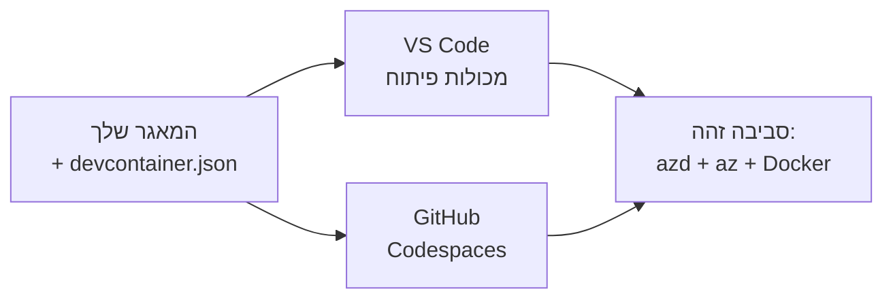

# Dev Containers & GitHub Codespaces עבור azd

**ניווט פרקים:**
- **📚 בית הקורס**: [AZD למתחילים](../../README.md)
- **📖 הפרק הנוכחי**: פרק 1 - יסודות והתחלה מהירה
- **⬅️ הקודם**: [הבא את האפליקציה שלך](bring-your-own-app.md)
- **🚀 הפרק הבא**: [פרק 2: פיתוח מונחה-בינה מלאכותית](../chapter-02-ai-development/README.md)

> נבדק עם `azd 1.25.6` ביוני 2026.

## מבוא

התקנה של azd, סביבת ריצה לשפה המתאימה, Docker ו‑Azure CLI על כל מחשב היא מטלה מעייפת — והיא הסיבה מספר אחת לכך שמדריך ש"עובד אצלי" נכשל אצל מישהו אחר. **מיכל פיתוח (dev container)** פותר את הבעיה על‑ידי תיאור כל שרשרת הכלים בקובץ. כל מי שפותח את הפרויקט ב‑VS Code או ב‑GitHub Codespaces מקבל את אותה סביבת עבודה בדיוק, עם azd מותקן כבר. השיעור הזה מראה איך להוסיף אחד כזה.

## מטרות למידה

- להבין מהו מיכל פיתוח ולמה הוא עוזר עם azd
- לצור קובץ `.devcontainer/devcontainer.json` מינימלי לפרויקט
- לכלול את azd, את Azure CLI ו‑Docker דרך *תכונות* של Dev Container
- לפתוח את הפרויקט ב‑GitHub Codespaces או ב‑VS Code

## תוצאות הלמידה

- ליצור `devcontainer.json` עבור פרויקט azd
- להוסיף את azd וכלי Azure ללא התקנות ידניות
- להריץ `azd up` מתוך מכולה או Codespace

---

## מהו מיכל פיתוח?

מיכל פיתוח הוא סביבת פיתוח מבוססת Docker המוגדרת על‑ידי קובץ `.devcontainer/devcontainer.json` במאגר שלך. כשאתה פותח את הפרויקט:

- **VS Code** (עם תוסף Dev Containers) בונה את המכולה ומצמיד אליה את סביבת העבודה.
- **GitHub Codespaces** בונה את אותה מכולה בענן ומספק עורך בדפדפן.

כך או כך, כל תורם מקבל את אותם כלים — אין צורך בתחקור "האם התקנת azd?".



---

## שלב 1: צור את קובץ ה‑devcontainer

צור את `.devcontainer/devcontainer.json` בשורש הפרויקט שלך:

```json
{
  "name": "azd-project",
  "image": "mcr.microsoft.com/devcontainers/base:bookworm",
  "features": {
    "ghcr.io/devcontainers/features/azure-cli:1": {},
    "ghcr.io/azure/azure-dev/azd:latest": {},
    "ghcr.io/devcontainers/features/docker-in-docker:2": {},
    "ghcr.io/devcontainers/features/node:1": {}
  },
  "customizations": {
    "vscode": {
      "extensions": [
        "ms-azuretools.azure-dev",
        "ms-azuretools.vscode-bicep"
      ]
    }
  },
  "forwardPorts": [3000],
  "postCreateCommand": "azd version"
}
```

What each part does:

| מפתח | מטרה |
|-----|---------|
| `image` | מערכת ההפעלה הבסיסית של המכולה |
| `features` | מתקינים מובנים מראש — כאן: Azure CLI, **azd**, Docker ו‑Node.js |
| `customizations.vscode.extensions` | מתקין אוטומטית את תוספי VS Code של azd ו‑Bicep |
| `forwardPorts` | פותח את פורט היישום לדפדפן שלך |
| `postCreateCommand` | מריץ פעם אחת לאחר שבניית המכולה הושלמה (כאן, בדיקת תקינות) |

> התכונה `ghcr.io/azure/azure-dev/azd:latest` היא הדרך הרשמית לקבל את azd בתוך מכולה. נעץ גרסה ספציפית (למשל `azd:1.25.6`) אם אתה צריך יכולת שחזור.

---

## שלב 2: התאמת התכונה לשפת האפליקציה שלך

החליפו את תכונת `node` בתכונה המתאימה לשפה שבה האפליקציה שלכם משתמשת:

```jsonc
// Python project
"ghcr.io/devcontainers/features/python:1": {},

// .NET project
"ghcr.io/devcontainers/features/dotnet:2": {},

// Java project
"ghcr.io/devcontainers/features/java:1": {},

// Go project
"ghcr.io/devcontainers/features/go:1": {}
```

השאירו את `docker-in-docker` אם ה־`host` שלכם הוא `containerapp`, `aks`, או כל דבר שבונה תמונת מכולה — azd צריך Docker כדי לבנות ולדחוף תמונות.

---

## שלב 3: פתח את הפרויקט

**ב־VS Code:**
1. התקן את התוסף **Dev Containers**.
2. פתח את תיקיית הפרויקט.
3. לחץ על **Reopen in Container** כשיתבקש (או הרץ *Dev Containers: Reopen in Container*).

**ב‑GitHub Codespaces:**
1. דחוף את המאגר ל‑GitHub.
2. לחץ על **Code → Codespaces → Create codespace on main**.
3. המתן לבניית המכולה — azd מוכן בטרמינל.

---

## שלב 4: פרוס מתוך המכולה

במכולה azd מותקן מראש, לכן זרימת העבודה הרגילה פשוט עובדת:

```bash
azd auth login --use-device-code   # קוד ההתקן נוח לשימוש בתוך Codespaces
azd up
```

> **למה `--use-device-code`?** בתוך מכולה מרוחקת או Codespace אין דפדפן מקומי לנתב אליו, לכן כניסה באמצעות device-code היא הדרך האמינה. תדביקו קוד בכרטיסיית דפדפן כדי להשלים את הכניסה.

---

## תקלות נפוצות

| תקלה | פתרון |
|---------|-----|
| `azd up` לא יכול לבנות תמונה | הוסף את התכונה `docker-in-docker` |
| כניסת הדפדפן נתקעת ב‑Codespaces | השתמש ב‑`azd auth login --use-device-code` |
| כלים שונים בין חברי הצוות | נעץ גרסאות תכונות (למשל `azd:1.25.6`) |
| האפליקציה לא נגישה בדפדפן | הוסף את הפורט ל־`forwardPorts` |

---

## סיכום

- מיכל פיתוח הופך את שרשרת הכלים של azd לשחזורית עבור כולם.
- הוסף את azd, Azure CLI ו‑Docker באמצעות *תכונות* של Dev Container.
- התאם את תכונת השפה לאפליקציה שלך ושמור על `docker-in-docker` עבור מארחי מכולות.
- השתמש בכניסה באמצעות device-code כאשר מריצים בתוך Codespaces.

---

## 🔗 ניווט

| כיוון | משאב |
|-----------|----------|
| **הקודם** | [הבא את האפליקציה שלך](bring-your-own-app.md) |
| **בית הפרק** | [פרק 1: יסודות והתחלה מהירה](README.md) |
| **הפרק הבא** | [פרק 2: פיתוח מונחה-בינה מלאכותית](../chapter-02-ai-development/README.md) |

## 📖 משאבים קשורים

- [התקנה והגדרה](installation.md)
- [גליון פקודות](../../resources/cheat-sheet.md)
- [מפרט Dev Containers הרשמי](https://containers.dev/)
- [תכונת Dev Container של azd](https://github.com/Azure/azure-dev/tree/main/ext/devcontainer)

---

<!-- CO-OP TRANSLATOR DISCLAIMER START -->
**כתב ויתור**:
מסמך זה תורגם באמצעות שירות תרגום אוטומטי [Co-op Translator](https://github.com/Azure/co-op-translator). למרות שאנו שואפים לדיוק, יש לקחת בחשבון שתרגומים אוטומטיים עלולים להכיל שגיאות או אי-דיוקים. יש להחשיב את המסמך המקורי בשפתו הטבעית כמקור הסמכות. למידע קריטי מומלץ להשתמש בתרגום מקצועי על ידי מתרגם אדם. אנו לא אחראים לכל אי-הבנה או פירוש שגוי הנובע מהשימוש בתרגום זה.
<!-- CO-OP TRANSLATOR DISCLAIMER END -->