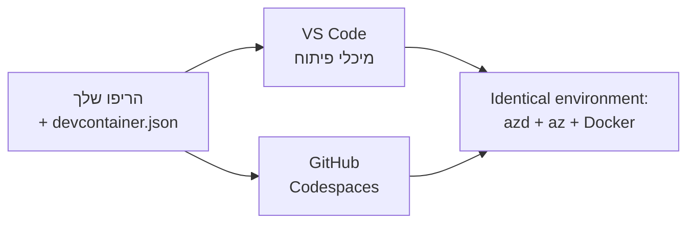

# מיכלי פיתוח ו-GitHub Codespaces עבור azd

**ניווט בפרק:**
- **📚 דף הקורס הראשי**: [AZD למתחילים](../../README.md)
- **📖 פרק נוכחי**: פרק 1 - יסודות והתחלה מהירה
- **⬅️ קודם**: [הבא את האפליקציה שלך](bring-your-own-app.md)
- **🚀 פרק הבא**: [פרק 2: פיתוח מבוסס AI](../chapter-02-ai-development/README.md)

> אומת ב`azd 1.27.1` ביולי 2026.

## הקדמה

התקנת azd, סביבת הריצה המתאימה, Docker, ו-Azure CLI בכל מכונה היא מטלה – והיא הסיבה העיקרית לכך שהדרכה ש"עובדת אצלי" נכשלת אצל מישהו אחר. **מיכל פיתוח** פותר זאת על ידי תיאור כל ספקיית הכלים שלך בקובץ אחד. כל מי שפותח את הפרויקט ב-VS Code או GitHub Codespaces מקבל את אותו סביבה בדיוק, עם azd מותקן מראש. בשיעור זה תלמד כיצד להוסיף אחד.

## מטרות הלמידה

בסיום השיעור, תוכל:
- להבין מהו מיכל פיתוח ולמה הוא עוזר עם azd
- להוסיף קובץ `.devcontainer/devcontainer.json` מינימלי לפרויקט
- לכלול את azd, Azure CLI, ו-Docker דרך *תכונות* של מיכל הפיתוח
- לפתוח את הפרויקט ב-GitHub Codespaces או VS Code

## תוצאות הלמידה

לאחר סיום השיעור, תוכל:
- לכתוב `devcontainer.json` עבור פרויקט azd
- להוסיף את azd וכלי Azure ללא התקנות ידניות
- להריץ `azd up` מתוך מיכל או Codespace

---

## מהו מיכל פיתוח?

מיכל פיתוח הוא סביבת פיתוח מבוססת Docker המוגדרת על ידי קובץ `.devcontainer/devcontainer.json` במאגר שלך. כשאתה פותח את הפרויקט:

- **VS Code** (עם תוסף Dev Containers) בונה את המיכל ומתחבר אליו.
- **GitHub Codespaces** בונה את אותו המיכל בענן ומספק עורך מבוסס דפדפן.

כך או כך, כל משתתף מקבל את אותם כלים בדיוק — ללא "התקנת azd?" ותקלות שנובעות מכך.



---

## שלב 1: צור את קובץ המיכל

צור `.devcontainer/devcontainer.json` בשורש הפרויקט שלך:

```json
{
  "name": "azd-project",
  "image": "mcr.microsoft.com/devcontainers/base:bookworm",
  "features": {
    "ghcr.io/devcontainers/features/azure-cli:1": {},
    "ghcr.io/azure/azure-dev/azd:latest": {},
    "ghcr.io/devcontainers/features/docker-in-docker:2": {},
    "ghcr.io/devcontainers/features/node:1": {}
  },
  "customizations": {
    "vscode": {
      "extensions": [
        "ms-azuretools.azure-dev",
        "ms-azuretools.vscode-bicep"
      ]
    }
  },
  "forwardPorts": [3000],
  "postCreateCommand": "azd version"
}
```

מה כל חלק עושה:

| מפתח | מטרה |
|-------|--------|
| `image` | מערכת ההפעלה הבסיסית של המיכל |
| `features` | מתקינים מראש — כאן: Azure CLI, **azd**, Docker, ו-Node.js |
| `customizations.vscode.extensions` | מתקין אוטומטית את תוספי VS Code של azd ו-Bicep |
| `forwardPorts` | מחשף את הפורט של האפליקציה לדפדפן שלך |
| `postCreateCommand` | רץ פעם אחת אחרי שהמיכל נבנה (כאן, בדיקת תקינות) |

> תכונת `ghcr.io/azure/azure-dev/azd:latest` היא הדרך הרשמית לקבל את azd במיכל. קבע גרסה ספציפית (למשל `azd:1.27.1`) אם אתה זקוק לנשנות.

---

## שלב 2: התאם את התכונה לשפת האפליקציה שלך

החלף את תכונת `node` למה שהאפליקציה שלך משתמשת בו:

```jsonc
// Python project
"ghcr.io/devcontainers/features/python:1": {},

// .NET project
"ghcr.io/devcontainers/features/dotnet:2": {},

// Java project
"ghcr.io/devcontainers/features/java:1": {},

// Go project
"ghcr.io/devcontainers/features/go:1": {}
```

השאר את `docker-in-docker` אם ה`host` שלך הוא `containerapp`, `aks`, או כל דבר שבונה תמונת מיכל — azd צריך את Docker לבנות ולדחוף תמונות.

---

## שלב 3: פתח את המיכל

**ב-VS Code:**
1. התקן את תוסף **Dev Containers**.
2. פתח את תיקיית הפרויקט.
3. לחץ על **Reopen in Container** כשמתבקש (או הרץ *Dev Containers: Reopen in Container*).

**ב-GitHub Codespaces:**
1. דחוף את המאגר ל-GitHub.
2. לחץ על **Code → Codespaces → Create codespace on main**.
3. המתן לבניית המיכל — azd מוכן במסוף.

---

## שלב 4: פרוס מתוך המיכל

המיכל מגיע עם azd מותקן מראש, לכן זרימת העבודה הרגילה פשוט עובדת:

```bash
azd auth login --use-device-code   # קוד התקן שימושי בתוך Codespaces
azd up
```

> **למה `--use-device-code`?** במיכל מרוחק או Codespace אין דפדפן מקומי להפניה מחדש, לכן התחברות על ידי קוד מכשיר היא הדרך האמינה. תעתיק קוד לכרטיסיית דפדפן כדי להשלים את ההתחברות.

---

## נפילות נפוצות

| נפילה | תיקון |
|--------|-------|
| `azd up` לא מצליח לבנות תמונה | הוסף את תכונת `docker-in-docker` |
| כניסת דפדפן תלוית בקוד תלויה ב-Codespaces | השתמש ב`azd auth login --use-device-code` |
| כלים שונים בין עמיתים | קבע גרסאות לתכונות (למשל `azd:1.27.1`) |
| האפליקציה לא נגישה בדפדפן | הוסף את הפורט ל`forwardPorts` |

---

## סיכום

- מיכל פיתוח הופך את ספקיית הכלים של azd שלך לנשנית לכולם.
- הוסף את azd, Azure CLI, ו-Docker דרך *תכונות* של מיכל הפיתוח.
- תאם את תכונת השפה לאפליקציה שלך ושמור על `docker-in-docker` עבור מארחי מיכלים.
- השתמש בהתחברות עם קוד מכשיר כשמריצים בתוך Codespaces.

---

## 🔗 ניווט

| כיוון | משאב |
|-------|--------|
| **קודם** | [הבא את האפליקציה שלך](bring-your-own-app.md) |
| **דף הפרק** | [פרק 1: יסודות והתחלה מהירה](README.md) |
| **פרק הבא** | [פרק 2: פיתוח מבוסס AI](../chapter-02-ai-development/README.md) |

## 📖 משאבים קשורים

- [התקנה והגדרות](installation.md)
- [עלון פקודות](../../resources/cheat-sheet.md)
- [מפרט רשמי של מיכלי פיתוח](https://containers.dev/)
- [תכונת מיכל הפיתוח של azd](https://github.com/Azure/azure-dev/tree/main/ext/devcontainer)

---

<!-- CO-OP TRANSLATOR DISCLAIMER START -->
**כתב ויתור**:
מסמך זה תורגם באמצעות שירות תרגום אוטומטי [Co-op Translator](https://github.com/Azure/co-op-translator). למרות שאנו שואפים לדיוק, יש לקחת בחשבון שתרגומים אוטומטיים עלולים להכיל שגיאות או אי-דיוקים. יש להחשיב את המסמך המקורי בשפתו הטבעית כמקור הסמכות. למידע קריטי מומלץ להשתמש בתרגום מקצועי על ידי מתרגם אדם. אנו לא אחראים לכל אי-הבנה או פירוש שגוי הנובע מהשימוש בתרגום זה.
<!-- CO-OP TRANSLATOR DISCLAIMER END -->