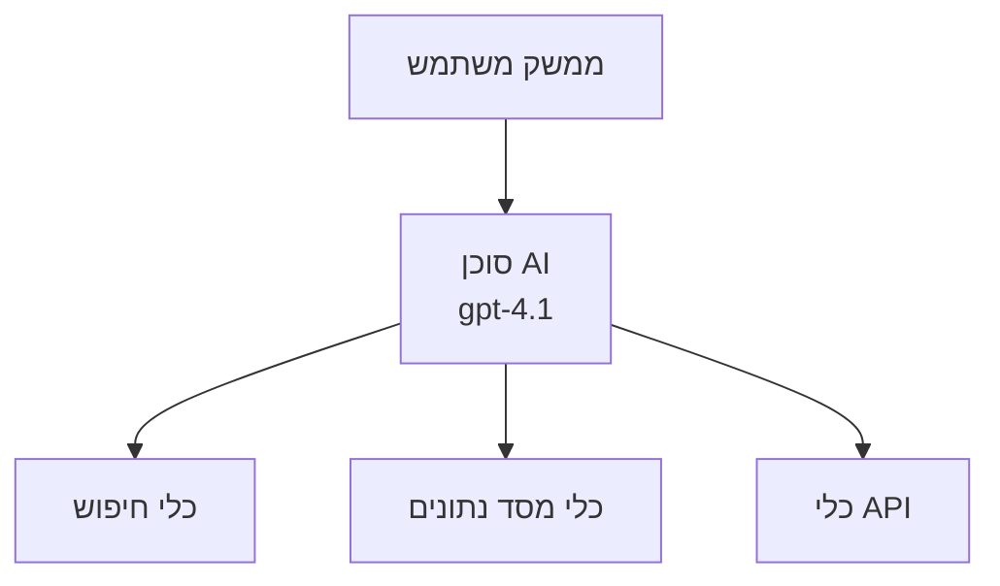
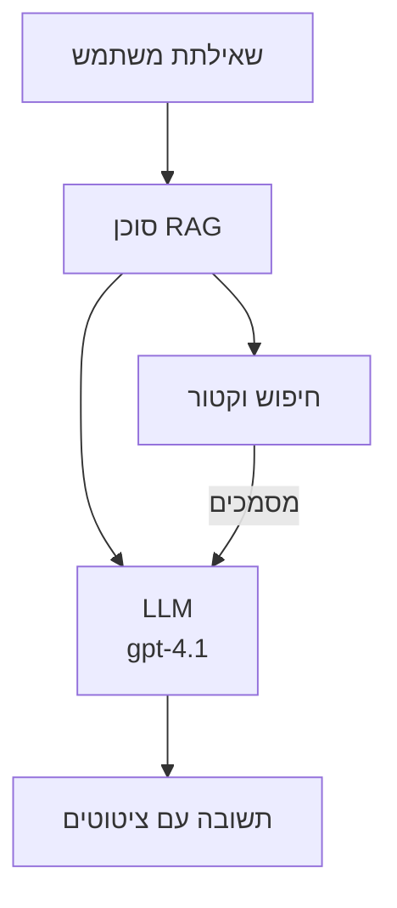
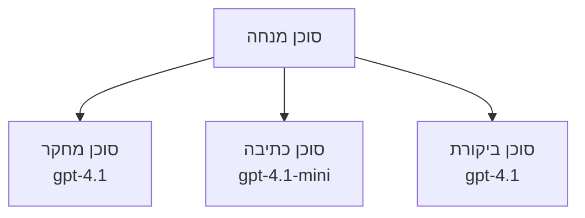

# סוכני AI עם Azure Developer CLI

**ניווט פרקים:**
- **📚 דף הקורס הראשי**: [AZD למתחילים](../../README.md)
- **📖 פרק נוכחי**: פרק 2 - פיתוח מונחה AI
- **⬅️ קודם**: [שילוב Microsoft Foundry](microsoft-foundry-integration.md)
- **➡️ הבא**: [פריסת מודל AI](ai-model-deployment.md)
- **🚀 מתקדם**: [פתרונות מולטי-סוכן](../../examples/retail-scenario.md)

---

## מבוא

סוכני AI הם תוכניות אוטונומיות שיכולות לתפוס את סביבתן, לקבל החלטות ולנקוט בפעולות להשגת מטרות ספציפיות. בשונה מצ'אטבוטים פשוטים שמגיבים להודעות, הסוכנים יכולים:

- **להשתמש בכלים** - לקרוא ל-APIs, לחפש בבסיסי נתונים, להריץ קוד
- **לתכנן ולהיגיון** - לפרק משימות מורכבות לשלבים
- **ללמוד מהקשר** - לשמור זיכרון ולהתאים התנהגות
- **לשתף פעולה** - לעבוד עם סוכנים אחרים (מערכות מולטי-סוכן)

מדריך זה מראה כיצד לפרוס סוכני AI ל-Azure באמצעות Azure Developer CLI (azd).

> **הערת אימות (25-03-2026):** מדריך זה נבדק מול `azd` `1.23.12` ו-`azure.ai.agents` `0.1.18-preview`. חווית `azd ai` עדיין בבדיקת תצוגה מוקדמת, לכן יש לבדוק עזרה בהרחבה אם הדגלים שהותקנו שונים.

## מטרות הלמידה

בסיום מדריך זה, תוכל:
- להבין מה הם סוכני AI וכיצד הם שונים מצ'אטבוטים
- לפרוס תבניות סוכני AI מוכנות באמצעות AZD
- להגדיר סוכני Foundry לסוכנים מותאמים
- לממש תבניות סוכן בסיסיות (שימוש בכלי, RAG, מולטי-סוכן)
- לנטר ולתקן סוכנים שפורסמו

## תוצאות הלמידה

בסיום, תוכל:
- לפרוס יישומי סוכני AI ל-Azure עם פקודה אחת
- להגדיר כלים ויכולות סוכן
- לממש יצירת תוכן משולבת שליפה (RAG) עם סוכנים
- לתכנן ארכיטקטורות מולטי-סוכן עבור זרימות עבודה מורכבות
- לטפל בבעיות נפוצות בפריסת סוכנים

---

## 🤖 מה מבדיל סוכן מצ'אטבוט?

| תכונה | צ'אטבוט | סוכן AI |
|-------|---------|---------|
| **התנהגות** | מגיב להודעות | נוקט פעולות אוטונומיות |
| **כלים** | אין | יכול לקרוא ל-APIs, לחפש, להריץ קוד |
| **זיכרון** | מבוסס מושב בלבד | זיכרון מתמשך בין מושבים |
| **תכנון** | תגובה בודדת | חשיבה מרובת שלבים |
| **שיתוף פעולה** | ישות יחידה | יכול לעבוד עם סוכנים נוספים |

### אנלוגיה פשוטה

- **צ'אטבוט** = אדם עוזר שעונה על שאלות בדלפק מידע
- **סוכן AI** = עוזר אישי שיכול לבצע שיחות, לקבוע פגישות ולבצע משימות עבורך

---

## 🚀 התחלה מהירה: פרוס את הסוכן הראשון שלך

### אפשרות 1: תבנית סוכני Foundry (מומלץ)

```bash
# לאתחל את תבנית הסוכני ה-AI
azd init --template get-started-with-ai-agents

# לפרוס ל-Azure
azd up
```

**מה נפוץ לפרוס:**
- ✅ סוכני Foundry
- ✅ דגמי Microsoft Foundry (gpt-4.1)
- ✅ Azure AI Search (ל-RAG)
- ✅ Azure Container Apps (ממשק ווב)
- ✅ Application Insights (ניטור)

**זמן:** כ-15-20 דקות  
**עלות:** כ-100-150$ לחודש (פיתוח)

### אפשרות 2: סוכן OpenAI עם Prompty

```bash
# אתחול תבנית הסוכן מבוסס Prompty
azd init --template agent-openai-python-prompty

# פריסה ל-Azure
azd up
```

**מה נפוץ לפרוס:**
- ✅ Azure Functions (הרצת סוכן ללא שרת)
- ✅ דגמי Microsoft Foundry
- ✅ קבצי הגדרות Prompty
- ✅ דוגמת מימוש סוכן

**זמן:** כ-10-15 דקות  
**עלות:** כ-50-100$ לחודש (פיתוח)

### אפשרות 3: סוכן צ'אט RAG

```bash
# אתחל תבנית שיחה RAG
azd init --template azure-search-openai-demo

# פרוס ל-Azure
azd up
```

**מה נפוץ לפרוס:**
- ✅ דגמי Microsoft Foundry
- ✅ Azure AI Search עם נתוני דוגמה
- ✅ צינור עיבוד מסמכים
- ✅ ממשק צ'אט עם הפניות

**זמן:** כ-15-25 דקות  
**עלות:** כ-80-150$ לחודש (פיתוח)

### אפשרות 4: התחלת סוכן AZD AI (תצוגה מוקדמת מבוססת מניפסט או תבנית)

אם יש ברשותך קובץ מניפסט של סוכן, תוכל להשתמש בפקודת `azd ai` ליצירת פרויקט שירות סוכן Foundry ישירות. גרסאות תצוגה מוקדמת אחרונות הוסיפו גם תמיכה באתחול מבוסס תבניות, כך שהמהלך המדויק של התהליך עשוי להשתנות בהתאם לגרסת ההרחבה שהותקנה.

```bash
# התקן את התוסף של סוכני הבינה המלאכותית
azd extension install azure.ai.agents

# אופציונלי: אמת את גרסת התצוגה המקדימה שהותקנה
azd extension show azure.ai.agents

# אתחל ממניפסט של סוכן
azd ai agent init -m agent-manifest.yaml

# פרוס ל-Azure
azd up

# בדוק את הסוכן שהופעל (מציג השהייה + זמן לבייט ראשון)
azd ai agent invoke
```

**מתי להשתמש ב-`azd ai agent init` מול `azd init --template`:**

| גישה | מתאים ל- | איך זה עובד |
|-------|----------|------------|
| `azd init --template` | התחלה מדוגמת עבודה קיימת | משכפל מאגר תבנית מלא עם קוד ותשתית |
| `azd ai agent init -m` | בנייה מניפסט סוכן משלך | מייצר מבנה פרויקט לפי הגדרת הסוכן שלך |

> **הערה:** השתמש ב-`azd init --template` ללימוד (אפשרויות 1-3 למעלה). השתמש ב-`azd ai agent init` לבניית סוכנים ייצור עם מניפסטים אישיים.

לאחר `azd up`, ההרחבה מתקיימת לאורך שאר מחזור חיי הסוכן: `azd ai agent invoke` לבדיקה, `azd ai agent eval generate` ו-`azd ai agent optimize` למדידה ושיפור איכות, ו-`azd ai agent delete` לניקוי. ראה [פקודות AZD AI CLI](../chapter-08-production/production-ai-practices.md#azd-ai-cli-commands-and-extensions) לעיון מלא.

---

## 🏗️ תבניות ארכיטקטורת סוכן

### תבנית 1: סוכן יחיד עם כלים

הדפוס הפשוט ביותר - סוכן אחד שיכול להשתמש בכלים מרובים.



**מתאים ל:**
- רובוטי תמיכה בלקוחות
- עוזרי מחקר
- סוכני ניתוח נתונים

**תבנית AZD:** `azure-search-openai-demo`

### תבנית 2: סוכן RAG (יצירה משולבת שליפה)

סוכן שמביא מסמכים רלוונטיים לפני יצירת תגובות.



**מתאים ל:**
- בסיסי ידע ארגוניים
- מערכות שאלות ותשובות מסמכים
- ניהול ציות ומחקר משפטי

**תבנית AZD:** `azure-search-openai-demo`

### תבנית 3: מערכת מולטי-סוכן

מספר סוכנים מתמחים העובדים יחד על משימות מורכבות.



**מתאים ל:**
- יצירת תוכן מורכב
- זרימות עבודה מרובות שלבים
- משימות שדורשות מומחיות שונה

**למידע נוסף:** [תבניות תיאום מולטי-סוכן](../chapter-06-pre-deployment/coordination-patterns.md)

---

## ⚙️ הגדרת כלים לסוכן

הסוכנים הופכים חזקים כשהם יכולים להשתמש בכלים. כך מגדירים כלים נפוצים:

### הגדרות כלים בסוכני Foundry

```python
# agent_config.py
from azure.ai.projects import AIProjectClient
from azure.ai.projects.models import FunctionTool, CodeInterpreterTool

# הגדרת כלי מותאמים אישית
search_tool = FunctionTool(
    name="search_knowledge_base",
    description="Search the company knowledge base for relevant documents",
    parameters={
        "type": "object",
        "properties": {
            "query": {
                "type": "string",
                "description": "The search query"
            }
        },
        "required": ["query"]
    }
)

# יצירת סוכן עם כלים
agent = project_client.agents.create_agent(
    model="gpt-4.1",
    name="Support Agent",
    instructions="You are a helpful support agent. Use the search tool to find relevant information.",
    tools=[search_tool, CodeInterpreterTool()]
)
```

### הגדרת סביבה

```bash
# הגדר משתני סביבה ספציפיים לסוכן
azd env set AZURE_OPENAI_MODEL "gpt-4.1"
azd env set AGENT_INSTRUCTIONS "You are a helpful assistant..."
azd env set ENABLE_CODE_INTERPRETER "true"
azd env set ENABLE_FILE_SEARCH "true"

# פרוס עם תצורה מעודכנת
azd deploy
```

---

## 📊 ניטור סוכנים

### אינטגרציה עם Application Insights

כל תבניות הסוכן ב-AZD כוללות Application Insights לניטור:

```bash
# פתח את לוח הבקרה של המוניטורינג
azd monitor --overview

# הצג יומנים בזמן אמת
azd monitor --logs

# הצג מדדים בזמן אמת
azd monitor --live
```

### מדדי מפתח למעקב

| מדד | תיאור | יעד |
|------|--------|-----|
| עיכוב תגובה | זמן ליצירת תגובה | < 5 שניות |
| שימוש בטוקנים | טוקנים לבקשה | ניטור עלות |
| אחוז הצלחת קריאות לכלים | % קריאות שהושלמו בהצלחה | > 95% |
| שיעור שגיאות | בקשות סוכן שנכשלו | < 1% |
| שביעות רצון משתמש | ציוני משוב | > 4.0/5.0 |

### רישום מותאם אישית לסוכנים

```python
import os
from azure.monitor.opentelemetry import configure_azure_monitor
from opentelemetry import trace

# הגדר את Azure Monitor עם OpenTelemetry
configure_azure_monitor(
    connection_string=os.environ["APPLICATIONINSIGHTS_CONNECTION_STRING"]
)

tracer = trace.get_tracer(__name__)

def log_agent_interaction(user_query, agent_response, tools_used, latency_ms):
    with tracer.start_as_current_span("agent_interaction") as span:
        span.set_attributes({
            "user_query": user_query,
            "response_length": len(agent_response),
            "tools_used": tools_used,
            "latency_ms": latency_ms
        })
```

> **הערה:** התקן את החבילות הנדרשות: `pip install azure-monitor-opentelemetry opentelemetry`

---

## 💰 שיקולי עלות

### עלויות חודשיות משוערות לפי תבנית

| תבנית | סביבת פיתוח | הפקה |
|--------|-------------|-------|
| סוכן יחיד | 50-100$ | 200-500$ |
| סוכן RAG | 80-150$ | 300-800$ |
| מולטי-סוכן (2-3 סוכנים) | 150-300$ | 500-1,500$ |
| מולטי-סוכן ארגוני | 300-500$ | 1,500-5,000$+ |

### טיפים לאופטימיזציית עלויות

1. **השתמש ב-gpt-4.1-mini למשימות פשוטות**  
   ```bash
   azd env set AZURE_OPENAI_MODEL "gpt-4.1-mini"
   ```
  
2. **מימוש מטמון לשאילתות חוזרות**  
   ```python
   from functools import lru_cache
   
   @lru_cache(maxsize=1000)
   def get_cached_response(query_hash):
       return agent.run(query_hash)
   ```
  
3. **קבע מגבלות טוקן להרצה**  
   ```python
   # קבע את max_completion_tokens בעת הרצת הסוכן, לא בזמן היצירה
   run = project_client.agents.create_run(
       thread_id=thread.id,
       agent_id=agent.id,
       max_completion_tokens=1000  # הגבל את אורך התגובה
   )
   ```
  
4. **התאפס למצב לא פעיל כשלא בשימוש**  
   ```bash
   # אפליקציות מכולה מתכווננות אוטומטית לאפס
   azd env set MIN_REPLICAS "0"
   ```
  
---

## 🔧 פתרון תקלות בסוכנים

### בעיות נפוצות ופתרונות

<details>
<summary><strong>❌ הסוכן לא מגיב לקריאות כלים</strong></summary>

```bash
# בדוק אם הכלים רשומים כראוי
azd show

# אמת פריסת OpenAI
az cognitiveservices account deployment list \
  --name $AZURE_OPENAI_NAME \
  --resource-group $RG_NAME

# בדוק יומני סוכן
azd monitor --logs
```
  
**גורמים נפוצים:**  
- חוסר התאמה בחתימת פונקציית הכלי  
- הרשאות חסרות  
- נקודת קצה API לא נגישה  
</details>

<details>
<summary><strong>❌ עיכוב גבוה בתגובות הסוכן</strong></summary>

```bash
# בדוק בבדיקות Application Insights צווארי בקבוק
azd monitor --live

# שקול להשתמש במודל מהיר יותר
azd env set AZURE_OPENAI_MODEL "gpt-4.1-mini"
azd deploy
```
  
**טיפים לאופטימיזציה:**  
- השתמש בתגובות סטרימינג  
- הטמע מטמון לתגובות  
- הקטן את גודל חלון ההקשר  
</details>

<details>
<summary><strong>❌ הסוכן מחזיר מידע שגוי או מדומה</strong></summary>

```python
# שפר עם הנחיות מערכת טובות יותר
instructions = """
You are a helpful assistant. IMPORTANT:
- Only answer based on provided context
- If you don't know, say "I don't know"
- Always cite your sources
- Never make up information
"""

# הוסף שליפה לעיגון
agent = project_client.agents.create_agent(
    model="gpt-4.1",
    instructions=instructions,
    tools=[FileSearchTool()]  # עגן תגובות במסמכים
)
```
</details>

<details>
<summary><strong>❌ שגיאות עקב חריגה ממגבלת טוקנים</strong></summary>

```python
# יישם ניהול חלון הקשר
def truncate_context(messages, max_tokens=8000, model="gpt-4.1"):
    """Keep only recent messages within token limit."""
    import tiktoken
    encoding = tiktoken.encoding_for_model(model)
    total_tokens = 0
    truncated = []
    
    for msg in reversed(messages):
        msg_tokens = len(encoding.encode(msg.content))
        if total_tokens + msg_tokens > max_tokens:
            break
        truncated.insert(0, msg)
        total_tokens += msg_tokens
    
    return truncated
```
</details>

---

## 🎓 תרגילים מעשיים

### תרגיל 1: פרוס סוכן בסיסי (20 דקות)

**מטרה:** לפרוס את סוכן ה-AI הראשון שלך באמצעות AZD

```bash
# שלב 1: אתחל תבנית
azd init --template get-started-with-ai-agents

# שלב 2: היכנס ל-Azure
azd auth login
# אם אתה עובד על פני שוכנים, הוסף --tenant-id <tenant-id>

# שלב 3: פרוס
azd up

# שלב 4: בדוק את הסוכן
# פלט צפוי לאחר הפריסה:
#   הפריסה הושלמה!
#   נקודת קצה: https://<app-name>.<region>.azurecontainerapps.io
# פתח את כתובת ה-URL שמופיעה בפלט ונסה לשאול שאלה

# שלב 5: הצג ניטור
azd monitor --overview

# שלב 6: נקה
azd down --force --purge
```
  
**קריטריונים להצלחה:**  
- [ ] הסוכן מגיב לשאלות  
- [ ] ניתן לגשת לדשבורד הניטור דרך `azd monitor`  
- [ ] המשאבים מתנקיים בהצלחה  

### תרגיל 2: הוסף כלי מותאם אישית (30 דקות)

**מטרה:** להרחיב סוכן עם כלי מותאם

1. פרוס את תבנית הסוכן:  
   ```bash
   azd init --template get-started-with-ai-agents
   azd up
   ```
  
2. צור פונקציית כלי חדשה בקוד הסוכן:  
   ```python
   def get_weather(location: str) -> str:
       """Get current weather for a location."""
       # קריאה ל-API לשירות מזג האוויר
       return f"Weather in {location}: Sunny, 72°F"
   ```
  
3. רשם את הכלי בסוכן:  
   ```python
   from azure.ai.projects.models import FunctionTool

   weather_tool = FunctionTool(
       name="get_weather",
       description="Get current weather for a location",
       parameters={
           "type": "object",
           "properties": {
               "location": {"type": "string", "description": "City name"}
           },
           "required": ["location"]
       }
   )

   agent = project_client.agents.create_agent(
       model="gpt-4.1",
       name="Weather Agent",
       tools=[weather_tool]
   )
   ```
  
4. פרוס מחדש ובדוק:  
   ```bash
   azd deploy
   # שאל: "מה מזג האוויר בסיאטל?"
   # צפוי: הסוכן קורא לפונקציה get_weather("Seattle") ומחזיר מידע על מזג האוויר
   ```
  
**קריטריונים להצלחה:**  
- [ ] הסוכן מזהה שאילתות לגבי מזג אוויר  
- [ ] הכלי נקרא כראוי  
- [ ] התגובה כוללת מידע על מזג האוויר  

### תרגיל 3: בנה סוכן RAG (45 דקות)

**מטרה:** ליצור סוכן שמגיב לשאלות מתוך המסמכים שלך

```bash
# שלב 1: פרוס את תבנית RAG
azd init --template azure-search-openai-demo
azd up

# שלב 2: העלה את המסמכים שלך
# הנח קבצי PDF/TXT בתיקיית data/ ואז הרץ:
python scripts/prepdocs.py

# שלב 3: בדוק עם שאלות ספציפיות לתחום
# פתח את כתובת ה-URL של האפליקציית ווב מתוך פלט azd up
# שאול שאלות על המסמכים שהעלית
# התשובות צריכות לכלול הפניות ציטוט כמו [doc.pdf]
```
  
**קריטריונים להצלחה:**  
- [ ] הסוכן עונה מתוך מסמכים שהועלו  
- [ ] התגובות כוללות הפניות  
- [ ] אין הלוצינציות בשאלות מחוץ להיקף  

---

## 📚 צעדים הבאים

כעת כשאתה מבין סוכני AI, חקור נושאים מתקדמים אלה:

| נושא | תיאור | קישור |
|-------|---------|-------|
| **מערכות מולטי-סוכן** | בניית מערכות עם סוכנים משתפי פעולה מרובים | [דוגמת מולטי-סוכן קמעונאית](../../examples/retail-scenario.md) |
| **תבניות תיאום** | למד דפוסי ארכוב ושיתוף פעולה | [תבניות תיאום](../chapter-06-pre-deployment/coordination-patterns.md) |
| **פריסת ייצור** | פריסת סוכן מוכנה לארגון | [פרקטיקות AI בייצור](../chapter-08-production/production-ai-practices.md) |
| **הערכת סוכן** | בדיקה והערכת ביצועי סוכנים | [פתרון תקלות AI](../chapter-07-troubleshooting/ai-troubleshooting.md) |
| **סדנת AI מעשית** | ידיים על: הפוך את פתרון ה-AI שלך מוכן ל-AZD | [סדנת AI מעשית](ai-workshop-lab.md) |

---

## 📖 משאבים נוספים

### תיעוד רשמי
- [Microsoft Foundry Agent Service](https://learn.microsoft.com/azure/ai-services/agents/)
- [Microsoft Foundry Agent Service Quickstart](https://learn.microsoft.com/azure/ai-services/agents/quickstart)
- [Semantic Kernel Agent Framework](https://learn.microsoft.com/semantic-kernel/)

### תבניות AZD לסוכנים
- [התחל עם סוכני AI](https://github.com/Azure-Samples/get-started-with-ai-agents)
- [Agent OpenAI Python Prompty](https://github.com/Azure-Samples/agent-openai-python-prompty)
- [Azure Search OpenAI Demo](https://github.com/Azure-Samples/azure-search-openai-demo)

### משאבי קהילה
- [Awesome AZD - תבניות סוכן](https://azure.github.io/awesome-azd/?tags=ai-agents)
- [Azure AI Discord](https://discord.gg/microsoft-azure)
- [Microsoft Foundry Discord](https://discord.gg/nTYy5BXMWG)

### כישורים לסוכן שלך בעורך הקוד
- [**כישורי סוכני Microsoft Azure**](https://skills.sh/microsoft/github-copilot-for-azure) - התקן כישורי סוכני AI לשימוש חוזר בפיתוח Azure ב-GitHub Copilot, Cursor או בכל סוכן נתמך. כולל כישורים ל-[Azure AI](https://skills.sh/microsoft/github-copilot-for-azure/azure-ai), [Microsoft Foundry](https://skills.sh/microsoft/github-copilot-for-azure/microsoft-foundry), [פריסה](https://skills.sh/microsoft/github-copilot-for-azure/azure-deploy), ו-[אבחון](https://skills.sh/microsoft/github-copilot-for-azure/azure-diagnostics):  
  ```bash
  npx skills add microsoft/github-copilot-for-azure
  ```
  
---

**ניווט**
- **שיעור קודם**: [שילוב Microsoft Foundry](microsoft-foundry-integration.md)
- **שיעור הבא**: [פריסת מודל AI](ai-model-deployment.md)

---

<!-- CO-OP TRANSLATOR DISCLAIMER START -->
**כתב ויתור**:
מסמך זה תורגם באמצעות שירות תרגום אוטומטי [Co-op Translator](https://github.com/Azure/co-op-translator). למרות שאנו שואפים לדיוק, יש לקחת בחשבון שתרגומים אוטומטיים עלולים להכיל שגיאות או אי-דיוקים. יש להחשיב את המסמך המקורי בשפתו הטבעית כמקור הסמכות. למידע קריטי מומלץ להשתמש בתרגום מקצועי על ידי מתרגם אדם. אנו לא אחראים לכל אי-הבנה או פירוש שגוי הנובע מהשימוש בתרגום זה.
<!-- CO-OP TRANSLATOR DISCLAIMER END -->