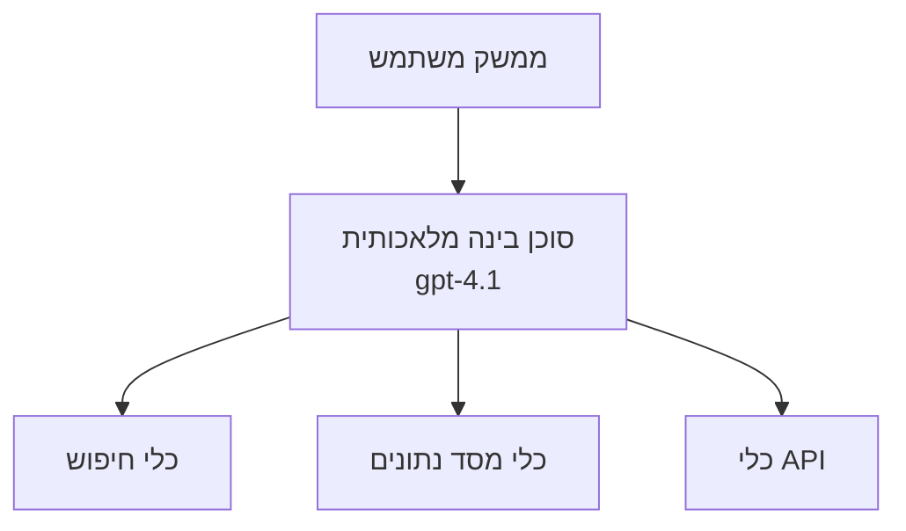
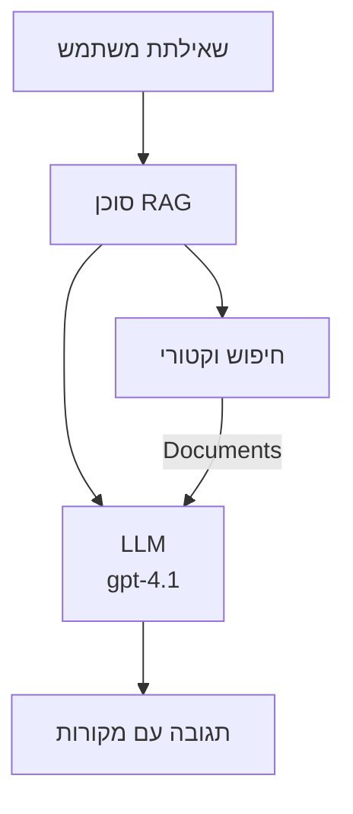
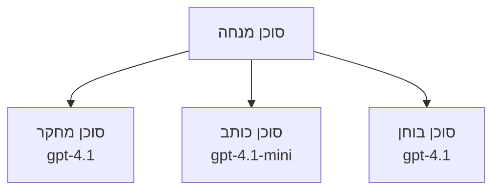

# סוכני AI עם Azure Developer CLI

**ניווט בפרקים:**
- **📚 דף הבית של הקורס**: [AZD למתחילים](../../README.md)
- **📖 פרק נוכחי**: פרק 2 - פיתוח מבוסס AI תחילה
- **⬅️ הקודם**: [אינטגרציה עם Microsoft Foundry](microsoft-foundry-integration.md)
- **➡️ הבא**: [פריסת מודל AI](ai-model-deployment.md)
- **🚀 מתקדם**: [פתרונות מרובי סוכנים](../../examples/retail-scenario.md)

---

## מבוא

סוכני AI הם תוכניות אוטונומיות שיכולות לתפוס את סביבתן, לקבל החלטות, ולנקוט בפעולות להשגת מטרות מסוימות. בניגוד לבוטים פשוטים שמגיבים להנחיות, סוכנים יכולים:

- **להשתמש בכלים** - לקרוא ל-APIs, לחפש במסדי נתונים, להריץ קוד
- **לתכנן ולנמק** - לפרק משימות מורכבות לשלבים
- **ללמוד מההקשר** - לשמור זיכרון ולהסתגל להתנהגות
- **לשתף פעולה** - לעבוד עם סוכנים אחרים (מערכות מרובי סוכנים)

מדריך זה מראה כיצד לפרוס סוכני AI ל-Azure באמצעות Azure Developer CLI (azd).

> **הערת אימות (2026-07-13):** מדריך זה נבדק מול `azd` `1.27.1` ו-`azure.ai.agents` `1.0.0-beta.5`. חוויית `azd ai` עדיין נמצאת בשלב תצוגה מוקדמת, לכן יש לבדוק עזרה של תוסף אם הדגלים שהותקנו שונים.

## מטרות למידה

בסיום מדריך זה, תלמד:
- להבין מה הם סוכני AI וכיצד הם שונים מבוטים
- לפרוס תבניות סוכני AI מוכנות מראש באמצעות AZD
- להגדיר סוכני Foundry לסוכנים מותאמים אישית
- ליישם דפוסי סוכן בסיסיים (שימוש בכלים, RAG, מרובי סוכנים)
- לנטר ולפתור בעיות בסוכנים שמופעלים

## תוצאות למידה

עם השלמת המדריך, תוכל:
- לפרוס יישומי סוכני AI ל-Azure בפקודה אחת
- להגדיר כלים ויכולות לסוכן
- ליישם יצירת תוכן מוקטנת (RAG) עם סוכנים
- לעצב ארכיטקטורות מרובי סוכנים לתהליכים מורכבים
- לפתור בעיות נפוצות בפריסת סוכנים

---

## 🤖 מה מפריד בין סוכן לבוט שיחה?

| תכונה | בוט שיחה | סוכן AI |
|---------|---------|----------|
| **התנהגות** | מגיב להנחיות | נוקט פעולות אוטונומיות |
| **כלים** | אין | יכול לקרוא ל-APIs, לחפש, להריץ קוד |
| **זיכרון** | מבוסס מפגש בלבד | זיכרון מתמשך בין מפגשים |
| **תכנון** | תגובה אחת | חשיבה מרובת שלבים |
| **שיתוף פעולה** | ישות יחידה | יכול לעבוד עם סוכנים אחרים |

### אנלוגיה פשוטה

- **בוט שיחה** = אדם מועיל שעונה על שאלות בדלפק מידע
- **סוכן AI** = עוזר אישי שמסוגל לבצע שיחות, לתאם פגישות, ולהשלים משימות עבורך

---

## 🚀 התחלה מהירה: פרוס את סוכן ה-AI הראשון שלך

### אפשרות 1: תבנית סוכני Foundry (מומלץ)

```bash
# אתחול תבנית סוכני ה-AI
azd init --template get-started-with-ai-agents

# פריסה ל-Azure
azd up
```

**מה מיוצר לפריסה:**
- ✅ סוכני Foundry
- ✅ מודלים של Microsoft Foundry (gpt-4.1)
- ✅ Azure AI Search (ל-RAG)
- ✅ Azure Container Apps (ממשק וובי)
- ✅ Application Insights (ניטור)

**זמן:** כ-15-20 דקות
**עלות:** כ-100-150 דולר לחודש (פיתוח)

### אפשרות 2: סוכן OpenAI עם Prompty

```bash
# אתחול התבנית של הסוכן מבוסס פרומפטי
azd init --template agent-openai-python-prompty

# פריסה לאז'ור
azd up
```

**מה מיוצר לפריסה:**
- ✅ Azure Functions (הרצת סוכן ללא שרת)
- ✅ מודלים של Microsoft Foundry
- ✅ קבצי תצורה של Prompty
- ✅ יישום דוגמה של סוכן

**זמן:** כ-10-15 דקות
**עלות:** כ-50-100 דולר לחודש (פיתוח)

### אפשרות 3: סוכן RAG לשיחה

```bash
# אתחול תבנית שיחה RAG
azd init --template azure-search-openai-demo

# פריסה ל-Azure
azd up
```

**מה מיוצר לפריסה:**
- ✅ מודלים של Microsoft Foundry
- ✅ Azure AI Search עם נתוני דוגמה
- ✅ צנרת עיבוד מסמכים
- ✅ ממשק שיחה עם ציטוטים

**זמן:** כ-15-25 דקות
**עלות:** כ-80-150 דולר לחודש (פיתוח)

### אפשרות 4: התחלת סוכן AI של AZD (תצוגה מוקדמת מבוססת מאניפסט או תבנית)

אם יש לך קובץ מאניפסט לסוכן, תוכל להשתמש בפקודת `azd ai` ליצירת פרויקט שירות סוכן Foundry ישירות. שחרורים מוקדמים נוספים כללו תמיכה באתחול מבוסס תבנית, כך שזרימת ההנחיה המדויקת עשויה להשתנות מעט בהתאם לגרסת התוסף שהותקנה.

```bash
# התקן את התוסף של סוכני ה-AI
azd extension install azure.ai.agents

# אופציונלי: אמת את גרסת התצוגה המקדימה המותקנת
azd extension show azure.ai.agents

# אתחל מתוך מפרט סוכן
azd ai agent init -m agent-manifest.yaml

# פרוס ל-Azure
azd up

# בדוק את הסוכן הפרוס (מציג השהייה + זמן לביט ראשון)
azd ai agent invoke
```

**מתי להשתמש ב-`azd ai agent init` לעומת `azd init --template`:**

| גישה | מתאים ל- | אופן הפעולה |
|----------|----------|------|
| `azd init --template` | התחלה מאפליקציית דוגמה עובדת | מייצר עותק של מאגר תבנית מלא עם קוד ותשתית |
| `azd ai agent init -m` | בנייה ממאניפסט סוכן משלך | מייצר מבנה פרויקט מהגדרת הסוכן שלך |

> **טיפ:** השתמש ב-`azd init --template` בעת למידה (אפשרויות 1-3 למעלה). השתמש ב-`azd ai agent init` כאשר בונים סוכנים יצרניים עם מאניפסטים משלך.

לאחר `azd up`, אותו התוסף מלווה אותך בשאר מחזור חיי הסוכן: `azd ai agent invoke` לבדיקה, `azd ai agent eval generate` ו-`azd ai agent optimize` למדידה ושיפור איכות, ו-`azd ai agent delete` לניקוי. ראה [פקודות CLI של AZD AI](../chapter-08-production/production-ai-practices.md#azd-ai-cli-commands-and-extensions) לקבלת הפניה מלאה.

---

## 🏗️ דפוסי ארכיטקטורת סוכן

### דפוס 1: סוכן יחיד עם כלים

דפוס הסוכן הפשוט ביותר - סוכן יחיד שיכול להשתמש בכלים מרובים.



**מתאים ל:**
- בוטי תמיכה בלקוחות
- עוזרי מחקר
- סוכני ניתוח נתונים

**תבנית AZD:** `azure-search-openai-demo`

### דפוס 2: סוכן RAG (יצירת תוכן מוגבר על ידי שליפה)

סוכן שמוציא למסמכים רלוונטיים לפני יצירת תגובות.



**מתאים ל:**
- מאגרי ידע ארגוניים
- מערכות שאלות ותשובות על מסמכים
- מחקר משפטי וציות

**תבנית AZD:** `azure-search-openai-demo`

### דפוס 3: מערכת מרובי סוכנים

מספר סוכנים מתמחים שעובדים יחד על משימות מורכבות.



**מתאים ל:**
- יצירת תוכן מורכב
- תהליכים מרובי שלבים
- משימות שדורשות מומחיות שונה

**למידע נוסף:** [דפוסי תיאום מרובי סוכנים](../chapter-06-pre-deployment/coordination-patterns.md)

---

## ⚙️ הגדרת כלים לסוכנים

סוכנים נעשים רבי עוצמה כאשר הם יכולים להשתמש בכלים. כך אפשר להגדיר כלים נפוצים:

### הגדרת כלים בסוכני Foundry

```python
# agent_config.py
from azure.ai.projects import AIProjectClient
from azure.ai.projects.models import FunctionTool, CodeInterpreterTool

# הגדר כלים מותאמים אישית
search_tool = FunctionTool(
    name="search_knowledge_base",
    description="Search the company knowledge base for relevant documents",
    parameters={
        "type": "object",
        "properties": {
            "query": {
                "type": "string",
                "description": "The search query"
            }
        },
        "required": ["query"]
    }
)

# צור סוכן עם כלים
agent = project_client.agents.create_agent(
    model="gpt-4.1",
    name="Support Agent",
    instructions="You are a helpful support agent. Use the search tool to find relevant information.",
    tools=[search_tool, CodeInterpreterTool()]
)
```

### הגדרת סביבה

```bash
# הגדר משתני סביבה ספציפיים לסוכן
azd env set AZURE_OPENAI_MODEL "gpt-4.1"
azd env set AGENT_INSTRUCTIONS "You are a helpful assistant..."
azd env set ENABLE_CODE_INTERPRETER "true"
azd env set ENABLE_FILE_SEARCH "true"

# פרוס עם תצורה מעודכנת
azd deploy
```

---

## 📊 ניטור סוכנים

### שילוב Application Insights

כל תבניות סוכני AZD כוללות Application Insights לניטור:

```bash
# פתח לוח בקרה לניטור
azd monitor --overview

# הצג יומנים חיים
azd monitor --logs

# הצג מדדים חיים
azd monitor --live
```

### מדדי מפתח למעקב

| מדד | תיאור | יעד |
|--------|-------------|--------|
| זמן תגובה | זמן ליצירת תגובה | < 5 שניות |
| שימוש בטוקנים | טוקנים לכל בקשה | מעקב לעלות |
| שיעור הצלחה בקריאות כלים | % ביצועי כלים מוצלחים | > 95% |
| שיעור שגיאות | בקשות סוכן שנכשלו | < 1% |
| שביעות רצון משתמש | ציון משוב | > 4.0/5.0 |

### לוגינג מותאם אישית לסוכנים

```python
import os
from azure.monitor.opentelemetry import configure_azure_monitor
from opentelemetry import trace

# הגדר את Azure Monitor עם OpenTelemetry
configure_azure_monitor(
    connection_string=os.environ["APPLICATIONINSIGHTS_CONNECTION_STRING"]
)

tracer = trace.get_tracer(__name__)

def log_agent_interaction(user_query, agent_response, tools_used, latency_ms):
    with tracer.start_as_current_span("agent_interaction") as span:
        span.set_attributes({
            "user_query": user_query,
            "response_length": len(agent_response),
            "tools_used": tools_used,
            "latency_ms": latency_ms
        })
```

> **הערה:** התקן את החבילות הנדרשות: `pip install azure-monitor-opentelemetry opentelemetry`

---

## 💰 התחשבות בעלויות

### עלויות חודשיות משוערות לפי דפוס

| דפוס | סביבת פיתוח | ייצור |
|---------|-----------------|------------|
| סוכן יחיד | $50-100 | $200-500 |
| סוכן RAG | $80-150 | $300-800 |
| מרובי סוכנים (2-3 סוכנים) | $150-300 | $500-1,500 |
| מרובי סוכנים ארגוניים | $300-500 | $1,500-5,000+ |

### טיפים לאופטימיזציה של עלויות

1. **השתמש ב-gpt-4.1-mini למשימות פשוטות**
   ```bash
   azd env set AZURE_OPENAI_MODEL "gpt-4.1-mini"
   ```

2. **יישם קאשינג לשאילתות חוזרות**
   ```python
   from functools import lru_cache
   
   @lru_cache(maxsize=1000)
   def get_cached_response(query_hash):
       return agent.run(query_hash)
   ```

3. **קבע מגבלות טוקנים לכל ריצה**
   ```python
   # הגדר max_completion_tokens בעת הרצת הסוכן, לא במהלך יצירה
   run = project_client.agents.create_run(
       thread_id=thread.id,
       agent_id=agent.id,
       max_completion_tokens=1000  # הגבל את אורך התשובה
   )
   ```

4. **סקל לדאון לאפס כשלא בשימוש**
   ```bash
   # אפליקציות מכולה מתרחבות אוטומטית לאפס
   azd env set MIN_REPLICAS "0"
   ```

---

## 🔧 פתרון תקלות בסוכנים

### בעיות נפוצות ופתרונות

<details>
<summary><strong>❌ הסוכן אינו מגיב לקריאות כלים</strong></summary>

```bash
# בדוק אם הכלים רשומים כראוי
azd show

# אמת פריסת OpenAI
az cognitiveservices account deployment list \
  --name $AZURE_OPENAI_NAME \
  --resource-group $RG_NAME

# בדוק יומני סוכן
azd monitor --logs
```

**סיבות נפוצות:**
- חוסר התאמה בחתימת פונקציית הכלי
- הרשאות חסרות נדרשות
- נקודת קצה של API אינה נגישה
</details>

<details>
<summary><strong>❌ זמן תגובה גבוה בתגובות הסוכן</strong></summary>

```bash
# בדוק את Application Insights עבור צווארי בקבוק
azd monitor --live

# שקול להשתמש במודל מהיר יותר
azd env set AZURE_OPENAI_MODEL "gpt-4.1-mini"
azd deploy
```

**טיפים לאופטימיזציה:**
- השתמש בתגובות סטרימינג
- יישם קאשינג לתגובות
- הקטן את חלון ההקשר
</details>

<details>
<summary><strong>❌ הסוכן מחזיר מידע שגוי או מדומה</strong></summary>

```python
# שפר עם הנחיות מערכת טובות יותר
instructions = """
You are a helpful assistant. IMPORTANT:
- Only answer based on provided context
- If you don't know, say "I don't know"
- Always cite your sources
- Never make up information
"""

# הוסף אחזור להנחיית המערכת
agent = project_client.agents.create_agent(
    model="gpt-4.1",
    instructions=instructions,
    tools=[FileSearchTool()]  # הנחל תגובות במסמכים
)
```
</details>

<details>
<summary><strong>❌ שגיאות עקב חריגות מגבלת טוקנים</strong></summary>

```python
# ניהול חלון ההקשר יישם
def truncate_context(messages, max_tokens=8000, model="gpt-4.1"):
    """Keep only recent messages within token limit."""
    import tiktoken
    encoding = tiktoken.encoding_for_model(model)
    total_tokens = 0
    truncated = []
    
    for msg in reversed(messages):
        msg_tokens = len(encoding.encode(msg.content))
        if total_tokens + msg_tokens > max_tokens:
            break
        truncated.insert(0, msg)
        total_tokens += msg_tokens
    
    return truncated
```
</details>

---

## 🎓 תרגולים מעשיים

### תרגיל 1: פרוס סוכן בסיסי (20 דקות)

**מטרה:** פרוס את סוכן ה-AI הראשון שלך באמצעות AZD

```bash
# שלב 1: אתחל תבנית
azd init --template get-started-with-ai-agents

# שלב 2: התחבר ל-Azure
azd auth login
# אם אתה עובד בין שוכרים, הוסף --tenant-id <tenant-id>

# שלב 3: פרוס
azd up

# שלב 4: בדוק את הסוכן
# פלט צפוי לאחר הפריסה:
#   הפריסה הושלמה!
#   נקודת קצה: https://<app-name>.<region>.azurecontainerapps.io
# פתח את ה-URL שמופיע בפלט ונסה לשאול שאלה

# שלב 5: הצג ניטור
azd monitor --overview

# שלב 6: נקה את המשאבים
azd down --force --purge
```

**קריטריוני הצלחה:**
- [ ] הסוכן מגיב לשאלות
- [ ] ניתן לגשת ללוח הניטור דרך `azd monitor`
- [ ] המשאבים נוקו בהצלחה

### תרגיל 2: הוסף כלי מותאם אישית (30 דקות)

**מטרה:** הרחב סוכן עם כלי מותאם אישית

1. פרוס את תבנית הסוכן:
   ```bash
   azd init --template get-started-with-ai-agents
   azd up
   ```
2. צור פונקציית כלי חדשה בקוד הסוכן שלך:
   ```python
   def get_weather(location: str) -> str:
       """Get current weather for a location."""
       # קריאה ל-API של שירות מזג האוויר
       return f"Weather in {location}: Sunny, 72°F"
   ```
3. רשום את הכלי בסוכן:
   ```python
   from azure.ai.projects.models import FunctionTool

   weather_tool = FunctionTool(
       name="get_weather",
       description="Get current weather for a location",
       parameters={
           "type": "object",
           "properties": {
               "location": {"type": "string", "description": "City name"}
           },
           "required": ["location"]
       }
   )

   agent = project_client.agents.create_agent(
       model="gpt-4.1",
       name="Weather Agent",
       tools=[weather_tool]
   )
   ```
4. פרוס מחדש ובדוק:
   ```bash
   azd deploy
   # שאל: "מה מזג האוויר בסיאטל?"
   # צפוי: הסוכן קורא ל-get_weather("סיאטל") ומחזיר מידע על מזג האוויר
   ```

**קריטריוני הצלחה:**
- [ ] הסוכן מזהה שאילתות הקשורות למזג האוויר
- [ ] הכלי נקרא כראוי
- [ ] התגובה כוללת מידע מזג אוויר

### תרגיל 3: בנה סוכן RAG (45 דקות)

**מטרה:** צור סוכן שמענה על שאלות מהמסמכים שלך

```bash
# שלב 1: פרוס תבנית RAG
azd init --template azure-search-openai-demo
azd up

# שלב 2: העלה את המסמכים שלך
# מקם קבצי PDF/TXT בתיקיית data/, ואז הרץ:
python scripts/prepdocs.py

# שלב 3: בדוק עם שאלות ממוקדות תחום
# פתח את כתובת ה-URL של אפליקציית האינטרנט מתוך הפלט של azd up
# שאל שאלות על המסמכים שהעלית
# התשובות צריכות לכלול הפניות לציטוטים כמו [doc.pdf]
```

**קריטריוני הצלחה:**
- [ ] הסוכן עונה מהמסמכים שהועלו
- [ ] התגובות כוללות ציטוטים
- [ ] אין הלוצינציות בשאלות מחוץ להקשר

---

## 📚 צעדים הבאים

כעת, כשתבין את סוכני AI, חקור את הנושאים המתקדמים הבאים:

| נושא | תיאור | קישור |
|-------|-------------|------|
| **מערכות מרובי סוכנים** | בנה מערכות עם מספר סוכנים משתפים פעולה | [דוגמה לריטייל מרובי סוכנים](../../examples/retail-scenario.md) |
| **דפוסי תיאום** | למד דפוסי תזמור ותקשורת | [דפוסי תיאום](../chapter-06-pre-deployment/coordination-patterns.md) |
| **פריסת ייצור** | פריסת סוכן מוכנה לארגון | [פרקטיקות AI בפרודקשן](../chapter-08-production/production-ai-practices.md) |
| **הערכת סוכן** | בחן והערך ביצועי סוכן | [פתרון תקלות AI](../chapter-07-troubleshooting/ai-troubleshooting.md) |
| **סדנת AI מעשית** | יישום: הפוך את הפיתרון AI ל’AZD־מוכן’ | [סדנת AI מעשית](ai-workshop-lab.md) |

---

## 📖 משאבים נוספים

### תיעוד רשמי
- [שירות סוכני Microsoft Foundry](https://learn.microsoft.com/azure/ai-services/agents/)
- [התחלת העבודה עם שירות סוכני Microsoft Foundry](https://learn.microsoft.com/azure/ai-services/agents/quickstart)
- [מסגרת סוכני Semantic Kernel](https://learn.microsoft.com/semantic-kernel/)

### תבניות AZD לסוכנים
- [התחל עם סוכני AI](https://github.com/Azure-Samples/get-started-with-ai-agents)
- [Agent OpenAI Python Prompty](https://github.com/Azure-Samples/agent-openai-python-prompty)
- [Azure Search OpenAI Demo](https://github.com/Azure-Samples/azure-search-openai-demo)

### משאבי קהילה
- [Awesome AZD - תבניות סוכנים](https://azure.github.io/awesome-azd/?tags=ai-agents)
- [Azure AI Discord](https://discord.gg/microsoft-azure)
- [Microsoft Foundry Discord](https://discord.gg/nTYy5BXMWG)

### כישורי סוכן למערכת העריכה שלך
- [**כישורי סוכן Microsoft Azure**](https://skills.sh/microsoft/github-copilot-for-azure) - התקן כישורי סוכן AI לשימוש חוזר בפיתוח Azure ב-GitHub Copilot, Cursor, או כל סוכן נתמך. כולל כישורים ל-[Azure AI](https://skills.sh/microsoft/github-copilot-for-azure/azure-ai), [Microsoft Foundry](https://skills.sh/microsoft/github-copilot-for-azure/microsoft-foundry), [פריסה](https://skills.sh/microsoft/github-copilot-for-azure/azure-deploy), ו-[דיאגנוסטיקה](https://skills.sh/microsoft/github-copilot-for-azure/azure-diagnostics):
  ```bash
  npx skills add microsoft/github-copilot-for-azure
  ```

---

**ניווט**
- **שיעור קודם**: [אינטגרציה Microsoft Foundry](microsoft-foundry-integration.md)
- **שיעור הבא**: [פריסת מודל AI](ai-model-deployment.md)

---

<!-- CO-OP TRANSLATOR DISCLAIMER START -->
**כתב ויתור**:
מסמך זה תורגם באמצעות שירות תרגום אוטומטי [Co-op Translator](https://github.com/Azure/co-op-translator). למרות שאנו שואפים לדיוק, יש לקחת בחשבון שתרגומים אוטומטיים עלולים להכיל שגיאות או אי-דיוקים. יש להחשיב את המסמך המקורי בשפתו הטבעית כמקור הסמכות. למידע קריטי מומלץ להשתמש בתרגום מקצועי על ידי מתרגם אדם. אנו לא אחראים לכל אי-הבנה או פירוש שגוי הנובע מהשימוש בתרגום זה.
<!-- CO-OP TRANSLATOR DISCLAIMER END -->