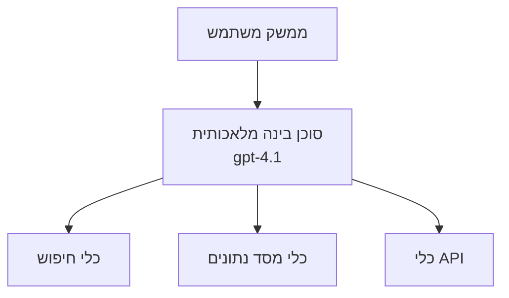
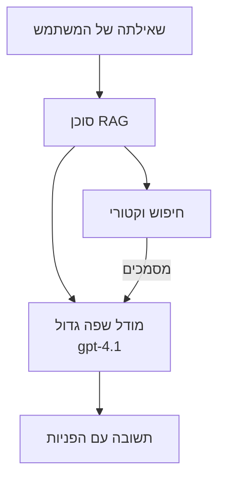
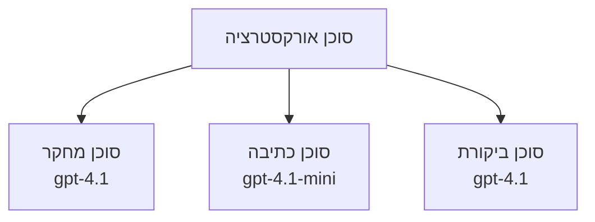

# סוכני בינה מלאכותית עם Azure Developer CLI

**ניווט בפרקים:**
- **📚 דף הקורס הראשי**: [AZD למתחילים](../../README.md)
- **📖 הפרק הנוכחי**: פרק 2 - פיתוח מובנה AI
- **⬅️ הקודם**: [שילוב Microsoft Foundry](microsoft-foundry-integration.md)
- **➡️ הבא**: [פריסת מודל AI](ai-model-deployment.md)
- **🚀 מתקדם**: [פתרונות רב-סוכניים](../../examples/retail-scenario.md)

---

## מבוא

סוכני AI הם תוכניות אוטונומיות היכולות לתפוס את סביבתן, לקבל החלטות ולנקוט פעולות כדי להשיג מטרות ספציפיות. בניגוד לצ'אטבוטים פשוטים המגיבים להנחיות, סוכנים יכולים:

- **להשתמש בכלים** - לקרוא ל-APIs, לחפש במסדי נתונים, להריץ קוד
- **לתכנן ולהתווכח** - לפרק משימות מורכבות לשלבים
- **ללמוד מההקשר** - לשמור זיכרון ולהתאים התנהגות
- **לשתף פעולה** - לעבוד עם סוכנים אחרים (מערכות רב-סוכניים)

מדריך זה מציג כיצד לפרוס סוכני AI ל-Azure באמצעות Azure Developer CLI (azd).

> **הערת אימות (25-03-2026):** מדריך זה נבדק מול `azd` `1.23.12` ו-`azure.ai.agents` `0.1.18-preview`. חווית `azd ai` נמצאת עדיין במצב תצוגה מוקדמת, לכן בדקו עזרה מתוסף אם דגלי ההתקנה שלכם שונים.

## מטרות הלמידה

בסיום מדריך זה, תוכל:
- להבין מה הם סוכני AI ואיך הם שונים מצ'אטבוטים
- לפרוס תבניות סוכני AI מוכנות מראש עם AZD
- להגדיר סוכני Foundry לסוכנים מותאמים אישית
- ליישם דפוסי סוכן בסיסיים (שימוש בכלים, RAG, רב-סוכני)
- לנטר ולפתור תקלות בסוכנים שפורסמו

## תוצאות למידה

לאחר ההשלמה, תוכל:
- לפרוס אפליקציות סוכני AI ל-Azure באמצעות פקודה אחת
- להגדיר כלים ויכולות של סוכנים
- ליישם יצירה מוגברת על-ידי שליפה (RAG) עם סוכנים
- לתכנן ארכיטקטורות רב-סוכניות עבור תהליכים מורכבים
- לפתור בעיות נפוצות בפריסת סוכנים

---

## 🤖 מה מייחד סוכן מצ'אטבוט?

| תכונה | צ'אטבוט | סוכן AI |
|-------|----------|----------|
| **התנהגות** | מגיב להנחיות | נוקט פעולות אוטונומיות |
| **כלים** | אין | יכול לקרוא ל-APIs, לחפש, להריץ קוד |
| **זיכרון** | מבוסס מושב בלבד | זיכרון מתמשך בין מושבים |
| **תכנון** | תגובה יחידה | סיכון רב-שלבי |
| **שיתוף פעולה** | יישות יחידה | יכול לעבוד עם סוכנים אחרים |

### אנלוגיה פשוטה

- **צ'אטבוט** = אדם עוזר שעונה על שאלות בדלפק מידע
- **סוכן AI** = עוזר אישי שמטפל בשיחות טלפון, מקבע פגישות, ומשלים משימות עבורך

---

## 🚀 התחלה מהירה: פרוס את הסוכן הראשון שלך

### אפשרות 1: תבנית סוכני Foundry (מומלץ)

```bash
# אתחול תבנית הסוכני בינה מלאכותית
azd init --template get-started-with-ai-agents

# פריסה ל-Azure
azd up
```

**מה מפורסם:**
- ✅ סוכני Foundry
- ✅ דגמים של Microsoft Foundry (gpt-4.1)
- ✅ Azure AI Search (ל-RAG)
- ✅ Azure Container Apps (ממשק ווב)
- ✅ Application Insights (ניטור)

**זמן:** ~15-20 דקות  
**עלות:** ~100-150$ לחודש (פיתוח)

### אפשרות 2: סוכן OpenAI עם Prompty

```bash
# אתחל את תבנית הסוכן מבוסס Prompty
azd init --template agent-openai-python-prompty

# פרוס ל-Azure
azd up
```

**מה מפורסם:**
- ✅ Azure Functions (הרצת סוכן ללא שרת)
- ✅ דגמים של Microsoft Foundry
- ✅ קבצי קונפיגורציה של Prompty
- ✅ מימוש דוגמה לסוכן

**זמן:** ~10-15 דקות  
**עלות:** ~50-100$ לחודש (פיתוח)

### אפשרות 3: סוכן RAG בצ'אט

```bash
# אתחול תבנית שיחת RAG
azd init --template azure-search-openai-demo

# פריסה ל-Azure
azd up
```

**מה מפורסם:**
- ✅ דגמים של Microsoft Foundry
- ✅ Azure AI Search עם דוגמת נתונים
- ✅ צינור עיבוד מסמכים
- ✅ ממשק צ'אט עם הפניות

**זמן:** ~15-25 דקות  
**עלות:** ~80-150$ לחודש (פיתוח)

### אפשרות 4: AZD AI Agent Init (תצוגה מוקדמת מבוססת מניפסט או תבנית)

אם יש לך קובץ מניפסט של סוכן, תוכל להשתמש בפקודת `azd ai` כדי לסקרף ישירות פרויקט שירות סוכן Foundry. גם גרסאות תצוגה מוקדמת חדשות הוסיפו תמיכה באתחול מבוסס תבניות, כך שזרימת ההנחיות המדויקת עשויה להשתנות מעט בהתאם לגרסת התוסף שהותקנה.

```bash
# התקן את התוספת של סוכני ה-AI
azd extension install azure.ai.agents

# אפשרי: אמת את גרסת התצוגה המקדימה שהותקנה
azd extension show azure.ai.agents

# אתחל מתוך רשימת סוכנים
azd ai agent init -m agent-manifest.yaml

# פרוס ל-Azure
azd up
```

**מתי להשתמש ב-`azd ai agent init` לעומת `azd init --template`:**

| גישה | מתאים ל- | איך זה עובד |
|-------|----------|-------------|
| `azd init --template` | התחלה מדוגמת עבודה | משכפל מאגר תבנית מלא עם קוד + תשתית |
| `azd ai agent init -m` | בנייה ממניפסט סוכן משלך | יוצרת מבנה פרויקט מהגדרת הסוכן שלך |

> **טיפ:** השתמש ב-`azd init --template` בלמידה (אפשרויות 1-3 למעלה). השתמש ב-`azd ai agent init` בעת בניית סוכנים לפרודקשן עם מניפסטים משלך. ראו [פקודות AZD AI CLI](../chapter-08-production/production-ai-practices.md#azd-ai-cli-commands-and-extensions) לעיון מלא.

---

## 🏗️ דפוסי ארכיטקטורת סוכן

### דפוס 1: סוכן יחיד עם כלים

הדפוס הפשוט ביותר - סוכן אחד היכול להשתמש בכלים מרובים.


**מתאים ל-:**
- בוטי שירות לקוחות
- עוזרי מחקר
- סוכני ניתוח נתונים

**תבנית AZD:** `azure-search-openai-demo`

### דפוס 2: סוכן RAG (יצירה מוגברת על ידי שליפה)

סוכן שמחזיר מסמכים רלוונטיים לפני יצירת תגובות.


**מתאים ל-:**
- מאגרי ידע של ארגונים
- מערכות Q&A למסמכים
- מחקר ציות ומשפטי

**תבנית AZD:** `azure-search-openai-demo`

### דפוס 3: מערכת רב-סוכנית

מספר סוכנים מתמחים העובדים יחד על משימות מורכבות.


**מתאים ל-:**
- יצירת תוכן מורכב
- תהליכים רב-שלביים
- משימות הדורשות מומחיות שונה

**למידע נוסף:** [דפוסי תיאום רב-סוכניים](../chapter-06-pre-deployment/coordination-patterns.md)

---

## ⚙️ הגדרת כלים לסוכן

סוכנים נעשים רבי עוצמה כשהם משתמשים בכלים. להלן כיצד להגדיר כלים נפוצים:

### הגדרת כלים בסוכני Foundry

```python
# agent_config.py
from azure.ai.projects import AIProjectClient
from azure.ai.projects.models import FunctionTool, CodeInterpreterTool

# הגדר כלים מותאמים אישית
search_tool = FunctionTool(
    name="search_knowledge_base",
    description="Search the company knowledge base for relevant documents",
    parameters={
        "type": "object",
        "properties": {
            "query": {
                "type": "string",
                "description": "The search query"
            }
        },
        "required": ["query"]
    }
)

# צור סוכן עם כלים
agent = project_client.agents.create_agent(
    model="gpt-4.1",
    name="Support Agent",
    instructions="You are a helpful support agent. Use the search tool to find relevant information.",
    tools=[search_tool, CodeInterpreterTool()]
)
```

### הגדרת סביבה

```bash
# הגדר משתני סביבה ספציפיים לסוכן
azd env set AZURE_OPENAI_MODEL "gpt-4.1"
azd env set AGENT_INSTRUCTIONS "You are a helpful assistant..."
azd env set ENABLE_CODE_INTERPRETER "true"
azd env set ENABLE_FILE_SEARCH "true"

# פרוס עם קונפיגורציה מעודכנת
azd deploy
```

---

## 📊 ניטור סוכנים

### אינטגרציה עם Application Insights

כל תבניות AZD לסוכנים כוללות Application Insights לניטור:

```bash
# פתחו לוח בקרה לניטור
azd monitor --overview

# צפו ברישומים חיים
azd monitor --logs

# צפו במטריקות בזמן אמת
azd monitor --live
```

### מדדים מרכזיים למעקב

| מדד | תיאור | יעד |
|-------|---------|--------|
| זמן תגובה | זמן ליצירת תגובה | < 5 שניות |
| שימוש בטוקנים | טוקנים לכל בקשה | מעקב עלות |
| אחוז הצלחה בפעולות בכלים | % הצלחה בהרצת כלים | > 95% |
| שיעור שגיאות | בקשות סוכן שנכשלו | < 1% |
| שביעות רצון משתמש | ציוני משוב | > 4.0/5.0 |

### יומן מותאם אישית לסוכנים

```python
import os
from azure.monitor.opentelemetry import configure_azure_monitor
from opentelemetry import trace

# הגדר את Azure Monitor עם OpenTelemetry
configure_azure_monitor(
    connection_string=os.environ["APPLICATIONINSIGHTS_CONNECTION_STRING"]
)

tracer = trace.get_tracer(__name__)

def log_agent_interaction(user_query, agent_response, tools_used, latency_ms):
    with tracer.start_as_current_span("agent_interaction") as span:
        span.set_attributes({
            "user_query": user_query,
            "response_length": len(agent_response),
            "tools_used": tools_used,
            "latency_ms": latency_ms
        })
```

> **הערה:** התקן את החבילות הנדרשות: `pip install azure-monitor-opentelemetry opentelemetry`

---

## 💰 שיקולי עלות

### עלויות חודשיות משוערות לפי דפוס

| דפוס | סביבת פיתוח | פרודקשן |
|-------|--------------|-----------|
| סוכן יחיד | $50-100 | $200-500 |
| סוכן RAG | $80-150 | $300-800 |
| רב-סוכני (2-3 סוכנים) | $150-300 | $500-1,500 |
| רב-סוכני ארגוני | $300-500 | $1,500-5,000+ |

### טיפים לאופטימיזציית עלויות

1. **השתמש ב-gpt-4.1-mini למשימות פשוטות**
   ```bash
   azd env set AZURE_OPENAI_MODEL "gpt-4.1-mini"
   ```

2. **יישם שמירת מטמון לשאילתות חוזרות**
   ```python
   from functools import lru_cache
   
   @lru_cache(maxsize=1000)
   def get_cached_response(query_hash):
       return agent.run(query_hash)
   ```

3. **הגבל גבולות טוקנים להרצה**
   ```python
   # הגדר max_completion_tokens בעת הרצת הסוכן, לא במהלך יצירתו
   run = project_client.agents.create_run(
       thread_id=thread.id,
       agent_id=agent.id,
       max_completion_tokens=1000  # הגבל את אורך התגובה
   )
   ```

4. **הרחב לאפס כשאינו בשימוש**
   ```bash
   # אפליקציות מכולה מתכווננות אוטומטית לאפס
   azd env set MIN_REPLICAS "0"
   ```

---

## 🔧 פתרון בעיות בסוכנים

### בעיות נפוצות ופתרונות

<details>
<summary><strong>❌ הסוכן לא מגיב לקריאות כלים</strong></summary>

```bash
# בדוק אם הכלים רשומים כראוי
azd show

# אמת את פריסת OpenAI
az cognitiveservices account deployment list \
  --name $AZURE_OPENAI_NAME \
  --resource-group $RG_NAME

# בדוק יומני סוכן
azd monitor --logs
```

**גורמים נפוצים:**
- חוסר התאמה בסיגנatura של פונקציית הכלי
- הרשאות חסרות
- נקודת קצה של API לא נגישה
</details>

<details>
<summary><strong>❌ זמני תגובה גבוהים בסוכן</strong></summary>

```bash
# בדוק את Application Insights עבור צווארי בקבוק
azd monitor --live

# שקול להשתמש בדגם מהיר יותר
azd env set AZURE_OPENAI_MODEL "gpt-4.1-mini"
azd deploy
```

**טיפים לאופטימיזציה:**
- השתמש בתגובות בזרימה (streaming)
- יישם שמירת מטמון לתגובות
- הקטן את גודל חלון ההקשר
</details>

<details>
<summary><strong>❌ הסוכן מחזיר מידע שגוי או ממציא</strong></summary>

```python
# שפר עם הנחיות מערכת טובות יותר
instructions = """
You are a helpful assistant. IMPORTANT:
- Only answer based on provided context
- If you don't know, say "I don't know"
- Always cite your sources
- Never make up information
"""

# הוסף אחזור להארקה
agent = project_client.agents.create_agent(
    model="gpt-4.1",
    instructions=instructions,
    tools=[FileSearchTool()]  # הארך תגובות במסמכים
)
```
</details>

<details>
<summary><strong>❌ שגיאות עקב חריגות מגבלת טוקנים</strong></summary>

```python
# יישום ניהול חלון הקשר
def truncate_context(messages, max_tokens=8000, model="gpt-4.1"):
    """Keep only recent messages within token limit."""
    import tiktoken
    encoding = tiktoken.encoding_for_model(model)
    total_tokens = 0
    truncated = []
    
    for msg in reversed(messages):
        msg_tokens = len(encoding.encode(msg.content))
        if total_tokens + msg_tokens > max_tokens:
            break
        truncated.insert(0, msg)
        total_tokens += msg_tokens
    
    return truncated
```
</details>

---

## 🎓 תרגילים מעשיים

### תרגיל 1: פרוס סוכן בסיסי (20 דקות)

**מטרה:** לפרוס את סוכן ה-AI הראשון שלך באמצעות AZD

```bash
# שלב 1: אתחול התבנית
azd init --template get-started-with-ai-agents

# שלב 2: התחברות ל-Azure
azd auth login
# אם אתה עובד בין שוכרים, הוסף --tenant-id <tenant-id>

# שלב 3: פריסה
azd up

# שלב 4: בדוק את הסוכן
# פלט צפוי לאחר הפריסה:
#   הפריסה הושלמה!
#   נקודת קצה: https://<app-name>.<region>.azurecontainerapps.io
# פתח את כתובת ה-URL המופיעה בפלט ונסה לשאול שאלה

# שלב 5: הצג ניטור
azd monitor --overview

# שלב 6: ניקוי סביבה
azd down --force --purge
```

**קריטריונים להצלחה:**
- [ ] הסוכן מגיב לשאלות
- [ ] ניתן לגשת ללוח הבקרה לניטור דרך `azd monitor`
- [ ] משאבים מנוקו בהצלחה

### תרגיל 2: הוסף כלי מותאם (30 דקות)

**מטרה:** הרחב סוכן עם כלי מותאם אישית

1. פרוס את תבנית הסוכן:
   ```bash
   azd init --template get-started-with-ai-agents
   azd up
   ```
2. צור פונקציה לכלי חדש בקוד הסוכן שלך:
   ```python
   def get_weather(location: str) -> str:
       """Get current weather for a location."""
       # קריאת API לשירות מזג האוויר
       return f"Weather in {location}: Sunny, 72°F"
   ```
3. רשם את הכלי בסוכן:
   ```python
   from azure.ai.projects.models import FunctionTool

   weather_tool = FunctionTool(
       name="get_weather",
       description="Get current weather for a location",
       parameters={
           "type": "object",
           "properties": {
               "location": {"type": "string", "description": "City name"}
           },
           "required": ["location"]
       }
   )

   agent = project_client.agents.create_agent(
       model="gpt-4.1",
       name="Weather Agent",
       tools=[weather_tool]
   )
   ```
4. פרוס מחדש ובדוק:
   ```bash
   azd deploy
   # שאל: "מה מזג האוויר בסיאטל?"
   # צפוי: הסוכן קורא ל-get_weather("Seattle") ומחזיר מידע על מזג האוויר
   ```

**קריטריונים להצלחה:**
- [ ] הסוכן מזהה שאילתות הקשורות למזג אוויר
- [ ] כלי מופעל נכון
- [ ] תגובה כוללת מידע על מזג האוויר

### תרגיל 3: בנה סוכן RAG (45 דקות)

**מטרה:** צור סוכן שעונה על שאלות מתוך מסמכים שלך

```bash
# שלב 1: פרוס תבנית RAG
azd init --template azure-search-openai-demo
azd up

# שלב 2: העלה את המסמכים שלך
# מקם קבצי PDF/TXT בתיקיית data/ ואז הרץ:
python scripts/prepdocs.py

# שלב 3: בדוק עם שאלות ספציפיות לתחום
# פתח את כתובת ה-URL של אפליקציית האינטרנט מתוך הפלט של azd up
# שאל שאלות על המסמכים שהעלית
# התגובות אמורות לכלול הפניות ציטוט כמו [doc.pdf]
```

**קריטריונים להצלחה:**
- [ ] הסוכן עונה מהמסמכים שהועלו
- [ ] תגובות כוללות הפניות
- [ ] אין המצאות בשאלות מחוץ להיקף

---

## 📚 צעדים הבאים

כעת, כשאתה מבין את סוכני ה-AI, חקור נושאים מתקדמים אלה:

| נושא | תיאור | קישור |
|-------|---------|--------|
| **מערכות רב-סוכניות** | בניית מערכות עם סוכנים משתפים פעולה | [דוגמה רב-סוכנית בקמעונאות](../../examples/retail-scenario.md) |
| **דפוסי תיאום** | למד דפוסי תזמור ותקשורת | [דפוסי תיאום](../chapter-06-pre-deployment/coordination-patterns.md) |
| **פריסת פרודקשן** | פריסת סוכנים מוכנים לייצור בארגון | [שיטות AI בפרודקשן](../chapter-08-production/production-ai-practices.md) |
| **הערכת סוכנים** | בדוק והעריך ביצועי סוכן | [פתרון בעיות AI](../chapter-07-troubleshooting/ai-troubleshooting.md) |
| **מעבדת סדנת AI** | עבודה מעשית: הפוך את פתרון ה-AI שלך למוכן AZD | [מעבדת סדנת AI](ai-workshop-lab.md) |

---

## 📖 משאבים נוספים

### תיעוד רשמי
- [שירות סוכני Azure AI](https://learn.microsoft.com/azure/ai-services/agents/)
- [מדריך מהיר לשירות סוכני Azure AI Foundry](https://learn.microsoft.com/azure/ai-services/agents/quickstart)
- [מסגרת סוכני Semantic Kernel](https://learn.microsoft.com/semantic-kernel/)

### תבניות AZD לסוכנים
- [התחל עם סוכני AI](https://github.com/Azure-Samples/get-started-with-ai-agents)
- [Agent OpenAI Python Prompty](https://github.com/Azure-Samples/agent-openai-python-prompty)
- [Azure Search OpenAI Demo](https://github.com/Azure-Samples/azure-search-openai-demo)

### משאבים קהילתיים
- [Awesome AZD - תבניות סוכנים](https://azure.github.io/awesome-azd/?tags=ai-agents)
- [Azure AI Discord](https://discord.gg/microsoft-azure)
- [Microsoft Foundry Discord](https://discord.gg/nTYy5BXMWG)

### כישורי סוכן לעורך שלך
- [**כישורי סוכן Microsoft Azure**](https://skills.sh/microsoft/github-copilot-for-azure) - התקן כישורי סוכן AI ברי שימוש חוזר לפיתוח ב-Azure ב-GitHub Copilot, Cursor, או כל סוכן נתמך אחר. כולל כישורי [Azure AI](https://skills.sh/microsoft/github-copilot-for-azure/azure-ai), [Microsoft Foundry](https://skills.sh/microsoft/github-copilot-for-azure/microsoft-foundry), [פריסה](https://skills.sh/microsoft/github-copilot-for-azure/azure-deploy) ו-[אבחון](https://skills.sh/microsoft/github-copilot-for-azure/azure-diagnostics):
  ```bash
  npx skills add microsoft/github-copilot-for-azure
  ```

---

**ניווט**
- **שיעור קודם**: [שילוב Microsoft Foundry](microsoft-foundry-integration.md)
- **שיעור הבא**: [פריסת מודל AI](ai-model-deployment.md)

---

<!-- CO-OP TRANSLATOR DISCLAIMER START -->
**אזהרה**:  
המסמך הזה תורגם באמצעות שירות תרגום מבוסס בינה מלאכותית [Co-op Translator](https://github.com/Azure/co-op-translator). למרות שאנו שואפים לדיוק, יש להיות מודעים לכך שתכנים מתורגמים אוטומטית עשויים להכיל שגיאות או אי-דיוקים. המסמך המקורי בשפתו ההורית צריך להיחשב כמקור המוסמך. למידע קריטי, מומלץ להשתמש בתרגום מקצועי שנעשה על ידי בני אדם. איננו אחראים על אי-הבנות או פירושים שגויים הנובעים משימוש בתרגום זה.
<!-- CO-OP TRANSLATOR DISCLAIMER END -->