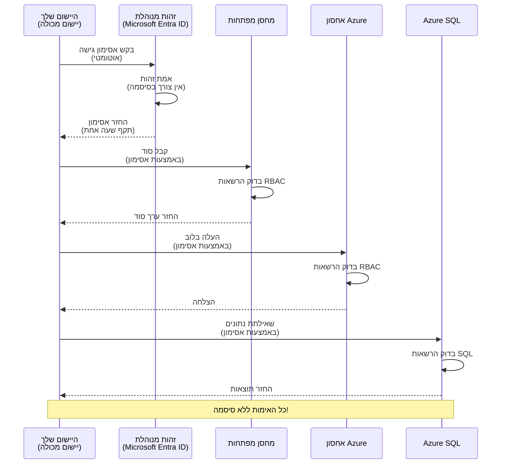
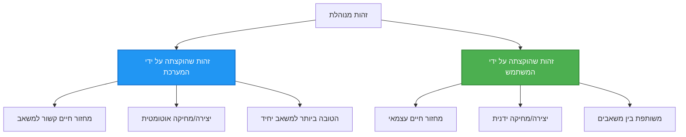

# דפוסי אימות וזהות מנוהלת

⏱️ **זמן משוער**: 45-60 דקות | 💰 **השפעה על עלות**: חינם (ללא חיובים נוספים) | ⭐ **מורכבות**: בינוני

**📚 מסלול לימוד:**
- ← קודם: [ניהול תצורה](configuration.md) - ניהול משתני סביבה וסודות
- 🎯 **אתה כאן**: אימות ואבטחה (זהות מנוהלת, Key Vault, דפוסים מאובטחים)
- → הבא: [הפרויקט הראשון](first-project.md) - בנה את אפליקציית AZD הראשונה שלך
- 🏠 [דף הבית של הקורס](../../README.md)

---

## מה תלמד

בסיום שיעור זה, תלמד:
- להבין דפוסי אימות ב-Azure (מפתחות, מחרוזות חיבור, זהות מנוהלת)
- ליישם **זהות מנוהלת** לאימות ללא סיסמה
- לאבטח סודות עם אינטגרציית **Azure Key Vault**
- לקנפג **בקרת גישה מבוססת תפקידים (RBAC)** לפריסות AZD
- ליישם שיטות אבטחה טובות ב-Container Apps ובשירותי Azure
- להמיר מאימות מבוסס מפתח לאימות מבוסס זהות

## למה זהות מנוהלת חשובה

### הבעיה: אימות מסורתי

**לפני זהות מנוהלת:**
```javascript
// ❌ סיכון אבטחה: סודות מוצפנים בקוד
const connectionString = "Server=mydb.database.windows.net;User=admin;Password=P@ssw0rd123";
const storageKey = "xK7mN9pQ2wR5tY8uI0oP3aS6dF1gH4jK...";
const cosmosKey = "C2x7B9n4M1p8Q5w3E6r0T2y5U8i1O4p7...";
```

**בעיות:**
- 🔴 **סודות חשופים** בקוד, בקבצי תצורה, במשתני סביבה
- 🔴 **סיבוב אישורים** דורש שינויים בקוד ופריסה מחדש
- 🔴 **סיוטי ביקורת** - מי ניגש למה ומתי?
- 🔴 **פריסה נרחבת** - סודות מפוזרים במערכות רבות
- 🔴 **סיכוני תאימות** - כשל בבדיקות אבטחה

### הפתרון: זהות מנוהלת

**אחרי זהות מנוהלת:**
```javascript
// ✅ מאובטח: אין סודות בקוד
const credential = new DefaultAzureCredential();
const client = new BlobServiceClient(
  "https://mystorageaccount.blob.core.windows.net",
  credential  // Azure מטפל באימות באופן אוטומטי
);
```

**יתרונות:**
- ✅ **אפס סודות** בקוד או בתצורה
- ✅ **סיבוב אוטומטי** - Azure מנהל זאת
- ✅ **רישום ביקורת מלא** ביומני Microsoft Entra ID
- ✅ **אבטחה מרוכזת** - ניהול בפורטל Azure
- ✅ **מוכן לתאימות** - עומד בסטנדרטים לאבטחה

**אנלוגיה**: אימות מסורתי הוא כמו לשאת מפתחות פיזיים רבים לדלתות שונות. זהות מנוהלת היא כמו תג אבטחה שמעניק גישה אוטומטית בהתאם למי שאתה—אין מפתחות לאבד, להעתיק או לסובב.

---

## סקירת ארכיטקטורה

### זרימת אימות עם זהות מנוהלת



### סוגי זהויות מנוהלות



| תכונה | מוקצה ע"י מערכת | מוקצה ע"י משתמש |
|---------|----------------|---------------|
| **מחזור חיים** | קשור למשאב | עצמאי |
| **יצירה** | אוטומטית עם המשאב | יצירה ידנית |
| **מחיקה** | נמחק עם המשאב | שומר לאחר מחיקת המשאב |
| **שיתוף** | משאב אחד בלבד | משותף למספר משאבים |
| **מקרה שימוש** | תסריטים פשוטים | תסריטים מורכבים עם מספר משאבים |
| **ברירת מחדל AZD** | ✅ מומלץ | אופציונלי |

---

## דרישות מוקדמות

### כלים דרושים

כבר עליך להיות מותקן את הכלים מהשיעורים הקודמים:

```bash
# אמת את Azure Developer CLI
azd version
# ✅ צפוי: גרסה 1.0.0 או גבוהה יותר של azd

# אמת את Azure CLI
az --version
# ✅ צפוי: גרסה 2.50.0 או גבוהה יותר של azure-cli
```

### דרישות Azure

- מנוי Azure פעיל
- הרשאות ל:
  - יצירת זהויות מנוהלות
  - הקצאת תפקידי RBAC
  - יצירת משאבי Key Vault
  - פריסת Container Apps

### דרישות ידע

כבר השלמת:
- [מדריך התקנה](installation.md) - הגדרת AZD
- [יסודות AZD](azd-basics.md) - מושגים בסיסיים
- [ניהול תצורה](configuration.md) - משתני סביבה

---

## שיעור 1: הבנת דפוסי אימות

### דפוס 1: מחרוזות חיבור (ישן - להמנע)

**איך זה עובד:**
```bash
# מחרוזת החיבור מכילה אישורים
STORAGE_CONNECTION_STRING="DefaultEndpointsProtocol=https;AccountName=myaccount;AccountKey=xK7mN9pQ2wR5..."
COSMOS_CONNECTION_STRING="AccountEndpoint=https://myaccount.documents.azure.com:443/;AccountKey=C2x7..."
SQL_CONNECTION_STRING="Server=myserver.database.windows.net;User=admin;Password=P@ssw0rd..."
```

**בעיות:**
- ❌ סודות גלויים במשתני סביבה
- ❌ מתועדים במערכות פריסה
- ❌ קשה לסובב אותם
- ❌ אין עקבות גישה

**מתי להשתמש:** רק לפיתוח מקומי, לא בייצור.

---

### דפוס 2: הפניות ל-Key Vault (טוב יותר)

**איך זה עובד:**
```bicep
// Store secret in Key Vault
resource keyVault 'Microsoft.KeyVault/vaults@2023-02-01' = {
  name: 'mykv'
  properties: {
    enableRbacAuthorization: true
  }
}

// Reference in Container App
env: [
  {
    name: 'STORAGE_KEY'
    secretRef: 'storage-key'  // References Key Vault
  }
]
```

**יתרונות:**
- ✅ סודות מאוחסנים בצורה מאובטחת ב-Key Vault
- ✅ ניהול סודות מרכזי
- ✅ סיבוב ללא שינוי בקוד

**מגבלות:**
- ⚠️ עדיין משתמשים במפתחות/סיסמאות
- ⚠️ צריך לנהל גישת Key Vault

**מתי להשתמש:** שלב מעבר ממחרוזות חיבור לזהות מנוהלת.

---

### דפוס 3: זהות מנוהלת (השיטה הטובה ביותר)

**איך זה עובד:**
```bicep
// Enable managed identity
resource containerApp 'Microsoft.App/containerApps@2023-05-01' = {
  name: 'myapp'
  identity: {
    type: 'SystemAssigned'  // Automatically creates identity
  }
}

// Grant permissions
resource roleAssignment 'Microsoft.Authorization/roleAssignments@2022-04-01' = {
  scope: storageAccount
  properties: {
    roleDefinitionId: storageBlobDataContributorRole
    principalId: containerApp.identity.principalId
  }
}
```

**קוד אפליקציה:**
```javascript
// אין צורך בסודות!
const { DefaultAzureCredential } = require('@azure/identity');
const { BlobServiceClient } = require('@azure/storage-blob');

const credential = new DefaultAzureCredential();
const blobServiceClient = new BlobServiceClient(
  'https://mystorageaccount.blob.core.windows.net',
  credential
);
```

**יתרונות:**
- ✅ אפס סודות בקוד/תצורה
- ✅ סיבוב אישורים אוטומטי
- ✅ רישום ביקורת מלא
- ✅ הרשאות מבוססות RBAC
- ✅ מוכן לתאימות

**מתי להשתמש:** תמיד, עבור אפליקציות בייצור.

---

### דפוס 4: עיקרי שירות (CI/CD ואוטומציה)

זהות מנוהלת היא הסטנדרט הזהב *למשאבים שרצים בתוך Azure*. אבל מה לגבי דברים שרצים **מחוץ** ל-Azure — כמו צינור CI/CD על סוכן בנייה, או סקריפט במחשב הנייד שלך שאי אפשר להשתמש בו בהתחברות אינטראקטיבית? כאן נכנסת לתמונה **עיקר שירות**: זהות לא אנושית עם אישורים משלה שהמערכת האוטומטית יכולה להתחבר איתה.

**איך זה עובד:**

צור עיקר שירות המוגבל לקבוצת משאבים (הרשאות מינימום):

```bash
az ad sp create-for-rbac \
  --name "myapp-cicd" \
  --role contributor \
  --scopes /subscriptions/<sub-id>/resourceGroups/<rg-name>
```

זה מדפיס Client ID, Client Secret ו-Tenant ID. azd יכול להתחבר איתם ללא אינטראקציה:

```bash
azd auth login \
  --client-id "<appId>" \
  --client-secret "<password>" \
  --tenant-id "<tenant>"
```

**עדיפות לאישורים פדרטיביים (OIDC) על פני סודות.** במקום סוד לקוח ארוך טווח, קונפיגור אישור פדרטיבי כך שהצינור יחליף אסימון קצר מועד—בלי סוד לדליפה או סיבוב:

```bash
azd auth login \
  --client-id "<appId>" \
  --federated-credential-provider "github" \
  --tenant-id "<tenant>"
```

> `azd pipeline config` מגדיר זאת עבורך אוטומטית. ראה מדריכי CI/CD ב-[פרק 8](../chapter-08-production/production-ai-practices.md).

**יתרונות:**
- ✅ עובד מחוץ ל-Azure (סוכני בנייה, סביבות פנימיות, עננים אחרים)
- ✅ ניתן להגביל אותו לקבוצת משאבים בודדת עם תפקיד אחד
- ✅ הגרסה הפדרטיבית (OIDC) אינה משתמשת בסוד מאוחסן

**חסרונות:**
- ⚠️ הגרסה המבוססת סוד דורשת אחסון וסיבוב זהירים
- ⚠️ סוד שנחשף מעניק את כל ההרשאות של עיקר השירות—שמור על הגבלות קפדניות

**מתי להשתמש:** צינורות CI/CD ואוטומציה שאינם יכולים להשתמש בזהות מנוהלת. העדף תמיד את הגרסה הפדרטיבית/OIDC על פני סוד לקוח, והעדף זהות מנוהלת כשעומס העבודה רץ בתוך Azure.

**אחסון בטוח של אישורים:**
- לעולם אל תיעד סודות—השתמש באחסון הסודות של הצינור שלך (GitHub Actions secrets, קבוצות משתנים ב-Azure DevOps / Key Vault).
- הגב את עיקר השירות לתפקיד וקבוצת משאבים הקטנים ביותר הנדרשים.
- הגדר תוקף וסובב, או ביטל את הסוד לחלוטין עם OIDC.

---

## שיעור 2: יישום זהות מנוהלת עם AZD

### יישום שלב אחר שלב

בואו נבנה Container App מאובטח שמשתמש בזהות מנוהלת לגישה ל-Azure Storage ול-Key Vault.

### מבנה הפרויקט

```
secure-app/
├── azure.yaml                 # AZD configuration
├── infra/
│   ├── main.bicep            # Main infrastructure
│   ├── core/
│   │   ├── identity.bicep    # Managed identity setup
│   │   ├── keyvault.bicep    # Key Vault configuration
│   │   └── storage.bicep     # Storage with RBAC
│   └── app/
│       └── container-app.bicep
└── src/
    ├── app.js                # Application code
    ├── package.json
    └── Dockerfile
```

### 1. קונפיגורציית AZD (azure.yaml)

```yaml
name: secure-app
metadata:
  template: secure-app@1.0.0

services:
  api:
    project: ./src
    language: js
    host: containerapp

# Enable managed identity (AZD handles this automatically)
```

### 2. תשתית: הפעלת זהות מנוהלת

**קובץ: `infra/main.bicep`**

```bicep
targetScope = 'subscription'

param environmentName string
param location string = 'eastus'

var tags = { 'azd-env-name': environmentName }

// Resource group
resource rg 'Microsoft.Resources/resourceGroups@2021-04-01' = {
  name: 'rg-${environmentName}'
  location: location
  tags: tags
}

// Storage Account
module storage './core/storage.bicep' = {
  name: 'storage'
  scope: rg
  params: {
    name: 'st${uniqueString(rg.id)}'
    location: location
    tags: tags
  }
}

// Key Vault
module keyVault './core/keyvault.bicep' = {
  name: 'keyvault'
  scope: rg
  params: {
    name: 'kv-${uniqueString(rg.id)}'
    location: location
    tags: tags
  }
}

// Container App with Managed Identity
module containerApp './app/container-app.bicep' = {
  name: 'container-app'
  scope: rg
  params: {
    name: 'ca-${environmentName}'
    location: location
    tags: tags
    storageAccountName: storage.outputs.name
    keyVaultName: keyVault.outputs.name
  }
}

// Grant Container App access to Storage
module storageRoleAssignment './core/role-assignment.bicep' = {
  name: 'storage-role'
  scope: rg
  params: {
    principalId: containerApp.outputs.identityPrincipalId
    roleDefinitionId: 'ba92f5b4-2d11-453d-a403-e96b0029c9fe'  // Storage Blob Data Contributor
    targetResourceId: storage.outputs.id
  }
}

// Grant Container App access to Key Vault
module kvRoleAssignment './core/role-assignment.bicep' = {
  name: 'kv-role'
  scope: rg
  params: {
    principalId: containerApp.outputs.identityPrincipalId
    roleDefinitionId: '4633458b-17de-408a-b874-0445c86b69e6'  // Key Vault Secrets User
    targetResourceId: keyVault.outputs.id
  }
}

// Outputs
output AZURE_STORAGE_ACCOUNT_NAME string = storage.outputs.name
output AZURE_KEY_VAULT_NAME string = keyVault.outputs.name
output APP_URL string = containerApp.outputs.url
```

### 3. Container App עם זהות מוקצת ע"י מערכת

**קובץ: `infra/app/container-app.bicep`**

```bicep
param name string
param location string
param tags object = {}
param storageAccountName string
param keyVaultName string

resource containerApp 'Microsoft.App/containerApps@2023-05-01' = {
  name: name
  location: location
  tags: tags
  identity: {
    type: 'SystemAssigned'  // 🔑 Enable managed identity
  }
  properties: {
    configuration: {
      ingress: {
        external: true
        targetPort: 3000
      }
    }
    template: {
      containers: [
        {
          name: 'api'
          image: 'myregistry.azurecr.io/api:latest'
          resources: {
            cpu: json('0.5')
            memory: '1Gi'
          }
          env: [
            {
              name: 'AZURE_STORAGE_ACCOUNT_NAME'
              value: storageAccountName
            }
            {
              name: 'AZURE_KEY_VAULT_NAME'
              value: keyVaultName
            }
            // 🔑 No secrets - managed identity handles authentication!
          ]
        }
      ]
    }
  }
}

// Output the identity for RBAC assignments
output identityPrincipalId string = containerApp.identity.principalId
output id string = containerApp.id
output url string = 'https://${containerApp.properties.configuration.ingress.fqdn}'
```

### 4. מודול הקצאת תפקיד RBAC

**קובץ: `infra/core/role-assignment.bicep`**

```bicep
param principalId string
param roleDefinitionId string  // Azure built-in role ID
param targetResourceId string

resource roleAssignment 'Microsoft.Authorization/roleAssignments@2022-04-01' = {
  name: guid(principalId, roleDefinitionId, targetResourceId)
  scope: resourceId('Microsoft.Resources/resourceGroups', resourceGroup().name)
  properties: {
    roleDefinitionId: subscriptionResourceId('Microsoft.Authorization/roleDefinitions', roleDefinitionId)
    principalId: principalId
    principalType: 'ServicePrincipal'
  }
}

output id string = roleAssignment.id
```

### 5. קוד אפליקציה עם זהות מנוהלת

**קובץ: `src/app.js`**

```javascript
const express = require('express');
const { DefaultAzureCredential } = require('@azure/identity');
const { BlobServiceClient } = require('@azure/storage-blob');
const { SecretClient } = require('@azure/keyvault-secrets');

const app = express();
const PORT = process.env.PORT || 3000;

// 🔑 אתחול אישורי גישה (עובד אוטומטית עם זהות מנוהלת)
const credential = new DefaultAzureCredential();

// הגדרת אחסון Azure
const storageAccountName = process.env.AZURE_STORAGE_ACCOUNT_NAME;
const blobServiceClient = new BlobServiceClient(
  `https://${storageAccountName}.blob.core.windows.net`,
  credential  // אין צורך במפתחות!
);

// הגדרת מחסן מפתחות
const keyVaultName = process.env.AZURE_KEY_VAULT_NAME;
const secretClient = new SecretClient(
  `https://${keyVaultName}.vault.azure.net`,
  credential  // אין צורך במפתחות!
);

// בדיקת בריאות
app.get('/health', (req, res) => {
  res.json({ status: 'healthy', authentication: 'managed-identity' });
});

// העלאת קובץ לאחסון בבלוב
app.post('/upload', async (req, res) => {
  try {
    const containerClient = blobServiceClient.getContainerClient('uploads');
    await containerClient.createIfNotExists();
    
    const blobName = `file-${Date.now()}.txt`;
    const blockBlobClient = containerClient.getBlockBlobClient(blobName);
    
    await blockBlobClient.upload('Hello from managed identity!', 30);
    
    res.json({
      success: true,
      blobName: blobName,
      message: 'File uploaded using managed identity!'
    });
  } catch (error) {
    console.error('Upload error:', error);
    res.status(500).json({ error: error.message });
  }
});

// קבלת סוד ממחסן המפתחות
app.get('/secret/:name', async (req, res) => {
  try {
    const secretName = req.params.name;
    const secret = await secretClient.getSecret(secretName);
    
    res.json({
      name: secretName,
      value: secret.value,
      message: 'Secret retrieved using managed identity!'
    });
  } catch (error) {
    console.error('Secret error:', error);
    res.status(500).json({ error: error.message });
  }
});

// רשימת מיכלי בבלוב (מציג גישה לקריאה)
app.get('/containers', async (req, res) => {
  try {
    const containers = [];
    for await (const container of blobServiceClient.listContainers()) {
      containers.push(container.name);
    }
    
    res.json({
      containers: containers,
      count: containers.length,
      message: 'Containers listed using managed identity!'
    });
  } catch (error) {
    console.error('List error:', error);
    res.status(500).json({ error: error.message });
  }
});

app.listen(PORT, () => {
  console.log(`Secure API listening on port ${PORT}`);
  console.log('Authentication: Managed Identity (passwordless)');
});
```

**קובץ: `src/package.json`**

```json
{
  "name": "secure-app",
  "version": "1.0.0",
  "dependencies": {
    "express": "^4.18.2",
    "@azure/identity": "^4.0.0",
    "@azure/storage-blob": "^12.17.0",
    "@azure/keyvault-secrets": "^4.7.0"
  },
  "scripts": {
    "start": "node app.js"
  }
}
```

### 6. פריסה ובדיקה

```bash
# אתחול סביבה AZD
azd init

# פריסת תשתית ויישום
azd up

# קבלת כתובת ה-URL של היישום
APP_URL=$(azd env get-values | grep APP_URL | cut -d '=' -f2 | tr -d '"')

# בדיקת מצב בריאות
curl $APP_URL/health
```

**✅ פלט צפוי:**
```json
{
  "status": "healthy",
  "authentication": "managed-identity"
}
```

**בדיקת העלאת blob:**
```bash
curl -X POST $APP_URL/upload
```

**✅ פלט צפוי:**
```json
{
  "success": true,
  "blobName": "file-1700404800000.txt",
  "message": "File uploaded using managed identity!"
}
```

**בדיקת רשימת containers:**
```bash
curl $APP_URL/containers
```

**✅ פלט צפוי:**
```json
{
  "containers": ["uploads"],
  "count": 1,
  "message": "Containers listed using managed identity!"
}
```

---

## תפקידי RBAC נפוצים ב-Azure

### מזהי תפקידים מובנים לזהות מנוהלת

| שירות | שם התפקיד | מזהה התפקיד | הרשאות |
|---------|-----------|---------|-------------|
| **Storage** | Storage Blob Data Reader | `2a2b9908-6b94-4a3d-8e5a-a7d8f8cc8a12` | קריאת blobs ו-containers |
| **Storage** | Storage Blob Data Contributor | `ba92f5b4-2d11-453d-a403-e96b0029c9fe` | קריאה, כתיבה ומחיקה של blobs |
| **Storage** | Storage Queue Data Contributor | `974c5e8b-45b9-4653-ba55-5f855dd0fb88` | קריאה, כתיבה ומחיקה של הודעות תור |
| **Key Vault** | Key Vault Secrets User | `4633458b-17de-408a-b874-0445c86b69e6` | קריאת סודות |
| **Key Vault** | Key Vault Secrets Officer | `b86a8fe4-44ce-4948-aee5-eccb2c155cd7` | קריאה, כתיבה ומחיקת סודות |
| **Cosmos DB** | Cosmos DB Built-in Data Reader | `00000000-0000-0000-0000-000000000001` | קריאת נתוני Cosmos DB |
| **Cosmos DB** | Cosmos DB Built-in Data Contributor | `00000000-0000-0000-0000-000000000002` | קריאה וכתיבת נתוני Cosmos DB |
| **SQL Database** | SQL DB Contributor | `9b7fa17d-e63e-47b0-bb0a-15c516ac86ec` | ניהול מסדי נתונים SQL |
| **Service Bus** | Azure Service Bus Data Owner | `090c5cfd-751d-490a-894a-3ce6f1109419` | שליחה, קבלה וניהול הודעות |

### איך למצוא מזהי תפקידים

```bash
# רשום את כל התפקידים המובנים
az role definition list --query "[].{Name:roleName, ID:name}" --output table

# חפש תפקיד ספציפי
az role definition list --query "[?contains(roleName, 'Storage Blob')].{Name:roleName, ID:name}" --output table

# קבל פרטי תפקיד
az role definition list --name "Storage Blob Data Contributor"
```

---

## תרגילים מעשיים

### תרגיל 1: הפעלת זהות מנוהלת לאפליקציה קיימת ⭐⭐ (בינוני)

**מטרה**: הוסף זהות מנוהלת לפריסת Container App קיימת

**תסריט**: יש לך Container App שמשתמש במחרוזות חיבור. המר אותו לזהות מנוהלת.

**נקודת התחלה**: Container App עם קונפיגורציה זו:

```bicep
// ❌ Current: Using connection string
env: [
  {
    name: 'STORAGE_CONNECTION_STRING'
    secretRef: 'storage-connection'
  }
]
```

**שלבים**:

1. **הפעל זהות מנוהלת בביספ:**

```bicep
resource containerApp 'Microsoft.App/containerApps@2023-05-01' = {
  name: 'myapp'
  identity: {
    type: 'SystemAssigned'  // Add this
  }
  // ... rest of configuration
}
```

2. **הענק גישה ל-Storage:**

```bicep
// Get storage account reference
resource storageAccount 'Microsoft.Storage/storageAccounts@2023-01-01' existing = {
  name: storageAccountName
}

// Assign role
resource roleAssignment 'Microsoft.Authorization/roleAssignments@2022-04-01' = {
  name: guid(containerApp.id, 'ba92f5b4-2d11-453d-a403-e96b0029c9fe', storageAccount.id)
  scope: storageAccount
  properties: {
    roleDefinitionId: subscriptionResourceId('Microsoft.Authorization/roleDefinitions', 'ba92f5b4-2d11-453d-a403-e96b0029c9fe')
    principalId: containerApp.identity.principalId
    principalType: 'ServicePrincipal'
  }
}
```

3. **עדכן את קוד האפליקציה:**

**לפני (מחרוזת חיבור):**
```javascript
const { BlobServiceClient } = require('@azure/storage-blob');

const blobServiceClient = BlobServiceClient.fromConnectionString(
  process.env.STORAGE_CONNECTION_STRING
);
```

**אחרי (זהות מנוהלת):**
```javascript
const { DefaultAzureCredential } = require('@azure/identity');
const { BlobServiceClient } = require('@azure/storage-blob');

const credential = new DefaultAzureCredential();
const blobServiceClient = new BlobServiceClient(
  `https://${process.env.STORAGE_ACCOUNT_NAME}.blob.core.windows.net`,
  credential
);
```

4. **עדכן משתני סביבה:**

```bicep
env: [
  {
    name: 'STORAGE_ACCOUNT_NAME'
    value: storageAccountName  // Just the name, no secrets!
  }
  // Remove STORAGE_CONNECTION_STRING
]
```

5. **פרוס ובדוק:**

```bash
# לפרוס מחדש
azd up

# לבדוק שזה עדיין עובד
curl https://myapp.azurecontainerapps.io/upload
```

**✅ קריטריוני הצלחה:**
- ✅ הפריסה מתבצעת ללא שגיאות
- ✅ פעולות Storage עובדות (העלאה, רשימה, הורדה)
- ✅ אין מחרוזות חיבור במשתני הסביבה
- ✅ זהות גלויה בפורטל Azure תחת לשונית "Identity"

**אימות:**

```bash
# בדוק אם זהות מנוהלת מופעלת
az containerapp show \
  --name myapp \
  --resource-group rg-myapp \
  --query "identity.type"
# ✅ צפוי: "SystemAssigned"

# בדוק הקצאת תפקיד
az role assignment list \
  --assignee $(az containerapp show --name myapp --resource-group rg-myapp --query "identity.principalId" -o tsv) \
  --scope /subscriptions/{sub-id}/resourceGroups/rg-myapp/providers/Microsoft.Storage/storageAccounts/mystorageaccount
# ✅ צפוי: מציג את תפקיד "Storage Blob Data Contributor"
```

**זמן**: 20-30 דקות

---

### תרגיל 2: גישה מרובת שירותים עם זהות מוקצת משתמש ⭐⭐⭐ (מתקדם)

**מטרה**: צור זהות מוקצת משתמש משותפת למספר Container Apps

**תסריט**: יש לך 3 מיקרו-שירותים שכולם צריכים גישה לאותו חשבון Storage ול-Key Vault.

**שלבים**:

1. **צור זהות מוקצת משתמש:**

**קובץ: `infra/core/identity.bicep`**

```bicep
param name string
param location string
param tags object = {}

resource userAssignedIdentity 'Microsoft.ManagedIdentity/userAssignedIdentities@2023-01-31' = {
  name: name
  location: location
  tags: tags
}

output id string = userAssignedIdentity.id
output principalId string = userAssignedIdentity.properties.principalId
output clientId string = userAssignedIdentity.properties.clientId
```

2. **הקצה תפקידים לזהות מוקצת המשתמש:**

```bicep
// In main.bicep
module userIdentity './core/identity.bicep' = {
  name: 'user-identity'
  scope: rg
  params: {
    name: 'id-${environmentName}'
    location: location
    tags: tags
  }
}

// Grant Storage access
resource storageRoleAssignment 'Microsoft.Authorization/roleAssignments@2022-04-01' = {
  name: guid(userIdentity.outputs.principalId, 'storage-contributor')
  scope: storageAccount
  properties: {
    roleDefinitionId: subscriptionResourceId('Microsoft.Authorization/roleDefinitions', 'ba92f5b4-2d11-453d-a403-e96b0029c9fe')
    principalId: userIdentity.outputs.principalId
    principalType: 'ServicePrincipal'
  }
}

// Grant Key Vault access
resource kvRoleAssignment 'Microsoft.Authorization/roleAssignments@2022-04-01' = {
  name: guid(userIdentity.outputs.principalId, 'kv-secrets-user')
  scope: keyVault
  properties: {
    roleDefinitionId: subscriptionResourceId('Microsoft.Authorization/roleDefinitions', '4633458b-17de-408a-b874-0445c86b69e6')
    principalId: userIdentity.outputs.principalId
    principalType: 'ServicePrincipal'
  }
}
```

3. **הקצה את הזהות למספר Container Apps:**

```bicep
resource apiGateway 'Microsoft.App/containerApps@2023-05-01' = {
  name: 'api-gateway'
  identity: {
    type: 'UserAssigned'
    userAssignedIdentities: {
      '${userIdentity.outputs.id}': {}
    }
  }
  // ... rest of config
}

resource productService 'Microsoft.App/containerApps@2023-05-01' = {
  name: 'product-service'
  identity: {
    type: 'UserAssigned'
    userAssignedIdentities: {
      '${userIdentity.outputs.id}': {}
    }
  }
  // ... rest of config
}

resource orderService 'Microsoft.App/containerApps@2023-05-01' = {
  name: 'order-service'
  identity: {
    type: 'UserAssigned'
    userAssignedIdentities: {
      '${userIdentity.outputs.id}': {}
    }
  }
  // ... rest of config
}
```

4. **קוד אפליקציה (כל השירותים משתמשים באותו דפוס):**

```javascript
const { DefaultAzureCredential, ManagedIdentityCredential } = require('@azure/identity');

// עבור זהות שהוקצתה למשתמש, ציין את מזהה הלקוח
const credential = new ManagedIdentityCredential(
  process.env.AZURE_CLIENT_ID  // מזהה לקוח של זהות שהוקצתה למשתמש
);

// או השתמש ב-DefaultAzureCredential (זיהוי אוטומטי)
const credential = new DefaultAzureCredential();

const blobServiceClient = new BlobServiceClient(
  `https://${process.env.STORAGE_ACCOUNT_NAME}.blob.core.windows.net`,
  credential
);
```

5. **פרוס ואמת:**

```bash
azd up

# בדוק שכל השירותים יכולים לגשת לאחסון
curl https://api-gateway.azurecontainerapps.io/upload
curl https://product-service.azurecontainerapps.io/upload
curl https://order-service.azurecontainerapps.io/upload
```

**✅ קריטריוני הצלחה:**
- ✅ זהות אחת משותפת ל-3 שירותים
- ✅ כל השירותים יכולים לגשת ל-Storage ול-Key Vault
- ✅ הזהות נשארת גם אם מוחק שירות אחד
- ✅ ניהול הרשאות מרוכז

**יתרונות זהות מוקצת משתמש:**
- זהות יחידה לניהול
- הרשאות עקביות בין השירותים
- שורדת מחיקת שירות
- טובה לארכיטקטורות מורכבות

**זמן**: 30-40 דקות

---

### תרגיל 3: יישום סיבוב סודות ב-Key Vault ⭐⭐⭐ (מתקדם)

**מטרה**: אחסן מפתחות API של צד שלישי ב-Key Vault וגושש אליהם באמצעות זהות מנוהלת

**תסריט**: האפליקציה שלך צריכה לקרוא ל-API חיצוני (OpenAI, Stripe, SendGrid) שדורש מפתחות API.

**שלבים**:

1. **צור Key Vault עם RBAC:**

**קובץ: `infra/core/keyvault.bicep`**

```bicep
param name string
param location string
param tags object = {}

resource keyVault 'Microsoft.KeyVault/vaults@2023-02-01' = {
  name: name
  location: location
  tags: tags
  properties: {
    enableRbacAuthorization: true  // Use RBAC instead of access policies
    sku: {
      family: 'A'
      name: 'standard'
    }
    tenantId: subscription().tenantId
    enableSoftDelete: true
    softDeleteRetentionInDays: 90
  }
}

// Allow Container App to read secrets
output id string = keyVault.id
output name string = keyVault.name
output uri string = keyVault.properties.vaultUri
```

2. **אחסן סודות ב-Key Vault:**

```bash
# קבל שם מאגר מפתחות
KV_NAME=$(azd env get-values | grep AZURE_KEY_VAULT_NAME | cut -d '=' -f2 | tr -d '"')

# אחסן מפתחות API של צד שלישי
az keyvault secret set \
  --vault-name $KV_NAME \
  --name "OpenAI-ApiKey" \
  --value "sk-proj-xxxxxxxxxxxxx"

az keyvault secret set \
  --vault-name $KV_NAME \
  --name "Stripe-ApiKey" \
  --value "sk_live_xxxxxxxxxxxxx"

az keyvault secret set \
  --vault-name $KV_NAME \
  --name "SendGrid-ApiKey" \
  --value "SG.xxxxxxxxxxxxx"
```

3. **קוד אפליקציה לשחזור סודות:**

**קובץ: `src/config.js`**

```javascript
const { DefaultAzureCredential } = require('@azure/identity');
const { SecretClient } = require('@azure/keyvault-secrets');

class Config {
  constructor() {
    this.credential = new DefaultAzureCredential();
    this.secretClient = new SecretClient(
      `https://${process.env.AZURE_KEY_VAULT_NAME}.vault.azure.net`,
      this.credential
    );
    this.cache = {};
  }

  async getSecret(secretName) {
    // בדוק את הזיכרון המטמון קודם כל
    if (this.cache[secretName]) {
      return this.cache[secretName];
    }

    try {
      const secret = await this.secretClient.getSecret(secretName);
      this.cache[secretName] = secret.value;
      console.log(`✅ Retrieved secret: ${secretName}`);
      return secret.value;
    } catch (error) {
      console.error(`❌ Failed to get secret ${secretName}:`, error.message);
      throw error;
    }
  }

  async getOpenAIKey() {
    return this.getSecret('OpenAI-ApiKey');
  }

  async getStripeKey() {
    return this.getSecret('Stripe-ApiKey');
  }

  async getSendGridKey() {
    return this.getSecret('SendGrid-ApiKey');
  }
}

module.exports = new Config();
```

4. **השתמש בסודות באפליקציה:**

**קובץ: `src/app.js`**

```javascript
const express = require('express');
const config = require('./config');
const { OpenAI } = require('openai');

const app = express();

// אתחול OpenAI עם מפתח מ-Key Vault
let openaiClient;

async function initializeServices() {
  const openaiKey = await config.getOpenAIKey();
  openaiClient = new OpenAI({ apiKey: openaiKey });
  console.log('✅ Services initialized with secrets from Key Vault');
}

// קריאה בהפעלה
initializeServices().catch(console.error);

app.post('/chat', async (req, res) => {
  try {
    const completion = await openaiClient.chat.completions.create({
      model: 'gpt-4.1',
      messages: [{ role: 'user', content: 'Hello!' }]
    });
    
    res.json({
      response: completion.choices[0].message.content,
      authentication: 'Key from Key Vault via Managed Identity'
    });
  } catch (error) {
    res.status(500).json({ error: error.message });
  }
});

app.listen(3000, () => {
  console.log('Secure API with Key Vault integration running');
});
```

5. **פרוס ובדוק:**

```bash
azd up

# בדוק שמפתחות ה-API פועלים
curl -X POST https://myapp.azurecontainerapps.io/chat \
  -H "Content-Type: application/json" \
  -d '{"message":"Hello AI"}'
```

**✅ קריטריוני הצלחה:**
- ✅ אין מפתחות API בקוד או במשתני סביבה  
- ✅ האפליקציה מושכת את המפתחות מ-Key Vault  
- ✅ API של צד שלישי עובדים כראוי  
- ✅ ניתן לסובב מפתחות ללא שינויים בקוד  

**סובב סוד:**

```bash
# עדכן סוד ב-Key Vault
az keyvault secret set \
  --vault-name $KV_NAME \
  --name "OpenAI-ApiKey" \
  --value "sk-proj-NEW_KEY_HERE"

# הפעל מחדש את האפליקציה כדי לטעון את המפתח החדש
az containerapp revision restart \
  --name myapp \
  --resource-group rg-myapp
```
  
**זמן**: 25-35 דקות  

---

## נקודת בדיקת ידע

### 1. תבניות אימות ✓

בדוק את הבנתך:

- [ ] **שאלה 1**: מהם שלוש תבניות האימות העיקריות?  
  - **תשובה**: מיתרי חיבור (מורשת), הפניות ל-Key Vault (מעבר), זהות מנוהלת (הטובה ביותר)

- [ ] **שאלה 2**: מדוע זהות מנוהלת טובה יותר ממיתרי חיבור?  
  - **תשובה**: אין סודות בקוד, סיבוב אוטומטי, מעקב ביקורת מקיף, הרשאות RBAC

- [ ] **שאלה 3**: מתי תשתמש בזהות שהוקצתה למשתמש במקום זהות שהוקצתה למערכת?  
  - **תשובה**: כשמשתפים זהות בין משאבים מרובים או כאשר מחזור חיי הזהות עצמאי ממחזור חיי המשאב

**הוכחה מעשית:**  
```bash
# בדוק איזה סוג של זהות האפליקציה שלך משתמשת
az containerapp show \
  --name myapp \
  --resource-group rg-myapp \
  --query "identity.type"

# רשום את כל הקצאות התפקידים עבור הזהות
az role assignment list \
  --assignee $(az containerapp show --name myapp --resource-group rg-myapp --query "identity.principalId" -o tsv)
```
  
---

### 2. RBAC והרשאות ✓

בדוק את הבנתך:

- [ ] **שאלה 1**: מהו מזהה התפקיד עבור "Storage Blob Data Contributor"?  
  - **תשובה**: `ba92f5b4-2d11-453d-a403-e96b0029c9fe`

- [ ] **שאלה 2**: אילו הרשאות מעניק "Key Vault Secrets User"?  
  - **תשובה**: גישה רק לקריאה לסודות (לא יכול ליצור, לעדכן או למחוק)

- [ ] **שאלה 3**: איך מעניקים לאפליקציית מכולה גישה ל-Azure SQL?  
  - **תשובה**: הקצה תפקיד "SQL DB Contributor" או קבע אימות Microsoft Entra ID ל-SQL

**הוכחה מעשית:**  
```bash
# מצא תפקיד ספציפי
az role definition list --name "Storage Blob Data Contributor"

# בדוק אילו תפקידים מוקצים לזהות שלך
PRINCIPAL_ID=$(az containerapp show --name myapp --resource-group rg-myapp --query "identity.principalId" -o tsv)
az role assignment list --assignee $PRINCIPAL_ID --output table
```
  
---

### 3. אינטגרציה עם Key Vault ✓

בדוק את הבנתך:

- [ ] **שאלה 1**: איך מפעילים RBAC ל-Key Vault במקום מדיניות גישה?  
  - **תשובה**: קבע `enableRbacAuthorization: true` ב-Bicep

- [ ] **שאלה 2**: איזו ספריית SDK של Azure מטפלת באימות זהות מנוהלת?  
  - **תשובה**: `@azure/identity` עם מחלקת `DefaultAzureCredential`

- [ ] **שאלה 3**: כמה זמן נשארים סודות Key Vault במטמון?  
  - **תשובה**: תלוי באפליקציה; יש ליישם אסטרטגיית מטמון משלך

**הוכחה מעשית:**  
```bash
# בדוק גישה למאגר המפתחות
az keyvault secret show \
  --vault-name $KV_NAME \
  --name "OpenAI-ApiKey" \
  --query "value"

# בדוק שה-RBAC מופעל
az keyvault show \
  --name $KV_NAME \
  --query "properties.enableRbacAuthorization"
# ✅ צפוי: נכון
```
  
---

## טובות אבטחה מומלצות

### ✅ עשה:

1. **תמיד השתמש בזהות מנוהלת בסביבת ייצור**  
   ```bicep
   identity: {
     type: 'SystemAssigned'
   }
   ```
  
2. **השתמש בתפקידי RBAC עם הרשאות מינימליות**  
   - השתמש בתפקידי "קורא" כשאפשר  
   - הימנע מ"תפקיד בעלים" או "משתתף" אלא אם נדרש  

3. **אחסן מפתחות צד שלישי ב-Key Vault**  
   ```javascript
   const apiKey = await secretClient.getSecret('ThirdPartyApiKey');
   ```
  
4. **הפעל רישום ביקורת**  
   ```bicep
   diagnosticSettings: {
     logs: [{ category: 'AuditEvent', enabled: true }]
   }
   ```
  
5. **השתמש בזהויות שונות לפיתוח/סטייג'/ייצור**  
   ```bash
   azd env new dev
   azd env new staging
   azd env new prod
   ```
  
6. **סובב סודות באופן קבוע**  
   - קבע תאריכי תפוגה על סודות Key Vault  
   - אוטומט סיבוב עם Azure Functions  

### ❌ אל תעשה:

1. **אל תכניס סודות ישירות בקוד**  
   ```javascript
   // ❌ רע
   const apiKey = "sk-proj-xxxxxxxxxxxxx";
   ```
  
2. **אל תשתמש במיתרי חיבור בייצור**  
   ```javascript
   // ❌ רע
   BlobServiceClient.fromConnectionString(process.env.STORAGE_CONNECTION_STRING)
   ```
  
3. **אל תיתן הרשאות מיותרות**  
   ```bicep
   // ❌ BAD - too much access
   roleDefinitionId: 'Owner'
   
   // ✅ GOOD - least privilege
   roleDefinitionId: 'Storage Blob Data Reader'
   ```
  
4. **אל תרשום סודות ביומנים**  
   ```javascript
   // ❌ רע
   console.log('API Key:', apiKey);
   
   // ✅ טוב
   console.log('API Key retrieved successfully');
   ```
  
5. **אל תשתף זהויות ייצור בין סביבות שונות**  
   ```bicep
   // ❌ BAD - same identity for dev and prod
   // ✅ GOOD - separate identities per environment
   ```
  
---

## מדריך פתרון בעיות

### בעיה: "Unauthorized" בגישה ל-Azure Storage

**תסמינים:**  
```
Error: Unauthorized (403)
AuthorizationPermissionMismatch: This request is not authorized to perform this operation
```
  
**אבחנה:**  

```bash
# בדוק אם זהות מנוהלת מופעלת
az containerapp show \
  --name myapp \
  --resource-group rg-myapp \
  --query "identity.type"
# ✅ צפוי: "SystemAssigned" או "UserAssigned"

# בדוק הקצאות תפקיד
PRINCIPAL_ID=$(az containerapp show --name myapp --resource-group rg-myapp --query "identity.principalId" -o tsv)
az role assignment list --assignee $PRINCIPAL_ID

# צפוי: יש לראות "Storage Blob Data Contributor" או תפקיד דומה
```
  
**פתרונות:**  

1. **הענק תפקיד RBAC נכון:**  
```bash
STORAGE_ID=$(az storage account show --name mystorageaccount --resource-group rg-myapp --query "id" -o tsv)
az role assignment create \
  --assignee $PRINCIPAL_ID \
  --role "Storage Blob Data Contributor" \
  --scope $STORAGE_ID
```
  
2. **המתן להפצת השינויים (יכול לקחת 5-10 דקות):**  
```bash
# בדוק את מצב הקצאת התפקיד
az role assignment list --assignee $PRINCIPAL_ID --scope $STORAGE_ID
```
  
3. **ודא שקוד האפליקציה משתמש בהרשאה הנכונה:**  
```javascript
// ודא שאתה משתמש ב-DefaultAzureCredential
const credential = new DefaultAzureCredential();
```
  
---

### בעיה: גישה ל-Key Vault נדחתה

**תסמינים:**  
```
Error: Forbidden (403)
The user, group or application does not have secrets get permission
```
  
**אבחנה:**  

```bash
# בדוק אם ניהול הרשאות מבוסס תפקיד ב-Key Vault מופעל
az keyvault show \
  --name $KV_NAME \
  --query "properties.enableRbacAuthorization"
# ✅ צפוי: נכון

# בדוק הקצאות תפקידים
az role assignment list \
  --assignee $PRINCIPAL_ID \
  --scope /subscriptions/{sub-id}/resourceGroups/rg-myapp/providers/Microsoft.KeyVault/vaults/$KV_NAME
```
  
**פתרונות:**  

1. **הפעל RBAC ב-Key Vault:**  
```bash
az keyvault update \
  --name $KV_NAME \
  --enable-rbac-authorization true
```
  
2. **הענק תפקיד Key Vault Secrets User:**  
```bash
KV_ID=$(az keyvault show --name $KV_NAME --query "id" -o tsv)
az role assignment create \
  --assignee $PRINCIPAL_ID \
  --role "Key Vault Secrets User" \
  --scope $KV_ID
```
  
---

### בעיה: DefaultAzureCredential נכשל במחשב המקומי

**תסמינים:**  
```
Error: DefaultAzureCredential failed to retrieve a token
CredentialUnavailableError: No credential available
```
  
**אבחנה:**  

```bash
# בדוק אם אתה מחובר
az account show

# בדוק את האימות של Azure CLI
az ad signed-in-user show
```
  
**פתרונות:**  

1. **התחבר ל-Azure CLI:**  
```bash
az login
```
  
2. **קבע מינוי Azure:**  
```bash
az account set --subscription "Your Subscription Name"
```
  
3. **לעבודה מקומית, השתמש במשתני סביבה:**  
```bash
export AZURE_TENANT_ID="your-tenant-id"
export AZURE_CLIENT_ID="your-client-id"
export AZURE_CLIENT_SECRET="your-client-secret"
```
  
4. **או השתמש בהרשאה שונה במחשב המקומי:**  
```javascript
const { DefaultAzureCredential, AzureCliCredential } = require('@azure/identity');

// השתמש ב-AzureCliCredential לפיתוח מקומי
const credential = process.env.NODE_ENV === 'production' 
  ? new DefaultAzureCredential()
  : new AzureCliCredential();
```
  
---

### בעיה: הקצאת תפקיד לוקחת זמן רב להתפשט

**תסמינים:**  
- התפקיד הוקצה בהצלחה  
- עדיין מתקבלים שגיאות 403  
- גישה ספורדית (לפעמים עובד, לפעמים לא)  

**הסבר:**  
שינויים ב-Azure RBAC יכולים לקחת 5-10 דקות להתפשט ברחבי העולם.  

**פתרון:**  

```bash
# המתן ונסה שוב
echo "Waiting for RBAC propagation..."
sleep 300  # המתן 5 דקות

# בדוק גישה
curl https://myapp.azurecontainerapps.io/upload

# אם עדיין נכשל, הפעל מחדש את האפליקציה
az containerapp revision restart \
  --name myapp \
  --resource-group rg-myapp
```
  
---

## שיקולי עלות

### עלויות זהות מנוהלת

| משאב           | עלות           |  
|-----------------|----------------|  
| **זהות מנוהלת** | 🆓 **חינם** - ללא תשלום |  
| **הקצאות תפקידי RBAC** | 🆓 **חינם** - ללא תשלום |  
| **בקשות אסימון Microsoft Entra ID** | 🆓 **חינם** - כלול |  
| **פעולות Key Vault** | $0.03 לכל 10,000 פעולות |  
| **אחסון Key Vault** | $0.024 לסוד לחודש |  

**זהות מנוהלת חוסכת כסף על ידי:**  
- ✅ ביטול פעולות Key Vault לאימות שירות-לשירות  
- ✅ הפחתת תקלות אבטחה (ללא חשיפת אישורים)  
- ✅ הקטנת עומס תפעולי (ללא סיבוב ידני)  

**השוואת עלויות לדוגמה (חודשי):**  

| תרחיש              | מיתרי חיבור         | זהות מנוהלת      | חסכון           |  
|--------------------|--------------------|------------------|-----------------|  
| אפליקציה קטנה (1M בקשות) | ~50$ (Key Vault + פעולות) | ~0$              | 50$/חודש       |  
| אפליקציה בינונית (10M בקשות) | ~200$             | ~0$              | 200$/חודש      |  
| אפליקציה גדולה (100M בקשות) | ~1,500$           | ~0$              | 1,500$/חודש    |  

---

## למידה נוספת

### תיעוד רשמי  
- [Azure Managed Identity](https://learn.microsoft.com/entra/identity/managed-identities-azure-resources/overview)  
- [Azure RBAC](https://learn.microsoft.com/azure/role-based-access-control/overview)  
- [Azure Key Vault](https://learn.microsoft.com/azure/key-vault/general/overview)  
- [DefaultAzureCredential](https://learn.microsoft.com/dotnet/api/azure.identity.defaultazurecredential)  

### תיעוד SDK  
- [@azure/identity (Node.js)](https://www.npmjs.com/package/@azure/identity)  
- [Azure.Identity (C#)](https://www.nuget.org/packages/Azure.Identity/)  
- [azure-identity (Python)](https://pypi.org/project/azure-identity/)  

### שלבים הבאים בקורס זה  
- ← הקודם: [ניהול תצורה](configuration.md)  
- → הבא: [הפרויקט הראשון](first-project.md)  
- 🏠 [בית הקורס](../../README.md)  

### דוגמאות קשורות  
- [דוגמת שיחה עם Microsoft Foundry Models](../../../../examples/azure-openai-chat) - משתמש בזהות מנוהלת עבור Microsoft Foundry Models  
- [דוגמת מיקרוסרביסים](../../../../examples/microservices) - תבניות אימות מרובות שירותים  

---

## סיכום

**למדת:**  
- ✅ שלוש תבניות אימות (מיתרי חיבור, Key Vault, זהות מנוהלת)  
- ✅ איך להפעיל ולקנפג זהות מנוהלת ב-AZD  
- ✅ הקצאות תפקידי RBAC לשירותי Azure  
- ✅ אינטגרציה עם Key Vault לסודות צד שלישי  
- ✅ זהויות שהוקצו למשתמש לעומת זהויות שהוקצו למערכת  
- ✅ טובות אבטחה ופתרון בעיות  

**נקודות עיקריות:**  
1. **תמיד השתמש בזהות מנוהלת בייצור** - אפס סודות, סיבוב אוטומטי  
2. **השתמש בתפקידי RBAC עם הרשאות מינימליות** - הענק רק הרשאות נחוצות  
3. **אחסן מפתחות צד שלישי ב-Key Vault** - ניהול סודי מרוכז  
4. **הפרד זהויות לפי סביבה** - בידוד פיתוח, סטייג', ייצור  
5. **הפעל רישום ביקורת** - מעקב מי גישה ומה  

**שלבים הבאים:**  
1. השלם את התרגילים הפרקטיים למעלה  
2. העבר אפליקציה קיימת ממיתרי חיבור לזהות מנוהלת  
3. בנה את פרויקט AZD ראשון שלך עם אבטחה מהיום הראשון: [הפרויקט הראשון](first-project.md)

---

<!-- CO-OP TRANSLATOR DISCLAIMER START -->
**כתב ויתור**:
מסמך זה תורגם באמצעות שירות תרגום אוטומטי [Co-op Translator](https://github.com/Azure/co-op-translator). למרות שאנו שואפים לדיוק, יש לקחת בחשבון שתרגומים אוטומטיים עלולים להכיל שגיאות או אי-דיוקים. יש להחשיב את המסמך המקורי בשפתו הטבעית כמקור הסמכות. למידע קריטי מומלץ להשתמש בתרגום מקצועי על ידי מתרגם אדם. אנו לא אחראים לכל אי-הבנה או פירוש שגוי הנובע מהשימוש בתרגום זה.
<!-- CO-OP TRANSLATOR DISCLAIMER END -->