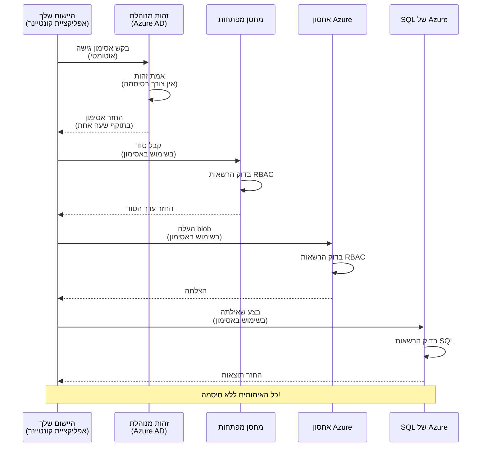
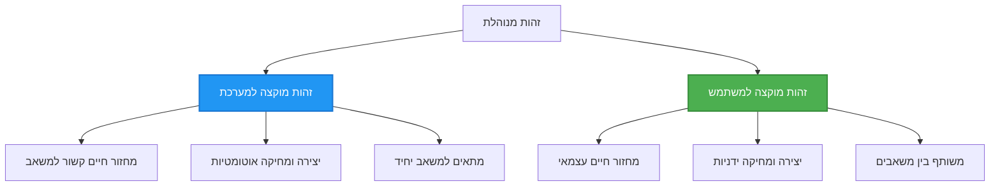

# דפוסי אימות וזהות מנוהלת

⏱️ **זמן משוער**: 45-60 דקות | 💰 **עלות**: חינמי (אין עלויות נוספות) | ⭐ **מורכבות**: בינוני

**📚 מסלול למידה:**
- ← הקודם: [ניהול תצורה](configuration.md) - ניהול משתני סביבה וסודות
- 🎯 **אתה כאן**: אימות ואבטחה (Managed Identity, Key Vault, דפוסים מאובטחים)
- → הבא: [הפרויקט הראשון](first-project.md) - בניית היישום הראשון ב-AZD
- 🏠 [דף הקורס](../../README.md)

---

## מה תלמד

על ידי סיום שיעור זה, תלמד/י:
- להבין דפוסי אימות ב-Azure (מפתחות, מחרוזות חיבור, Managed Identity)
- להטמיע **Managed Identity** לאימות ללא סיסמה
- להגן על סודות באמצעות אינטגרציה עם **Azure Key Vault**
- להגדיר **בקרת גישה מבוססת תפקידים (RBAC)** לפריסות AZD
- ליישם שיטות עבודה מומלצות לאבטחה ב-Container Apps ובשירותי Azure
- להמיר מאימות מבוסס מפתחות לאימות מבוסס זהות

## למה Managed Identity חשוב

### הבעיה: אימות מסורתי

**לפני Managed Identity:**
```javascript
// ❌ סיכון אבטחה: סודות קשיחים בקוד
const connectionString = "Server=mydb.database.windows.net;User=admin;Password=P@ssw0rd123";
const storageKey = "xK7mN9pQ2wR5tY8uI0oP3aS6dF1gH4jK...";
const cosmosKey = "C2x7B9n4M1p8Q5w3E6r0T2y5U8i1O4p7...";
```

**בעיות:**
- 🔴 **סודות פתוחים** בקוד, בקבצי קונפיגורציה ובמשתני סביבה
- 🔴 **החלפת אישורים** דורשת שינויים בקוד ופריסה מחדש
- 🔴 **סיוטי ביקורת** - מי ניגש למה ומתי?
- 🔴 **פריסה מבוזרת** - סודות מפוזרים במספר מערכות
- 🔴 **סיכוני ציות** - כישלון בביקורת אבטחה

### הפתרון: Managed Identity

**לאחר Managed Identity:**
```javascript
// ✅ מאובטח: אין סודות בקוד
const credential = new DefaultAzureCredential();
const client = new BlobServiceClient(
  "https://mystorageaccount.blob.core.windows.net",
  credential  // Azure מטפלת באימות באופן אוטומטי
);
```

**יתרונות:**
- ✅ **אין סודות** בקוד או בקונפיגורציה
- ✅ **החלפה אוטומטית** - Azure מטפל בכך
- ✅ **מעקב ביקורת מלא** ביומני Azure AD
- ✅ **אבטחה מרכזית** - ניהול ב-Azure Portal
- ✅ **מוכן לציות** - עונה על תקני אבטחה

**אנלוגיה**: אימות מסורתי דומה לנשיאת מספר מפתחות פיזיים לדלתות שונות. Managed Identity דומה לתג אבטחה שמעניק גישה באופן אוטומטי לפי מי שאתה — אין מפתחות לאבד, לשכפל או להחליף.

---

## סקירת ארכיטקטורה

### זרימת אימות עם Managed Identity


### סוגי זהויות מנוהלות


| מאפיין | מוקצה למערכת | מוקצה למשתמש |
|---------|----------------|---------------|
| **מחזור חיים** | קשור למשאב | עצמאי |
| **יצירה** | אוטומטי עם המשאב | יצירה ידנית |
| **מחיקה** | נמחק עם המשאב | נותר לאחר מחיקת המשאב |
| **שיתוף** | משאב יחיד בלבד | משאבים מרובים |
| **מקרה שימוש** | תרחישים פשוטים | תרחישי מולטי-משאבים מורכבים |
| **ברירת מחדל AZD** | ✅ מומלץ | אופציונלי |

---

## דרישות מוקדמות

### כלים נדרשים

כבר צריך להיות מותקן אצלך מהשיעורים הקודמים:

```bash
# בדוק את Azure Developer CLI
azd version
# ✅ צפוי: גרסת azd 1.0.0 או גבוהה יותר

# בדוק את Azure CLI
az --version
# ✅ צפוי: גרסת azure-cli 2.50.0 או גבוהה יותר
```

### דרישות Azure

- מנוי Azure פעיל
- הרשאות ל:
  - יצירת זהויות מנוהלות
  - הקצאת תפקידי RBAC
  - יצירת משאבי Key Vault
  - פריסת Container Apps

### ידע נדרש

עליך להשלים:
- [מדריך התקנה](installation.md) - התקנת AZD
- [עקרונות AZD](azd-basics.md) - מושגים בסיסיים
- [ניהול תצורה](configuration.md) - משתני סביבה

---

## שיעור 1: הבנת דפוסי אימות

### דפוס 1: מחרוזות חיבור (מורשת - להמנע)

**איך זה עובד:**
```bash
# מחרוזת החיבור מכילה פרטי כניסה
STORAGE_CONNECTION_STRING="DefaultEndpointsProtocol=https;AccountName=myaccount;AccountKey=xK7mN9pQ2wR5..."
COSMOS_CONNECTION_STRING="AccountEndpoint=https://myaccount.documents.azure.com:443/;AccountKey=C2x7..."
SQL_CONNECTION_STRING="Server=myserver.database.windows.net;User=admin;Password=P@ssw0rd..."
```

**בעיות:**
- ❌ סודות גלויים במשתני סביבה
- ❌ מתועדים במערכות פריסה
- ❌ קשה להחלפה
- ❌ אין מעקב ביקורת על גישה

**מתי להשתמש:** רק לפיתוח מקומי, לעולם לא בסביבת ייצור.

---

### דפוס 2: הפניות ל-Key Vault (טוב יותר)

**איך זה עובד:**
```bicep
// Store secret in Key Vault
resource keyVault 'Microsoft.KeyVault/vaults@2023-02-01' = {
  name: 'mykv'
  properties: {
    enableRbacAuthorization: true
  }
}

// Reference in Container App
env: [
  {
    name: 'STORAGE_KEY'
    secretRef: 'storage-key'  // References Key Vault
  }
]
```

**יתרונות:**
- ✅ סודות מאוחסנים בצורה מאובטחת ב-Key Vault
- ✅ ניהול סודות מרכזי
- ✅ החלפה ללא שינויים בקוד

**מגבלות:**
- ⚠️ עדיין משתמש במפתחות/סיסמאות
- ⚠️ יש לנהל את הגישה ל-Key Vault

**מתי להשתמש:** שלב מעבר ממחרוזות חיבור ל-managed identity.

---

### דפוס 3: Managed Identity (שיטת עבודה מועדפת)

**איך זה עובד:**
```bicep
// Enable managed identity
resource containerApp 'Microsoft.App/containerApps@2023-05-01' = {
  name: 'myapp'
  identity: {
    type: 'SystemAssigned'  // Automatically creates identity
  }
}

// Grant permissions
resource roleAssignment 'Microsoft.Authorization/roleAssignments@2022-04-01' = {
  scope: storageAccount
  properties: {
    roleDefinitionId: storageBlobDataContributorRole
    principalId: containerApp.identity.principalId
  }
}
```

**קוד היישום:**
```javascript
// אין צורך בסודות!
const { DefaultAzureCredential } = require('@azure/identity');
const { BlobServiceClient } = require('@azure/storage-blob');

const credential = new DefaultAzureCredential();
const blobServiceClient = new BlobServiceClient(
  'https://mystorageaccount.blob.core.windows.net',
  credential
);
```

**יתרונות:**
- ✅ אין סודות בקוד/בקונפיגורציה
- ✅ החלפת אישורים אוטומטית
- ✅ מעקב ביקורת מלא
- ✅ הרשאות מבוססות RBAC
- ✅ מוכן לציות

**מתי להשתמש:** תמיד, ליישומי ייצור.

---

## שיעור 2: יישום Managed Identity עם AZD

### יישום שלב-אחר-שלב

בואו ונבנה Container App מאובטח שמשתמש ב-managed identity לגישה ל-Azure Storage ול-Key Vault.

### מבנה הפרויקט

```
secure-app/
├── azure.yaml                 # AZD configuration
├── infra/
│   ├── main.bicep            # Main infrastructure
│   ├── core/
│   │   ├── identity.bicep    # Managed identity setup
│   │   ├── keyvault.bicep    # Key Vault configuration
│   │   └── storage.bicep     # Storage with RBAC
│   └── app/
│       └── container-app.bicep
└── src/
    ├── app.js                # Application code
    ├── package.json
    └── Dockerfile
```

### 1. קונפיגורציית AZD (azure.yaml)

```yaml
name: secure-app
metadata:
  template: secure-app@1.0.0

services:
  api:
    project: ./src
    language: js
    host: containerapp

# Enable managed identity (AZD handles this automatically)
```

### 2. תשתית: הפעלת Managed Identity

**קובץ: `infra/main.bicep`**

```bicep
targetScope = 'subscription'

param environmentName string
param location string = 'eastus'

var tags = { 'azd-env-name': environmentName }

// Resource group
resource rg 'Microsoft.Resources/resourceGroups@2021-04-01' = {
  name: 'rg-${environmentName}'
  location: location
  tags: tags
}

// Storage Account
module storage './core/storage.bicep' = {
  name: 'storage'
  scope: rg
  params: {
    name: 'st${uniqueString(rg.id)}'
    location: location
    tags: tags
  }
}

// Key Vault
module keyVault './core/keyvault.bicep' = {
  name: 'keyvault'
  scope: rg
  params: {
    name: 'kv-${uniqueString(rg.id)}'
    location: location
    tags: tags
  }
}

// Container App with Managed Identity
module containerApp './app/container-app.bicep' = {
  name: 'container-app'
  scope: rg
  params: {
    name: 'ca-${environmentName}'
    location: location
    tags: tags
    storageAccountName: storage.outputs.name
    keyVaultName: keyVault.outputs.name
  }
}

// Grant Container App access to Storage
module storageRoleAssignment './core/role-assignment.bicep' = {
  name: 'storage-role'
  scope: rg
  params: {
    principalId: containerApp.outputs.identityPrincipalId
    roleDefinitionId: 'ba92f5b4-2d11-453d-a403-e96b0029c9fe'  // Storage Blob Data Contributor
    targetResourceId: storage.outputs.id
  }
}

// Grant Container App access to Key Vault
module kvRoleAssignment './core/role-assignment.bicep' = {
  name: 'kv-role'
  scope: rg
  params: {
    principalId: containerApp.outputs.identityPrincipalId
    roleDefinitionId: '4633458b-17de-408a-b874-0445c86b69e6'  // Key Vault Secrets User
    targetResourceId: keyVault.outputs.id
  }
}

// Outputs
output AZURE_STORAGE_ACCOUNT_NAME string = storage.outputs.name
output AZURE_KEY_VAULT_NAME string = keyVault.outputs.name
output APP_URL string = containerApp.outputs.url
```

### 3. Container App עם זהות מוקצה-מערכת

**קובץ: `infra/app/container-app.bicep`**

```bicep
param name string
param location string
param tags object = {}
param storageAccountName string
param keyVaultName string

resource containerApp 'Microsoft.App/containerApps@2023-05-01' = {
  name: name
  location: location
  tags: tags
  identity: {
    type: 'SystemAssigned'  // 🔑 Enable managed identity
  }
  properties: {
    configuration: {
      ingress: {
        external: true
        targetPort: 3000
      }
    }
    template: {
      containers: [
        {
          name: 'api'
          image: 'myregistry.azurecr.io/api:latest'
          resources: {
            cpu: json('0.5')
            memory: '1Gi'
          }
          env: [
            {
              name: 'AZURE_STORAGE_ACCOUNT_NAME'
              value: storageAccountName
            }
            {
              name: 'AZURE_KEY_VAULT_NAME'
              value: keyVaultName
            }
            // 🔑 No secrets - managed identity handles authentication!
          ]
        }
      ]
    }
  }
}

// Output the identity for RBAC assignments
output identityPrincipalId string = containerApp.identity.principalId
output id string = containerApp.id
output url string = 'https://${containerApp.properties.configuration.ingress.fqdn}'
```

### 4. מודול הקצאת תפקיד RBAC

**קובץ: `infra/core/role-assignment.bicep`**

```bicep
param principalId string
param roleDefinitionId string  // Azure built-in role ID
param targetResourceId string

resource roleAssignment 'Microsoft.Authorization/roleAssignments@2022-04-01' = {
  name: guid(principalId, roleDefinitionId, targetResourceId)
  scope: resourceId('Microsoft.Resources/resourceGroups', resourceGroup().name)
  properties: {
    roleDefinitionId: subscriptionResourceId('Microsoft.Authorization/roleDefinitions', roleDefinitionId)
    principalId: principalId
    principalType: 'ServicePrincipal'
  }
}

output id string = roleAssignment.id
```

### 5. קוד היישום עם Managed Identity

**קובץ: `src/app.js`**

```javascript
const express = require('express');
const { DefaultAzureCredential } = require('@azure/identity');
const { BlobServiceClient } = require('@azure/storage-blob');
const { SecretClient } = require('@azure/keyvault-secrets');

const app = express();
const PORT = process.env.PORT || 3000;

// 🔑 אתחול האישורים (עובד אוטומטית עם זהות מנוהלת)
const credential = new DefaultAzureCredential();

// הגדרת Azure Storage
const storageAccountName = process.env.AZURE_STORAGE_ACCOUNT_NAME;
const blobServiceClient = new BlobServiceClient(
  `https://${storageAccountName}.blob.core.windows.net`,
  credential  // אין צורך במפתחות!
);

// הגדרת Key Vault
const keyVaultName = process.env.AZURE_KEY_VAULT_NAME;
const secretClient = new SecretClient(
  `https://${keyVaultName}.vault.azure.net`,
  credential  // אין צורך במפתחות!
);

// בדיקת בריאות
app.get('/health', (req, res) => {
  res.json({ status: 'healthy', authentication: 'managed-identity' });
});

// העלאת קובץ לאחסון Blob
app.post('/upload', async (req, res) => {
  try {
    const containerClient = blobServiceClient.getContainerClient('uploads');
    await containerClient.createIfNotExists();
    
    const blobName = `file-${Date.now()}.txt`;
    const blockBlobClient = containerClient.getBlockBlobClient(blobName);
    
    await blockBlobClient.upload('Hello from managed identity!', 30);
    
    res.json({
      success: true,
      blobName: blobName,
      message: 'File uploaded using managed identity!'
    });
  } catch (error) {
    console.error('Upload error:', error);
    res.status(500).json({ error: error.message });
  }
});

// שליפת סוד מ-Key Vault
app.get('/secret/:name', async (req, res) => {
  try {
    const secretName = req.params.name;
    const secret = await secretClient.getSecret(secretName);
    
    res.json({
      name: secretName,
      value: secret.value,
      message: 'Secret retrieved using managed identity!'
    });
  } catch (error) {
    console.error('Secret error:', error);
    res.status(500).json({ error: error.message });
  }
});

// רשימת מיכלי Blob (מדגים גישת קריאה)
app.get('/containers', async (req, res) => {
  try {
    const containers = [];
    for await (const container of blobServiceClient.listContainers()) {
      containers.push(container.name);
    }
    
    res.json({
      containers: containers,
      count: containers.length,
      message: 'Containers listed using managed identity!'
    });
  } catch (error) {
    console.error('List error:', error);
    res.status(500).json({ error: error.message });
  }
});

app.listen(PORT, () => {
  console.log(`Secure API listening on port ${PORT}`);
  console.log('Authentication: Managed Identity (passwordless)');
});
```

**קובץ: `src/package.json`**

```json
{
  "name": "secure-app",
  "version": "1.0.0",
  "dependencies": {
    "express": "^4.18.2",
    "@azure/identity": "^4.0.0",
    "@azure/storage-blob": "^12.17.0",
    "@azure/keyvault-secrets": "^4.7.0"
  },
  "scripts": {
    "start": "node app.js"
  }
}
```

### 6. פריסה ובדיקה

```bash
# אתחל את סביבת AZD
azd init

# פרוס תשתית ואפליקציה
azd up

# קבל את כתובת ה-URL של היישום
APP_URL=$(azd env get-values | grep APP_URL | cut -d '=' -f2 | tr -d '"')

# בצע בדיקת תקינות
curl $APP_URL/health
```

**✅ פלט צפוי:**
```json
{
  "status": "healthy",
  "authentication": "managed-identity"
}
```

**בדיקת העלאת Blob:**
```bash
curl -X POST $APP_URL/upload
```

**✅ פלט צפוי:**
```json
{
  "success": true,
  "blobName": "file-1700404800000.txt",
  "message": "File uploaded using managed identity!"
}
```

**בדיקת רישום מכולות:**
```bash
curl $APP_URL/containers
```

**✅ פלט צפוי:**
```json
{
  "containers": ["uploads"],
  "count": 1,
  "message": "Containers listed using managed identity!"
}
```

---

## תפקידי RBAC נפוצים ב-Azure

### מזהי תפקיד מובנים עבור Managed Identity

| שירות | שם תפקיד | מזהה תפקיד | הרשאות |
|---------|-----------|---------|-------------|
| **Storage** | Storage Blob Data Reader | `2a2b9908-6b94-4a3d-8e5a-a7d8f8cc8a12` | קריאת blobs ומכולות |
| **Storage** | Storage Blob Data Contributor | `ba92f5b4-2d11-453d-a403-e96b0029c9fe` | קריאה, כתיבה ומחיקה של blobs |
| **Storage** | Storage Queue Data Contributor | `974c5e8b-45b9-4653-ba55-5f855dd0fb88` | קריאה, כתיבה ומחיקה של הודעות בתורים |
| **Key Vault** | Key Vault Secrets User | `4633458b-17de-408a-b874-0445c86b69e6` | קריאת סודות |
| **Key Vault** | Key Vault Secrets Officer | `b86a8fe4-44ce-4948-aee5-eccb2c155cd7` | קריאה, כתיבה ומחיקה של סודות |
| **Cosmos DB** | Cosmos DB Built-in Data Reader | `00000000-0000-0000-0000-000000000001` | קריאת נתוני Cosmos DB |
| **Cosmos DB** | Cosmos DB Built-in Data Contributor | `00000000-0000-0000-0000-000000000002` | קריאה, כתיבה של נתוני Cosmos DB |
| **SQL Database** | SQL DB Contributor | `9b7fa17d-e63e-47b0-bb0a-15c516ac86ec` | ניהול מסדי נתוני SQL |
| **Service Bus** | Azure Service Bus Data Owner | `090c5cfd-751d-490a-894a-3ce6f1109419` | שליחה, קבלה וניהול הודעות |

### כיצד למצוא מזהי תפקיד

```bash
# הצג את כל התפקידים המובנים
az role definition list --query "[].{Name:roleName, ID:name}" --output table

# חפש תפקיד מסוים
az role definition list --query "[?contains(roleName, 'Storage Blob')].{Name:roleName, ID:name}" --output table

# קבל את פרטי התפקיד
az role definition list --name "Storage Blob Data Contributor"
```

---

## תרגילים מעשיים

### תרגיל 1: הפעלת Managed Identity עבור אפליקציה קיימת ⭐⭐ (בינוני)

**מטרה**: הוספת managed identity לפריסת Container App קיימת

**תסריט**: יש לך Container App שמשתמש במחרוזות חיבור. המור אותו ל-managed identity.

**נקודת התחלה**: Container App עם התצורה הזו:

```bicep
// ❌ Current: Using connection string
env: [
  {
    name: 'STORAGE_CONNECTION_STRING'
    secretRef: 'storage-connection'
  }
]
```

**צעדים**:

1. **הפעל managed identity ב-Bicep:**

```bicep
resource containerApp 'Microsoft.App/containerApps@2023-05-01' = {
  name: 'myapp'
  identity: {
    type: 'SystemAssigned'  // Add this
  }
  // ... rest of configuration
}
```

2. **הענק גישת Storage:**

```bicep
// Get storage account reference
resource storageAccount 'Microsoft.Storage/storageAccounts@2023-01-01' existing = {
  name: storageAccountName
}

// Assign role
resource roleAssignment 'Microsoft.Authorization/roleAssignments@2022-04-01' = {
  name: guid(containerApp.id, 'ba92f5b4-2d11-453d-a403-e96b0029c9fe', storageAccount.id)
  scope: storageAccount
  properties: {
    roleDefinitionId: subscriptionResourceId('Microsoft.Authorization/roleDefinitions', 'ba92f5b4-2d11-453d-a403-e96b0029c9fe')
    principalId: containerApp.identity.principalId
    principalType: 'ServicePrincipal'
  }
}
```

3. **עדכן את קוד היישום:**

**לפני (מחרוזת חיבור):**
```javascript
const { BlobServiceClient } = require('@azure/storage-blob');

const blobServiceClient = BlobServiceClient.fromConnectionString(
  process.env.STORAGE_CONNECTION_STRING
);
```

**אחרי (managed identity):**
```javascript
const { DefaultAzureCredential } = require('@azure/identity');
const { BlobServiceClient } = require('@azure/storage-blob');

const credential = new DefaultAzureCredential();
const blobServiceClient = new BlobServiceClient(
  `https://${process.env.STORAGE_ACCOUNT_NAME}.blob.core.windows.net`,
  credential
);
```

4. **עדכן משתני סביבה:**

```bicep
env: [
  {
    name: 'STORAGE_ACCOUNT_NAME'
    value: storageAccountName  // Just the name, no secrets!
  }
  // Remove STORAGE_CONNECTION_STRING
]
```

5. **פרוס ובדוק:**

```bash
# פרוס מחדש
azd up

# וודא שהוא עדיין עובד
curl https://myapp.azurecontainerapps.io/upload
```

**✅ קריטריוני הצלחה:**
- ✅ היישום נפרס ללא שגיאות
- ✅ פעולות Storage עובדות (העלאה, רשימה, הורדה)
- ✅ אין מחרוזות חיבור במשתני סביבה
- ✅ הזהות נראית ב-Azure Portal תחת הבלייד "Identity"

**אימות:**

```bash
# ודא שהזהות המנוהלת מופעלת
az containerapp show \
  --name myapp \
  --resource-group rg-myapp \
  --query "identity.type"
# ✅ צפוי: "SystemAssigned"

# בדוק את הקצאת התפקיד
az role assignment list \
  --assignee $(az containerapp show --name myapp --resource-group rg-myapp --query "identity.principalId" -o tsv) \
  --scope /subscriptions/{sub-id}/resourceGroups/rg-myapp/providers/Microsoft.Storage/storageAccounts/mystorageaccount
# ✅ צפוי: מציג את התפקיד "Storage Blob Data Contributor"
```

**זמן**: 20-30 דקות

---

### תרגיל 2: גישה מרובת שירותים עם User-Assigned Identity ⭐⭐⭐ (מתקדם)

**מטרה**: יצירת User-Assigned Identity משותפת בין מספר Container Apps

**תסריט**: יש לך 3 מיקרו-שירותים שצריכים גישה לאותו חשבון Storage ולאותו Key Vault.

**צעדים**:

1. **צור User-Assigned Identity:**

**קובץ: `infra/core/identity.bicep`**

```bicep
param name string
param location string
param tags object = {}

resource userAssignedIdentity 'Microsoft.ManagedIdentity/userAssignedIdentities@2023-01-31' = {
  name: name
  location: location
  tags: tags
}

output id string = userAssignedIdentity.id
output principalId string = userAssignedIdentity.properties.principalId
output clientId string = userAssignedIdentity.properties.clientId
```

2. **הקצה תפקידים ל-User-Assigned Identity:**

```bicep
// In main.bicep
module userIdentity './core/identity.bicep' = {
  name: 'user-identity'
  scope: rg
  params: {
    name: 'id-${environmentName}'
    location: location
    tags: tags
  }
}

// Grant Storage access
resource storageRoleAssignment 'Microsoft.Authorization/roleAssignments@2022-04-01' = {
  name: guid(userIdentity.outputs.principalId, 'storage-contributor')
  scope: storageAccount
  properties: {
    roleDefinitionId: subscriptionResourceId('Microsoft.Authorization/roleDefinitions', 'ba92f5b4-2d11-453d-a403-e96b0029c9fe')
    principalId: userIdentity.outputs.principalId
    principalType: 'ServicePrincipal'
  }
}

// Grant Key Vault access
resource kvRoleAssignment 'Microsoft.Authorization/roleAssignments@2022-04-01' = {
  name: guid(userIdentity.outputs.principalId, 'kv-secrets-user')
  scope: keyVault
  properties: {
    roleDefinitionId: subscriptionResourceId('Microsoft.Authorization/roleDefinitions', '4633458b-17de-408a-b874-0445c86b69e6')
    principalId: userIdentity.outputs.principalId
    principalType: 'ServicePrincipal'
  }
}
```

3. **הקצה את הזהות למספר Container Apps:**

```bicep
resource apiGateway 'Microsoft.App/containerApps@2023-05-01' = {
  name: 'api-gateway'
  identity: {
    type: 'UserAssigned'
    userAssignedIdentities: {
      '${userIdentity.outputs.id}': {}
    }
  }
  // ... rest of config
}

resource productService 'Microsoft.App/containerApps@2023-05-01' = {
  name: 'product-service'
  identity: {
    type: 'UserAssigned'
    userAssignedIdentities: {
      '${userIdentity.outputs.id}': {}
    }
  }
  // ... rest of config
}

resource orderService 'Microsoft.App/containerApps@2023-05-01' = {
  name: 'order-service'
  identity: {
    type: 'UserAssigned'
    userAssignedIdentities: {
      '${userIdentity.outputs.id}': {}
    }
  }
  // ... rest of config
}
```

4. **קוד היישום (כל השירותים משתמשים באותו דפוס):**

```javascript
const { DefaultAzureCredential, ManagedIdentityCredential } = require('@azure/identity');

// עבור זהות שהוקצתה למשתמש, ציין את מזהה הלקוח
const credential = new ManagedIdentityCredential(
  process.env.AZURE_CLIENT_ID  // מזהה הלקוח של זהות שהוקצתה למשתמש
);

// או השתמש ב-DefaultAzureCredential (איתור אוטומטי)
const credential = new DefaultAzureCredential();

const blobServiceClient = new BlobServiceClient(
  `https://${process.env.STORAGE_ACCOUNT_NAME}.blob.core.windows.net`,
  credential
);
```

5. **פרוס ואמת:**

```bash
azd up

# בדוק שכל השירותים יכולים לגשת לאחסון
curl https://api-gateway.azurecontainerapps.io/upload
curl https://product-service.azurecontainerapps.io/upload
curl https://order-service.azurecontainerapps.io/upload
```

**✅ קריטריוני הצלחה:**
- ✅ זהות אחת משותפת בין 3 שירותים
- ✅ כל השירותים יכולים לגשת ל-Storage ול-Key Vault
- ✅ הזהות נשארת גם אם אתה מוחק שירות אחד
- ✅ ניהול הרשאות מרכזי

**יתרונות User-Assigned Identity:**
- זהות יחידה לניהול
- הרשאות עקביות בין השירותים
- נשמרת לאחר מחיקת שירות
- מתאימה לארכיטקטורות מורכבות

**זמן**: 30-40 דקות

---

### תרגיל 3: יישום סיבוב סודות ב-Key Vault ⭐⭐⭐ (מתקדם)

**מטרה**: לאחסן מפתחות API של צד שלישי ב-Key Vault ולגשת אליהם באמצעות managed identity

**תסריט**: האפליקציה שלך צריכה לקרוא ל-API חיצוני (OpenAI, Stripe, SendGrid) שמצריך מפתחות API.

**צעדים**:

1. **צור Key Vault עם RBAC:**

**קובץ: `infra/core/keyvault.bicep`**

```bicep
param name string
param location string
param tags object = {}

resource keyVault 'Microsoft.KeyVault/vaults@2023-02-01' = {
  name: name
  location: location
  tags: tags
  properties: {
    enableRbacAuthorization: true  // Use RBAC instead of access policies
    sku: {
      family: 'A'
      name: 'standard'
    }
    tenantId: subscription().tenantId
    enableSoftDelete: true
    softDeleteRetentionInDays: 90
  }
}

// Allow Container App to read secrets
output id string = keyVault.id
output name string = keyVault.name
output uri string = keyVault.properties.vaultUri
```

2. **אחסן סודות ב-Key Vault:**

```bash
# השג את השם של Key Vault
KV_NAME=$(azd env get-values | grep AZURE_KEY_VAULT_NAME | cut -d '=' -f2 | tr -d '"')

# אחסן מפתחות API של צד שלישי
az keyvault secret set \
  --vault-name $KV_NAME \
  --name "OpenAI-ApiKey" \
  --value "sk-proj-xxxxxxxxxxxxx"

az keyvault secret set \
  --vault-name $KV_NAME \
  --name "Stripe-ApiKey" \
  --value "sk_live_xxxxxxxxxxxxx"

az keyvault secret set \
  --vault-name $KV_NAME \
  --name "SendGrid-ApiKey" \
  --value "SG.xxxxxxxxxxxxx"
```

3. **קוד היישום לשליפת סודות:**

**קובץ: `src/config.js`**

```javascript
const { DefaultAzureCredential } = require('@azure/identity');
const { SecretClient } = require('@azure/keyvault-secrets');

class Config {
  constructor() {
    this.credential = new DefaultAzureCredential();
    this.secretClient = new SecretClient(
      `https://${process.env.AZURE_KEY_VAULT_NAME}.vault.azure.net`,
      this.credential
    );
    this.cache = {};
  }

  async getSecret(secretName) {
    // בדוק תחילה את המטמון
    if (this.cache[secretName]) {
      return this.cache[secretName];
    }

    try {
      const secret = await this.secretClient.getSecret(secretName);
      this.cache[secretName] = secret.value;
      console.log(`✅ Retrieved secret: ${secretName}`);
      return secret.value;
    } catch (error) {
      console.error(`❌ Failed to get secret ${secretName}:`, error.message);
      throw error;
    }
  }

  async getOpenAIKey() {
    return this.getSecret('OpenAI-ApiKey');
  }

  async getStripeKey() {
    return this.getSecret('Stripe-ApiKey');
  }

  async getSendGridKey() {
    return this.getSecret('SendGrid-ApiKey');
  }
}

module.exports = new Config();
```

4. **השתמש בסודות בתוך היישום:**

**קובץ: `src/app.js`**

```javascript
const express = require('express');
const config = require('./config');
const { OpenAI } = require('openai');

const app = express();

// אתחל את OpenAI עם המפתח ממאגר המפתחות
let openaiClient;

async function initializeServices() {
  const openaiKey = await config.getOpenAIKey();
  openaiClient = new OpenAI({ apiKey: openaiKey });
  console.log('✅ Services initialized with secrets from Key Vault');
}

// להיקרא בעת האתחול
initializeServices().catch(console.error);

app.post('/chat', async (req, res) => {
  try {
    const completion = await openaiClient.chat.completions.create({
      model: 'gpt-4',
      messages: [{ role: 'user', content: 'Hello!' }]
    });
    
    res.json({
      response: completion.choices[0].message.content,
      authentication: 'Key from Key Vault via Managed Identity'
    });
  } catch (error) {
    res.status(500).json({ error: error.message });
  }
});

app.listen(3000, () => {
  console.log('Secure API with Key Vault integration running');
});
```

5. **פרוס ובדוק:**

```bash
azd up

# בדוק שמפתחות ה-API עובדים
curl -X POST https://myapp.azurecontainerapps.io/chat \
  -H "Content-Type: application/json" \
  -d '{"message":"Hello AI"}'
```

**✅ קריטריוני הצלחה:**
- ✅ אין מפתחות API בקוד או במשתני סביבה
- ✅ היישום מושך מפתחות מ-Key Vault
- ✅ ה-APIs של צד ג' עובדים כראוי
- ✅ ניתן לסובב מפתחות בלי שינויים בקוד

**סובב סוד:**

```bash
# עדכן סוד ב-Key Vault
az keyvault secret set \
  --vault-name $KV_NAME \
  --name "OpenAI-ApiKey" \
  --value "sk-proj-NEW_KEY_HERE"

# הפעל מחדש את האפליקציה כדי שתשתמש במפתח החדש
az containerapp revision restart \
  --name myapp \
  --resource-group rg-myapp
```

**זמן**: 25-35 דקות

---

## נקודת בדיקת ידע

### 1. דפוסי אימות ✓

בדוק את הבנתך:

- [ ] **ש1**: מהם שלושת דפוסי האימות העיקריים? 
  - **תשובה**: מחרוזות חיבור (מורשת), הפניות ל-Key Vault (שלב מעבר), Managed Identity (הטוב ביותר)

- [ ] **ש2**: מדוע Managed Identity עדיפה על פני מחרוזות חיבור?
  - **תשובה**: אין סודות בקוד, החלפה אוטומטית, מעקב ביקורת מלא, הרשאות RBAC

- [ ] **ש3**: מתי תשתמש בזהות מוצמדת למשתמש במקום זהות מוקצת-מערכת?
  - **תשובה**: כשמחליפים זהות בין משאבים מרובים או כאשר מחזור חיי הזהות עצמאי ממחזור חיי המשאב

**אימות מעשי:**
```bash
# בדוק איזה סוג זהות משמש את האפליקציה שלך
az containerapp show \
  --name myapp \
  --resource-group rg-myapp \
  --query "identity.type"

# הצג את כל הקצאות התפקידים של הזהות
az role assignment list \
  --assignee $(az containerapp show --name myapp --resource-group rg-myapp --query "identity.principalId" -o tsv)
```

---

### 2. RBAC והרשאות ✓

בדוק את הבנתך:

- [ ] **ש1**: מהו מזהה התפקיד עבור "Storage Blob Data Contributor"?
  - **תשובה**: `ba92f5b4-2d11-453d-a403-e96b0029c9fe`

- [ ] **ש2**: אילו הרשאות נותן "Key Vault Secrets User"?
  - **תשובה**: גישת קריאה בלבד לסודות (לא יכול ליצור, לעדכן או למחוק)

- [ ] **ש3**: איך מעניקים ל-Container App גישה ל-Azure SQL?
  - **תשובה**: הקצה את תפקיד "SQL DB Contributor" או הגדר אימות Azure AD ל-SQL

**אימות מעשי:**
```bash
# מצא תפקיד ספציפי
az role definition list --name "Storage Blob Data Contributor"

# בדוק אילו תפקידים הוקצו לזהות שלך
PRINCIPAL_ID=$(az containerapp show --name myapp --resource-group rg-myapp --query "identity.principalId" -o tsv)
az role assignment list --assignee $PRINCIPAL_ID --output table
```

---

### 3. אינטגרציה עם Key Vault ✓

בדוק את הבנתך:
- [ ] **Q1**: כיצד מפעילים RBAC עבור Key Vault במקום מדיניות גישה?
  - **A**: הגדרו `enableRbacAuthorization: true` ב-Bicep

- [ ] **Q2**: איזו ספריית Azure SDK מטפלת באימות זהות מנוהלת?
  - **A**: `@azure/identity` עם המחלקה `DefaultAzureCredential`

- [ ] **Q3**: כמה זמן סודות ב-Key Vault נשארים במטמון?
  - **A**: תלוי ביישום; יש לממש אסטרטגיית מטמון משלך

**אימות מעשי:**
```bash
# בדוק גישה ל-Key Vault
az keyvault secret show \
  --vault-name $KV_NAME \
  --name "OpenAI-ApiKey" \
  --query "value"

# בדוק שה-RBAC מופעל
az keyvault show \
  --name $KV_NAME \
  --query "properties.enableRbacAuthorization"
# ✅ צפוי: נכון
```

---

## שיטות אבטחה מומלצות

### ✅ עשו:

1. **תמיד השתמשו בזהות מנוהלת בסביבת הייצור**
   ```bicep
   identity: {
     type: 'SystemAssigned'
   }
   ```

2. **השתמשו בתפקידי RBAC בזכויות המינימום הנדרשות**
   - השתמשו בתפקידי "Reader" כאשר אפשרי
   - הימנעו מ"Owner" או "Contributor" אלא אם נחוץ

3. **אחסנו מפתחות של צד שלישי ב-Key Vault**
   ```javascript
   const apiKey = await secretClient.getSecret('ThirdPartyApiKey');
   ```

4. **הפעילו רישום ביקורת**
   ```bicep
   diagnosticSettings: {
     logs: [{ category: 'AuditEvent', enabled: true }]
   }
   ```

5. **השתמשו בזהויות שונות עבור dev/staging/prod**
   ```bash
   azd env new dev
   azd env new staging
   azd env new prod
   ```

6. **סובבו סודות באופן סדיר**
   - הגדירו תאריכי תפוגה עבור סודות ב-Key Vault
   - אוטומטו את הסיבוב באמצעות Azure Functions

### ❌ אל תעשו:

1. **לעולם אל תטמיעו סודות בקוד**
   ```javascript
   // ❌ רע
   const apiKey = "sk-proj-xxxxxxxxxxxxx";
   ```

2. **אל תשתמשו ב-connection strings בסביבת הייצור**
   ```javascript
   // ❌ רע
   BlobServiceClient.fromConnectionString(process.env.STORAGE_CONNECTION_STRING)
   ```

3. **אל תעניקו הרשאות מופרזות**
   ```bicep
   // ❌ BAD - too much access
   roleDefinitionId: 'Owner'
   
   // ✅ GOOD - least privilege
   roleDefinitionId: 'Storage Blob Data Reader'
   ```

4. **אל תרשמו סודות בלוגים**
   ```javascript
   // רע ❌
   console.log('API Key:', apiKey);
   
   // טוב ✅
   console.log('API Key retrieved successfully');
   ```

5. **אל תשתפו זהויות ייצור בין סביבות**
   ```bicep
   // ❌ BAD - same identity for dev and prod
   // ✅ GOOD - separate identities per environment
   ```

---

## מדריך פתרון בעיות

### בעיה: "Unauthorized" בעת גישה ל-Azure Storage

**תסמינים:**
```
Error: Unauthorized (403)
AuthorizationPermissionMismatch: This request is not authorized to perform this operation
```

**אבחון:**

```bash
# בדוק אם זהות מנוהלת מופעלת
az containerapp show \
  --name myapp \
  --resource-group rg-myapp \
  --query "identity.type"
# ✅ צפוי: "SystemAssigned" או "UserAssigned"

# בדוק הקצאות תפקידים
PRINCIPAL_ID=$(az containerapp show --name myapp --resource-group rg-myapp --query "identity.principalId" -o tsv)
az role assignment list --assignee $PRINCIPAL_ID

# צפוי: יש לראות "Storage Blob Data Contributor" או תפקיד דומה
```

**פתרונות:**

1. **העניקו את תפקיד ה-RBAC הנכון:**
```bash
STORAGE_ID=$(az storage account show --name mystorageaccount --resource-group rg-myapp --query "id" -o tsv)
az role assignment create \
  --assignee $PRINCIPAL_ID \
  --role "Storage Blob Data Contributor" \
  --scope $STORAGE_ID
```

2. **המתינו להפצה (יכול לקחת 5-10 דקות):**
```bash
# בדוק את מצב הקצאת התפקיד
az role assignment list --assignee $PRINCIPAL_ID --scope $STORAGE_ID
```

3. **וודאו שקוד היישום משתמש באישורים הנכונים:**
```javascript
// וודא שאתה משתמש ב-DefaultAzureCredential
const credential = new DefaultAzureCredential();
```

---

### בעיה: הגישה ל-Key Vault נדחתה

**תסמינים:**
```
Error: Forbidden (403)
The user, group or application does not have secrets get permission
```

**אבחון:**

```bash
# בדוק שבקרת גישה מבוססת תפקידים (RBAC) של מאגר המפתחות מופעלת
az keyvault show \
  --name $KV_NAME \
  --query "properties.enableRbacAuthorization"
# ✅ צפוי: נכון

# בדוק הקצאות תפקידים
az role assignment list \
  --assignee $PRINCIPAL_ID \
  --scope /subscriptions/{sub-id}/resourceGroups/rg-myapp/providers/Microsoft.KeyVault/vaults/$KV_NAME
```

**פתרונות:**

1. **הפעילו RBAC על Key Vault:**
```bash
az keyvault update \
  --name $KV_NAME \
  --enable-rbac-authorization true
```

2. **העניקו את תפקיד Key Vault Secrets User:**
```bash
KV_ID=$(az keyvault show --name $KV_NAME --query "id" -o tsv)
az role assignment create \
  --assignee $PRINCIPAL_ID \
  --role "Key Vault Secrets User" \
  --scope $KV_ID
```

---

### בעיה: DefaultAzureCredential נכשל באופן מקומי

**תסמינים:**
```
Error: DefaultAzureCredential failed to retrieve a token
CredentialUnavailableError: No credential available
```

**אבחון:**

```bash
# בדוק אם אתה מחובר
az account show

# בדוק את אימות ה-Azure CLI
az ad signed-in-user show
```

**פתרונות:**

1. **התחברו ל-Azure CLI:**
```bash
az login
```

2. **הגדירו את המנוי של Azure:**
```bash
az account set --subscription "Your Subscription Name"
```

3. **לעבודה מקומית, השתמשו במשתני סביבה:**
```bash
export AZURE_TENANT_ID="your-tenant-id"
export AZURE_CLIENT_ID="your-client-id"
export AZURE_CLIENT_SECRET="your-client-secret"
```

4. **או השתמשו באישורים שונים באופן מקומי:**
```javascript
const { DefaultAzureCredential, AzureCliCredential } = require('@azure/identity');

// ‎השתמש ב-AzureCliCredential לפיתוח מקומי
const credential = process.env.NODE_ENV === 'production' 
  ? new DefaultAzureCredential()
  : new AzureCliCredential();
```

---

### בעיה: הקצאת תפקיד לוקחת זמן רב מדי להתפשט

**תסמינים:**
- התפקיד הוקצה בהצלחה
- עדיין מתקבלים שגיאות 403
- גישה מתقطעת (לפעמים עובד, לפעמים לא)

**הסבר:**
שינויים ב-Azure RBAC יכולים לקחת 5-10 דקות להתפשט גלובלית.

**פתרון:**

```bash
# המתן ונסה שוב
echo "Waiting for RBAC propagation..."
sleep 300  # המתן 5 דקות

# בדוק גישה
curl https://myapp.azurecontainerapps.io/upload

# אם עדיין נכשל, אתחל את האפליקציה מחדש
az containerapp revision restart \
  --name myapp \
  --resource-group rg-myapp
```

---

## שיקולי עלות

### עלויות זהות מנוהלת

| משאב | עלות |
|----------|------|
| **זהות מנוהלת** | 🆓 **חינמי** - ללא חיוב |
| **הקצאות תפקיד RBAC** | 🆓 **חינמי** - ללא חיוב |
| **בקשות אסימון של Azure AD** | 🆓 **חינמי** - כלול |
| **פעולות Key Vault** | $0.03 ל-10,000 פעולות |
| **אחסון Key Vault** | $0.024 לכל סוד לחודש |

**זהות מנוהלת חוסכת כסף על ידי:**
- ✅ הסרת הצורך בפעולות Key Vault לאימות שירות-לשירות
- ✅ הפחתת תקריות אבטחה (אין הדלפות אישורים)
- ✅ הפחתת עומס תפעולי (אין סיבוב ידני)

**השוואת עלויות לדוגמה (לחודש):**

| תרחיש | Connection Strings | זהות מנוהלת | חסכון |
|----------|-------------------|-----------------|---------|
| אפליקציה קטנה (1M בקשות) | ~$50 (Key Vault + פעולות) | ~$0 | $50 לחודש |
| אפליקציה בינונית (10M בקשות) | ~$200 | ~$0 | $200 לחודש |
| אפליקציה גדולה (100M בקשות) | ~$1,500 | ~$0 | $1,500 לחודש |

---

## למידע נוסף

### תיעוד רשמי
- [זהות מנוהלת של Azure](https://learn.microsoft.com/entra/identity/managed-identities-azure-resources/overview)
- [RBAC של Azure](https://learn.microsoft.com/azure/role-based-access-control/overview)
- [Key Vault של Azure](https://learn.microsoft.com/azure/key-vault/general/overview)
- [DefaultAzureCredential](https://learn.microsoft.com/dotnet/api/azure.identity.defaultazurecredential)

### תיעוד SDK
- [@azure/identity (Node.js)](https://www.npmjs.com/package/@azure/identity)
- [Azure.Identity (C#)](https://www.nuget.org/packages/Azure.Identity/)
- [azure-identity (Python)](https://pypi.org/project/azure-identity/)

### הצעדים הבאים בקורס זה
- ← הקודם: [Configuration Management](configuration.md)
- → הבא: [הפרויקט הראשון](first-project.md)
- 🏠 [דף הקורס](../../README.md)

### דוגמאות קשורות
- [דוגמת צ'אט Azure OpenAI](../../../../examples/azure-openai-chat) - משתמשת בזהות מנוהלת עבור Azure OpenAI
- [דוגמת מיקרו-שירותים](../../../../examples/microservices) - דפוסי אימות בין שירותים מרובים

---

## סיכום

**שלמדתם:**
- ✅ שלוש שיטות אימות (connection strings, Key Vault, זהות מנוהלת)
- ✅ כיצד להפעיל ולהגדיר זהות מנוהלת ב-AZD
- ✅ הקצאות תפקידי RBAC לשירותי Azure
- ✅ אינטגרציה עם Key Vault עבור סודות של צד שלישי
- ✅ זהויות שהוקצו על ידי המשתמש לעומת זהויות שהוקצו על ידי המערכת
- ✅ שיטות אבטחה מומלצות ופתרון בעיות

**נקודות מפתח:**
1. **תמיד השתמשו בזהות מנוהלת בסביבת הייצור** - ללא סודות, סיבוב אוטומטי
2. **השתמשו בתפקידי RBAC בזכויות המינימום הנדרשות** - העניקו רק הרשאות נחוצות
3. **אחסנו מפתחות של צד שלישי ב-Key Vault** - ניהול סודות מרכזי
4. **הפרידו זהויות לפי סביבה** - בידוד Dev, staging, prod
5. **הפעילו רישום ביקורת** - עקבו מי ניגש למה

**שלבים הבאים:**
1. השלימו את התרגילים המעשיים למעלה
2. העבירו אפליקציה קיימת משימוש ב-connection strings לזהות מנוהלת
3. צרו את הפרויקט הראשון שלכם ב-AZD עם אבטחה מהיום הראשון: [הפרויקט הראשון](first-project.md)

---

<!-- CO-OP TRANSLATOR DISCLAIMER START -->
הצהרת אחריות:
מסמך זה תורגם באמצעות שירות תרגום מבוסס בינה מלאכותית (Co-op Translator) – https://github.com/Azure/co-op-translator. אף שאנו שואפים לדיוק, יש להכיר בכך שתרגומים אוטומטיים עלולים להכיל שגיאות או אי-דיוקים. יש להסתמך על המסמך המקורי בשפת המקור כמקור הסמכות. עבור מידע קריטי מומלץ להיעזר בתרגום מקצועי שבוצע על ידי מתרגם אנושי. איננו אחראים לכל אי-הבנה או פירוש שגוי הנובעים משימוש בתרגום זה.
<!-- CO-OP TRANSLATOR DISCLAIMER END -->