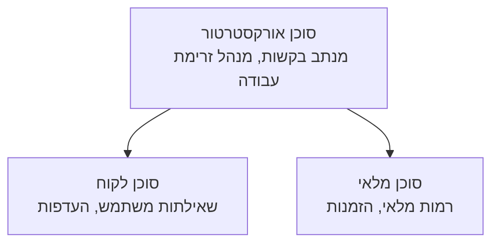

# פרק 5: פתרונות AI רב-סוכניים

**📚 קורס**: [AZD למתחילים](../../README.md) | **⏱️ משך**: 2-3 שעות | **⭐ רמת קושי**: מתקדם

---

## סקירה כללית

פרק זה עוסק בתבניות ארכיטקטורה מתקדמות רב-סוכניות, תזמור סוכנים, ופריסות AI מוכנות לייצור בסביבות מורכבות.

> אומת עם `azd 1.23.12` במרץ 2026.

## מטרות הלמידה

בסיום פרק זה, תוכלו:
- להבין תבניות ארכיטקטורה רב-סוכניות
- לפרוס מערכות סוכני AI מתואמות
- ליישם תקשורת בין סוכנים
- לבנות פתרונות רב-סוכניים מוכנים לייצור

---

## 📚 שיעורים

| # | שיעור | תיאור | זמן |
|---|--------|-------------|------|
| 1 | [פתרון רב-סוכני קמעונאי](../../examples/retail-scenario.md) | מעבר מלא על היישום | 90 דק' |
| 2 | [תבניות תיאום](../chapter-06-pre-deployment/coordination-patterns.md) | אסטרטגיות תזמור סוכנים | 30 דק' |
| 3 | [פריסת תבנית ARM](../../examples/retail-multiagent-arm-template/README.md) | פריסה בלחיצה אחת | 30 דק' |

---

## 🚀 התחלה מהירה

```bash
# אפשרות 1: פריסה מתבנית
azd init --template agent-openai-python-prompty
azd up

# אפשרות 2: פריסה מתוך מניופסט של סוכן (דורש את התוסף azure.ai.agents)
azd extension install azure.ai.agents
azd ai agent init -m agent-manifest.yaml
azd up
```

> **איזה גישה?** השתמשו ב- `azd init --template` כדי להתחיל מדוגמה עובדת. השתמשו ב-`azd ai agent init` כשיש לכם מניווט סוכנים משלכם. ראו את [ההתייחסות ל-AZD AI CLI](../chapter-08-production/production-ai-practices.md#azd-ai-cli-commands-and-extensions) לפרטים מלאים.

---

## 🤖 ארכיטקטורה רב-סוכנית


---

## 🎯 פתרון מובלט: פתרון רב-סוכני קמעונאי

[הפתרון הרב-סוכני הקמעונאי](../../examples/retail-scenario.md) מדגים:

- **סוכן לקוחות**: מטפל באינטראקציות והעדפות המשתמש
- **סוכן מלאי**: מנהל מלאי ועיבוד הזמנות
- **מנהל תזמור**: מתאם בין הסוכנים
- **זיכרון משותף**: ניהול הקשר בין הסוכנים

### שירותים בשימוש

| שירות | מטרה |
|---------|---------|
| Microsoft Foundry Models | הבנת שפה |
| Azure AI Search | קטלוג מוצרים |
| Cosmos DB | מצב וזיכרון סוכן |
| Container Apps | אירוח סוכן |
| Application Insights | ניטור |

---

## 🔗 ניווט

| כיוון | פרק |
|-----------|---------|
| **קודם** | [פרק 4: תשתית](../chapter-04-infrastructure/README.md) |
| **הבא** | [פרק 6: טרם פריסה](../chapter-06-pre-deployment/README.md) |

---

## 📖 משאבים קשורים

- [מדריך סוכני AI](../chapter-02-ai-development/agents.md)
- [פרקטיקות AI לייצור](../chapter-08-production/production-ai-practices.md)
- [פתרון בעיות AI](../chapter-07-troubleshooting/ai-troubleshooting.md)

---

<!-- CO-OP TRANSLATOR DISCLAIMER START -->
**כתב ויתור**:  
מסמך זה תורגם באמצעות שירות תרגום מבוסס בינה מלאכותית [Co-op Translator](https://github.com/Azure/co-op-translator). למרות שאנו שואפים לדיוק, יש לקחת בחשבון כי תרגומים אוטומטיים עלולים לכלול שגיאות או אי דיוקים. המסמך המקורי בשפתו המקורית ייחשב כמקור המוסמך. למידע קריטי מומלץ לפנות לתרגום מקצועי על ידי אדם. איננו נושאים באחריות על אי הבנות או פרשנויות שגויות הנובעות מהשימוש בתרגום זה.
<!-- CO-OP TRANSLATOR DISCLAIMER END -->