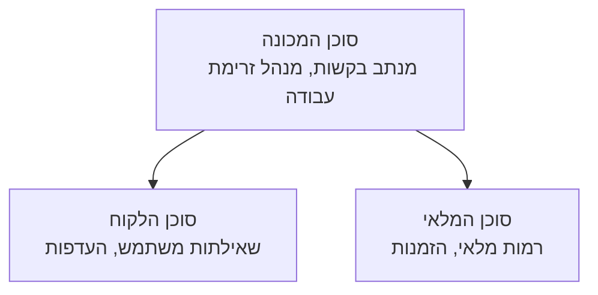

# פרק 5: פתרונות בינה מלאכותית רב-סוכניים

**📚 קורס**: [AZD למתחילים](../../README.md) | **⏱️ משך**: 2-3 שעות | **⭐ רמת קושי**: מתקדם

---

## סקירה כללית

פרק זה מכסה דפוסי ארכיטקטורה מתקדמים של סוכנים רב-מספריים, תזמור סוכנים, ופריסות AI מוכנות לייצור לתרחישים מורכבים.

## מטרות הלמידה

בסיום פרק זה, תלמד/י:
- להבין דפוסי ארכיטקטורת סוכנים רב-מספריים
- לפרוס מערכות סוכנים מתואמות של בינה מלאכותית
- ליישם תקשורת בין סוכן לסוכן
- לבנות פתרונות רב-סוכניים מוכנים לייצור

---

## 📚 שיעורים

| # | שיעור | תאור | זמן |
|---|--------|-------------|------|
| 1 | [פתרון רב-סוכני לקמעונאות](../../examples/retail-scenario.md) | הליכה צעד-אחר-צעד למימוש מלא | 90 דקות |
| 2 | [דפוסי תיאום](../chapter-06-pre-deployment/coordination-patterns.md) | אסטרטגיות תזמור סוכנים | 30 דקות |
| 3 | [פריסת תבנית ARM](../../examples/retail-multiagent-arm-template/README.md) | פריסה בלחיצה אחת | 30 דקות |

---

## 🚀 התחלה מהירה

```bash
# אפשרות 1: פריסה מתבנית
azd init --template agent-openai-python-prompty
azd up

# אפשרות 2: פריסה ממניפסט סוכן (דורש את ההרחבה azure.ai.agents)
azd extension install azure.ai.agents
azd ai agent init -m agent-manifest.yaml
azd up
```

> **איזה גישה?** השתמש ב-`azd init --template` כדי להתחיל מתבנית עובדת. השתמש ב-`azd ai agent init` כשיש לך מניפסט סוכן משלך. ראה את ה-[מדריך לפקודות והרחבות AZD AI CLI](../chapter-08-production/production-ai-practices.md#azd-ai-cli-commands-and-extensions) לפרטים מלאים.

---

## 🤖 ארכיטקטורת סוכנים רב-מספריים


---

## 🎯 פתרון מוצג: רב-סוכני לקמעונאות

[פתרון רב-סוכני לקמעונאות](../../examples/retail-scenario.md) מדגים:

- **סוכן לקוח**: מטפל באינטראקציות והעדפות משתמש
- **סוכן מלאי**: מנהל מלאי ועיבוד הזמנות
- **מתזמן**: מתאים בין הסוכנים
- **זיכרון משותף**: ניהול הקשר בין סוכנים

### שירותים בשימוש

| שירות | מטרה |
|---------|---------|
| Microsoft Foundry Models | הבנת שפה |
| Azure AI Search | קטלוג מוצרים |
| Cosmos DB | מצב הזיכרון של הסוכן |
| Container Apps | אירוח סוכן |
| Application Insights | מעקב |

---

## 🔗 ניווט

| כיוון | פרק |
|-----------|---------|
| **קודם** | [פרק 4: תשתית](../chapter-04-infrastructure/README.md) |
| **הבא** | [פרק 6: לפני פריסה](../chapter-06-pre-deployment/README.md) |

---

## 📖 משאבים קשורים

- [מדריך סוכני AI](../chapter-02-ai-development/agents.md)
- [שיטות עבודה מומלצות ל-AI בפרודקשן](../chapter-08-production/production-ai-practices.md)
- [פתרון בעיות AI](../chapter-07-troubleshooting/ai-troubleshooting.md)

---

<!-- CO-OP TRANSLATOR DISCLAIMER START -->
**כתב ויתור**:  
מסמך זה תורגם באמצעות שירות תרגום מבוסס בינה מלאכותית [Co-op Translator](https://github.com/Azure/co-op-translator). אף שאנו שואפים לדייק, יש לקחת בחשבון שתרגומים אוטומטיים עשויים להכיל שגיאות או אי דיוקים. המסמך המקורי בשפתו המקורית הוא המקור הסמכותי. למידע קריטי מומלץ לבצע תרגום מקצועי על ידי מתרגם אנושי. איננו נושאים באחריות לכל אי הבנה או פרשנות שגויה הנובעות מהשימוש בתרגום זה.
<!-- CO-OP TRANSLATOR DISCLAIMER END -->