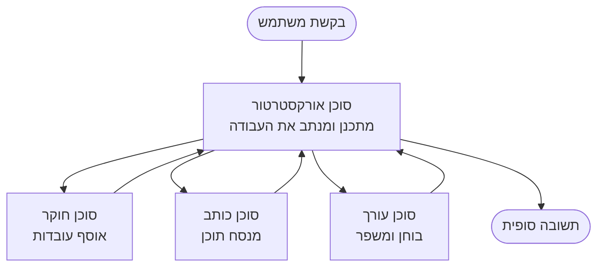

# יסודות רב-סוכניים - פרוס את מערכת ה-AI המתואמת הראשונה שלך

**ניווט בפרק:**
- **📚 דף הקורס**: [AZD For Beginners](../../README.md)
- **📖 פרק נוכחי**: פרק 5 - פתרונות AI רב-סוכניים
- **⬅️ הקודם**: [Chapter 4: Infrastructure](../chapter-04-infrastructure/README.md)
- **➡️ הבא**: [Coordination Patterns](../chapter-06-pre-deployment/coordination-patterns.md)

> אומת נגד `azd 1.25.6` ביוני 2026.

## מבוא

בפרקים הקודמים פרסתם יישום יחיד—ובפרק 2 פרסתם סוכן AI יחיד. בשיעור הזה נעשה את הצעד הבא: פריסה של מערכת רב-סוכנית, שבה מספר סוכנים מומחים עובדים יחד לפתור בעיה שסוכן בודד לא היה יכול להתמודד איתה היטב לבדו.

החדשות המעודדות למתחילים: **אין צורך בפקודות חדשות.** פתרון רב-סוכני הוא עדיין פרויקט azd. תאתחלו עם `azd init`, תפעילו עם `azd up`, תבדקו, ותסגרו עם `azd down`—אותו תהליך עבודה שאתם כבר מכירים. מה שמשתנה הוא ה"מבנה" של היישום בפנים.

## מטרות הלימוד

בסוף השיעור הזה תוכלו:
- להבין מה משמעות "רב-סוכני" ומתי שווה את המורכבות הנוספת
- לזהות את התפקידים הנפוצים במערכת רב-סוכנית (מתאם + מומחים)
- לפרוס תבנית רב-סוכנית עובדת עם `azd up`
- להבין את משאבי ה-Azure התומכים ביישום רב-סוכני
- לדעת כיצד לאמת, להתאים ולהשבית את הפתרון בצורה בטוחה

## תוצאות למידה

לאחר השלמת השיעור תדעו:
- להסביר את ההבדל בין סוכן יחיד לבין מערכת רב-סוכנית
- לבחור בין סוכן יחיד עם כלים לעומת עיצוב רב-סוכני אמיתי
- לפרוס ולבדוק תבנית רב-סוכנית מקצה לקצה עם azd
- לזהות היכן כל סוכן רץ וכיצד הם מתקשרים
- לנקות את כל המשאבים כדי להימנע מחיובים שוטפים

---

## מהי מערכת רב-סוכנית?

סוכן AI יחיד הוא מודל אחד עם סט הוראות ולפעמים כמה כלים. זה עובד היטב למשימות ממוקדות. אבל ככל שמשימה גדלה—מחקר, ואז כתיבה, ואז עריכה, ואז בדיקת עובדות—לדחוס את כל זה לפרומפט יחיד עושה את הסוכן איטי יותר, פחות אמין, וקשה יותר לניפוי שגיאות.

מערכת רב-סוכנית שואבת את העבודה למומחים שכל אחד עושה עבודה אחת היטב, ומתואמת על ידי מתאם:



### שתי התפקידים שתמיד תראו

| Role | Job | Example |
|------|-----|---------|
| **Orchestrator** | מחליט *מה קורה לאחר מכן* ומנתב עבודה בין סוכנים | "קודם חקר, אחר כך כתיבה, ואז עריכה" |
| **Specialist** | מבצע משימה ממוקדת ומחזיר תוצאה | "חוקר" שאוסף רק עובדות |

### האם באמת צריך מספר סוכנים?

התחילו פשוט. פנו לרב-סוכני **רק** כשאחת מהנקודות האלה נכונה:

- ✅ המשימה כוללת **שלבים מובחנים** שמרוויחים מהוראות שונות (מחקר לעומת כתיבה לעומת סקירה)
- ✅ אתם רוצים שסוכנים מומחים ירוצו **ב-parallel** כדי לחסוך זמן
- ✅ שלבים שונים צריכים **כלים או מקורות נתונים שונים**
- ✅ אתם צריכים שכל שלב יהיה **ניתן לבדיקה וניפוי שגיאות עצמאית**

אם המשימה שלכם היא שאלה ותשובה בודדת או קריאת כלי פשוטה, **סוכן יחיד עם כלים** (פרק 2) פשוט יותר, זול יותר, וקל יותר לתפעול.

> **טיפ למתחילים:** "יותר סוכנים" לא תמיד "טוב יותר." כל סוכן מוסיף השהייה, עלות ודבר נוסף לניטור. הוסיפו סוכנים רק כשהבעיה מתפצלת לחלקים בצורה ברורה.

---

## שתי דרכים לבנות רב-סוכני ב-Azure

| Approach | What it is | Best for |
|----------|-----------|----------|
| **Single agent + tools** | סוכן Foundry אחד שקורא פונקציות/כלים | זרימות עבודה פשוטות, התחלה מהירה |
| **Multiple coordinated agents** | מספר סוכנים עם מתאם | שלבים מובחנים, עבודה במקביל, התמחות |

השיעור הזה מתמקד בגישה השנייה באמצעות **תבנית מוכנה**, כך שתוכלו לראות מערכת רב-סוכנית אמיתית רצה לפני שתבנו אחת משלכם.

---

## מדריך מעשי: פרוס יישום רב-סוכני עובד

נפרוס את Contoso Creative Writer, דוגמה רשמית של Azure שמשתמשת במספר סוכנים (חוקר, כותב, עורך) שמתואמים כדי לייצר מאמר. זו אפליקציה רב-סוכנית מצוינת להתחלה כי התפקידים קלים להבנה.

### שלב 1: אתחול התבנית

```bash
# צור תיקיית עבודה
mkdir creative-writer && cd creative-writer

# אתחל מתוך התבנית הרשמית לרב-סוכנים
azd init --template contoso-creative-writer
```

> דפדפו בתבניות רב-סוכניות נוספות בכל עת בגלריית [Awesome AZD AI](https://azure.github.io/awesome-azd/?tags=ai). אופציות ידידותיות למתחילים נוספות כוללות `get-started-with-ai-agents` ו-`azure-ai-travel-agents`.

### שלב 2: התחברות

```bash
# נדרש עבור זרימות העבודה של azd
azd auth login
```

### שלב 3: צור סביבה

```bash
azd env new dev
```

### שלב 4: תצוגה מקדימה, ואז פריסה

```bash
# בדוק מה ייווצר לפני כל הוצאה (מומלץ)
azd provision --preview

# הכן תשתית ופרוס את כל הסוכנים בשלב אחד
azd up
```

`azd up` יבקש בחירה של מנוי ואזור, ואז יספק את משאבי ה-Azure ויפרס את היישום. פריסות AI יכולות לקחת יותר זמן מאפליקציית ווב פשוטה—אם אתם מפרסים מודלים גדולים יותר, ניתן להאריך את זמן ההמתנה לפריסה:

```bash
azd deploy --timeout 1800
```

> **הערה על עלות וקיבולת:** אפליקציות רב-סוכניות מפעילות מודלי AI שצורכים מכסת שימוש וגורמות לעלויות. אם `azd up` נכשל עקב מכסת מודל, ראו [AI Troubleshooting](../chapter-07-troubleshooting/ai-troubleshooting.md) לתיקוני אזור ומכסה, ופרק 6 [תכנון קיבולת](../chapter-06-pre-deployment/capacity-planning.md).

---

## להבין מה פרסתם

אפליקציה רב-סוכנית טיפוסית כמו זו מספקת סט משאבי Azure שמתאימים ישירות לאחריות במבנה לעיל:

| Resource | Why it's there |
|----------|----------------|
| **Microsoft Foundry / Models** | מאחסן את דגמי השפה שכל סוכן משתמש בהם |
| **Azure AI Search** | נותן לסוכן החוקר נתונים מבוססים לחיפוש |
| **Container Apps** (or App Service) | מארח את המתאם וקוד הסוכנים |
| **Cosmos DB** (in some samples) | מאחסן מצב/זיכרון משותף שעובר בין סוכנים |
| **Application Insights** | עוקב אחרי בקשות *בין* הסוכנים כדי שתוכלו לנפות שגיאות בזרימה |

### כיצד הסוכנים מתקשרים אחד עם השני

ברוב דוגמאות ה-azd הרב-סוכניות, ה**מתאם רץ בקוד היישום שלכם** (לדוגמה, באמצעות מסגרת כמו Semantic Kernel או Microsoft Agent Framework). המתאם קורא לכל סוכן מומחה בתורו, מעביר את התוצאות, ומרכיב את התשובה הסופית. הסוכנים משתפים הקשר דרך:

- **קריאות פונקציה/כלי** — המתאם מפעיל סוכן מומחה ומקבל חזרה תוצאה
- **זיכרון משותף** — מסד נתונים (לעיתים קרובות Cosmos DB) מחזיק מצב ששני הסוכנים יכולים לקרוא
- **הודעות/אירועים** — לצימוד רופף יותר, הסוכנים מתקשרים דרך תור או Service Bus

> **למה זה חשוב לניפוי שגיאות:** כי כל שלב מופרד, Application Insights מראה לכם *איזה* סוכן היה איטי או נכשל. זו סיבה עיקרית לפצל את העבודה בין סוכנים מלכתחילה.

---

## אמת את הפריסה

וודאו שהמערכת באמת פועלת לפני שממשיכים:

```bash
# הצג את נקודות הקצה שנפרסו
azd show

# פתח את לוח הניטור של האפליקציה
azd monitor

# עקוב אחרי הלוגים אם משהו נראה לא תקין
azd monitor --logs
```

לאחר מכן פתחו את כתובת ה-URL של היישום מ-`azd show` ונסו בקשה שמפעילה את כל הסוכנים (ל-Contoso Creative Writer, בקשו לכתוב מאמר קצר על נושא). ב-Application Insights **transaction search**, אמורות להופיע עקבות שמפנות את הבקשה דרך שלבי החוקר, הכותב והעורך.

**קריטריוני הצלחה:**
- ✅ `azd show` ממחזיר נקודת קצה נגישה
- ✅ בקשה מייצרת תוצאה שעברה בבירור דרך מספר שלבים
- ✅ Application Insights מראה עקבות ללמעלה מצעד סוכן אחד

---

## התאמה אישית: הוסף או כוונן סוכן

מכיוון שכל סוכן הוא פשוט הוראות בתוספת כלים, ההתאמה אישית נגישה:

1. **מצאו את הגדרות הסוכן** בתבנית (לעיתים קבצים בתיקיות `prompts/`, `agents/`, או קבצי `*.prompty`).
2. **כווננו את הוראות הסוכן** — לדוגמה, נסו לומר לסוכן העורך לאכוף טון או מספר מילים מסוים.
3. **פרסו מחדש רק את הקוד** (התשתית לא משתנה):

   ```bash
   azd deploy
   ```

להתקדמות נוספת ולבניית סוכנים ממניפסט משלכם, השתמשו בהרחבת הסוכן ובמחזור החיים המלא שלה:

```bash
azd extension install azure.ai.agents
azd ai agent init -m agent-manifest.yaml
azd up
azd ai agent invoke      # בדיקה, עם מדידת זמן תגובה
```

ראו [Chapter 2: Agents](../chapter-02-ai-development/agents.md) ואת [מדריך שורת הפקודה של AZD AI](../chapter-08-production/production-ai-practices.md#azd-ai-cli-commands-and-extensions) למחזור חיי הסוכן המלא (`invoke`, `eval generate`, `optimize`, `delete`).

---

## ניקוי

אפליקציות רב-סוכניות מפעילות מספר שירותים שניתנים לחיוב. פירקו את הכל כשסיימתם:

```bash
azd down --force --purge
```

הדגל `--purge` גם מסיר משאבי AI שנמחקו ברכות (כמו חשבונות Foundry/Azure AI Services) כדי שלא יחסמו פריסה עתידית או ימשיכו לייצר עלות.

---

## הערה על מערכות רב-סוכניות בייצור

[Retail Multi-Agent Solution](../../examples/retail-scenario.md) בריפו זה הוא **מפה ארכיטקטונית**, לא תבנית בפקודה אחת—הוא מתעד כיצד מערכת קמעונאית בייצור *תיבנה* (ומפורש שבנייה מלאה היא מאמץ משמעותי). השתמשו בו כהפניה עיצובית *לאחר* שהפרסתם דוגמה עובדת כאן. לנושאי ייצור (חוסן, עלות, ניטור, ממשל), המשיכו ל[Chapter 8: Production AI Practices](../chapter-08-production/production-ai-practices.md).

---

## סיכום

- מערכת רב-סוכנית מפזרת עבודה בין מומחים ומתואמת על ידי מתאם.
- השתמשו בה רק כאשר למשימה יש שלבים מובחנים, הצורך בעבודה במקביל, או כלים שונים לכל שלב—אחרת עדיפו סוכן יחיד.
- תהליך העבודה של azd לא משתנה: `azd init` → `azd up` → בדיקה → `azd down`.
- תבנית אמיתית כמו `contoso-creative-writer` מאפשרת לראות ולהתאים יישום רב-סוכני עובד כבר היום.
- מעקב Application Insights בין הסוכנים הוא אחד היתרונות המעשיים הגדולים של עיצוב רב-סוכני.

---

## 🔗 ניווט

| Direction | Lesson |
|-----------|--------|
| **Previous** | [Chapter 4: Infrastructure](../chapter-04-infrastructure/README.md) |
| **Next** | [Coordination Patterns](../chapter-06-pre-deployment/coordination-patterns.md) |

## 📖 משאבים קשורים

- [AI Agents Guide](../chapter-02-ai-development/agents.md)
- [Coordination Patterns](../chapter-06-pre-deployment/coordination-patterns.md)
- [Production AI Practices](../chapter-08-production/production-ai-practices.md)
- [AI Troubleshooting](../chapter-07-troubleshooting/ai-troubleshooting.md)

---

<!-- CO-OP TRANSLATOR DISCLAIMER START -->
**כתב ויתור**:
מסמך זה תורגם באמצעות שירות תרגום אוטומטי [Co-op Translator](https://github.com/Azure/co-op-translator). למרות שאנו שואפים לדיוק, יש לקחת בחשבון שתרגומים אוטומטיים עלולים להכיל שגיאות או אי-דיוקים. יש להחשיב את המסמך המקורי בשפתו הטבעית כמקור הסמכות. למידע קריטי מומלץ להשתמש בתרגום מקצועי על ידי מתרגם אדם. אנו לא אחראים לכל אי-הבנה או פירוש שגוי הנובע מהשימוש בתרגום זה.
<!-- CO-OP TRANSLATOR DISCLAIMER END -->