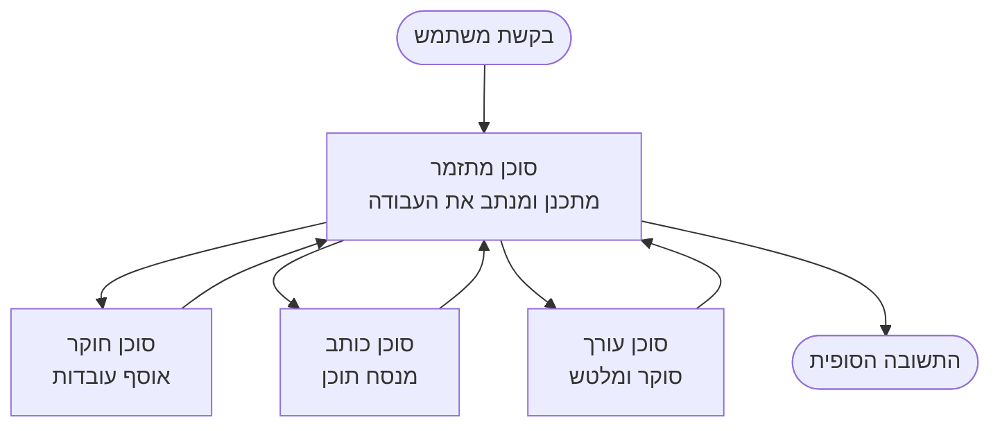

# יסודות רב-סוכניים - פרוס את מערכת ה-AI המתואמת הראשונה שלך

**ניווט בפרק:**
- **📚 בית הקורס**: [AZD למתחילים](../../README.md)
- **📖 הפרק הנוכחי**: פרק 5 - פתרונות AI רב-סוכניים
- **⬅️ קודם**: [פרק 4: תשתית](../chapter-04-infrastructure/README.md)
- **➡️ הבא**: [תבניות תיאום](../chapter-06-pre-deployment/coordination-patterns.md)

> נבדק מול `azd 1.27.1` ביולי 2026.

## הקדמה

בפרקים הקודמים פרסתם אפליקציה בודדת—ובפרק 2 פרסתם סוכן AI יחיד. בשיעור זה נעשה את הצעד הבא: פריסת **מערכת רב-סוכנית**, שבה כמה סוכנים מתמחים עובדים יחד כדי לפתור בעיה שסוכן אחד לא יכול היה לטפל בה ביעילות בעצמו.

החדשות הטובות למתחילים: **אינכם זקוקים לפקודות חדשות.** פתרון רב-סוכני עדיין פרויקט azd. תבצעו `azd init`, `azd up`, בדיקה ו-`azd down`—בדיוק את תהליך העבודה שאתם כבר מכירים. מה שמשתנה הוא *הצורה* של האפליקציה בפנים.

## מטרות הלמידה

בסיום שיעור זה, תוכלו:
- להבין מה המשמעות של "רב-סוכני" ומתי זה שווה את המורכבות הנוספת
- לזהות את התפקידים הנפוצים במערכת רב-סוכנים (מתאם + מומחים)
- לפרוס תבנית רב-סוכנית אמיתית ועובדת עם `azd up`
- להבין את משאבי Azure שתומכים באפליקציה רב-סוכנית
- לדעת כיצד לאמת, להתאים אישית ולפרק את הפתרון בצורה בטוחה

## תוצאות הלמידה

לאחר השלמת השיעור תוכלו:
- להסביר את ההבדל בין סוכן יחיד למערכת רב-סוכנית
- לבחור בין סוכן יחיד עם כלים לעיצוב רב-סוכני אמיתי
- לפרוס ולבדוק תבנית רב-סוכנית מקצה לקצה עם azd
- לזהות היכן כל סוכן רץ וכיצד הם מתקשרים
- לנקות את כל המשאבים כדי להימנע מחיובים שוטפים

---

## מהי מערכת רב-סוכנית?

סוכן AI יחיד הוא מודל אחד עם סט הוראות ו(אופציונלי) כמה כלים. זה עובד טוב למשימות ממוקדות. אך כאשר המשימה גדלה—מחקר, אחריו כתיבה, אחר כך עריכה, ואז בדיקת עובדות—לדחוס הכל לתוך הנחיה אחת הופך את הסוכן לאיטי יותר, לפחות אמין וקשה יותר לאבחון.

**מערכת רב-סוכנית** מפרקת את העבודה למומחים שכל אחד מבצע משימה אחת טוב, ומתואמת על ידי מתאם:



### שני התפקידים שתראו תמיד

| תפקיד | עבודה | דוגמה |
|------|-----|---------|
| **מתאם** | מחליט *מה יקרה הלאה* ומפנה עבודה בין הסוכנים | "תחילה מחקר, אחר כך כתיבה, ואז עריכה" |
| **מומחה** | מבצע משימה ממוקדת אחת ומחזיר תוצאה | "חוקר" שמרכז רק עובדות |

### האם באמת צריך כמה סוכנים?

התחל פשוט. השתמש ברב-סוכני **רק** כאשר אחד מאלה נכון:

- ✅ למשימה יש **שלבים מובחנים** שמרוויחים מהוראות שונות (מחקר לעומת כתיבה לעומת סיקור)
- ✅ אתה רוצה שמומחים יפעלו **במקביל** כדי לחסוך זמן
- ✅ שלבים שונים זקוקים ל**כלים או מקורות נתונים שונים**
- ✅ אתה צריך שכל שלב יהיה **ניתן לבדיקה ואבחון באופן עצמאי**

אם המשימה שלך היא שאלה ותשובה אחת או קריאה פשוטה לכלי, אז **סוכן יחיד עם כלים** (פרק 2) פשוט יותר, זול יותר וקל יותר לתפעול.

> **טיפ למתחילים:** "יותר סוכנים" לא בהכרח "טוב יותר." כל סוכן מוסיף השהייה, עלות ודבר חדש למעקב. הוסף סוכנים רק כאשר הבעיה מתפצלת בבהירות לחלקים.

---

## שתי דרכים לבנות רב-סוכני ב-Azure

| גישה | מה זה | הכי מתאים ל- |
|----------|-----------|----------|
| **סוכן יחיד + כלים** | סוכן Foundry אחד שקורא לפונקציות/כלים | תהליכים פשוטים, התחלה |
| **כמה סוכנים מתואמים** | כמה סוכנים עם מתאם | שלבים מובחנים, עבודה מקבילה, התמחות |

שיעור זה מתמקד בגישה השנייה באמצעות **תבנית מוכנה**, כך שתוכלו לראות מערכת רב-סוכנית עובדת אמיתית לפני שתבנו את שלכם.

---

## מעשי: פרוס אפליקציה רב-סוכנית עובדת

אנו נראה את **Contoso Creative Writer**, דוגמה רשמית של Azure שמפעילה כמה סוכנים (חוקר, כותב, עורך) המתואמים ליצירת מאמר. זו אפליקציה רב-סוכנית מצוינת ראשונה כיוון שהתפקידים שלה מובנים בקלות.

### שלב 1: אתחל את התבנית

```bash
# צור תיקיית עבודה
mkdir creative-writer && cd creative-writer

# אתחל מתבנית רשמית של סוכן מרובה
azd init --template contoso-creative-writer
```

> דפדפו לעוד תבניות רב-סוכניות בכל עת בגלריית [Awesome AZD AI](https://azure.github.io/awesome-azd/?tags=ai). אפשרויות נוספות למתחילים כוללות `get-started-with-ai-agents` ו-`azure-ai-travel-agents`.

### שלב 2: אימות

```bash
# דרוש עבור זרימות עבודה של azd
azd auth login
```

### שלב 3: צור סביבה

```bash
azd env new dev
```

### שלב 4: צפה מראש, ואז פרוס

```bash
# ראה מה ייווצר לפני הוצאה של כסף (מומלץ)
azd provision --preview

# ספק תשתית ופרוס את כל הסוכנים בשלב אחד
azd up
```

`azd up` יבקש מכם פרט למנוי ואזור, ואז יספק את משאבי Azure ויתקין את האפליקציה. פריסות AI יכולות לקחת יותר זמן מאפליקציית רשת פשוטה—אם אתם מפרסים מודלים גדולים יותר, תוכלו להאריך את זמן הפריסה:

```bash
azd deploy --timeout 1800
```

> **הבהרה על עלות וקיבולת:** אפליקציות רב-סוכניות מפרסות מודלי AI שצורכים מכסת שימוש וגורמים לעלויות. אם `azd up` נכשל בגלל מכסת מודל, ראו [פתרון בעיות AI](../chapter-07-troubleshooting/ai-troubleshooting.md) עבור תיקוני אזור ומכסה, וכן פרק 6 [תכנון קיבולת](../chapter-06-pre-deployment/capacity-planning.md).

---

## הבנת הפריסה שביצעת

אפליקציה רב-סוכנית טיפוסית כמו זו מספקת סט משאבי Azure שתואמים ישירות לאחריות בתרשים למעלה:

| משאב | למה הוא שם |
|----------|----------------|
| **Microsoft Foundry / Models** | מארח את מודלי השפה שכל סוכן משתמש בהם |
| **Azure AI Search** | מספק לסוכן החוקר נתונים ביסוסיים לחיפוש |
| **Container Apps** (או App Service) | מארח את המתאם וקוד הסוכנים |
| **Cosmos DB** (בדוגמאות מסוימות) | מאחסן מצב/זיכרון משותף המועבר בין סוכנים |
| **Application Insights** | עוקב אחר בקשות *מעל* סוכנים כדי שתוכלו לאבחן את הזרימה |

### איך הסוכנים מתקשרים ביניהם

ברוב דוגמאות ה-azd הרב-סוכניות, **המתאם רץ בקוד האפליקציה שלכם** (לדוגמה, באמצעות מסגרת כמו Semantic Kernel או Microsoft Agent Framework). המתאם קורא לכל סוכן מומחה בתורו, מעביר את התוצאות, ומרכיב את התשובה הסופית. הסוכנים משתפים הקשר דרך:

- **קריאות פונקציה/כלי** — המתאם מפעיל סוכן מומחה ומקבל תוצאה בחזרה
- **זיכרון משותף** — מסד נתונים (לעיתים Cosmos DB) מחזיק מצב ששני הסוכנים יכולים לקרוא
- **הודעות/אירועים** — לקישור רופף יותר, סוכנים מתקשרים דרך תור או Service Bus

> **מדוע זה חשוב לאבחון:** מאחר שכל שלב הוא נפרד, Application Insights מראה לכם *איזה* סוכן היה איטי או נכשל. זו סיבה מרכזית לפצל עבודה בין סוכנים מלכתחילה.

---

## אמת את הפריסה

ודא שהמערכת אכן פועלת לפני שממשיכים:

```bash
# הצג את נקודות הקצה שהופעלו
azd show

# פתח את לוח הבקרה למעקב אחר האפליקציה
azd monitor

# עקוב אחרי הלוגים אם משהו נראה לא תקין
azd monitor --logs
```

אז פתוח את כתובת האפליקציה מ-`azd show` ונסה בקשה שמפעילה את כל הסוכנים (עבור Creative Writer, בקש לכתוב מאמר קצר בנושא כלשהו). בחיפוש העסקאות ב-Application Insights, תראה שהבקשה מתפצלת בין שלבי החוקר, הכותב והעורך.

**קריטריון הצלחה:**
- ✅ `azd show` מציג נקודת קצה נגישה
- ✅ בקשה מייצרת תוצאה שעברה בבירור מספר שלבים
- ✅ Application Insights מראה עקבות למעלה מצעד סוכן אחד

---

## התאמה אישית: הוסף או התאם סוכן

מאחר שכל סוכן הוא רק הוראות בתוספת כלים, ההתאמה אישית נגישה:

1. **מצא את הגדרות הסוכנים** בתבנית (לעיתים תיקיות `prompts/`, `agents/`, או קבצי `*.prompty`).
2. **כוונן את הוראות הסוכן** — לדוגמה, אמור לסוכן העורך לאכוף טון ספציפי או מספר מילים.
3. **פרוס מחדש רק את הקוד** (התשתית לא משתנה):

   ```bash
   azd deploy
   ```

כדי להתקדם ולבנות סוכנים מ*מניפסט* משלכם, השתמש בהרחבת הסוכנים ובמחזור החיים המלא שלה:

```bash
azd extension install azure.ai.agents
azd ai agent init -m agent-manifest.yaml
azd up
azd ai agent invoke      # בדיקה, עם תזמון תגובה
```

ראו [פרק 2: סוכנים](../chapter-02-ai-development/agents.md) ואת [מדריך השורת פקודה של AZD AI](../chapter-08-production/production-ai-practices.md#azd-ai-cli-commands-and-extensions) למחזור חיים מלא של סוכן (`invoke`, `eval generate`, `optimize`, `delete`).

---

## נקה סביבה

אפליקציות רב-סוכניות מפעילות שירותים רבים שדורשים חיוב. פרק את הכל כשאתה מסיים:

```bash
azd down --force --purge
```

הדגל `--purge` גם מסיר משאבי AI שנמחקו ברכות (כמו חשבונות Foundry/Azure AI Services) כך שלא יחסמו פריסה עתידית או ימשיכו לגרום לעלויות.

---

## הערה על מערכות רב-סוכניות בייצור

[פתרון רב-סוכני לקמעונאות](../../examples/retail-scenario.md) במאגר זה הוא **מפת ארכיטקטורה**, לא תבנית פקודה אחת—הוא מתעד כיצד מערכת קמעונאית בייצור *תיבנה* (ומובהר שהבנייה המלאה היא מאמץ משמעותי). השתמש בו כהפניה עיצובית *אחרי* שפרסת דוגמה עובדת כאן. לנושאים בייצור (עמידות, עלות, ניטור, ממשל), המשך ל-[פרק 8: פרקטיקות AI בייצור](../chapter-08-production/production-ai-practices.md).

---

## סיכום

- מערכת רב-סוכנית מפצלת עבודה בין מומחים שמתואמים על ידי מתאם.
- יש להשתמש בה רק כאשר למשימה יש שלבים מובחנים, עבודה מקבילה, או כלים שונים לכל שלב—אחרת עדיף סוכן יחיד.
- תהליך העבודה ב-azd לא משתנה: `azd init` → `azd up` → בדיקה → `azd down`.
- תבנית אמיתית כמו `contoso-creative-writer` מאפשרת לראות ולהתאים אישית אפליקציה רב-סוכנית עובדת היום.
- עקבות Application Insights בין סוכנים היא אחת התועלות הפרקטיות הגדולות בעיצוב רב-סוכני.

---

## 🔗 ניווט

| כיוון | שיעור |
|-----------|--------|
| **קודם** | [פרק 4: תשתית](../chapter-04-infrastructure/README.md) |
| **הבא** | [תבניות תיאום](../chapter-06-pre-deployment/coordination-patterns.md) |

## 📖 משאבים קשורים

- [מדריך סוכני AI](../chapter-02-ai-development/agents.md)
- [תבניות תיאום](../chapter-06-pre-deployment/coordination-patterns.md)
- [פרקטיקות AI בייצור](../chapter-08-production/production-ai-practices.md)
- [פתרון בעיות AI](../chapter-07-troubleshooting/ai-troubleshooting.md)

---

<!-- CO-OP TRANSLATOR DISCLAIMER START -->
**כתב ויתור**:
מסמך זה תורגם באמצעות שירות תרגום אוטומטי [Co-op Translator](https://github.com/Azure/co-op-translator). למרות שאנו שואפים לדיוק, יש לקחת בחשבון שתרגומים אוטומטיים עלולים להכיל שגיאות או אי-דיוקים. יש להחשיב את המסמך המקורי בשפתו הטבעית כמקור הסמכות. למידע קריטי מומלץ להשתמש בתרגום מקצועי על ידי מתרגם אדם. אנו לא אחראים לכל אי-הבנה או פירוש שגוי הנובע מהשימוש בתרגום זה.
<!-- CO-OP TRANSLATOR DISCLAIMER END -->