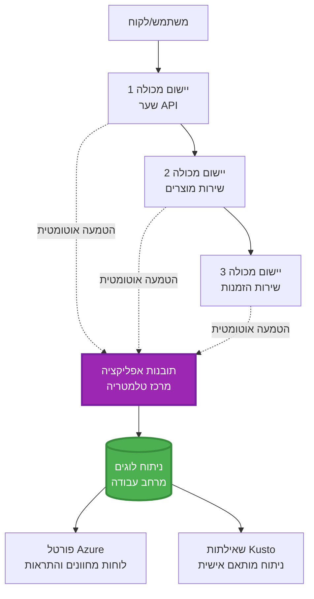
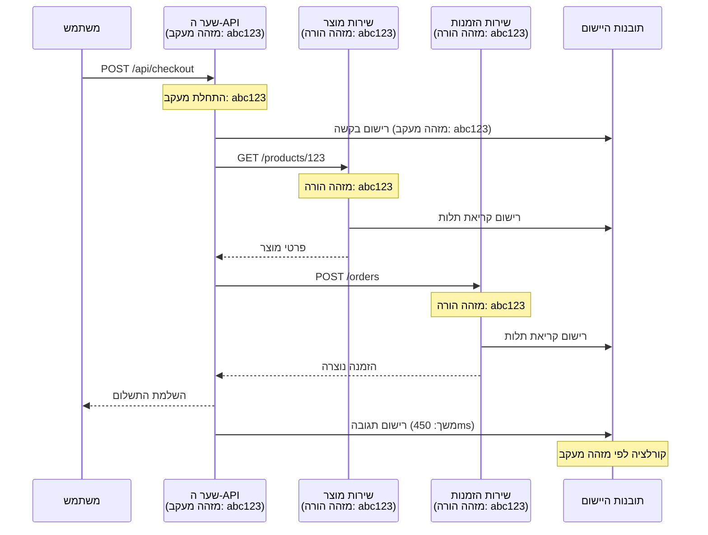

# אינטגרציה של Application Insights עם AZD

⏱️ זמן משוער: 40-50 דקות | 💰 השפעת עלות: ~$5-15/חודש | ⭐ מורכבות: בינוני

**📚 מסלול למידה:**
- ← Previous: [בדיקות מקדימות](preflight-checks.md) - אימות לפני פריסה
- 🎯 **אתם כאן**: אינטגרציה של Application Insights (ניטור, טלמטריה, איתור שגיאות)
- → Next: [מדריך פריסה](../chapter-04-infrastructure/deployment-guide.md) - פריסה ל-Azure
- 🏠 [דף הקורס](../../README.md)

---

## מה תלמדו

בסיום השיעור הזה, תלמדו:
- לשלב באופן אוטומטי את **Application Insights** בפרויקטי AZD
- להגדיר **עקיבה מבוזרת** עבור מיקרו-שירותים
- ליישם **טלמטריה מותאמת** (מדדים, אירועים, תלויות)
- להגדיר **מדדים חיים** למעקב בזמן אמת
- ליצור **התראות ולוחות מחוונים** מתוך פריסות AZD
- לנפות בעיות בפרודקשן עם **שאילתות טלמטריה**
- לאופטימיזציה של **עלויות ואסטרטגיות דגימה**
- לנטר **יישומי AI/LLM** (טוקנים, השהייה, עלויות)

## מדוע Application Insights עם AZD חשוב

### האתגר: נצפות בפרודקשן

**ללא Application Insights:**
```
❌ No visibility into production behavior
❌ Manual log aggregation across services
❌ Reactive debugging (wait for customer complaints)
❌ No performance metrics
❌ Cannot trace requests across services
❌ Unknown failure rates and bottlenecks
```

**עם Application Insights + AZD:**
```
✅ Automatic telemetry collection
✅ Centralized logs from all services
✅ Proactive issue detection
✅ End-to-end request tracing
✅ Performance metrics and insights
✅ Real-time dashboards
✅ AZD provisions everything automatically
```

**אנלוגיה**: Application Insights דומה ל"תיבת שחור" של מטוס + לוח מחוונים בקוקפיט עבור האפליקציה שלכם. אתם רואים הכל בזמן אמת ויכולים לשחזר כל תקרית.

---

## סקירת ארכיטקטורה

### Application Insights בארכיטקטורת AZD


### מה ננטר אוטומטית

| סוג טלמטריה | מה הוא לוכד | מקרה שימוש |
|----------------|------------------|----------|
| **Requests** | בקשות HTTP, קודי סטטוס, משך זמן | ניטור ביצועי API |
| **Dependencies** | קריאות חיצוניות (DB, APIים, אחסון) | זיהוי צווארי בקבוק |
| **Exceptions** | שגיאות לא מטופלות עם עקבות מחסנית | איתור כשלים |
| **Custom Events** | אירועי עסק (הרשמה, רכישה) | אנליטיקה ומשפכי המרה |
| **Metrics** | מוני ביצועים, מדדים מותאמים | תכנון קיבולת |
| **Traces** | הודעות לוג עם חומרה | איתור שגיאות וביקורת |
| **Availability** | זמינות ובדיקות זמן תגובה | ניטור SLA |

---

## דרישות מוקדמות

### כלים דרושים

```bash
# וודא את Azure Developer CLI
azd version
# ✅ צפוי: גרסת azd 1.0.0 או גבוהה יותר

# וודא את Azure CLI
az --version
# ✅ צפוי: גרסת azure-cli 2.50.0 או גבוהה יותר
```

### דרישות Azure

- מנוי Azure פעיל
- הרשאות ליצירה של:
  - משאבי Application Insights
  - Log Analytics workspaces
  - Container Apps
  - קבוצות משאבים

### דרישות ידע

עליכם להשלים:
- [יסודות AZD](../chapter-01-foundation/azd-basics.md) - מושגי יסוד של AZD
- [הגדרה](../chapter-03-configuration/configuration.md) - הגדרת סביבה
- [הפרויקט הראשון](../chapter-01-foundation/first-project.md) - פריסה בסיסית

---

## שיעור 1: Application Insights אוטומטי עם AZD

### כיצד AZD מקצה Application Insights

AZD יוצר ומגדיר באופן אוטומטי Application Insights כשאתם מפריסים. בואו נראה כיצד זה עובד.

### מבנה הפרויקט

```
monitored-app/
├── azure.yaml                     # AZD configuration
├── infra/
│   ├── main.bicep                # Main infrastructure
│   ├── core/
│   │   └── monitoring.bicep      # Application Insights + Log Analytics
│   └── app/
│       └── api.bicep             # Container App with monitoring
└── src/
    ├── app.py                    # Application with telemetry
    ├── requirements.txt
    └── Dockerfile
```

---

### שלב 1: קונפיגורציית AZD (azure.yaml)

**קובץ: `azure.yaml`**

```yaml
name: monitored-app
metadata:
  template: monitored-app@1.0.0

services:
  api:
    project: ./src
    language: python
    host: containerapp

# AZD automatically provisions monitoring!
```

**זה הכל!** AZD ייצור Application Insights כברירת מחדל. אין צורך בקונפיגורציה נוספת לניטור בסיסי.

---

### שלב 2: תשתית ניטור (Bicep)

**קובץ: `infra/core/monitoring.bicep`**

```bicep
param logAnalyticsName string
param applicationInsightsName string
param location string = resourceGroup().location
param tags object = {}

// Log Analytics Workspace (required for Application Insights)
resource logAnalytics 'Microsoft.OperationalInsights/workspaces@2022-10-01' = {
  name: logAnalyticsName
  location: location
  tags: tags
  properties: {
    sku: {
      name: 'PerGB2018'  // Pay-as-you-go pricing
    }
    retentionInDays: 30  // Keep logs for 30 days
    features: {
      enableLogAccessUsingOnlyResourcePermissions: true
    }
  }
}

// Application Insights
resource applicationInsights 'Microsoft.Insights/components@2020-02-02' = {
  name: applicationInsightsName
  location: location
  tags: tags
  kind: 'web'
  properties: {
    Application_Type: 'web'
    WorkspaceResourceId: logAnalytics.id
    IngestionMode: 'LogAnalytics'
    publicNetworkAccessForIngestion: 'Enabled'
    publicNetworkAccessForQuery: 'Enabled'
  }
}

// Outputs for Container Apps
output logAnalyticsWorkspaceId string = logAnalytics.id
output logAnalyticsWorkspaceName string = logAnalytics.name
output applicationInsightsConnectionString string = applicationInsights.properties.ConnectionString
output applicationInsightsInstrumentationKey string = applicationInsights.properties.InstrumentationKey
output applicationInsightsName string = applicationInsights.name
```

---

### שלב 3: חיבור Container App ל-Application Insights

**קובץ: `infra/app/api.bicep`**

```bicep
param name string
param location string
param tags object = {}
param containerAppsEnvironmentName string
param applicationInsightsConnectionString string

resource containerApp 'Microsoft.App/containerApps@2023-05-01' = {
  name: name
  location: location
  tags: tags
  properties: {
    configuration: {
      ingress: {
        external: true
        targetPort: 8000
      }
      secrets: [
        {
          name: 'appinsights-connection-string'
          value: applicationInsightsConnectionString
        }
      ]
    }
    template: {
      containers: [
        {
          name: 'api'
          image: 'myregistry.azurecr.io/api:latest'
          resources: {
            cpu: json('0.5')
            memory: '1Gi'
          }
          env: [
            {
              name: 'APPLICATIONINSIGHTS_CONNECTION_STRING'
              secretRef: 'appinsights-connection-string'
            }
            {
              name: 'APPLICATIONINSIGHTS_ENABLED'
              value: 'true'
            }
          ]
        }
      ]
    }
  }
}

output uri string = 'https://${containerApp.properties.configuration.ingress.fqdn}'
```

---

### שלב 4: קוד האפליקציה עם טלמטריה

**קובץ: `src/app.py`**

```python
from flask import Flask, request, jsonify
from opencensus.ext.azure.log_exporter import AzureLogHandler
from opencensus.ext.azure.trace_exporter import AzureExporter
from opencensus.ext.flask.flask_middleware import FlaskMiddleware
from opencensus.trace.samplers import ProbabilitySampler
import logging
import os

app = Flask(__name__)

# קבל את מחרוזת החיבור של Application Insights
connection_string = os.environ.get('APPLICATIONINSIGHTS_CONNECTION_STRING')

if connection_string:
    # הגדר מעקב מבוזר
    middleware = FlaskMiddleware(
        app,
        exporter=AzureExporter(connection_string=connection_string),
        sampler=ProbabilitySampler(rate=1.0)  # דגימה של 100% עבור פיתוח
    )
    
    # הגדר רישום
    logger = logging.getLogger(__name__)
    logger.addHandler(AzureLogHandler(connection_string=connection_string))
    logger.setLevel(logging.INFO)
    
    print("✅ Application Insights enabled")
else:
    logger = logging.getLogger(__name__)
    logger.setLevel(logging.INFO)
    print("⚠️ Application Insights not configured")

@app.route('/health')
def health():
    logger.info('Health check endpoint called')
    return jsonify({'status': 'healthy', 'monitoring': 'enabled'})

@app.route('/api/products')
def get_products():
    logger.info('Fetching products')
    
    # דמה קריאה למסד נתונים (נרשמת אוטומטית כתלות)
    products = [
        {'id': 1, 'name': 'Laptop', 'price': 999.99},
        {'id': 2, 'name': 'Mouse', 'price': 29.99},
        {'id': 3, 'name': 'Keyboard', 'price': 79.99}
    ]
    
    logger.info(f'Returned {len(products)} products')
    return jsonify(products)

@app.route('/api/error-test')
def error_test():
    """Test error tracking"""
    logger.error('Testing error tracking')
    try:
        raise ValueError('This is a test exception')
    except Exception as e:
        logger.exception('Exception occurred in error-test endpoint')
        return jsonify({'error': str(e)}), 500

@app.route('/api/slow')
def slow_endpoint():
    """Test performance tracking"""
    import time
    logger.info('Slow endpoint called')
    time.sleep(3)  # דמה פעולה איטית
    logger.warning('Endpoint took 3 seconds to respond')
    return jsonify({'message': 'Slow operation completed'})

if __name__ == '__main__':
    app.run(host='0.0.0.0', port=8000)
```

**קובץ: `src/requirements.txt`**

```txt
Flask==3.0.0
opencensus-ext-azure==1.1.13
opencensus-ext-flask==0.8.1
gunicorn==21.2.0
```

---

### שלב 5: פריסה ואימות

```bash
# אתחול AZD
azd init

# פריסה (מספקת את Application Insights באופן אוטומטי)
azd up

# קבל את כתובת ה-URL של האפליקציה
APP_URL=$(azd env get-values | grep API_URL | cut -d '=' -f2 | tr -d '"')

# צור טלמטריה
curl $APP_URL/health
curl $APP_URL/api/products
curl $APP_URL/api/error-test
curl $APP_URL/api/slow
```

**✅ פלט צפוי:**
```json
{
  "status": "healthy",
  "monitoring": "enabled"
}
```

---

### שלב 6: צפייה בטלמטריה בפורטל Azure

```bash
# קבל פרטים של Application Insights
azd env get-values | grep APPLICATIONINSIGHTS

# פתח בפורטל Azure
az monitor app-insights component show \
  --app $(azd env get-values | grep APPLICATIONINSIGHTS_NAME | cut -d '=' -f2 | tr -d '"') \
  --resource-group $(azd env get-values | grep AZURE_RESOURCE_GROUP | cut -d '=' -f2 | tr -d '"') \
  --query "appId" -o tsv
```

**נווט אל פורטל Azure → Application Insights → חיפוש עסקאות**

אתם אמורים לראות:
- ✅ בקשות HTTP עם קודי סטטוס
- ✅ משך בקשה (3+ שניות עבור `/api/slow`)
- ✅ פרטי שגיאות מ-`/api/error-test`
- ✅ הודעות לוג מותאמות

---

## שיעור 2: טלמטריה מותאמת ואירועים

### מעקב אחרי אירועי עסק

נוסיף טלמטריה מותאמת לאירועי עסק קריטיים.

**קובץ: `src/telemetry.py`**

```python
from opencensus.ext.azure import metrics_exporter
from opencensus.stats import aggregation as aggregation_module
from opencensus.stats import measure as measure_module
from opencensus.stats import stats as stats_module
from opencensus.stats import view as view_module
from opencensus.tags import tag_map as tag_map_module
from opencensus.ext.azure.log_exporter import AzureLogHandler
from opencensus.ext.azure.trace_exporter import AzureExporter
from opencensus.trace import tracer as tracer_module
import logging
import os

class TelemetryClient:
    """Custom telemetry client for Application Insights"""
    
    def __init__(self, connection_string=None):
        self.connection_string = connection_string or os.environ.get('APPLICATIONINSIGHTS_CONNECTION_STRING')
        
        if not self.connection_string:
            print("⚠️ Application Insights connection string not found")
            return
        
        # הגדר יומן רישום
        self.logger = logging.getLogger(__name__)
        self.logger.addHandler(AzureLogHandler(connection_string=self.connection_string))
        self.logger.setLevel(logging.INFO)
        
        # הגדר יצואן מדדים
        self.stats = stats_module.stats
        self.view_manager = self.stats.view_manager
        self.stats_recorder = self.stats.stats_recorder
        
        exporter = metrics_exporter.new_metrics_exporter(
            connection_string=self.connection_string
        )
        self.view_manager.register_exporter(exporter)
        
        # הגדר טרייסר
        self.tracer = tracer_module.Tracer(
            exporter=AzureExporter(connection_string=self.connection_string)
        )
        
        print("✅ Custom telemetry client initialized")
    
    def track_event(self, event_name: str, properties: dict = None):
        """Track custom business event"""
        properties = properties or {}
        self.logger.info(
            f"CustomEvent: {event_name}",
            extra={
                'custom_dimensions': {
                    'event_name': event_name,
                    **properties
                }
            }
        )
    
    def track_metric(self, metric_name: str, value: float, properties: dict = None):
        """Track custom metric"""
        properties = properties or {}
        self.logger.info(
            f"CustomMetric: {metric_name} = {value}",
            extra={
                'custom_dimensions': {
                    'metric_name': metric_name,
                    'value': value,
                    **properties
                }
            }
        )
    
    def track_dependency(self, name: str, dependency_type: str, duration: float, success: bool):
        """Track external dependency call"""
        with self.tracer.span(name=name) as span:
            span.add_attribute('dependency.type', dependency_type)
            span.add_attribute('duration', duration)
            span.add_attribute('success', success)

# לקוח טלמטריה גלובלי
telemetry = TelemetryClient()
```

### עדכון האפליקציה עם אירועים מותאמים

**קובץ: `src/app.py` (מועשר)**

```python
from flask import Flask, request, jsonify
from telemetry import telemetry
import time
import random

app = Flask(__name__)

@app.route('/api/purchase', methods=['POST'])
def purchase():
    """Track purchase event with custom telemetry"""
    data = request.json
    product_id = data.get('product_id')
    quantity = data.get('quantity', 1)
    price = data.get('price', 0)
    
    # עקוב אחרי אירוע עסקי
    telemetry.track_event('Purchase', {
        'product_id': product_id,
        'quantity': quantity,
        'total_amount': price * quantity,
        'user_id': request.headers.get('X-User-Id', 'anonymous')
    })
    
    # עקוב אחר מדד ההכנסות
    telemetry.track_metric('Revenue', price * quantity, {
        'product_id': product_id,
        'currency': 'USD'
    })
    
    return jsonify({
        'order_id': f'ORD-{random.randint(1000, 9999)}',
        'status': 'confirmed',
        'total': price * quantity
    })

@app.route('/api/search')
def search():
    """Track search queries"""
    query = request.args.get('q', '')
    
    start_time = time.time()
    
    # סימולציה של חיפוש (בפועל זו תהיה שאילתת מסד נתונים אמיתית)
    results = [{'id': 1, 'name': f'Result for {query}'}]
    
    duration = (time.time() - start_time) * 1000  # המר למילישניות
    
    # עקוב אחר אירוע חיפוש
    telemetry.track_event('Search', {
        'query': query,
        'results_count': len(results),
        'duration_ms': duration
    })
    
    # עקוב אחר מדד ביצועי החיפוש
    telemetry.track_metric('SearchDuration', duration, {
        'query_length': len(query)
    })
    
    return jsonify({'results': results, 'count': len(results)})

@app.route('/api/external-call')
def external_call():
    """Track external API dependency"""
    import requests
    
    start_time = time.time()
    success = True
    
    try:
        # סימולציה של קריאת API חיצונית
        response = requests.get('https://api.example.com/data', timeout=5)
        result = response.json()
    except Exception as e:
        success = False
        result = {'error': str(e)}
    
    duration = (time.time() - start_time) * 1000
    
    # עקוב אחר תלות
    telemetry.track_dependency(
        name='ExternalAPI',
        dependency_type='HTTP',
        duration=duration,
        success=success
    )
    
    return jsonify(result)

if __name__ == '__main__':
    app.run(host='0.0.0.0', port=8000)
```

### בדיקת טלמטריה מותאמת

```bash
# עקוב אחר אירוע רכישה
curl -X POST $APP_URL/api/purchase \
  -H "Content-Type: application/json" \
  -H "X-User-Id: user123" \
  -d '{"product_id": 1, "quantity": 2, "price": 29.99}'

# עקוב אחר אירוע חיפוש
curl "$APP_URL/api/search?q=laptop"

# עקוב אחר תלות חיצונית
curl $APP_URL/api/external-call
```

**צפייה בפורטל Azure:**

נווטו ל-Application Insights → Logs, ואז הריצו:

```kusto
// View purchase events
traces
| where customDimensions.event_name == "Purchase"
| project 
    timestamp,
    product_id = tostring(customDimensions.product_id),
    total_amount = todouble(customDimensions.total_amount),
    user_id = tostring(customDimensions.user_id)
| order by timestamp desc

// View revenue metrics
traces
| where customDimensions.metric_name == "Revenue"
| summarize TotalRevenue = sum(todouble(customDimensions.value)) by bin(timestamp, 1h)
| render timechart

// View search performance
traces
| where customDimensions.event_name == "Search"
| summarize 
    AvgDuration = avg(todouble(customDimensions.duration_ms)),
    SearchCount = count()
  by bin(timestamp, 5m)
| render timechart
```

---

## שיעור 3: עקיבה מבוזרת עבור מיקרו-שירותים

### הפעלת עקיבה בין שירותים

עבור מיקרו-שירותים, Application Insights מקשרת אוטומטית בקשות בין שירותים.

**קובץ: `infra/main.bicep`**

```bicep
targetScope = 'subscription'

param environmentName string
param location string = 'eastus'

var tags = { 'azd-env-name': environmentName }

resource rg 'Microsoft.Resources/resourceGroups@2021-04-01' = {
  name: 'rg-${environmentName}'
  location: location
  tags: tags
}

// Monitoring (shared by all services)
module monitoring './core/monitoring.bicep' = {
  name: 'monitoring'
  scope: rg
  params: {
    logAnalyticsName: 'log-${environmentName}'
    applicationInsightsName: 'appi-${environmentName}'
    location: location
    tags: tags
  }
}

// API Gateway
module apiGateway './app/api-gateway.bicep' = {
  name: 'api-gateway'
  scope: rg
  params: {
    name: 'ca-gateway-${environmentName}'
    location: location
    tags: union(tags, { 'azd-service-name': 'gateway' })
    applicationInsightsConnectionString: monitoring.outputs.applicationInsightsConnectionString
  }
}

// Product Service
module productService './app/product-service.bicep' = {
  name: 'product-service'
  scope: rg
  params: {
    name: 'ca-products-${environmentName}'
    location: location
    tags: union(tags, { 'azd-service-name': 'products' })
    applicationInsightsConnectionString: monitoring.outputs.applicationInsightsConnectionString
  }
}

// Order Service
module orderService './app/order-service.bicep' = {
  name: 'order-service'
  scope: rg
  params: {
    name: 'ca-orders-${environmentName}'
    location: location
    tags: union(tags, { 'azd-service-name': 'orders' })
    applicationInsightsConnectionString: monitoring.outputs.applicationInsightsConnectionString
  }
}

output APPLICATIONINSIGHTS_CONNECTION_STRING string = monitoring.outputs.applicationInsightsConnectionString
output GATEWAY_URL string = apiGateway.outputs.uri
```

### צפייה בעסקה מקצה לקצה


**שאילתת עקיבה מקצה לקצה:**

```kusto
// Find complete request flow
let traceId = "abc123...";  // Get from response header
dependencies
| union requests
| where operation_Id == traceId
| project 
    timestamp,
    type = itemType,
    name,
    duration,
    success,
    cloud_RoleName
| order by timestamp asc
```

---

## שיעור 4: מדדים חיים וניטור בזמן אמת

### הפעלת Live Metrics Stream

מדדי Live Metrics מספקים טלמטריה בזמן אמת עם השהייה של פחות משנייה.

**גישה ל-Live Metrics:**

```bash
# קבל את המשאב של Application Insights
APPI_NAME=$(azd env get-values | grep APPLICATIONINSIGHTS_NAME | cut -d '=' -f2 | tr -d '"')

# קבל את קבוצת המשאבים
RG_NAME=$(azd env get-values | grep AZURE_RESOURCE_GROUP | cut -d '=' -f2 | tr -d '"')

echo "Navigate to: Azure Portal → Resource Groups → $RG_NAME → $APPI_NAME → Live Metrics"
```

**מה תראו בזמן אמת:**
- ✅ קצב בקשות נכנסות (requests/sec)
- ✅ קריאות תלויות יוצאות
- ✅ ספירת שגיאות
- ✅ שימוש CPU וזיכרון
- ✅ מספר שרתים פעילים
- ✅ דגימת טלמטריה

### יצירת עומס למבחנים

```bash
# צור עומס כדי לראות מדדים בזמן אמת
for i in {1..100}; do
  curl $APP_URL/api/products &
  curl $APP_URL/api/search?q=test$i &
done

# צפה במדדים בזמן אמת בפורטל Azure
# עליך לראות קפיצה בקצב הבקשות
```

---

## תרגילים מעשיים

### תרגיל 1: הגדרת התראות ⭐⭐ (בינוני)

**מטרה**: ליצור התראות עבור שיעור שגיאות גבוה ותגובות איטיות.

**שלבים:**

1. **צור התראה לשיעור שגיאות:**

```bash
# קבל מזהה משאב של Application Insights
APPI_ID=$(az monitor app-insights component show \
  --app $APPI_NAME \
  --resource-group $RG_NAME \
  --query "id" -o tsv)

# צור התראת מדד עבור בקשות שנכשלו
az monitor metrics alert create \
  --name "High-Error-Rate" \
  --resource-group $RG_NAME \
  --scopes $APPI_ID \
  --condition "count requests/failed > 10" \
  --window-size 5m \
  --evaluation-frequency 1m \
  --description "Alert when error rate exceeds 10 per 5 minutes"
```

2. **צור התראה לתגובות איטיות:**

```bash
az monitor metrics alert create \
  --name "Slow-Responses" \
  --resource-group $RG_NAME \
  --scopes $APPI_ID \
  --condition "avg requests/duration > 3000" \
  --window-size 5m \
  --evaluation-frequency 1m \
  --description "Alert when average response time exceeds 3 seconds"
```

3. **צור התראה באמצעות Bicep (מועדף ל-AZD):**

**קובץ: `infra/core/alerts.bicep`**

```bicep
param applicationInsightsId string
param actionGroupId string = ''
param location string = resourceGroup().location

// High error rate alert
resource errorRateAlert 'Microsoft.Insights/metricAlerts@2018-03-01' = {
  name: 'high-error-rate'
  location: 'global'
  properties: {
    description: 'Alert when error rate exceeds threshold'
    severity: 2
    enabled: true
    scopes: [
      applicationInsightsId
    ]
    evaluationFrequency: 'PT1M'
    windowSize: 'PT5M'
    criteria: {
      'odata.type': 'Microsoft.Azure.Monitor.SingleResourceMultipleMetricCriteria'
      allOf: [
        {
          name: 'Error rate'
          metricName: 'requests/failed'
          operator: 'GreaterThan'
          threshold: 10
          timeAggregation: 'Count'
        }
      ]
    }
    actions: actionGroupId != '' ? [
      {
        actionGroupId: actionGroupId
      }
    ] : []
  }
}

// Slow response alert
resource slowResponseAlert 'Microsoft.Insights/metricAlerts@2018-03-01' = {
  name: 'slow-responses'
  location: 'global'
  properties: {
    description: 'Alert when response time is too high'
    severity: 3
    enabled: true
    scopes: [
      applicationInsightsId
    ]
    evaluationFrequency: 'PT1M'
    windowSize: 'PT5M'
    criteria: {
      'odata.type': 'Microsoft.Azure.Monitor.SingleResourceMultipleMetricCriteria'
      allOf: [
        {
          name: 'Response duration'
          metricName: 'requests/duration'
          operator: 'GreaterThan'
          threshold: 3000
          timeAggregation: 'Average'
        }
      ]
    }
  }
}

output errorAlertId string = errorRateAlert.id
output slowResponseAlertId string = slowResponseAlert.id
```

4. **בדוק התראות:**

```bash
# ייצר שגיאות
for i in {1..20}; do
  curl $APP_URL/api/error-test
done

# ייצר תגובות איטיות
for i in {1..10}; do
  curl $APP_URL/api/slow
done

# בדוק מצב ההתראה (המתן 5-10 דקות)
az monitor metrics alert list \
  --resource-group $RG_NAME \
  --query "[].{Name:name, Enabled:enabled, State:properties.enabled}" \
  --output table
```

**✅ קריטריוני הצלחה:**
- ✅ התראות נוצרו בהצלחה
- ✅ התראות מופעלות כאשר הספים עוברים
- ✅ ניתן לצפות בהיסטוריית התראות בפורטל Azure
- ✅ משולב עם פריסת AZD

**זמן**: 20-25 דקות

---

### תרגיל 2: יצירת לוח מחוונים מותאם ⭐⭐ (בינוני)

**מטרה**: לבנות לוח מחוונים המציג מדדי מפתח של האפליקציה.

**שלבים:**

1. **צור לוח מחוונים דרך פורטל Azure:**

נווט אל: פורטל Azure → Dashboards → New Dashboard

2. **הוסף אריחים עבור מדדי מפתח:**

- כמות בקשות (24 השעות האחרונות)
- זמן תגובה ממוצע
- שיעור השגיאות
- 5 הפעולות האיטיות ביותר
- התפלגות גיאוגרפית של משתמשים

3. **צור לוח מחוונים באמצעות Bicep:**

**קובץ: `infra/core/dashboard.bicep`**

```bicep
param dashboardName string
param applicationInsightsId string
param location string = resourceGroup().location

resource dashboard 'Microsoft.Portal/dashboards@2020-09-01-preview' = {
  name: dashboardName
  location: location
  properties: {
    lenses: [
      {
        order: 0
        parts: [
          // Request count
          {
            position: { x: 0, y: 0, rowSpan: 4, colSpan: 6 }
            metadata: {
              type: 'Extension/Microsoft_OperationsManagementSuite_Workspace/PartType/LogsDashboardPart'
              inputs: [
                {
                  name: 'resourceId'
                  value: applicationInsightsId
                }
                {
                  name: 'query'
                  value: '''
                    requests
                    | summarize RequestCount = count() by bin(timestamp, 1h)
                    | render timechart
                  '''
                }
              ]
            }
          }
          // Error rate
          {
            position: { x: 6, y: 0, rowSpan: 4, colSpan: 6 }
            metadata: {
              type: 'Extension/Microsoft_OperationsManagementSuite_Workspace/PartType/LogsDashboardPart'
              inputs: [
                {
                  name: 'resourceId'
                  value: applicationInsightsId
                }
                {
                  name: 'query'
                  value: '''
                    requests
                    | summarize 
                        Total = count(),
                        Failed = countif(success == false)
                    | extend ErrorRate = (Failed * 100.0) / Total
                    | project ErrorRate
                  '''
                }
              ]
            }
          }
        ]
      }
    ]
  }
}

output dashboardId string = dashboard.id
```

4. **פרוס את לוח המחוונים:**

```bash
# הוסף לקובץ main.bicep
module dashboard './core/dashboard.bicep' = {
  name: 'dashboard'
  scope: rg
  params: {
    dashboardName: 'dashboard-${environmentName}'
    applicationInsightsId: monitoring.outputs.applicationInsightsId
    location: location
  }
}

# פרוס
azd up
```

**✅ קריטריוני הצלחה:**
- ✅ הלוח מציג מדדי מפתח
- ✅ ניתן להצמיד לפורטל Azure ביתי
- ✅ מתעדכן בזמן אמת
- ✅ ניתן לפריסה באמצעות AZD

**זמן**: 25-30 דקות

---

### תרגיל 3: ניטור יישום AI/LLM ⭐⭐⭐ (מעמיק)

**מטרה**: לעקוב אחרי שימוש ב-Azure OpenAI (טוקנים, עלויות, השהייה).

**שלבים:**

1. **צור עטיפה לניטור AI:**

**קובץ: `src/ai_telemetry.py`**

```python
from telemetry import telemetry
from openai import AzureOpenAI
import time

class MonitoredAzureOpenAI:
    """Azure OpenAI client with automatic telemetry"""
    
    def __init__(self, api_key, endpoint, api_version="2024-02-01"):
        self.client = AzureOpenAI(
            api_key=api_key,
            api_version=api_version,
            azure_endpoint=endpoint
        )
    
    def chat_completion(self, model: str, messages: list, **kwargs):
        """Track chat completion with telemetry"""
        start_time = time.time()
        
        try:
            # קריאה ל-Azure OpenAI
            response = self.client.chat.completions.create(
                model=model,
                messages=messages,
                **kwargs
            )
            
            duration = (time.time() - start_time) * 1000  # מילישניות
            
            # חלץ שימוש
            usage = response.usage
            prompt_tokens = usage.prompt_tokens
            completion_tokens = usage.completion_tokens
            total_tokens = usage.total_tokens
            
            # חשב עלות (תמחור GPT-4)
            prompt_cost = (prompt_tokens / 1000) * 0.03  # $0.03 לכל 1,000 טוקנים
            completion_cost = (completion_tokens / 1000) * 0.06  # $0.06 לכל 1,000 טוקנים
            total_cost = prompt_cost + completion_cost
            
            # עקוב אחר אירוע מותאם אישית
            telemetry.track_event('OpenAI_Request', {
                'model': model,
                'prompt_tokens': prompt_tokens,
                'completion_tokens': completion_tokens,
                'total_tokens': total_tokens,
                'duration_ms': duration,
                'cost_usd': total_cost,
                'success': True
            })
            
            # עקוב אחר מדדים
            telemetry.track_metric('OpenAI_Tokens', total_tokens, {
                'model': model,
                'type': 'total'
            })
            
            telemetry.track_metric('OpenAI_Cost', total_cost, {
                'model': model,
                'currency': 'USD'
            })
            
            telemetry.track_metric('OpenAI_Duration', duration, {
                'model': model
            })
            
            return response
            
        except Exception as e:
            duration = (time.time() - start_time) * 1000
            
            telemetry.track_event('OpenAI_Request', {
                'model': model,
                'duration_ms': duration,
                'success': False,
                'error': str(e)
            })
            
            raise
```

2. **השתמש בלקוח מנוטר:**

```python
from flask import Flask, request, jsonify
from ai_telemetry import MonitoredAzureOpenAI
import os

app = Flask(__name__)

# אתחול לקוח OpenAI במעקב
openai_client = MonitoredAzureOpenAI(
    api_key=os.environ['AZURE_OPENAI_API_KEY'],
    endpoint=os.environ['AZURE_OPENAI_ENDPOINT']
)

@app.route('/api/chat', methods=['POST'])
def chat():
    data = request.json
    user_message = data.get('message')
    
    # קריאה עם ניטור אוטומטי
    response = openai_client.chat_completion(
        model='gpt-4',
        messages=[
            {'role': 'user', 'content': user_message}
        ]
    )
    
    return jsonify({
        'response': response.choices[0].message.content,
        'tokens': response.usage.total_tokens
    })
```

3. **שאילת מדדי AI:**

```kusto
// Total AI spend over time
traces
| where customDimensions.event_name == "OpenAI_Request"
| where customDimensions.success == "True"
| summarize TotalCost = sum(todouble(customDimensions.cost_usd)) by bin(timestamp, 1h)
| render timechart

// Token usage by model
traces
| where customDimensions.event_name == "OpenAI_Request"
| summarize 
    TotalTokens = sum(toint(customDimensions.total_tokens)),
    RequestCount = count()
  by Model = tostring(customDimensions.model)

// Average latency
traces
| where customDimensions.event_name == "OpenAI_Request"
| summarize AvgDuration = avg(todouble(customDimensions.duration_ms))
| project AvgDurationSeconds = AvgDuration / 1000

// Cost per request
traces
| where customDimensions.event_name == "OpenAI_Request"
| extend Cost = todouble(customDimensions.cost_usd)
| summarize 
    TotalCost = sum(Cost),
    RequestCount = count(),
    AvgCostPerRequest = avg(Cost)
```

**✅ קריטריוני הצלחה:**
- ✅ כל קריאת OpenAI מתועדת אוטומטית
- ✅ שימוש בטוקנים ועלויות נראים
- ✅ השהייה מנוטרת
- ✅ ניתן להגדיר התראות תקציב

**זמן**: 35-45 דקות

---

## אופטימיזציית עלויות

### אסטרטגיות דגימה

שלוט בעלויות באמצעות דגימת טלמטריה:

```python
from opencensus.trace.samplers import ProbabilitySampler

# פיתוח: דגימה של 100%
sampler = ProbabilitySampler(rate=1.0)

# ייצור: דגימה של 10% (מפחיתה עלויות ב-90%)
sampler = ProbabilitySampler(rate=0.1)

# דגימה אדפטיבית (מתאימה את עצמה אוטומטית)
from opencensus.trace.samplers import AdaptiveSampler
sampler = AdaptiveSampler()
```

**ב-Bicep:**

```bicep
resource applicationInsights 'Microsoft.Insights/components@2020-02-02' = {
  name: applicationInsightsName
  properties: {
    SamplingPercentage: 10  // 10% sampling
  }
}
```

### שמירת נתונים

```bicep
resource logAnalytics 'Microsoft.OperationalInsights/workspaces@2022-10-01' = {
  name: logAnalyticsName
  properties: {
    retentionInDays: 30  // Minimum (cheapest)
    // Options: 30, 31, 60, 90, 120, 180, 270, 365, 550, 730
  }
}
```

### הערכות עלות חודשיות

| נפח נתונים | שמירה | עלות חודשית |
|-------------|-----------|--------------|
| 1 GB/חודש | 30 ימים | ~$2-5 |
| 5 GB/חודש | 30 ימים | ~$10-15 |
| 10 GB/חודש | 90 ימים | ~$25-40 |
| 50 GB/חודש | 90 ימים | ~$100-150 |

**שכבת חינם**: 5 GB/חודש כלול

---

## נקודות בדיקה של ידע

### 1. אינטגרציה בסיסית ✓

בדקו את הבנתכם:

- [ ] **שאלה 1**: כיצד AZD מקצה Application Insights?
  - **תשובה**: באופן אוטומטי דרך תבניות Bicep ב-`infra/core/monitoring.bicep`

- [ ] **שאלה 2**: איזה משתנה סביבה מפעיל את Application Insights?
  - **תשובה**: `APPLICATIONINSIGHTS_CONNECTION_STRING`

- [ ] **שאלה 3**: מהם שלושת סוגי הטלמטריה העיקריים?
  - **תשובה**: Requests (קריאות HTTP), Dependencies (קריאות חיצוניות), Exceptions (שגיאות)

**אימות מעשי:**
```bash
# בדוק אם Application Insights מוגדר
azd env get-values | grep APPLICATIONINSIGHTS

# וודא שהטלמטריה זורמת
az monitor app-insights metrics show \
  --app $APPI_NAME \
  --resource-group $RG_NAME \
  --metric "requests/count"
```

---

### 2. טלמטריה מותאמת ✓

בדקו את הבנתכם:

- [ ] **שאלה 1**: כיצד עוקבים אחרי אירועי עסק מותאמים?
  - **תשובה**: השתמשו בלוגר עם `custom_dimensions` או `TelemetryClient.track_event()`

- [ ] **שאלה 2**: מה ההבדל בין אירועים ומדדים?
  - **תשובה**: אירועים הם התרחשויות דיסקרטיות, מדדים הם מדידות מספריות

- [ ] **שאלה 3**: כיצד מקשרים טלמטריה בין שירותים?
  - **תשובה**: Application Insights משתמש אוטומטית ב-`operation_Id` לקורלציה

**אימות מעשי:**
```kusto
// Verify custom events
traces
| where customDimensions.event_name != ""
| summarize count() by tostring(customDimensions.event_name)
```

---

### 3. ניטור בפרודקשן ✓

בדקו את הבנתכם:

- [ ] **שאלה 1**: מהי דגימה ולמה משתמשים בה?
  - **תשובה**: דגימה מפחיתה את נפח הנתונים (ואת העלות) על ידי לכידת אחוז מסוים בלבד של הטלמטריה

- [ ] **שאלה 2**: כיצד מגדירים התראות?
  - **תשובה**: השתמשו בהתראות מדד ב-Bicep או בפורטל Azure בהתבסס על מדדי Application Insights

- [ ] **שאלה 3**: מה ההבדל בין Log Analytics ל-Application Insights?
  - **תשובה**: Application Insights מאחסן נתונים ב-Log Analytics workspace; App Insights מספקת מבטים ספציפיים לאפליקציה

**אימות מעשי:**
```bash
# בדוק את תצורת הדגימה
az monitor app-insights component show \
  --app $APPI_NAME \
  --resource-group $RG_NAME \
  --query "properties.SamplingPercentage"
```

---

## שיטות עבודה מומלצות

### ✅ עשה:

1. **השתמשו במזהי קורלציה**
   ```python
   logger.info('Processing order', extra={
       'custom_dimensions': {
           'order_id': order_id,
           'user_id': user_id
       }
   })
   ```

2. **הגדירו התראות עבור מדדי מפתח**
   ```bicep
   // Error rate, slow responses, availability
   ```

3. **השתמשו בלוגינג מובנה ומבנה**
   ```python
   # ✅ טוב: מובנה
   logger.info('User signup', extra={'custom_dimensions': {'user_id': 123}})
   
   # ❌ רע: לא מובנה
   logger.info(f'User 123 signed up')
   ```

4. **נטרו תלויות**
   ```python
   # לעקוב באופן אוטומטי אחר קריאות למסד נתונים, בקשות HTTP וכו'.
   ```

5. **השתמשו ב-Live Metrics במהלך פריסות**

### ❌ אל תעשה:

1. **אל תרשמו נתונים רגישים**
   ```python
   # ❌ לא טוב
   logger.info(f'Login: {username}:{password}')
   
   # ✅ טוב
   logger.info('Login attempt', extra={'custom_dimensions': {'username': username}})
   ```

2. **אל תשתמשו בדגימה של 100% בפרודקשן**
   ```python
   # ❌ יקר
   sampler = ProbabilitySampler(rate=1.0)
   
   # ✅ משתלם
   sampler = ProbabilitySampler(rate=0.1)
   ```

3. **אל תתעלמו מתורי מכתבים מתים (dead letter queues)**

4. **אל תשכחו להגדיר גבולות לשמירת נתונים**

---

## פתרון בעיות

### בעיה: אין טלמטריה שמופיעה

**אבחנה:**
```bash
# בדוק שמחרוזת החיבור מוגדרת
azd env get-values | grep APPLICATIONINSIGHTS

# בדוק את יומני היישום באמצעות Azure Monitor
azd monitor --logs

# או השתמש ב-Azure CLI עבור Container Apps:
az containerapp logs show --name $APP_NAME --resource-group $RG_NAME --tail 50
```

**פתרון:**
```bash
# אמת את מחרוזת החיבור באפליקציית הקונטיינר
az containerapp show \
  --name $APP_NAME \
  --resource-group $RG_NAME \
  --query "properties.template.containers[0].env" \
  | grep -i applicationinsights
```

---

### בעיה: עלויות גבוהות

**אבחנה:**
```bash
# בדוק קליטת נתונים
az monitor app-insights metrics show \
  --app $APPI_NAME \
  --resource-group $RG_NAME \
  --metric "availabilityResults/count"
```

**פתרון:**
- הורידו את שיעור הדגימה
- הקטינו את תקופת השמירה
- הסירו לוגים מפורטים מדי

---

## למידע נוסף

### תיעוד רשמי
- [סקירת Application Insights](https://learn.microsoft.com/azure/azure-monitor/app/app-insights-overview)
- [Application Insights ל-Python](https://learn.microsoft.com/azure/azure-monitor/app/opencensus-python)
- [Kusto Query Language](https://learn.microsoft.com/azure/data-explorer/kusto/query/)
- [ניטור ב-AZD](https://learn.microsoft.com/azure/developer/azure-developer-cli/monitor-your-app)

### הצעדים הבאים בקורס זה
- ← Previous: [בדיקות מקדימות](preflight-checks.md)
- → Next: [מדריך פריסה](../chapter-04-infrastructure/deployment-guide.md)
- 🏠 [דף הקורס](../../README.md)

### דוגמאות קשורות
- [דוגמת Azure OpenAI](../../../../examples/azure-openai-chat) - טלמטריה ל-AI
- [דוגמת מיקרו-שירותים](../../../../examples/microservices) - עקיבה מבוזרת

---

## סיכום

**למדתם:**
- ✅ הקצאה אוטומטית של Application Insights עם AZD
- ✅ טלמטריה מותאמת (אירועים, מדדים, תלויות)
- ✅ עקיבה מבוזרת בין מיקרו-שירותים
- ✅ מדדים חיים ומעקב בזמן אמת
- ✅ התראות ולוחות מחוונים
- ✅ מעקב אחר יישומי AI/LLM
- ✅ אסטרטגיות לאופטימיזציה של עלויות

**מסקנות עיקריות:**
1. **AZD מספק ניטור באופן אוטומטי** - ללא הגדרה ידנית
2. **השתמשו בלוגים מובנים** - מפשט את ביצוע השאילתות
3. **עקבו אחר אירועי עסק** - לא רק מדדים טכניים
4. **עקבו אחר עלויות ה-AI** - עקבו אחר טוקנים והוצאות
5. **הגדרו התראות** - היו פרואקטיביים, לא תגובתיים
6. **אופטימיזציה של עלויות** - השתמשו בדגימה ובמגבלות שימור

**השלבים הבאים:**
1. השלימו את התרגילים הפרקטיים
2. הוסיפו את Application Insights לפרויקטי AZD שלכם
3. צרו לוחות מחוונים מותאמים לצוות שלכם
4. קראו את [מדריך הפריסה](../chapter-04-infrastructure/deployment-guide.md)

---

<!-- CO-OP TRANSLATOR DISCLAIMER START -->
הצהרת אחריות:

מסמך זה תורגם באמצעות שירות תרגום מבוסס בינה מלאכותית Co-op Translator (https://github.com/Azure/co-op-translator). אנו שואפים לדיוק, אך יש לשים לב כי תרגומים אוטומטיים עלולים להכיל שגיאות או אי-דיוקים. יש להתייחס לגרסת המקור של המסמך בשפת המקור כמקור הסמכות. עבור מידע קריטי, מומלץ לפנות לתרגום מקצועי על ידי מתרגם אנושי. איננו אחראים לכל אי-הבנה או פרשנות מוטעית הנובעת מהשימוש בתרגום זה.
<!-- CO-OP TRANSLATOR DISCLAIMER END -->