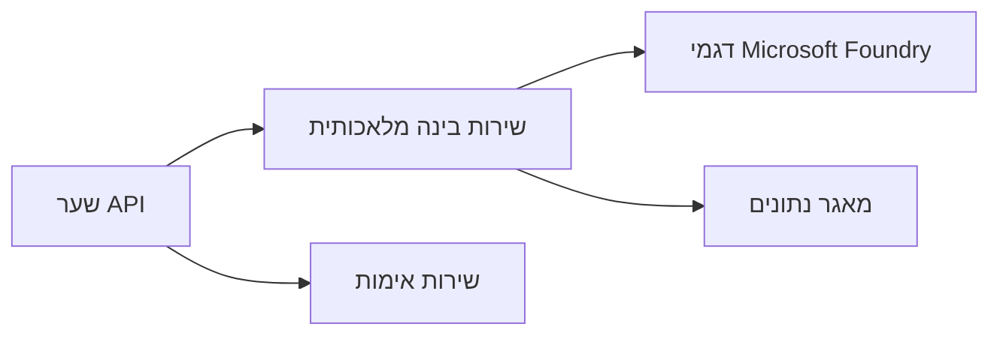
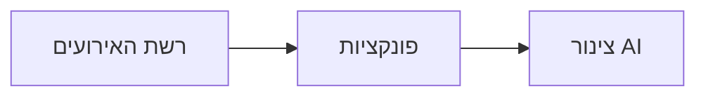

# פרק 8: תבניות ייצור וארגוניות

**📚 קורס**: [AZD למתחילים](../../README.md) | **⏱️ משך**: 2-3 שעות | **⭐ רמת קושי**: מתקדם

---

## סקירה כללית

הפרק מכסה תבניות פריסה מוכנות לארגון, הגברה של אבטחה, ניטור ואופטימיזציה של עלויות לעומסי עבודה של AI בפרודקשן.

> אומת נגד `azd 1.23.12` במרץ 2026.

## מטרות הלמידה

בסיום פרק זה, תוכלו:
- לפרוס יישומים בעלי עמידות בריבוי אזורים
- ליישם תבניות אבטחה ארגוניות
- להגדיר ניטור מקיף
- לבצע אופטימיזציה של עלויות בקנה מידה גדול
- להגדיר צינורות CI/CD עם AZD

---

## 📚 שיעורים

| # | שיעור | תיאור | זמן |
|---|--------|-------------|------|
| 1 | [שיטות AI בפרודקשן](production-ai-practices.md) | תבניות פריסה ארגוניות | 90 דק' |

---

## 🚀 רשימת בדיקה לפרודקשן

- [ ] פריסה בריבוי אזורים ליציבות
- [ ] זהות מנוהלת לאימות (ללא מפתחות)
- [ ] Application Insights לניטור
- [ ] תקציבי עלויות והתראות מוגדרים
- [ ] סריקות אבטחה מופעלות
- [ ] אינטגרציה עם צינור CI/CD
- [ ] תכנית לשחזור מאסון

---

## 🏗️ תבניות ארכיטקטורה

### תבנית 1: מיקרוסרביס AI


### תבנית 2: AI מונחה אירועים


---

## 🔐 שיטות מומלצות לאבטחה

```bicep
// Use managed identity
identity: {
  type: 'SystemAssigned'
}

// Private endpoints for AI services
properties: {
  publicNetworkAccess: 'Disabled'
  networkAcls: {
    defaultAction: 'Deny'
  }
}
```

---

## 💰 אופטימיזציה של עלויות

| אסטרטגיה | חיסכון |
|----------|---------|
| התרחבות לאפס (Container Apps) | 60-80% |
| שימוש בשכבות צריכה לסביבת פיתוח | 50-70% |
| הרחבה מתוזמנת | 30-50% |
| קיבולת שמורה | 20-40% |

```bash
# הגדר התראות תקציב
az consumption budget create \
  --budget-name "AI-Budget" \
  --amount 500 \
  --category Cost \
  --time-grain Monthly
```

---

## 📊 הגדרת ניטור

```bash
# זרם יומני רישום
azd monitor --logs

# בדוק תובנות יישום
azd monitor --overview

# הצג מדדים
az monitor metrics list --resource <resource-id>
```

---

## 🔗 ניווט

| כיוון | פרק |
|-----------|---------|
| **קודם** | [פרק 7: פתרון תקלות](../chapter-07-troubleshooting/README.md) |
| **סיום הקורס** | [דף הבית של הקורס](../../README.md) |

---

## 📖 משאבים קשורים

- [מדריך סוכני AI](../chapter-02-ai-development/agents.md)
- [Application Insights](../chapter-06-pre-deployment/application-insights.md)
- [פתרונות רב-סוכנים](../chapter-05-multi-agent/README.md)
- [דוגמת מיקרוסרביס](../../examples/microservices/README.md)

---

<!-- CO-OP TRANSLATOR DISCLAIMER START -->
**כתב ויתור**:
מסמך זה תורגם באמצעות שירות תרגום אוטומטי [Co-op Translator](https://github.com/Azure/co-op-translator). למרות שאנו שואפים לדיוק, יש להיות מודעים לכך שתרגומים אוטומטיים עשויים להכיל שגיאות או אי-דיוקים. המסמך המקורי בשפת המקור שלו ייחשב כמקור הסמכות. למידע קריטי, מומלץ תרגום מקצועי אנושי. איננו אחראים לכל אי-הבנות או פרשנויות מוטעות הנובעות מהשימוש בתרגום זה.
<!-- CO-OP TRANSLATOR DISCLAIMER END -->