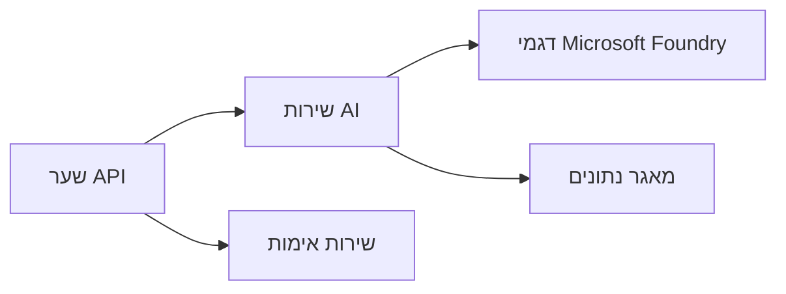
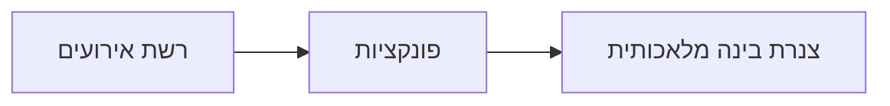

# פרק 8: תבניות ייצור וארגוניות

**📚 קורס**: [AZD למתחילים](../../README.md) | **⏱️ משך**: 2-3 שעות | **⭐ מורכבות**: מתקדמת

---

## סקירה כללית

הפרק הזה עוסק בתבניות פריסה מוכנות לארגונים, חיזוק אבטחה, ניטור ואופטימיזציה של עלויות לעומסי עבודה של AI בפרודקשן.

## יעדי הלמידה

בסיום פרק זה תוכלו:
- לפרוס יישומים עמידים ברב-אזורי
- ליישם תבניות אבטחה ארגוניות
- להגדיר ניטור מקיף
- לאופטם עלויות בהיקף
- להקים מצברי CI/CD עם AZD

---

## 📚 שיעורים

| # | שיעור | תיאור | זמן |
|---|--------|-------------|------|
| 1 | [פרקטיקות AI בפרודקשן](production-ai-practices.md) | תבניות פריסה ארגוניות | 90 דק' |

---

## 🚀 רשימת בדיקה לפרודקשן

- [ ] פריסה רב-אזורית לעמידות
- [ ] זהות מנוהלת לאימות (ללא מפתחות)
- [ ] Application Insights לניטור
- [ ] תקציבי עלויות והתראות מוגדרים
- [ ] סריקת אבטחה מופעלת
- [ ] אינטגרציה במצבר CI/CD
- [ ] תוכנית התאוששות מאסון

---

## 🏗️ תבניות ארכיטקטורה

### תבנית 1: מיקרו-שירותי AI


### תבנית 2: AI מונחה אירועים


---

## 🔐 מיטב פרקטיקות אבטחה

```bicep
// Use managed identity
identity: {
  type: 'SystemAssigned'
}

// Private endpoints for AI services
properties: {
  publicNetworkAccess: 'Disabled'
  networkAcls: {
    defaultAction: 'Deny'
  }
}
```

---

## 💰 אופטימיזציה של עלויות

| אסטרטגיה | חיסכון |
|----------|---------|
| שינוי קנה מידה לאפס (Container Apps) | 60-80% |
| שימוש בשכבות צריכה לפיתוח | 50-70% |
| שינוי קנה מידה מתוזמן | 30-50% |
| קיבולת שמורה | 20-40% |

```bash
# הגדר התראות תקציב
az consumption budget create \
  --budget-name "AI-Budget" \
  --amount 500 \
  --category Cost \
  --time-grain Monthly
```

---

## 📊 הגדרת ניטור

```bash
# הזרמת יומנים
azd monitor --logs

# בדוק את Application Insights
azd monitor

# הצג מדדים
az monitor metrics list --resource <resource-id>
```

---

## 🔗 ניווט

| כיוון | פרק |
|-----------|---------|
| **קודם** | [פרק 7: פתרון תקלות](../chapter-07-troubleshooting/README.md) |
| **סיום הקורס** | [בית הקורס](../../README.md) |

---

## 📖 משאבים קשורים

- [מדריך לסוכני AI](../chapter-02-ai-development/agents.md)
- [Application Insights](../chapter-06-pre-deployment/application-insights.md)
- [פתרונות רב-סוכניים](../chapter-05-multi-agent/README.md)
- [דוגמת מיקרו-שירותים](../../examples/microservices/README.md)

---

<!-- CO-OP TRANSLATOR DISCLAIMER START -->
**כתב ויתור**:  
מסמך זה תורגם באמצעות שירות תרגום מבוסס בינה מלאכותית [Co-op Translator](https://github.com/Azure/co-op-translator). למרות שאנו שואפים לדיוק, יש לקחת בחשבון כי תרגומים אוטומטיים עשויים להכיל שגיאות או אי-דיוקים. יש להתייחס למסמך המקורי בשפת המקור כסמכותי. עבור מידע קריטי מומלץ להיעזר בתרגום מקצועי על ידי אדם. אנו לא אחראים לכל אי-הבנה או פרשנות שגויה שנובעים משימוש בתרגום זה.
<!-- CO-OP TRANSLATOR DISCLAIMER END -->