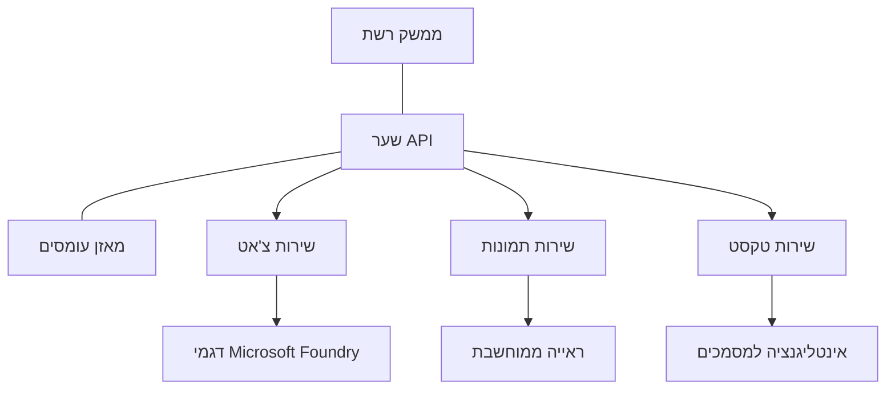

# פרקטיקות עבודה מיטביות לעומסי עבודה של AI בפרודקשן עם AZD

**ניווט פרקים:**
- **📚 דף הקורס הראשי**: [AZD למתחילים](../../README.md)
- **📖 פרק נוכחי**: פרק 8 - תבניות לפרודקשן וארגוני
- **⬅️ פרק קודם**: [פרק 7: פתרון תקלות](../chapter-07-troubleshooting/debugging.md)
- **⬅️ נושאים קשורים גם**: [מעבדת סדנת AI](ai-workshop-lab.md)
- **🎯 סיום הקורס**: [AZD למתחילים](../../README.md)

## סקירה כללית

מדריך זה מספק פרקטיקות מיטביות מקיפות לפריסה של עומסי עבודה של AI המוכנים לפרודקשן באמצעות Azure Developer CLI (AZD). בהתבסס על משוב מקהילת Microsoft Foundry Discord ומפריסות לקוחות מהעולם האמיתי, פרקטיקות אלו מתמודדות עם האתגרים השכיחים ביותר במערכות AI בפרודקשן.

## אתגרים מרכזיים מטופלים

בהתבסס על תוצאות הסקר בקהילה שלנו, אלו האתגרים העיקריים איתם מתמודדים מפתחים:

- **45%** נאבקים בפריסות AI מבוססות שירותים מרובים  
- **38%** מתקשים בניהול הרשאות וסודות  
- **35%** מתקשים בהכנת הפרודקשן ובהרחבה  
- **32%** זקוקים לאסטרטגיות אופטימיזציה טובה יותר של עלויות  
- **29%** דורשים שיפור במעקב ופתרון תקלות  

## תבניות ארכיטקטורה ל-AI בפרודקשן

### תבנית 1: ארכיטקטורת מיקרו-שירותי AI

**מתי להשתמש**: אפליקציות AI מורכבות עם יכולות מרובות


**מימוש ב-AZD**:

```yaml
# azure.yaml
name: enterprise-ai-platform
services:
  web:
    project: ./web
    host: staticwebapp
  api-gateway:
    project: ./api-gateway
    host: containerapp
  chat-service:
    project: ./services/chat
    host: containerapp
  vision-service:
    project: ./services/vision
    host: containerapp
  text-service:
    project: ./services/text
    host: containerapp
```

### תבנית 2: עיבוד מבוסס אירועים ב-AI

**מתי להשתמש**: עיבוד קבוצות, ניתוח מסמכים, תהליכים אסינכרוניים

```bicep
// Event Hub for AI processing pipeline
resource eventHub 'Microsoft.EventHub/namespaces@2023-01-01-preview' = {
  name: eventHubNamespaceName
  location: location
  sku: {
    name: 'Standard'
    tier: 'Standard'
    capacity: 1
  }
}

// Service Bus for reliable message processing
resource serviceBus 'Microsoft.ServiceBus/namespaces@2022-10-01-preview' = {
  name: serviceBusNamespaceName
  location: location
  sku: {
    name: 'Premium'
    tier: 'Premium'
    capacity: 1
  }
}

// Function App for processing
resource functionApp 'Microsoft.Web/sites@2023-01-01' = {
  name: functionAppName
  location: location
  kind: 'functionapp,linux'
  properties: {
    siteConfig: {
      appSettings: [
        {
          name: 'FUNCTIONS_EXTENSION_VERSION'
          value: '~4'
        }
        {
          name: 'AZURE_OPENAI_ENDPOINT'
          value: '@Microsoft.KeyVault(VaultName=${keyVault.name};SecretName=openai-endpoint)'
        }
      ]
    }
  }
}
```

## מחשבות על בריאות הסוכן ב-AI

כאשר אפליקציית ווב מסורתית קורסת, הסימפטומים מוכרים: דף לא נטען, API מחזיר שגיאה, או פריסה נכשלת. אפליקציות המופעלות על ידי AI יכולות להתקלקל באותם דרכים – אך גם לנהוג בדרכים מתוחכמות יותר ללא הודעות שגיאה ברורות.

סעיף זה עוזר לך לבנות מודל מנטלי למעקב אחר עומסי AI כדי שתדע היכן לבדוק כשהדברים נראים לא כשורה.

### כיצד בריאות הסוכן שונה מבריאות אפליקציה מסורתית

אפליקציה מסורתית פועלת או לא פועלת. סוכן AI יכול להיראות כמו עובד אך לתת תוצאות רעות. חשוב להבין את בריאות הסוכן בשתי שכבות:

| שכבה | מה לעקוב | איפה לבדוק |
|-------|------------|-------------|
| **בריאות התשתית** | האם השירות פועל? האם משאבים מסופקים? האם נקודות הקצה נגישות? | `azd monitor`, בריאות משאבים בפורטל Azure, יומני מכולות/אפליקציה |
| **בריאות התנהגותית** | האם הסוכן מגיב במדויק? האם התגובות בזמן? האם קריאת המודל תקינה? | עקבות Application Insights, מדדי השהיית קריאות למודל, יומני איכות תגובות |

בריאות התשתית מוכרת – זהה לכל אפליקציית azd. בריאות התנהגותית היא השכבה החדשה שעומסי עבודה של AI מציגים.

### איפה לבדוק כשאפליקציות AI אינן מתנהגות כמצופה

אם האפליקציה שלך לא מניבה את התוצאות הצפויות, הנה רשימת בדיקה קונספטואלית:

1. **התחל מיסודות.** האם האפליקציה פועלת? האם היא מגיעה לתלותות שלה? בדוק `azd monitor` ובריאות משאבים כמו באפליקציה רגילה.  
2. **בדוק את חיבור המודל.** האם האפליקציה שלך מצליחה לקרוא למודל ה-AI? קריאות למודל שנכשלו או שפג תכנן הזמן הן הגורם השכיח ביותר לבעיות AI ויופיעו ביומני האפליקציה.  
3. **בדוק מה המודל קיבל.** תגובות AI תלויות בקלט (הפרומפט והקשר שנשלף). אם הפלט שגוי, הקלט בדרך כלל שגוי. בדוק האם האפליקציה שלך שולחת את הנתונים הנכונים למודל.  
4. **סקור את השהיית התגובה.** קריאות למודל AI איטיות יותר מקריאות API רגילות. אם האפליקציה נראית איטית, בדוק אם זמני תגובה למודל גדלו – זה יכול להעיד על צווארי בקבוק, מגבלות קיבולת, או עומס ברמה אזורית.  
5. **עקוב אחרי אותות עלות.** זינוקים בלתי צפויים בשימוש בטוקנים או קריאות API יכולים להעיד על לולאה, פרומפט לא מכוון, או ניסיונות חוזרים מופרזים.  

אין צורך לשלוט מיד בכלי הניטור באופן מלא. המסקנה המרכזית היא שלאפליקציות AI יש שכבה נוספת של התנהגות לעקוב אחריה, ו`azd monitor` מספק נקודת התחלה לחקירת שתי השכבות.

---

## פרקטיקות אבטחה מיטביות

### 1. מודל אבטחה של Zero-Trust

**אסטרטגיית מימוש**:
- אין תקשורת שירות-לשירות ללא אימות  
- כל קריאות ה-API משתמשות בזהויות מנוהלות  
- בידוד רשת עם נקודות קצה פרטיות  
- בקרות גישת מינימום זכויות  

```bicep
// Managed Identity for each service
resource chatServiceIdentity 'Microsoft.ManagedIdentity/userAssignedIdentities@2023-01-31' = {
  name: 'chat-service-identity'
  location: location
}

// Role assignments with minimal permissions
resource openAIUserRole 'Microsoft.Authorization/roleAssignments@2022-04-01' = {
  scope: openAIAccount
  name: guid(openAIAccount.id, chatServiceIdentity.id, openAIUserRoleDefinitionId)
  properties: {
    roleDefinitionId: subscriptionResourceId('Microsoft.Authorization/roleDefinitions', '5e0bd9bd-7b93-4f28-af87-19fc36ad61bd')
    principalId: chatServiceIdentity.properties.principalId
    principalType: 'ServicePrincipal'
  }
}
```

### 2. ניהול סודות מאובטח

**תבנית שילוב Key Vault**:

```bicep
// Key Vault with proper access policies
resource keyVault 'Microsoft.KeyVault/vaults@2023-02-01' = {
  name: keyVaultName
  location: location
  properties: {
    tenantId: tenant().tenantId
    sku: {
      family: 'A'
      name: 'premium'  // Use premium for production
    }
    enableRbacAuthorization: true  // Use RBAC instead of access policies
    enablePurgeProtection: true    // Prevent accidental deletion
    enableSoftDelete: true
    softDeleteRetentionInDays: 90
  }
}

// Store all AI service credentials
resource openAIKeySecret 'Microsoft.KeyVault/vaults/secrets@2023-02-01' = {
  parent: keyVault
  name: 'openai-api-key'
  properties: {
    value: openAIAccount.listKeys().key1
    attributes: {
      enabled: true
    }
  }
}
```

### 3. אבטחת רשת

**קונפיגורציית נקודת קצה פרטית**:

```bicep
// Virtual Network for AI services
resource virtualNetwork 'Microsoft.Network/virtualNetworks@2023-04-01' = {
  name: vnetName
  location: location
  properties: {
    addressSpace: {
      addressPrefixes: ['10.0.0.0/16']
    }
    subnets: [
      {
        name: 'ai-services-subnet'
        properties: {
          addressPrefix: '10.0.1.0/24'
          privateEndpointNetworkPolicies: 'Disabled'
        }
      }
      {
        name: 'app-services-subnet'
        properties: {
          addressPrefix: '10.0.2.0/24'
          delegations: [
            {
              name: 'Microsoft.Web/serverFarms'
              properties: {
                serviceName: 'Microsoft.Web/serverFarms'
              }
            }
          ]
        }
      }
    ]
  }
}

// Private endpoints for all AI services
resource openAIPrivateEndpoint 'Microsoft.Network/privateEndpoints@2023-04-01' = {
  name: '${openAIAccountName}-pe'
  location: location
  properties: {
    subnet: {
      id: virtualNetwork.properties.subnets[0].id
    }
    privateLinkServiceConnections: [
      {
        name: 'openai-connection'
        properties: {
          privateLinkServiceId: openAIAccount.id
          groupIds: ['account']
        }
      }
    ]
  }
}
```

## ביצועים והרחבה

### 1. אסטרטגיות להרחבה אוטומטית

**Auto-scaling עבור אפליקציות מכולות**:

```bicep
resource containerApp 'Microsoft.App/containerApps@2023-05-01' = {
  name: containerAppName
  location: location
  properties: {
    configuration: {
      ingress: {
        external: true
        targetPort: 8000
        transport: 'http'
      }
    }
    template: {
      scale: {
        minReplicas: 2  // Always have 2 instances minimum
        maxReplicas: 50 // Scale up to 50 for high load
        rules: [
          {
            name: 'http-scaling'
            http: {
              metadata: {
                concurrentRequests: '20'  // Scale when >20 concurrent requests
              }
            }
          }
          {
            name: 'cpu-scaling'
            custom: {
              type: 'cpu'
              metadata: {
                type: 'Utilization'
                value: '70'  // Scale when CPU >70%
              }
            }
          }
        ]
      }
    }
  }
}
```

### 2. אסטרטגיות מטמון

**Redis Cache לתגובות AI**:

```bicep
// Redis Premium for production workloads
resource redisCache 'Microsoft.Cache/redis@2023-04-01' = {
  name: redisCacheName
  location: location
  properties: {
    sku: {
      name: 'Premium'
      family: 'P'
      capacity: 1
    }
    enableNonSslPort: false
    minimumTlsVersion: '1.2'
    redisConfiguration: {
      'maxmemory-policy': 'allkeys-lru'
    }
    // Enable clustering for high availability
    redisVersion: '6.0'
    shardCount: 2
  }
}

// Cache configuration in application
var cacheConnectionString = '${redisCache.properties.hostName}:6380,password=${redisCache.listKeys().primaryKey},ssl=True,abortConnect=False'
```

### 3. ניהול עומס ותעבורה

**Application Gateway עם WAF**:

```bicep
// Application Gateway with Web Application Firewall
resource applicationGateway 'Microsoft.Network/applicationGateways@2023-04-01' = {
  name: appGatewayName
  location: location
  properties: {
    sku: {
      name: 'WAF_v2'
      tier: 'WAF_v2'
      capacity: 2
    }
    webApplicationFirewallConfiguration: {
      enabled: true
      firewallMode: 'Prevention'
      ruleSetType: 'OWASP'
      ruleSetVersion: '3.2'
    }
    // Backend pools for AI services
    backendAddressPools: [
      {
        name: 'ai-services-pool'
        properties: {
          backendAddresses: [
            {
              fqdn: '${containerApp.properties.configuration.ingress.fqdn}'
            }
          ]
        }
      }
    ]
  }
}
```

## 💰 אופטימיזציה של עלויות

### 1. התאמת גודל משאבים

**קונפיגורציות ייעודיות לסביבה**:

```bash
# סביבת פיתוח
azd env new development
azd env set AZURE_OPENAI_SKU "S0"
azd env set AZURE_OPENAI_CAPACITY 10
azd env set AZURE_SEARCH_SKU "basic"
azd env set CONTAINER_CPU 0.5
azd env set CONTAINER_MEMORY 1.0

# סביבת ייצור
azd env new production
azd env set AZURE_OPENAI_SKU "S0"
azd env set AZURE_OPENAI_CAPACITY 100
azd env set AZURE_SEARCH_SKU "standard"
azd env set CONTAINER_CPU 2.0
azd env set CONTAINER_MEMORY 4.0
```

### 2. ניטור עלויות ותקציבים

```bicep
// Cost management and budgets
resource budget 'Microsoft.Consumption/budgets@2023-05-01' = {
  name: 'ai-workload-budget'
  properties: {
    timePeriod: {
      startDate: '2024-01-01'
      endDate: '2024-12-31'
    }
    timeGrain: 'Monthly'
    amount: 2000  // $2000 monthly budget
    category: 'Cost'
    notifications: {
      warning: {
        enabled: true
        operator: 'GreaterThan'
        threshold: 80
        contactEmails: [
          'finance@company.com'
          'engineering@company.com'
        ]
        contactRoles: [
          'Owner'
          'Contributor'
        ]
      }
      critical: {
        enabled: true
        operator: 'GreaterThan'
        threshold: 95
        contactEmails: [
          'cto@company.com'
        ]
      }
    }
  }
}
```

### 3. אופטימיזציה בשימוש בטוקנים

**ניהול עלויות OpenAI**:

```typescript
// אופטימיזציה של טוקנים ברמת האפליקציה
class TokenOptimizer {
  private readonly maxTokens = 4000;
  private readonly reserveTokens = 500;
  
  optimizePrompt(userInput: string, context: string): string {
    const availableTokens = this.maxTokens - this.reserveTokens;
    const estimatedTokens = this.estimateTokens(userInput + context);
    
    if (estimatedTokens > availableTokens) {
      // קיצוץ ההקשר, לא את קלט המשתמש
      context = this.truncateContext(context, availableTokens - this.estimateTokens(userInput));
    }
    
    return `${context}\n\nUser: ${userInput}`;
  }
  
  private estimateTokens(text: string): number {
    // הערכה גסה: טוקן אחד ≈ 4 תווים
    return Math.ceil(text.length / 4);
  }
}
```

## ניטור ותצפית

### 1. Application Insights מקיף

```bicep
// Application Insights with advanced features
resource applicationInsights 'Microsoft.Insights/components@2020-02-02' = {
  name: applicationInsightsName
  location: location
  kind: 'web'
  properties: {
    Application_Type: 'web'
    WorkspaceResourceId: logAnalyticsWorkspace.id
    SamplingPercentage: 100  // Full sampling for AI apps
    DisableIpMasking: false  // Enable for security
  }
}

// Custom metrics for AI operations
resource aiMetricAlerts 'Microsoft.Insights/metricAlerts@2018-03-01' = {
  name: 'ai-high-error-rate'
  location: 'global'
  properties: {
    description: 'Alert when AI service error rate is high'
    severity: 2
    enabled: true
    scopes: [
      applicationInsights.id
    ]
    evaluationFrequency: 'PT1M'
    windowSize: 'PT5M'
    criteria: {
      'odata.type': 'Microsoft.Azure.Monitor.SingleResourceMultipleMetricCriteria'
      allOf: [
        {
          name: 'high-error-rate'
          metricName: 'requests/failed'
          operator: 'GreaterThan'
          threshold: 10
          timeAggregation: 'Count'
        }
      ]
    }
  }
}
```

### 2. ניטור ייעודי ל-AI

**לוחות מחוונים מותאמים למדדי AI**:

```json
// Dashboard configuration for AI workloads
{
  "dashboard": {
    "name": "AI Application Monitoring",
    "tiles": [
      {
        "name": "OpenAI Request Volume",
        "query": "requests | where name contains 'openai' | summarize count() by bin(timestamp, 5m)"
      },
      {
        "name": "AI Response Latency",
        "query": "requests | where name contains 'openai' | summarize avg(duration) by bin(timestamp, 5m)"
      },
      {
        "name": "Token Usage",
        "query": "customMetrics | where name == 'openai_tokens_used' | summarize sum(value) by bin(timestamp, 1h)"
      },
      {
        "name": "Cost per Hour",
        "query": "customMetrics | where name == 'openai_cost' | summarize sum(value) by bin(timestamp, 1h)"
      }
    ]
  }
}
```

### 3. בדיקות בריאות ומעקב זמינות

```bicep
// Application Insights availability tests
resource availabilityTest 'Microsoft.Insights/webtests@2022-06-15' = {
  name: 'ai-app-availability-test'
  location: location
  tags: {
    'hidden-link:${applicationInsights.id}': 'Resource'
  }
  properties: {
    SyntheticMonitorId: 'ai-app-availability-test'
    Name: 'AI Application Availability Test'
    Description: 'Tests AI application endpoints'
    Enabled: true
    Frequency: 300  // 5 minutes
    Timeout: 120    // 2 minutes
    Kind: 'ping'
    Locations: [
      {
        Id: 'us-east-2-azr'
      }
      {
        Id: 'us-west-2-azr'
      }
    ]
    Configuration: {
      WebTest: '''
        <WebTest Name="AI Health Check" 
                 Id="8d2de8d2-a2b0-4c2e-9a0d-8f9c9a0b8c8d" 
                 Enabled="True" 
                 CssProjectStructure="" 
                 CssIteration="" 
                 Timeout="120" 
                 WorkItemIds="" 
                 xmlns="http://microsoft.com/schemas/VisualStudio/TeamTest/2010" 
                 Description="" 
                 CredentialUserName="" 
                 CredentialPassword="" 
                 PreAuthenticate="True" 
                 Proxy="default" 
                 StopOnError="False" 
                 RecordedResultFile="" 
                 ResultsLocale="">
          <Items>
            <Request Method="GET" 
                     Guid="a5f10126-e4cd-570d-961c-cea43999a200" 
                     Version="1.1" 
                     Url="${webApp.properties.defaultHostName}/health" 
                     ThinkTime="0" 
                     Timeout="120" 
                     ParseDependentRequests="True" 
                     FollowRedirects="True" 
                     RecordResult="True" 
                     Cache="False" 
                     ResponseTimeGoal="0" 
                     Encoding="utf-8" 
                     ExpectedHttpStatusCode="200" 
                     ExpectedResponseUrl="" 
                     ReportingName="" 
                     IgnoreHttpStatusCode="False" />
          </Items>
        </WebTest>
      '''
    }
  }
}
```

## שחזור מאסון וזמינות גבוהה

### 1. פריסה בריבוי אזורים

```yaml
# azure.yaml - Multi-region configuration
name: ai-app-multiregion
services:
  api-primary:
    project: ./api
    host: containerapp
    env:
      - AZURE_REGION=eastus
  api-secondary:
    project: ./api
    host: containerapp
    env:
      - AZURE_REGION=westus2
```

```bicep
// Traffic Manager for global load balancing
resource trafficManager 'Microsoft.Network/trafficManagerProfiles@2022-04-01' = {
  name: trafficManagerProfileName
  location: 'global'
  properties: {
    profileStatus: 'Enabled'
    trafficRoutingMethod: 'Priority'
    dnsConfig: {
      relativeName: trafficManagerProfileName
      ttl: 30
    }
    monitorConfig: {
      protocol: 'HTTPS'
      port: 443
      path: '/health'
      intervalInSeconds: 30
      toleratedNumberOfFailures: 3
      timeoutInSeconds: 10
    }
    endpoints: [
      {
        name: 'primary-endpoint'
        type: 'Microsoft.Network/trafficManagerProfiles/azureEndpoints'
        properties: {
          targetResourceId: primaryAppService.id
          endpointStatus: 'Enabled'
          priority: 1
        }
      }
      {
        name: 'secondary-endpoint'
        type: 'Microsoft.Network/trafficManagerProfiles/azureEndpoints'
        properties: {
          targetResourceId: secondaryAppService.id
          endpointStatus: 'Enabled'
          priority: 2
        }
      }
    ]
  }
}
```

### 2. גיבוי ושחזור נתונים

```bicep
// Backup configuration for critical data
resource backupVault 'Microsoft.DataProtection/backupVaults@2023-05-01' = {
  name: backupVaultName
  location: location
  identity: {
    type: 'SystemAssigned'
  }
  properties: {
    storageSettings: [
      {
        datastoreType: 'VaultStore'
        type: 'LocallyRedundant'
      }
    ]
  }
}

// Backup policy for AI models and data
resource backupPolicy 'Microsoft.DataProtection/backupVaults/backupPolicies@2023-05-01' = {
  parent: backupVault
  name: 'ai-data-backup-policy'
  properties: {
    policyRules: [
      {
        backupParameters: {
          backupType: 'Full'
          objectType: 'AzureBackupParams'
        }
        trigger: {
          schedule: {
            repeatingTimeIntervals: [
              'R/2024-01-01T02:00:00+00:00/P1D'  // Daily at 2 AM
            ]
          }
          objectType: 'ScheduleBasedTriggerContext'
        }
        dataStore: {
          datastoreType: 'VaultStore'
          objectType: 'DataStoreInfoBase'
        }
        name: 'BackupDaily'
        objectType: 'AzureBackupRule'
      }
    ]
  }
}
```

## אינטגרציה עם DevOps ו-CI/CD

### 1. זרימת עבודה עם GitHub Actions

```yaml
# .github/workflows/deploy-ai-app.yml
name: Deploy AI Application

on:
  push:
    branches: [main]
  pull_request:
    branches: [main]

jobs:
  test:
    runs-on: ubuntu-latest
    steps:
      - uses: actions/checkout@v4
      
      - name: Setup Python
        uses: actions/setup-python@v4
        with:
          python-version: '3.11'
          
      - name: Install dependencies
        run: |
          pip install -r requirements.txt
          pip install pytest
          
      - name: Run tests
        run: pytest tests/
        
      - name: AI Safety Tests
        run: |
          python scripts/test_ai_safety.py
          python scripts/validate_prompts.py

  deploy-staging:
    needs: test
    if: github.event_name == 'pull_request'
    runs-on: ubuntu-latest
    steps:
      - uses: actions/checkout@v4
      
      - name: Setup AZD
        uses: Azure/setup-azd@v2
        
      - name: Login to Azure
        uses: azure/login@v1
        with:
          creds: ${{ secrets.AZURE_CREDENTIALS }}
          
      - name: Deploy to Staging
        run: |
          azd env select staging
          azd deploy

  deploy-production:
    needs: test
    if: github.ref == 'refs/heads/main'
    runs-on: ubuntu-latest
    steps:
      - uses: actions/checkout@v4
      
      - name: Setup AZD
        uses: Azure/setup-azd@v2
        
      - name: Login to Azure
        uses: azure/login@v1
        with:
          creds: ${{ secrets.AZURE_CREDENTIALS }}
          
      - name: Deploy to Production
        run: |
          azd env select production
          azd deploy
          
      - name: Run Production Health Checks
        run: |
          python scripts/health_check.py --env production
```

### 2. אימות תשתית

```bash
# scripts/validate_infrastructure.sh
#!/bin/bash

echo "Validating AI infrastructure deployment..."

# לבדוק אם כל השירותים הדרושים פועלים
services=("openai" "search" "storage" "keyvault")
for service in "${services[@]}"; do
    echo "Checking $service..."
    if ! az resource list --resource-type "Microsoft.CognitiveServices/accounts" --query "[?contains(name, '$service')]" -o tsv; then
        echo "ERROR: $service not found"
        exit 1
    fi
done

# לוודא פריסות מודלים של OpenAI
echo "Validating OpenAI model deployments..."
models=$(az cognitiveservices account deployment list --name $AZURE_OPENAI_NAME --resource-group $AZURE_RESOURCE_GROUP --query "[].name" -o tsv)
if [[ ! $models == *"gpt-4.1-mini"* ]]; then
  echo "ERROR: Required model gpt-4.1-mini not deployed"
    exit 1
fi

# לבדוק את חיבור שירות ה-AI
echo "Testing AI service connectivity..."
python scripts/test_connectivity.py

echo "Infrastructure validation completed successfully!"
```

## רשימת בדיקה למוכנות פרודקשן

### אבטחה ✅
- [ ] כל השירותים משתמשים בזהויות מנוהלות  
- [ ] סודות מאוחסנים ב-Key Vault  
- [ ] נקודות קצה פרטיות מוגדרות  
- [ ] קבוצות אבטחת רשת מיושמות  
- [ ] RBAC עם מינימום זכויות  
- [ ] WAF מופעל על נקודות קצה ציבוריות  

### ביצועים ✅
- [ ] Auto-scaling מוגדר  
- [ ] מטמון מיושם  
- [ ] איזון עומסים מוגדר  
- [ ] CDN לתוכן סטטי  
- [ ] צבירה חיבורים למסד הנתונים  
- [ ] אופטימיזציית שימוש בטוקנים  

### ניטור ✅
- [ ] Application Insights מוגדר  
- [ ] מדדים מותאמים מוגדרים  
- [ ] כללי התראות מוגדרים  
- [ ] לוח מחוונים נוצר  
- [ ] בדיקות בריאות מיושמות  
- [ ] מדיניות שמירת יומנים  

### אמינות ✅
- [ ] פריסה בריבוי אזורים  
- [ ] תוכנית גיבוי ושחזור  
- [ ] מיישום של שבירות מעגל  
- [ ] מדיניות ניסיונות חוזרים מוגדרות  
- [ ] הדרגה הדרגתית  
- [ ] נקודות קצה לבדיקות בריאות  

### ניהול עלויות ✅
- [ ] התראות תקציב מוגדרות  
- [ ] התאמת גודל משאבים  
- [ ] הנחות למפתחים/בדיקות  
- [ ] רכישת מופעים שמורים  
- [ ] לוח מחוונים לניטור עלויות  
- [ ] סקירת עלויות סדירות  

### תאימות ✅
- [ ] עמידה בדרישות רזידנטיות נתונים  
- [ ] הפעלת יומן ביקורת  
- [ ] יישום מדיניות תאימות  
- [ ] בסיסי אבטחה מיושמים  
- [ ] הערכות אבטחה סדירות  
- [ ] תוכנית תגובה לאירועים  

## מדדי ביצועים

### מדדי פרודקשן טיפוסיים

| מדד | יעד | ניטור |
|--------|--------|------------|
| **זמן תגובה** | < 2 שניות | Application Insights |
| **זמינות** | 99.9% | ניטור זמינות |
| **שיעור שגיאות** | < 0.1% | יומני אפליקציה |
| **שימוש בטוקנים** | < $500 לחודש | ניהול עלויות |
| **משתמשים בו זמנית** | 1000+ | בדיקות עומס |
| **זמן התאוששות** | < שעתיים | מבחני שחזור מאסון |

### בדיקות עומס

```bash
# סקריפט בדיקות עומס ליישומי בינה מלאכותית
python scripts/load_test.py \
  --endpoint https://your-ai-app.azurewebsites.net \
  --concurrent-users 100 \
  --duration 300 \
  --ramp-up 60
```

## 🤝 פרקטיקות מיטביות מהקהילה

בהתבסס על משוב מקהילת Microsoft Foundry Discord:

### ההמלצות המובילות מהקהילה:

1. **התחל קטן, הרחב בהדרגה**: התחל עם SKUs בסיסיים והרחב לפי שימוש בפועל  
2. **עקוב אחרי הכל**: הגדר ניטור מקיף מהיום הראשון  
3. **אוטומציה של אבטחה**: השתמש בתשתית כקוד לאבטחה עקבית  
4. **בצע בדיקות מקיפות**: כלל בדיקות ייעודיות ל-AI בצינור  
5. **תכנן עלויות מראש**: עקוב אחרי שימוש בטוקנים והגדר התראות תקציב מוקדם  

### טפלים נפוצים להימנע מהם:

- ❌ קידוד מפתחות API ישירות בקוד  
- ❌ אי-הגדרת ניטור נאות  
- ❌ התעלמות מאופטימיזציה של עלויות  
- ❌ חוסר בבדיקות תרחישי כשל  
- ❌ פריסה ללא בדיקות בריאות  

## פקודות והרחבות AZD AI CLI

AZD כולל סט מתרחב של פקודות והרחבות ספציפיות ל-AI שמייעלות את זרימות העבודה של AI בפרודקשן. כלים אלו יוצרים גשר בין פיתוח מקומי לפריסה בפרודקשן של עומסי AI.

### הרחבות AZD ל-AI

AZD משתמש במערכת הרחבות להוספת יכולות ייעודיות ל-AI. התקן ונהל הרחבות עם:

```bash
# רשום את כל התוספים הזמינים (כולל AI)
azd extension list

# בדוק פרטים של התוסף המותקן
azd extension show azure.ai.agents

# התקן את תוסף סוכני Foundry
azd extension install azure.ai.agents

# התקן את תוסף הכוונון המדויק
azd extension install azure.ai.finetune

# התקן את תוסף הדגמים המותאמים אישית
azd extension install azure.ai.models

# שדרג את כל התוספים המותקנים
azd extension upgrade --all
```

**הרחבות AI זמינות:**

| הרחבה | מטרה | סטטוס |
|-----------|---------|--------|
| `azure.ai.agents` | ניהול שירות סוכני Foundry | בתצוגה מוקדמת |
| `azure.ai.finetune` | כוונון דגמי Foundry | בתצוגה מוקדמת |
| `azure.ai.models` | דגמים מותאמים אישית של Foundry | בתצוגה מוקדמת |
| `azure.coding-agent` | קונפיגורציית סוכן קידוד | זמין |

### אתחול פרויקטי סוכנים עם `azd ai agent init`

הפקודה `azd ai agent init` יוצרת פרויקט סוכן AI מוכן לפרודקשן המשולב עם Microsoft Foundry Agent Service:

```bash
# אתחל פרויקט סוכן חדש ממניפסט סוכן
azd ai agent init -m <manifest-path-or-uri>

# אתחל ויעד פרויקט Foundry ספציפי
azd ai agent init -m agent-manifest.yaml --project-id <foundry-project-id>

# אתחל עם תיקיית מקור מותאמת אישית
azd ai agent init -m agent-manifest.yaml --src ./agents/my-agent

# יעד אפליקציות מכולה כמארח
azd ai agent init -m agent-manifest.yaml --host containerapp
```

**דגלים מרכזיים:**

| דגל | תיאור |
|------|-------------|
| `-m, --manifest` | נתיב או URI למניפסט סוכן להוספה לפרויקט שלך |
| `-p, --project-id` | מזהה פרויקט Microsoft Foundry קיים לסביבת azd שלך |
| `-s, --src` | תיקייה להורדת הגדרת הסוכן (ברירת מחדל `src/<agent-id>`) |
| `--host` | החלפת אירוח ברירת מחדל (למשל `containerapp`) |
| `-e, --environment` | סביבת azd לשימוש |

**טיפ לפרודקשן**: השתמש ב-`--project-id` כדי להתחבר ישירות לפרויקט Foundry קיים, וכך לשמור על קוד הסוכן ומשאבי הענן מקושרים מההתחלה.

### פרוטוקול הקשר מודל (MCP) עם `azd mcp`

AZD כולל תמיכה מובנית בשרת MCP (בטא), שמאפשר לסוכני AI וכלים להתמודד עם משאבי Azure שלך דרך פרוטוקול סטנדרטי:

```bash
# הפעל את שרת MCP עבור הפרויקט שלך
azd mcp start

# בדוק את כללי ההסכמה הנוכחיים של Copilot לביצוע כלים
azd copilot consent list
```

שרת MCP חושף את הקשר לפרויקט azd שלך – סביבות, שירותים ומשאבי Azure – לכלי פיתוח מופעלים ב-AI. זה מאפשר:

- **פריסה בסיוע AI**: לאפשר לסוכני קידוד לשאול על מצב הפרויקט ולהפעיל פריסות  
- **גילוי משאבים**: כלים מבוססי AI יכולים לגלות אילו משאבי Azure הפרויקט שלך משתמש  
- **ניהול סביבות**: סוכנים יכולים לעבור בין סביבות פיתוח/בדיקה/פרודקשן  

### יצירת תשתית עם `azd infra generate`

לעומסי עבודה של AI בפרודקשן, אתה יכול לייצר ולהתאים אישית תשתית כקוד במקום להסתמך על פריסה אוטומטית:

```bash
# יצירת קבצי Bicep/Terraform מתוך הגדרת הפרויקט שלך
azd infra generate
```

זה כותב IaC לדיסק כך שתוכל:
- לסקור ולבקר את התשתית לפני פריסה  
- להוסיף מדיניות אבטחה מותאמת (כללי רשת, נקודות קצה פרטיות)  
- להשתלב בתהליכי ביקורת IaC קיימים  
- לשלוט בגרסאות שינויים בתשתית בנפרד מהקוד  

### קריאות מחזור חיי פרודקשן

אפשרויות "hook" ב-AZD מאפשרות להזריק לוגיקה מותאמת בכל שלב במחזור החיים של הפריסה – קריטי לעומסי AI בפרודקשן:

```yaml
# azure.yaml - Production hooks example
name: ai-production-app
hooks:
  preprovision:
    shell: sh
    run: scripts/validate-quotas.sh    # Check AI model quota before provisioning
  postprovision:
    shell: sh
    run: scripts/configure-networking.sh  # Set up private endpoints
  predeploy:
    shell: sh
    run: scripts/run-ai-safety-tests.sh  # Run prompt safety checks
  postdeploy:
    shell: sh
    run: scripts/smoke-test.sh           # Verify agent responses post-deploy
services:
  agent-api:
    project: ./src/agent
    host: containerapp
    hooks:
      predeploy:
        shell: sh
        run: scripts/validate-model-access.sh  # Per-service hook
```

```bash
# הפעל ווּק מסוים באופן ידני במהלך הפיתוח
azd hooks run predeploy
```

**קריאות מומלצות לפרודקשן לעומסי AI:**

| קריאה | מקרה שימוש |
|-------|-------------|
| `preprovision` | אימות מכסי מנוי לקיבולת מודלים של AI |
| `postprovision` | הגדרת נקודות קצה פרטיות, פריסת משקלי מודלים |
| `predeploy` | הרצת בדיקות בטיחות AI, אימות תבניות פרומפט |
| `postdeploy` | בדיקת סיגריות לתגובות סוכן, אימות קישוריות מודל |

### קונפיגורציית צנרת CI/CD

השתמש ב-`azd pipeline config` כדי לקשר את הפרויקט ל-GitHub Actions או Azure Pipelines עם אימות מאובטח מצד Azure:

```bash
# הגדר צינור CI/CD (אינטראקטיבי)
azd pipeline config

# הגדר עם ספק מסוים
azd pipeline config --provider github
```

פקודה זו:
- יוצרת שירות משתמש עם גישת מינימום זכויות  
- מגדירה הרשאות פדרציה (ללא סודות מאוחסנים)  
- מייצרת או מעדכנת את קובץ הגדרת הצנרת שלך  
- מגדירה משתני סביבה נדרשים במערכת ה-CI/CD שלך  

**זרימת עבודה לפרודקשן עם קונפיגורציית הצנרת:**

```bash
# 1. הקמת סביבת ייצור
azd env new production
azd env set AZURE_OPENAI_CAPACITY 100

# 2. קביעת הקונפיגורציה של הצינור
azd pipeline config --provider github

# 3. הצינור מריץ azd deploy בכל לחיצה על main
```

### הוספת רכיבים עם `azd add`

הוסף בהדרגה שירותי Azure לפרויקט קיים:

```bash
# הוסף רכיב שירות חדש בצורה אינטראקטיבית
azd add
```

שיטה זו שימושית במיוחד להרחבת אפליקציות AI בפרודקשן — לדוגמה, הוספת שירות חיפוש וקטורי, נקודת קצה סוכן חדשה, או רכיב ניטור לפריסה קיימת.

## משאבים נוספים
- **מסגרת Azure Well-Architected**: [הנחיות לעומסי עבודה של AI](https://learn.microsoft.com/azure/well-architected/ai/)
- **תיעוד Microsoft Foundry**: [מסמכים רשמיים](https://learn.microsoft.com/azure/ai-studio/)
- **תבניות קהילתיות**: [דוגמאות Azure](https://github.com/Azure-Samples)
- **קהילת Discord**: [ערוץ #Azure](https://discord.gg/microsoft-azure)
- **כישורים לסוכנים עבור Azure**: [microsoft/github-copilot-for-azure ב-skills.sh](https://skills.sh/microsoft/github-copilot-for-azure) - 37 כישורי סוכן פתוחים עבור Azure AI, Foundry, פריסה, אופטימיזציית עלויות ואבחון. התקן בעורך שלך:
  ```bash
  npx skills add microsoft/github-copilot-for-azure
  ```

---

**ניווט בפרק:**
- **📚 דף הבית של הקורס**: [AZD למתחילים](../../README.md)
- **📖 הפרק הנוכחי**: פרק 8 - דפוסי ייצור וארגוניים
- **⬅️ הפרק הקודם**: [פרק 7: פתרון תקלות](../chapter-07-troubleshooting/debugging.md)
- **⬅️ גם קשור**: [מעבדת סדנת AI](ai-workshop-lab.md)
- **� הקורס הושלם**: [AZD למתחילים](../../README.md)

**זכור**: עומסי עבודה של AI בייצור דורשים תכנון מוקפד, ניטור ואופטימיזציה מתמשכת. התחל עם דפוסים אלה והתאם אותם לדרישות הספציפיות שלך.

---

<!-- CO-OP TRANSLATOR DISCLAIMER START -->
**כתב ויתור**:  
מסמך זה תורגם באמצעות שירות תרגום מבוסס בינה מלאכותית [Co-op Translator](https://github.com/Azure/co-op-translator). למרות שאנו מתאמצים לדייק, יש לקחת בחשבון שתרגומים אוטומטיים עלולים להכיל שגיאות או אי דיוקים. יש להסתמך על המסמך המקורי בשפת המקור כמקור הסמכות. למידע קריטי מומלץ תרגום מקצועי על ידי אדם. איננו אחראים לכל אי הבנות או פרשנויות שגויות הנובעות משימוש בתרגום זה.
<!-- CO-OP TRANSLATOR DISCLAIMER END -->