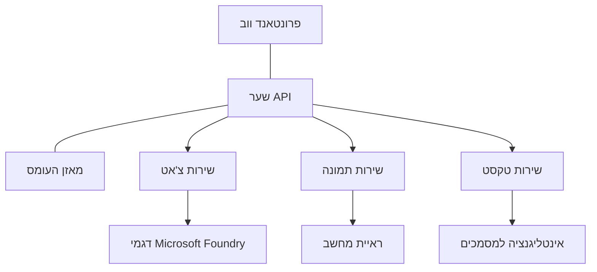

# שיטות עבודה מומלצות לעומסי עבודה של AI בייצור עם AZD

**ניווט בפרקים:**
- **📚 דף הבית של הקורס**: [AZD למתחילים](../../README.md)
- **📖 פרק נוכחי**: פרק 8 - דפוסים לייצור וארגוניים
- **⬅️ פרק קודם**: [פרק 7: איתור ותיקון תקלות](../chapter-07-troubleshooting/debugging.md)
- **⬅️ קשור גם**: [מעבדת סדנת AI](ai-workshop-lab.md)
- **🎯 סיום הקורס**: [AZD למתחילים](../../README.md)

## מבוא

מדריך זה מספק שיטות עבודה מומלצות מקיפות לפריסת עומסי עבודה מוכנים לייצור של AI באמצעות Azure Developer CLI (AZD). על בסיס משוב מקהילת Microsoft Foundry Discord ופריסות לקוחות מהעולם האמיתי, שיטות אלו מתמודדות עם האתגרים הנפוצים ביותר במערכות AI לייצור.

## אתגרים מרכזיים שנענו

בהתבסס על תוצאות סקר הקהילה שלנו, אלו האתגרים העיקריים שמפתחים מתמודדים איתם:

- **45%** מתקשים בפריסות AI עם שירותים מרובים
- **38%** חווים בעיות בניהול אישורים וסודות  
- **35%** מוצאים שקשה להתכונן לייצור ולסקל
- **32%** זקוקים לאסטרטגיות טובות יותר לאופטימיזציה של עלויות
- **29%** דורשים שיפור במעקב ואיתור תקלות

## דפוסי ארכיטקטורה ל-AI בייצור

### דפוס 1: ארכיטקטורת מיקרוסרוויסים ל-AI

**מתי להשתמש**: אפליקציות AI מורכבות עם יכולות מרובות


**יישום ב-AZD**:

```yaml
# azure.yaml
name: enterprise-ai-platform
services:
  web:
    project: ./web
    host: staticwebapp
  api-gateway:
    project: ./api-gateway
    host: containerapp
  chat-service:
    project: ./services/chat
    host: containerapp
  vision-service:
    project: ./services/vision
    host: containerapp
  text-service:
    project: ./services/text
    host: containerapp
```

### דפוס 2: עיבוד AI מונחה אירועים

**מתי להשתמש**: עיבוד באץ׳, ניתוח מסמכים, תהליכי עבודה אסינכרוניים

```bicep
// Event Hub for AI processing pipeline
resource eventHub 'Microsoft.EventHub/namespaces@2023-01-01-preview' = {
  name: eventHubNamespaceName
  location: location
  sku: {
    name: 'Standard'
    tier: 'Standard'
    capacity: 1
  }
}

// Service Bus for reliable message processing
resource serviceBus 'Microsoft.ServiceBus/namespaces@2022-10-01-preview' = {
  name: serviceBusNamespaceName
  location: location
  sku: {
    name: 'Premium'
    tier: 'Premium'
    capacity: 1
  }
}

// Function App for processing
resource functionApp 'Microsoft.Web/sites@2023-01-01' = {
  name: functionAppName
  location: location
  kind: 'functionapp,linux'
  properties: {
    siteConfig: {
      appSettings: [
        {
          name: 'FUNCTIONS_EXTENSION_VERSION'
          value: '~4'
        }
        {
          name: 'AZURE_OPENAI_ENDPOINT'
          value: '@Microsoft.KeyVault(VaultName=${keyVault.name};SecretName=openai-endpoint)'
        }
      ]
    }
  }
}
```

## חשיבה על בריאות הסוכן AI

כשאפליקציית אינטרנט מסורתית מתקלקלת, התסמינים מוכרים: עמוד לא נטען, API מחזיר שגיאה או פריסה נכשלת. אפליקציות המונעות על ידי AI יכולות להישבר באותם אופנים—אבל הן גם יכולות להתנהג בצורה פחות ברורה שאינה מפיקה הודעות שגיאה בולטות.

מדור זה עוזר לכם לבנות מודל מנטלי למעקב אחרי עומסי עבודה של AI כדי שתדעו איפה לחפש כשדברים נראים לא בסדר.

### כיצד בריאות הסוכן שונה מבריאות אפליקציה מסורתית

אפליקציה מסורתית או שפועלת או שלא. סוכן AI יכול להיראות פועל אך לייצר תוצאות גרועות. חשבו על בריאות הסוכן בשתי שכבות:

| שכבה | מה לצפות | איפה לחפש |
|-------|--------------|---------------|
| **בריאות התשתית** | האם השירות פועל? האם המשאבים מסופקים? האם נקודות הקצה נגישות? | `azd monitor`, בריאות משאבי פורטל Azure, יומני מכולות/אפליקציות |
| **בריאות ההתנהגות** | האם הסוכן מגיב בצורה מדויקת? האם התגובות בזמן? האם המודל נקרא נכון? | עקבות Application Insights, מדדי זמני השהיית קריאות למודל, יומני איכות תגובה |

בריאות התשתית מוכרת—זו אותה בריאות עבור כל אפליקציית azd. בריאות ההתנהגות היא השכבה החדשה שעומסי עבודה של AI מציגים.

### איפה לחפש כשאפליקציות AI לא מתנהגות כפי שציפיתם

אם אפליקציית ה-AI שלכם אינה מפיקה את התוצאות הצפויות, הנה רשימת בדיקה רעיונית:

1. **התחילו עם הבסיס.** האם האפליקציה פועלת? האם היא יכולה להגיע לתלותות שלה? בדקו את `azd monitor` ובריאות המשאבים כמו בכל אפליקציה אחרת.
2. **בדקו את חיבור המודל.** האם האפליקציה שלכם מצליחה לקרוא למודל ה-AI? קריאות למודל שנכשלות או נתקעות הן סיבת השגיאות הנפוצה ביותר של אפליקציות AI ויוצגו ביומני האפליקציה שלכם.
3. **בדקו מה שהמודל קיבל.** התגובות של ה-AI תלויות בקלט (הפרומפט וכל ההקשר שהתקבל). אם הפלט שגוי, בדרך כלל הקלט שגוי. בדקו אם האפליקציה שלכם שולחת את הנתונים הנכונים למודל.
4. **בדקו את זמני התגובה.** קריאות למודל AI איטיות יותר מקריאות API טיפוסיות. אם האפליקציה מרגישה איטית, בדקו אם זמני תגובת המודל עלו—זה יכול להעיד על הגבלה, גבולות קיבולת, או עומס ברמת האזור.
5. **עקבו אחרי אותות עלות.** זינוקים בלתי צפויים בשימוש בטוקנים או בקריאות API יכולים להעיד על לולאה, פרומפט מוגדר לא נכון, או ניסיונות חוזרים מופרזים.

אין צורך לשלוט מיד בכל כלי התצפית. המסר המרכזי הוא שאפליקציות AI כוללות שכבת התנהגות נוספת למעקב, ו`azd monitor` המסופק באופן מובנה ב-azd מספק נקודת התחלה לחקירת שתי השכבות.

---

## שיטות עבודה מומלצות לאבטחה

### 1. מודל אבטחת Zero-Trust

**אסטרטגיית יישום**:
- אין תקשורת שירות-לשירות ללא אימות
- כל קריאות ה-API משתמשות בזיהויים מנוהלים
- בידוד רשת עם נקודות קצה פרטיות
- בקרות גישה מינימליות בהתאם לצורך

```bicep
// Managed Identity for each service
resource chatServiceIdentity 'Microsoft.ManagedIdentity/userAssignedIdentities@2023-01-31' = {
  name: 'chat-service-identity'
  location: location
}

// Role assignments with minimal permissions
resource openAIUserRole 'Microsoft.Authorization/roleAssignments@2022-04-01' = {
  scope: openAIAccount
  name: guid(openAIAccount.id, chatServiceIdentity.id, openAIUserRoleDefinitionId)
  properties: {
    roleDefinitionId: subscriptionResourceId('Microsoft.Authorization/roleDefinitions', '5e0bd9bd-7b93-4f28-af87-19fc36ad61bd')
    principalId: chatServiceIdentity.properties.principalId
    principalType: 'ServicePrincipal'
  }
}
```

### 2. ניהול סודות מאובטח

**דפוס אינטגרציה עם Key Vault**:

```bicep
// Key Vault with proper access policies
resource keyVault 'Microsoft.KeyVault/vaults@2023-02-01' = {
  name: keyVaultName
  location: location
  properties: {
    tenantId: tenant().tenantId
    sku: {
      family: 'A'
      name: 'premium'  // Use premium for production
    }
    enableRbacAuthorization: true  // Use RBAC instead of access policies
    enablePurgeProtection: true    // Prevent accidental deletion
    enableSoftDelete: true
    softDeleteRetentionInDays: 90
  }
}

// Store all AI service credentials
resource openAIKeySecret 'Microsoft.KeyVault/vaults/secrets@2023-02-01' = {
  parent: keyVault
  name: 'openai-api-key'
  properties: {
    value: openAIAccount.listKeys().key1
    attributes: {
      enabled: true
    }
  }
}
```

### 3. אבטחת רשת

**הגדרת נקודות קצה פרטיות**:

```bicep
// Virtual Network for AI services
resource virtualNetwork 'Microsoft.Network/virtualNetworks@2023-04-01' = {
  name: vnetName
  location: location
  properties: {
    addressSpace: {
      addressPrefixes: ['10.0.0.0/16']
    }
    subnets: [
      {
        name: 'ai-services-subnet'
        properties: {
          addressPrefix: '10.0.1.0/24'
          privateEndpointNetworkPolicies: 'Disabled'
        }
      }
      {
        name: 'app-services-subnet'
        properties: {
          addressPrefix: '10.0.2.0/24'
          delegations: [
            {
              name: 'Microsoft.Web/serverFarms'
              properties: {
                serviceName: 'Microsoft.Web/serverFarms'
              }
            }
          ]
        }
      }
    ]
  }
}

// Private endpoints for all AI services
resource openAIPrivateEndpoint 'Microsoft.Network/privateEndpoints@2023-04-01' = {
  name: '${openAIAccountName}-pe'
  location: location
  properties: {
    subnet: {
      id: virtualNetwork.properties.subnets[0].id
    }
    privateLinkServiceConnections: [
      {
        name: 'openai-connection'
        properties: {
          privateLinkServiceId: openAIAccount.id
          groupIds: ['account']
        }
      }
    ]
  }
}
```

## ביצועים וסקלינג

### 1. אסטרטגיות סקלינג אוטומטי

**סקלינג אוטומטי לאפליקציות מכולות**:

```bicep
resource containerApp 'Microsoft.App/containerApps@2023-05-01' = {
  name: containerAppName
  location: location
  properties: {
    configuration: {
      ingress: {
        external: true
        targetPort: 8000
        transport: 'http'
      }
    }
    template: {
      scale: {
        minReplicas: 2  // Always have 2 instances minimum
        maxReplicas: 50 // Scale up to 50 for high load
        rules: [
          {
            name: 'http-scaling'
            http: {
              metadata: {
                concurrentRequests: '20'  // Scale when >20 concurrent requests
              }
            }
          }
          {
            name: 'cpu-scaling'
            custom: {
              type: 'cpu'
              metadata: {
                type: 'Utilization'
                value: '70'  // Scale when CPU >70%
              }
            }
          }
        ]
      }
    }
  }
}
```

### 2. אסטרטגיות מטמון

**Redis Cache לתגובות AI**:

```bicep
// Redis Premium for production workloads
resource redisCache 'Microsoft.Cache/redis@2023-04-01' = {
  name: redisCacheName
  location: location
  properties: {
    sku: {
      name: 'Premium'
      family: 'P'
      capacity: 1
    }
    enableNonSslPort: false
    minimumTlsVersion: '1.2'
    redisConfiguration: {
      'maxmemory-policy': 'allkeys-lru'
    }
    // Enable clustering for high availability
    redisVersion: '6.0'
    shardCount: 2
  }
}

// Cache configuration in application
var cacheConnectionString = '${redisCache.properties.hostName}:6380,password=${redisCache.listKeys().primaryKey},ssl=True,abortConnect=False'
```

### 3. איזון עומסים וניהול תעבורה

**Application Gateway עם WAF**:

```bicep
// Application Gateway with Web Application Firewall
resource applicationGateway 'Microsoft.Network/applicationGateways@2023-04-01' = {
  name: appGatewayName
  location: location
  properties: {
    sku: {
      name: 'WAF_v2'
      tier: 'WAF_v2'
      capacity: 2
    }
    webApplicationFirewallConfiguration: {
      enabled: true
      firewallMode: 'Prevention'
      ruleSetType: 'OWASP'
      ruleSetVersion: '3.2'
    }
    // Backend pools for AI services
    backendAddressPools: [
      {
        name: 'ai-services-pool'
        properties: {
          backendAddresses: [
            {
              fqdn: '${containerApp.properties.configuration.ingress.fqdn}'
            }
          ]
        }
      }
    ]
  }
}
```

## 💰 אופטימיזציה של עלויות

### 1. מידות נכונות של משאבים

**קונפיגורציות ייעודיות לסביבה**:

```bash
# סביבת פיתוח
azd env new development
azd env set AZURE_OPENAI_SKU "S0"
azd env set AZURE_OPENAI_CAPACITY 10
azd env set AZURE_SEARCH_SKU "basic"
azd env set CONTAINER_CPU 0.5
azd env set CONTAINER_MEMORY 1.0

# סביבת ייצור
azd env new production
azd env set AZURE_OPENAI_SKU "S0"
azd env set AZURE_OPENAI_CAPACITY 100
azd env set AZURE_SEARCH_SKU "standard"
azd env set CONTAINER_CPU 2.0
azd env set CONTAINER_MEMORY 4.0
```

### 2. מעקב תקציבים ועלויות

```bicep
// Cost management and budgets
resource budget 'Microsoft.Consumption/budgets@2023-05-01' = {
  name: 'ai-workload-budget'
  properties: {
    timePeriod: {
      startDate: '2024-01-01'
      endDate: '2024-12-31'
    }
    timeGrain: 'Monthly'
    amount: 2000  // $2000 monthly budget
    category: 'Cost'
    notifications: {
      warning: {
        enabled: true
        operator: 'GreaterThan'
        threshold: 80
        contactEmails: [
          'finance@company.com'
          'engineering@company.com'
        ]
        contactRoles: [
          'Owner'
          'Contributor'
        ]
      }
      critical: {
        enabled: true
        operator: 'GreaterThan'
        threshold: 95
        contactEmails: [
          'cto@company.com'
        ]
      }
    }
  }
}
```

### 3. אופטימיזציה של שימוש בטוקנים

**ניהול עלויות OpenAI**:

```typescript
// אופטימיזציה של אסימון ברמת היישום
class TokenOptimizer {
  private readonly maxTokens = 4000;
  private readonly reserveTokens = 500;
  
  optimizePrompt(userInput: string, context: string): string {
    const availableTokens = this.maxTokens - this.reserveTokens;
    const estimatedTokens = this.estimateTokens(userInput + context);
    
    if (estimatedTokens > availableTokens) {
      // קיצוץ הקשר, לא קלט המשתמש
      context = this.truncateContext(context, availableTokens - this.estimateTokens(userInput));
    }
    
    return `${context}\n\nUser: ${userInput}`;
  }
  
  private estimateTokens(text: string): number {
    // אומדן גס: אסימון אחד ≈ 4 תווים
    return Math.ceil(text.length / 4);
  }
}
```

## מעקב ותצפית

### 1. Application Insights מקיף

```bicep
// Application Insights with advanced features
resource applicationInsights 'Microsoft.Insights/components@2020-02-02' = {
  name: applicationInsightsName
  location: location
  kind: 'web'
  properties: {
    Application_Type: 'web'
    WorkspaceResourceId: logAnalyticsWorkspace.id
    SamplingPercentage: 100  // Full sampling for AI apps
    DisableIpMasking: false  // Enable for security
  }
}

// Custom metrics for AI operations
resource aiMetricAlerts 'Microsoft.Insights/metricAlerts@2018-03-01' = {
  name: 'ai-high-error-rate'
  location: 'global'
  properties: {
    description: 'Alert when AI service error rate is high'
    severity: 2
    enabled: true
    scopes: [
      applicationInsights.id
    ]
    evaluationFrequency: 'PT1M'
    windowSize: 'PT5M'
    criteria: {
      'odata.type': 'Microsoft.Azure.Monitor.SingleResourceMultipleMetricCriteria'
      allOf: [
        {
          name: 'high-error-rate'
          metricName: 'requests/failed'
          operator: 'GreaterThan'
          threshold: 10
          timeAggregation: 'Count'
        }
      ]
    }
  }
}
```

### 2. מעקב ייעודי ל-AI

**לוחות בקרה מותאמים למטריקות AI**:

```json
// Dashboard configuration for AI workloads
{
  "dashboard": {
    "name": "AI Application Monitoring",
    "tiles": [
      {
        "name": "OpenAI Request Volume",
        "query": "requests | where name contains 'openai' | summarize count() by bin(timestamp, 5m)"
      },
      {
        "name": "AI Response Latency",
        "query": "requests | where name contains 'openai' | summarize avg(duration) by bin(timestamp, 5m)"
      },
      {
        "name": "Token Usage",
        "query": "customMetrics | where name == 'openai_tokens_used' | summarize sum(value) by bin(timestamp, 1h)"
      },
      {
        "name": "Cost per Hour",
        "query": "customMetrics | where name == 'openai_cost' | summarize sum(value) by bin(timestamp, 1h)"
      }
    ]
  }
}
```

### 3. בדיקות בריאות ומעקב זמינות

```bicep
// Application Insights availability tests
resource availabilityTest 'Microsoft.Insights/webtests@2022-06-15' = {
  name: 'ai-app-availability-test'
  location: location
  tags: {
    'hidden-link:${applicationInsights.id}': 'Resource'
  }
  properties: {
    SyntheticMonitorId: 'ai-app-availability-test'
    Name: 'AI Application Availability Test'
    Description: 'Tests AI application endpoints'
    Enabled: true
    Frequency: 300  // 5 minutes
    Timeout: 120    // 2 minutes
    Kind: 'ping'
    Locations: [
      {
        Id: 'us-east-2-azr'
      }
      {
        Id: 'us-west-2-azr'
      }
    ]
    Configuration: {
      WebTest: '''
        <WebTest Name="AI Health Check" 
                 Id="8d2de8d2-a2b0-4c2e-9a0d-8f9c9a0b8c8d" 
                 Enabled="True" 
                 CssProjectStructure="" 
                 CssIteration="" 
                 Timeout="120" 
                 WorkItemIds="" 
                 xmlns="http://microsoft.com/schemas/VisualStudio/TeamTest/2010" 
                 Description="" 
                 CredentialUserName="" 
                 CredentialPassword="" 
                 PreAuthenticate="True" 
                 Proxy="default" 
                 StopOnError="False" 
                 RecordedResultFile="" 
                 ResultsLocale="">
          <Items>
            <Request Method="GET" 
                     Guid="a5f10126-e4cd-570d-961c-cea43999a200" 
                     Version="1.1" 
                     Url="${webApp.properties.defaultHostName}/health" 
                     ThinkTime="0" 
                     Timeout="120" 
                     ParseDependentRequests="True" 
                     FollowRedirects="True" 
                     RecordResult="True" 
                     Cache="False" 
                     ResponseTimeGoal="0" 
                     Encoding="utf-8" 
                     ExpectedHttpStatusCode="200" 
                     ExpectedResponseUrl="" 
                     ReportingName="" 
                     IgnoreHttpStatusCode="False" />
          </Items>
        </WebTest>
      '''
    }
  }
}
```

## שחזור מאסון וזמינות גבוהה

### 1. פריסת מולטי-ריג׳ן

```yaml
# azure.yaml - Multi-region configuration
name: ai-app-multiregion
services:
  api-primary:
    project: ./api
    host: containerapp
    env:
      - AZURE_REGION=eastus
  api-secondary:
    project: ./api
    host: containerapp
    env:
      - AZURE_REGION=westus2
```

```bicep
// Traffic Manager for global load balancing
resource trafficManager 'Microsoft.Network/trafficManagerProfiles@2022-04-01' = {
  name: trafficManagerProfileName
  location: 'global'
  properties: {
    profileStatus: 'Enabled'
    trafficRoutingMethod: 'Priority'
    dnsConfig: {
      relativeName: trafficManagerProfileName
      ttl: 30
    }
    monitorConfig: {
      protocol: 'HTTPS'
      port: 443
      path: '/health'
      intervalInSeconds: 30
      toleratedNumberOfFailures: 3
      timeoutInSeconds: 10
    }
    endpoints: [
      {
        name: 'primary-endpoint'
        type: 'Microsoft.Network/trafficManagerProfiles/azureEndpoints'
        properties: {
          targetResourceId: primaryAppService.id
          endpointStatus: 'Enabled'
          priority: 1
        }
      }
      {
        name: 'secondary-endpoint'
        type: 'Microsoft.Network/trafficManagerProfiles/azureEndpoints'
        properties: {
          targetResourceId: secondaryAppService.id
          endpointStatus: 'Enabled'
          priority: 2
        }
      }
    ]
  }
}
```

### 2. גיבוי ושחזור נתונים

```bicep
// Backup configuration for critical data
resource backupVault 'Microsoft.DataProtection/backupVaults@2023-05-01' = {
  name: backupVaultName
  location: location
  identity: {
    type: 'SystemAssigned'
  }
  properties: {
    storageSettings: [
      {
        datastoreType: 'VaultStore'
        type: 'LocallyRedundant'
      }
    ]
  }
}

// Backup policy for AI models and data
resource backupPolicy 'Microsoft.DataProtection/backupVaults/backupPolicies@2023-05-01' = {
  parent: backupVault
  name: 'ai-data-backup-policy'
  properties: {
    policyRules: [
      {
        backupParameters: {
          backupType: 'Full'
          objectType: 'AzureBackupParams'
        }
        trigger: {
          schedule: {
            repeatingTimeIntervals: [
              'R/2024-01-01T02:00:00+00:00/P1D'  // Daily at 2 AM
            ]
          }
          objectType: 'ScheduleBasedTriggerContext'
        }
        dataStore: {
          datastoreType: 'VaultStore'
          objectType: 'DataStoreInfoBase'
        }
        name: 'BackupDaily'
        objectType: 'AzureBackupRule'
      }
    ]
  }
}
```

## אינטגרציית DevOps ו-CI/CD

### 1. זרימת עבודה עם GitHub Actions

```yaml
# .github/workflows/deploy-ai-app.yml
name: Deploy AI Application

on:
  push:
    branches: [main]
  pull_request:
    branches: [main]

jobs:
  test:
    runs-on: ubuntu-latest
    steps:
      - uses: actions/checkout@v4
      
      - name: Setup Python
        uses: actions/setup-python@v4
        with:
          python-version: '3.11'
          
      - name: Install dependencies
        run: |
          pip install -r requirements.txt
          pip install pytest
          
      - name: Run tests
        run: pytest tests/
        
      - name: AI Safety Tests
        run: |
          python scripts/test_ai_safety.py
          python scripts/validate_prompts.py

  deploy-staging:
    needs: test
    if: github.event_name == 'pull_request'
    runs-on: ubuntu-latest
    steps:
      - uses: actions/checkout@v4
      
      - name: Setup AZD
        uses: Azure/setup-azd@v1.0.0
        
      - name: Login to Azure
        uses: azure/login@v1
        with:
          creds: ${{ secrets.AZURE_CREDENTIALS }}
          
      - name: Deploy to Staging
        run: |
          azd env select staging
          azd deploy

  deploy-production:
    needs: test
    if: github.ref == 'refs/heads/main'
    runs-on: ubuntu-latest
    steps:
      - uses: actions/checkout@v4
      
      - name: Setup AZD
        uses: Azure/setup-azd@v1.0.0
        
      - name: Login to Azure
        uses: azure/login@v1
        with:
          creds: ${{ secrets.AZURE_CREDENTIALS }}
          
      - name: Deploy to Production
        run: |
          azd env select production
          azd deploy
          
      - name: Run Production Health Checks
        run: |
          python scripts/health_check.py --env production
```

### 2. אימות תשתית

```bash
# scripts/validate_infrastructure.sh
#!/bin/bash

echo "Validating AI infrastructure deployment..."

# לבדוק אם כל השירותים הנדרשים פועלים
services=("openai" "search" "storage" "keyvault")
for service in "${services[@]}"; do
    echo "Checking $service..."
    if ! az resource list --resource-type "Microsoft.CognitiveServices/accounts" --query "[?contains(name, '$service')]" -o tsv; then
        echo "ERROR: $service not found"
        exit 1
    fi
done

# לאמת פריסות מודלי OpenAI
echo "Validating OpenAI model deployments..."
models=$(az cognitiveservices account deployment list --name $AZURE_OPENAI_NAME --resource-group $AZURE_RESOURCE_GROUP --query "[].name" -o tsv)
if [[ ! $models == *"gpt-35-turbo"* ]]; then
    echo "ERROR: Required model gpt-35-turbo not deployed"
    exit 1
fi

# לבדוק את חיבוריות שירות ה-AI
echo "Testing AI service connectivity..."
python scripts/test_connectivity.py

echo "Infrastructure validation completed successfully!"
```

## רשימת בדיקה להתכוננות לייצור

### אבטחה ✅
- [ ] כל השירותים משתמשים בזיהויים מנוהלים
- [ ] סודות מאוכסנים ב-Key Vault
- [ ] נקודות קצה פרטיות מוגדרות
- [ ] קבוצות אבטחה לרשת מיושמות
- [ ] RBAC עם הרשאות מינימליות
- [ ] WAF מופעל על נקודות קצה ציבוריות

### ביצועים ✅
- [ ] סקלינג אוטומטי מוגדר
- [ ] מטמון מיושם
- [ ] הגדרת איזון עומסים
- [ ] CDN לתוכן סטטי
- [ ] בריכת חיבורים למסד הנתונים
- [ ] אופטימיזציה של שימוש בטוקנים

### מעקב ✅
- [ ] Application Insights מוגדר
- [ ] מדדים מותאמים מוגדרים
- [ ] כללי התראה מוגדרים
- [ ] לוח בקרה נוצר
- [ ] בדיקות בריאות מיושמות
- [ ] מדיניות שמירת יומנים

### אמינות ✅
- [ ] פריסה מולטי-ריג׳ן
- [ ] תוכנית גיבוי ושחזור
- [ ] מיישום של breakers במעגלים
- [ ] מדיניות ניסיונות חוזרים מוגדרת
- [ ] התדרדרות מבוקרת
- [ ] נקודות קצה לבדיקות בריאות

### ניהול עלויות ✅
- [ ] התראות תקציב מוגדרות
- [ ] מידות נכונות של משאבים
- [ ] הנחות לפיתוח/בדיקות מיושמות
- [ ] רכישת מופעים שמורים
- [ ] לוח בקרה למעקב עלויות
- [ ] סקרי עלות תקופתיים

### תאימות ✅
- [ ] דרישות מגורי נתונים מולאו
- [ ] לוגינג לאבטחה מופעל
- [ ] מדיניות תאימות מיושמת
- [ ] קווי בסיס לאבטחה מיושמים
- [ ] הערכות אבטחה תקופתיות
- [ ] תוכנית תגובה לאירועים

## מדדי ביצועים

### מדדים טיפוסיים לייצור

| מדד | יעד | מעקב |
|--------|--------|------------|
| **זמן תגובה** | < 2 שניות | Application Insights |
| **זמינות** | 99.9% | מעקב זמינות |
| **שיעור שגיאות** | < 0.1% | יומני אפליקציה |
| **שימוש בטוקנים** | < 500$ לחודש | ניהול עלויות |
| **משתמשים בו-זמנית** | 1000+ | בדיקות עומס |
| **זמן שיקום** | < שעה | ניסויי שחזור מאסון |

### בדיקות עומס

```bash
# סקריפט בדיקת עומס ליישומי בינה מלאכותית
python scripts/load_test.py \
  --endpoint https://your-ai-app.azurewebsites.net \
  --concurrent-users 100 \
  --duration 300 \
  --ramp-up 60
```

## 🤝 שיטות עבודה מומלצות מהקהילה

בהתבסס על משוב של קהילת Microsoft Foundry Discord:

### ההמלצות המובילות מהקהילה:

1. **התחילו קטן, הסקלו בהדרגה**: התחילו עם SKU בסיסיים והגדילו לפי שימוש בפועל  
2. **עקבו אחרי הכל**: הקימו מעקב מקיף מהיום הראשון  
3. **אוטומציה לאבטחה**: השתמשו בתשתית כשורות קוד לאבטחה עקבית  
4. **בדיקות יסודיות**: כללו בדיקות ייחודיות ל-AI בצינור העבודה שלכם  
5. **תכננו את העלויות**: עקבו אחרי שימוש בטוקנים והגדירו התראות תקציב מוקדמות

### מלכודות נפוצות שיש להימנע מהן:

- ❌ הכנסת מפתחות API ישירות בקוד  
- ❌ אי הקמת מעקב תקין  
- ❌ התעלמות מאופטימיזציה של עלויות  
- ❌ אי ביצוע בדיקות תרחישי כשל  
- ❌ פריסה ללא בדיקות בריאות

## פקודות והרחבות AZD AI CLI

AZD כולל סט מתפתח של פקודות והרחבות ייעודיות ל-AI שמייעלות את זרימות העבודה של AI לייצור. כלים אלו גשרים בין פיתוח מקומי לפריסה של עומסי עבודה של AI.

### הרחבות AZD ל-AI

AZD משתמש במערכת הרחבות להוספת יכולות ייחודיות ל-AI. התקינו וניהלו הרחבות עם:

```bash
# רשום את כל ההרחבות הזמינות (כולל AI)
azd extension list

# התקן את ההרחבה של סוכני Foundry
azd extension install azure.ai.agents

# התקן את הרחבת כיוון הדק
azd extension install azure.ai.finetune

# התקן את ההרחבה של דגמים מותאמים אישית
azd extension install azure.ai.models

# עדכן את כל ההרחבות המותקנות
azd extension upgrade --all
```

**הרחבות AI זמינות:**

| הרחבה | מטרה | סטטוס |
|-----------|---------|--------|
| `azure.ai.agents` | ניהול שירות סוכני Foundry | פריוויו |
| `azure.ai.finetune` | כוונון מודלים ב-Foundry | פריוויו |
| `azure.ai.models` | מודלים מותאמים ב-Foundry | פריוויו |
| `azure.coding-agent` | קונפיגורציית סוכן קוד | זמין |

### אתחול פרויקטים של סוכני AI עם `azd ai agent init`

הפקודה `azd ai agent init` מייצרת תבנית לפרויקט סוכן AI מוכן לייצור המשולב עם שירות סוכני Microsoft Foundry:

```bash
# אתחול פרויקט סוכן חדש מגליון סוכן
azd ai agent init -m <manifest-path-or-uri>

# אתחול ויעד פרויקט Foundry ספציפי
azd ai agent init -m agent-manifest.yaml --project-id <foundry-project-id>

# אתחול עם תיקיית מקור מותאמת אישית
azd ai agent init -m agent-manifest.yaml --src ./agents/my-agent

# יעד אפליקציות מכולה כמארח
azd ai agent init -m agent-manifest.yaml --host containerapp
```

**דגלים מרכזיים:**

| דגל | תיאור |
|------|-------------|
| `-m, --manifest` | נתיב או URI לקובץ מניופי סוכן להוספה לפרויקט |
| `-p, --project-id` | מזהה פרויקט Microsoft Foundry קיים לסביבת azd שלכם |
| `-s, --src` | ספרייה להורדת ההגדרה של הסוכן (ברירת מחדל `src/<agent-id>`) |
| `--host` | החלפת ה-host ברירת המחדל (למשל `containerapp`) |
| `-e, --environment` | סביבת azd לשימוש |

**עץ ייצור**: השתמשו ב-`--project-id` כדי להתחבר ישירות לפרויקט Foundry קיים, ולשמור על קישור בין קוד הסוכן למשאבי הענן מההתחלה.

### פרוטוקול הקשר למודל (MCP) עם `azd mcp`

AZD כולל תמיכה מובנית בשרת MCP (אלפא), שמאפשר לסוכני AI וכלים ליצור אינטראקציה עם משאבי Azure שלכם דרך פרוטוקול סטנדרט:

```bash
# הפעל את שרת MCP עבור הפרויקט שלך
azd mcp start

# נהל את הסכמת הכלי עבור פעולות MCP
azd mcp consent
```

שרת MCP חושף את הקשר הפרויקט שלכם ב-azd—סביבות, שירותים, ומשאבי Azure—לכלי פיתוח מונעי AI. זה מאפשר:

- **פריסה בעזרת AI**: אפשר לסוכני קוד לשאול את מצב הפרויקט ולהפעיל פריסות  
- **גילוי משאבים**: כלים מונעי AI יכולים לגלות אילו משאבי Azure הפרויקט שלכם משתמש  
- **ניהול סביבה**: סוכנים יכולים לעבור בין סביבות פיתוח/בדיקות/ייצור

### יצירת תשתית עם `azd infra generate`

לעומסי עבודה של AI לייצור, אפשר ליצור ולהתאים אישית תשתית כקוד במקום להסתמך על פריסה אוטומטית:

```bash
# צור קבצי Bicep/Terraform מהגדרת הפרויקט שלך
azd infra generate
```

זה כותב IaC לדיסק כך שתוכלו:
- לסקור ולבקר את התשתית לפני הפריסה  
- להוסיף מדיניות אבטחה מותאמת (כללי רשת, נקודות קצה פרטיות)  
- להשתלב בתהליכי ביקורת IaC קיימים  
- לנהל גרסאות של שינויים בתשתית בנפרד מקוד האפליקציה

### הקרנות מחזור חיים לייצור

קרנות AZD מאפשרות הזרקת לוגיקה מותאמת בשלבים שונים של מחזור החיים של הפריסה—חשובות עבור זרימות עבודה של AI בייצור:

```yaml
# azure.yaml - Production hooks example
name: ai-production-app
hooks:
  preprovision:
    shell: sh
    run: scripts/validate-quotas.sh    # Check AI model quota before provisioning
  postprovision:
    shell: sh
    run: scripts/configure-networking.sh  # Set up private endpoints
  predeploy:
    shell: sh
    run: scripts/run-ai-safety-tests.sh  # Run prompt safety checks
  postdeploy:
    shell: sh
    run: scripts/smoke-test.sh           # Verify agent responses post-deploy
services:
  agent-api:
    project: ./src/agent
    host: containerapp
    hooks:
      predeploy:
        shell: sh
        run: scripts/validate-model-access.sh  # Per-service hook
```

```bash
# להריץ וויי מסוים ידנית במהלך הפיתוח
azd hooks run predeploy
```

**קרנות ייצור מומלצות לעומסי עבודה של AI:**

| קרן | מקרה שימוש |
|------|----------|
| `preprovision` | אימות מכסות מנוי וקיבולת מודל AI |
| `postprovision` | הגדרת נקודות קצה פרטיות, פריסת משקלי מודל |
| `predeploy` | הרצת בדיקות בטיחות AI, אימות תבניות פרומפט |
| `postdeploy` | בדיקות ראשוניות לתגובות סוכן, אימות חיבור מודל |

### קונפיגורציית צינור CI/CD

השתמשו בפקודה `azd pipeline config` כדי לחבר את הפרויקט ל-GitHub Actions או ל-Azure Pipelines עם אימות Azure מאובטח:

```bash
# קבע צינור CI/CD (אינטראקטיבי)
azd pipeline config

# קבע עם ספק ספציפי
azd pipeline config --provider github
```

פקודה זו:
- יוצרת שירות פרינסיפל עם הרשאות מינמיות  
- מגדירה אישורי פדרציה (ללא סודות מאוחסנים)  
- יוצרת או מעדכנת את קובץ הגדרת הצינור  
- מגדירה משתני סביבה נדרשים במערכת ה-CI/CD שלכם

**זרימת עבודה לייצור עם קונפיגורציית צינור:**

```bash
# 1. הקם סביבת ייצור
azd env new production
azd env set AZURE_OPENAI_CAPACITY 100

# 2. הגדר את צינור העבודה
azd pipeline config --provider github

# 3. צינור העבודה מריץ azd deploy על כל דחיפה ל-main
```

### הוספת רכיבים עם `azd add`

הוספה הדרגתית של שירותי Azure לפרויקט קיים:

```bash
# הוסף רכיב שירות חדש באופן אינטראקטיבי
azd add
```

זו דרך שימושית במיוחד להרחבת אפליקציות AI לייצור—למשל, הוספת שירות חיפוש וקטורי, נקודת קצה סוכן חדשה, או רכיב מעקב לפריסה קיימת.

## משאבים נוספים
- **מסגרת Azure Well-Architected**: [הנחיות לעומסי עבודה של בינה מלאכותית](https://learn.microsoft.com/azure/well-architected/ai/)
- **תיעוד Microsoft Foundry**: [המסמכים הרשמיים](https://learn.microsoft.com/azure/ai-studio/)
- **תבניות מהקהילה**: [דוגמאות של Azure](https://github.com/Azure-Samples)
- **קהילת דיסקורד**: [ערוץ #Azure](https://discord.gg/microsoft-azure)
- **כישורי סוכן עבור Azure**: [microsoft/github-copilot-for-azure ב skills.sh](https://skills.sh/microsoft/github-copilot-for-azure) - 37 כישורי סוכן פתוחים עבור Azure AI, Foundry, פריסה, אופטימיזציה של עלויות ואבחון. התקן בעורך שלך:
  ```bash
  npx skills add microsoft/github-copilot-for-azure
  ```

---

**ניווט בפרק:**
- **📚 עמוד הבית של הקורס**: [AZD למתחילים](../../README.md)
- **📖 הפרק הנוכחי**: פרק 8 - תבניות ייצור וארגוניות
- **⬅️ הפרק הקודם**: [פרק 7: פתרון תקלות](../chapter-07-troubleshooting/debugging.md)
- **⬅️ גם רלוונטי**: [מעבדת סדנת בינה מלאכותית](ai-workshop-lab.md)
- **� קורס הושלם**: [AZD למתחילים](../../README.md)

**זכור**: עומסי עבודה של בינה מלאכותית בייצור דורשים תכנון קפדני, ניטור ואופטימיזציה רצופה. התחל עם התבניות הללו והתאם אותן לדרישות הספציפיות שלך.

---

<!-- CO-OP TRANSLATOR DISCLAIMER START -->
**כתב ויתור**:  
מסמך זה תורגם באמצעות שירות תרגום בינה מלאכותית [Co-op Translator](https://github.com/Azure/co-op-translator). בעוד שאנו שואפים לדיוק, אנא שים לב כי תרגומים אוטומטיים עלולים להכיל שגיאות או אי-דיוקים. המסמך המקורי בשפה המקורית שלו מהווה את המקור הסמכותי. למידע קריטי מומלץ להיעזר בתרגום מקצועי על ידי אדם. אנו אינם אחראים לכל אי-הבנה או פרשנות שגויה הנובעת משימוש בתרגום זה.
<!-- CO-OP TRANSLATOR DISCLAIMER END -->