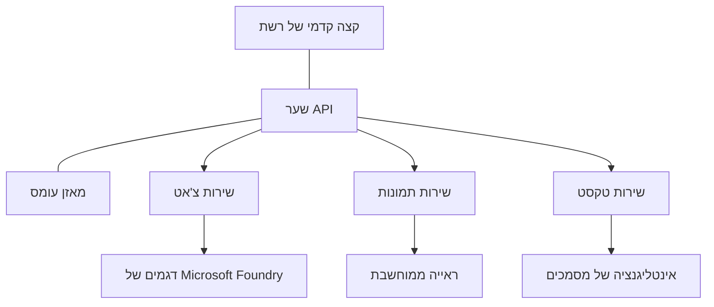

# שיטות עבודה מומלצות לעומסי עבודה של AI בייצור עם AZD

**ניווט בפרקים:**
- **📚 דף הקורס הראשי**: [AZD למתחילים](../../README.md)
- **📖 הפרק הנוכחי**: פרק 8 - תבניות ייצור וארגוניות
- **⬅️ הפרק הקודם**: [פרק 7: פתרון בעיות](../chapter-07-troubleshooting/debugging.md)
- **⬅️ קשור גם ל**: [מעבדת סדנת AI](ai-workshop-lab.md)
- **🎯 סיום הקורס**: [AZD למתחילים](../../README.md)

## סקירה כללית

מדריך זה מספק שיטות עבודה מומלצות מקיפות לפריסת עומסי עבודה של AI מוכנים לייצור באמצעות Azure Developer CLI (AZD). בהתבסס על משוב מקהילת Microsoft Foundry Discord ופריסות לקוחות במציאות, שיטות אלה מתמודדות עם האתגרים הנפוצים ביותר במערכות AI בייצור.

## האתגרים המרכזיים שמטופלים

בהתבסס על תוצאות הסקר בקהילה שלנו, אלו האתגרים המרכזיים שעומדים בפני המפתחים:

- **45%** מתקשים בפריסות AI רב-שירותיות  
- **38%** נתקל בבעיות בניהול הרשאות וסודות  
- **35%** מוצאים קושי במוכנות לייצור ובהרחבה  
- **32%** זקוקים לאסטרטגיות טובות יותר לאופטימיזציית עלויות  
- **29%** דורשים שיפור במעקב ופתרון תקלות  

## תבניות ארכיטקטורה ל-AI בייצור

### תבנית 1: ארכיטקטורת AI מבוססת מיקרו-שירותים

**מתי להשתמש**: יישומי AI מורכבים עם יכולות מרובות



**מימוש AZD**:

```yaml
# azure.yaml
name: enterprise-ai-platform
services:
  web:
    project: ./web
    host: staticwebapp
  api-gateway:
    project: ./api-gateway
    host: containerapp
  chat-service:
    project: ./services/chat
    host: containerapp
  vision-service:
    project: ./services/vision
    host: containerapp
  text-service:
    project: ./services/text
    host: containerapp
```

### תבנית 2: עיבוד AI מונחה אירועים

**מתי להשתמש**: עיבוד אצוות, ניתוח מסמכים, זרימות עבודה אסינכרוניות

```bicep
// Event Hub for AI processing pipeline
resource eventHub 'Microsoft.EventHub/namespaces@2023-01-01-preview' = {
  name: eventHubNamespaceName
  location: location
  sku: {
    name: 'Standard'
    tier: 'Standard'
    capacity: 1
  }
}

// Service Bus for reliable message processing
resource serviceBus 'Microsoft.ServiceBus/namespaces@2022-10-01-preview' = {
  name: serviceBusNamespaceName
  location: location
  sku: {
    name: 'Premium'
    tier: 'Premium'
    capacity: 1
  }
}

// Function App for processing
resource functionApp 'Microsoft.Web/sites@2023-01-01' = {
  name: functionAppName
  location: location
  kind: 'functionapp,linux'
  properties: {
    siteConfig: {
      appSettings: [
        {
          name: 'FUNCTIONS_EXTENSION_VERSION'
          value: '~4'
        }
        {
          name: 'AZURE_OPENAI_ENDPOINT'
          value: '@Microsoft.KeyVault(VaultName=${keyVault.name};SecretName=openai-endpoint)'
        }
      ]
    }
  }
}
```

## חשיבה על בריאות סוכן ה-AI

כשהאפליקציה המסורתית מתפרקת, התסמינים מוכרים: עמוד לא נטען, API מחזיר שגיאה או פריסה נכשלה. יישומי AI יכולים להתקלקל באותם האופנים — אך גם לפעול באופן בלתי צפוי בדרכים עדינות שלא מראות הודעות שגיאה ברורות.

חלק זה עוזר לך לבנות מודל מנטלי למעקב אחרי עומסי עבודה של AI כדי שתדע היכן לחפש כשרואים משהו לא תקין.

### איך בריאות הסוכן שונה מבריאות אפליקציה מסורתית

אפליקציה מסורתית פועלת או לא פועלת. סוכן AI יכול להיראות עובד אך לתת תוצאות גרועות. חשוב על בריאות הסוכן בשתי שכבות:

| שכבה | מה לעקוב | היכן לחפש |
|-------|-----------|------------|
| **בריאות תשתית** | האם השירות פועל? האם המשאבים מוקצים? האם נקודות הקצה נגישות? | `azd monitor`, בריאות משאבי Azure Portal, יומני קונטיינר/אפליקציה |
| **בריאות התנהגותית** | האם הסוכן מגיב בדיוק? האם התגובות בזמן? האם המודל נקרא נכון? | מעקב Application Insights, מדדי השהיית קריאות למודל, יומני איכות תגובות |

בריאות תשתית מוכרת – זהה לכל אפליקציית azd. בריאות התנהגותית היא השכבה החדשה שמעומסי עבודה של AI.

### איפה לחפש כשיישומי AI לא מתנהגים כמצופה

אם יישום ה-AI שלך לא מייצר את התוצאות שאתה מצפה להן, הנה רשימת בדיקה קונספטואלית:

1. **התחל מהבסיס.** האם האפליקציה רצה? האם היא יכולה להגיע לתלויות שלה? בדוק `azd monitor` ובריאות משאבים כמו בכל אפליקציה.
2. **בדוק את חיבור המודל.** האם האפליקציה שלך מצליחה לקרוא למודל ה-AI? קריאות שנכשלות או נעצרות בזמן הן הגורם הנפוץ ביותר לבעיות ביישומי AI ויופיעו ביומני האפליקציה.
3. **בדוק מה שהמודל קיבל.** תגובות AI תלויות בקלט (הפרומפט וכל ההקשר שהתקבל). אם הפלט שגוי, הקלט כנראה שגוי. בדוק האם האפליקציה שולחת את הנתונים הנכונים למודל.
4. **בדוק את השהיית התגובה.** קריאות למודל AI איטיות יותר מקריאות API טיפוסיות. אם האפליקציה מרגישה איטית, בדוק אם זמני התגובה של המודל עלו – זה יכול להעיד על הגבלת תעבורה, מגבלות תשתית או עומס אזורי.
5. **עקוב אחרי אותות עלות.** זעזועים לא צפויים בשימוש בטוקנים או בקריאות API יכולים להעיד על לולאה, פרומפט מוגדר לא נכון או ניסיונות חוזרים מופרזים.

אין צורך לשלוט מיד בכל כלי הניטור. הנקודה החשובה היא שליישומי AI יש שכבת התנהגות נוספת למעקב, ו-monitoring המובנה של azd (`azd monitor`) מספק נקודת התחלה לחקירה בשתי השכבות.

---

## שיטות אבטחה מומלצות

### 1. מודל אבטחת Zero-Trust

**אסטרטגיית יישום**:  
- אין תקשורת שירות-לשירות ללא אימות  
- כל קריאות ה-API משתמשות בזהויות מנוהלות  
- בידוד רשת עם נקודות קצה פרטיות  
- בקרות גישה לפי העיקרון של הפריבילגיה המינימלית  

```bicep
// Managed Identity for each service
resource chatServiceIdentity 'Microsoft.ManagedIdentity/userAssignedIdentities@2023-01-31' = {
  name: 'chat-service-identity'
  location: location
}

// Role assignments with minimal permissions
resource openAIUserRole 'Microsoft.Authorization/roleAssignments@2022-04-01' = {
  scope: openAIAccount
  name: guid(openAIAccount.id, chatServiceIdentity.id, openAIUserRoleDefinitionId)
  properties: {
    roleDefinitionId: subscriptionResourceId('Microsoft.Authorization/roleDefinitions', '5e0bd9bd-7b93-4f28-af87-19fc36ad61bd')
    principalId: chatServiceIdentity.properties.principalId
    principalType: 'ServicePrincipal'
  }
}
```

### 2. ניהול סודות מאובטח

**תבנית אינטגרציה עם Key Vault**:

```bicep
// Key Vault with proper access policies
resource keyVault 'Microsoft.KeyVault/vaults@2023-02-01' = {
  name: keyVaultName
  location: location
  properties: {
    tenantId: tenant().tenantId
    sku: {
      family: 'A'
      name: 'premium'  // Use premium for production
    }
    enableRbacAuthorization: true  // Use RBAC instead of access policies
    enablePurgeProtection: true    // Prevent accidental deletion
    enableSoftDelete: true
    softDeleteRetentionInDays: 90
  }
}

// Store all AI service credentials
resource openAIKeySecret 'Microsoft.KeyVault/vaults/secrets@2023-02-01' = {
  parent: keyVault
  name: 'openai-api-key'
  properties: {
    value: openAIAccount.listKeys().key1
    attributes: {
      enabled: true
    }
  }
}
```

### 3. אבטחת רשת

**קונפיגורציית נקודת סוף פרטית**:

```bicep
// Virtual Network for AI services
resource virtualNetwork 'Microsoft.Network/virtualNetworks@2023-04-01' = {
  name: vnetName
  location: location
  properties: {
    addressSpace: {
      addressPrefixes: ['10.0.0.0/16']
    }
    subnets: [
      {
        name: 'ai-services-subnet'
        properties: {
          addressPrefix: '10.0.1.0/24'
          privateEndpointNetworkPolicies: 'Disabled'
        }
      }
      {
        name: 'app-services-subnet'
        properties: {
          addressPrefix: '10.0.2.0/24'
          delegations: [
            {
              name: 'Microsoft.Web/serverFarms'
              properties: {
                serviceName: 'Microsoft.Web/serverFarms'
              }
            }
          ]
        }
      }
    ]
  }
}

// Private endpoints for all AI services
resource openAIPrivateEndpoint 'Microsoft.Network/privateEndpoints@2023-04-01' = {
  name: '${openAIAccountName}-pe'
  location: location
  properties: {
    subnet: {
      id: virtualNetwork.properties.subnets[0].id
    }
    privateLinkServiceConnections: [
      {
        name: 'openai-connection'
        properties: {
          privateLinkServiceId: openAIAccount.id
          groupIds: ['account']
        }
      }
    ]
  }
}
```

## ביצועים והיקפים

### 1. אסטרטגיות קנה מידה אוטומטי

**קנה מידה אוטומטי באפליקציות קונטיינר**:

```bicep
resource containerApp 'Microsoft.App/containerApps@2023-05-01' = {
  name: containerAppName
  location: location
  properties: {
    configuration: {
      ingress: {
        external: true
        targetPort: 8000
        transport: 'http'
      }
    }
    template: {
      scale: {
        minReplicas: 2  // Always have 2 instances minimum
        maxReplicas: 50 // Scale up to 50 for high load
        rules: [
          {
            name: 'http-scaling'
            http: {
              metadata: {
                concurrentRequests: '20'  // Scale when >20 concurrent requests
              }
            }
          }
          {
            name: 'cpu-scaling'
            custom: {
              type: 'cpu'
              metadata: {
                type: 'Utilization'
                value: '70'  // Scale when CPU >70%
              }
            }
          }
        ]
      }
    }
  }
}
```

### 2. אסטרטגיות מטמון

**מטמון Redis לתגובות AI**:

```bicep
// Redis Premium for production workloads
resource redisCache 'Microsoft.Cache/redis@2023-04-01' = {
  name: redisCacheName
  location: location
  properties: {
    sku: {
      name: 'Premium'
      family: 'P'
      capacity: 1
    }
    enableNonSslPort: false
    minimumTlsVersion: '1.2'
    redisConfiguration: {
      'maxmemory-policy': 'allkeys-lru'
    }
    // Enable clustering for high availability
    redisVersion: '6.0'
    shardCount: 2
  }
}

// Cache configuration in application
var cacheConnectionString = '${redisCache.properties.hostName}:6380,password=${redisCache.listKeys().primaryKey},ssl=True,abortConnect=False'
```

### 3. איזון עומסים וניהול תעבורה

**שער אפליקציה עם WAF**:

```bicep
// Application Gateway with Web Application Firewall
resource applicationGateway 'Microsoft.Network/applicationGateways@2023-04-01' = {
  name: appGatewayName
  location: location
  properties: {
    sku: {
      name: 'WAF_v2'
      tier: 'WAF_v2'
      capacity: 2
    }
    webApplicationFirewallConfiguration: {
      enabled: true
      firewallMode: 'Prevention'
      ruleSetType: 'OWASP'
      ruleSetVersion: '3.2'
    }
    // Backend pools for AI services
    backendAddressPools: [
      {
        name: 'ai-services-pool'
        properties: {
          backendAddresses: [
            {
              fqdn: '${containerApp.properties.configuration.ingress.fqdn}'
            }
          ]
        }
      }
    ]
  }
}
```

## 💰 אופטימיזציית עלויות

### 1. גודל משאבים מותאם

**קונפיגורציות ייחודיות לסביבה**:

```bash
# סביבת פיתוח
azd env new development
azd env set AZURE_OPENAI_SKU "S0"
azd env set AZURE_OPENAI_CAPACITY 10
azd env set AZURE_SEARCH_SKU "basic"
azd env set CONTAINER_CPU 0.5
azd env set CONTAINER_MEMORY 1.0

# סביבת הפקה
azd env new production
azd env set AZURE_OPENAI_SKU "S0"
azd env set AZURE_OPENAI_CAPACITY 100
azd env set AZURE_SEARCH_SKU "standard"
azd env set CONTAINER_CPU 2.0
azd env set CONTAINER_MEMORY 4.0
```

### 2. ניטור עלויות ותקציבים

```bicep
// Cost management and budgets
resource budget 'Microsoft.Consumption/budgets@2023-05-01' = {
  name: 'ai-workload-budget'
  properties: {
    timePeriod: {
      startDate: '2024-01-01'
      endDate: '2024-12-31'
    }
    timeGrain: 'Monthly'
    amount: 2000  // $2000 monthly budget
    category: 'Cost'
    notifications: {
      warning: {
        enabled: true
        operator: 'GreaterThan'
        threshold: 80
        contactEmails: [
          'finance@company.com'
          'engineering@company.com'
        ]
        contactRoles: [
          'Owner'
          'Contributor'
        ]
      }
      critical: {
        enabled: true
        operator: 'GreaterThan'
        threshold: 95
        contactEmails: [
          'cto@company.com'
        ]
      }
    }
  }
}
```

### 3. אופטימיזציית שימוש בטוקנים

**ניהול עלויות OpenAI**:

```typescript
// אופטימיזציה של טוקנים ברמת היישום
class TokenOptimizer {
  private readonly maxTokens = 4000;
  private readonly reserveTokens = 500;
  
  optimizePrompt(userInput: string, context: string): string {
    const availableTokens = this.maxTokens - this.reserveTokens;
    const estimatedTokens = this.estimateTokens(userInput + context);
    
    if (estimatedTokens > availableTokens) {
      // קיצור הקשר, לא קלט המשתמש
      context = this.truncateContext(context, availableTokens - this.estimateTokens(userInput));
    }
    
    return `${context}\n\nUser: ${userInput}`;
  }
  
  private estimateTokens(text: string): number {
    // הערכה גסה: טוקן אחד ≈ 4 תווים
    return Math.ceil(text.length / 4);
  }
}
```

## ניטור ותצפית

### 1. Application Insights מקיף

```bicep
// Application Insights with advanced features
resource applicationInsights 'Microsoft.Insights/components@2020-02-02' = {
  name: applicationInsightsName
  location: location
  kind: 'web'
  properties: {
    Application_Type: 'web'
    WorkspaceResourceId: logAnalyticsWorkspace.id
    SamplingPercentage: 100  // Full sampling for AI apps
    DisableIpMasking: false  // Enable for security
  }
}

// Custom metrics for AI operations
resource aiMetricAlerts 'Microsoft.Insights/metricAlerts@2018-03-01' = {
  name: 'ai-high-error-rate'
  location: 'global'
  properties: {
    description: 'Alert when AI service error rate is high'
    severity: 2
    enabled: true
    scopes: [
      applicationInsights.id
    ]
    evaluationFrequency: 'PT1M'
    windowSize: 'PT5M'
    criteria: {
      'odata.type': 'Microsoft.Azure.Monitor.SingleResourceMultipleMetricCriteria'
      allOf: [
        {
          name: 'high-error-rate'
          metricName: 'requests/failed'
          operator: 'GreaterThan'
          threshold: 10
          timeAggregation: 'Count'
        }
      ]
    }
  }
}
```

### 2. ניטור ספציפי ל-AI

**לוחות מחוונים מותאמים למדדי AI**:

```json
// Dashboard configuration for AI workloads
{
  "dashboard": {
    "name": "AI Application Monitoring",
    "tiles": [
      {
        "name": "OpenAI Request Volume",
        "query": "requests | where name contains 'openai' | summarize count() by bin(timestamp, 5m)"
      },
      {
        "name": "AI Response Latency",
        "query": "requests | where name contains 'openai' | summarize avg(duration) by bin(timestamp, 5m)"
      },
      {
        "name": "Token Usage",
        "query": "customMetrics | where name == 'openai_tokens_used' | summarize sum(value) by bin(timestamp, 1h)"
      },
      {
        "name": "Cost per Hour",
        "query": "customMetrics | where name == 'openai_cost' | summarize sum(value) by bin(timestamp, 1h)"
      }
    ]
  }
}
```

### 3. בדיקות בריאות ומעקב זמינות

```bicep
// Application Insights availability tests
resource availabilityTest 'Microsoft.Insights/webtests@2022-06-15' = {
  name: 'ai-app-availability-test'
  location: location
  tags: {
    'hidden-link:${applicationInsights.id}': 'Resource'
  }
  properties: {
    SyntheticMonitorId: 'ai-app-availability-test'
    Name: 'AI Application Availability Test'
    Description: 'Tests AI application endpoints'
    Enabled: true
    Frequency: 300  // 5 minutes
    Timeout: 120    // 2 minutes
    Kind: 'ping'
    Locations: [
      {
        Id: 'us-east-2-azr'
      }
      {
        Id: 'us-west-2-azr'
      }
    ]
    Configuration: {
      WebTest: '''
        <WebTest Name="AI Health Check" 
                 Id="8d2de8d2-a2b0-4c2e-9a0d-8f9c9a0b8c8d" 
                 Enabled="True" 
                 CssProjectStructure="" 
                 CssIteration="" 
                 Timeout="120" 
                 WorkItemIds="" 
                 xmlns="http://microsoft.com/schemas/VisualStudio/TeamTest/2010" 
                 Description="" 
                 CredentialUserName="" 
                 CredentialPassword="" 
                 PreAuthenticate="True" 
                 Proxy="default" 
                 StopOnError="False" 
                 RecordedResultFile="" 
                 ResultsLocale="">
          <Items>
            <Request Method="GET" 
                     Guid="a5f10126-e4cd-570d-961c-cea43999a200" 
                     Version="1.1" 
                     Url="${webApp.properties.defaultHostName}/health" 
                     ThinkTime="0" 
                     Timeout="120" 
                     ParseDependentRequests="True" 
                     FollowRedirects="True" 
                     RecordResult="True" 
                     Cache="False" 
                     ResponseTimeGoal="0" 
                     Encoding="utf-8" 
                     ExpectedHttpStatusCode="200" 
                     ExpectedResponseUrl="" 
                     ReportingName="" 
                     IgnoreHttpStatusCode="False" />
          </Items>
        </WebTest>
      '''
    }
  }
}
```

## שחזור מאסון וזמינות גבוהה

### 1. פריסה רב-אזורית

```yaml
# azure.yaml - Multi-region configuration
name: ai-app-multiregion
services:
  api-primary:
    project: ./api
    host: containerapp
    env:
      - AZURE_REGION=eastus
  api-secondary:
    project: ./api
    host: containerapp
    env:
      - AZURE_REGION=westus2
```

```bicep
// Traffic Manager for global load balancing
resource trafficManager 'Microsoft.Network/trafficManagerProfiles@2022-04-01' = {
  name: trafficManagerProfileName
  location: 'global'
  properties: {
    profileStatus: 'Enabled'
    trafficRoutingMethod: 'Priority'
    dnsConfig: {
      relativeName: trafficManagerProfileName
      ttl: 30
    }
    monitorConfig: {
      protocol: 'HTTPS'
      port: 443
      path: '/health'
      intervalInSeconds: 30
      toleratedNumberOfFailures: 3
      timeoutInSeconds: 10
    }
    endpoints: [
      {
        name: 'primary-endpoint'
        type: 'Microsoft.Network/trafficManagerProfiles/azureEndpoints'
        properties: {
          targetResourceId: primaryAppService.id
          endpointStatus: 'Enabled'
          priority: 1
        }
      }
      {
        name: 'secondary-endpoint'
        type: 'Microsoft.Network/trafficManagerProfiles/azureEndpoints'
        properties: {
          targetResourceId: secondaryAppService.id
          endpointStatus: 'Enabled'
          priority: 2
        }
      }
    ]
  }
}
```

### 2. גיבוי ושרידות נתונים

```bicep
// Backup configuration for critical data
resource backupVault 'Microsoft.DataProtection/backupVaults@2023-05-01' = {
  name: backupVaultName
  location: location
  identity: {
    type: 'SystemAssigned'
  }
  properties: {
    storageSettings: [
      {
        datastoreType: 'VaultStore'
        type: 'LocallyRedundant'
      }
    ]
  }
}

// Backup policy for AI models and data
resource backupPolicy 'Microsoft.DataProtection/backupVaults/backupPolicies@2023-05-01' = {
  parent: backupVault
  name: 'ai-data-backup-policy'
  properties: {
    policyRules: [
      {
        backupParameters: {
          backupType: 'Full'
          objectType: 'AzureBackupParams'
        }
        trigger: {
          schedule: {
            repeatingTimeIntervals: [
              'R/2024-01-01T02:00:00+00:00/P1D'  // Daily at 2 AM
            ]
          }
          objectType: 'ScheduleBasedTriggerContext'
        }
        dataStore: {
          datastoreType: 'VaultStore'
          objectType: 'DataStoreInfoBase'
        }
        name: 'BackupDaily'
        objectType: 'AzureBackupRule'
      }
    ]
  }
}
```

## אינטגרציית DevOps ו-CI/CD

### 1. זרימת עבודה GitHub Actions

```yaml
# .github/workflows/deploy-ai-app.yml
name: Deploy AI Application

on:
  push:
    branches: [main]
  pull_request:
    branches: [main]

jobs:
  test:
    runs-on: ubuntu-latest
    steps:
      - uses: actions/checkout@v4
      
      - name: Setup Python
        uses: actions/setup-python@v4
        with:
          python-version: '3.11'
          
      - name: Install dependencies
        run: |
          pip install -r requirements.txt
          pip install pytest
          
      - name: Run tests
        run: pytest tests/
        
      - name: AI Safety Tests
        run: |
          python scripts/test_ai_safety.py
          python scripts/validate_prompts.py

  deploy-staging:
    needs: test
    if: github.event_name == 'pull_request'
    runs-on: ubuntu-latest
    steps:
      - uses: actions/checkout@v4
      
      - name: Setup AZD
        uses: Azure/setup-azd@v2
        
      - name: Login to Azure
        uses: azure/login@v1
        with:
          creds: ${{ secrets.AZURE_CREDENTIALS }}
          
      - name: Deploy to Staging
        run: |
          azd env select staging
          azd deploy

  deploy-production:
    needs: test
    if: github.ref == 'refs/heads/main'
    runs-on: ubuntu-latest
    steps:
      - uses: actions/checkout@v4
      
      - name: Setup AZD
        uses: Azure/setup-azd@v2
        
      - name: Login to Azure
        uses: azure/login@v1
        with:
          creds: ${{ secrets.AZURE_CREDENTIALS }}
          
      - name: Deploy to Production
        run: |
          azd env select production
          azd deploy
          
      - name: Run Production Health Checks
        run: |
          python scripts/health_check.py --env production
```

### 2. אבטחת תשתית

```bash
# scripts/validate_infrastructure.sh
#!/bin/bash

echo "Validating AI infrastructure deployment..."

# לבדוק אם כל השירותים הנדרשים פועלים
services=("openai" "search" "storage" "keyvault")
for service in "${services[@]}"; do
    echo "Checking $service..."
    if ! az resource list --resource-type "Microsoft.CognitiveServices/accounts" --query "[?contains(name, '$service')]" -o tsv; then
        echo "ERROR: $service not found"
        exit 1
    fi
done

# לאמת פריסות מודל OpenAI
echo "Validating OpenAI model deployments..."
models=$(az cognitiveservices account deployment list --name $AZURE_OPENAI_NAME --resource-group $AZURE_RESOURCE_GROUP --query "[].name" -o tsv)
if [[ ! $models == *"gpt-4.1-mini"* ]]; then
  echo "ERROR: Required model gpt-4.1-mini not deployed"
    exit 1
fi

# לבדוק חיבוריות שירות ה-AI
echo "Testing AI service connectivity..."
python scripts/test_connectivity.py

echo "Infrastructure validation completed successfully!"
```

## רשימת בדיקה למוכנות ייצור

### אבטחה ✅
- [ ] כל השירותים משתמשים בזהויות מנוהלות  
- [ ] סודות מאוחסנים ב-Key Vault  
- [ ] נקודות קצה פרטיות מוגדרות  
- [ ] קבוצות אבטחת רשת מיושמות  
- [ ] RBAC עם פריבילגיות מינימליות  
- [ ] WAF מופעל בנקודות קצה ציבוריות  

### ביצועים ✅
- [ ] קנה מידה אוטומטי מוגדר  
- [ ] מטמון הוטמע  
- [ ] איזון עומסים מוגדר  
- [ ] CDN לתוכן סטטי  
- [ ] בריכת חיבורים למסד נתונים  
- [ ] אופטימיזציית שימוש בטוקנים  

### ניטור ✅
- [ ] Application Insights מוגדר  
- [ ] מדדים מותאמים מוגדרים  
- [ ] כללי התרעה מוגדרים  
- [ ] לוח מחוונים נוצר  
- [ ] בדיקות בריאות מיושמות  
- [ ] מדיניות שימור יומנים  

### אמינות ✅
- [ ] פריסה רב-אזורית  
- [ ] תוכנית גיבוי ושחזור  
- [ ] הפסקת מעגלים מיושמת  
- [ ] מדיניות ניסיונות חוזרים מוגדרת  
- [ ] הידרדרות מבוקרת  
- [ ] נקודות קצה לבדיקה  

### ניהול עלויות ✅
- [ ] התרעות תקציב מוגדרות  
- [ ] גודל משאבים מותאם  
- [ ] הנחות פיתוח/בדיקות מוחלות  
- [ ] רכישת מופעים שמורים  
- [ ] לוח בקרה למעקב עלויות  
- [ ] סקירות עלויות סדירות  

### תאימות ✅
- [ ] דרישות מגורי נתונים מולאו  
- [ ] רישום ביקורת מופעל  
- [ ] מדיניות תאימות מיושמת  
- [ ] בסיסי אבטחה מיושמים  
- [ ] הערכות אבטחה סדירות  
- [ ] תוכנית תגובה לאירועים  

## מדדי ביצועים

### מדדים טיפוסיים לייצור

| מדד | יעד | ניטור |
|--------|--------|------------|
| **זמן תגובה** | פחות מ-2 שניות | Application Insights |
| **זמינות** | 99.9% | ניטור זמינות |
| **שיעור שגיאות** | פחות מ-0.1% | יומני אפליקציה |
| **שימוש בטוקנים** | פחות מ-500$/חודש | ניהול עלויות |
| **משתמשים בו-זמנית** | 1000+ | בדיקת עומס |
| **זמן שחזור** | פחות משעה | בדיקות שחזור מאסון |

### בדיקת עומס

```bash
# סקריפט בדיקת עומס עבור יישומי בינה מלאכותית
python scripts/load_test.py \
  --endpoint https://your-ai-app.azurewebsites.net \
  --concurrent-users 100 \
  --duration 300 \
  --ramp-up 60
```

## 🤝 שיטות עבודה מומלצות מהקהילה

בהתבסס על משוב מקהילת Microsoft Foundry Discord:

### ההמלצות המובילות מהקהילה:

1. **התחל קטן, הרחב בהדרגה**: התחל ב-SKU בסיסיים והרחב בהתאם לשימוש בפועל  
2. **נטר הכל**: הקם ניטור מקיף מהיום הראשון  
3. **אוטומציה של אבטחה**: השתמש בתשתית כקוד לאבטחה עקבית  
4. **בדוק בקפידה**: כלול בדיקות ספציפיות ל-AI בצינור הפיתוח  
5. **תכנן תקציבים**: עקוב אחרי שימוש בטוקנים והגדר התרעות תקציב מוקדם  

### מלכודות נפוצות להימנע מהן:

- ❌ הכנסת מפתחות API ישירות בקוד  
- ❌ אי הגדרת ניטור נכון  
- ❌ התעלמות מאופטימיזציית עלויות  
- ❌ אי בדיקה של תרחישי כשל  
- ❌ פריסה ללא בדיקות בריאות  

## פקודות AI של AZD ותוספים

AZD כולל מערכת פקודות ותוספים ספציפיים ל-AI שמפשטים את זרימות העבודה של AI בייצור. כלים אלה גשרים בין פיתוח מקומי לפריסה בענן לעומסי AI.

### תוספי AZD לאינטליגנציה מלאכותית

AZD משתמש במערכת הרחבה להוספת יכולות ספציפיות ל-AI. התקן ונהל תוספים עם:

```bash
# רשום את כל התוספים הזמינים (כולל AI)
azd extension list

# בדוק פרטים של תוספים מותקנים
azd extension show azure.ai.agents

# התקן את תוסף הסוכנים של Foundry
azd extension install azure.ai.agents

# התקן את תוסף התזמון המדויק
azd extension install azure.ai.finetune

# התקן את תוסף הדגמים המותאמים אישית
azd extension install azure.ai.models

# שדרג את כל התוספים המותקנים
azd extension upgrade --all
```

**תוספי AI זמינים:**

| תוסף | מטרה | מצב |
|-----------|---------|--------|
| `azure.ai.agents` | ניהול שירות סוכני Foundry | תצוגה מקדימה |
| `azure.ai.skills` | מיומנויות סוכן רב-שימושיות | תצוגה מקדימה |
| `azure.ai.connections` | חיבורים Foundry (מקורות נתונים, כלים) | תצוגה מקדימה |
| `azure.ai.finetune` | כיוונון דגמים ב-Foundry | תצוגה מקדימה |
| `azure.ai.models` | דגמים מותאמים אישית ב-Foundry | תצוגה מקדימה |
| `azure.coding-agent` | קונפיגורציית סוכן קידוד | זמין |

> תוסף `azure.ai.agents` מתפתח במהירות. הקורס נבדק על `0.1.40-preview`. הרץ `azd extension upgrade --all` לעדכון לסט הפקודות העדכני, ו-`azd extension show azure.ai.agents` לאישור הגרסה המותקנת.

**מהם התוספים החדשים `skills` ו-`connections`?**

שני תוספים בתצוגה מקדימה הופיעו לצד כלי סוכנים ומומלץ להבין אותם גם כמתחילים:

- **`azure.ai.skills`** — **מיומנות** היא יכולת רב-שימושית (כלי או התנהגות חבילה) שניתן לצרף לסוכנים במקום לממש אותה מחדש כל פעם. חשוב על זה כבלוק בנייה משותף: הגדר פעם אחת "חפש בתיעוד" או "בדוק הזמנה" וכפול שימוש בין סוכנים. זה שומר על עקביות במערכות רב-סוכניות (פרק 5) ומונע העתק-הדבק.
- **`azure.ai.connections`** — **קישור** הוא חיבור מנוהל מפרויקט Foundry שלך למשאב חיצוני שהסוכנים זקוקים לו — מקור נתונים (כמו Azure AI Search), נקודת קצה של כלי, או שירות נוסף. חיבורים מרכזיים *איפה* ואיך הסוכנים ניגשים לנתונים, כך שההרשאות ונקודות הקצה נמצאים במקום מאורגן ומנוהל ולא מפוזרים בקוד.

אין צורך בתוספים אלה כדי לפרוס סוכנים ראשונים — התחל עם `azure.ai.agents` בלמידה. פנה ל-`skills` כשאתה מוצא שאתה מכפיל את אותו כלי בין סוכנים, ו-`connections` כשמספר סוכנים משתמשים באותו מקור נתונים.

### אתחול פרויקטי סוכנים עם `azd ai agent init`

פקודת `azd ai agent init` יוצרת מבנה פרויקט לסוכן AI מוכן לייצור המשולב עם Microsoft Foundry Agent Service:

```bash
# אתחל פרויקט סוכן חדש ממרשם סוכן
azd ai agent init -m <manifest-path-or-uri>

# אתחל ויעד פרויקט Foundry ספציפי
azd ai agent init -m agent-manifest.yaml --project-id <foundry-project-id>

# אתחל עם תיקיית מקור מותאמת אישית
azd ai agent init -m agent-manifest.yaml --src ./agents/my-agent

# כוון את Container Apps כמארח
azd ai agent init -m agent-manifest.yaml --host containerapp
```

**דגלים מרכזיים:**

| דגל | תיאור |
|------|-------------|
| `-m, --manifest` | נתיב או URI של מאניפסט סוכן להוספה לפרויקט שלך |
| `-p, --project-id` | מזהה פרויקט Foundry קיים לסביבת azd שלך |
| `-s, --src` | תיקייה להורדת הגדרת הסוכן (ברירת מחדל `src/<agent-id>`) |
| `--host` | החלפת ה-host ברירת המחדל (למשל `containerapp`) |
| `-e, --environment` | סביבת azd לשימוש |

**טיפ לייצור**: השתמש ב-`--project-id` לחיבור ישיר לפרויקט Foundry קיים, לשמירת קוד הסוכן ומשאבי הענן מקושרים מההתחלה.

### ניהול מחזור החיים של הסוכן

מעבר ל-`init` תוסף `azure.ai.agents` מספק פקודות למחזור חיים מלא של סוכן מתארח — בדיקה, הערכה, אופטימיזציה והסרה:

```bash
# הפעל סוכן פרוס וצפה בתזמון תגובת השרת
# (שהיה כוללת וזמן לבייט הראשון)
azd ai agent invoke

# הצג את תצורת נקודת הקצה החיה לפני שינוי שלה
azd ai agent endpoint show

# יצירת סט נתוני הערכה עבור הסוכן
azd ai agent eval generate --dataset ./eval/dataset.jsonl

# אופטימיזציה של הוראות הסוכן אל מול נתוני ההערכה שלך
# (דורש מודל אופטימיזציה בפרויקט הסוכן)
azd ai agent optimize

# הורד את הקוד הפרוס של סוכן מבוסס קוד
# (עם אימות SHA-256)
azd ai agent code download

# מחק סוכן ממוזן וכל הגרסאות שלו
# (--force מסיים מושבים פעילים)
azd ai agent delete --force
```

**סיכום מחזור חיים:**

| שלב | פקודה | שימוש בייצור |
|-------|---------|--------------|
| בדיקה | `azd ai agent invoke` | אימות תגובות ומדידת השהיה לפני הפצה |
| בדיקה | `azd ai agent endpoint show` | סקירת אימות/קונפיגורציה; זיהוי שינויים גורמי תקלות |
| מדידה | `azd ai agent eval generate` | בניית מערך הערכה חוזר על סמך מעקבים אמיתיים |
| שיפור | `azd ai agent optimize` | כוונון הוראות כנגד איכות מדודה |
| שחזור | `azd ai agent code download` | הורדת מקור מותקן מדויק לבדיקה/שחזור |
| הסרה | `azd ai agent delete --force` | פירוק סוכן והגרסאות שלו באופן נקי |

> פקודות אלו בתצוגה מקדימה ועלולות להשתנות בין עדכוני תוסף. הרץ `azd ai agent --help` להצגת תת-פקודות מדויקות בגרסה שלך.

### פרוטוקול הקשר מודל (MCP) עם `azd mcp`
AZD כולל תמיכה מובנית בשרת MCP (בעתיד), המאפשר לסוכני AI וכלים אינטראקציה עם משאבי Azure שלך דרך פרוטוקול סטנדרטי:

```bash
# הפעל את שרת MCP לפרויקט שלך
azd mcp start

# סקור את כללי ההסכמה הנוכחיים של Copilot לביצוע הכלים
azd copilot consent list
```

שרת ה-MCP חושף את הקשר פרויקט azd שלך — סביבות, שירותים ומשאבי Azure — לכלי פיתוח המונעים על ידי AI. זה מאפשר:

- **פריסה בסיוע AI**: אפשר לסוכני קידוד לשאול על מצב הפרויקט ולהפעיל פריסות
- **גילוי משאבים**: כלים מבוססי AI יכולים לגלות אילו משאבי Azure הפרויקט שלך משתמש בהם
- **ניהול סביבה**: סוכנים יכולים לעבור בין סביבות פיתוח/בדיקה/הפקה

### יצירת תשתית עם `azd infra generate`

לעומסי עבודה של AI בסביבת הפקה, ניתן ליצור ולהתאים אישית תשתית כקוד במקום להסתמך על הספקה אוטומטית:

```bash
# צור קבצי Bicep/Terraform מהגדרת הפרויקט שלך
azd infra generate
```

זה כותב IaC לדיסק כך שתוכל:
- לעיין ולבקר את התשתית לפני פריסה
- להוסיף מדיניות אבטחה מותאמת (כללי רשת, נקודות קצה פרטיות)
- להשתלב עם תהליכי סקירת IaC קיימים
- לנהל גרסאות של שינויים בתשתית בנפרד מקוד היישום

### ווים במחזור החיים של ההפקה

ווים ב-AZD מאפשרים לך להזריק לוגיקה מותאמת בכל שלב של מחזור החיים של הפריסה — קריטי לעומסי עבודה של AI בהפקה:

```yaml
# azure.yaml - Production hooks example
name: ai-production-app
hooks:
  preprovision:
    shell: sh
    run: scripts/validate-quotas.sh    # Check AI model quota before provisioning
  postprovision:
    shell: sh
    run: scripts/configure-networking.sh  # Set up private endpoints
  predeploy:
    shell: sh
    run: scripts/run-ai-safety-tests.sh  # Run prompt safety checks
  postdeploy:
    shell: sh
    run: scripts/smoke-test.sh           # Verify agent responses post-deploy
services:
  agent-api:
    project: ./src/agent
    host: containerapp
    hooks:
      predeploy:
        shell: sh
        run: scripts/validate-model-access.sh  # Per-service hook
```

```bash
# הרץ ווּק ספציפי ידנית במהלך הפיתוח
azd hooks run predeploy
```

**ווים מומלצים לעומסי עבודה של AI בהפקה:**

| וו | מקרה שימוש |
|------|----------|
| `preprovision` | אימות מכסות מנוי לקיבולת מודל AI |
| `postprovision` | תצורת נקודות קצה פרטיות, פריסת משקלי מודלים |
| `predeploy` | הרצת בדיקות בטיחות AI, אימות תבניות פרומפט |
| `postdeploy` | בדיקת עישון לתגובות סוכן, אימות חיבוריות מודל |

### קונפיגורציית צינור CI/CD

השתמש ב-`azd pipeline config` כדי לחבר את הפרויקט שלך ל-GitHub Actions או Azure Pipelines עם אימות מאובטח של Azure:

```bash
# הגדר צינור CI/CD (אינטראקטיבי)
azd pipeline config

# הגדר עם ספק מסוים
azd pipeline config --provider github
```

הפקודה הזו:
- יוצרת שרת שירות עם גישת מינימום הרשאות
- מגדירה אישורי פדרציה (ללא סודות מאוחסנים)
- יוצרת או מעדכנת את קובץ הגדרת הצינור שלך
- מגדירה משתני סביבה נחוצים במערכת ה-CI/CD שלך

#### שלב אחר שלב: צינור GitHub Actions ראשון שלך

הנה ההדרכה המלאה מפרויקט azd פעיל לפריסות אוטומטיות עם כל הדחיפה.

**1. ודא שהפרויקט שלך ב-GitHub**

```bash
git init
git add .
git commit -m "Initial azd project"
gh repo create my-ai-app --private --source=. --push
```

**2. הרץ pipeline config**

```bash
azd pipeline config --provider github
```

azd יבצע באינטראקטיביות:
- ישאל לאיזה מנוי Azure וסביבה לכוון
- ייצור Entra **רישום אפליקציה + שרת שירות** לצינור
- יגדיר **אישורי פדרציה (OIDC)** — כך ש-GitHub יאמת מול Azure עם אסימוני חיים קצרים ו-**ללא סודות מאוחסנים**
- ידחוף את ה-**משתנים** הדרושים למאגר GitHub שלך (`AZURE_CLIENT_ID`, `AZURE_TENANT_ID`, `AZURE_SUBSCRIPTION_ID`, `AZURE_ENV_NAME`, `AZURE_LOCATION`)

**3. הבן את זרימת העבודה שנוצרה**

azd מוסיף `.github/workflows/azure-dev.yml`. החלקים המרכזיים נראים כך:

```yaml
# .github/workflows/azure-dev.yml
on:
  push:
    branches: [ main ]
  workflow_dispatch:        # lets you run it manually too

permissions:
  id-token: write           # required for OIDC federated login
  contents: read

jobs:
  build:
    runs-on: ubuntu-latest
    env:
      AZURE_CLIENT_ID: ${{ vars.AZURE_CLIENT_ID }}
      AZURE_TENANT_ID: ${{ vars.AZURE_TENANT_ID }}
      AZURE_SUBSCRIPTION_ID: ${{ vars.AZURE_SUBSCRIPTION_ID }}
      AZURE_ENV_NAME: ${{ vars.AZURE_ENV_NAME }}
      AZURE_LOCATION: ${{ vars.AZURE_LOCATION }}
    steps:
      - uses: actions/checkout@v4
      - name: Install azd
        uses: Azure/setup-azd@v2
      - name: Log in with OIDC
        run: azd auth login --client-id "$AZURE_CLIENT_ID" --federated-credential-provider "github" --tenant-id "$AZURE_TENANT_ID"
      - name: Provision infrastructure
        run: azd provision --no-prompt
      - name: Deploy application
        run: azd deploy --no-prompt
```

**4. ודא שזה עובד**

```bash
# דחוף שינוי כדי להפעיל את צינור העבודה
git commit -am "Trigger pipeline" --allow-empty
git push
```

פתח את לשונית **Actions** במאגר הגיטהאב שלך וצפה בהרצת הזרימה `azd provision` ו-`azd deploy` אוטומטית.

> **למה אישורי פדרציה חשובים:** צינורות ישנים שמרו סוד לקוח ב-GitHub. אישורי פדרציה OIDC מסירים לחלוטין את הסוד הזה — GitHub מבקש אסימון קצר בזמן הריצה, שזה מאובטח יותר ואין צורך לסובב או לדלוף אותו. זה הקונפיגורציה ברירת המחדל של `azd pipeline config`.

> **סודות מול משתנים:** מזהים לא-רגישים (`AZURE_CLIENT_ID`, וכדומה) נמצאים ב-**משתני** המאגר. אם היישום שלך באמת צריך סוד בזמן הבניה, הוסף אותו כ-**secret** ב-GitHub והפנה אליו עם `${{ secrets.NAME }}` — אך העדיף Key Vault + זהות מנוהלת בזמן ריצה (ראה [פרק 3](../chapter-03-configuration/authsecurity.md)).

**זרימת עבודה לייצור עם pipeline config:**

```bash
# 1. הגדר את סביבת הייצור
azd env new production
azd env set AZURE_OPENAI_CAPACITY 100

# 2. קבע את קונפיגורציית הפייפליין
azd pipeline config --provider github

# 3. הפייפליין מריץ azd deploy בכל לחיצה ל-main
```

#### שלב אחר שלב: Azure DevOps Pipelines

מעדיף Azure DevOps על פני GitHub Actions? azd תומך בכך באופן מובנה עם ספק `azdo`. התהליך כמעט זהה — azd מייצר את קובץ הצינור, יוצר חיבור שירות ומגדיר את האימות.

**1. ודא שיש לך פרויקט Azure DevOps**

אתה צריך ארגון ופרויקט ב-`https://dev.azure.com/<your-org>`. צור Personal Access Token (PAT) עם הרשאות **Build (קריאה והרצה)**, **Code (קריאה וכתיבה)**, ו-**Service Connections (קריאה, שאלות וניהול)** — azd יבקש ממך את זה.

**2. קונפיגורציית הצינור**

```bash
azd pipeline config --provider azdo
```

azd יבצע:
- ישאל לארגון ופרויקט Azure DevOps שלך
- ייצור (או ישתמש מחדש) **חיבור שירות** ל-Azure באמצעות שרת שירות
- יגדיר **פדרציית זהות עומס עבודה (OIDC)** כך שלא יישמר סוד לקוח
- יקמיטל קובץ הגדרת צינור `azure-dev.yml` למאגר שלך

**3. בדוק את `azure-dev.yml` שנוצר**

azd כותב צינור שמספק ומפריס עם כל דחיפה ל-`main`:

```yaml
# azure-dev.yml
trigger:
  - main

pool:
  vmImage: ubuntu-latest

steps:
  - task: setup-azd@1
    displayName: Install azd

  - script: azd provision --no-prompt
    displayName: Provision Infrastructure
    env:
      AZURE_SUBSCRIPTION_ID: $(AZURE_SUBSCRIPTION_ID)
      AZURE_ENV_NAME: $(AZURE_ENV_NAME)
      AZURE_LOCATION: $(AZURE_LOCATION)

  - script: azd deploy --no-prompt
    displayName: Deploy Application
    env:
      AZURE_SUBSCRIPTION_ID: $(AZURE_SUBSCRIPTION_ID)
      AZURE_ENV_NAME: $(AZURE_ENV_NAME)
      AZURE_LOCATION: $(AZURE_LOCATION)
```

**4. מאיפה המשתנים מגיעים**

azd מאחסן את ערכי הסביבה (`AZURE_ENV_NAME`, `AZURE_LOCATION`, `AZURE_SUBSCRIPTION_ID`) כ-**variable group** ב-Azure DevOps כך שהצינור יכול לקרוא אותם. ניתן לצפות ולערוך אותם תחת **Pipelines → Library**.

> **אותו יתרון OIDC כמו ב-GitHub:** ספק `azdo` גם מגדיר פדרציית זהות עומס עבודה כברירת מחדל, כך שאין סוד לקוח שמור בחיבור השירות — Azure DevOps מחליפה אסימון קצר בזמן הריצה. העבר `--auth-type client-credentials` רק אם הארגון שלך לא יכול להשתמש ב-OIDC עדיין.

**5. הרץ את זה**

```bash
git commit -am "Add Azure DevOps pipeline" --allow-empty
git push
```

פתח את **Pipelines** ב-Azure DevOps וצפה בהרצת `azd provision` ו-`azd deploy`.

### הוספת רכיבים עם `azd add`

הוסף בהדרגה שירותי Azure לפרויקט קיים:

```bash
# הוסף רכיב שירות חדש באופן אינטראקטיבי
azd add
```

זה שימושי במיוחד להרחבת יישומי AI בהפקה — למשל, הוספת שירות חיפוש וקטורי, נקודת קצה סוכן חדשה, או רכיב ניטור לפריסה קיימת.

## משאבים נוספים

- **מסגרת Azure Well-Architected**: [הנחיות לעומסי עבודה של AI](https://learn.microsoft.com/azure/well-architected/ai/)
- **תיעוד Microsoft Foundry**: [מסמכים רשמיים](https://learn.microsoft.com/azure/ai-studio/)
- **תבניות קהילה**: [דוגמאות Azure](https://github.com/Azure-Samples)
- **קהילת דיסקורד**: [ערוץ #Azure](https://discord.gg/microsoft-azure)
- **כישורי סוכן ל-Azure**: [microsoft/github-copilot-for-azure ב-skills.sh](https://skills.sh/microsoft/github-copilot-for-azure) - 37 כישורי סוכנים פתוחים ל-AI ב-Azure, Foundry, פריסה, אופטימיזציית עלויות ואבחון. התקן בעורך שלך:
  ```bash
  npx skills add microsoft/github-copilot-for-azure
  ```

---

**ניווט פרקים:**
- **📚 דף הבית של הקורס**: [AZD למתחילים](../../README.md)
- **📖 הפרק הנוכחי**: פרק 8 - תבניות הפקה וארגוניות
- **⬅️ הפרק הקודם**: [פרק 7: פתרון תקלות](../chapter-07-troubleshooting/debugging.md)
- **⬅️ קשור גם**: [מעבדת סדנת AI](ai-workshop-lab.md)
- **� קורס הושלם**: [AZD למתחילים](../../README.md)

**זכור**: עומסי עבודה של AI בהפקה דורשים תכנון מדוקדק, ניטור ואופטימיזציה מתמשכת. התחל עם תבניות אלו והתאם אותן לדרישות הספציפיות שלך.

---

<!-- CO-OP TRANSLATOR DISCLAIMER START -->
**כתב ויתור**:
מסמך זה תורגם באמצעות שירות תרגום אוטומטי [Co-op Translator](https://github.com/Azure/co-op-translator). למרות שאנו שואפים לדיוק, יש לקחת בחשבון שתרגומים אוטומטיים עלולים להכיל שגיאות או אי-דיוקים. יש להחשיב את המסמך המקורי בשפתו הטבעית כמקור הסמכות. למידע קריטי מומלץ להשתמש בתרגום מקצועי על ידי מתרגם אדם. אנו לא אחראים לכל אי-הבנה או פירוש שגוי הנובע מהשימוש בתרגום זה.
<!-- CO-OP TRANSLATOR DISCLAIMER END -->