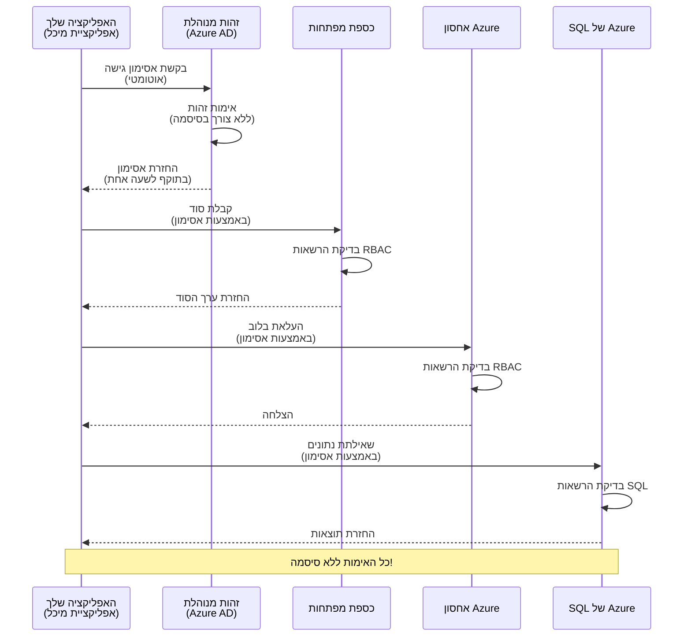
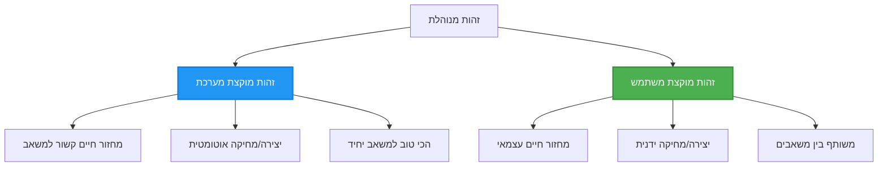

# דפוסי אימות וזהות מנוהלת

⏱️ **זמן משוער**: 45-60 דקות | 💰 **השפעת עלות**: חינם (ללא עלויות נוספות) | ⭐ **מורכבות**: בינוני

**📚 מסלול למידה:**
- ← קודם: [ניהול תצורה](configuration.md) - ניהול משתני סביבה וסודות
- 🎯 **אתם כאן**: אימות ואבטחה (זהות מנוהלת, Key Vault, דפוסים מאובטחים)
- → הבא: [פרויקט ראשון](first-project.md) - בניית אפליקציית AZD ראשונה
- 🏠 [דף הבית של הקורס](../../README.md)

---

## מה תלמדו

בסיום השיעור הזה, תלמדו:
- להבין דפוסי אימות של Azure (מפתחות, מחרוזות חיבור, זהות מנוהלת)
- ליישם **זהות מנוהלת** לאימות ללא סיסמה
- לאבטח סודות עם אינטגרציה של **Azure Key Vault**
- להגדיר **בקרת גישה מבוססת תפקידים (RBAC)** לפריסות AZD
- ליישם שיטות עבודה מומלצות לאבטחה ב-Container Apps ובשירותי Azure
- לעבור מאימות מבוסס מפתחות לאימות מבוסס זהות

## למה זהות מנוהלת חשובה

### הבעיה: אימות מסורתי

**לפני זהות מנוהלת:**
```javascript
// ❌ סיכון אבטחה: סודות מקודדים בקוד
const connectionString = "Server=mydb.database.windows.net;User=admin;Password=P@ssw0rd123";
const storageKey = "xK7mN9pQ2wR5tY8uI0oP3aS6dF1gH4jK...";
const cosmosKey = "C2x7B9n4M1p8Q5w3E6r0T2y5U8i1O4p7...";
```

**בעיות:**
- 🔴 **סודות חשופים** בקוד, בקבצי תצורה, במשתני סביבה
- 🔴 **סיבוכי סיבוב אישורים** דורשים שינוי קוד ופריסה מחדש
- 🔴 **סיוטי ביקורת** - מי ניגש למה ומתי?
- 🔴 **פיזור** - סודות מפוזרים במערכות שונות
- 🔴 **סיכוני תאימות** - כשל בביקורות אבטחה

### הפתרון: זהות מנוהלת

**אחרי זהות מנוהלת:**
```javascript
// ✅ מאובטח: אין סודות בקוד
const credential = new DefaultAzureCredential();
const client = new BlobServiceClient(
  "https://mystorageaccount.blob.core.windows.net",
  credential  // Azure מטפל באימות באופן אוטומטי
);
```

**יתרונות:**
- ✅ **ללא סודות** בקוד או בתצורה
- ✅ **סיבוב אוטומטי** - Azure מטפל בזה
- ✅ **מעקב מלא** ביומני Azure AD
- ✅ **אבטחה מרכזית** - ניהול בפורטל Azure
- ✅ **מוכן לתאימות** - עומד בתקני אבטחה

**אנלוגיה**: אימות מסורתי הוא כמו לשאת מפתחות פיזיים רבים לדלתות שונות. זהות מנוהלת היא כמו תג אבטחה שמעניק גישה אוטומטית על סמך מי שאתה—ללא מפתחות לאבד, להעתיק או לסובב.

---

## סקירה ארכיטקטונית

### זרימת אימות עם זהות מנוהלת


### סוגי זהויות מנוהלות


| תכונה | מוקצה למערכת | מוקצה למשתמש |
|-------|--------------|--------------|
| **מחזור חיים** | קשור למשאב | עצמאי |
| **יצירה** | אוטומטית עם המשאב | יצירה ידנית |
| **מחיקה** | נמחק עם המשאב | נשאר לאחר מחיקת המשאב |
| **שיתוף** | משאב אחד בלבד | מספר משאבים |
| **שימוש** | תרחישים פשוטים | תרחישים מורכבים מרובי משאבים |
| **ברירת מחדל ב-AZD** | ✅ מומלץ | אופציונלי |

---

## דרישות מוקדמות

### כלים נדרשים

עליכם כבר להתקין את הכלים האלו משיעורים קודמים:

```bash
# אמת את CLI של מפתחי Azure
azd version
# ✅ צפוי: גרסה azd 1.0.0 או גבוהה יותר

# אמת את CLI של Azure
az --version
# ✅ צפוי: azure-cli גרסה 2.50.0 או גבוהה יותר
```

### דרישות Azure

- מנוי Azure פעיל
- הרשאות ל:
  - יצירת זהויות מנוהלות
  - הקצאת תפקידי RBAC
  - יצירת משאבי Key Vault
  - פריסת Container Apps

### ידע מוקדם

עליכם להשלים:
- [מדריך התקנה](installation.md) - הגדרת AZD
- [יסודות AZD](azd-basics.md) - מושגים בסיסיים
- [ניהול תצורה](configuration.md) - משתני סביבה

---

## שיעור 1: הבנת דפוסי אימות

### דפוס 1: מחרוזות חיבור (ישן - להימנע)

**איך זה עובד:**
```bash
# מחרוזת החיבור מכילה אישורים
STORAGE_CONNECTION_STRING="DefaultEndpointsProtocol=https;AccountName=myaccount;AccountKey=xK7mN9pQ2wR5..."
COSMOS_CONNECTION_STRING="AccountEndpoint=https://myaccount.documents.azure.com:443/;AccountKey=C2x7..."
SQL_CONNECTION_STRING="Server=myserver.database.windows.net;User=admin;Password=P@ssw0rd..."
```

**בעיות:**
- ❌ סודות גלויים במשתני סביבה
- ❌ נרשמים במערכות פריסה
- ❌ קשה לסובב
- ❌ אין מעקב גישה

**מתי להשתמש:** רק לפיתוח מקומי, לעולם לא לפרודקשן.

---

### דפוס 2: הפניות ל-Key Vault (טוב יותר)

**איך זה עובד:**
```bicep
// Store secret in Key Vault
resource keyVault 'Microsoft.KeyVault/vaults@2023-02-01' = {
  name: 'mykv'
  properties: {
    enableRbacAuthorization: true
  }
}

// Reference in Container App
env: [
  {
    name: 'STORAGE_KEY'
    secretRef: 'storage-key'  // References Key Vault
  }
]
```

**יתרונות:**
- ✅ סודות מאוחסנים בצורה מאובטחת ב-Key Vault
- ✅ ניהול סודות מרכזי
- ✅ סיבוב ללא שינוי קוד

**מגבלות:**
- ⚠️ עדיין משתמשים במפתחות/סיסמאות
- ⚠️ צריך לנהל גישה ל-Key Vault

**מתי להשתמש:** שלב מעבר ממחרוזות חיבור לזהות מנוהלת.

---

### דפוס 3: זהות מנוהלת (שיטה מומלצת)

**איך זה עובד:**
```bicep
// Enable managed identity
resource containerApp 'Microsoft.App/containerApps@2023-05-01' = {
  name: 'myapp'
  identity: {
    type: 'SystemAssigned'  // Automatically creates identity
  }
}

// Grant permissions
resource roleAssignment 'Microsoft.Authorization/roleAssignments@2022-04-01' = {
  scope: storageAccount
  properties: {
    roleDefinitionId: storageBlobDataContributorRole
    principalId: containerApp.identity.principalId
  }
}
```

**קוד אפליקציה:**
```javascript
// אין צורך בסודות!
const { DefaultAzureCredential } = require('@azure/identity');
const { BlobServiceClient } = require('@azure/storage-blob');

const credential = new DefaultAzureCredential();
const blobServiceClient = new BlobServiceClient(
  'https://mystorageaccount.blob.core.windows.net',
  credential
);
```

**יתרונות:**
- ✅ ללא סודות בקוד/תצורה
- ✅ סיבוב אישורים אוטומטי
- ✅ מעקב מלא
- ✅ הרשאות מבוססות RBAC
- ✅ מוכן לתאימות

**מתי להשתמש:** תמיד, לאפליקציות בפרודקשן.

---

## שיעור 2: יישום זהות מנוהלת עם AZD

### יישום שלב-אחר-שלב

בואו נבנה Container App מאובטח שמשתמש בזהות מנוהלת לגישה ל-Azure Storage ול-Key Vault.

### מבנה הפרויקט

```
secure-app/
├── azure.yaml                 # AZD configuration
├── infra/
│   ├── main.bicep            # Main infrastructure
│   ├── core/
│   │   ├── identity.bicep    # Managed identity setup
│   │   ├── keyvault.bicep    # Key Vault configuration
│   │   └── storage.bicep     # Storage with RBAC
│   └── app/
│       └── container-app.bicep
└── src/
    ├── app.js                # Application code
    ├── package.json
    └── Dockerfile
```

### 1. הגדרת AZD (azure.yaml)

```yaml
name: secure-app
metadata:
  template: secure-app@1.0.0

services:
  api:
    project: ./src
    language: js
    host: containerapp

# Enable managed identity (AZD handles this automatically)
```

### 2. תשתית: הפעלת זהות מנוהלת

**קובץ: `infra/main.bicep`**

```bicep
targetScope = 'subscription'

param environmentName string
param location string = 'eastus'

var tags = { 'azd-env-name': environmentName }

// Resource group
resource rg 'Microsoft.Resources/resourceGroups@2021-04-01' = {
  name: 'rg-${environmentName}'
  location: location
  tags: tags
}

// Storage Account
module storage './core/storage.bicep' = {
  name: 'storage'
  scope: rg
  params: {
    name: 'st${uniqueString(rg.id)}'
    location: location
    tags: tags
  }
}

// Key Vault
module keyVault './core/keyvault.bicep' = {
  name: 'keyvault'
  scope: rg
  params: {
    name: 'kv-${uniqueString(rg.id)}'
    location: location
    tags: tags
  }
}

// Container App with Managed Identity
module containerApp './app/container-app.bicep' = {
  name: 'container-app'
  scope: rg
  params: {
    name: 'ca-${environmentName}'
    location: location
    tags: tags
    storageAccountName: storage.outputs.name
    keyVaultName: keyVault.outputs.name
  }
}

// Grant Container App access to Storage
module storageRoleAssignment './core/role-assignment.bicep' = {
  name: 'storage-role'
  scope: rg
  params: {
    principalId: containerApp.outputs.identityPrincipalId
    roleDefinitionId: 'ba92f5b4-2d11-453d-a403-e96b0029c9fe'  // Storage Blob Data Contributor
    targetResourceId: storage.outputs.id
  }
}

// Grant Container App access to Key Vault
module kvRoleAssignment './core/role-assignment.bicep' = {
  name: 'kv-role'
  scope: rg
  params: {
    principalId: containerApp.outputs.identityPrincipalId
    roleDefinitionId: '4633458b-17de-408a-b874-0445c86b69e6'  // Key Vault Secrets User
    targetResourceId: keyVault.outputs.id
  }
}

// Outputs
output AZURE_STORAGE_ACCOUNT_NAME string = storage.outputs.name
output AZURE_KEY_VAULT_NAME string = keyVault.outputs.name
output APP_URL string = containerApp.outputs.url
```

### 3. Container App עם זהות מוקצת למערכת

**קובץ: `infra/app/container-app.bicep`**

```bicep
param name string
param location string
param tags object = {}
param storageAccountName string
param keyVaultName string

resource containerApp 'Microsoft.App/containerApps@2023-05-01' = {
  name: name
  location: location
  tags: tags
  identity: {
    type: 'SystemAssigned'  // 🔑 Enable managed identity
  }
  properties: {
    configuration: {
      ingress: {
        external: true
        targetPort: 3000
      }
    }
    template: {
      containers: [
        {
          name: 'api'
          image: 'myregistry.azurecr.io/api:latest'
          resources: {
            cpu: json('0.5')
            memory: '1Gi'
          }
          env: [
            {
              name: 'AZURE_STORAGE_ACCOUNT_NAME'
              value: storageAccountName
            }
            {
              name: 'AZURE_KEY_VAULT_NAME'
              value: keyVaultName
            }
            // 🔑 No secrets - managed identity handles authentication!
          ]
        }
      ]
    }
  }
}

// Output the identity for RBAC assignments
output identityPrincipalId string = containerApp.identity.principalId
output id string = containerApp.id
output url string = 'https://${containerApp.properties.configuration.ingress.fqdn}'
```

### 4. מודול הקצאת תפקידי RBAC

**קובץ: `infra/core/role-assignment.bicep`**

```bicep
param principalId string
param roleDefinitionId string  // Azure built-in role ID
param targetResourceId string

resource roleAssignment 'Microsoft.Authorization/roleAssignments@2022-04-01' = {
  name: guid(principalId, roleDefinitionId, targetResourceId)
  scope: resourceId('Microsoft.Resources/resourceGroups', resourceGroup().name)
  properties: {
    roleDefinitionId: subscriptionResourceId('Microsoft.Authorization/roleDefinitions', roleDefinitionId)
    principalId: principalId
    principalType: 'ServicePrincipal'
  }
}

output id string = roleAssignment.id
```

### 5. קוד אפליקציה עם זהות מנוהלת

**קובץ: `src/app.js`**

```javascript
const express = require('express');
const { DefaultAzureCredential } = require('@azure/identity');
const { BlobServiceClient } = require('@azure/storage-blob');
const { SecretClient } = require('@azure/keyvault-secrets');

const app = express();
const PORT = process.env.PORT || 3000;

// 🔑 אתחול אישורים (עובד אוטומטית עם זהות מנוהלת)
const credential = new DefaultAzureCredential();

// הגדרת אחסון Azure
const storageAccountName = process.env.AZURE_STORAGE_ACCOUNT_NAME;
const blobServiceClient = new BlobServiceClient(
  `https://${storageAccountName}.blob.core.windows.net`,
  credential  // אין צורך במפתחות!
);

// הגדרת Key Vault
const keyVaultName = process.env.AZURE_KEY_VAULT_NAME;
const secretClient = new SecretClient(
  `https://${keyVaultName}.vault.azure.net`,
  credential  // אין צורך במפתחות!
);

// בדיקת בריאות
app.get('/health', (req, res) => {
  res.json({ status: 'healthy', authentication: 'managed-identity' });
});

// העלאת קובץ לאחסון Blob
app.post('/upload', async (req, res) => {
  try {
    const containerClient = blobServiceClient.getContainerClient('uploads');
    await containerClient.createIfNotExists();
    
    const blobName = `file-${Date.now()}.txt`;
    const blockBlobClient = containerClient.getBlockBlobClient(blobName);
    
    await blockBlobClient.upload('Hello from managed identity!', 30);
    
    res.json({
      success: true,
      blobName: blobName,
      message: 'File uploaded using managed identity!'
    });
  } catch (error) {
    console.error('Upload error:', error);
    res.status(500).json({ error: error.message });
  }
});

// קבלת סוד מ-Key Vault
app.get('/secret/:name', async (req, res) => {
  try {
    const secretName = req.params.name;
    const secret = await secretClient.getSecret(secretName);
    
    res.json({
      name: secretName,
      value: secret.value,
      message: 'Secret retrieved using managed identity!'
    });
  } catch (error) {
    console.error('Secret error:', error);
    res.status(500).json({ error: error.message });
  }
});

// רשימת מיכלי Blob (מדגים גישה לקריאה)
app.get('/containers', async (req, res) => {
  try {
    const containers = [];
    for await (const container of blobServiceClient.listContainers()) {
      containers.push(container.name);
    }
    
    res.json({
      containers: containers,
      count: containers.length,
      message: 'Containers listed using managed identity!'
    });
  } catch (error) {
    console.error('List error:', error);
    res.status(500).json({ error: error.message });
  }
});

app.listen(PORT, () => {
  console.log(`Secure API listening on port ${PORT}`);
  console.log('Authentication: Managed Identity (passwordless)');
});
```

**קובץ: `src/package.json`**

```json
{
  "name": "secure-app",
  "version": "1.0.0",
  "dependencies": {
    "express": "^4.18.2",
    "@azure/identity": "^4.0.0",
    "@azure/storage-blob": "^12.17.0",
    "@azure/keyvault-secrets": "^4.7.0"
  },
  "scripts": {
    "start": "node app.js"
  }
}
```

### 6. פריסה ובדיקה

```bash
# אתחל את סביבת AZD
azd init

# פרוס תשתית ויישום
azd up

# קבל את כתובת ה-URL של האפליקציה
APP_URL=$(azd env get-values | grep APP_URL | cut -d '=' -f2 | tr -d '"')

# בדוק את בדיקת הבריאות
curl $APP_URL/health
```

**✅ פלט צפוי:**
```json
{
  "status": "healthy",
  "authentication": "managed-identity"
}
```

**בדיקת העלאת blob:**
```bash
curl -X POST $APP_URL/upload
```

**✅ פלט צפוי:**
```json
{
  "success": true,
  "blobName": "file-1700404800000.txt",
  "message": "File uploaded using managed identity!"
}
```

**בדיקת רשימת קונטיינרים:**
```bash
curl $APP_URL/containers
```

**✅ פלט צפוי:**
```json
{
  "containers": ["uploads"],
  "count": 1,
  "message": "Containers listed using managed identity!"
}
```

---

## תפקידי RBAC נפוצים ב-Azure

### מזהי תפקידים מובנים לזהות מנוהלת

| שירות | שם תפקיד | מזהה תפקיד | הרשאות |
|-------|----------|------------|---------|
| **אחסון** | Storage Blob Data Reader | `2a2b9908-6b94-4a3d-8e5a-a7d8f8cc8a12` | קריאת blobs וקונטיינרים |
| **אחסון** | Storage Blob Data Contributor | `ba92f5b4-2d11-453d-a403-e96b0029c9fe` | קריאה, כתיבה, מחיקת blobs |
| **אחסון** | Storage Queue Data Contributor | `974c5e8b-45b9-4653-ba55-5f855dd0fb88` | קריאה, כתיבה, מחיקת הודעות תור |
| **Key Vault** | Key Vault Secrets User | `4633458b-17de-408a-b874-0445c86b69e6` | קריאת סודות |
| **Key Vault** | Key Vault Secrets Officer | `b86a8fe4-44ce-4948-aee5-eccb2c155cd7` | קריאה, כתיבה, מחיקת סודות |
| **Cosmos DB** | Cosmos DB Built-in Data Reader | `00000000-0000-0000-0000-000000000001` | קריאת נתוני Cosmos DB |
| **Cosmos DB** | Cosmos DB Built-in Data Contributor | `00000000-0000-0000-0000-000000000002` | קריאה, כתיבה של נתוני Cosmos DB |
| **SQL Database** | SQL DB Contributor | `9b7fa17d-e63e-47b0-bb0a-15c516ac86ec` | ניהול מסדי נתונים SQL |
| **Service Bus** | Azure Service Bus Data Owner | `090c5cfd-751d-490a-894a-3ce6f1109419` | שליחה, קבלה, ניהול הודעות |

### איך למצוא מזהי תפקידים

```bash
# רשימת כל התפקידים המובנים
az role definition list --query "[].{Name:roleName, ID:name}" --output table

# חיפוש תפקיד ספציפי
az role definition list --query "[?contains(roleName, 'Storage Blob')].{Name:roleName, ID:name}" --output table

# קבלת פרטי תפקיד
az role definition list --name "Storage Blob Data Contributor"
```

---

## תרגילים מעשיים

### תרגיל 1: הפעלת זהות מנוהלת לאפליקציה קיימת ⭐⭐ (בינוני)

**מטרה**: הוספת זהות מנוהלת לפריסת Container App קיימת

**תרחיש**: יש לכם Container App שמשתמש במחרוזות חיבור. המירו אותו לזהות מנוהלת.

**נקודת התחלה**: Container App עם התצורה הבאה:

```bicep
// ❌ Current: Using connection string
env: [
  {
    name: 'STORAGE_CONNECTION_STRING'
    secretRef: 'storage-connection'
  }
]
```

**שלבים**:

1. **הפעלת זהות מנוהלת ב-Bicep:**

```bicep
resource containerApp 'Microsoft.App/containerApps@2023-05-01' = {
  name: 'myapp'
  identity: {
    type: 'SystemAssigned'  // Add this
  }
  // ... rest of configuration
}
```

2. **הענקת גישת אחסון:**

```bicep
// Get storage account reference
resource storageAccount 'Microsoft.Storage/storageAccounts@2023-01-01' existing = {
  name: storageAccountName
}

// Assign role
resource roleAssignment 'Microsoft.Authorization/roleAssignments@2022-04-01' = {
  name: guid(containerApp.id, 'ba92f5b4-2d11-453d-a403-e96b0029c9fe', storageAccount.id)
  scope: storageAccount
  properties: {
    roleDefinitionId: subscriptionResourceId('Microsoft.Authorization/roleDefinitions', 'ba92f5b4-2d11-453d-a403-e96b0029c9fe')
    principalId: containerApp.identity.principalId
    principalType: 'ServicePrincipal'
  }
}
```

3. **עדכון קוד האפליקציה:**

**לפני (מחרוזת חיבור):**
```javascript
const { BlobServiceClient } = require('@azure/storage-blob');

const blobServiceClient = BlobServiceClient.fromConnectionString(
  process.env.STORAGE_CONNECTION_STRING
);
```

**אחרי (זהות מנוהלת):**
```javascript
const { DefaultAzureCredential } = require('@azure/identity');
const { BlobServiceClient } = require('@azure/storage-blob');

const credential = new DefaultAzureCredential();
const blobServiceClient = new BlobServiceClient(
  `https://${process.env.STORAGE_ACCOUNT_NAME}.blob.core.windows.net`,
  credential
);
```

4. **עדכון משתני סביבה:**

```bicep
env: [
  {
    name: 'STORAGE_ACCOUNT_NAME'
    value: storageAccountName  // Just the name, no secrets!
  }
  // Remove STORAGE_CONNECTION_STRING
]
```

5. **פריסה ובדיקה:**

```bash
# פריסה מחדש
azd up

# בדוק שזה עדיין עובד
curl https://myapp.azurecontainerapps.io/upload
```

**✅ קריטריוני הצלחה:**
- ✅ האפליקציה נפרסת ללא שגיאות
- ✅ פעולות אחסון עובדות (העלאה, רשימה, הורדה)
- ✅ אין מחרוזות חיבור במשתני סביבה
- ✅ זהות נראית בפורטל Azure תחת לשונית "Identity"

**אימות:**

```bash
# בדוק אם זהות מנוהלת מופעלת
az containerapp show \
  --name myapp \
  --resource-group rg-myapp \
  --query "identity.type"
# ✅ צפוי: "SystemAssigned"

# בדוק הקצאת תפקיד
az role assignment list \
  --assignee $(az containerapp show --name myapp --resource-group rg-myapp --query "identity.principalId" -o tsv) \
  --scope /subscriptions/{sub-id}/resourceGroups/rg-myapp/providers/Microsoft.Storage/storageAccounts/mystorageaccount
# ✅ צפוי: מציג תפקיד "Storage Blob Data Contributor"
```

**זמן**: 20-30 דקות

---

### תרגיל 2: גישה מרובת שירותים עם זהות מוקצת למשתמש ⭐⭐⭐ (מתקדם)

**מטרה**: יצירת זהות מוקצת למשתמש שמשותפת בין מספר Container Apps

**תרחיש**: יש לכם 3 מיקרו-שירותים שכולם צריכים גישה לאותו חשבון אחסון ו-Key Vault.

**שלבים**:

1. **יצירת זהות מוקצת למשתמש:**

**קובץ: `infra/core/identity.bicep`**

```bicep
param name string
param location string
param tags object = {}

resource userAssignedIdentity 'Microsoft.ManagedIdentity/userAssignedIdentities@2023-01-31' = {
  name: name
  location: location
  tags: tags
}

output id string = userAssignedIdentity.id
output principalId string = userAssignedIdentity.properties.principalId
output clientId string = userAssignedIdentity.properties.clientId
```

2. **הקצאת תפקידים לזהות מוקצת למשתמש:**

```bicep
// In main.bicep
module userIdentity './core/identity.bicep' = {
  name: 'user-identity'
  scope: rg
  params: {
    name: 'id-${environmentName}'
    location: location
    tags: tags
  }
}

// Grant Storage access
resource storageRoleAssignment 'Microsoft.Authorization/roleAssignments@2022-04-01' = {
  name: guid(userIdentity.outputs.principalId, 'storage-contributor')
  scope: storageAccount
  properties: {
    roleDefinitionId: subscriptionResourceId('Microsoft.Authorization/roleDefinitions', 'ba92f5b4-2d11-453d-a403-e96b0029c9fe')
    principalId: userIdentity.outputs.principalId
    principalType: 'ServicePrincipal'
  }
}

// Grant Key Vault access
resource kvRoleAssignment 'Microsoft.Authorization/roleAssignments@2022-04-01' = {
  name: guid(userIdentity.outputs.principalId, 'kv-secrets-user')
  scope: keyVault
  properties: {
    roleDefinitionId: subscriptionResourceId('Microsoft.Authorization/roleDefinitions', '4633458b-17de-408a-b874-0445c86b69e6')
    principalId: userIdentity.outputs.principalId
    principalType: 'ServicePrincipal'
  }
}
```

3. **הקצאת זהות למספר Container Apps:**

```bicep
resource apiGateway 'Microsoft.App/containerApps@2023-05-01' = {
  name: 'api-gateway'
  identity: {
    type: 'UserAssigned'
    userAssignedIdentities: {
      '${userIdentity.outputs.id}': {}
    }
  }
  // ... rest of config
}

resource productService 'Microsoft.App/containerApps@2023-05-01' = {
  name: 'product-service'
  identity: {
    type: 'UserAssigned'
    userAssignedIdentities: {
      '${userIdentity.outputs.id}': {}
    }
  }
  // ... rest of config
}

resource orderService 'Microsoft.App/containerApps@2023-05-01' = {
  name: 'order-service'
  identity: {
    type: 'UserAssigned'
    userAssignedIdentities: {
      '${userIdentity.outputs.id}': {}
    }
  }
  // ... rest of config
}
```

4. **קוד אפליקציה (כל השירותים משתמשים באותו דפוס):**

```javascript
const { DefaultAzureCredential, ManagedIdentityCredential } = require('@azure/identity');

// עבור זהות שהוקצתה על ידי המשתמש, ציין את מזהה הלקוח
const credential = new ManagedIdentityCredential(
  process.env.AZURE_CLIENT_ID  // מזהה לקוח של זהות שהוקצתה על ידי המשתמש
);

// או השתמש ב-DefaultAzureCredential (מזהה אוטומטית)
const credential = new DefaultAzureCredential();

const blobServiceClient = new BlobServiceClient(
  `https://${process.env.STORAGE_ACCOUNT_NAME}.blob.core.windows.net`,
  credential
);
```

5. **פריסה ואימות:**

```bash
azd up

# בדוק שכל השירותים יכולים לגשת לאחסון
curl https://api-gateway.azurecontainerapps.io/upload
curl https://product-service.azurecontainerapps.io/upload
curl https://order-service.azurecontainerapps.io/upload
```

**✅ קריטריוני הצלחה:**
- ✅ זהות אחת משותפת בין 3 שירותים
- ✅ כל השירותים יכולים לגשת לאחסון ול-Key Vault
- ✅ הזהות נשארת אם מוחקים שירות אחד
- ✅ ניהול הרשאות מרכזי

**יתרונות זהות מוקצת למשתמש:**
- זהות אחת לניהול
- הרשאות עקביות בין שירותים
- שורדת מחיקת שירות
- טוב לארכיטקטורות מורכבות

**זמן**: 30-40 דקות

---

### תרגיל 3: יישום סיבוב סודות ב-Key Vault ⭐⭐⭐ (מתקדם)

**מטרה**: אחסון מפתחות API של צד שלישי ב-Key Vault וגישה אליהם באמצעות זהות מנוהלת

**תרחיש**: האפליקציה שלכם צריכה לקרוא ל-API חיצוני (OpenAI, Stripe, SendGrid) שדורש מפתחות API.

**שלבים**:

1. **יצירת Key Vault עם RBAC:**

**קובץ: `infra/core/keyvault.bicep`**

```bicep
param name string
param location string
param tags object = {}

resource keyVault 'Microsoft.KeyVault/vaults@2023-02-01' = {
  name: name
  location: location
  tags: tags
  properties: {
    enableRbacAuthorization: true  // Use RBAC instead of access policies
    sku: {
      family: 'A'
      name: 'standard'
    }
    tenantId: subscription().tenantId
    enableSoftDelete: true
    softDeleteRetentionInDays: 90
  }
}

// Allow Container App to read secrets
output id string = keyVault.id
output name string = keyVault.name
output uri string = keyVault.properties.vaultUri
```

2. **אחסון סודות ב-Key Vault:**

```bash
# קבל את שם ה-Key Vault
KV_NAME=$(azd env get-values | grep AZURE_KEY_VAULT_NAME | cut -d '=' -f2 | tr -d '"')

# אחסן מפתחות API של צד שלישי
az keyvault secret set \
  --vault-name $KV_NAME \
  --name "OpenAI-ApiKey" \
  --value "sk-proj-xxxxxxxxxxxxx"

az keyvault secret set \
  --vault-name $KV_NAME \
  --name "Stripe-ApiKey" \
  --value "sk_live_xxxxxxxxxxxxx"

az keyvault secret set \
  --vault-name $KV_NAME \
  --name "SendGrid-ApiKey" \
  --value "SG.xxxxxxxxxxxxx"
```

3. **קוד אפליקציה לשליפת סודות:**

**קובץ: `src/config.js`**

```javascript
const { DefaultAzureCredential } = require('@azure/identity');
const { SecretClient } = require('@azure/keyvault-secrets');

class Config {
  constructor() {
    this.credential = new DefaultAzureCredential();
    this.secretClient = new SecretClient(
      `https://${process.env.AZURE_KEY_VAULT_NAME}.vault.azure.net`,
      this.credential
    );
    this.cache = {};
  }

  async getSecret(secretName) {
    // בדוק את המטמון תחילה
    if (this.cache[secretName]) {
      return this.cache[secretName];
    }

    try {
      const secret = await this.secretClient.getSecret(secretName);
      this.cache[secretName] = secret.value;
      console.log(`✅ Retrieved secret: ${secretName}`);
      return secret.value;
    } catch (error) {
      console.error(`❌ Failed to get secret ${secretName}:`, error.message);
      throw error;
    }
  }

  async getOpenAIKey() {
    return this.getSecret('OpenAI-ApiKey');
  }

  async getStripeKey() {
    return this.getSecret('Stripe-ApiKey');
  }

  async getSendGridKey() {
    return this.getSecret('SendGrid-ApiKey');
  }
}

module.exports = new Config();
```

4. **שימוש בסודות באפליקציה:**

**קובץ: `src/app.js`**

```javascript
const express = require('express');
const config = require('./config');
const { OpenAI } = require('openai');

const app = express();

// אתחל את OpenAI עם מפתח מ-Key Vault
let openaiClient;

async function initializeServices() {
  const openaiKey = await config.getOpenAIKey();
  openaiClient = new OpenAI({ apiKey: openaiKey });
  console.log('✅ Services initialized with secrets from Key Vault');
}

// קרא בעת הפעלה
initializeServices().catch(console.error);

app.post('/chat', async (req, res) => {
  try {
    const completion = await openaiClient.chat.completions.create({
      model: 'gpt-4',
      messages: [{ role: 'user', content: 'Hello!' }]
    });
    
    res.json({
      response: completion.choices[0].message.content,
      authentication: 'Key from Key Vault via Managed Identity'
    });
  } catch (error) {
    res.status(500).json({ error: error.message });
  }
});

app.listen(3000, () => {
  console.log('Secure API with Key Vault integration running');
});
```

5. **פריסה ובדיקה:**

```bash
azd up

# בדוק שמפתחות API עובדים
curl -X POST https://myapp.azurecontainerapps.io/chat \
  -H "Content-Type: application/json" \
  -d '{"message":"Hello AI"}'
```

**✅ קריטריוני הצלחה:**
- ✅ אין מפתחות API בקוד או במשתני סביבה
- ✅ האפליקציה שולפת מפתחות מ-Key Vault
- ✅ ה-APIs של צד שלישי עובדים כראוי
- ✅ ניתן לסובב מפתחות ללא שינוי קוד

**סיבוב סוד:**

```bash
# עדכן סוד ב-Key Vault
az keyvault secret set \
  --vault-name $KV_NAME \
  --name "OpenAI-ApiKey" \
  --value "sk-proj-NEW_KEY_HERE"

# הפעל מחדש את האפליקציה כדי לקלוט את המפתח החדש
az containerapp revision restart \
  --name myapp \
  --resource-group rg-myapp
```

**זמן**: 25-35 דקות

---

## נקודת בדיקה לידע

### 1. דפוסי אימות ✓

בדקו את הבנתכם:

- [ ] **שאלה 1**: מהם שלושת דפוסי האימות העיקריים? 
  - **תשובה**: מחרוזות חיבור (ישן), הפניות ל-Key Vault (מעבר), זהות מנוהלת (הטוב ביותר)

- [ ] **שאלה 2**: למה זהות מנוהלת עדיפה על מחרוזות חיבור?
  - **תשובה**: אין סודות בקוד, סיבוב אוטומטי, מעקב מלא, הרשאות RBAC

- [ ] **שאלה 3**: מתי תשתמשו בזהות מוקצת למשתמש במקום מוקצת למערכת?
  - **תשובה**: כשמשתפים זהות בין מספר משאבים או כשהמחזור חיים של הזהות עצמאי מהמשאב

**אימות מעשי:**
```bash
# בדוק איזה סוג זהות האפליקציה שלך משתמשת
az containerapp show \
  --name myapp \
  --resource-group rg-myapp \
  --query "identity.type"

# רשום את כל הקצאות התפקידים עבור הזהות
az role assignment list \
  --assignee $(az containerapp show --name myapp --resource-group rg-myapp --query "identity.principalId" -o tsv)
```

---

### 2. RBAC והרשאות ✓

בדקו את הבנתכם:

- [ ] **שאלה 1**: מהו מזהה התפקיד של "Storage Blob Data Contributor"?
  - **תשובה**: `ba92f5b4-2d11-453d-a403-e96b0029c9fe`

- [ ] **שאלה 2**: אילו הרשאות מספק "Key Vault Secrets User"?
  - **תשובה**: גישה לקריאה בלבד לסודות (לא ניתן ליצור, לעדכן או למחוק)

- [ ] **שאלה 3**: איך מעניקים ל-Container App גישה ל-Azure SQL?
  - **תשובה**: הקצאת תפקיד "SQL DB Contributor" או הגדרת אימות Azure AD עבור SQL

**אימות מעשי:**
```bash
# מצא תפקיד ספציפי
az role definition list --name "Storage Blob Data Contributor"

# בדוק אילו תפקידים מוקצים לזהות שלך
PRINCIPAL_ID=$(az containerapp show --name myapp --resource-group rg-myapp --query "identity.principalId" -o tsv)
az role assignment list --assignee $PRINCIPAL_ID --output table
```

---

### 3. אינטגרציה עם Key Vault ✓

בדקו את הבנתכם:
- [ ] **שאלה 1**: איך מפעילים RBAC עבור Key Vault במקום מדיניות גישה?
  - **תשובה**: יש להגדיר `enableRbacAuthorization: true` ב-Bicep

- [ ] **שאלה 2**: איזה ספריית SDK של Azure מטפלת באימות זהות מנוהלת?
  - **תשובה**: `@azure/identity` עם מחלקת `DefaultAzureCredential`

- [ ] **שאלה 3**: כמה זמן נשמרים סודות של Key Vault במטמון?
  - **תשובה**: תלוי באפליקציה; יש ליישם אסטרטגיית מטמון משלכם

**אימות מעשי:**
```bash
# בדוק גישה ל-Key Vault
az keyvault secret show \
  --vault-name $KV_NAME \
  --name "OpenAI-ApiKey" \
  --query "value"

# בדוק ש-RBAC מופעל
az keyvault show \
  --name $KV_NAME \
  --query "properties.enableRbacAuthorization"
# ✅ צפוי: true
```

---

## המלצות אבטחה

### ✅ עשה:

1. **תמיד השתמש בזהות מנוהלת בסביבת ייצור**
   ```bicep
   identity: {
     type: 'SystemAssigned'
   }
   ```

2. **השתמש בתפקידי RBAC עם הרשאות מינימליות**
   - השתמש בתפקידים כמו "Reader" כשאפשר
   - הימנע מתפקידים כמו "Owner" או "Contributor" אלא אם כן הכרחי

3. **אחסן מפתחות צד שלישי ב-Key Vault**
   ```javascript
   const apiKey = await secretClient.getSecret('ThirdPartyApiKey');
   ```

4. **הפעל רישום ביקורת**
   ```bicep
   diagnosticSettings: {
     logs: [{ category: 'AuditEvent', enabled: true }]
   }
   ```

5. **השתמש בזהויות שונות עבור פיתוח/בדיקות/ייצור**
   ```bash
   azd env new dev
   azd env new staging
   azd env new prod
   ```

6. **סובב סודות באופן קבוע**
   - הגדר תאריכי תפוגה לסודות ב-Key Vault
   - בצע אוטומציה לסיבוב באמצעות Azure Functions

### ❌ אל תעשה:

1. **לעולם אל תקודד סודות בקוד**
   ```javascript
   // ❌ רע
   const apiKey = "sk-proj-xxxxxxxxxxxxx";
   ```

2. **אל תשתמש במחרוזות חיבור בסביבת ייצור**
   ```javascript
   // ❌ רע
   BlobServiceClient.fromConnectionString(process.env.STORAGE_CONNECTION_STRING)
   ```

3. **אל תעניק הרשאות מיותרות**
   ```bicep
   // ❌ BAD - too much access
   roleDefinitionId: 'Owner'
   
   // ✅ GOOD - least privilege
   roleDefinitionId: 'Storage Blob Data Reader'
   ```

4. **אל תרשום סודות**
   ```javascript
   // ❌ רע
   console.log('API Key:', apiKey);
   
   // ✅ טוב
   console.log('API Key retrieved successfully');
   ```

5. **אל תשתף זהויות ייצור בין סביבות**
   ```bicep
   // ❌ BAD - same identity for dev and prod
   // ✅ GOOD - separate identities per environment
   ```

---

## מדריך פתרון בעיות

### בעיה: "Unauthorized" בעת גישה ל-Azure Storage

**תסמינים:**
```
Error: Unauthorized (403)
AuthorizationPermissionMismatch: This request is not authorized to perform this operation
```

**אבחון:**

```bash
# בדוק אם זהות מנוהלת מופעלת
az containerapp show \
  --name myapp \
  --resource-group rg-myapp \
  --query "identity.type"
# ✅ צפוי: "SystemAssigned" או "UserAssigned"

# בדוק הקצאות תפקיד
PRINCIPAL_ID=$(az containerapp show --name myapp --resource-group rg-myapp --query "identity.principalId" -o tsv)
az role assignment list --assignee $PRINCIPAL_ID

# צפוי: צריך לראות "Storage Blob Data Contributor" או תפקיד דומה
```

**פתרונות:**

1. **הענק תפקיד RBAC מתאים:**
```bash
STORAGE_ID=$(az storage account show --name mystorageaccount --resource-group rg-myapp --query "id" -o tsv)
az role assignment create \
  --assignee $PRINCIPAL_ID \
  --role "Storage Blob Data Contributor" \
  --scope $STORAGE_ID
```

2. **המתן להפצה (יכול לקחת 5-10 דקות):**
```bash
# בדוק את מצב הקצאת התפקיד
az role assignment list --assignee $PRINCIPAL_ID --scope $STORAGE_ID
```

3. **וודא שהקוד באפליקציה משתמש באישורים הנכונים:**
```javascript
// ודא שאתה משתמש ב-DefaultAzureCredential
const credential = new DefaultAzureCredential();
```

---

### בעיה: גישה ל-Key Vault נדחתה

**תסמינים:**
```
Error: Forbidden (403)
The user, group or application does not have secrets get permission
```

**אבחון:**

```bash
# בדוק אם RBAC של Key Vault מופעל
az keyvault show \
  --name $KV_NAME \
  --query "properties.enableRbacAuthorization"
# ✅ צפוי: נכון

# בדוק הקצאות תפקידים
az role assignment list \
  --assignee $PRINCIPAL_ID \
  --scope /subscriptions/{sub-id}/resourceGroups/rg-myapp/providers/Microsoft.KeyVault/vaults/$KV_NAME
```

**פתרונות:**

1. **הפעל RBAC ב-Key Vault:**
```bash
az keyvault update \
  --name $KV_NAME \
  --enable-rbac-authorization true
```

2. **הענק תפקיד Key Vault Secrets User:**
```bash
KV_ID=$(az keyvault show --name $KV_NAME --query "id" -o tsv)
az role assignment create \
  --assignee $PRINCIPAL_ID \
  --role "Key Vault Secrets User" \
  --scope $KV_ID
```

---

### בעיה: DefaultAzureCredential נכשל מקומית

**תסמינים:**
```
Error: DefaultAzureCredential failed to retrieve a token
CredentialUnavailableError: No credential available
```

**אבחון:**

```bash
# בדוק אם אתה מחובר
az account show

# בדוק אימות Azure CLI
az ad signed-in-user show
```

**פתרונות:**

1. **התחבר ל-Azure CLI:**
```bash
az login
```

2. **הגדר מנוי Azure:**
```bash
az account set --subscription "Your Subscription Name"
```

3. **לצורך פיתוח מקומי, השתמש במשתני סביבה:**
```bash
export AZURE_TENANT_ID="your-tenant-id"
export AZURE_CLIENT_ID="your-client-id"
export AZURE_CLIENT_SECRET="your-client-secret"
```

4. **או השתמש באישורים שונים מקומית:**
```javascript
const { DefaultAzureCredential, AzureCliCredential } = require('@azure/identity');

// השתמש ב-AzureCliCredential לפיתוח מקומי
const credential = process.env.NODE_ENV === 'production' 
  ? new DefaultAzureCredential()
  : new AzureCliCredential();
```

---

### בעיה: הפצת תפקידים לוקחת זמן רב מדי

**תסמינים:**
- התפקיד הוקצה בהצלחה
- עדיין מתקבלות שגיאות 403
- גישה לסירוגין (לפעמים עובד, לפעמים לא)

**הסבר:**
שינויים ב-RBAC של Azure יכולים לקחת 5-10 דקות להפצה גלובלית.

**פתרון:**

```bash
# המתן ונסה שוב
echo "Waiting for RBAC propagation..."
sleep 300  # המתן 5 דקות

# בדוק גישה
curl https://myapp.azurecontainerapps.io/upload

# אם עדיין נכשל, הפעל מחדש את האפליקציה
az containerapp revision restart \
  --name myapp \
  --resource-group rg-myapp
```

---

## שיקולי עלות

### עלויות זהות מנוהלת

| משאב | עלות |
|------|------|
| **זהות מנוהלת** | 🆓 **חינם** - ללא חיוב |
| **הקצאות תפקיד RBAC** | 🆓 **חינם** - ללא חיוב |
| **בקשות טוקן של Azure AD** | 🆓 **חינם** - כלול |
| **פעולות Key Vault** | $0.03 לכל 10,000 פעולות |
| **אחסון Key Vault** | $0.024 לכל סוד לחודש |

**זהות מנוהלת חוסכת כסף על ידי:**
- ✅ ביטול פעולות Key Vault עבור אימות בין שירותים
- ✅ הפחתת אירועי אבטחה (אין אישורים דלופים)
- ✅ הפחתת עומס תפעולי (אין צורך בסיבוב ידני)

**השוואת עלויות לדוגמה (חודשי):**

| תרחיש | מחרוזות חיבור | זהות מנוהלת | חיסכון |
|-------|---------------|-------------|--------|
| אפליקציה קטנה (1M בקשות) | ~$50 (Key Vault + פעולות) | ~$0 | $50 לחודש |
| אפליקציה בינונית (10M בקשות) | ~$200 | ~$0 | $200 לחודש |
| אפליקציה גדולה (100M בקשות) | ~$1,500 | ~$0 | $1,500 לחודש |

---

## למידע נוסף

### תיעוד רשמי
- [זהות מנוהלת של Azure](https://learn.microsoft.com/entra/identity/managed-identities-azure-resources/overview)
- [RBAC של Azure](https://learn.microsoft.com/azure/role-based-access-control/overview)
- [Azure Key Vault](https://learn.microsoft.com/azure/key-vault/general/overview)
- [DefaultAzureCredential](https://learn.microsoft.com/dotnet/api/azure.identity.defaultazurecredential)

### תיעוד SDK
- [@azure/identity (Node.js)](https://www.npmjs.com/package/@azure/identity)
- [Azure.Identity (C#)](https://www.nuget.org/packages/Azure.Identity/)
- [azure-identity (Python)](https://pypi.org/project/azure-identity/)

### צעדים הבאים בקורס
- ← קודם: [ניהול תצורה](configuration.md)
- → הבא: [פרויקט ראשון](first-project.md)
- 🏠 [דף הבית של הקורס](../../README.md)

### דוגמאות קשורות
- [דוגמת Azure OpenAI Chat](../../../../examples/azure-openai-chat) - משתמש בזהות מנוהלת עבור Azure OpenAI
- [דוגמת מיקרו-שירותים](../../../../examples/microservices) - דפוסי אימות רב-שירותיים

---

## סיכום

**למדת:**
- ✅ שלושה דפוסי אימות (מחרוזות חיבור, Key Vault, זהות מנוהלת)
- ✅ איך להפעיל ולהגדיר זהות מנוהלת ב-AZD
- ✅ הקצאות תפקיד RBAC לשירותי Azure
- ✅ אינטגרציה של Key Vault עבור סודות צד שלישי
- ✅ זהויות מוקצות משתמש מול מוקצות מערכת
- ✅ המלצות אבטחה ופתרון בעיות

**נקודות עיקריות:**
1. **תמיד השתמש בזהות מנוהלת בסביבת ייצור** - ללא סודות, סיבוב אוטומטי
2. **השתמש בתפקידי RBAC עם הרשאות מינימליות** - הענק רק הרשאות הכרחיות
3. **אחסן מפתחות צד שלישי ב-Key Vault** - ניהול סודות מרכזי
4. **הפרד זהויות לפי סביבה** - בידוד פיתוח, בדיקות וייצור
5. **הפעל רישום ביקורת** - עקוב מי ניגש למה

**צעדים הבאים:**
1. השלם את התרגילים המעשיים לעיל
2. העבר אפליקציה קיימת ממחרוזות חיבור לזהות מנוהלת
3. בנה את פרויקט AZD הראשון שלך עם אבטחה מהיום הראשון: [פרויקט ראשון](first-project.md)

---

<!-- CO-OP TRANSLATOR DISCLAIMER START -->
**כתב ויתור**:  
מסמך זה תורגם באמצעות שירות תרגום AI [Co-op Translator](https://github.com/Azure/co-op-translator). למרות שאנו שואפים לדיוק, יש לקחת בחשבון שתרגומים אוטומטיים עשויים להכיל שגיאות או אי דיוקים. המסמך המקורי בשפתו המקורית צריך להיחשב כמקור סמכותי. עבור מידע קריטי, מומלץ להשתמש בתרגום מקצועי אנושי. איננו אחראים לאי הבנות או לפרשנויות שגויות הנובעות משימוש בתרגום זה.
<!-- CO-OP TRANSLATOR DISCLAIMER END -->