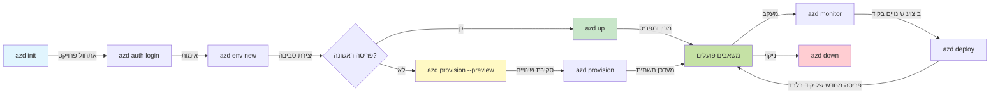
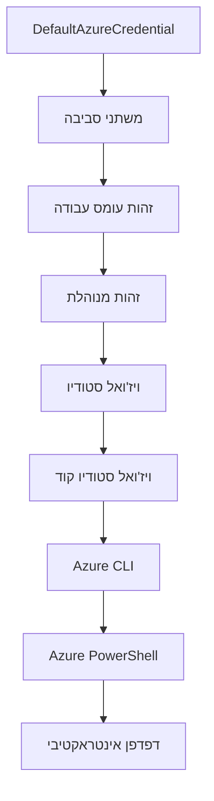

<!--
CO_OP_TRANSLATOR_METADATA:
{
  "original_hash": "e855e899d2705754fe85b04190edd0f0",
  "translation_date": "2025-11-21T17:35:55+00:00",
  "source_file": "docs/getting-started/azd-basics.md",
  "language_code": "he"
}
-->
# יסודות AZD - הבנת Azure Developer CLI

# יסודות AZD - מושגים ועקרונות בסיסיים

**ניווט פרקים:**
- **📚 דף הבית של הקורס**: [AZD למתחילים](../../README.md)
- **📖 פרק נוכחי**: פרק 1 - יסודות והתחלה מהירה
- **⬅️ קודם**: [סקירת הקורס](../../README.md#-chapter-1-foundation--quick-start)
- **➡️ הבא**: [התקנה והגדרות](installation.md)
- **🚀 פרק הבא**: [פרק 2: פיתוח מבוסס AI](../microsoft-foundry/microsoft-foundry-integration.md)

## מבוא

השיעור הזה מציג את Azure Developer CLI (azd), כלי שורת פקודה עוצמתי שמאיץ את המעבר שלך מפיתוח מקומי לפריסה ב-Azure. תלמד את המושגים הבסיסיים, התכונות המרכזיות, ותבין כיצד azd מפשט את תהליך הפריסה של יישומים מבוססי ענן.

## מטרות למידה

בסיום השיעור הזה, תוכל:
- להבין מהו Azure Developer CLI ומה מטרתו העיקרית
- ללמוד את המושגים המרכזיים של תבניות, סביבות ושירותים
- לחקור תכונות מרכזיות כמו פיתוח מבוסס תבניות ותשתית כקוד
- להבין את מבנה הפרויקט של azd ואת זרימת העבודה
- להיות מוכן להתקין ולהגדיר את azd בסביבת הפיתוח שלך

## תוצאות למידה

לאחר השלמת השיעור, תוכל:
- להסביר את תפקיד azd בזרימות עבודה מודרניות של פיתוח בענן
- לזהות את הרכיבים של מבנה פרויקט azd
- לתאר כיצד תבניות, סביבות ושירותים עובדים יחד
- להבין את היתרונות של תשתית כקוד עם azd
- לזהות פקודות שונות של azd ואת מטרותיהן

## מהו Azure Developer CLI (azd)?

Azure Developer CLI (azd) הוא כלי שורת פקודה שנועד להאיץ את המעבר שלך מפיתוח מקומי לפריסה ב-Azure. הוא מפשט את תהליך הבנייה, הפריסה והניהול של יישומים מבוססי ענן ב-Azure.

### 🎯 למה להשתמש ב-AZD? השוואה מעשית

בואו נשווה פריסה של אפליקציית ווב פשוטה עם מסד נתונים:

#### ❌ ללא AZD: פריסה ידנית ב-Azure (30+ דקות)

```bash
# שלב 1: צור קבוצת משאבים
az group create --name myapp-rg --location eastus

# שלב 2: צור תוכנית שירות אפליקציות
az appservice plan create --name myapp-plan \
  --resource-group myapp-rg \
  --sku B1 --is-linux

# שלב 3: צור אפליקציית אינטרנט
az webapp create --name myapp-web-unique123 \
  --resource-group myapp-rg \
  --plan myapp-plan \
  --runtime "NODE:18-lts"

# שלב 4: צור חשבון Cosmos DB (10-15 דקות)
az cosmosdb create --name myapp-cosmos-unique123 \
  --resource-group myapp-rg \
  --kind MongoDB

# שלב 5: צור מסד נתונים
az cosmosdb mongodb database create \
  --account-name myapp-cosmos-unique123 \
  --resource-group myapp-rg \
  --name tododb

# שלב 6: צור אוסף
az cosmosdb mongodb collection create \
  --account-name myapp-cosmos-unique123 \
  --resource-group myapp-rg \
  --database-name tododb \
  --name todos

# שלב 7: קבל מחרוזת חיבור
CONN_STR=$(az cosmosdb keys list \
  --name myapp-cosmos-unique123 \
  --resource-group myapp-rg \
  --type connection-strings \
  --query "connectionStrings[0].connectionString" -o tsv)

# שלב 8: הגדר הגדרות אפליקציה
az webapp config appsettings set \
  --name myapp-web-unique123 \
  --resource-group myapp-rg \
  --settings MONGODB_URI="$CONN_STR"

# שלב 9: הפעל רישום
az webapp log config --name myapp-web-unique123 \
  --resource-group myapp-rg \
  --application-logging filesystem \
  --detailed-error-messages true

# שלב 10: הגדר Application Insights
az monitor app-insights component create \
  --app myapp-insights \
  --location eastus \
  --resource-group myapp-rg

# שלב 11: קשר את App Insights לאפליקציית האינטרנט
INSTRUMENTATION_KEY=$(az monitor app-insights component show \
  --app myapp-insights \
  --resource-group myapp-rg \
  --query "instrumentationKey" -o tsv)

az webapp config appsettings set \
  --name myapp-web-unique123 \
  --resource-group myapp-rg \
  --settings APPINSIGHTS_INSTRUMENTATIONKEY="$INSTRUMENTATION_KEY"

# שלב 12: בנה את האפליקציה באופן מקומי
npm install
npm run build

# שלב 13: צור חבילת פריסה
zip -r app.zip . -x "*.git*" "node_modules/*"

# שלב 14: פרוס את האפליקציה
az webapp deployment source config-zip \
  --resource-group myapp-rg \
  --name myapp-web-unique123 \
  --src app.zip

# שלב 15: חכה והתפלל שזה יעבוד 🙏
# (אין ולידציה אוטומטית, נדרש בדיקה ידנית)
```

**בעיות:**
- ❌ 15+ פקודות לזכור ולהריץ בסדר הנכון
- ❌ 30-45 דקות של עבודה ידנית
- ❌ קל לעשות טעויות (שגיאות כתיב, פרמטרים שגויים)
- ❌ מחרוזות חיבור נחשפות בהיסטוריית הטרמינל
- ❌ אין שחזור אוטומטי אם משהו נכשל
- ❌ קשה לשחזר עבור חברי צוות
- ❌ שונה בכל פעם (לא ניתן לשחזור)

#### ✅ עם AZD: פריסה אוטומטית (5 פקודות, 10-15 דקות)

```bash
# שלב 1: אתחל מתבנית
azd init --template todo-nodejs-mongo

# שלב 2: אימות
azd auth login

# שלב 3: צור סביבה
azd env new dev

# שלב 4: תצוגה מקדימה של שינויים (אופציונלי אך מומלץ)
azd provision --preview

# שלב 5: פרוס הכל
azd up

# ✨ בוצע! הכל נפרס, הוגדר ומנוטר
```

**יתרונות:**
- ✅ **5 פקודות** לעומת 15+ שלבים ידניים
- ✅ **10-15 דקות** זמן כולל (בעיקר המתנה ל-Azure)
- ✅ **אפס טעויות** - אוטומטי ונבדק
- ✅ **ניהול סודות מאובטח** באמצעות Key Vault
- ✅ **שחזור אוטומטי** במקרה של כשל
- ✅ **ניתן לשחזור לחלוטין** - אותה תוצאה בכל פעם
- ✅ **מוכן לצוות** - כל אחד יכול לפרוס עם אותן פקודות
- ✅ **תשתית כקוד** - תבניות Bicep בשליטה גרסתית
- ✅ **מעקב מובנה** - Application Insights מוגדר אוטומטית

### 📊 הפחתת זמן וטעויות

| מדד | פריסה ידנית | פריסה עם AZD | שיפור |
|:-------|:------------------|:---------------|:------------|
| **פקודות** | 15+ | 5 | 67% פחות |
| **זמן** | 30-45 דקות | 10-15 דקות | 60% מהר יותר |
| **שיעור טעויות** | ~40% | <5% | הפחתה של 88% |
| **עקביות** | נמוכה (ידנית) | 100% (אוטומטית) | מושלם |
| **הכשרת צוות** | 2-4 שעות | 30 דקות | 75% מהר יותר |
| **זמן שחזור** | 30+ דקות (ידני) | 2 דקות (אוטומטי) | 93% מהר יותר |

## מושגים מרכזיים

### תבניות
תבניות הן הבסיס של azd. הן כוללות:
- **קוד אפליקציה** - קוד המקור שלך ותלויות
- **הגדרות תשתית** - משאבי Azure מוגדרים ב-Bicep או Terraform
- **קבצי תצורה** - הגדרות ומשתני סביבה
- **סקריפטים לפריסה** - זרימות עבודה לפריסה אוטומטית

### סביבות
סביבות מייצגות יעדי פריסה שונים:
- **פיתוח** - לבדיקות ופיתוח
- **שלב ביניים** - סביבה לפני הפקה
- **הפקה** - סביבה חיה

כל סביבה שומרת על:
- קבוצת משאבים ב-Azure
- הגדרות תצורה
- מצב פריסה

### שירותים
שירותים הם אבני הבניין של האפליקציה שלך:
- **חזית** - אפליקציות ווב, SPAs
- **עורף** - APIs, מיקרו-שירותים
- **מסד נתונים** - פתרונות אחסון נתונים
- **אחסון** - אחסון קבצים ובלובים

## תכונות מרכזיות

### 1. פיתוח מבוסס תבניות
```bash
# עיין בתבניות זמינות
azd template list

# אתחל מתבנית
azd init --template <template-name>
```

### 2. תשתית כקוד
- **Bicep** - שפת תחום ספציפית של Azure
- **Terraform** - כלי תשתית רב-ענני
- **ARM Templates** - תבניות Azure Resource Manager

### 3. זרימות עבודה משולבות
```bash
# השלם את זרימת העבודה של הפריסה
azd up            # הקצאה + פריסה זה ללא התערבות עבור הגדרה ראשונית

# 🧪 חדש: תצוגה מקדימה של שינויים בתשתית לפני פריסה (בטוח)
azd provision --preview    # סימולציה של פריסת תשתית ללא ביצוע שינויים

azd provision     # צור משאבי Azure אם אתה מעדכן את התשתית השתמש בזה
azd deploy        # פרוס קוד יישום או פרוס מחדש קוד יישום לאחר עדכון
azd down          # נקה משאבים
```

#### 🛡️ תכנון תשתית בטוח עם Preview
הפקודה `azd provision --preview` היא שינוי משחק לפריסות בטוחות:
- **ניתוח יבש** - מציג מה ייווצר, ישונה או יימחק
- **אפס סיכון** - אין שינויים בפועל בסביבת Azure שלך
- **שיתוף פעולה צוותי** - שתף תוצאות Preview לפני פריסה
- **הערכת עלויות** - הבן את עלויות המשאבים לפני התחייבות

```bash
# דוגמה לתהליך תצוגה מקדימה
azd provision --preview           # לראות מה ישתנה
# לסקור את הפלט, לדון עם הצוות
azd provision                     # ליישם שינויים בביטחון
```

### 📊 חזותי: זרימת עבודה של פיתוח עם AZD


**הסבר זרימת עבודה:**
1. **Init** - התחלה עם תבנית או פרויקט חדש
2. **Auth** - אימות עם Azure
3. **סביבה** - יצירת סביבה לפריסה מבודדת
4. **Preview** - 🆕 תמיד תצוגה מקדימה של שינויים בתשתית תחילה (פרקטיקה בטוחה)
5. **Provision** - יצירה/עדכון של משאבי Azure
6. **Deploy** - דחיפת קוד האפליקציה שלך
7. **Monitor** - מעקב אחר ביצועי האפליקציה
8. **Iterate** - ביצוע שינויים ופריסה מחדש של קוד
9. **Cleanup** - הסרת משאבים כשסיימת

### 4. ניהול סביבות
```bash
# ליצור ולנהל סביבות
azd env new <environment-name>
azd env select <environment-name>
azd env list
```

## 📁 מבנה פרויקט

מבנה פרויקט טיפוסי של azd:
```
my-app/
├── .azd/                    # azd configuration
│   └── config.json
├── .azure/                  # Azure deployment artifacts
├── .devcontainer/          # Development container config
├── .github/workflows/      # GitHub Actions
├── .vscode/               # VS Code settings
├── infra/                 # Infrastructure code
│   ├── main.bicep        # Main infrastructure template
│   ├── main.parameters.json
│   └── modules/          # Reusable modules
├── src/                  # Application source code
│   ├── api/             # Backend services
│   └── web/             # Frontend application
├── azure.yaml           # azd project configuration
└── README.md
```

## 🔧 קבצי תצורה

### azure.yaml
קובץ התצורה הראשי של הפרויקט:
```yaml
name: my-awesome-app
metadata:
  template: my-template@1.0.0

services:
  web:
    project: ./src/web
    language: js
    host: appservice
  api:
    project: ./src/api
    language: js
    host: appservice

hooks:
  preprovision:
    shell: pwsh
    run: echo "Preparing to provision..."
```

### .azure/config.json
תצורה ספציפית לסביבה:
```json
{
  "version": 1,
  "defaultEnvironment": "dev",
  "environments": {
    "dev": {
      "subscriptionId": "your-subscription-id",
      "location": "eastus"
    }
  }
}
```

## 🎪 זרימות עבודה נפוצות עם תרגילים מעשיים

> **💡 טיפ ללמידה:** עקוב אחר התרגילים האלה בסדר כדי לבנות את כישורי AZD שלך בהדרגה.

### 🎯 תרגיל 1: אתחל את הפרויקט הראשון שלך

**מטרה:** צור פרויקט AZD וחקור את המבנה שלו

**שלבים:**
```bash
# השתמש בתבנית מוכחת
azd init --template todo-nodejs-mongo

# חקור את הקבצים שנוצרו
ls -la  # הצג את כל הקבצים כולל הנסתרים

# קבצים מרכזיים שנוצרו:
# - azure.yaml (תצורה ראשית)
# - infra/ (קוד תשתית)
# - src/ (קוד יישום)
```

**✅ הצלחה:** יש לך azure.yaml, infra/, ו-src/ ספריות

---

### 🎯 תרגיל 2: פרוס ל-Azure

**מטרה:** השלם פריסה מקצה לקצה

**שלבים:**
```bash
# 1. אימות
az login && azd auth login

# 2. יצירת סביבה
azd env new dev
azd env set AZURE_LOCATION eastus

# 3. תצוגה מקדימה של שינויים (מומלץ)
azd provision --preview

# 4. פריסת הכל
azd up

# 5. אימות הפריסה
azd show    # הצגת כתובת ה-URL של האפליקציה שלך
```

**זמן צפוי:** 10-15 דקות  
**✅ הצלחה:** כתובת URL של האפליקציה נפתחת בדפדפן

---

### 🎯 תרגיל 3: סביבות מרובות

**מטרה:** פרוס ל-dev ול-staging

**שלבים:**
```bash
# כבר יש dev, צור staging
azd env new staging
azd env set AZURE_LOCATION westus2
azd up

# החלף ביניהם
azd env list
azd env select dev
```

**✅ הצלחה:** שתי קבוצות משאבים נפרדות ב-Azure Portal

---

### 🛡️ התחלה נקייה: `azd down --force --purge`

כשאתה צריך לאפס לחלוטין:

```bash
azd down --force --purge
```

**מה זה עושה:**
- `--force`: אין בקשות אישור
- `--purge`: מוחק את כל המצב המקומי ומשאבי Azure

**מתי להשתמש:**
- פריסה נכשלה באמצע הדרך
- מעבר בין פרויקטים
- צריך התחלה חדשה

---

## 🎪 הפניה לזרימת עבודה מקורית

### התחלת פרויקט חדש
```bash
# שיטה 1: השתמש בתבנית קיימת
azd init --template todo-nodejs-mongo

# שיטה 2: התחל מאפס
azd init

# שיטה 3: השתמש בספרייה הנוכחית
azd init .
```

### מחזור פיתוח
```bash
# הגדר סביבת פיתוח
azd auth login
azd env new dev
azd env select dev

# פרוס הכל
azd up

# בצע שינויים ופרוס מחדש
azd deploy

# נקה כשסיימת
azd down --force --purge # הפקודה ב-Azure Developer CLI היא **איפוס מוחלט** לסביבתך—שימושי במיוחד כאשר אתה פותר בעיות בפריסות שנכשלו, מנקה משאבים יתומים, או מתכונן לפריסה מחדש נקייה.
```

## הבנת `azd down --force --purge`
הפקודה `azd down --force --purge` היא דרך עוצמתית לפרק לחלוטין את סביבת azd שלך ואת כל המשאבים הקשורים. הנה פירוט של מה כל דגל עושה:
```
--force
```
- מדלג על בקשות אישור.
- שימושי לאוטומציה או סקריפטים שבהם קלט ידני אינו אפשרי.
- מבטיח שהפירוק יתקדם ללא הפרעה, גם אם CLI מזהה אי-התאמות.

```
--purge
```
מוחק **את כל המטא-נתונים הקשורים**, כולל:
מצב סביבה
תיקיית `.azure` המקומית
מידע פריסה במטמון
מונע מ-azd "לזכור" פריסות קודמות, מה שיכול לגרום לבעיות כמו קבוצות משאבים לא תואמות או הפניות רישום ישנות.


### למה להשתמש בשניהם?
כשנתקעת עם `azd up` בגלל מצב מתמשך או פריסות חלקיות, השילוב הזה מבטיח **התחלה נקייה**.

זה מועיל במיוחד לאחר מחיקות ידניות ב-Azure Portal או כשעוברים בין תבניות, סביבות או מוסכמות שמות של קבוצות משאבים.


### ניהול סביבות מרובות
```bash
# צור סביבה זמנית
azd env new staging
azd env select staging
azd up

# חזור לסביבת פיתוח
azd env select dev

# השווה סביבות
azd env list
```

## 🔐 אימות ואישורים

הבנת אימות היא קריטית לפריסות azd מוצלחות. Azure משתמש בשיטות אימות מרובות, ו-azd מנצל את שרשרת האישורים המשמשת כלים אחרים של Azure.

### אימות Azure CLI (`az login`)

לפני השימוש ב-azd, עליך לאמת עם Azure. השיטה הנפוצה ביותר היא באמצעות Azure CLI:

```bash
# כניסה אינטראקטיבית (פותח דפדפן)
az login

# כניסה עם דייר ספציפי
az login --tenant <tenant-id>

# כניסה עם עקרון שירות
az login --service-principal -u <app-id> -p <password> --tenant <tenant-id>

# בדוק את מצב הכניסה הנוכחי
az account show

# רשימת מנויים זמינים
az account list --output table

# הגדר מנוי ברירת מחדל
az account set --subscription <subscription-id>
```

### זרימת אימות
1. **כניסה אינטראקטיבית**: פותח את הדפדפן המוגדר כברירת מחדל לאימות
2. **זרימת קוד מכשיר**: לסביבות ללא גישה לדפדפן
3. **Service Principal**: לתרחישי אוטומציה ו-CI/CD
4. **Managed Identity**: לאפליקציות המתארחות ב-Azure

### שרשרת DefaultAzureCredential

`DefaultAzureCredential` הוא סוג אישור המספק חוויית אימות פשוטה על ידי ניסיון אוטומטי של מקורות אישור מרובים בסדר מסוים:

#### סדר שרשרת האישורים

#### 1. משתני סביבה
```bash
# הגדר משתני סביבה עבור עקרון השירות
export AZURE_CLIENT_ID="<app-id>"
export AZURE_CLIENT_SECRET="<password>"
export AZURE_TENANT_ID="<tenant-id>"
```

#### 2. Workload Identity (Kubernetes/GitHub Actions)
משמש אוטומטית ב:
- Azure Kubernetes Service (AKS) עם Workload Identity
- GitHub Actions עם OIDC federation
- תרחישי זהות מאוחדים אחרים

#### 3. Managed Identity
למשאבי Azure כמו:
- מכונות וירטואליות
- App Service
- Azure Functions
- Container Instances

```bash
# בדוק אם פועל על משאב Azure עם זהות מנוהלת
az account show --query "user.type" --output tsv
# מחזיר: "servicePrincipal" אם משתמשים בזהות מנוהלת
```

#### 4. אינטגרציה עם כלי פיתוח
- **Visual Studio**: משתמש אוטומטית בחשבון מחובר
- **VS Code**: משתמש באישורי הרחבת Azure Account
- **Azure CLI**: משתמש באישורי `az login` (הנפוץ ביותר לפיתוח מקומי)

### הגדרת אימות AZD

```bash
# שיטה 1: השתמש ב-Azure CLI (מומלץ לפיתוח)
az login
azd auth login  # משתמש באישורי Azure CLI קיימים

# שיטה 2: אימות ישיר עם azd
azd auth login --use-device-code  # עבור סביבות ללא ממשק משתמש

# שיטה 3: בדוק את מצב האימות
azd auth login --check-status

# שיטה 4: התנתק ואמת מחדש
azd auth logout
azd auth login
```

### שיטות עבודה מומלצות לאימות

#### לפיתוח מקומי
```bash
# 1. התחבר עם Azure CLI
az login

# 2. אמת מנוי נכון
az account show
az account set --subscription "Your Subscription Name"

# 3. השתמש ב-azd עם אישורים קיימים
azd auth login
```

#### לצינורות CI/CD
```yaml
# GitHub Actions example
- name: Azure Login
  uses: azure/login@v1
  with:
    creds: ${{ secrets.AZURE_CREDENTIALS }}

- name: Deploy with azd
  run: |
    azd auth login --client-id ${{ secrets.AZURE_CLIENT_ID }} \
                    --client-secret ${{ secrets.AZURE_CLIENT_SECRET }} \
                    --tenant-id ${{ secrets.AZURE_TENANT_ID }}
    azd up --no-prompt
```

#### לסביבות הפקה
- השתמש ב-**Managed Identity** בעת הפעלה על משאבי Azure
- השתמש ב-**Service Principal** לתרחישי אוטומציה
- הימנע מאחסון אישורים בקוד או בקבצי תצורה
- השתמש ב-**Azure Key Vault** לתצורה רגישה

### בעיות אימות נפוצות ופתרונות

#### בעיה: "לא נמצאה מנוי"
```bash
# פתרון: הגדר מנוי ברירת מחדל
az account list --output table
az account set --subscription "<subscription-id>"
azd env set AZURE_SUBSCRIPTION_ID "<subscription-id>"
```

#### בעיה: "הרשאות לא מספיקות"
```bash
# פתרון: בדוק והקצה תפקידים נדרשים
az role assignment list --assignee $(az account show --query user.name --output tsv)

# תפקידים נדרשים נפוצים:
# - תורם (לניהול משאבים)
# - מנהל גישת משתמשים (להקצאת תפקידים)
```

#### בעיה: "תוקף אסימון פג"
```bash
# פתרון: אימות מחדש
az logout
az login
azd auth logout
azd auth login
```

### אימות בתרחישים שונים

#### פיתוח מקומי
```bash
# חשבון פיתוח אישי
az login
azd auth login
```

#### פיתוח צוותי
```bash
# השתמש בדייר ספציפי עבור ארגון
az login --tenant contoso.onmicrosoft.com
azd auth login
```

#### תרחישים רב-דיירים
```bash
# החלף בין דיירים
az login --tenant tenant1.onmicrosoft.com
# פרוס לדייר 1
azd up

az login --tenant tenant2.onmicrosoft.com  
# פרוס לדייר 2
azd up
```

### שיקולי אבטחה

1. **אחסון אישורים**: לעולם אל תאחסן אישורים בקוד מקור
2. **הגבלת טווח**: השתמש בעקרון המינימום הרשאות עבור Service Principals
3. **סיבוב אסימונים**: סובב סודות Service Principal באופן קבוע
4. **מעקב אחר פעולות**: עקוב אחר פעילויות אימות ופריסה
5. **אבטחת רשת**: השתמש בנקודות קצה פרטיות כשאפשר

### פתרון בעיות אימות

```bash
# ניפוי בעיות אימות
azd auth login --check-status
az account show
az account get-access-token

# פקודות אבחון נפוצות
whoami                          # הקשר משתמש נוכחי
az ad signed-in-user show      # פרטי משתמש Azure AD
az group list                  # בדיקת גישה למשאב
```

## הבנת `azd down --force --purge`

### גילוי
```bash
azd template list              # עיון בתבניות
azd template show <template>   # פרטי תבנית
azd init --help               # אפשרויות אתחול
```

### ניהול פרויקטים
```bash
azd show                     # סקירת הפרויקט
azd env show                 # סביבת העבודה הנוכחית
azd config list             # הגדרות תצורה
```

### מעקב
```bash
azd monitor                  # פתח את פורטל Azure
azd pipeline config          # הגדר CI/CD
azd logs                     # הצג יומני יישום
```

## שיטות עבודה מומלצות

### 1. השתמש בשמות משמעותיים
```bash
# טוב
azd env new production-east
azd init --template web-app-secure

# להימנע
azd env new env1
azd init --template template1
```

### 2. נצל תבניות
- התחל עם תבניות קיימות
- התאמה אישית לצרכים שלך
- צור תבניות לשימוש חוזר עבור הארגון שלך

### 3. בידוד סביבות
- השתמש בסביבות נפרדות עבור dev/staging/prod
- לעולם אל תפרוס ישירות להפקה ממחשב מקומי
- השתמש בצינורות CI/CD לפריסות הפקה

### 4. ניהול תצורה
- השתמש במשתני סביבה לנתונים רגישים
- שמור תצורה בשליטה גרסתית
- תעד הגדרות ספציפיות לסביבה

## התקדמות בלמידה

### מתחילים (שבוע 1-2)
1. התקן azd ואמת
2. פרוס תבנית פשוטה
3. הבן את מבנה הפרויקט
4. למד פקודות בסיסיות (up, down, deploy)

### בינוניים (שבוע 3-4)
1. התאמה אישית של תבניות
2. ניהול סביבות מרובות
3. הבנת קוד תשתית
4. הגדרת צינורות CI/CD

### מתקדמים (שבוע 5+)
1. יצירת תבניות מותאמות אישית
2. דפוסי תשתית מתקדמים
3. פריסות רב-אזוריות
4. תצורות ברמה ארגונית

## צעדים הבאים

**📖 המשך לימוד פרק 1:**
- [התקנה והגדרה](installation.md) - התקן והגדר את azd
- [הפרויקט הראשון שלך](first-project.md) - מדריך מעשי מלא
- [מדריך הגדרות](configuration.md) - אפשרויות הגדרה מתקדמות

**🎯 מוכן לפרק הבא?**
- [פרק 2: פיתוח מבוסס AI](../microsoft-foundry/microsoft-foundry-integration.md) - התחל לבנות יישומי AI

## משאבים נוספים

- [סקירה כללית של Azure Developer CLI](https://learn.microsoft.com/en-us/azure/developer/azure-developer-cli/)
- [גלריית תבניות](https://azure.github.io/awesome-azd/)
- [דוגמאות קהילתיות](https://github.com/Azure-Samples)

---

## 🙋 שאלות נפוצות

### שאלות כלליות

**ש: מה ההבדל בין AZD ל-Azure CLI?**

ת: Azure CLI (`az`) מיועד לניהול משאבי Azure בודדים. AZD (`azd`) מיועד לניהול יישומים שלמים:

```bash
# ניהול משאבים ברמה נמוכה - Azure CLI
az webapp create --name myapp --resource-group rg
az sql server create --name myserver --resource-group rg
# ...נדרשות הרבה יותר פקודות

# ניהול ברמת יישום - AZD
azd up  # מפרסם את כל היישום עם כל המשאבים
```

**תחשוב על זה כך:**
- `az` = עבודה על לבני לגו בודדות
- `azd` = עבודה עם ערכות לגו שלמות

---

**ש: האם אני צריך לדעת Bicep או Terraform כדי להשתמש ב-AZD?**

ת: לא! התחל עם תבניות:
```bash
# השתמש בתבנית קיימת - אין צורך בידע IaC
azd init --template todo-nodejs-mongo
azd up
```

תוכל ללמוד Bicep מאוחר יותר כדי להתאים את התשתית. התבניות מספקות דוגמאות עבודה ללמידה.

---

**ש: כמה עולה להפעיל תבניות AZD?**

ת: העלויות משתנות לפי תבנית. רוב תבניות הפיתוח עולות $50-150 לחודש:

```bash
# תצוגה מקדימה של עלויות לפני פריסה
azd provision --preview

# תמיד לנקות כשלא משתמשים
azd down --force --purge  # מסיר את כל המשאבים
```

**טיפ מקצועי:** השתמש ברמות חינמיות כשאפשר:
- App Service: רמת F1 (חינם)
- Azure OpenAI: 50,000 אסימונים לחודש חינם
- Cosmos DB: רמת 1000 RU/s חינם

---

**ש: האם אני יכול להשתמש ב-AZD עם משאבי Azure קיימים?**

ת: כן, אבל קל יותר להתחיל מחדש. AZD עובד הכי טוב כשהוא מנהל את כל מחזור החיים. עבור משאבים קיימים:

```bash
# אפשרות 1: ייבוא משאבים קיימים (מתקדם)
azd init
# לאחר מכן שנה את infra/ כדי להתייחס למשאבים קיימים

# אפשרות 2: התחלה חדשה (מומלץ)
azd init --template matching-your-stack
azd up  # יוצר סביבה חדשה
```

---

**ש: איך אני משתף את הפרויקט שלי עם חברי צוות?**

ת: שמור את פרויקט AZD ב-Git (אבל לא את התיקייה .azure):

```bash
# כבר נמצא ב-.gitignore כברירת מחדל
.azure/        # מכיל סודות ונתוני סביבה
*.env          # משתני סביבה

# חברי צוות אז:
git clone <your-repo>
azd auth login
azd env new <their-name>-dev
azd up
```

כולם מקבלים תשתית זהה מאותה תבנית.

---

### שאלות על פתרון בעיות

**ש: "azd up" נכשל באמצע. מה לעשות?**

ת: בדוק את השגיאה, תקן אותה, ואז נסה שוב:

```bash
# הצג יומנים מפורטים
azd show

# תיקונים נפוצים:

# 1. אם המכסה חרגה:
azd env set AZURE_LOCATION "westus2"  # נסה אזור אחר

# 2. אם יש התנגשות בשם המשאב:
azd down --force --purge  # התחלה חדשה
azd up  # נסה שוב

# 3. אם האימות פג תוקף:
az login
azd auth login
azd up
```

**הבעיה הנפוצה ביותר:** מנוי Azure שגוי נבחר
```bash
az account list --output table
az account set --subscription "<correct-subscription>"
```

---

**ש: איך אני מפרסם רק שינויים בקוד בלי להקים מחדש?**

ת: השתמש ב-`azd deploy` במקום `azd up`:

```bash
azd up          # פעם ראשונה: הקצאה + פריסה (איטי)

# בצע שינויים בקוד...

azd deploy      # פעמים הבאות: פריסה בלבד (מהיר)
```

השוואת מהירות:
- `azd up`: 10-15 דקות (מקים תשתית)
- `azd deploy`: 2-5 דקות (רק קוד)

---

**ש: האם אני יכול להתאים את תבניות התשתית?**

ת: כן! ערוך את קבצי Bicep בתיקייה `infra/`:

```bash
# לאחר azd init
cd infra/
code main.bicep  # ערוך ב-VS Code

# תצוגה מקדימה של שינויים
azd provision --preview

# החל שינויים
azd provision
```

**טיפ:** התחל בקטן - שנה קודם את ה-SKUs:
```bicep
// infra/main.bicep
sku: {
  name: 'B1'  // Change to 'P1V2' for production
}
```

---

**ש: איך אני מוחק את כל מה ש-AZD יצר?**

ת: פקודה אחת מסירה את כל המשאבים:

```bash
azd down --force --purge

# זה מוחק:
# - את כל משאבי Azure
# - קבוצת משאבים
# - מצב סביבת עבודה מקומית
# - נתוני פריסה שמורים במטמון
```

**תמיד הרץ את זה כש:**
- סיימת לבדוק תבנית
- עובר לפרויקט אחר
- רוצה להתחיל מחדש

**חיסכון בעלויות:** מחיקת משאבים לא בשימוש = $0 חיובים

---

**ש: מה אם מחקתי בטעות משאבים בפורטל Azure?**

ת: מצב AZD יכול לצאת מסנכרון. גישה של התחלה מחדש:

```bash
# 1. הסר מצב מקומי
azd down --force --purge

# 2. התחל מחדש
azd up

# חלופה: תן ל-AZD לזהות ולתקן
azd provision  # ייצור משאבים חסרים
```

---

### שאלות מתקדמות

**ש: האם אני יכול להשתמש ב-AZD בצינורות CI/CD?**

ת: כן! דוגמה ל-GitHub Actions:

```yaml
# .github/workflows/deploy.yml
name: Deploy with AZD

on:
  push:
    branches: [main]

jobs:
  deploy:
    runs-on: ubuntu-latest
    steps:
      - uses: actions/checkout@v2
      
      - name: Install azd
        run: curl -fsSL https://aka.ms/install-azd.sh | bash
      
      - name: Azure Login
        run: |
          azd auth login \
            --client-id ${{ secrets.AZURE_CLIENT_ID }} \
            --client-secret ${{ secrets.AZURE_CLIENT_SECRET }} \
            --tenant-id ${{ secrets.AZURE_TENANT_ID }}
      
      - name: Deploy
        run: azd up --no-prompt
```

---

**ש: איך אני מטפל בסודות ונתונים רגישים?**

ת: AZD משתלב אוטומטית עם Azure Key Vault:

```bash
# סודות נשמרים ב-Key Vault, לא בקוד
azd env set DATABASE_PASSWORD "$(openssl rand -base64 32)"

# AZD באופן אוטומטי:
# 1. יוצר Key Vault
# 2. שומר סוד
# 3. מעניק גישה לאפליקציה באמצעות Managed Identity
# 4. מזריק בזמן ריצה
```

**לעולם אל תתחייב:**
- תיקיית `.azure/` (מכילה נתוני סביבה)
- קבצי `.env` (סודות מקומיים)
- מחרוזות חיבור

---

**ש: האם אני יכול לפרסם לאזורים מרובים?**

ת: כן, צור סביבה לכל אזור:

```bash
# סביבת מזרח ארה"ב
azd env new prod-eastus
azd env set AZURE_LOCATION eastus
azd up

# סביבת מערב אירופה
azd env new prod-westeurope
azd env set AZURE_LOCATION westeurope
azd up

# כל סביבה היא עצמאית
azd env list
```

עבור יישומים אמיתיים מרובי אזורים, התאם את תבניות Bicep לפרסום לאזורים מרובים בו זמנית.

---

**ש: איפה אני יכול לקבל עזרה אם אני תקוע?**

1. **תיעוד AZD:** https://learn.microsoft.com/azure/developer/azure-developer-cli/
2. **בעיות GitHub:** https://github.com/Azure/azure-dev/issues
3. **Discord:** [Azure Discord](https://discord.gg/microsoft-azure) - ערוץ #azure-developer-cli
4. **Stack Overflow:** תג `azure-developer-cli`
5. **הקורס הזה:** [מדריך פתרון בעיות](../troubleshooting/common-issues.md)

**טיפ מקצועי:** לפני שאתה שואל, הרץ:
```bash
azd show       # מציג את המצב הנוכחי
azd version    # מציג את הגרסה שלך
```
כלול את המידע הזה בשאלה שלך לקבלת עזרה מהירה יותר.

---

## 🎓 מה הלאה?

עכשיו אתה מבין את יסודות AZD. בחר את המסלול שלך:

### 🎯 למתחילים:
1. **הבא:** [התקנה והגדרה](installation.md) - התקן את AZD במחשב שלך
2. **אחר כך:** [הפרויקט הראשון שלך](first-project.md) - פרסם את האפליקציה הראשונה שלך
3. **תרגל:** השלם את כל 3 התרגילים בשיעור הזה

### 🚀 למפתחי AI:
1. **דלג ל:** [פרק 2: פיתוח מבוסס AI](../microsoft-foundry/microsoft-foundry-integration.md)
2. **פרסם:** התחל עם `azd init --template get-started-with-ai-chat`
3. **למד:** בנה תוך כדי פרסום

### 🏗️ למפתחים מנוסים:
1. **סקור:** [מדריך הגדרות](configuration.md) - הגדרות מתקדמות
2. **חקור:** [תשתית כקוד](../deployment/provisioning.md) - צלילה עמוקה ל-Bicep
3. **בנה:** צור תבניות מותאמות אישית לערימה שלך

---

**ניווט בפרקים:**
- **📚 דף הבית של הקורס**: [AZD למתחילים](../../README.md)
- **📖 פרק נוכחי**: פרק 1 - יסודות והתחלה מהירה  
- **⬅️ קודם**: [סקירת הקורס](../../README.md#-chapter-1-foundation--quick-start)
- **➡️ הבא**: [התקנה והגדרה](installation.md)
- **🚀 פרק הבא**: [פרק 2: פיתוח מבוסס AI](../microsoft-foundry/microsoft-foundry-integration.md)

---

<!-- CO-OP TRANSLATOR DISCLAIMER START -->
**כתב ויתור**:  
מסמך זה תורגם באמצעות שירות תרגום AI [Co-op Translator](https://github.com/Azure/co-op-translator). למרות שאנו שואפים לדיוק, יש לקחת בחשבון שתרגומים אוטומטיים עשויים להכיל שגיאות או אי דיוקים. המסמך המקורי בשפתו המקורית צריך להיחשב כמקור סמכותי. עבור מידע קריטי, מומלץ להשתמש בתרגום מקצועי אנושי. איננו אחראים לאי הבנות או לפרשנויות שגויות הנובעות משימוש בתרגום זה.
<!-- CO-OP TRANSLATOR DISCLAIMER END -->