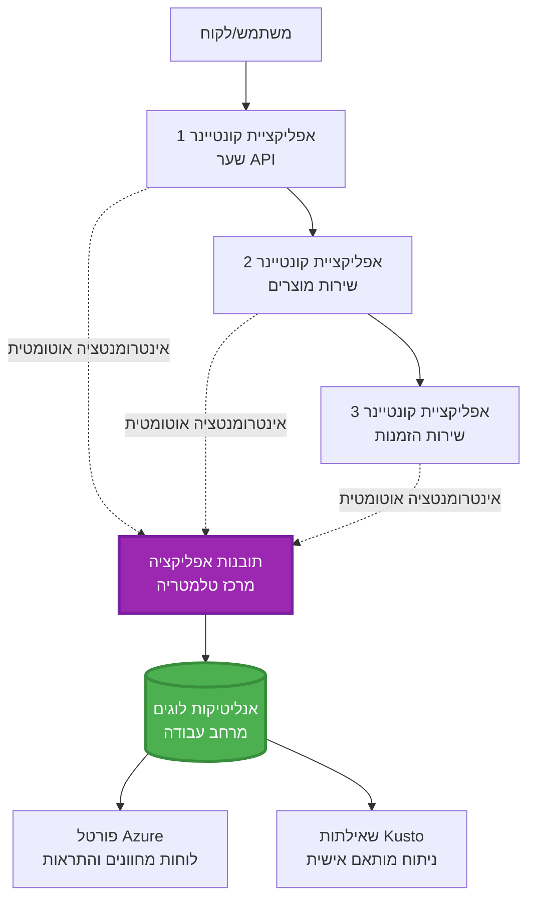
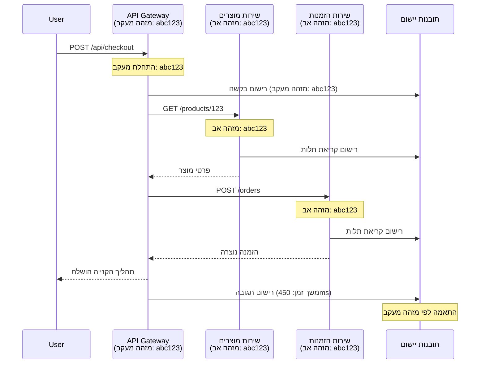

# אינטגרציה של Application Insights עם AZD

⏱️ **זמן משוער**: 40-50 דקות | 💰 **השפעת עלות**: ~$5-15 לחודש | ⭐ **רמת מורכבות**: בינונית

**📚 מסלול לימוד:**
- ← קודם: [בדיקות מקדימות](preflight-checks.md) - אימות לפני פריסה
- 🎯 **אתם כאן**: אינטגרציה של Application Insights (מעקב, טלמטריה, ניפוי שגיאות)
- → הבא: [מדריך פריסה](../deployment/deployment-guide.md) - פריסה ל-Azure
- 🏠 [דף הבית של הקורס](../../README.md)

---

## מה תלמדו

בסיום השיעור הזה, תלמדו:
- לשלב **Application Insights** בפרויקטים של AZD באופן אוטומטי
- להגדיר **מעקב מבוזר** עבור מיקרו-שירותים
- ליישם **טלמטריה מותאמת אישית** (מדדים, אירועים, תלות)
- להגדיר **מדדים חיים** למעקב בזמן אמת
- ליצור **התראות ולוחות מחוונים** מתוך פריסות AZD
- לנפות בעיות ייצור באמצעות **שאילתות טלמטריה**
- לייעל **עלויות ואסטרטגיות דגימה**
- לעקוב אחר **יישומי AI/LLM** (טוקנים, זמן תגובה, עלויות)

## למה Application Insights עם AZD חשוב

### האתגר: נראות בייצור

**ללא Application Insights:**
```
❌ No visibility into production behavior
❌ Manual log aggregation across services
❌ Reactive debugging (wait for customer complaints)
❌ No performance metrics
❌ Cannot trace requests across services
❌ Unknown failure rates and bottlenecks
```

**עם Application Insights + AZD:**
```
✅ Automatic telemetry collection
✅ Centralized logs from all services
✅ Proactive issue detection
✅ End-to-end request tracing
✅ Performance metrics and insights
✅ Real-time dashboards
✅ AZD provisions everything automatically
```

**אנלוגיה**: Application Insights הוא כמו "קופסה שחורה" של מטוס + לוח מחוונים לתא הטייס עבור האפליקציה שלכם. אתם רואים הכל בזמן אמת ויכולים לשחזר כל אירוע.

---

## סקירה ארכיטקטונית

### Application Insights בארכיטקטורת AZD


### מה מנוטר באופן אוטומטי

| סוג טלמטריה | מה הוא לוכד | שימוש |
|-------------|-------------|-------|
| **בקשות** | בקשות HTTP, קודי סטטוס, משך זמן | מעקב ביצועי API |
| **תלויות** | קריאות חיצוניות (DB, APIs, אחסון) | זיהוי צווארי בקבוק |
| **חריגות** | שגיאות לא מטופלות עם עקבות מחסנית | ניפוי שגיאות |
| **אירועים מותאמים אישית** | אירועים עסקיים (הרשמה, רכישה) | אנליטיקה ומשפכים |
| **מדדים** | מוני ביצועים, מדדים מותאמים אישית | תכנון קיבולת |
| **עקבות** | הודעות לוג עם רמות חומרה | ניפוי שגיאות וביקורת |
| **זמינות** | בדיקות זמן פעולה וזמן תגובה | מעקב SLA |

---

## דרישות מקדימות

### כלים נדרשים

```bash
# אמת את CLI של Azure Developer
azd version
# ✅ צפוי: גרסה azd 1.0.0 או גבוהה יותר

# אמת את CLI של Azure
az --version
# ✅ צפוי: azure-cli גרסה 2.50.0 או גבוהה יותר
```

### דרישות Azure

- מנוי Azure פעיל
- הרשאות ליצירה:
  - משאבי Application Insights
  - מרחבי עבודה של Log Analytics
  - אפליקציות קונטיינר
  - קבוצות משאבים

### דרישות ידע

עליכם להשלים:
- [יסודות AZD](../getting-started/azd-basics.md) - מושגי AZD בסיסיים
- [הגדרה](../getting-started/configuration.md) - הגדרת סביבה
- [פרויקט ראשון](../getting-started/first-project.md) - פריסה בסיסית

---

## שיעור 1: Application Insights אוטומטי עם AZD

### איך AZD מקצה את Application Insights

AZD יוצר ומגדיר את Application Insights באופן אוטומטי כשאתם מבצעים פריסה. בואו נראה איך זה עובד.

### מבנה הפרויקט

```
monitored-app/
├── azure.yaml                     # AZD configuration
├── infra/
│   ├── main.bicep                # Main infrastructure
│   ├── core/
│   │   └── monitoring.bicep      # Application Insights + Log Analytics
│   └── app/
│       └── api.bicep             # Container App with monitoring
└── src/
    ├── app.py                    # Application with telemetry
    ├── requirements.txt
    └── Dockerfile
```

---

### שלב 1: הגדרת AZD (azure.yaml)

**קובץ: `azure.yaml`**

```yaml
name: monitored-app
metadata:
  template: monitored-app@1.0.0

services:
  api:
    project: ./src
    language: python
    host: containerapp

# AZD automatically provisions monitoring!
```

**זה הכל!** AZD ייצור את Application Insights כברירת מחדל. אין צורך בהגדרה נוספת למעקב בסיסי.

---

### שלב 2: תשתית מעקב (Bicep)

**קובץ: `infra/core/monitoring.bicep`**

```bicep
param logAnalyticsName string
param applicationInsightsName string
param location string = resourceGroup().location
param tags object = {}

// Log Analytics Workspace (required for Application Insights)
resource logAnalytics 'Microsoft.OperationalInsights/workspaces@2022-10-01' = {
  name: logAnalyticsName
  location: location
  tags: tags
  properties: {
    sku: {
      name: 'PerGB2018'  // Pay-as-you-go pricing
    }
    retentionInDays: 30  // Keep logs for 30 days
    features: {
      enableLogAccessUsingOnlyResourcePermissions: true
    }
  }
}

// Application Insights
resource applicationInsights 'Microsoft.Insights/components@2020-02-02' = {
  name: applicationInsightsName
  location: location
  tags: tags
  kind: 'web'
  properties: {
    Application_Type: 'web'
    WorkspaceResourceId: logAnalytics.id
    IngestionMode: 'LogAnalytics'
    publicNetworkAccessForIngestion: 'Enabled'
    publicNetworkAccessForQuery: 'Enabled'
  }
}

// Outputs for Container Apps
output logAnalyticsWorkspaceId string = logAnalytics.id
output logAnalyticsWorkspaceName string = logAnalytics.name
output applicationInsightsConnectionString string = applicationInsights.properties.ConnectionString
output applicationInsightsInstrumentationKey string = applicationInsights.properties.InstrumentationKey
output applicationInsightsName string = applicationInsights.name
```

---

### שלב 3: חיבור אפליקציית קונטיינר ל-Application Insights

**קובץ: `infra/app/api.bicep`**

```bicep
param name string
param location string
param tags object = {}
param containerAppsEnvironmentName string
param applicationInsightsConnectionString string

resource containerApp 'Microsoft.App/containerApps@2023-05-01' = {
  name: name
  location: location
  tags: tags
  properties: {
    configuration: {
      ingress: {
        external: true
        targetPort: 8000
      }
      secrets: [
        {
          name: 'appinsights-connection-string'
          value: applicationInsightsConnectionString
        }
      ]
    }
    template: {
      containers: [
        {
          name: 'api'
          image: 'myregistry.azurecr.io/api:latest'
          resources: {
            cpu: json('0.5')
            memory: '1Gi'
          }
          env: [
            {
              name: 'APPLICATIONINSIGHTS_CONNECTION_STRING'
              secretRef: 'appinsights-connection-string'
            }
            {
              name: 'APPLICATIONINSIGHTS_ENABLED'
              value: 'true'
            }
          ]
        }
      ]
    }
  }
}

output uri string = 'https://${containerApp.properties.configuration.ingress.fqdn}'
```

---

### שלב 4: קוד אפליקציה עם טלמטריה

**קובץ: `src/app.py`**

```python
from flask import Flask, request, jsonify
from opencensus.ext.azure.log_exporter import AzureLogHandler
from opencensus.ext.azure.trace_exporter import AzureExporter
from opencensus.ext.flask.flask_middleware import FlaskMiddleware
from opencensus.trace.samplers import ProbabilitySampler
import logging
import os

app = Flask(__name__)

# קבל מחרוזת חיבור ל-Application Insights
connection_string = os.environ.get('APPLICATIONINSIGHTS_CONNECTION_STRING')

if connection_string:
    # הגדר מעקב מבוזר
    middleware = FlaskMiddleware(
        app,
        exporter=AzureExporter(connection_string=connection_string),
        sampler=ProbabilitySampler(rate=1.0)  # דגימה של 100% עבור פיתוח
    )
    
    # הגדר רישום
    logger = logging.getLogger(__name__)
    logger.addHandler(AzureLogHandler(connection_string=connection_string))
    logger.setLevel(logging.INFO)
    
    print("✅ Application Insights enabled")
else:
    logger = logging.getLogger(__name__)
    logger.setLevel(logging.INFO)
    print("⚠️ Application Insights not configured")

@app.route('/health')
def health():
    logger.info('Health check endpoint called')
    return jsonify({'status': 'healthy', 'monitoring': 'enabled'})

@app.route('/api/products')
def get_products():
    logger.info('Fetching products')
    
    # הדמיית קריאה למסד נתונים (נעקבת אוטומטית כתלות)
    products = [
        {'id': 1, 'name': 'Laptop', 'price': 999.99},
        {'id': 2, 'name': 'Mouse', 'price': 29.99},
        {'id': 3, 'name': 'Keyboard', 'price': 79.99}
    ]
    
    logger.info(f'Returned {len(products)} products')
    return jsonify(products)

@app.route('/api/error-test')
def error_test():
    """Test error tracking"""
    logger.error('Testing error tracking')
    try:
        raise ValueError('This is a test exception')
    except Exception as e:
        logger.exception('Exception occurred in error-test endpoint')
        return jsonify({'error': str(e)}), 500

@app.route('/api/slow')
def slow_endpoint():
    """Test performance tracking"""
    import time
    logger.info('Slow endpoint called')
    time.sleep(3)  # הדמיית פעולה איטית
    logger.warning('Endpoint took 3 seconds to respond')
    return jsonify({'message': 'Slow operation completed'})

if __name__ == '__main__':
    app.run(host='0.0.0.0', port=8000)
```

**קובץ: `src/requirements.txt`**

```txt
Flask==3.0.0
opencensus-ext-azure==1.1.13
opencensus-ext-flask==0.8.1
gunicorn==21.2.0
```

---

### שלב 5: פריסה ואימות

```bash
# אתחל את AZD
azd init

# פרוס (מגדיר את Application Insights באופן אוטומטי)
azd up

# קבל כתובת URL של האפליקציה
APP_URL=$(azd env get-values | grep API_URL | cut -d '=' -f2 | tr -d '"')

# צור טלמטריה
curl $APP_URL/health
curl $APP_URL/api/products
curl $APP_URL/api/error-test
curl $APP_URL/api/slow
```

**✅ תוצאה צפויה:**
```json
{
  "status": "healthy",
  "monitoring": "enabled"
}
```

---

### שלב 6: צפייה בטלמטריה בפורטל Azure

```bash
# קבל פרטי Application Insights
azd env get-values | grep APPLICATIONINSIGHTS

# פתח בפורטל Azure
az monitor app-insights component show \
  --app $(azd env get-values | grep APPLICATIONINSIGHTS_NAME | cut -d '=' -f2 | tr -d '"') \
  --resource-group $(azd env get-values | grep AZURE_RESOURCE_GROUP | cut -d '=' -f2 | tr -d '"') \
  --query "appId" -o tsv
```

**נווטו לפורטל Azure → Application Insights → חיפוש עסקאות**

אתם אמורים לראות:
- ✅ בקשות HTTP עם קודי סטטוס
- ✅ משך בקשה (3+ שניות עבור `/api/slow`)
- ✅ פרטי חריגות מ-`/api/error-test`
- ✅ הודעות לוג מותאמות אישית

---

## שיעור 2: טלמטריה ואירועים מותאמים אישית

### מעקב אחר אירועים עסקיים

בואו נוסיף טלמטריה מותאמת אישית לאירועים קריטיים לעסק.

**קובץ: `src/telemetry.py`**

```python
from opencensus.ext.azure import metrics_exporter
from opencensus.stats import aggregation as aggregation_module
from opencensus.stats import measure as measure_module
from opencensus.stats import stats as stats_module
from opencensus.stats import view as view_module
from opencensus.tags import tag_map as tag_map_module
from opencensus.ext.azure.log_exporter import AzureLogHandler
from opencensus.ext.azure.trace_exporter import AzureExporter
from opencensus.trace import tracer as tracer_module
import logging
import os

class TelemetryClient:
    """Custom telemetry client for Application Insights"""
    
    def __init__(self, connection_string=None):
        self.connection_string = connection_string or os.environ.get('APPLICATIONINSIGHTS_CONNECTION_STRING')
        
        if not self.connection_string:
            print("⚠️ Application Insights connection string not found")
            return
        
        # הגדרת לוגר
        self.logger = logging.getLogger(__name__)
        self.logger.addHandler(AzureLogHandler(connection_string=self.connection_string))
        self.logger.setLevel(logging.INFO)
        
        # הגדרת יצואן מדדים
        self.stats = stats_module.stats
        self.view_manager = self.stats.view_manager
        self.stats_recorder = self.stats.stats_recorder
        
        exporter = metrics_exporter.new_metrics_exporter(
            connection_string=self.connection_string
        )
        self.view_manager.register_exporter(exporter)
        
        # הגדרת עוקב
        self.tracer = tracer_module.Tracer(
            exporter=AzureExporter(connection_string=self.connection_string)
        )
        
        print("✅ Custom telemetry client initialized")
    
    def track_event(self, event_name: str, properties: dict = None):
        """Track custom business event"""
        properties = properties or {}
        self.logger.info(
            f"CustomEvent: {event_name}",
            extra={
                'custom_dimensions': {
                    'event_name': event_name,
                    **properties
                }
            }
        )
    
    def track_metric(self, metric_name: str, value: float, properties: dict = None):
        """Track custom metric"""
        properties = properties or {}
        self.logger.info(
            f"CustomMetric: {metric_name} = {value}",
            extra={
                'custom_dimensions': {
                    'metric_name': metric_name,
                    'value': value,
                    **properties
                }
            }
        )
    
    def track_dependency(self, name: str, dependency_type: str, duration: float, success: bool):
        """Track external dependency call"""
        with self.tracer.span(name=name) as span:
            span.add_attribute('dependency.type', dependency_type)
            span.add_attribute('duration', duration)
            span.add_attribute('success', success)

# לקוח טלמטריה גלובלי
telemetry = TelemetryClient()
```

### עדכון אפליקציה עם אירועים מותאמים אישית

**קובץ: `src/app.py` (משופר)**

```python
from flask import Flask, request, jsonify
from telemetry import telemetry
import time
import random

app = Flask(__name__)

@app.route('/api/purchase', methods=['POST'])
def purchase():
    """Track purchase event with custom telemetry"""
    data = request.json
    product_id = data.get('product_id')
    quantity = data.get('quantity', 1)
    price = data.get('price', 0)
    
    # עקוב אחר אירוע עסקי
    telemetry.track_event('Purchase', {
        'product_id': product_id,
        'quantity': quantity,
        'total_amount': price * quantity,
        'user_id': request.headers.get('X-User-Id', 'anonymous')
    })
    
    # עקוב אחר מדד הכנסות
    telemetry.track_metric('Revenue', price * quantity, {
        'product_id': product_id,
        'currency': 'USD'
    })
    
    return jsonify({
        'order_id': f'ORD-{random.randint(1000, 9999)}',
        'status': 'confirmed',
        'total': price * quantity
    })

@app.route('/api/search')
def search():
    """Track search queries"""
    query = request.args.get('q', '')
    
    start_time = time.time()
    
    # הדמיית חיפוש (יהיה שאילתה אמיתית למסד נתונים)
    results = [{'id': 1, 'name': f'Result for {query}'}]
    
    duration = (time.time() - start_time) * 1000  # המרה למילישניות
    
    # עקוב אחר אירוע חיפוש
    telemetry.track_event('Search', {
        'query': query,
        'results_count': len(results),
        'duration_ms': duration
    })
    
    # עקוב אחר מדד ביצועי חיפוש
    telemetry.track_metric('SearchDuration', duration, {
        'query_length': len(query)
    })
    
    return jsonify({'results': results, 'count': len(results)})

@app.route('/api/external-call')
def external_call():
    """Track external API dependency"""
    import requests
    
    start_time = time.time()
    success = True
    
    try:
        # הדמיית קריאה ל-API חיצוני
        response = requests.get('https://api.example.com/data', timeout=5)
        result = response.json()
    except Exception as e:
        success = False
        result = {'error': str(e)}
    
    duration = (time.time() - start_time) * 1000
    
    # עקוב אחר תלות
    telemetry.track_dependency(
        name='ExternalAPI',
        dependency_type='HTTP',
        duration=duration,
        success=success
    )
    
    return jsonify(result)

if __name__ == '__main__':
    app.run(host='0.0.0.0', port=8000)
```

### בדיקת טלמטריה מותאמת אישית

```bash
# עקוב אחר אירוע רכישה
curl -X POST $APP_URL/api/purchase \
  -H "Content-Type: application/json" \
  -H "X-User-Id: user123" \
  -d '{"product_id": 1, "quantity": 2, "price": 29.99}'

# עקוב אחר אירוע חיפוש
curl "$APP_URL/api/search?q=laptop"

# עקוב אחר תלות חיצונית
curl $APP_URL/api/external-call
```

**צפייה בפורטל Azure:**

נווטו ל-Application Insights → לוגים, ואז הריצו:

```kusto
// View purchase events
traces
| where customDimensions.event_name == "Purchase"
| project 
    timestamp,
    product_id = tostring(customDimensions.product_id),
    total_amount = todouble(customDimensions.total_amount),
    user_id = tostring(customDimensions.user_id)
| order by timestamp desc

// View revenue metrics
traces
| where customDimensions.metric_name == "Revenue"
| summarize TotalRevenue = sum(todouble(customDimensions.value)) by bin(timestamp, 1h)
| render timechart

// View search performance
traces
| where customDimensions.event_name == "Search"
| summarize 
    AvgDuration = avg(todouble(customDimensions.duration_ms)),
    SearchCount = count()
  by bin(timestamp, 5m)
| render timechart
```

---

## שיעור 3: מעקב מבוזר למיקרו-שירותים

### הפעלת מעקב בין שירותים

עבור מיקרו-שירותים, Application Insights מקשר באופן אוטומטי בקשות בין שירותים.

**קובץ: `infra/main.bicep`**

```bicep
targetScope = 'subscription'

param environmentName string
param location string = 'eastus'

var tags = { 'azd-env-name': environmentName }

resource rg 'Microsoft.Resources/resourceGroups@2021-04-01' = {
  name: 'rg-${environmentName}'
  location: location
  tags: tags
}

// Monitoring (shared by all services)
module monitoring './core/monitoring.bicep' = {
  name: 'monitoring'
  scope: rg
  params: {
    logAnalyticsName: 'log-${environmentName}'
    applicationInsightsName: 'appi-${environmentName}'
    location: location
    tags: tags
  }
}

// API Gateway
module apiGateway './app/api-gateway.bicep' = {
  name: 'api-gateway'
  scope: rg
  params: {
    name: 'ca-gateway-${environmentName}'
    location: location
    tags: union(tags, { 'azd-service-name': 'gateway' })
    applicationInsightsConnectionString: monitoring.outputs.applicationInsightsConnectionString
  }
}

// Product Service
module productService './app/product-service.bicep' = {
  name: 'product-service'
  scope: rg
  params: {
    name: 'ca-products-${environmentName}'
    location: location
    tags: union(tags, { 'azd-service-name': 'products' })
    applicationInsightsConnectionString: monitoring.outputs.applicationInsightsConnectionString
  }
}

// Order Service
module orderService './app/order-service.bicep' = {
  name: 'order-service'
  scope: rg
  params: {
    name: 'ca-orders-${environmentName}'
    location: location
    tags: union(tags, { 'azd-service-name': 'orders' })
    applicationInsightsConnectionString: monitoring.outputs.applicationInsightsConnectionString
  }
}

output APPLICATIONINSIGHTS_CONNECTION_STRING string = monitoring.outputs.applicationInsightsConnectionString
output GATEWAY_URL string = apiGateway.outputs.uri
```

### צפייה בעסקה מקצה לקצה


**שאילתת מעקב מקצה לקצה:**

```kusto
// Find complete request flow
let traceId = "abc123...";  // Get from response header
dependencies
| union requests
| where operation_Id == traceId
| project 
    timestamp,
    type = itemType,
    name,
    duration,
    success,
    cloud_RoleName
| order by timestamp asc
```

---

## שיעור 4: מדדים חיים ומעקב בזמן אמת

### הפעלת זרם מדדים חיים

מדדים חיים מספקים טלמטריה בזמן אמת עם פחות משנייה של השהיה.

**גישה למדדים חיים:**

```bash
# קבל משאב Application Insights
APPI_NAME=$(azd env get-values | grep APPLICATIONINSIGHTS_NAME | cut -d '=' -f2 | tr -d '"')

# קבל קבוצת משאבים
RG_NAME=$(azd env get-values | grep AZURE_RESOURCE_GROUP | cut -d '=' -f2 | tr -d '"')

echo "Navigate to: Azure Portal → Resource Groups → $RG_NAME → $APPI_NAME → Live Metrics"
```

**מה שתראו בזמן אמת:**
- ✅ קצב בקשות נכנסות (בקשות/שנייה)
- ✅ קריאות תלות יוצאות
- ✅ ספירת חריגות
- ✅ שימוש ב-CPU וזיכרון
- ✅ ספירת שרתים פעילים
- ✅ טלמטריה לדוגמה

### יצירת עומס לבדיקה

```bash
# צור עומס כדי לראות מדדים חיים
for i in {1..100}; do
  curl $APP_URL/api/products &
  curl $APP_URL/api/search?q=test$i &
done

# צפה במדדים חיים בפורטל Azure
# אתה אמור לראות עלייה בקצב הבקשות
```

---

## תרגילים מעשיים

### תרגיל 1: הגדרת התראות ⭐⭐ (בינוני)

**מטרה**: יצירת התראות עבור שיעורי שגיאות גבוהים ותגובות איטיות.

**שלבים:**

1. **יצירת התראה עבור שיעור שגיאות:**

```bash
# קבל מזהה משאב של Application Insights
APPI_ID=$(az monitor app-insights component show \
  --app $APPI_NAME \
  --resource-group $RG_NAME \
  --query "id" -o tsv)

# צור התראה מטרית עבור בקשות שנכשלו
az monitor metrics alert create \
  --name "High-Error-Rate" \
  --resource-group $RG_NAME \
  --scopes $APPI_ID \
  --condition "count requests/failed > 10" \
  --window-size 5m \
  --evaluation-frequency 1m \
  --description "Alert when error rate exceeds 10 per 5 minutes"
```

2. **יצירת התראה עבור תגובות איטיות:**

```bash
az monitor metrics alert create \
  --name "Slow-Responses" \
  --resource-group $RG_NAME \
  --scopes $APPI_ID \
  --condition "avg requests/duration > 3000" \
  --window-size 5m \
  --evaluation-frequency 1m \
  --description "Alert when average response time exceeds 3 seconds"
```

3. **יצירת התראה באמצעות Bicep (מועדף עבור AZD):**

**קובץ: `infra/core/alerts.bicep`**

```bicep
param applicationInsightsId string
param actionGroupId string = ''
param location string = resourceGroup().location

// High error rate alert
resource errorRateAlert 'Microsoft.Insights/metricAlerts@2018-03-01' = {
  name: 'high-error-rate'
  location: 'global'
  properties: {
    description: 'Alert when error rate exceeds threshold'
    severity: 2
    enabled: true
    scopes: [
      applicationInsightsId
    ]
    evaluationFrequency: 'PT1M'
    windowSize: 'PT5M'
    criteria: {
      'odata.type': 'Microsoft.Azure.Monitor.SingleResourceMultipleMetricCriteria'
      allOf: [
        {
          name: 'Error rate'
          metricName: 'requests/failed'
          operator: 'GreaterThan'
          threshold: 10
          timeAggregation: 'Count'
        }
      ]
    }
    actions: actionGroupId != '' ? [
      {
        actionGroupId: actionGroupId
      }
    ] : []
  }
}

// Slow response alert
resource slowResponseAlert 'Microsoft.Insights/metricAlerts@2018-03-01' = {
  name: 'slow-responses'
  location: 'global'
  properties: {
    description: 'Alert when response time is too high'
    severity: 3
    enabled: true
    scopes: [
      applicationInsightsId
    ]
    evaluationFrequency: 'PT1M'
    windowSize: 'PT5M'
    criteria: {
      'odata.type': 'Microsoft.Azure.Monitor.SingleResourceMultipleMetricCriteria'
      allOf: [
        {
          name: 'Response duration'
          metricName: 'requests/duration'
          operator: 'GreaterThan'
          threshold: 3000
          timeAggregation: 'Average'
        }
      ]
    }
  }
}

output errorAlertId string = errorRateAlert.id
output slowResponseAlertId string = slowResponseAlert.id
```

4. **בדיקת התראות:**

```bash
# יצירת שגיאות
for i in {1..20}; do
  curl $APP_URL/api/error-test
done

# יצירת תגובות איטיות
for i in {1..10}; do
  curl $APP_URL/api/slow
done

# בדיקת מצב התראה (המתן 5-10 דקות)
az monitor metrics alert list \
  --resource-group $RG_NAME \
  --query "[].{Name:name, Enabled:enabled, State:properties.enabled}" \
  --output table
```

**✅ קריטריונים להצלחה:**
- ✅ התראות נוצרו בהצלחה
- ✅ התראות מופעלות כאשר ספים חורגים
- ✅ ניתן לצפות בהיסטוריית התראות בפורטל Azure
- ✅ משולב עם פריסת AZD

**זמן**: 20-25 דקות

---

### תרגיל 2: יצירת לוח מחוונים מותאם אישית ⭐⭐ (בינוני)

**מטרה**: בניית לוח מחוונים המציג מדדי אפליקציה מרכזיים.

**שלבים:**

1. **יצירת לוח מחוונים דרך פורטל Azure:**

נווטו ל: פורטל Azure → Dashboards → לוח מחוונים חדש

2. **הוספת אריחים למדדים מרכזיים:**

- ספירת בקשות (24 שעות אחרונות)
- זמן תגובה ממוצע
- שיעור שגיאות
- 5 הפעולות האיטיות ביותר
- פיזור גיאוגרפי של משתמשים

3. **יצירת לוח מחוונים באמצעות Bicep:**

**קובץ: `infra/core/dashboard.bicep`**

```bicep
param dashboardName string
param applicationInsightsId string
param location string = resourceGroup().location

resource dashboard 'Microsoft.Portal/dashboards@2020-09-01-preview' = {
  name: dashboardName
  location: location
  properties: {
    lenses: [
      {
        order: 0
        parts: [
          // Request count
          {
            position: { x: 0, y: 0, rowSpan: 4, colSpan: 6 }
            metadata: {
              type: 'Extension/Microsoft_OperationsManagementSuite_Workspace/PartType/LogsDashboardPart'
              inputs: [
                {
                  name: 'resourceId'
                  value: applicationInsightsId
                }
                {
                  name: 'query'
                  value: '''
                    requests
                    | summarize RequestCount = count() by bin(timestamp, 1h)
                    | render timechart
                  '''
                }
              ]
            }
          }
          // Error rate
          {
            position: { x: 6, y: 0, rowSpan: 4, colSpan: 6 }
            metadata: {
              type: 'Extension/Microsoft_OperationsManagementSuite_Workspace/PartType/LogsDashboardPart'
              inputs: [
                {
                  name: 'resourceId'
                  value: applicationInsightsId
                }
                {
                  name: 'query'
                  value: '''
                    requests
                    | summarize 
                        Total = count(),
                        Failed = countif(success == false)
                    | extend ErrorRate = (Failed * 100.0) / Total
                    | project ErrorRate
                  '''
                }
              ]
            }
          }
        ]
      }
    ]
  }
}

output dashboardId string = dashboard.id
```

4. **פריסת לוח מחוונים:**

```bash
# הוסף ל-main.bicep
module dashboard './core/dashboard.bicep' = {
  name: 'dashboard'
  scope: rg
  params: {
    dashboardName: 'dashboard-${environmentName}'
    applicationInsightsId: monitoring.outputs.applicationInsightsId
    location: location
  }
}

# פרוס
azd up
```

**✅ קריטריונים להצלחה:**
- ✅ לוח המחוונים מציג מדדים מרכזיים
- ✅ ניתן להצמיד לדף הבית של פורטל Azure
- ✅ מתעדכן בזמן אמת
- ✅ ניתן לפריסה באמצעות AZD

**זמן**: 25-30 דקות

---

### תרגיל 3: מעקב אחר יישום AI/LLM ⭐⭐⭐ (מתקדם)

**מטרה**: מעקב אחר שימוש ב-Azure OpenAI (טוקנים, עלויות, זמן תגובה).

**שלבים:**

1. **יצירת מעטפת מעקב AI:**

**קובץ: `src/ai_telemetry.py`**

```python
from telemetry import telemetry
from openai import AzureOpenAI
import time

class MonitoredAzureOpenAI:
    """Azure OpenAI client with automatic telemetry"""
    
    def __init__(self, api_key, endpoint, api_version="2024-02-01"):
        self.client = AzureOpenAI(
            api_key=api_key,
            api_version=api_version,
            azure_endpoint=endpoint
        )
    
    def chat_completion(self, model: str, messages: list, **kwargs):
        """Track chat completion with telemetry"""
        start_time = time.time()
        
        try:
            # התקשר ל-Azure OpenAI
            response = self.client.chat.completions.create(
                model=model,
                messages=messages,
                **kwargs
            )
            
            duration = (time.time() - start_time) * 1000  # מ"ש
            
            # חילוץ שימוש
            usage = response.usage
            prompt_tokens = usage.prompt_tokens
            completion_tokens = usage.completion_tokens
            total_tokens = usage.total_tokens
            
            # חישוב עלות (תמחור GPT-4)
            prompt_cost = (prompt_tokens / 1000) * 0.03  # $0.03 לכל 1K טוקנים
            completion_cost = (completion_tokens / 1000) * 0.06  # $0.06 לכל 1K טוקנים
            total_cost = prompt_cost + completion_cost
            
            # מעקב אחר אירוע מותאם אישית
            telemetry.track_event('OpenAI_Request', {
                'model': model,
                'prompt_tokens': prompt_tokens,
                'completion_tokens': completion_tokens,
                'total_tokens': total_tokens,
                'duration_ms': duration,
                'cost_usd': total_cost,
                'success': True
            })
            
            # מעקב אחר מדדים
            telemetry.track_metric('OpenAI_Tokens', total_tokens, {
                'model': model,
                'type': 'total'
            })
            
            telemetry.track_metric('OpenAI_Cost', total_cost, {
                'model': model,
                'currency': 'USD'
            })
            
            telemetry.track_metric('OpenAI_Duration', duration, {
                'model': model
            })
            
            return response
            
        except Exception as e:
            duration = (time.time() - start_time) * 1000
            
            telemetry.track_event('OpenAI_Request', {
                'model': model,
                'duration_ms': duration,
                'success': False,
                'error': str(e)
            })
            
            raise
```

2. **שימוש בלקוח מנוטר:**

```python
from flask import Flask, request, jsonify
from ai_telemetry import MonitoredAzureOpenAI
import os

app = Flask(__name__)

# אתחל לקוח OpenAI מנוטר
openai_client = MonitoredAzureOpenAI(
    api_key=os.environ['AZURE_OPENAI_API_KEY'],
    endpoint=os.environ['AZURE_OPENAI_ENDPOINT']
)

@app.route('/api/chat', methods=['POST'])
def chat():
    data = request.json
    user_message = data.get('message')
    
    # קריאה עם ניטור אוטומטי
    response = openai_client.chat_completion(
        model='gpt-4',
        messages=[
            {'role': 'user', 'content': user_message}
        ]
    )
    
    return jsonify({
        'response': response.choices[0].message.content,
        'tokens': response.usage.total_tokens
    })
```

3. **שאילתת מדדי AI:**

```kusto
// Total AI spend over time
traces
| where customDimensions.event_name == "OpenAI_Request"
| where customDimensions.success == "True"
| summarize TotalCost = sum(todouble(customDimensions.cost_usd)) by bin(timestamp, 1h)
| render timechart

// Token usage by model
traces
| where customDimensions.event_name == "OpenAI_Request"
| summarize 
    TotalTokens = sum(toint(customDimensions.total_tokens)),
    RequestCount = count()
  by Model = tostring(customDimensions.model)

// Average latency
traces
| where customDimensions.event_name == "OpenAI_Request"
| summarize AvgDuration = avg(todouble(customDimensions.duration_ms))
| project AvgDurationSeconds = AvgDuration / 1000

// Cost per request
traces
| where customDimensions.event_name == "OpenAI_Request"
| extend Cost = todouble(customDimensions.cost_usd)
| summarize 
    TotalCost = sum(Cost),
    RequestCount = count(),
    AvgCostPerRequest = avg(Cost)
```

**✅ קריטריונים להצלחה:**
- ✅ כל קריאת OpenAI מנוטרת אוטומטית
- ✅ שימוש בטוקנים ועלויות גלויים
- ✅ זמן תגובה מנוטר
- ✅ ניתן להגדיר התראות תקציב

**זמן**: 35-45 דקות

---

## אופטימיזציה של עלויות

### אסטרטגיות דגימה

שליטה בעלויות באמצעות דגימת טלמטריה:

```python
from opencensus.trace.samplers import ProbabilitySampler

# פיתוח: דגימה של 100%
sampler = ProbabilitySampler(rate=1.0)

# ייצור: דגימה של 10% (להפחית עלויות ב-90%)
sampler = ProbabilitySampler(rate=0.1)

# דגימה אדפטיבית (מתאימה את עצמה באופן אוטומטי)
from opencensus.trace.samplers import AdaptiveSampler
sampler = AdaptiveSampler()
```

**ב-Bicep:**

```bicep
resource applicationInsights 'Microsoft.Insights/components@2020-02-02' = {
  name: applicationInsightsName
  properties: {
    SamplingPercentage: 10  // 10% sampling
  }
}
```

### שמירת נתונים

```bicep
resource logAnalytics 'Microsoft.OperationalInsights/workspaces@2022-10-01' = {
  name: logAnalyticsName
  properties: {
    retentionInDays: 30  // Minimum (cheapest)
    // Options: 30, 31, 60, 90, 120, 180, 270, 365, 550, 730
  }
}
```

### הערכות עלות חודשיות

| נפח נתונים | שמירה | עלות חודשית |
|------------|-------|-------------|
| 1 GB/חודש | 30 ימים | ~$2-5 |
| 5 GB/חודש | 30 ימים | ~$10-15 |
| 10 GB/חודש | 90 ימים | ~$25-40 |
| 50 GB/חודש | 90 ימים | ~$100-150 |

**תוכנית חינמית**: 5 GB/חודש כלולים

---

## נקודת בדיקת ידע

### 1. אינטגרציה בסיסית ✓

בדקו את הבנתכם:

- [ ] **שאלה 1**: איך AZD מקצה את Application Insights?
  - **תשובה**: באופן אוטומטי באמצעות תבניות Bicep ב-`infra/core/monitoring.bicep`

- [ ] **שאלה 2**: איזה משתנה סביבה מפעיל את Application Insights?
  - **תשובה**: `APPLICATIONINSIGHTS_CONNECTION_STRING`

- [ ] **שאלה 3**: מהם שלושת סוגי הטלמטריה העיקריים?
  - **תשובה**: בקשות (קריאות HTTP), תלויות (קריאות חיצוניות), חריגות (שגיאות)

**אימות מעשי:**
```bash
# בדוק אם Application Insights מוגדר
azd env get-values | grep APPLICATIONINSIGHTS

# אמת שהטלמטריה זורמת
az monitor app-insights metrics show \
  --app $APPI_NAME \
  --resource-group $RG_NAME \
  --metric "requests/count"
```

---

### 2. טלמטריה מותאמת אישית ✓

בדקו את הבנתכם:

- [ ] **שאלה 1**: איך עוקבים אחר אירועים עסקיים מותאמים אישית?
  - **תשובה**: שימוש בלוגר עם `custom_dimensions` או `TelemetryClient.track_event()`

- [ ] **שאלה 2**: מה ההבדל בין אירועים למדדים?
  - **תשובה**: אירועים הם התרחשויות נפרדות, מדדים הם מדידות מספריות

- [ ] **שאלה 3**: איך מקשרים טלמטריה בין שירותים?
  - **תשובה**: Application Insights משתמש באופן אוטומטי ב-`operation_Id` לקישור

**אימות מעשי:**
```kusto
// Verify custom events
traces
| where customDimensions.event_name != ""
| summarize count() by tostring(customDimensions.event_name)
```

---

### 3. מעקב ייצור ✓

בדקו את הבנתכם:

- [ ] **שאלה 1**: מהי דגימה ולמה להשתמש בה?
  - **תשובה**: דגימה מפחיתה את נפח הנתונים (ואת העלות) על ידי לכידת אחוז מסוים מהטלמטריה

- [ ] **שאלה 2**: איך מגדירים התראות?
  - **תשובה**: שימוש בהתראות מדדים ב-Bicep או פורטל Azure בהתבסס על מדדי Application Insights

- [ ] **שאלה 3**: מה ההבדל בין Log Analytics ל-Application Insights?
  - **תשובה**: Application Insights שומר נתונים במרחב עבודה של Log Analytics; App Insights מספק תצוגות ספציפיות לאפליקציה

**אימות מעשי:**
```bash
# בדוק את תצורת הדגימה
az monitor app-insights component show \
  --app $APPI_NAME \
  --resource-group $RG_NAME \
  --query "properties.SamplingPercentage"
```

---

## שיטות עבודה מומלצות

### ✅ כן:

1. **השתמשו ב-IDs לקישור**
   ```python
   logger.info('Processing order', extra={
       'custom_dimensions': {
           'order_id': order_id,
           'user_id': user_id
       }
   })
   ```

2. **הגדירו התראות למדדים קריטיים**
   ```bicep
   // Error rate, slow responses, availability
   ```

3. **השתמשו בלוגים מובנים**
   ```python
   # ✅ טוב: מובנה
   logger.info('User signup', extra={'custom_dimensions': {'user_id': 123}})
   
   # ❌ רע: לא מובנה
   logger.info(f'User 123 signed up')
   ```

4. **עקבו אחר תלויות**
   ```python
   # לעקוב באופן אוטומטי אחר קריאות למסד נתונים, בקשות HTTP, וכו'.
   ```

5. **השתמשו במדדים חיים במהלך פריסות**

### ❌ לא:

1. **אל תתעדו נתונים רגישים**
   ```python
   # ❌ רע
   logger.info(f'Login: {username}:{password}')
   
   # ✅ טוב
   logger.info('Login attempt', extra={'custom_dimensions': {'username': username}})
   ```

2. **אל תשתמשו בדגימה של 100% בייצור**
   ```python
   # ❌ יקר
   sampler = ProbabilitySampler(rate=1.0)
   
   # ✅ חסכוני
   sampler = ProbabilitySampler(rate=0.1)
   ```

3. **אל תתעלמו מתורי הודעות כושלים**

4. **אל תשכחו להגדיר מגבלות שמירת נתונים**

---

## פתרון בעיות

### בעיה: אין טלמטריה מופיעה

**אבחון:**
```bash
# בדוק שהגדרת מחרוזת החיבור
azd env get-values | grep APPLICATIONINSIGHTS

# בדוק את יומני היישום
azd logs api --tail 50
```

**פתרון:**
```bash
# אמת את מחרוזת החיבור באפליקציית המכולה
az containerapp show \
  --name $APP_NAME \
  --resource-group $RG_NAME \
  --query "properties.template.containers[0].env" \
  | grep -i applicationinsights
```

---

### בעיה: עלויות גבוהות

**אבחון:**
```bash
# בדוק את קליטת הנתונים
az monitor app-insights metrics show \
  --app $APPI_NAME \
  --resource-group $RG_NAME \
  --metric "availabilityResults/count"
```

**פתרון:**
- הפחתת שיעור דגימה
- קיצור תקופת שמירה
- הסרת לוגים מפורטים

---

## למידע נוסף

### תיעוד רשמי
- [סקירה של Application Insights](https://learn.microsoft.com/azure/azure-monitor/app/app-insights-overview)
- [Application Insights עבור Python](https://learn.microsoft.com/azure/azure-monitor/app/opencensus-python)
- [שפת שאילתות Kusto](https://learn.microsoft.com/azure/data-explorer/kusto/query/)
- [מעקב AZD](https://learn.microsoft.com/azure/developer/azure-developer-cli/monitor-your-app)

### השלבים הבאים בקורס זה
- ← קודם: [בדיקות מקדימות](preflight-checks.md)
- → הבא: [מדריך פריסה](../deployment/deployment-guide.md)
- 🏠 [דף הבית של הקורס](../../README.md)

### דוגמאות קשורות
- [דוגמת Azure OpenAI](../../../../examples/azure-openai-chat) - טלמטריה AI
- [דוגמת מיקרו-שירותים](../../../../examples/microservices) - מעקב מבוזר

---

## סיכום

**למדתם:**
- ✅ הקצאת Application Insights אוטומטית עם AZD
- ✅ טלמטריה מותאמת אישית (אירועים, מדדים, תלויות)
- ✅ מעקב מבוזר בין מיקרו-שירותים
- ✅ מדדים חיים ומעקב בזמן אמת
- ✅ התראות ולוחות מחוונים
- ✅ ניטור יישומי AI/LLM  
- ✅ אסטרטגיות אופטימיזציה של עלויות  

**נקודות מרכזיות:**  
1. **AZD מגדיר ניטור באופן אוטומטי** - אין צורך בהגדרה ידנית  
2. **השתמשו בלוגים מובנים** - מקל על ביצוע שאילתות  
3. **עקבו אחר אירועים עסקיים** - לא רק מדדים טכניים  
4. **נטרו עלויות AI** - עקבו אחר טוקנים והוצאות  
5. **הגדירו התראות** - היו פרואקטיביים ולא ריאקטיביים  
6. **בצעו אופטימיזציה של עלויות** - השתמשו בדגימה והגבלות שמירה  

**השלבים הבאים:**  
1. השלימו את התרגילים המעשיים  
2. הוסיפו Application Insights לפרויקטים שלכם ב-AZD  
3. צרו לוחות מחוונים מותאמים אישית לצוות שלכם  
4. למדו [מדריך הפריסה](../deployment/deployment-guide.md)  

---

<!-- CO-OP TRANSLATOR DISCLAIMER START -->
**כתב ויתור**:  
מסמך זה תורגם באמצעות שירות תרגום AI [Co-op Translator](https://github.com/Azure/co-op-translator). למרות שאנו שואפים לדיוק, יש לקחת בחשבון שתרגומים אוטומטיים עשויים להכיל שגיאות או אי דיוקים. המסמך המקורי בשפתו המקורית צריך להיחשב כמקור סמכותי. למידע קריטי, מומלץ להשתמש בתרגום מקצועי אנושי. איננו אחראים לאי הבנות או לפרשנויות שגויות הנובעות משימוש בתרגום זה.
<!-- CO-OP TRANSLATOR DISCLAIMER END -->