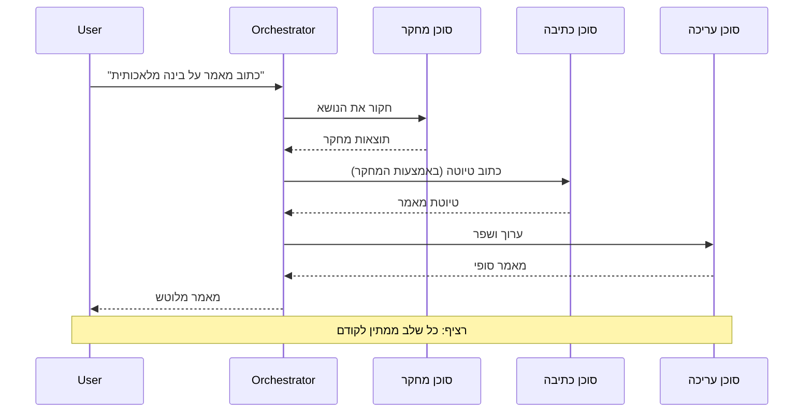
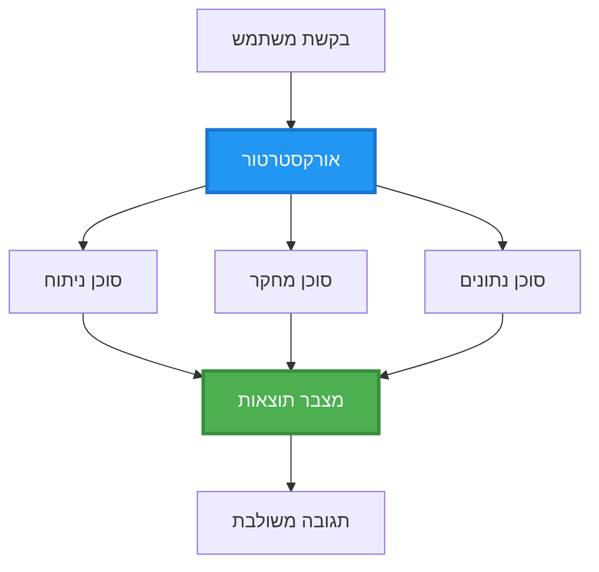
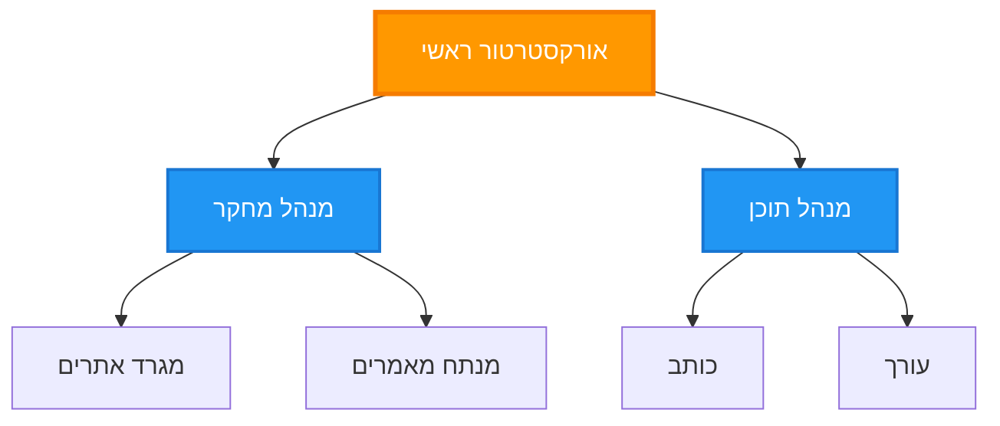
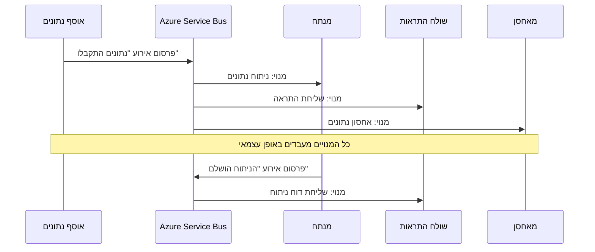
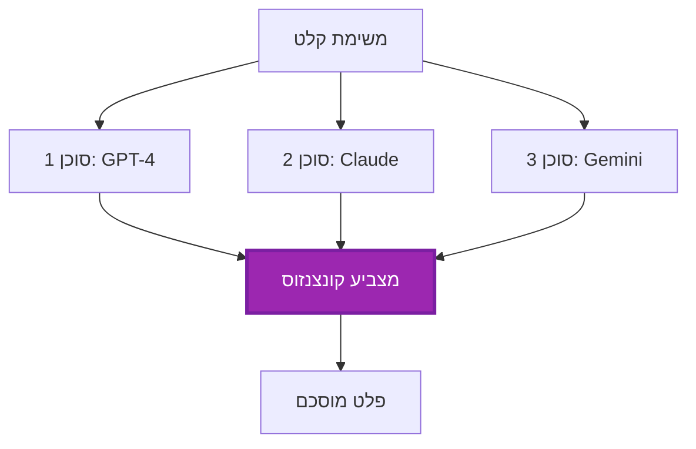
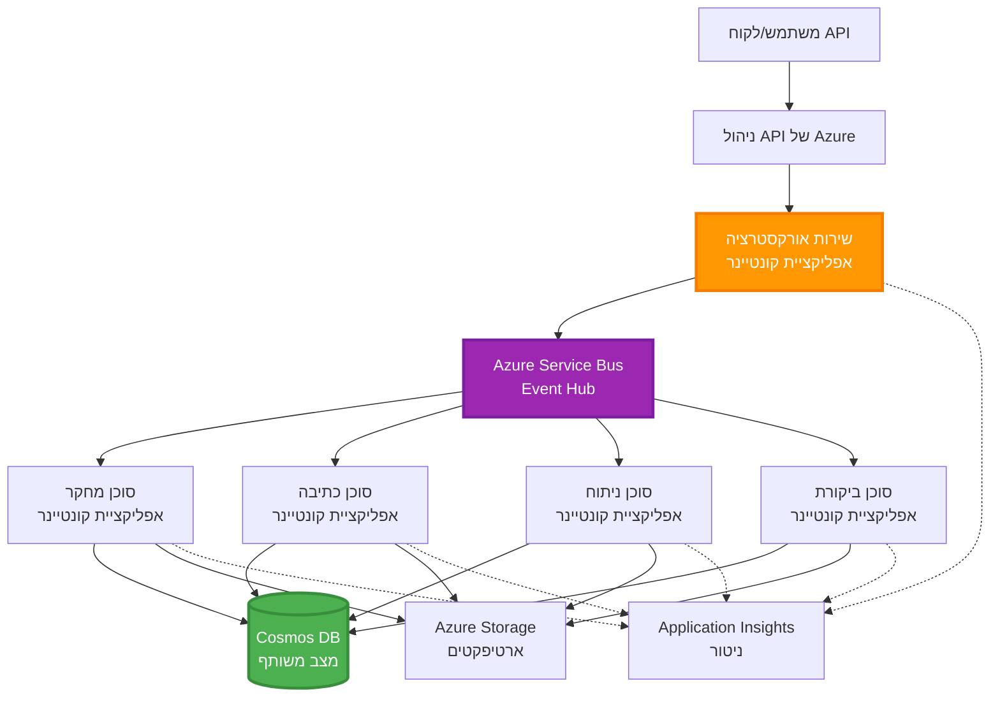

<!--
CO_OP_TRANSLATOR_METADATA:
{
  "original_hash": "bcefbd5d0107691ef3e6e33ba694d6f4",
  "translation_date": "2025-11-21T18:58:11+00:00",
  "source_file": "docs/pre-deployment/coordination-patterns.md",
  "language_code": "he"
}
-->
# דפוסי תיאום בין סוכנים

⏱️ **זמן משוער**: 60-75 דקות | 💰 **עלות משוערת**: ~$100-300 לחודש | ⭐ **מורכבות**: מתקדם

**📚 מסלול למידה:**
- ← קודם: [תכנון קיבולת](capacity-planning.md) - אסטרטגיות להערכת משאבים והרחבה
- 🎯 **אתם כאן**: דפוסי תיאום בין סוכנים (תזמור, תקשורת, ניהול מצב)
- → הבא: [בחירת SKU](sku-selection.md) - בחירת שירותי Azure המתאימים
- 🏠 [דף הבית של הקורס](../../README.md)

---

## מה תלמדו

בסיום השיעור הזה, תלמדו:
- להבין דפוסי **ארכיטקטורת סוכנים מרובים** ומתי להשתמש בהם
- ליישם **דפוסי תזמור** (מרוכז, מבוזר, היררכי)
- לעצב אסטרטגיות **תקשורת בין סוכנים** (סינכרוני, אסינכרוני, מבוסס אירועים)
- לנהל **מצב משותף** בין סוכנים מבוזרים
- לפרוס **מערכות סוכנים מרובות** ב-Azure עם AZD
- ליישם **דפוסי תיאום** לתרחישי AI בעולם האמיתי
- לנטר ולבצע דיבוג למערכות סוכנים מבוזרות

## למה תיאום בין סוכנים חשוב

### האבולוציה: מסוכן יחיד למערכת סוכנים מרובים

**סוכן יחיד (פשוט):**
```
User → Agent → Response
```
- ✅ קל להבנה וליישום
- ✅ מהיר למשימות פשוטות
- ❌ מוגבל ליכולות של מודל יחיד
- ❌ לא יכול לבצע משימות מורכבות במקביל
- ❌ אין התמחות

**מערכת סוכנים מרובים (מתקדמת):**
```
           ┌─────────────┐
           │ Orchestrator│
           └──────┬──────┘
        ┌─────────┼─────────┐
        │         │         │
    ┌───▼──┐  ┌──▼───┐  ┌──▼────┐
    │Agent1│  │Agent2│  │Agent3 │
    │(Plan)│  │(Code)│  │(Review)│
    └──────┘  └──────┘  └───────┘
```
- ✅ סוכנים מתמחים למשימות ספציפיות
- ✅ ביצוע מקבילי למהירות
- ✅ מודולרי וקל לתחזוקה
- ✅ טוב יותר בזרימות עבודה מורכבות
- ⚠️ דורש לוגיקת תיאום

**אנלוגיה**: סוכן יחיד הוא כמו אדם אחד שעושה את כל המשימות. מערכת סוכנים מרובים היא כמו צוות שבו לכל חבר יש מיומנויות מיוחדות (חוקר, מתכנת, עורך, כותב) שעובדים יחד.

---

## דפוסי תיאום מרכזיים

### דפוס 1: תיאום סדרתי (שרשרת אחריות)

**מתי להשתמש**: משימות חייבות להתבצע בסדר מסוים, כל סוכן בונה על הפלט של הקודם.


**יתרונות:**
- ✅ זרימת נתונים ברורה
- ✅ קל לדיבוג
- ✅ סדר ביצוע צפוי

**מגבלות:**
- ❌ איטי יותר (אין מקביליות)
- ❌ כשל אחד חוסם את כל השרשרת
- ❌ לא מתאים למשימות תלויות זו בזו

**דוגמאות לשימוש:**
- תהליך יצירת תוכן (מחקר → כתיבה → עריכה → פרסום)
- יצירת קוד (תכנון → יישום → בדיקה → פריסה)
- יצירת דוחות (איסוף נתונים → ניתוח → ויזואליזציה → סיכום)

---

### דפוס 2: תיאום מקבילי (Fan-Out/Fan-In)

**מתי להשתמש**: משימות עצמאיות יכולות להתבצע במקביל, והתוצאות משולבות בסוף.


**יתרונות:**
- ✅ מהיר (ביצוע מקבילי)
- ✅ עמיד בפני תקלות (תוצאות חלקיות מתקבלות)
- ✅ ניתן להרחבה אופקית

**מגבלות:**
- ⚠️ תוצאות עשויות להגיע בסדר לא צפוי
- ⚠️ נדרשת לוגיקת צבירה
- ⚠️ ניהול מצב מורכב

**דוגמאות לשימוש:**
- איסוף נתונים ממקורות מרובים (APIs + מסדי נתונים + סריקת רשת)
- ניתוח תחרותי (מודלים מרובים מייצרים פתרונות, הטוב ביותר נבחר)
- שירותי תרגום (תרגום למספר שפות במקביל)

---

### דפוס 3: תיאום היררכי (מנהל-עובד)

**מתי להשתמש**: זרימות עבודה מורכבות עם תתי-משימות, נדרשת האצלה.


**יתרונות:**
- ✅ מתאים לזרימות עבודה מורכבות
- ✅ מודולרי וקל לתחזוקה
- ✅ גבולות אחריות ברורים

**מגבלות:**
- ⚠️ ארכיטקטורה מורכבת יותר
- ⚠️ זמן תגובה גבוה יותר (שכבות תיאום מרובות)
- ⚠️ דורש תזמור מתוחכם

**דוגמאות לשימוש:**
- עיבוד מסמכים ארגוני (סיווג → ניתוב → עיבוד → ארכיון)
- צינורות נתונים מרובי שלבים (קליטה → ניקוי → המרה → ניתוח → דוח)
- זרימות עבודה אוטומטיות מורכבות (תכנון → הקצאת משאבים → ביצוע → ניטור)

---

### דפוס 4: תיאום מבוסס אירועים (Publish-Subscribe)

**מתי להשתמש**: סוכנים צריכים להגיב לאירועים, נדרש חיבור רופף.


**יתרונות:**
- ✅ חיבור רופף בין סוכנים
- ✅ קל להוסיף סוכנים חדשים (פשוט להירשם)
- ✅ עיבוד אסינכרוני
- ✅ עמיד (התמדה של הודעות)

**מגבלות:**
- ⚠️ עקביות בסופו של דבר
- ⚠️ דיבוג מורכב
- ⚠️ אתגרי סדר הודעות

**דוגמאות לשימוש:**
- מערכות ניטור בזמן אמת (התראות, לוחות מחוונים, יומנים)
- התראות רב-ערוציות (אימייל, SMS, Push, Slack)
- צינורות עיבוד נתונים (צרכנים מרובים של אותם נתונים)

---

### דפוס 5: תיאום מבוסס קונצנזוס (Voting/Quorum)

**מתי להשתמש**: נדרשת הסכמה מסוכנים מרובים לפני המשך.


**יתרונות:**
- ✅ דיוק גבוה יותר (דעות מרובות)
- ✅ עמיד בפני תקלות (כשלי מיעוט מתקבלים)
- ✅ בקרת איכות מובנית

**מגבלות:**
- ❌ יקר (קריאות מודל מרובות)
- ❌ איטי יותר (המתנה לכל הסוכנים)
- ⚠️ נדרש פתרון קונפליקטים

**דוגמאות לשימוש:**
- ניהול תוכן (מודלים מרובים בודקים תוכן)
- בדיקת קוד (בודקים/מנתחים מרובים)
- אבחון רפואי (מודלי AI מרובים, אימות מומחים)

---

## סקירה ארכיטקטונית

### מערכת סוכנים מרובים מלאה ב-Azure


**רכיבים מרכזיים:**

| רכיב | מטרה | שירות Azure |
|------|-------|-------------|
| **API Gateway** | נקודת כניסה, הגבלת קצב, אימות | API Management |
| **Orchestrator** | מתזמר זרימות עבודה של סוכנים | Container Apps |
| **Message Queue** | תקשורת אסינכרונית | Service Bus / Event Hubs |
| **Agents** | סוכני AI מתמחים | Container Apps / Functions |
| **State Store** | מצב משותף, מעקב משימות | Cosmos DB |
| **Artifact Storage** | מסמכים, תוצאות, יומנים | Blob Storage |
| **Monitoring** | מעקב מבוזר, יומנים | Application Insights |

---

## דרישות מוקדמות

### כלים נדרשים

```bash
# אמת את CLI של Azure Developer
azd version
# ✅ צפוי: גרסה azd 1.0.0 או גבוהה יותר

# אמת את CLI של Azure
az --version
# ✅ צפוי: azure-cli גרסה 2.50.0 או גבוהה יותר

# אמת את Docker (לבדיקות מקומיות)
docker --version
# ✅ צפוי: גרסת Docker 20.10 או גבוהה יותר
```

### דרישות Azure

- מנוי Azure פעיל
- הרשאות ליצירת:
  - Container Apps
  - Service Bus namespaces
  - Cosmos DB accounts
  - Storage accounts
  - Application Insights

### ידע מוקדם נדרש

עליכם להשלים:
- [ניהול תצורה](../getting-started/configuration.md)
- [אימות ואבטחה](../getting-started/authsecurity.md)
- [דוגמת מיקרו-שירותים](../../../../examples/microservices)

---

## מדריך יישום

### מבנה הפרויקט

```
multi-agent-system/
├── azure.yaml                    # AZD configuration
├── infra/
│   ├── main.bicep               # Main infrastructure
│   ├── core/
│   │   ├── servicebus.bicep     # Message queue
│   │   ├── cosmos.bicep         # State store
│   │   ├── storage.bicep        # Artifact storage
│   │   └── monitoring.bicep     # Application Insights
│   └── app/
│       ├── orchestrator.bicep   # Orchestrator service
│       └── agent.bicep          # Agent template
└── src/
    ├── orchestrator/            # Orchestration logic
    │   ├── app.py
    │   ├── workflows.py
    │   └── Dockerfile
    ├── agents/
    │   ├── research/            # Research agent
    │   ├── writer/              # Writer agent
    │   ├── analyst/             # Analyst agent
    │   └── reviewer/            # Reviewer agent
    └── shared/
        ├── state_manager.py     # Shared state logic
        └── message_handler.py   # Message handling
```

---

## שיעור 1: דפוס תיאום סדרתי

### יישום: צינור יצירת תוכן

נבנה צינור סדרתי: מחקר → כתיבה → עריכה → פרסום

### 1. תצורת AZD

**קובץ: `azure.yaml`**

```yaml
name: content-pipeline
metadata:
  template: multi-agent-sequential@1.0.0

services:
  orchestrator:
    project: ./src/orchestrator
    language: python
    host: containerapp
  
  research-agent:
    project: ./src/agents/research
    language: python
    host: containerapp
  
  writer-agent:
    project: ./src/agents/writer
    language: python
    host: containerapp
  
  editor-agent:
    project: ./src/agents/editor
    language: python
    host: containerapp
```

### 2. תשתית: Service Bus לתיאום

**קובץ: `infra/core/servicebus.bicep`**

```bicep
param name string
param location string
param tags object = {}

resource serviceBusNamespace 'Microsoft.ServiceBus/namespaces@2022-10-01-preview' = {
  name: name
  location: location
  tags: tags
  sku: {
    name: 'Standard'
    tier: 'Standard'
  }
  properties: {
    minimumTlsVersion: '1.2'
  }
}

// Queue for orchestrator → research agent
resource researchQueue 'Microsoft.ServiceBus/namespaces/queues@2022-10-01-preview' = {
  parent: serviceBusNamespace
  name: 'research-tasks'
  properties: {
    maxDeliveryCount: 3
    lockDuration: 'PT5M'
    deadLetteringOnMessageExpiration: true
  }
}

// Queue for research agent → writer agent
resource writerQueue 'Microsoft.ServiceBus/namespaces/queues@2022-10-01-preview' = {
  parent: serviceBusNamespace
  name: 'writer-tasks'
  properties: {
    maxDeliveryCount: 3
    lockDuration: 'PT5M'
  }
}

// Queue for writer agent → editor agent
resource editorQueue 'Microsoft.ServiceBus/namespaces/queues@2022-10-01-preview' = {
  parent: serviceBusNamespace
  name: 'editor-tasks'
  properties: {
    maxDeliveryCount: 3
    lockDuration: 'PT5M'
  }
}

output namespace string = serviceBusNamespace.name
output connectionString string = listKeys('${serviceBusNamespace.id}/AuthorizationRules/RootManageSharedAccessKey', serviceBusNamespace.apiVersion).primaryConnectionString
```

### 3. מנהל מצב משותף

**קובץ: `src/shared/state_manager.py`**

```python
from azure.cosmos import CosmosClient, PartitionKey
from datetime import datetime
import os

class StateManager:
    """Manages shared state across agents using Cosmos DB"""
    
    def __init__(self):
        endpoint = os.environ['COSMOS_ENDPOINT']
        key = os.environ['COSMOS_KEY']
        
        self.client = CosmosClient(endpoint, key)
        self.database = self.client.get_database_client('agent-state')
        self.container = self.database.get_container_client('tasks')
    
    def create_task(self, task_id: str, task_type: str, input_data: dict):
        """Create a new task"""
        task = {
            'id': task_id,
            'type': task_type,
            'status': 'pending',
            'input': input_data,
            'created_at': datetime.utcnow().isoformat(),
            'steps': []
        }
        self.container.create_item(task)
        return task
    
    def update_task_step(self, task_id: str, step_name: str, result: dict):
        """Update task with completed step"""
        task = self.container.read_item(task_id, partition_key=task_id)
        
        task['steps'].append({
            'name': step_name,
            'completed_at': datetime.utcnow().isoformat(),
            'result': result
        })
        
        self.container.replace_item(task_id, task)
        return task
    
    def complete_task(self, task_id: str, final_result: dict):
        """Mark task as complete"""
        task = self.container.read_item(task_id, partition_key=task_id)
        task['status'] = 'completed'
        task['result'] = final_result
        task['completed_at'] = datetime.utcnow().isoformat()
        self.container.replace_item(task_id, task)
        return task
    
    def get_task(self, task_id: str):
        """Retrieve task state"""
        return self.container.read_item(task_id, partition_key=task_id)
```

### 4. שירות מתזמר

**קובץ: `src/orchestrator/app.py`**

```python
from flask import Flask, request, jsonify
from azure.servicebus import ServiceBusClient, ServiceBusMessage
import json
import uuid
import os
from shared.state_manager import StateManager

app = Flask(__name__)
state_manager = StateManager()

# חיבור ל-Service Bus
servicebus_connection_str = os.environ['SERVICEBUS_CONNECTION_STRING']
servicebus_client = ServiceBusClient.from_connection_string(servicebus_connection_str)

@app.route('/health', methods=['GET'])
def health():
    return jsonify({'status': 'healthy', 'service': 'orchestrator'})

@app.route('/create-content', methods=['POST'])
def create_content():
    """
    Sequential workflow: Research → Write → Edit → Publish
    """
    data = request.json
    topic = data.get('topic')
    
    if not topic:
        return jsonify({'error': 'Topic required'}), 400
    
    # יצירת משימה בחנות המצב
    task_id = str(uuid.uuid4())
    task = state_manager.create_task(
        task_id=task_id,
        task_type='content_creation',
        input_data={'topic': topic}
    )
    
    # שליחת הודעה לסוכן המחקר (שלב ראשון)
    sender = servicebus_client.get_queue_sender('research-tasks')
    message = ServiceBusMessage(
        body=json.dumps({
            'task_id': task_id,
            'topic': topic,
            'next_queue': 'writer-tasks'  # לאן לשלוח תוצאות
        }),
        content_type='application/json'
    )
    
    with sender:
        sender.send_messages(message)
    
    return jsonify({
        'task_id': task_id,
        'status': 'started',
        'workflow': 'sequential',
        'steps': ['research', 'write', 'edit', 'publish'],
        'message': 'Content creation pipeline initiated'
    }), 202

@app.route('/task/<task_id>', methods=['GET'])
def get_task_status(task_id):
    """Check task status"""
    try:
        task = state_manager.get_task(task_id)
        return jsonify(task)
    except Exception as e:
        return jsonify({'error': str(e)}), 404

if __name__ == '__main__':
    app.run(host='0.0.0.0', port=8080)
```

### 5. סוכן מחקר

**קובץ: `src/agents/research/app.py`**

```python
from azure.servicebus import ServiceBusClient, ServiceBusMessage
from openai import AzureOpenAI
import json
import os
import time
from shared.state_manager import StateManager

# אתחל לקוחות
state_manager = StateManager()
servicebus_client = ServiceBusClient.from_connection_string(
    os.environ['SERVICEBUS_CONNECTION_STRING']
)

openai_client = AzureOpenAI(
    api_key=os.environ['AZURE_OPENAI_API_KEY'],
    api_version="2024-02-01",
    azure_endpoint=os.environ['AZURE_OPENAI_ENDPOINT']
)

def process_research_task(message_data):
    """Process research request and pass to writer"""
    task_id = message_data['task_id']
    topic = message_data['topic']
    next_queue = message_data['next_queue']
    
    print(f"🔬 Researching: {topic}")
    
    # קרא ל-Azure OpenAI למחקר
    response = openai_client.chat.completions.create(
        model="gpt-4",
        messages=[
            {"role": "system", "content": "You are a research assistant. Provide comprehensive research on the given topic."},
            {"role": "user", "content": f"Research this topic thoroughly: {topic}"}
        ],
        max_tokens=1500
    )
    
    research_results = response.choices[0].message.content
    
    # עדכן מצב
    state_manager.update_task_step(
        task_id=task_id,
        step_name='research',
        result={'research': research_results}
    )
    
    # שלח לסוכן הבא (כותב)
    sender = servicebus_client.get_queue_sender(next_queue)
    message = ServiceBusMessage(
        body=json.dumps({
            'task_id': task_id,
            'topic': topic,
            'research': research_results,
            'next_queue': 'editor-tasks'
        }),
        content_type='application/json'
    )
    
    with sender:
        sender.send_messages(message)
    
    print(f"✅ Research complete for task {task_id}")

def main():
    """Listen to research queue"""
    receiver = servicebus_client.get_queue_receiver('research-tasks')
    
    print("🔬 Research Agent started, listening for tasks...")
    
    with receiver:
        while True:
            messages = receiver.receive_messages(max_wait_time=5)
            for message in messages:
                try:
                    message_data = json.loads(str(message))
                    process_research_task(message_data)
                    receiver.complete_message(message)
                except Exception as e:
                    print(f"❌ Error processing message: {e}")
                    receiver.abandon_message(message)

if __name__ == '__main__':
    main()
```

### 6. סוכן כתיבה

**קובץ: `src/agents/writer/app.py`**

```python
from azure.servicebus import ServiceBusClient, ServiceBusMessage
from openai import AzureOpenAI
import json
import os
from shared.state_manager import StateManager

state_manager = StateManager()
servicebus_client = ServiceBusClient.from_connection_string(
    os.environ['SERVICEBUS_CONNECTION_STRING']
)

openai_client = AzureOpenAI(
    api_key=os.environ['AZURE_OPENAI_API_KEY'],
    api_version="2024-02-01",
    azure_endpoint=os.environ['AZURE_OPENAI_ENDPOINT']
)

def process_writing_task(message_data):
    """Write article based on research"""
    task_id = message_data['task_id']
    topic = message_data['topic']
    research = message_data['research']
    next_queue = message_data['next_queue']
    
    print(f"✍️ Writing article: {topic}")
    
    # התקשר ל-Azure OpenAI לכתיבת מאמר
    response = openai_client.chat.completions.create(
        model="gpt-4",
        messages=[
            {"role": "system", "content": "You are a professional writer. Write engaging, well-structured articles."},
            {"role": "user", "content": f"Based on this research:\n\n{research}\n\nWrite a comprehensive article about: {topic}"}
        ],
        max_tokens=2000
    )
    
    article_draft = response.choices[0].message.content
    
    # עדכן מצב
    state_manager.update_task_step(
        task_id=task_id,
        step_name='writing',
        result={'draft': article_draft}
    )
    
    # שלח לעורך
    sender = servicebus_client.get_queue_sender(next_queue)
    message = ServiceBusMessage(
        body=json.dumps({
            'task_id': task_id,
            'topic': topic,
            'draft': article_draft
        }),
        content_type='application/json'
    )
    
    with sender:
        sender.send_messages(message)
    
    print(f"✅ Article draft complete for task {task_id}")

def main():
    """Listen to writer queue"""
    receiver = servicebus_client.get_queue_receiver('writer-tasks')
    
    print("✍️ Writer Agent started, listening for tasks...")
    
    with receiver:
        while True:
            messages = receiver.receive_messages(max_wait_time=5)
            for message in messages:
                try:
                    message_data = json.loads(str(message))
                    process_writing_task(message_data)
                    receiver.complete_message(message)
                except Exception as e:
                    print(f"❌ Error: {e}")
                    receiver.abandon_message(message)

if __name__ == '__main__':
    main()
```

### 7. סוכן עריכה

**קובץ: `src/agents/editor/app.py`**

```python
from azure.servicebus import ServiceBusClient
from openai import AzureOpenAI
import json
import os
from shared.state_manager import StateManager

state_manager = StateManager()
servicebus_client = ServiceBusClient.from_connection_string(
    os.environ['SERVICEBUS_CONNECTION_STRING']
)

openai_client = AzureOpenAI(
    api_key=os.environ['AZURE_OPENAI_API_KEY'],
    api_version="2024-02-01",
    azure_endpoint=os.environ['AZURE_OPENAI_ENDPOINT']
)

def process_editing_task(message_data):
    """Edit and finalize article"""
    task_id = message_data['task_id']
    topic = message_data['topic']
    draft = message_data['draft']
    
    print(f"📝 Editing article: {topic}")
    
    # התקשר ל-Azure OpenAI לעריכה
    response = openai_client.chat.completions.create(
        model="gpt-4",
        messages=[
            {"role": "system", "content": "You are an expert editor. Improve grammar, clarity, and structure."},
            {"role": "user", "content": f"Edit and improve this article:\n\n{draft}"}
        ],
        max_tokens=2000
    )
    
    final_article = response.choices[0].message.content
    
    # סמן משימה כהושלמה
    state_manager.complete_task(
        task_id=task_id,
        final_result={
            'topic': topic,
            'final_article': final_article,
            'word_count': len(final_article.split())
        }
    )
    
    print(f"✅ Article finalized for task {task_id}")

def main():
    """Listen to editor queue"""
    receiver = servicebus_client.get_queue_receiver('editor-tasks')
    
    print("📝 Editor Agent started, listening for tasks...")
    
    with receiver:
        while True:
            messages = receiver.receive_messages(max_wait_time=5)
            for message in messages:
                try:
                    message_data = json.loads(str(message))
                    process_editing_task(message_data)
                    receiver.complete_message(message)
                except Exception as e:
                    print(f"❌ Error: {e}")
                    receiver.abandon_message(message)

if __name__ == '__main__':
    main()
```

### 8. פריסה ובדיקה

```bash
# אתחל ופרוס
azd init
azd up

# קבל כתובת URL של מתזמר
ORCHESTRATOR_URL=$(azd env get-values | grep ORCHESTRATOR_URL | cut -d '=' -f2 | tr -d '"')

# צור תוכן
curl -X POST $ORCHESTRATOR_URL/create-content \
  -H "Content-Type: application/json" \
  -d '{"topic": "The Future of AI in Healthcare"}'
```

**✅ פלט צפוי:**
```json
{
  "task_id": "a1b2c3d4-e5f6-7890-abcd-ef1234567890",
  "status": "started",
  "workflow": "sequential",
  "steps": ["research", "write", "edit", "publish"],
  "message": "Content creation pipeline initiated"
}
```

**בדיקת התקדמות משימות:**
```bash
TASK_ID="a1b2c3d4-e5f6-7890-abcd-ef1234567890"
curl $ORCHESTRATOR_URL/task/$TASK_ID
```

**✅ פלט צפוי (הושלם):**
```json
{
  "id": "a1b2c3d4-e5f6-7890-abcd-ef1234567890",
  "type": "content_creation",
  "status": "completed",
  "steps": [
    {
      "name": "research",
      "completed_at": "2025-11-19T10:30:00Z",
      "result": {"research": "..."}
    },
    {
      "name": "writing",
      "completed_at": "2025-11-19T10:32:00Z",
      "result": {"draft": "..."}
    }
  ],
  "result": {
    "topic": "The Future of AI in Healthcare",
    "final_article": "...",
    "word_count": 1500
  }
}
```

---

## שיעור 2: דפוס תיאום מקבילי

### יישום: מאגר מחקר ממקורות מרובים

נבנה מערכת מקבילה שאוספת מידע ממקורות מרובים בו-זמנית.

### מתזמר מקבילי

**קובץ: `src/orchestrator/parallel_workflow.py`**

```python
from flask import Flask, request, jsonify
from azure.servicebus import ServiceBusClient, ServiceBusMessage
import json
import uuid
import os
from shared.state_manager import StateManager

app = Flask(__name__)
state_manager = StateManager()

servicebus_client = ServiceBusClient.from_connection_string(
    os.environ['SERVICEBUS_CONNECTION_STRING']
)

@app.route('/research-parallel', methods=['POST'])
def research_parallel():
    """
    Parallel workflow: Multiple agents work simultaneously
    """
    data = request.json
    query = data.get('query')
    
    task_id = str(uuid.uuid4())
    task = state_manager.create_task(
        task_id=task_id,
        task_type='parallel_research',
        input_data={
            'query': query,
            'agents': ['web', 'academic', 'news', 'social']
        }
    )
    
    # פאן-אאוט: שלח לכל הסוכנים בו-זמנית
    agents = [
        ('web-research-queue', 'web'),
        ('academic-research-queue', 'academic'),
        ('news-research-queue', 'news'),
        ('social-research-queue', 'social')
    ]
    
    for queue_name, agent_type in agents:
        sender = servicebus_client.get_queue_sender(queue_name)
        message = ServiceBusMessage(
            body=json.dumps({
                'task_id': task_id,
                'query': query,
                'agent_type': agent_type,
                'result_queue': 'aggregation-queue'
            }),
            content_type='application/json'
        )
        
        with sender:
            sender.send_messages(message)
    
    return jsonify({
        'task_id': task_id,
        'status': 'started',
        'workflow': 'parallel',
        'agents_dispatched': 4,
        'message': 'Parallel research initiated'
    }), 202

if __name__ == '__main__':
    app.run(host='0.0.0.0', port=8080)
```

### לוגיקת צבירה

**קובץ: `src/agents/aggregator/app.py`**

```python
from azure.servicebus import ServiceBusClient
import json
import os
from collections import defaultdict
from shared.state_manager import StateManager

state_manager = StateManager()
servicebus_client = ServiceBusClient.from_connection_string(
    os.environ['SERVICEBUS_CONNECTION_STRING']
)

# עקוב אחר תוצאות לפי משימה
task_results = defaultdict(list)
expected_agents = 4  # אינטרנט, אקדמי, חדשות, חברתי

def process_result(message_data):
    """Aggregate results from parallel agents"""
    task_id = message_data['task_id']
    agent_type = message_data['agent_type']
    result = message_data['result']
    
    # אחסן תוצאה
    task_results[task_id].append({
        'agent': agent_type,
        'data': result
    })
    
    print(f"📊 Received result from {agent_type} agent ({len(task_results[task_id])}/{expected_agents})")
    
    # בדוק אם כל הסוכנים סיימו (fan-in)
    if len(task_results[task_id]) == expected_agents:
        print(f"✅ All agents completed for task {task_id}. Aggregating...")
        
        # שלב תוצאות
        aggregated = {
            'query': message_data['query'],
            'sources': task_results[task_id],
            'summary': generate_summary(task_results[task_id])
        }
        
        # סמן כהושלם
        state_manager.complete_task(task_id, aggregated)
        
        # נקה
        del task_results[task_id]
        
        print(f"✅ Aggregation complete for task {task_id}")

def generate_summary(results):
    """Generate summary from all sources"""
    summaries = [r['data'].get('summary', '') for r in results]
    return '\n\n'.join(summaries)

def main():
    """Listen to aggregation queue"""
    receiver = servicebus_client.get_queue_receiver('aggregation-queue')
    
    print("📊 Aggregator started, listening for results...")
    
    with receiver:
        while True:
            messages = receiver.receive_messages(max_wait_time=5)
            for message in messages:
                try:
                    message_data = json.loads(str(message))
                    process_result(message_data)
                    receiver.complete_message(message)
                except Exception as e:
                    print(f"❌ Error: {e}")
                    receiver.abandon_message(message)

if __name__ == '__main__':
    main()
```

**יתרונות הדפוס המקבילי:**
- ⚡ **מהיר פי 4** (סוכנים פועלים בו-זמנית)
- 🔄 **עמיד בפני תקלות** (תוצאות חלקיות מתקבלות)
- 📈 **ניתן להרחבה** (קל להוסיף סוכנים נוספים)

---

## תרגילים מעשיים

### תרגיל 1: הוספת טיפול ב-Timeout ⭐⭐ (בינוני)

**מטרה**: ליישם לוגיקת Timeout כך שהמאגר לא ימתין לנצח לסוכנים איטיים.

**שלבים**:

1. **הוספת מעקב Timeout למאגר:**

```python
from datetime import datetime, timedelta

task_timeouts = {}  # מזהה משימה -> זמן תפוגה

def process_result(message_data):
    task_id = message_data['task_id']
    
    # הגדר זמן קצוב על התוצאה הראשונה
    if task_id not in task_timeouts:
        task_timeouts[task_id] = datetime.utcnow() + timedelta(seconds=30)
    
    task_results[task_id].append({
        'agent': message_data['agent_type'],
        'data': message_data['result']
    })
    
    # בדוק אם הושלם או פג זמן
    if len(task_results[task_id]) == expected_agents or \
       datetime.utcnow() > task_timeouts[task_id]:
        
        print(f"📊 Aggregating with {len(task_results[task_id])}/{expected_agents} results")
        
        aggregated = {
            'query': message_data['query'],
            'sources': task_results[task_id],
            'completed_agents': len(task_results[task_id]),
            'timed_out': len(task_results[task_id]) < expected_agents
        }
        
        state_manager.complete_task(task_id, aggregated)
        
        # ניקוי
        del task_results[task_id]
        del task_timeouts[task_id]
```

2. **בדיקה עם עיכובים מלאכותיים:**

```python
# בסוכן אחד, הוסף עיכוב כדי לדמות עיבוד איטי
import time
time.sleep(35)  # חורג ממגבלת זמן של 30 שניות
```

3. **פריסה ואימות:**

```bash
azd deploy aggregator

# שלח משימה
curl -X POST $ORCHESTRATOR_URL/research-parallel \
  -H "Content-Type: application/json" \
  -d '{"query": "AI safety research"}'

# בדוק תוצאות לאחר 30 שניות
curl $ORCHESTRATOR_URL/task/$TASK_ID
```

**✅ קריטריוני הצלחה:**
- ✅ המשימה מסתיימת לאחר 30 שניות גם אם סוכנים לא השלימו
- ✅ התגובה מציינת תוצאות חלקיות (`"timed_out": true`)
- ✅ תוצאות זמינות מוחזרות (3 מתוך 4 סוכנים)

**זמן**: 20-25 דקות

---

### תרגיל 2: יישום לוגיקת Retry ⭐⭐⭐ (מתקדם)

**מטרה**: לנסות מחדש משימות סוכן שנכשלו באופן אוטומטי לפני ויתור.

**שלבים**:

1. **הוספת מעקב Retry למתזמר:**

```python
from dataclasses import dataclass
from typing import Dict

@dataclass
class RetryConfig:
    max_retries: int = 3
    backoff_seconds: int = 5

retry_counts: Dict[str, int] = {}  # מזהה_הודעה -> ספירת_ניסיונות

def send_with_retry(queue_name: str, message_data: dict, retry_config: RetryConfig):
    """Send message with retry metadata"""
    message_id = message_data.get('message_id', str(uuid.uuid4()))
    message_data['message_id'] = message_id
    message_data['retry_count'] = retry_counts.get(message_id, 0)
    message_data['max_retries'] = retry_config.max_retries
    
    sender = servicebus_client.get_queue_sender(queue_name)
    message = ServiceBusMessage(
        body=json.dumps(message_data),
        content_type='application/json',
        message_id=message_id
    )
    
    with sender:
        sender.send_messages(message)
```

2. **הוספת מטפל Retry לסוכנים:**

```python
def process_with_retry(message, receiver, process_func):
    """Process message with automatic retry on failure"""
    try:
        message_data = json.loads(str(message))
        
        # לעבד את ההודעה
        process_func(message_data)
        
        # הצלחה - הושלם
        receiver.complete_message(message)
        
    except Exception as e:
        message_id = message.message_id
        retry_count = message_data.get('retry_count', 0)
        max_retries = message_data.get('max_retries', 3)
        
        if retry_count < max_retries:
            # נסה שוב: לנטוש ולהכניס מחדש עם ספירה מוגדלת
            print(f"⚠️ Retry {retry_count + 1}/{max_retries} for message {message_id}")
            
            message_data['retry_count'] = retry_count + 1
            
            # לשלוח חזרה לאותה תור עם עיכוב
            time.sleep(5 * (retry_count + 1))  # נסיגה אקספוננציאלית
            send_with_retry(queue_name, message_data, RetryConfig())
            
            receiver.complete_message(message)  # להסיר את המקור
        else:
            # מספר ניסיונות מקסימלי הושג - להעביר לתור הודעות מתות
            print(f"❌ Max retries exceeded for message {message_id}")
            receiver.dead_letter_message(
                message,
                reason="MaxRetriesExceeded",
                error_description=str(e)
            )
```

3. **מעקב אחר תור Dead Letter:**

```python
def monitor_dead_letters():
    """Check dead letter queue for failed messages"""
    receiver = servicebus_client.get_queue_receiver(
        'research-queue',
        sub_queue='deadletter'
    )
    
    with receiver:
        messages = receiver.receive_messages(max_wait_time=5)
        for message in messages:
            print(f"☠️ Dead letter: {message.message_id}")
            print(f"Reason: {message.dead_letter_reason}")
            print(f"Description: {message.dead_letter_error_description}")
```

**✅ קריטריוני הצלחה:**
- ✅ משימות שנכשלו מנסות מחדש אוטומטית (עד 3 פעמים)
- ✅ מרווחי זמן גדלים בין ניסיונות (5 שניות, 10 שניות, 15 שניות)
- ✅ לאחר מקסימום ניסיונות, הודעות עוברות לתור Dead Letter
- ✅ ניתן לנטר ולשחזר תור Dead Letter

**זמן**: 30-40 דקות

---

### תרגיל 3: יישום Circuit Breaker ⭐⭐⭐ (מתקדם)

**מטרה**: למנוע כשלי שרשרת על ידי עצירת בקשות לסוכנים שנכשלים.

**שלבים**:

1. **יצירת מחלקת Circuit Breaker:**

```python
from enum import Enum
from datetime import datetime, timedelta

class CircuitState(Enum):
    CLOSED = "closed"      # פעולה רגילה
    OPEN = "open"          # נכשל, דחה בקשות
    HALF_OPEN = "half_open"  # בדיקה אם התאושש

class CircuitBreaker:
    def __init__(self, failure_threshold=5, timeout_seconds=60):
        self.failure_threshold = failure_threshold
        self.timeout_seconds = timeout_seconds
        self.failure_count = 0
        self.last_failure_time = None
        self.state = CircuitState.CLOSED
    
    def call(self, func):
        """Execute function with circuit breaker protection"""
        if self.state == CircuitState.OPEN:
            # בדוק אם פג תוקף הזמן
            if datetime.utcnow() - self.last_failure_time > timedelta(seconds=self.timeout_seconds):
                self.state = CircuitState.HALF_OPEN
                print("🔄 Circuit breaker: HALF_OPEN (testing)")
            else:
                raise Exception(f"Circuit breaker OPEN for agent. Try again in {self.timeout_seconds}s")
        
        try:
            result = func()
            
            # הצלחה
            if self.state == CircuitState.HALF_OPEN:
                self.state = CircuitState.CLOSED
                self.failure_count = 0
                print("✅ Circuit breaker: CLOSED (recovered)")
            
            return result
            
        except Exception as e:
            self.failure_count += 1
            self.last_failure_time = datetime.utcnow()
            
            if self.failure_count >= self.failure_threshold:
                self.state = CircuitState.OPEN
                print(f"🔴 Circuit breaker: OPEN (too many failures)")
            
            raise e
```

2. **יישום על קריאות לסוכנים:**

```python
# במנהל התזמורת
agent_circuits = {
    'web': CircuitBreaker(failure_threshold=5, timeout_seconds=60),
    'academic': CircuitBreaker(failure_threshold=5, timeout_seconds=60),
    'news': CircuitBreaker(failure_threshold=5, timeout_seconds=60),
    'social': CircuitBreaker(failure_threshold=5, timeout_seconds=60)
}

def send_to_agent(agent_type, message_data):
    """Send with circuit breaker protection"""
    circuit = agent_circuits[agent_type]
    
    try:
        circuit.call(lambda: send_message(agent_type, message_data))
    except Exception as e:
        print(f"⚠️ Skipping {agent_type} agent: {e}")
        # המשך עם סוכנים אחרים
```

3. **בדיקת Circuit Breaker:**

```bash
# לדמות כשלונות חוזרים (להפסיק סוכן אחד)
az containerapp stop --name web-research-agent --resource-group rg-agents

# לשלוח בקשות מרובות
for i in {1..10}; do
  curl -X POST $ORCHESTRATOR_URL/research-parallel \
    -H "Content-Type: application/json" \
    -d '{"query": "test query '$i'"}'
  sleep 2
done

# לבדוק יומנים - צריך לראות מעגל פתוח לאחר 5 כשלונות
azd logs orchestrator --tail 50
```

**✅ קריטריוני הצלחה:**
- ✅ לאחר 5 כשלונות, המעגל נפתח (דוחה בקשות)
- ✅ לאחר 60 שניות, המעגל עובר למצב חצי-פתוח (בודק התאוששות)
- ✅ סוכנים אחרים ממשיכים לעבוד כרגיל
- ✅ המעגל נסגר אוטומטית כשהסוכן מתאושש

**זמן**: 40-50 דקות

---

## ניטור ודיבוג

### מעקב מבוזר עם Application Insights

**קובץ: `src/shared/tracing.py`**

```python
from opencensus.ext.azure.log_exporter import AzureLogHandler
from opencensus.ext.azure.trace_exporter import AzureExporter
from opencensus.trace import config_integration
from opencensus.trace.tracer import Tracer
from opencensus.trace.samplers import AlwaysOnSampler
import logging
import os

# הגדר מעקב
config_integration.trace_integrations(['requests', 'logging'])

connection_string = os.environ.get('APPLICATIONINSIGHTS_CONNECTION_STRING')

# צור עוקב
tracer = Tracer(
    exporter=AzureExporter(connection_string=connection_string),
    sampler=AlwaysOnSampler()
)

# הגדר רישום
logger = logging.getLogger(__name__)
logger.addHandler(AzureLogHandler(connection_string=connection_string))
logger.setLevel(logging.INFO)

def trace_agent_call(agent_name, task_id, operation):
    """Trace agent operations"""
    with tracer.span(name=f'{agent_name}.{operation}') as span:
        span.add_attribute('agent', agent_name)
        span.add_attribute('task_id', task_id)
        span.add_attribute('operation', operation)
        
        try:
            result = operation()
            span.add_attribute('status', 'success')
            return result
        except Exception as e:
            span.add_attribute('status', 'error')
            span.add_attribute('error', str(e))
            raise
```

### שאילתות Application Insights

**מעקב אחר זרימות עבודה של סוכנים מרובים:**

```kusto
// Trace complete workflow for a task
traces
| where customDimensions.task_id == "a1b2c3d4-..."
| project timestamp, message, customDimensions.agent, customDimensions.operation
| order by timestamp asc
```

**השוואת ביצועי סוכנים:**

```kusto
// Compare agent execution times
dependencies
| where name contains "agent"
| summarize 
    avg_duration = avg(duration),
    p95_duration = percentile(duration, 95),
    count = count()
  by agent = tostring(customDimensions.agent)
| order by avg_duration desc
```

**ניתוח תקלות:**

```kusto
// Find which agents fail most
exceptions
| where customDimensions.agent != ""
| summarize 
    failure_count = count(),
    unique_errors = dcount(outerMessage)
  by agent = tostring(customDimensions.agent)
| order by failure_count desc
```

---

## ניתוח עלויות

### עלויות מערכת סוכנים מרובים (הערכות חודשיות)

| רכיב | תצורה | עלות |
|------|--------|------|
| **Orchestrator** | אפליקציית Container אחת (1 vCPU, 2GB) | $30-50 |
| **4 סוכנים** | 4 אפליקציות Container (0.5 vCPU, 1GB כל אחת) | $60-120 |
| **Service Bus** | רמת Standard, 10M הודעות | $10-20 |
| **Cosmos DB** | Serverless, אחסון 5GB, 1M RUs | $25-50 |
| **Blob Storage** | אחסון 10GB, 100K פעולות | $5-10 |
| **Application Insights** | 5GB קליטה | $10-15 |
| **Azure OpenAI** | GPT-4, 10M טוקנים | $100-300 |
| **סה"כ** | | **$240-565 לחודש** |

### אסטרטגיות אופטימיזציה לעלויות

1. **השתמשו ב-Serverless כשאפשר:**
   ```bicep
   // Cosmos DB serverless (no minimum cost)
   properties: {
     databaseAccountOfferType: 'Standard'
     capabilities: [{ name: 'EnableServerless' }]
   }
   ```

2. **הקטינו סוכנים לאפס במצב סרק:**
   ```bicep
   scale: {
     minReplicas: 0  // Scale to zero when no messages
     maxReplicas: 10
   }
   ```

3. **השתמשו באצווה עבור Service Bus:**
   ```python
   # שלח הודעות בקבוצות (זול יותר)
   sender.send_messages([message1, message2, message3])
   ```

4. **שמרו תוצאות בשימוש תדיר במטמון:**
   ```python
   # השתמש במטמון Azure עבור Redis
   if cache.exists(query_hash):
       return cache.get(query_hash)
   ```

---

## שיטות עבודה מומלצות

### ✅ עשו:

1. **השתמשו בפעולות אידמפוטנטיות**
   ```python
   # הסוכן יכול לעבד בבטחה את אותו הודעה מספר פעמים
   def process_task(task_id):
       if state_manager.task_exists(task_id):
           print(f"Task {task_id} already processed, skipping")
           return
       # מעבד משימה...
   ```

2. **יישמו לוגים מקיפים**
   ```python
   logger.info(f"Agent: {agent_name}, Task: {task_id}, Action: {action}")
   ```

3. **השתמשו ב-Correlation IDs**
   ```python
   # העבר את מזהה המשימה דרך כל זרימת העבודה
   message_data = {
       'task_id': task_id,  # מזהה מתאם
       'timestamp': datetime.utcnow().isoformat()
   }
   ```

4. **הגדירו TTL (זמן לחיות) להודעות**
   ```bicep
   properties: {
     defaultMessageTimeToLive: 'PT1H'  // 1 hour max
   }
   ```

5. **נטרו תורי Dead Letter**
   ```python
   # ניטור קבוע של הודעות שנכשלו
   monitor_dead_letters()
   ```

### ❌ אל תעשו:

1. **אל תיצרו תלות מעגלית**
   ```python
   # ❌ רע: סוכן A → סוכן B → סוכן A (לולאה אינסופית)
   # ✅ טוב: הגדר גרף מכוון א-ציקלי (DAG)
   ```

2. **אל תחסמו תהליכי סוכנים**
   ```python
   # ❌ רע: המתנה סינכרונית
   while not task_complete:
       time.sleep(1)
   
   # ✅ טוב: השתמש בקולבקים של תור הודעות
   ```

3. **אל תתעלמו מכשלים חלקיים**
   ```python
   # ❌ גרוע: נכשל כל זרימת העבודה אם סוכן אחד נכשל
   # ✅ טוב: החזרת תוצאות חלקיות עם אינדיקטורים לשגיאות
   ```

4. **אל תשתמשו בניסיונות אינסופיים**
   ```python
   # ❌ רע: לנסות מחדש לנצח
   # ✅ טוב: max_retries = 3, ואז מכתב מתים
   ```

---
## מדריך לפתרון תקלות

### בעיה: הודעות תקועות בתור

**תסמינים:**
- הודעות מצטברות בתור
- סוכנים לא מעבדים
- סטטוס המשימה תקוע על "ממתין"

**אבחון:**
```bash
# בדוק את עומק התור
az servicebus queue show \
  --namespace-name mybus \
  --name research-tasks \
  --query "countDetails"

# בדוק את בריאות הסוכן
azd logs research-agent --tail 50
```

**פתרונות:**

1. **הגדלת מספר העותקים של הסוכנים:**
   ```bash
   az containerapp update \
     --name research-agent \
     --min-replicas 3 \
     --max-replicas 10
   ```

2. **בדיקת תור הודעות מתות:**
   ```bash
   az servicebus queue show \
     --namespace-name mybus \
     --name research-tasks \
     --query "countDetails.deadLetterMessageCount"
   ```

---

### בעיה: משימה מתוזמנת/לא מסתיימת

**תסמינים:**
- סטטוס המשימה נשאר "בתהליך"
- חלק מהסוכנים מסיימים, אחרים לא
- אין הודעות שגיאה

**אבחון:**
```bash
# בדוק את מצב המשימה
curl $ORCHESTRATOR_URL/task/$TASK_ID

# בדוק את Application Insights
# הרץ שאילתה: traces | where customDimensions.task_id == "..."
```

**פתרונות:**

1. **הטמעת זמן קצוב באגרגטור (תרגיל 1)**

2. **בדיקת תקלות בסוכנים:**
   ```bash
   azd logs --follow | grep "ERROR\|FAIL"
   ```

3. **אימות שכל הסוכנים פועלים:**
   ```bash
   az containerapp list \
     --resource-group rg-agents \
     --query "[].{name:name, status:properties.runningStatus}"
   ```

---

## למידע נוסף

### תיעוד רשמי
- [Azure Service Bus](https://learn.microsoft.com/azure/service-bus-messaging/service-bus-messaging-overview)
- [Cosmos DB](https://learn.microsoft.com/azure/cosmos-db/introduction)
- [Container Apps DAPR](https://learn.microsoft.com/azure/container-apps/dapr-overview)
- [Multi-Agent Design Patterns](https://learn.microsoft.com/azure/architecture/guide/ai/multi-agent-systems)

### השלבים הבאים בקורס
- ← קודם: [תכנון קיבולת](capacity-planning.md)
- → הבא: [בחירת SKU](sku-selection.md)
- 🏠 [דף הבית של הקורס](../../README.md)

### דוגמאות קשורות
- [דוגמת מיקרו-שירותים](../../../../examples/microservices) - דפוסי תקשורת בין שירותים
- [דוגמת Azure OpenAI](../../../../examples/azure-openai-chat) - שילוב AI

---

## סיכום

**למדת:**
- ✅ חמישה דפוסי תיאום (רציף, מקבילי, היררכי, מבוסס אירועים, קונצנזוס)
- ✅ ארכיטקטורת סוכנים מרובים ב-Azure (Service Bus, Cosmos DB, Container Apps)
- ✅ ניהול מצב בין סוכנים מבוזרים
- ✅ טיפול בזמני קצוב, ניסיונות חוזרים ומעגלי הגנה
- ✅ ניטור ופתרון תקלות במערכות מבוזרות
- ✅ אסטרטגיות אופטימיזציה עלויות

**נקודות מפתח:**
1. **בחירת הדפוס הנכון** - רציף לעבודה מסודרת, מקבילי למהירות, מבוסס אירועים לגמישות
2. **ניהול מצב בזהירות** - שימוש ב-Cosmos DB או דומה לניהול מצב משותף
3. **טיפול בתקלות בצורה חכמה** - זמני קצוב, ניסיונות חוזרים, מעגלי הגנה, תורי הודעות מתות
4. **ניטור הכל** - מעקב מבוזר חיוני לפתרון תקלות
5. **אופטימיזציה עלויות** - סקייל ל-0, שימוש בשרתים ללא ניהול, הטמעת קאשינג

**השלבים הבאים:**
1. השלמת התרגילים המעשיים
2. בניית מערכת סוכנים מרובים לשימוש שלך
3. לימוד [בחירת SKU](sku-selection.md) לאופטימיזציה של ביצועים ועלויות

---

<!-- CO-OP TRANSLATOR DISCLAIMER START -->
**כתב ויתור**:  
מסמך זה תורגם באמצעות שירות תרגום AI [Co-op Translator](https://github.com/Azure/co-op-translator). למרות שאנו שואפים לדיוק, יש לקחת בחשבון שתרגומים אוטומטיים עשויים להכיל שגיאות או אי דיוקים. המסמך המקורי בשפתו המקורית צריך להיחשב כמקור סמכותי. עבור מידע קריטי, מומלץ להשתמש בתרגום מקצועי אנושי. איננו אחראים לאי הבנות או לפרשנויות שגויות הנובעות משימוש בתרגום זה.
<!-- CO-OP TRANSLATOR DISCLAIMER END -->